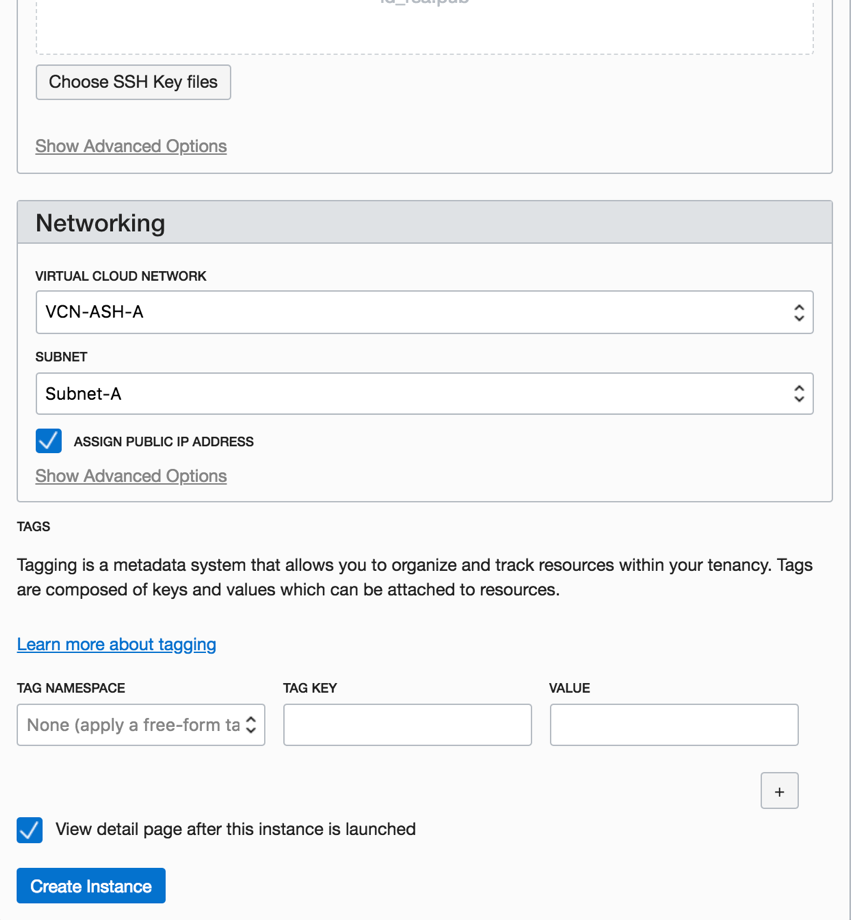

The following is intended to outline our general product direction. It
is intended for information purposes only, and may not be incorporated into any contract. It is not a commitment to deliver any material, code, or functionality, and should not be relied upon in making purchasing decisions. The development, release, and timing of any features or functionality described for Oracle’s products remains at the sole discretion of Oracle.

# Virtual Cloud Network, Compute and Block Service Practice

Table of Contents

[Overview 2](#overview)

[Pre-Requisites 2](#pre-requisites)

[Practice 1: Generate SSH Keys 3](#practice-1-generate-ssh-keys)

[Practice 2: Signing in OCI Console](#practice-2-signing-in-oci-console)

[Practice 3: Create a Virtual Cloud Network
7](#practice-3-create-a-virtual-cloud-network)

[Practice 4: Creating a Web Server on a Compute Instance
11](#practice-4-creating-a-web-server-on-a-compute-instance)

[Practice 5: Expand the Compute Instance Storage using Block Volume
18](#practice-5-expand-the-compute-instance-storage-using-block-volume)

[Summary](#summary)

# Overview

Oracle has built Oracle Cloud Infrastructure(OCI) platform that can run
both Oracle workloads and cloud native applications. In this hands on lab, we will walk through getting an apache webserver running on a compute instance on OCI. The purpose of this lab is to get familiar with Oracle Cloud Infrastructures primitives. At the end of this lab, you will be familiar with creating a network, launching an instance, and accessing the instance.

## Pre-Requisites 

  - Oracle Cloud Infrastructure account credentials (User, Password, and
    Tenant)

## Practice 1: Generate SSH Keys

Generate SSH keys to be used later while launching an instance.

### MAC/LINUX 

 a. Generate ssh-keys for your machine if you don’t have one. As long as an id\_rsa and id\_rsa.pub key pair is present they can be reused. By default these are stored in \~/.ssh/
    
  >  $ ssh-keygen

b. Make sure permissions are restricted, sometimes ssh will fail if
    private keys have permissive permissions.
    
   > $ chmod 0700 \~/.ssh  
    $ chmod 0600 \~/.ssh/id\_rsa  
    $ chmod 0644 \~/.ssh/id\_rsa.pub

### FOR WINDOWS

a.  Install git for windows. Download
    <https://github.com/git-for-windows/git/releases/download/v2.13.0.windows.1/Git-2.13.0-64-bit.exe>
    and install.

b.  Open Git-bash:
    

c.  Generate ssh-keys by running this command in Git Bash

> $ ssh-keygen  
> Generating public/private rsa key pair.  
> Enter file in which to save the key
> (/c/Users/username/.ssh/id\_rsa):  
> Created directory '/c/Users/username/.ssh'.  
> Enter passphrase (empty for no passphrase):  
> Enter same passphrase again:  
> Your identification has been saved in
> /c/Users/username/.ssh/id\_rsa.  
> Your public key has been saved in
> /c/Users/username/.ssh/id\_rsa.pub.  
>   
> **Note**: In Git-Bash, C:\\Users\\username\\ is shown as
> /c/Users/username/

## Practice 2: Signing in OCI Console

**Overview**

In this practice, you sign in to the Oracle Cloud Infrastructure console using your credentials.

Assumptions

**Note:** Some of the UIs might look a little different than the screenshots included in the instructions, but you can still use the instructions to complete the hands-on labs.

**Before You Begin**

To sign in to the Console, you need the following:

- Tenant, User name and Password

- URL for the Console: [https://console.us-ashburn-1.oraclecloud.com/](https://console.us-ashburn-1.oraclecloud.com/)

- Any browser from the supported browsers list (Recommended)

**Note:**

- **For this lab we use _cloud.admin_ and <your-name@domain.com> as the user name to demonstrate the scenarios. You must use your cloud.admin when you perform these tasks.**

- Oracle Cloud Infrastructure supports the latest versions of Google Chrome, Firefox and Internet Explorer 11.

- When you are provisioned, you will receive a customized URL for your organization. For example, https://console.us-ashburn-1.oraclecloud.com_?tenant="your-tenant-id"

- If you omit the tenant argument, the system will ask you to input your tenancy before you can log in.

**Duration: 5 minutes**

**Tasks**

**1** - Sign In

 a) Open a supported browser and go to the Console URL. For example, [https://console.us-ashburn-1.oraclecloud.com](https://console.us-ashburn-1.oraclecloud.com).

 b) Enter your tenant name: <Tenant> and click **Continue**

 c) Oracle Cloud Infrastructure is integrated with Identity Cloud Services, you will see a screen validating your Identity Provider. You can just click **Continue**.

 

 d) Enter your user name and password

 - **Username:** cloud.admin
 - **Password:** _instructor will provide password_

 

When you sign in to the Console, the home page is displayed.

 

The home page gives you quick links to the documentation and to Oracle Support.

## Practice 3: Create a Virtual Cloud Network

**Overview**

A Virtual Cloud Network (VCN) is a virtual version of a traditional
network—including subnets, route tables, and gateways—on which your compute instances run. Customers can bring their network topology to the cloud with VCN. Creating a VCN involves a few key aspects such as:

 - Allocate a private IP block for the cloud (CIDR range for the VCN).
    Customers can bring their own RFC1918 IP addresses.
    
 - Create Subnets by partitioning the CIDR range into smaller networks (sub networks for front end, back end, database)
 
 - Create an optional Internet Gateway to connect VCN subnet with
    Internet. Instances created in this subnet will have a public IP
    address.
 - Create Route table with route rules for Internet access
 - Create Security List to allow relevant ports for ingress and egress
    access

>**Note:** Some of the UIs might look a little different than the screenshots included in the instructions, but you can still use the instructions to complete the hands-on labs.

**Duration: 5 minutes**

**Tasks**

 a. Create a Virtual Cloud Network with Public Subnets

 - One public subnet per Availability Domain

 - An Internet Gateway

 - A corresponding route rule in the default route table

 - The default security list

 - The default set of DHCP options

> **Note:** You can launch one or more compute instances in a subnet.
> Each instance gets both a public and private IP address. The launch
> instance dialog now has a check box for choosing whether the instance has a public IP address.
> 
> You can communicate with the instances over the Internet via the
> public IP address from your on-premises network.

b. Open the Console, click **Networking**.

c. Select a compartment on the left that you have permission to work in.

d. Click **Create Virtual Cloud Network**.

Enter the following details:

**Create in Compartment:** This field defaults to the currently selected compartment. Select the compartment you want to create the VCN in, if not already selected.

**Name:** Enter a name for your cloud network (for example, VCN-DEMO).

> **Note:** Enter a friendly name for the cloud network. It doesn't have
> to be unique, and it cannot be changed later in the Console (but you
> can change it with the API).

Select **Create Virtual Cloud Network plus related resources**. The
dialog box expands to list the items that will be created with your
cloud network.

>**Note:** This option is the quickest way to get a working cloud network in the fewest steps.

Scroll to the bottom of the dialog box and click **Create Virtual Cloud
Network**.

A confirmation page displays the details of the cloud network that you
just created.

For example, the cloud network above has the following resources and
characteristics:

  - CIDR block range of 10.0.0.0/16

  - An Internet Gateway

  - A route table with a default route rule to enable traffic between
    VCN and the Internet Gateway

  - A default security list that allows specific ingress traffic to and
    all egress traffic from the instance

  - A public subnet in each Availability Domain

  - The VCN will automatically use the Internet and VCN Resolver for DNS

## Practice 4: Creating a Web Server on a Compute Instance 

**Overview**

Oracle Cloud Infrastructure Compute  lets you provision and manage compute hosts, known as  instances. You can launch instances as needed to meet your compute and application requirements. After you launch an instance, you can access it securely from your computer, restart it, attach and detach volumes, and terminate it when you're done with it. Any changes made to the instance's local drives are lost when you terminate it. Any saved changes to volumes attached to the instance are retained.

Oracle Cloud Infrastructure  offers both Bare Metal and Virtual Machine instances:

-   **Bare Metal**  - A bare metal compute instance gives you dedicated physical server access for highest performance and strong isolation.
-   **Virtual Machine**  - A Virtual Machine (VM) is an independent computing environment that runs on top of physical bare metal hardware. The virtualization makes it possible to run multiple VMs that are isolated from each other. VMs are ideal for running applications that do not require the performance and resources (CPU, memory, network bandwidth, storage) of an entire physical machine.

An  Oracle Cloud Infrastructure  VM compute instance runs on the same hardware as a Bare Metal instance, leveraging the same cloud-optimized hardware, firmware, software stack, and networking infrastructure.

>**Note:** Some of the UIs might look a little different than the screenshots included in the instructions, but you can still use the instructions to complete the hands-on labs.

**Duration: 15 minutes**

**Tasks**

a.  Navigate to the **Compute** tab and click **Create Instance**. We will launch a VM instance for this lab.

The launch browser will automatically fill in the details for launching a single Oracle Linux. Please check each field for better understanding. 

 - Name of the instance
 - Shape of Instance (VM.Standard 1.1 or VM.Standard1.2) or the shape available for your tenancy
 - Availability Domain to launch the instance (AD1, AD2 or AD3)
 - Boot Volume - Oracle-Provided OS Image
 - Image Operating System - Oracle Linux 7.5
 - Shape type : Virtual Machine
 - Image Version : Latest
 - Boot Volume Configuration: Use default
 - ssh keys : Attach the .pub key created in the Practice-1
 - Networking 
	 - VCN Name: VCN you created in Practice 3
	 - Subnet: Any subnet among the three ADs

Launching an instance is simple and intuitive with few options to
select. Provisioning of the compute instance will complete in less than
a minute and the instance state will change from provisioning to
running.

b.  Once the instance state changes to Running, you can SSH to the Public IP address of the instance.
    

c.  To connect to the instance, you can use ‘Terminal’ if you are using
    MAC or Gitbash if you are using Windows.

You can use the following command to SSH into the OCI VM on UNIX-style system (including Linux, Solaris, BSD, and OS X).

**Note:** *For Oracle Linux VMs, the default username is **opc**

> $ ssh –i \</path/privateKey\> opc@\<PublicIP\_Address\>

For windows, use a tool like GitBash to login into the Linux instance.

> $ ssh -i \</path/privateKey\> opc@\<PublicIP\_Address\>

d.  For this lab, we are going to install an Apache HTTP Webserver and try to connect to it over the public internet.

> Apache HTTP Server is an open-source web server developed by the Apache Software Foundation. The Apache server hosts web content, and responds to requests for this content from web browsers such as Chrome or Firefox.

SSH into the Linux instance and run following commands. 
 
- Install Apache http
> $ sudo yum install httpd -y

- Start the apache server and configure it to start after system reboots

> $ sudo apachectl start
> $ sudo systemctl enable httpd

- Run a quick check on apache configurations

> $ sudo apachectl configtest

- Create firewall rules to allow access to the ports on which the HTTP server listens.

> $ sudo firewall-cmd --permanent --zone=public --add-service=http 
> $ sudo firewall-cmd --reload

- Create an index file for your webserver
> $ sudo su
> $ echo ‘This is my webserver running on Oracle Cloud Infrastructure’ \>\> /var/www/html/index.html
> $ exit

- Navigate to http://\<PublicIPAddress\>:80 (the IP address of the Linux VM) in your browser.

> **NOTE:** It doesn’t return anything because the Virtual Cloud Network needs to open port 80 for the traffic to the reach the Linux VM.

e.  Click on Virtual Cloud Network and then the VCN you created above (Training VCN). Click on **Security Lists** on the left navigation bar for the VCN. Then click on the **Default Security List**. Here you need to open port 80. Click on **Edit all rules**.

- Click on +Add Rule and add the following values as shown below under the Allow Rules for Ingress.

> **Source CIDR**: 0.0.0.0/0
> **Protocol:** TCP
> **Source Port Range:** All
> **Destination Port Range:** 80

- Click on **Save Security List Rules** at the bottom.

f. Navigate to \<http://\<publicIPAddress:80\> (the IP address of the Linux VM) in your browser. Now you should see the index page of the webserver we created above.

**Troubleshooting: **

If you are unable to see the webserver on your browser, possible
scenarios include

  - VCN Security Lists is blocking traffic, Check VCN Security List for
    ingress rule for port 80

  - Firewall on the linux instance is blocking traffic
    
      - $sudo firewall-cmd --zone=public --list-services (this should
        show http service as part of the public zone)
    
      - $sudo netstat -tulnp | grep httpd (an httpd service should be
        listening on the port 80, if it’s a different port, open up that
        port on your VCN SL)

  - Your company VPN is blocking traffic

## Practice 5: Expand the Compute Instance Storage using Block Volume 

**Overview**

A common usage of Block Volume is adding storage capacity to an Oracle Cloud Infrastructure instance. Once you have launched an instance and set up your cloud network, you can create a block storage volume through the Console or API. Once created, you attach the volume to an instance using a volume attachment. Once attached, you connect to the volume from your instance's guest OS using iSCSI or. The volume can then be mounted and used by your instance.

>**Note:** Some of the UIs might look a little different than the screenshots included in the instructions, but you can still use the instructions to complete the hands-on labs.

**Duration: 10 minutes**

**Tasks**

a. Navigate to the Block Volume Service and click on Block Volume.

b. In Bock Volume service, Click on Create Block Volume and provide the following details.

**Compartment** : \<Your Compartment Name\>

**Name**: A user-friendly name or description.

**Availability Domain**: It must be the same as the instance with which
it is to be attached

**Size**: Please choose **50 GB**. (Must be between **50 GB** and **32 TB**. You can choose in 1 GB increments within this range. The default is 1024 GB)

**Backup Policy**: **Gold**

> Quick recap on the block volume backup policies: There are three
> predefined backup policies, Bronze, Silver, and Gold Each backup
> policy has a set backup frequency and retention period.
> 
> **Bronze Policy:** The bronze policy includes monthly incremental
> backups, run on the first day of the month. These backups are retained
> for twelve months. This policy also includes a full backup, run yearly
> on January 1st. Full backups are retained for five years.
> 
> **Silver Policy:** The silver policy includes weekly incremental
> backups that run on Sunday. These backups are retained for four weeks.
> This policy also includes monthly incremental backups, run on the
> first day of the month and are retained for twelve months. Also
> includes a full backup, run yearly on January 1st. Full backups are
> retained for five years.
> 
> **Gold Policy**: The gold policy includes daily incremental backups.
> These backups are retained for seven days. This policy also includes
> weekly incremental backups that run on Sunday and are retained for
> four weeks. Also includes monthly incremental backups, run on the
> first day of the month, retained for twelve months, and a full backup,
> run yearly on January 1st. Full backups are retained for five
> years.

Leave the tags options as it is and **CLICK** on **Create Block
Volume**.

The volume will be ready to attach once its icon no longer lists it as
PROVISIONING in the volume list.

c.  Once the Block Volume is created, you can attach it to the VM instance you just launched. When you attach a block volume to a VM instance, you have two options for attachment type, iSCSI or paravirtualized.

> Paravirtualized attachments simplify the process of configuring your block storage by removing the extra commands required before connecting to an iSCSI-attached volume. The trade-off is that IOPS performance for iSCSI attachments is greater than that for paravirtualized attachments, so you need to consider your requirements when selecting a volume's attachment type.

d.  Go to the Compute instance tab, and navigate to the VM instance and click on the Attach Block Volume button.

e.  Select the volume created from the drop down menu and choose
 **iSCSI.** Once it gets attached after provisioning, the console
    shows the disk is attached. Once the block volume is attached, you can navigate to view the iSCSI details for the volume in order to connect to the volume. 
 
f. Click on the ellipsis and then click **iSCSI Command and Information link.** Connect to the instance through SSH and **run the iSCSI ATTACH COMMANDS** as provided (shown below).

    

g. Click on **COPY** to copy all commands and ssh into the compute instance and run all these commands by pasting it in the terminal.

h. Once the disk is attached, you can run the following commands to
    format the disk and mount it.

> $ ssh –i \</path/privateKey\> opc@\<PublicIP\_Address\>
> $ lsblk

>When mounting a storage volume for the first time, you can format the storage volume and create a single, primary partition that occupies the entire volume by using fdisk command (Caution: Using fdisk to format the disk deletes any data on the disk).

- Use mkfs to create a file system on the storage volume. Once filesystem is created, create a new mount point and mount the new disk.

> $ sudo mkfs -t ext4 /dev/sdb
 Press y when prompted
$ sudo mkdir /mnt/disk1
$ sudo mount /dev/sdb /mnt/disk1
$ lsblk

## Summary

In this lab, you were able to quickly create a Virtual Cloud Network in
the cloud, launch a linux instance, install an apache webserver and
successfully access the server by allowing TCP traffic on port 80 in the
Security Lists of the Virtual Cloud Network. 

You were also able to create a block disk and attach it your linux instance. 

