## Machine Learning on Oracle Cloud Infrastructure

## Table of Contents 

[Overview](#overview)

[Pre-Requisites](#pre-requisites)

### H20ai Lab 

[Practice 1: Provision a GPU instance on OCI](#practice-1-provision-a-gpu-instance-on-oci)

[Practice 2: Access the GPU instance](#practice-2-access-the-gpu-instance)

[Practice 3: Access H2Oai application](#practice-3-access-h2oai-application)

[Practice 4: Loading an adult census dataset](#practice-4-loading-an-adult-census-dataset)

### TensorFlow Lab

[Practice 1: Open a second Gitbash window](#practice-1-open-a-second-gitbash-window)

[Practice 2: Pull the TensorFlow docker image](#practice-2-pull-the-tensorflow-docker-image)

[Practice 3: Use TensorFlow to recognize the visual contents of images](#practice-3-use-tensorflow-to-recognize-the-visual-contents-of-images)

[Practice 4: Try Oracle Cloud Infrastructure for FREE](#practice-4-try-oracle-cloud-infrastructure-for-free)

## Overview
For this Machine Learning session you will complete two Hands-on-Labs

- **H20ai Lab:** In this lab you will experience the first part of a typical Machine Learning process which is training the model, then you will execute the second part of the process which is known as inferencing. We are going to use a partner tool, H2O.ai on top of one of our **Pascal GPU Bare Metal machines** to run this lab.

- **TensorFlow Lab:** This is a demo to show TensorFlow Image Recognition using the power of our **Pascal GPU Bare Metal machine** in order to recognize the visual contents of images.

The key topics touched upon by both labs are:

- To showcase Nvidia-Docker as a means of containerising ML workloads to leverage GPU (because normal docker cannot  _see_  the GPU).
- To show how quickly the GPU can process ML image recognition workloads.

## Pre-Requisites 

- Access to a GPU instance in Oracle Cloud Infrastructure
- SSH Client

## H20.ai Lab

## Practice 1: Provision a GPU instance on OCI

1. Open your browser and navigate to the OCI Console by clicking on: [http://bit.ly/ociash](http://bit.ly/ociash)
2. Enter the following credentials:
    - **Cloud Tenancy:** hpctraininglab
    - **Username:** _Instructor will provide your username_
    - **Password:** *GTC_OCI_gpu_2019!*

    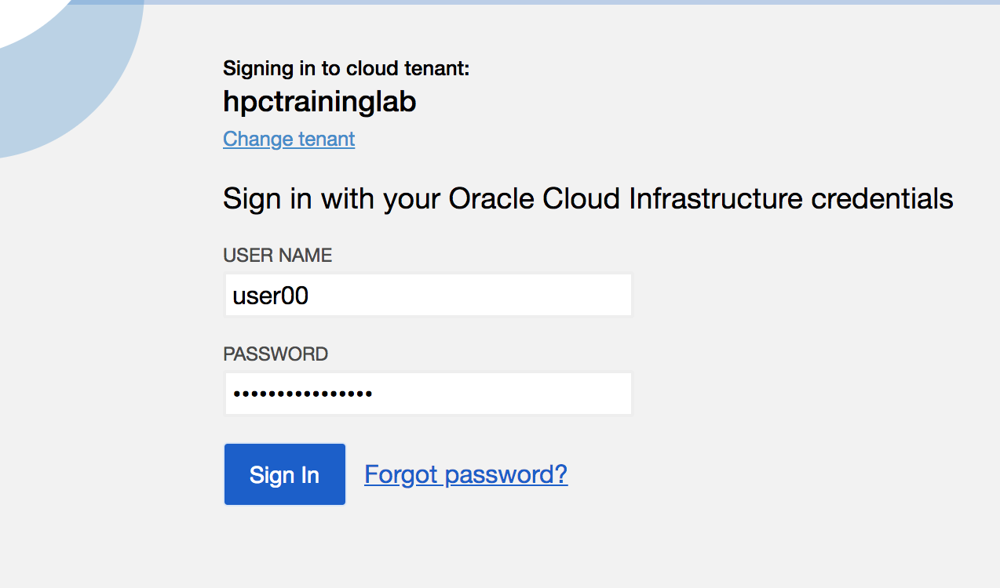

3. On the left corner click on the **Menu** then click **Compute** and **Instances**:
   
    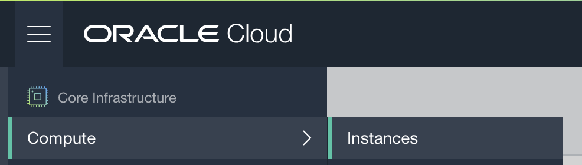

4. On the left side, choose a compartment your user has permission to work, and then click **Create Instance.**
   
    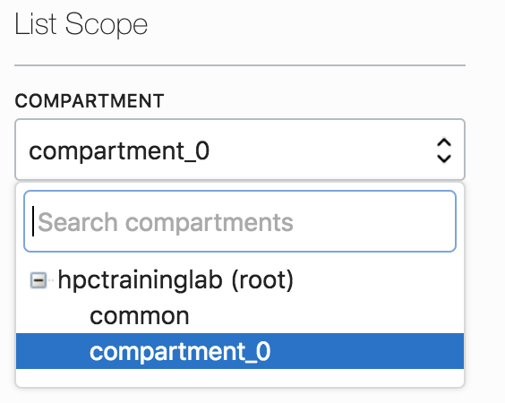
    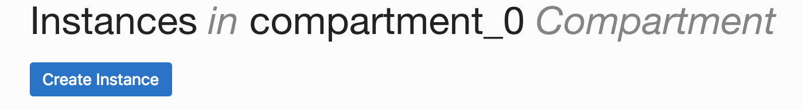

5. In the Create Instance dialog box enter the following information:
      - **Name:** H2Oai-demo
      - **Availability Domain:** AD3
      - **Image Source:** Click on **Change Image Source** and select **Custom Images**. Now select the **common** compartment and check mark the image **H2Oai-GPU-Image**. Click **Select Image**
  
      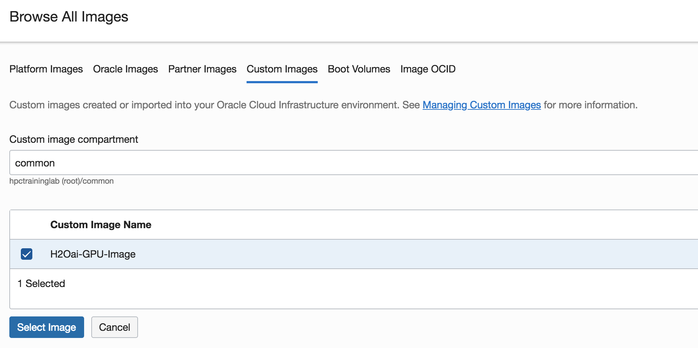

      - **Choose Instance Type:** Bare Metal Machine
      - **Choose Instance Shape:** Change the Shape and select BM.GPU2.2
      - **Add SSH Key:** Choose the SSH file name labkey-public.pub from your Desktop Folder.
      - **Virtual Cloud Network Compartment:** Select **common** compartment
      - **Virtual Cloud Network:** VCN-GPU-DEMO
      - **Subnet Compartment:** Select **common** compartment
      - **Subnet:** subnet-gpu (Regional)
      - Click **Create**
  
     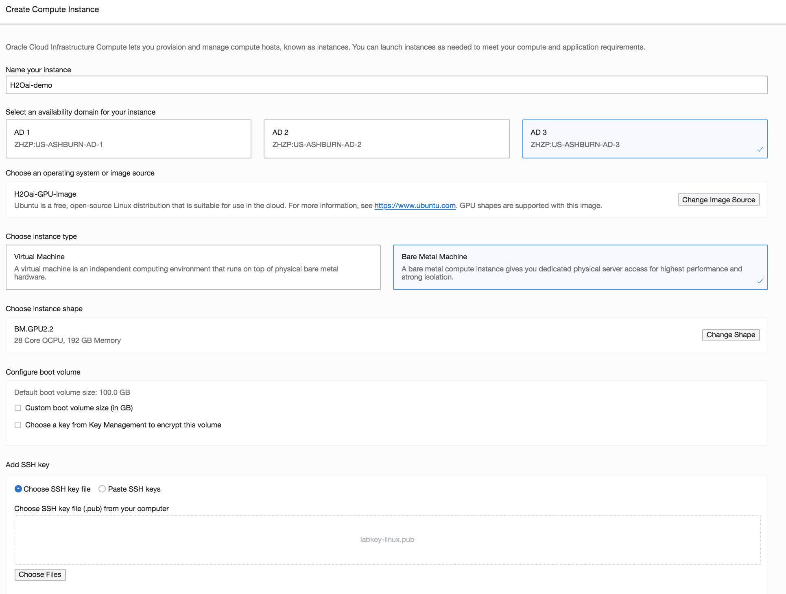
     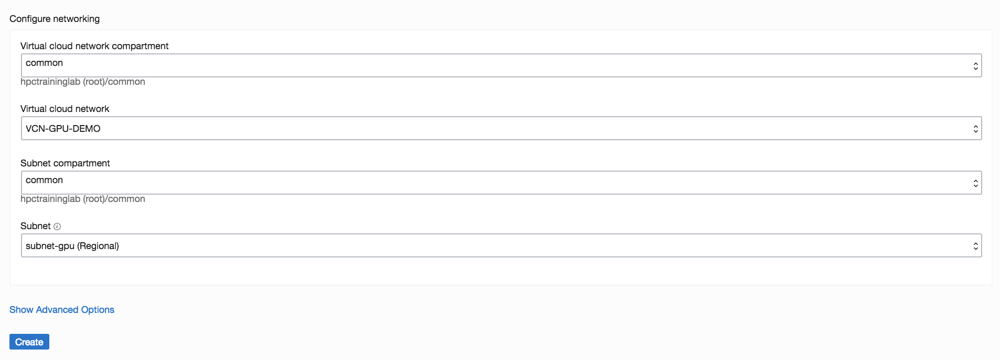

## Practice 2: Access the GPU instance

1. On Gitbash terminal use SSH command to connect to the GPU instance:

   - **Username**: *ubuntu*
   - **IP address**: *Use the Public IP address of the instance you created*


    ``# ssh -i ~/Desktop/labkey-private ubuntu@<Public_IP_Address>``

    ``Please enter your NGC APIkey to login to the NGC Registry``

    _``<<Hit enter to skip>>``_


2. Check if your H2Oai docker is running by typing:

    ``# nvidia-docker ps`` 

## Practice 3: Access H2Oai application

3. Open a browser and access:

    ``http://<Public_IP_Address>:12345``

4. Scroll at the bottom of the page and Agree with the terms:

    

5. Enter the following credentials and click Sign In:

    - **Username:** admin
    - **Password:** admin

    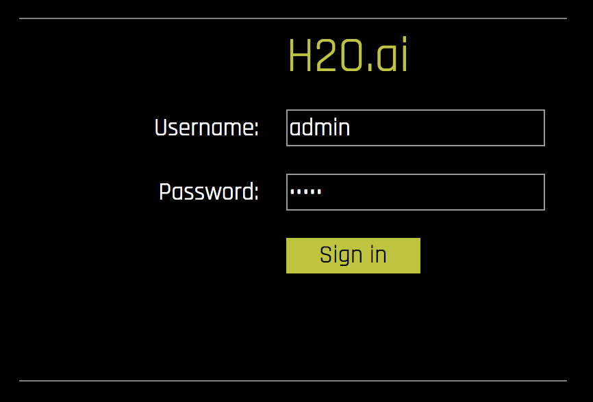

    

## Practice 4: Loading an adult census dataset

1. Click on Add Dataset and select Amazon S3

    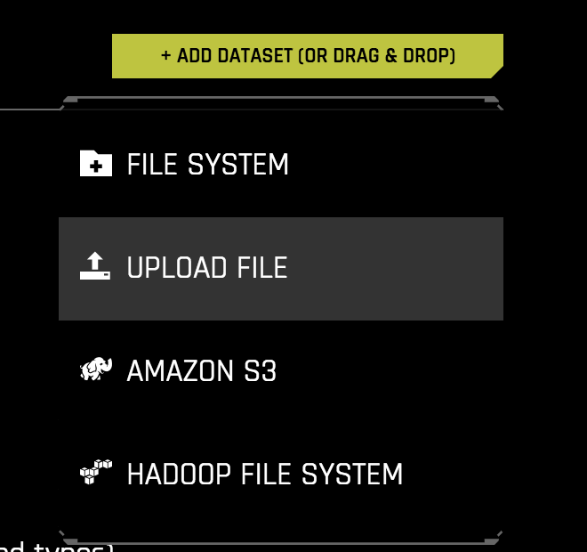

2. Select census_income by typing: `s3://h2o-public-test-data/smalldata/census_income/`

    

3. Select adult_test.csv and click to import selection

    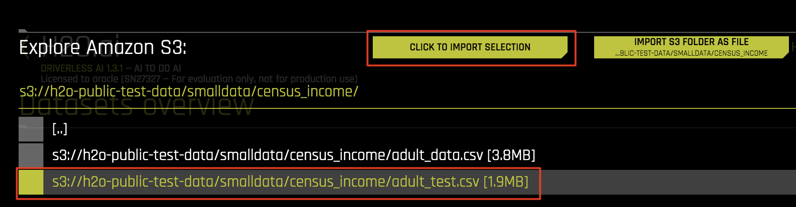

4. After the data is imported, click on **Click for Actions** and select **Visualize**. 

    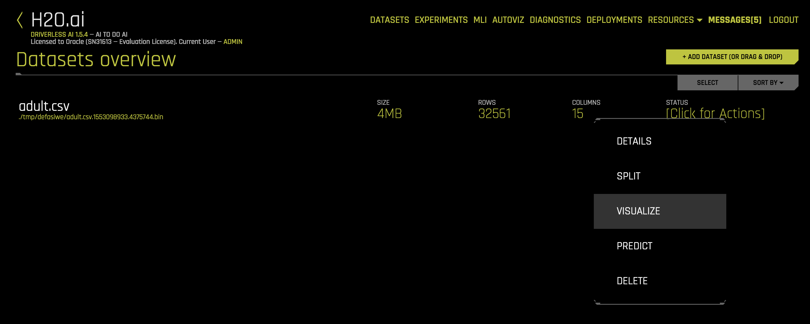

5. Select a few of the plots to see how the data interacts. For example **Correlation Graph**

    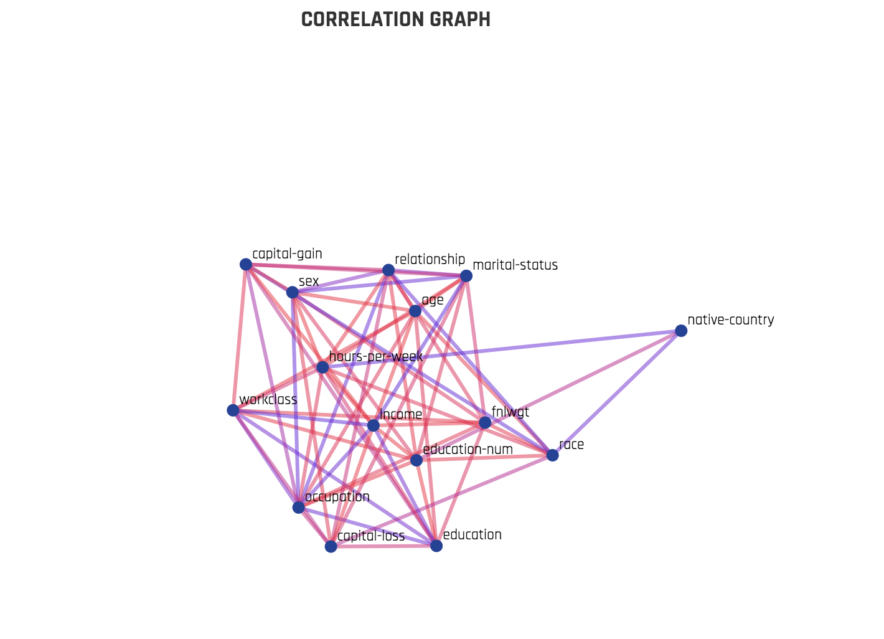

6. Now lets launch an experiment. Click on **datasets** at the top of the page, then **click for actions** but this time select **Predict**

    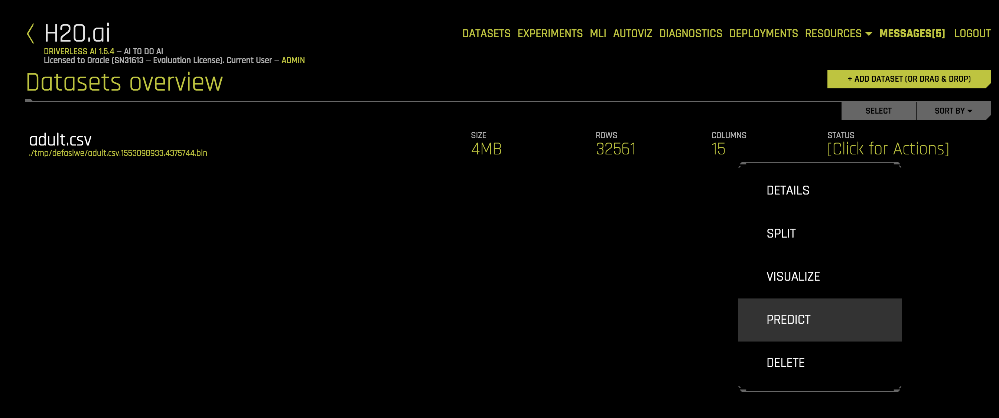

7. If a message appears asking if you want to do a tour of H2O, just click **No**.

8. Click **Select target column** and select **Age**

    
    

9. Make sure **Enable GPU** is highlighted in yellow and then click **Launch Experiment**

    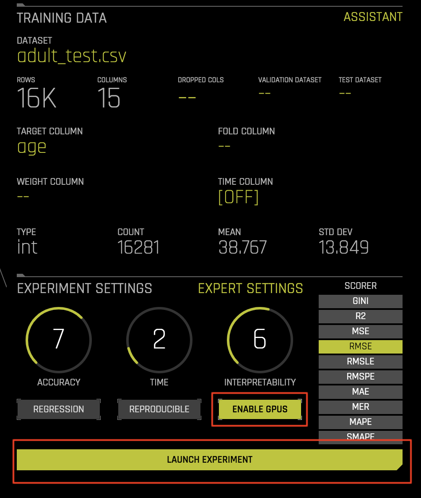

10. Click on **GPU Usage** on the right side of the screen to see GPUs working. This simulation will take about 15 minutes to complete. 

    

11. When the model is complete, click **Interpret this Model** 

    
    

12. On the left side of the page click on **Dashboard**

    

## TensorFlow Lab

## Practice 1: Open a second Gitbash window

1. Rgith click on your current gitbash window and select **New**

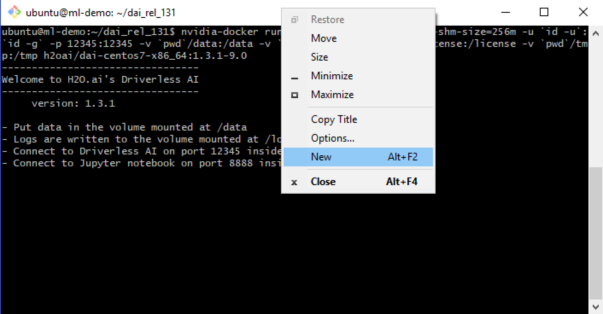

2. On terminal use SSH command to connect to the GPU instance:

   - **Username**: *ubuntu*
   - **IP address**: *Use the Public IP address of the instance you created*


    ``# ssh -i ~/Desktop/labkey-private ubuntu@<Public_IP_Address>``

    ``Please enter your NGC APIkey to login to the NGC Registry``

    _``<<Hit enter to skip>>``_

## Practice 2: Pull the TensorFlow docker image

1. Run the following commands to pull and run the docker image:
   
```
# sudo su
# echo nameserver 169.254.169.254 >> /etc/resolv.conf
# nvidia-docker run -dti -p 80:80 --restart always ramnathn/oci-nvidia-docker-gpu-tensorflow-demo node callpy.js

```

**Note**: This will pull the docker image `oci-nvidia-docker-gpu-tensorflow-demo` and will run the docker on port 80. This will take around 5 minutes to complete.

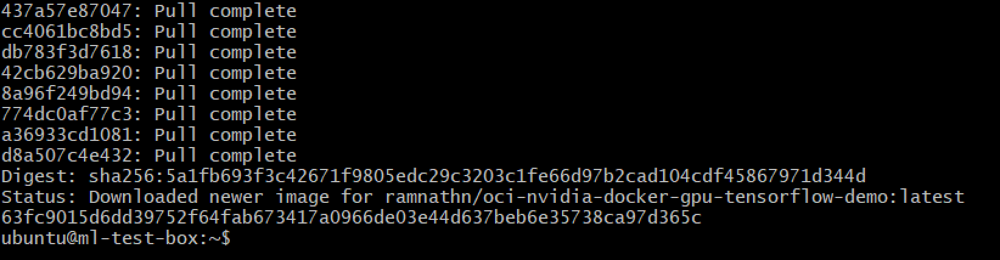

1. Open a browser and access the TensorFlow application by typing: `http://<Public_IP_Address>` 


3. Back to gitbash and type the following command:

```
# watch -n 1 nvidia-smi
```

This will show that the GPU is actually getting used by the image recognision process. Keep that terminal open and running.

## Practice 3: Use TensorFlow to recognize the visual contents of images

We will try to solve a problem which is as simple and small as possible while still being difficult enough to teach us valuable lessons. All we want the GPU instance to do is the following: when presented with an image, our system should analyze it and score the images. Our goal is for our model to pick the correct category as often as possible. This task is called image classification. 

For that we will use two images. Please download those images and save to your Desktop and unzip it:

- [cat image](https://raw.githubusercontent.com/flavio-santino/learning-library/master/oci-library/OOW-2018/ML-GPU/img/cat.jpg.zip)

- [navy image](https://raw.githubusercontent.com/flavio-santino/learning-library/master/oci-library/OOW-2018/ML-GPU/img/navy.jpg.zip)

1. Go back to your broswer where TensorFlow is running and click on **Choose File** at uper-left corner of your screen:

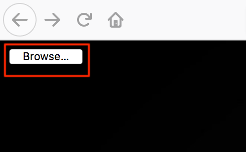

2. Upload the cat image image first. Once you click upload, the app will run the TensorFlow inference classification process and display the image score. As you can see it was classified as cat. 


3. Now, lets upload our second image (navy.jpg). This image has more elements to show. You can notice that now, it recognize the military uniform, the suits and even the type of the tie!!


4.  After you finished this lab please go ahead and terminate your instance.
     
## Practice 4: Try Oracle Cloud Infrastructure for FREE 

Sign up for the free Oracle Cloud Infrastructure trial account. 
https://cloud.oracle.com/tryit

