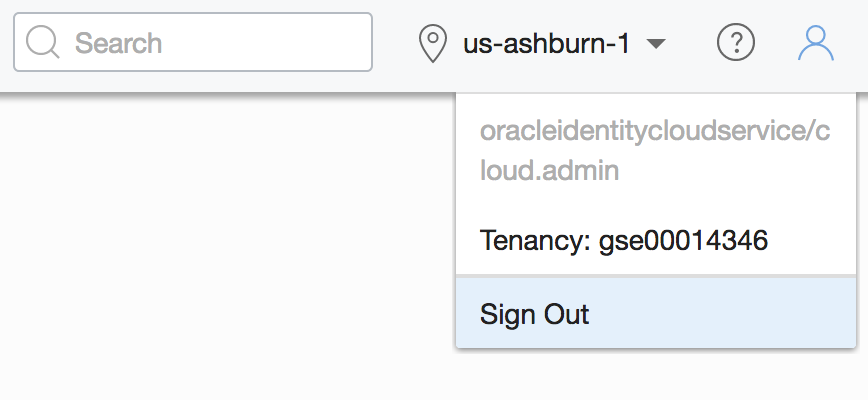

# IAM Practice - Identity and Access Management
  
## Table of Contents

[Overview](#overview)

[Pre-Requisites](#pre-requisites)

[Practice 1: Signing in to the Console ](#practice-1-signing-in-to-the-console)

[Practice 2: Managing Users, Groups and Policies to Control Access](#practice-2-managing-users-groups-and-policies-to-control-access)

**Note:** *Some of the UIs might look a little different than the screen shots included in the instructions, but you can still use the instructions to complete the hands-on labs.*

## Overview

Oracle Cloud Infrastructure Identity and Access Management (IAM) Service lets you control who has access to your cloud resources. You control the types of access a group of users has and to which specific resources. The purpose of this lab is to give you an overview of the IAM Service components and an example scenario to help you understand how they work together.

## Pre-Requisites

- Oracle Cloud Infrastructure account credentials (User, Password, and Tenant) 
- To sign in to the Console, you need the following:
  -  Tenant, User name and Password
  -  URL for the Console: [https://console.us-ashburn-1.oraclecloud.com/](https://console.us-ashburn-1.oraclecloud.com/)
  -  Oracle Cloud Infrastructure supports the latest versions of Google Chrome, Firefox and Internet Explorer 11 


## Practice-1: Signing in to the Console 

**Overview**

In this practice, you sign in to the Oracle Cloud Infrastructure console using your credentials.

1. Open a supported browser and go to the Console URL:  [https://console.us-ashburn-1.oraclecloud.com](https://console.us-ashburn-1.oraclecloud.com).

2. Enter your tenant name and click **Continue**

   

3. Oracle Cloud Infrastructure is integrated with Identity Cloud Services, you will see a screen validating your Identity Provider. Click **Continue**.

   

4. Enter your user name and password

    - **Username:** *instructor will provide username*
    - **Password:** *instructor will provide password*

   

5. When you sign in to the Console, the dashboard is displayed.

   


## Practice-2: Managing Users, Groups and Policies to Control Access

#### Overview

A user's permissions to access services comes from the _groups_ to which they belong. The permissions for a group are defined by policies. Policies define what actions members of a group can perform, and in which compartments. Users can access services and perform operations based on the policies set for the groups of which they are members.

We'll create users, groups, and policies to understand the concept.

1. Sign in to the console, on the **Menu** click **Identity**, then select **Groups**.

2. Click **Create Group**.

3. In the **Create Group** dialog box, enter the following:

   - **Name:** Enter a unique name for your group such as "oci-group” Note that the group name cannot contain spaces.
   - **Description:** Enter a description (for example, “New group for oci users”).
   - Click **Submit**.

   

   

4. Now, let’s **create a policy** that gives your group permissions in your assigned compartment. For example, creates a policy that gives permission to compartment **Demo** to members or group oci-group:

   a) On the **Menu** click **Identity**, and then click **Policies**.

   b) On the left side, select **Demo** compartment.

   c) Click **Create Policy**.

   d) Enter a unique **Name** for your policy (For example, "Policy-for-oci-group") Note that the name can NOT contain spaces.

   e) Enter a **Description** (for example, "Policy for OCI Group").

   f) Enter the following **Statement**:

   ```
   Allow group oci-group to manage all-resources in compartment Demo
   ```

   g) Click **Create**.

   

5. Create a New User

   a) On the **Menu** click **Identity**, and then click **Users**.

   b) Click **Create User**.

   c) In the **New User** dialog box, enter the following:

   - **Name:** Enter a unique name or email address for the new user. For Example: yourname@domain.com
    _This value is the user's login name for the Console and it must be unique across all other users in your tenancy._
   - **Description:** Enter a description. For example, New oci user.

      
    
   d) Click **Create**.

6. Set a Temporary Password for the newly created User

   a) From the list of users, click on **the user that you created** to display its details.

   b) Click **Create/Reset Password**.  
   
   

   c) In the dialog, click **Create/Reset Password**.

   

   d) The new one-time password is displayed.

   

   e) Click the **Copy** link and then click **Close**. Make sure to copy this password to your notepad.

   f) Click **Sign Out** from the user menu and log out of the admin user account.

   

7. Sign in as the new user using a different web browser window.

   a) Go to [https://console.us-ashburn-1.oraclecloud.com](https://console.us-ashburn-1.oraclecloud.com).

   b) Enter the Tenant name, if prompted.

   c) This time, you will sign in using **local credentials box** with the user you created. Note that the user you created is not part of the Identity Cloud Services.

   d) Enter the password that you copied.

   

   **Note:** _Since this is the first-time sign-in, the user will be prompted to change the temporary password, as shown in the screen capture._

   e) Set the new password to _Welc0me2*bmcs_. Click **Save New Password**.

   


8. Verify user permissions

   a) Go to the **Menu** click **Compute** and **Instances**.

   b) Try to select any compartment from the left menu.

   c) The message “**You don’t have access to this compartment**” appears. This is normal as you did not add the user to the group where you associated the policy.

   

   d) Sign out of the Console.

9. Add User to a Group

   a) Sign in back with the admin account using the Single Sign-on (SSO) option. Click on **Menu** --> **Identity** --> **Users**.

   b) From the **Users** list, click your user (for example, user01)  to go to the user details page.

   c) Under the **Resources** menu on the left, click **Groups.**

   d) Click **Add User to Group**.

   e) From the **GROUPS** drop-down list, select the **oci-group** that you created.

   f) Click **Add**.

   

   g) Sign out.

10. Verify user permissions when a user belongs to a specific group

      a) Sign in with the local user created

      b) Go to the **Menu** click **Compute** and **Instances**.

      c) Select compartment **Demo** from the list of compartments on the left.

      

      d) There is no message related to permissions and you are allowed to create new instances

      e) Go to the **Menu** click **Identity** and select **Groups.**

      f) The message **“You don’t have access to these resources”** appears. This is expected, since your user has no permission to modify groups.

      g) Sign out.

[Back to the Top](#table-of-contents)