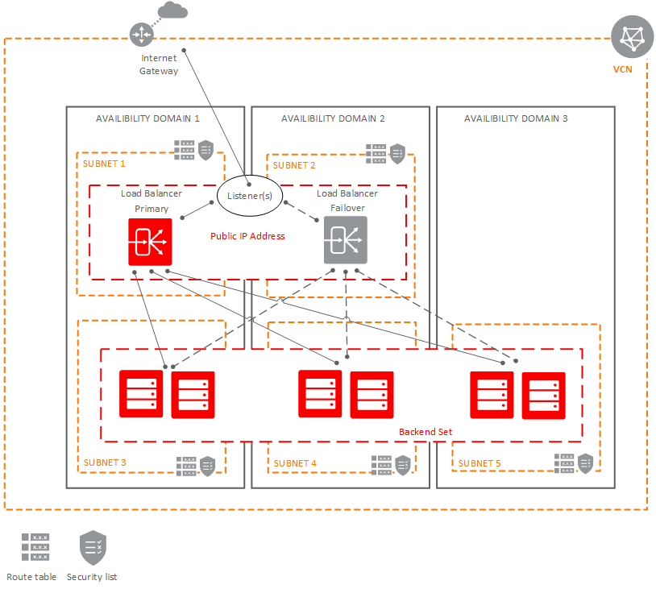
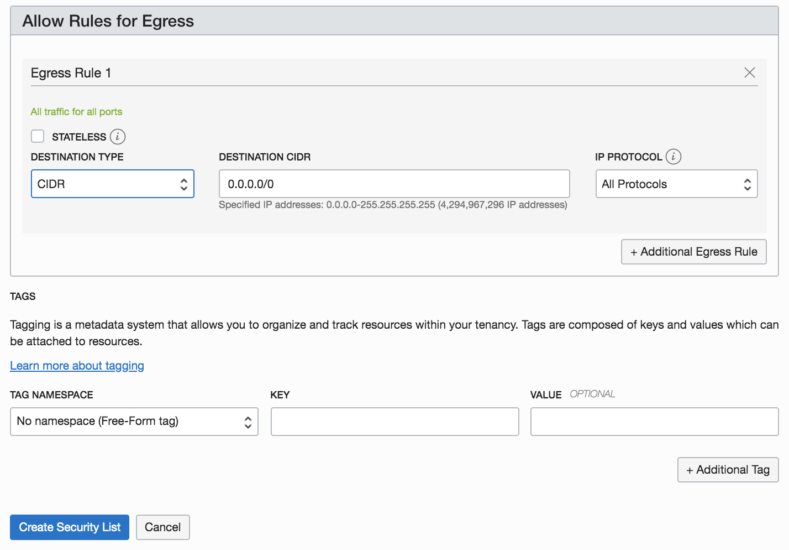
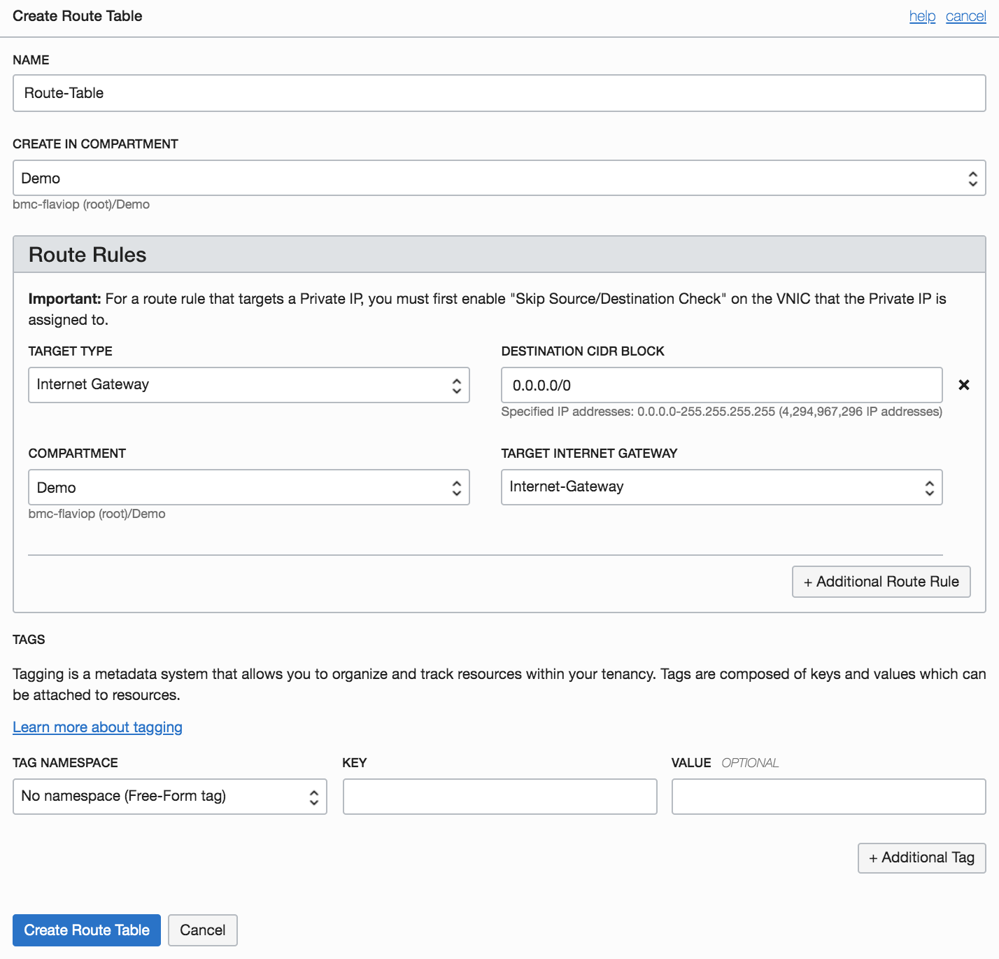
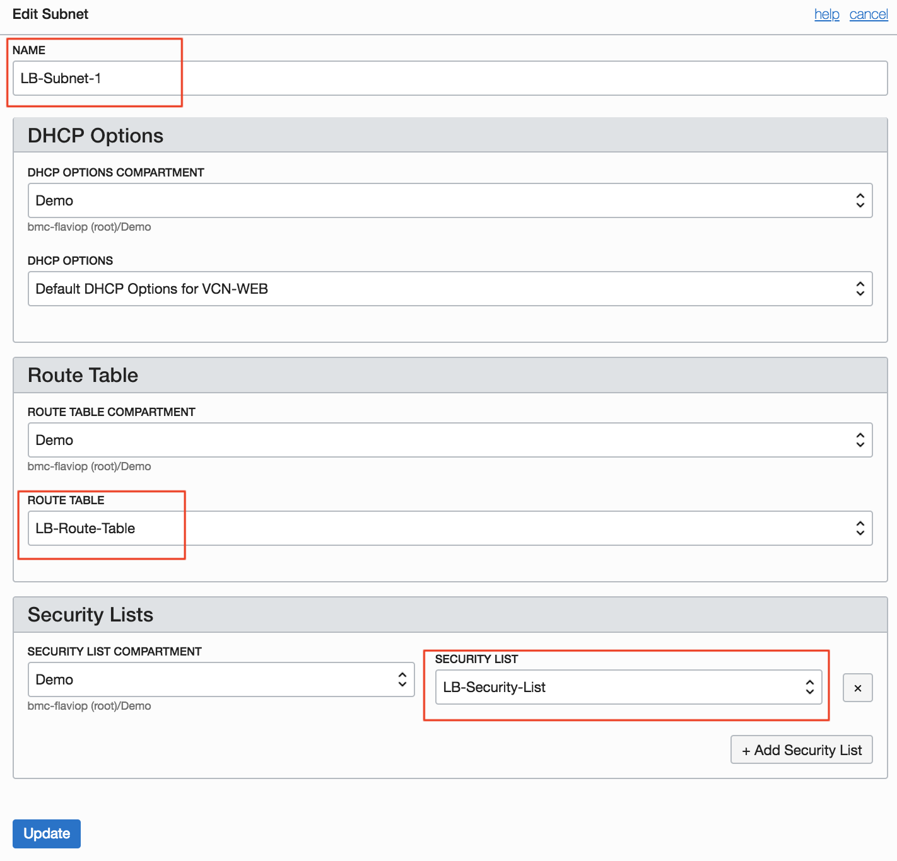
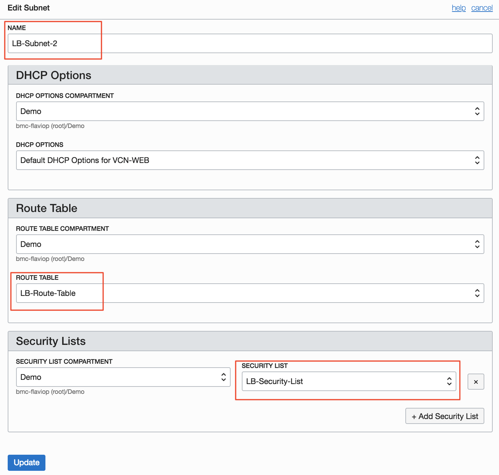
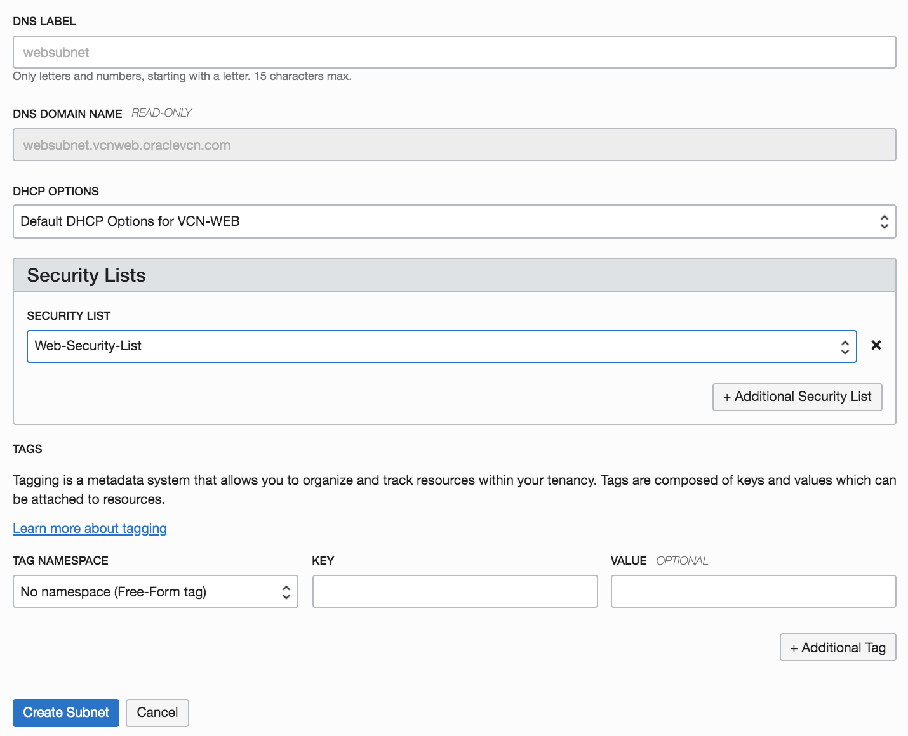
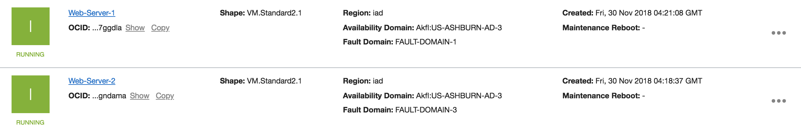
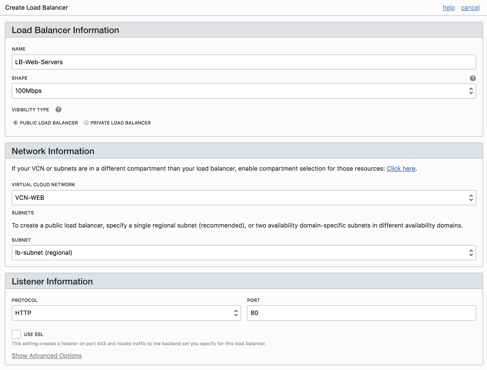
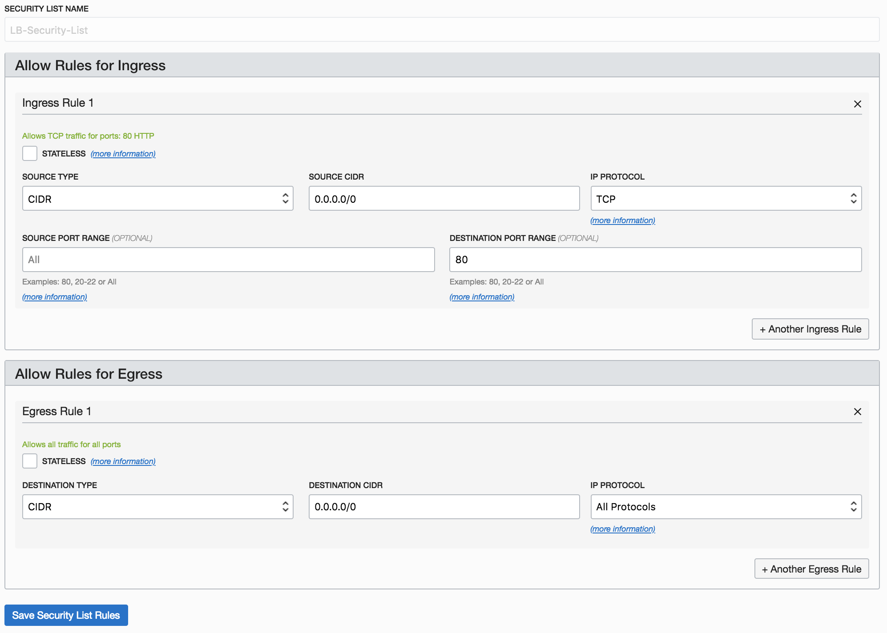
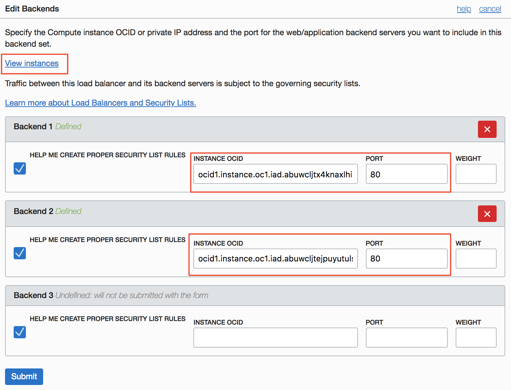

# Load Balancer


## Table of Contents

[Overview](#overview)

[Pre-Requisites](#pre-requisites)

[Practice 1: Creating Virtual Cloud Network](#practice-1-creating-virtual-cloud-network)

[Practice 2: Creating two Web Servers](#practice-2-creating-two-web-servers)

[Practice 3: Creating and Testing the Load Balancer](#practice-3-creating-and-testing-the-load-balancer)

**Note:** *Some of the UIs might look a little different than the screen shots included in the instructions, but you can still use the instructions to complete the hands-on labs.*


## Overview

The Oracle Cloud Infrastructure Load Balancing service provides automated traffic distribution from one entry point to multiple servers reachable from your virtual cloud network (VCN). The service offers a load balancer with your choice of a public or private IP address, and provisioned bandwidth.

A load balancer improves resource utilization, facilitates scaling, and helps ensure high availability. You can configure multiple load balancing policies and application-specific health checks to ensure that the load balancer directs traffic only to healthy instances. The load balancer can reduce your maintenance window by draining traffic from an unhealthy application server before you remove it from service for maintenance.

The Load Balancing service enables you to create a public or private load balancer within your VCN. A public load balancer has a public IP address that is accessible from the internet. A private load balancer has an IP address from the hosting subnet, which is visible only within your VCN. You can configure multiple listeners for an IP address to load balance transport Layer 4 and Layer 7 (TCP and HTTP) traffic. Both public and private load balancers can route data traffic to any backend server that is reachable from the VCN.

The following provide an overview of a simple Public Load Balancer:



## Pre-Requisites

- Oracle Cloud Infrastructure account credentials (User, Password, and Tenant) 
- To sign in to the Console, you need the following:
  -  Tenant, User name and Password
  -  URL for the Console: [https://console.us-ashburn-1.oraclecloud.com/](https://console.us-ashburn-1.oraclecloud.com/)
  -  Oracle Cloud Infrastructure supports the latest versions of Google Chrome, Firefox and Internet Explorer 11

## Practice-1: Creating Virtual Cloud Network

1. Click on **Menu** --> **Networking** --> **Virtual Cloud Network**
2. Click **Create Virtual Cloud Network** 

   - **Name:** *VCN-WEB*
   - **Select** *Create Virtual Cloud Network Only*
   - **CIDR Block:** *10.0.0.0/16*
   - Click *Create Virtual Cloud Network*

3. Create the following Security Lists:

   - **Security List Name:** *LB-Security-List*
   - Remove all the Ingress and Egress Rules of the *LB-Security-List*
   - Click *Create Security List* 

    

   - **Security List Name:** *Web-Security-List*
   - Click on **Additonal Ingress Rule** and enter:
       - **Source Type:** *CIDR*
       - **Source CIDR:** *0.0.0.0/0*
       - **IP Protocol:** *TCP*
       - **Destination Port Range:** *22*
   - Click on **Additional Egress Rule** and enter:
       - **Destination Type:** *CIDR*
       - **Destination CIDR:** *0.0.0.0/0*
       - **IP Protocol:** *All Protocols*
   - Click *Create Security List* 

     
     

4. Create the following Internet Gateway:

   - **Name:** *Internet-Gateway*
   - Click *Create Internet Gateway*

    

5. Create the following Route Table:

   - **Route Table Name:** *Route-Table*
   - **Target Type:** *Internet Gateway*
   - **Destination CIDR Block:** *0.0.0.0/0*
   - **Target Internet Gateway:** *Select your Internet Gateway*

    

6. Create a LB Subnet and edit by clicking on **Create Subnet**. Enter the following parameters:

   - **Name:** *lb-subnet*
   - **Subnet Type:** *Regional (Recommended)*
   - **CIDR Block:** *10.0.1.0/24*
   - **Route Table:** *Route-Table*
   - **Subnet Access:** *Public Subnet*
   - **DHCP Options:** *Default DHCP Options for VCN-WEB**
   - **Security List:** *LB-Security-List*

    
    

7. Create a Web Subnet to host your webservers by clicking on **Create Subnet**. Enter the following parameters:
   
   - **Name:** *web-subnet*
   - **Subnet Type:** *Regional (Recommended)*
   - **CIDR Block:** *10.0.2.0/24*
   - **Route Table:** *Route-Table*
   - **Subnet Access:** *Public Subnet*
   - **DHCP Options:** *Default DHCP Options for VCN-WEB**
   - **Security List:** *Web-Security-List*

    
    

## Practice-2: Creating two Web Servers

You will create two web servers that will work as backend servers for your Public Load Balancer.

1. Launch two Instances with the following configuration:

   - **Name:** *Web-Server-1*
   - **Availability Domain:** *AD 3*
   - **Shape:** *VM.Standard2.1*
   - **Subnet:** *web-subnet (Regional)* 
   - Enter your public SSH-Key
   - Click Create

    Repeat the previous steps, but this time enter the name **Web-Server-2** and select **AD 2**

    


2. Connect to the Web Servers using SSH and run the following commands on both instances:

    **Note**: For Oracle Linux VMs, the default username is **opc**.

   - Install HTTP Server:
	```
	# sudo yum install httpd -y
	```
   - Start the apache server and configure it to start after system reboots:
    ```
    # sudo apachectl start
    # sudo systemctl enable httpd
    ```
   - Run a quick check on apache configurations:
    ```
    # sudo apachectl configtest
    ```
   - Create firewall rules to allow access to the ports on which the HTTP server listens.
    ```
    # sudo firewall-cmd --permanent --zone=public --add-service=http 
    # sudo firewall-cmd --reload
    ```
   - Create an index file for your **Web-Server-1**:
    ```
    # sudo bash -c 'echo This is my Web-Server-1 running on Oracle Cloud Infrastructure >> /var/www/html/index.html'
    ```

   - Create an index file for your **Web-Server-2**:
    ```
    # sudo bash -c 'echo This is my Web-Server-2 running on Oracle Cloud Infrastructure >> /var/www/html/index.html'
    ```

## Practice-3: Creating and Testing the Load Balancer

1. In the Cosole, click **Menu** --> **Networking** --> **Load Balancers**. Click **Create Load Balancer** and enter the following paremeters:

   - **Name:** *LB-Web-Servers*
   - **Shape:** *100Mbps*
   - **Visibility Type:** *Public Load Balancer*
   - **Virtual Cloud Network:** *VCN-WEB*
   - **Subnet:** *lb-subnet(regional)*
   - **Protocol:** *HTTP*
   - **Port:** *80*
   - **Traffic Distribution Policy:** *Weighted Round Robin*
   - Select **Choose a compute instance Private IP Address**
   - Select **Instance Name:** *Web-Server-1*
   - Click on **+Additional Backend:**
   - Select **Instance Name:** *Web-Server-2*
   - Click Create

    
    

    **Note:** When a load balancer is created, you're assigned a public IP address to which you route all incoming traffic. The IP address is highly available across ADs.

2. Update the **LB-Security-List** to allow Internet Traffic to the Listener. Go to your VCN details page and perform the following tasks:

    - Click **Security Lists**
    - Click on the **LB-Security-List**. This displays the details of the LB Security List
    - Click **Add Ingress Rules** and enter:
      - **Source CIDR:** *0.0.0.0/0*
      - **IP Protocol:** *TCP*
      - **Destination Port Range:** *80*
      - Click *Add Ingress Rules*
        

3. On the lef side click on  **Egress Rules**, click **Add Egress Rules** and Enter the following egress rule: 

    - **Source CIDR:** *0.0.0.0/0*
    -  **IP Protocol:** *All Protocols*
    - Click *Add Egress Rules*

        

4. Update the **Web Security List** to allow traffic from Load Balancer to your Web-Servers. Go to your VCN details page and perform the following tasks:

    - Click **Security Lists**
    - Click on the **Web-Security-List**. This displays the details of the Web Security List
    - Click **Add Ingress Rules** and enter:
      -  **Source CIDR:** *10.0.1.0/24*
      - **IP Protocol:** *TCP*
      - **Destination Port Range:** *80*
      - Click *Add Ingress Rules*
        

5. Test the functionality of the load balancer by navigating to its public IP address on a web browser.
    
    **Note:** This might take a few minutes to work as LB will perform a health check after enable the Security Rules. 

    `http://<Public-IP-Address>`

    

    
