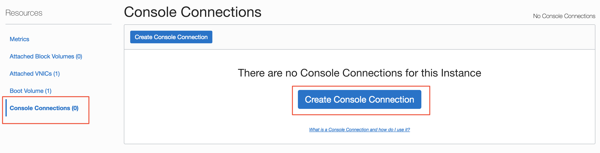

# Compute Console Connection

## Table of Contents

[Overview](#overview)

[Pre-Requisites](#pre-requisites)

[Practice 1: Creating the Instance Console Connection](#practice-1-creating-the-instance-console-connection)

[Practice 2: Connecting to the Serial Console](#practice-2-connecting-to-serial-console)

[Practice 3: Boot your instance in Maintenance Mode](#practice-3-boot-your-instance-in-maintenance-mode)

[Practice 4: Reset the SSH Key using Instance Console Connections](#practice-4-reset-the-ssh-key-using-instance-console-connections)

## Overview

The Oracle Cloud Infrastructure Compute service provides console connections that enable you to remotely troubleshoot malfunctioning instances, such as:

- An imported or customized image that does not complete a successful boot.
- A previously working instance that stops responding.

There are two types of instance console connections:

- Serial console connections
- VNC console connections

## Pre-Requisites 

- Oracle Cloud Infrastructure account credentials (Tenant ID, Username and Password)

## Practice 1: Creating the Instance Console Connection

Before you can connect to the serial console, you need to create the instance console connection.

1. Open the navigation menu. Under **Core Infrastructure**, go to **Compute** and click **Instances**.

2. In the list of instances, find the Linux instance you want to access the serial console for, and then click the instance name.

3. In the **Resources** section on the **Instance Details** page, click **Console Connections**, and then click **Create Console Connection**.
   
   
   
4. Add your public SSH key, either by browsing and selecting a public key file, for example `id_rsa.pub`, or by pasting your public key into the text box.
   
   
   
5. Click **Create Console Connection** (Refresh the screen and you will see an Active Console Connection).

  
## Practice 2: Connecting to the Serial Console

Once you have created the console connection for the instance, you can then connect to the serial console by using a Secure Shell (SSH) connection. Once you are finished with the serial console and have terminated the SSH connection, you should delete the serial console connection. If you do not disconnect from the session, Oracle Cloud Infrastructure will terminate the serial console session after 24 hours and you will need to re-authenticate to connect again.

1. On the **Instances Details** page, in the **Resources** section, click **Console Connections**.

2. Click the Actions icon (three dots), and then click **Connect with SSH**.
   
   

3. Select **LINUX/MAC OS** for **PLATFORM** and click **Copy** to copy the string to the clipboard
   
   
   
4. Paste the connection string copied from the previous step to the gitbash installed on your Windows laptop, and hit enter to connect to the console.

**Note:** 
If you are not using the default SSH key or ssh-agent, you can modify the serial console connection string to include the identity file flag, -i to specify the SSH key to use. You need to specify this for both the SSH connection and the SSH ProxyCommand, as shown in the following line:

    `$ ssh -i /<path>/<ssh_key> -o ProxyCommand='ssh -i /<path>/<ssh_key> -W %h:%p -p 443...`
    
6. Hit enter again to activate the console.
    
    
    
   

## Practice 3: Boot your instance in Maintenance Mode

Once you are connected with an instance console connection, you can perform various tasks, such as:

- Edit system configuration files.
- Add or reset the SSH keys for the **opc** user.

Both of these tasks require you to boot into a bash shell, in maintenance mode.
  
1. Reboot the instance from the Console. In the Console, on the **Instances Details** page, click **Reboot**.
  
2. Once the reboot process starts, switch back to gitbash terminal, and you see Console messages start to appear in the window. As soon as you see the GRUB boot menu appear, use the **up/down arrow key** to stop the automatic boot process, enabling you to use the boot menu.
  
  
  
3. In the boot menu, highlight the top item in the menu, and type **e** to edit the boot entry.
  
4. In edit mode, use the **down arrow key to scroll down** through the entries until you reach the line that starts with either **linuxefi** for instances running Oracle Linux 7.x, or **kernel** for instances running Oracle Linux 6.x.
  
5. At the end of that line, add the following:
  
     `init=/bin/bash`
    

    
6. Reboot the instance from the terminal window by entering the keyboard shortcut **CTRL+x**.
   

7. Now your instance is on Maintenance Mode and you can can replace your SSH.

## Practice 4: Reset the SSH Key using Instance Console Connections

1. From the Bash shell, run the following command to load the SELinux policies to preserve the context of the files you are modifying:

    `/usr/sbin/load_policy -i`

2. Run the following command to remount the root partition with read/write permissions:

    `/bin/mount -o remount, rw /`

3. From the Bash shell, run the following command to change to the SSH key directory for the opc user:

    `cd ~opc/.ssh`

4. Rename the existing authorized keys file with the following command:

    `mv authorized_keys authorized_keys.old`

5. Replace the contents of the public key file with the new public key file with the following command:

    `echo '<contents of .pub key file>' >> authorized_keys`

6. Restart the instance by running the following command:

    `/usr/sbin/reboot -f`

7. Now you can login to your instance using the new SSH key. 
