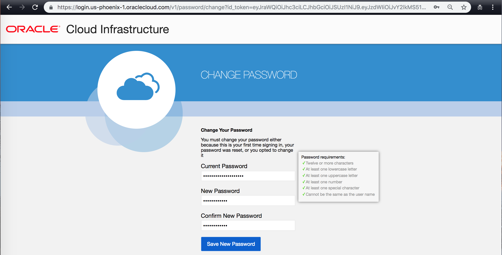
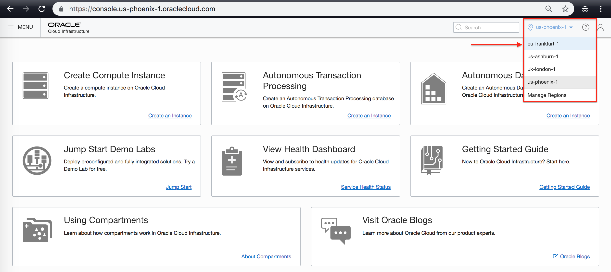

Oracle set an ambitious goal in building its second-generation cloud infrastructure: to create an infrastructure that matches and surpasses the performance, control and governance of enterprise datacenters, while delivering the scale, elasticity, and cost-savings of public clouds. The result, Oracle Cloud Infrastructure, is built from the ground up to be an Enterprise Cloud, equally capable of running traditional multi-tiered enterprise applications, high-performance workloads, and modern serverless and container-based architectures.

# Edge Services on Oracle Cloud Infrastructure

## Table of Contents

[Overview](#overview)

[Pre-Requisites](#pre-requisites)

[Practice 1: Generate SSH Keys](#practice-1-generate-ssh-keys)

[Practice 2: Signing in OCI Console](#practice-2-signing-in-oci-console)

[Practice 3: Create a Virtual Cloud Network](#practice-3-create-a-virtual-cloud-network)

## Overview

OCI DNS has advanced traffic management capabilities to steer DNS traffic across multiple public OCI instances and other private and 3rd party assets/endpoints. Traffic management supports comprehensive policies to provide intelligent responses to ensure high performance, scalability, and availability. 

In this lab, we will learn how to use OCI DNS Traffic Management service to ensure high availability of your web applications through detection of endpoint health and diverting your traffic accordingly. 

## Pre-Requisites 

Each attendee would be provided with a set of credentials for Oracle Cloud Infrastructure. The credentials will include 

- Tenancy Information
- Username
- Password

## Practice 1: Setup Windows 10 VM 

1) Each attendee is provided with a laptop with a Virtual Box. In the Virtual Box, Please start the Windows 10 VM (name of the VM is same as the ID of this Hands on Lab - HOL6379) 

2) Open Chrome Browser and Log into Oracle Cloud Infrastructure (OCI) Console. 
https://console.us-phoenix-1.oraclecloud.com/
Add the Cloud Tenant name provided to you. 

3) Sign in by providing your username and temporary password. 

4) Change the temporary password provided to you. 
** Following password will suffice password requirements
** Oracleoow2018!

After log in, you are the home page of OCI web console. 

5) Navigate to the different regions from the top right corner. For this lab, lets navigate to OCI Frankfurt Region. 
eu-frankfurt-1 

