# Computational Fluid Dynamics Simulation on Oracle Cloud Infrastructure
  
## Table of Contents

[Overview](#overview)

[Basic HPC Architecture](#basic-hpc-architecture)

[Pre-Requisites](#pre-requisites)

[Practice 1: Setup Windows 10 VM](#practice-1-setup-windows-10-vm)

[Practice 2: Open Gitbash on your Desktop ](#practice-2-open-gitbash-on-your-desktop)

[Practice 3: Access the control node](#practice-3-access-the-control-node)

[Practice 4: Deploy your HPC Cluster](#practice-4-deploy-your-hpc-cluster)

[Practice 5: OpenFOAM to generate your simulation](#practice-5-openfoam-to-generate-your-simulation)

[Practice 6: Ganglia Monitoring System](#practice-6-ganglia-monitoring-system)

[Practice 7: Grafana Monitoring](#practice-7-grafana-monitoring)

[Practice 8: Sign in to OCI Console](#practice-6-sign-in-to-oci-console)

[Practice 9: Try Oracle Cloud Infrastructure for FREE](#practice-7-try-oracle-cloud-infrastructure-for-free)

## Overview

High Performance Computing and storage in the cloud can be very confusing and it can be difficult to determine where to start. This Hands on LAB is designed to be a first step in expoloring a cloud based HPC storage and compute architecture. There are many different configuration that could be used, but this lab focuses on a bare metal compute system and a Lustre file system that is attached. After deployment fully independant and functioning IaaS HPC compute and storage cluster has been deployed based on the architecture below.

## Basic HPC Architecture


## Pre-Requisites

- Oracle Cloud Infrastructure account credentials (User, Password, and Tenant) with available service limit for Bare Metal Shapes.

## Practice 1: Setup Windows 10 VM 

1. Each attendee is provided with a laptop with a Virtual Box. In the Virtual Box, Please start the Windows 10 VM (name of the VM is same as the ID of this Hands on Lab - HOL6379)


## Practice 2: Open Gitbash on your Desktop

1. Open Gitbash on your desktop. It is already installed for you. 

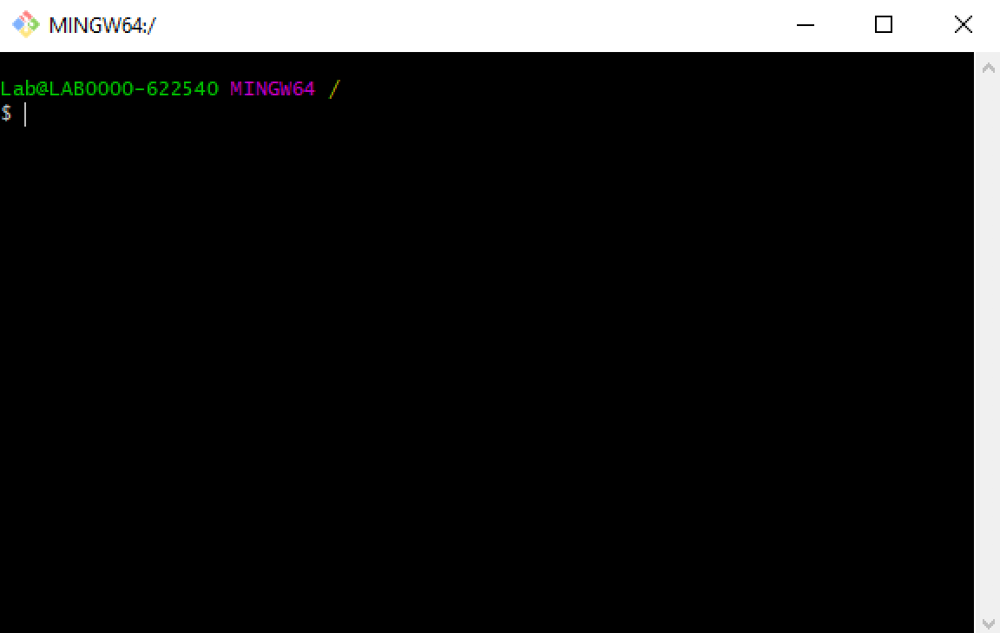

## Practice 3: Access the control node

1. On Gitbash terminal use SSH command to connect to the control node with this information:

- **username**: *Instructor will provide username for each participant*
- **password**: *Instructor will provide password for each participant*
- **IP address**: *129.146.103.162
*

```
# ssh username@129.146.103.162
```

## Practice 4: Deploy your HPC Cluster

1. After login, change into home directory by typing:

```
# cd oci-hpc-ref-arch
```
2. Deploy your Cluster by typing:

```
# ./cli_deploy.sh $C
```
> **Note:**  $C is a variable with your designated compartment. It will be automatically loaded for you after login. 

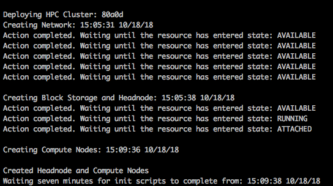

3. Wait for the HPC cluster to deploy. It will take about 20 minutes. When it is done, you will see the output below:

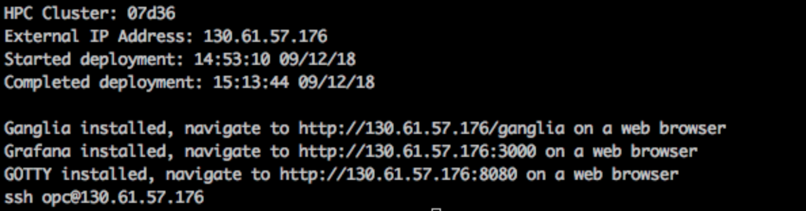


## Practice 5: OpenFOAM to generate your simulation

OpenFOAM is a free, open source CFD software package developed by ESI-OpenCFD and other participants in the global OpenFOAM community. It has a large user base across most areas of engineering and science, from both commercial and academic organizations. OpenFOAM has an extensive range of features to solve anything from complex fluid flows involving chemical reactions, turbulence and heat transfer, to solid dynamics and electromagnetics.

Lets run OpenFOAM in our HPC Cluster:

1. Open a web browser and type in the **GOTTY** IP address that was shown at the bottom of the deployment terminal window and use the following information to authenticate:

[http://129.146.103.162
:8080](http://129.146.103.162
:8080)


- **user**: opc
- **password**: *+ocihpc123456*

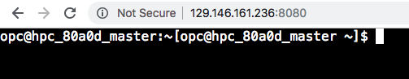

2. After login into the GOTTY, execute the following command:

```
# cd /mnt/blk/share/data/OpenFOAM/oci-hpc-foam-motorbike; source Allrun 2 52
```
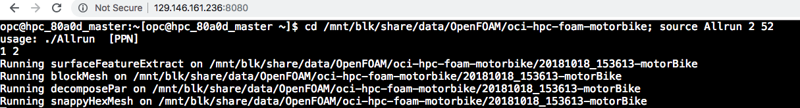

## Practice 6: Ganglia Monitoring System

Ganglia is a scalable distributed monitoring system for high-performance computing systems such as clusters and Grids. It is based on a hierarchical design targeted at federations of clusters. It leverages widely used technologies such as XML for data representation, XDR for compact, portable data transport, and RRDtool for data storage and visualization. It uses carefully engineered data structures and algorithms to achieve very low per-node overheads and high concurrency. The implementation is robust, has been ported to an extensive set of operating systems and processor architectures, and is currently in use on thousands of clusters around the world. It has been used to link clusters across university campuses and around the world and can scale to handle clusters with 2000 nodes.

1. While OpenFOAM is running, open another tab in your web browser and navigate to the Ganglia Dashboard:

[http://129.146.103.162
/ganglia](http://129.146.103.162
/ganglia)


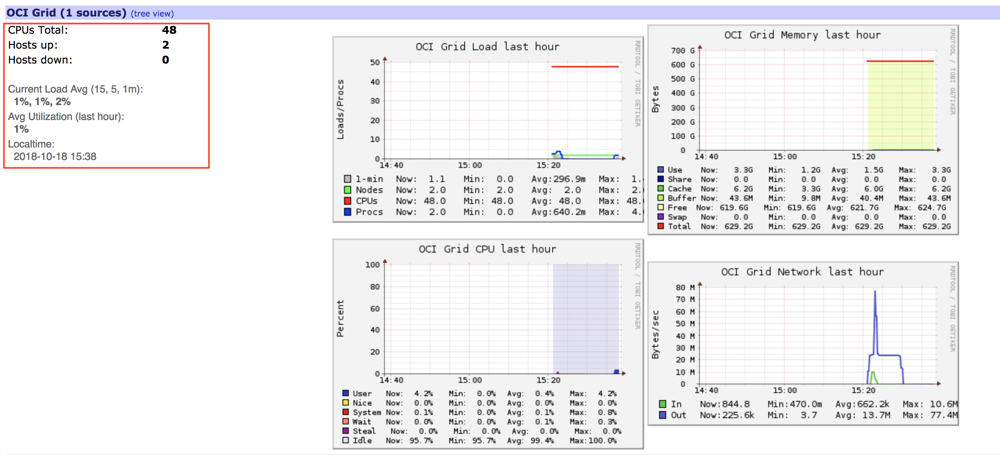


## Practice 7: Grafana Monitoring

Grafana is an open source, feature rich metrics dashboard and graph editor for Graphite, Elasticsearch, OpenTSDB, Prometheus and InfluxDB.
We can use Grafana to monitor our HPC Cluster and shows live updates of resource utilization. The installation script created a cluster status dashboard for you.

1. Open Grafana dashboard using the following URL:

[http://129.146.103.162
:3000](http://129.146.103.162
:3000)

Enter the following credentials:

- **Username:** _admin_
- **Password:** _admin_

It will prompt to change the password, enter this new password: *Oracleoow2018!*

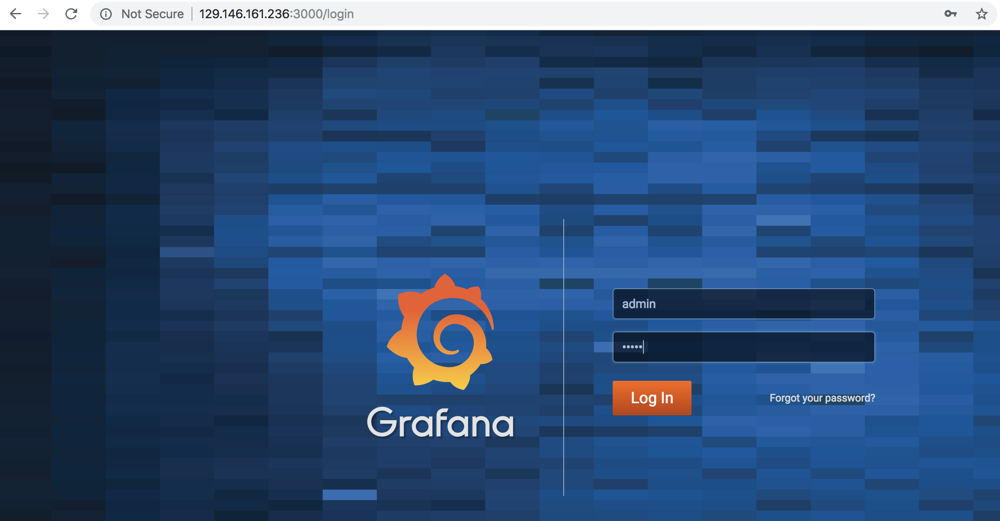


2. After login, click on Home:

 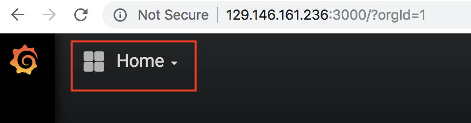

3. Click on Cluster Status

 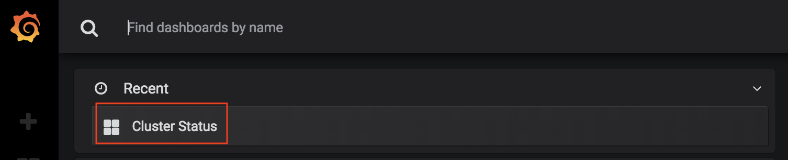

4. While OpenFOAM is running you can see your HPC Cluster utilization during this process. Here you can see cpu, network, disk and overall load of the system:

 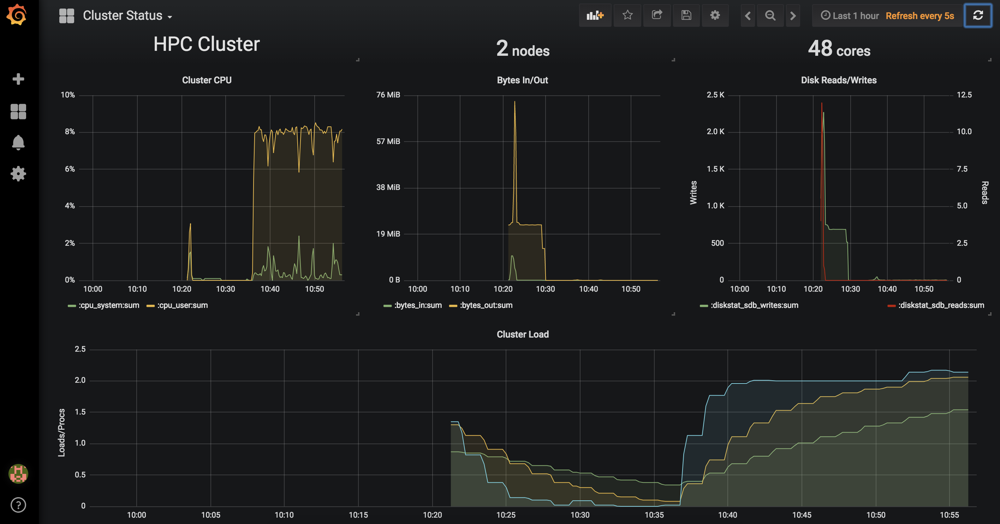


## Practice 8: Sign in to OCI Console

1) Open a supported browser and go to the Console URL. For example, [https://console.us-ashburn-1.oraclecloud.com](https://console.us-ashburn-1.oraclecloud.com).

2) Enter your tenant name: <Tenant> and click **Continue**

 

3) Oracle Cloud Infrastructure is integrated with Identity Cloud Services, you will see a screen validating your Identity Provider. You can just click **Continue**.

 

4) Enter your user name and password

 - **Username:** _instructor will provide username_
 - **Password:** _instructor will provide password_

 

When you sign in to the Console, the home page is displayed.

 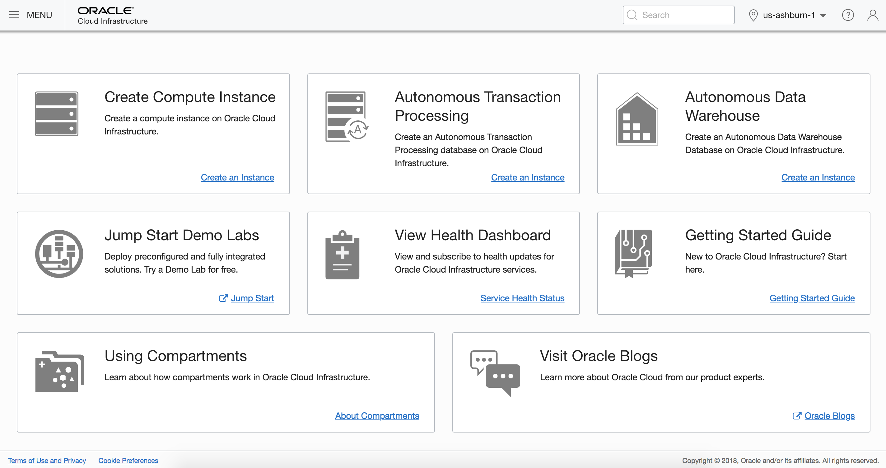

The home page gives you quick links to the documentation and to Oracle Support.

## Practice 9: Try Oracle Cloud Infrastructure for FREE 

Sign up for the free Oracle Cloud Infrastructure trial account. 
https://cloud.oracle.com/tryit


