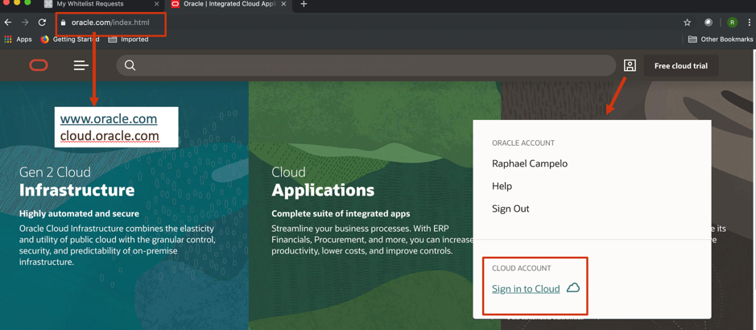
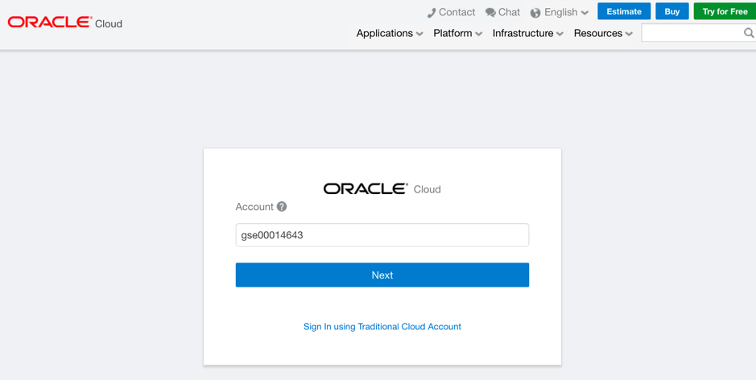
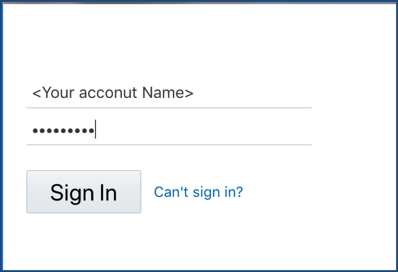
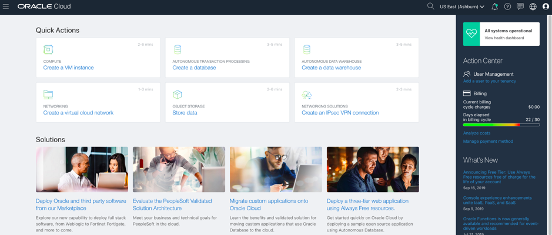
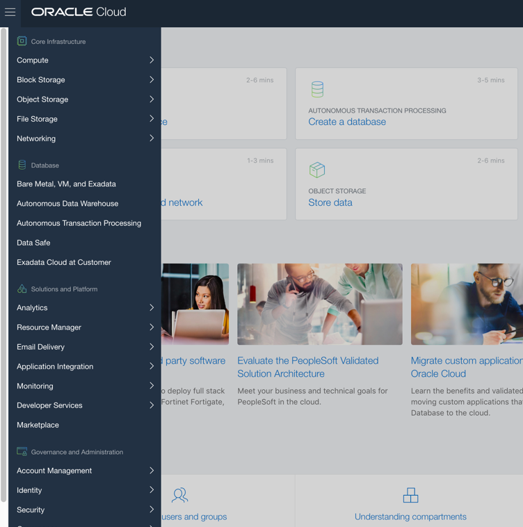
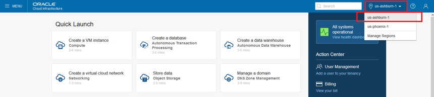
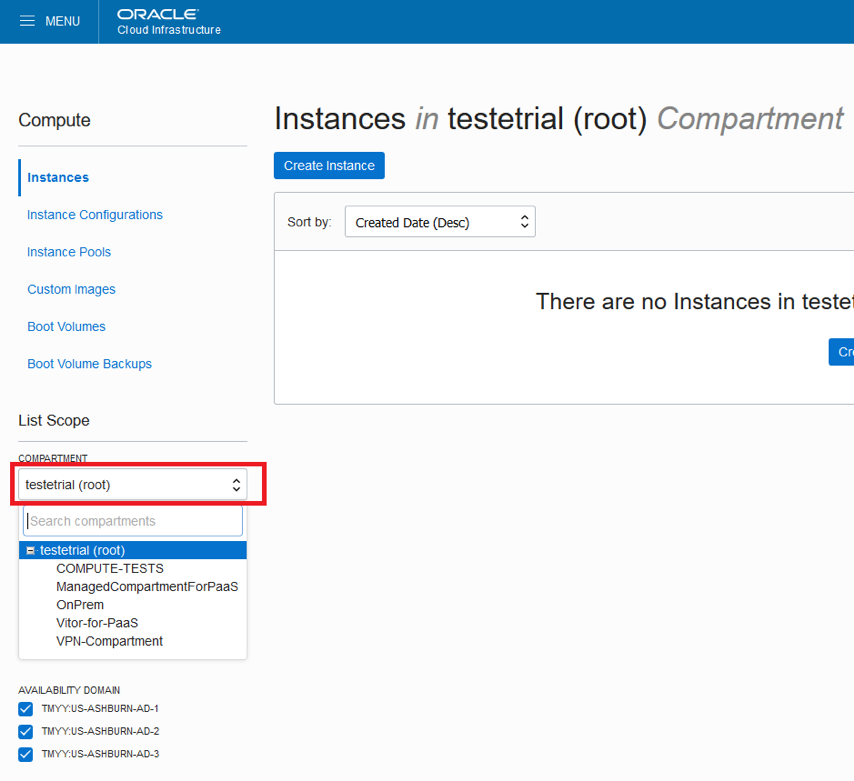
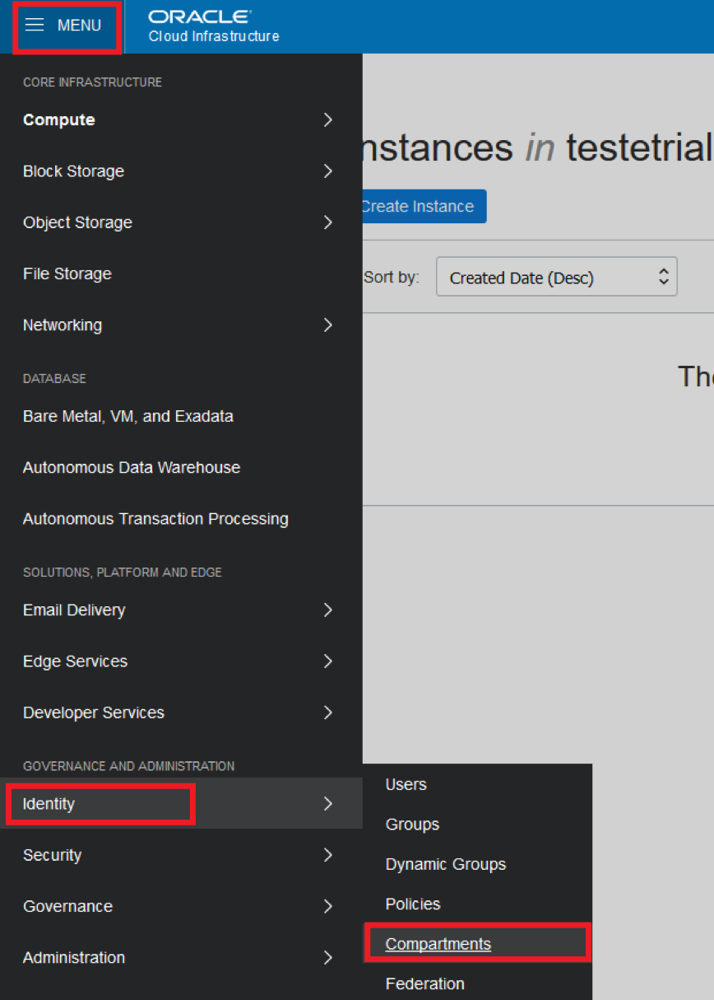
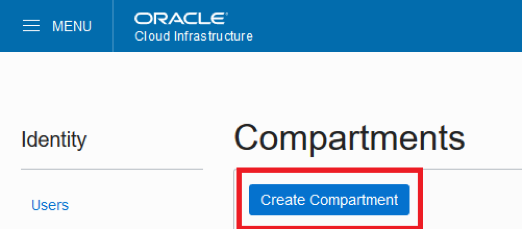
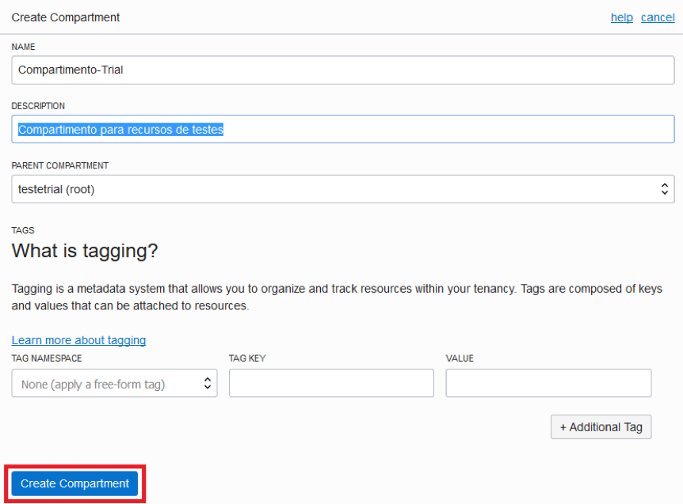

## Introduction

On this guide, we’re going to work on creating some Oracle Cloud virtual machines, following different processes and good implementation techniques

We’ll explore each and every one of the available resources on Infrastructure as Code (IaaS), going from network, storage, virtual machines, and Load Balancer. To begin, it’s important to check if the user has a clear understanding of OCI’s basic components like : Regions, Compartments, and Availability Domains

Through this guide, we’re going to provision :

- Network (VCN, and subnets)
- Compute Instances (Linux and Windows)
- Block Storage
- Object Storage
- Load Balancer

Our goal is that, in the end of this workshop, attendees will be able to deploy their own infrastructure segments following OCI’s best practices

## Tools used on this Workshop

This lab will require the user to dowlonad and install :

- PuTTY e PuTTY KeyGen (for Windows Users)

## Putty ## 

PuTTY is a telnet and SSH client developed to grant Windows users, access  to Linux/Unix Servers. Putty is a Open Source Software.

PuTTY can be downloaded on  https://www.putty.org/.

## Used Images ##
This LAB will basically use 2 different images :

- Oracle Linux 7.6
- Microsoft Windows 2016 Standard

## Lab 1. Accessing Oracle Cloud

## Objectives ##

- Acess Oracle Cloud Console
- Known IaaS and PaaS Services
- Become acquainted with OCI Interface

In this Section, you will learn more about the initial steps on Oracle Cloud Portal

On your preferred browser, type: cloud.oracle.com, or www.oracle.com.  You can also change your language:
 
 

Hit the “Sign in to Cloud” link, and you will be redirected to the Cloud Connection screen, as follows:

 

 To more recent deployed environments, login must be made through  *"Identity Cloud Service Account"*. Where will be necessary to input *Account Name* (which is the defined name for the Tenant).

After Tenant identification, you’ll be able to insert username and password for environment access

Once identified, you’ll reach Oracle’s Cloud main screen, from where you can reach all the available services. Your default main screen will look like this

From the *Action Menu* (Top left corner), you can reach the available services on our console

## Understanding OCI Basic Concepts

**Objectives**
- Understand Availability Domain (AD) concept
- Understand Compartments
- Understand Fault Domains

In this section you’ll learn about OCI’s  high availability architecture.

**Regions**
Oracle Cloud Infrastructure is hosted in regions and availability domains. A region is a localized geographic area. A region is composed of one or more availability domains. Most Oracle Cloud Infrastructure resources are either region-specific, such as a virtual cloud network, or availability domain-specific, such as a compute instance.
Regions are completely independent of other regions and can be separated by vast distances—across countries or even continents. Generally, you would deploy an application in the region where it is most heavily used, since using nearby resources is faster than using distant resources. However, you can also deploy applications in different regions to:
- mitigate the risk of region-wide events, such as large weather systems or earthquakes
- meet varying requirements for legal jurisdictions, tax domains, and other business or social criteria
After acessing the environment, is possible to change your region with just one click:

## Availability Domains
In a Region, you may have up to three Availability Domains. 

The availability domains within the same region are connected to each other by a low latency, high bandwidth network, which makes it possible for you to provide high-availability connectivity to the Internet and customer premises, and to build replicated systems in multiple availability domains for both high-availability and disaster recovery. 

Availability domains are isolated from each other, fault tolerant, and very unlikely to fail simultaneously. Because availability domains do not share infrastructure such as power or cooling, or the internal availability domain network, a failure at one availability domain within a region is unlikely to impact the availability of the others within the same region

**Working With Compartments**
When you first start working with Oracle Cloud Infrastructure, you need to think carefully about how you want to use compartments to organize and isolate your cloud resources. Compartments are fundamental to that process. Once you put a resource in a compartment, you can't move it, so it's important to think through your compartment design for your organization up front, before implementing anything.

When creating a new compartment, you must provide a name for it (maximum 100 characters, including letters, numbers, periods, hyphens, and underscores) that is unique within its parent compartment. You must also provide a description, which is a non-unique, changeable description for the compartment, between 1 and 400 characters. Oracle will also assign the compartment a unique ID called an Oracle Cloud ID

The Console is designed to display your resources by compartment within the current region. When you work with your resources in the Console, you must choose which compartment to work in from a list on the page. 

That list is filtered to show only the compartments in the tenancy that you have permission to access. If you're an administrator, you'll have permission to view all compartments and work with any compartment's resources, but if you're a user with limited access, you probably won't

Compartments are global, across regions, when you create a compartment, it is available in every region that your tenancy is subscribed to.

## Creating Compartments
On the main menu, Hit “Identity”, then choose  “Compartments”

Click on *“Create Compartment”* and fill the information:

Name: Compartimento-Trial
Description: Compartiment for resource testing
Parent Compartment: root

