## Lab 3. Compute Instances
Creating Windows Server 2016 Virtual Machine

**Objectives**
- Quickly create a Virtual Machine
- Identify main information needed for a OCI Compute Instance Creation 

To access main screen, Hit Menu > Compute > Instances.

## Begin Windows VM Creation
Hit **“Create Instance”**.

**Name you instance:** VM-Windows2016
**Availability Domain:** AD 1
**Operating System:** Windows Server 2016 Standard
**Instance Type:** Virtual Machine
**Instance Shape:**  VM.Standard2.1
**Virtual Cloud Network Compartment:** Compartimento-Trial
**Virtual Cloud Network:** VCN-Trial
**Subnet Compartment:** Compartimento-Trial
**Subnet:** Subrede-1

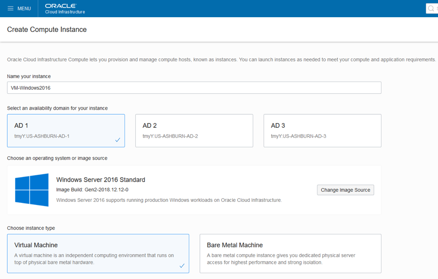
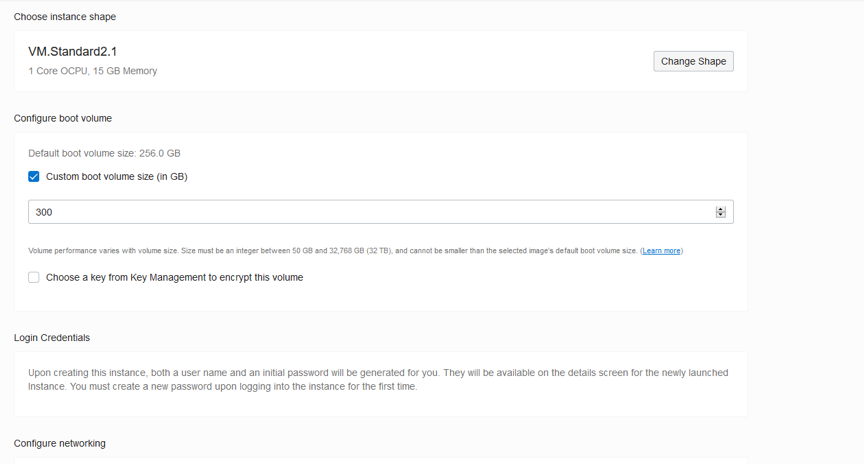
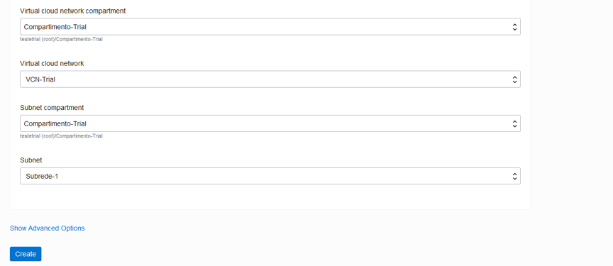

After instance creation, you’ll see:

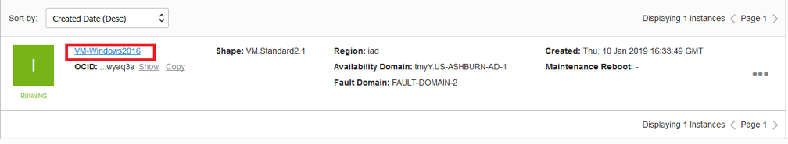

Before step forward, find the  VM’public IP, and copy it :

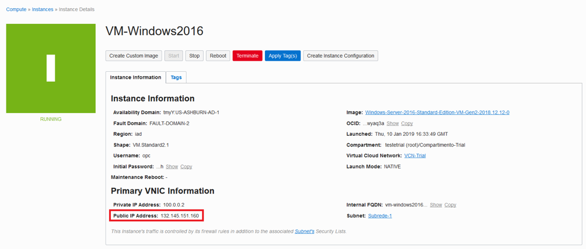

Now try to access it, using “Remote Desktop Connection”. 

Use instance’s Public IP address, and hit “Connect”.

You’ll get the following error when trying to connect  …
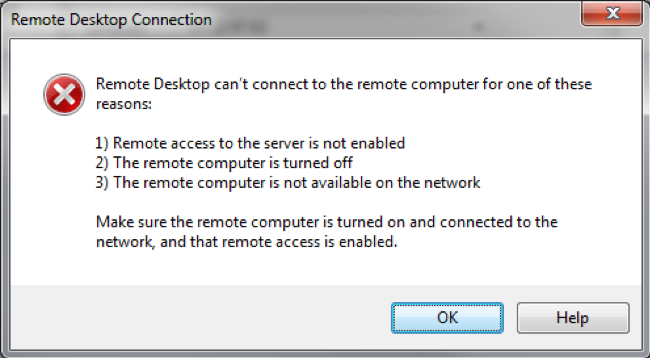

Don’t worry, that’s the expected behavior. In order to access a compute instance on Oracle Public Cloud, you need to configure firewall “Access Rules” first. On the next session, we’ll configure other resources, that can be created before the VM, and provide access permissions as well

## Security Rules
You probably noticed that Linux VM could be accessed by SSH key right after it’s creation, but Windows instance  could not be accessed through RDP. 

To access Windows Compute, we’ll need to configure some firewall rules.

Firewall rules are set inside in an object called **“Security List”**, that can be accessed within a subnet.

Security Rules, are inside  the Security List, from there, we can setup which ports and protocols are allowed traffic inside a subnet.

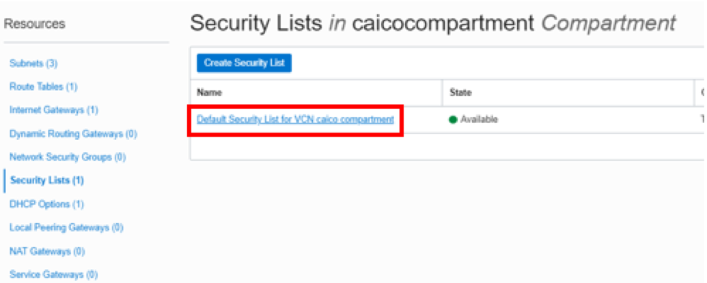

To access the VCN’s firewall rules, choose the Security List you want to configure. In our example, you’ll find the “public” security list already created on our VCN. Clock on the “public” security list and the access rules console will come up.

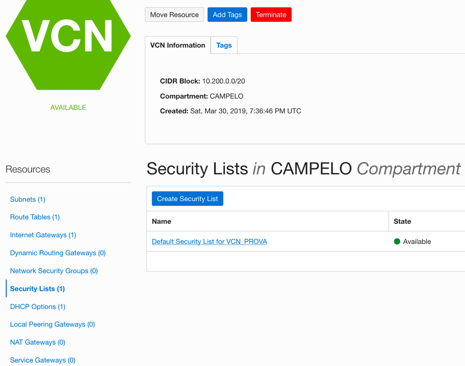

Now you can add/edit Access Rules to the VCN … Hit “Add Ingress Rules” to add more access conditions.
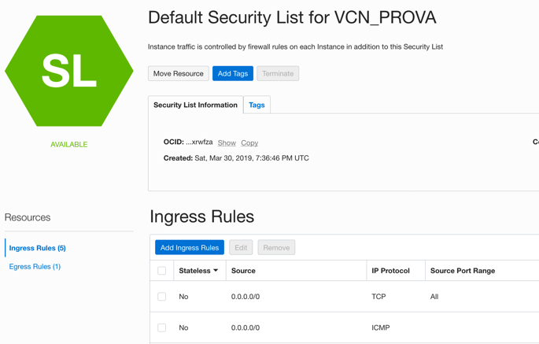

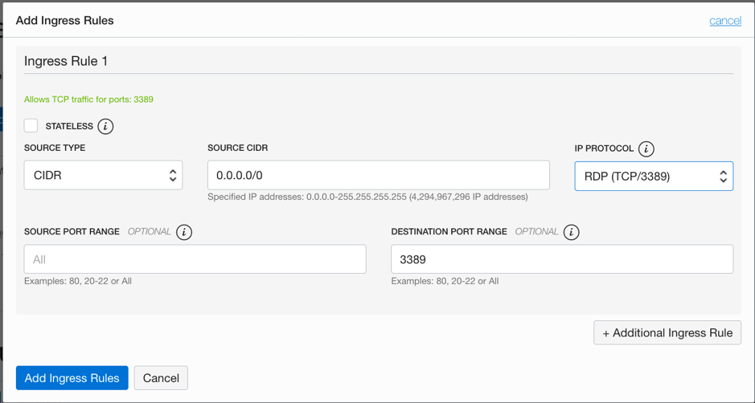

Fill the blanks as follows:

**Source Type:** CIDR
**Source CIDR:** 0.0.0.0/0 
**IP Protocol:** RDP (TCP/3389)
**Source Port Range:** All
**Destination Port Range:** 3389 

## Windows access through Remote Desktop
To access Windows VM, on Main Menu choose “Run”, type “mstsc”, then hit “OK”.

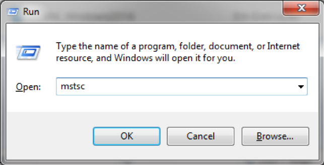

Input Instance’s Public IP, then hit “Connect”

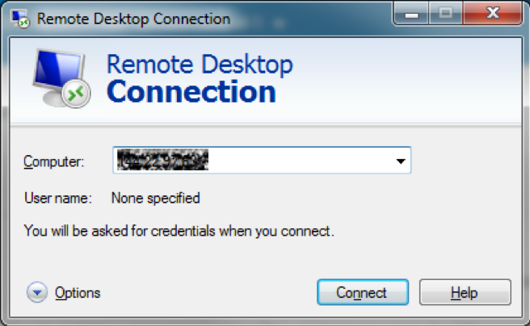

IF everything was properly configured, you’ll be transported to Windows login page, where you will need to change OPC password on first access.

## Oracle Linux 7.6 Compute Instance Creation

**Objectives**
- Create SSH key pair with PuTTY Gen
- Create Oracle Linux 7.6 virtual Machine
- Access compute instance using PuTTY

## Creating Virtual Machine 
In Main Menu, hit : Compute > Instances, than “Create Instance” :

**Name you instance:** VM-OracleLinux
**Availability Domain:** AD 2
**Operating System:** Oracle Linux 7.6
**Instance Type:** Virtual Machine
**Instance Shape:** VM.Standard2.1
**Choose SSH Key File:** Insert public key file (.pub)
**Virtual Cloud Network Compartment:** Compartimento-Trial
**Virtual Cloud Network:** VCN-Trial
**Subnet Compartment:** Compartimento-Trial
**Subnet:** Subrede-2

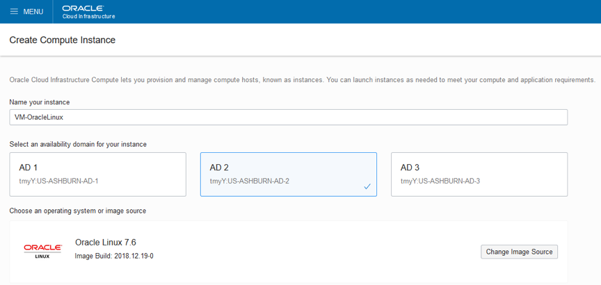
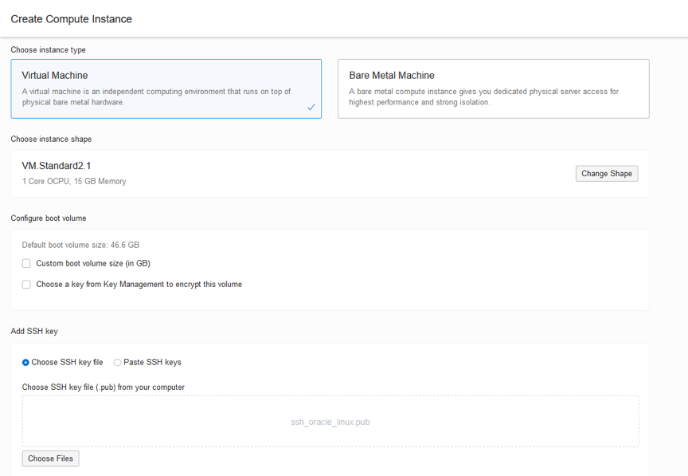
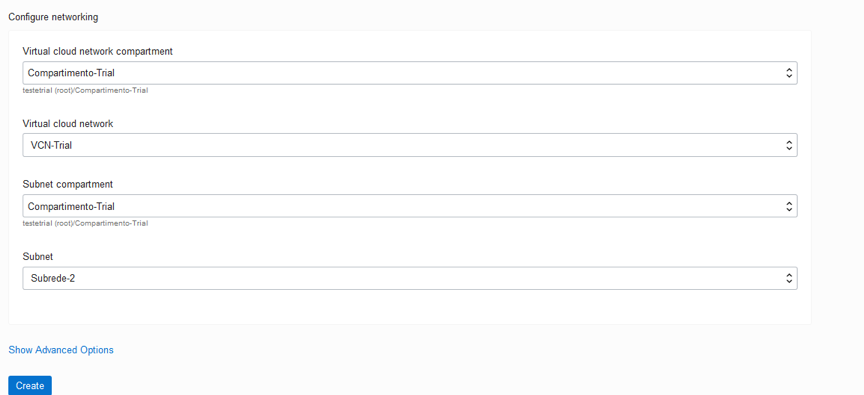

Finishing this task, you’ll see that we now have 2 compute instances, each on it’s own AD.
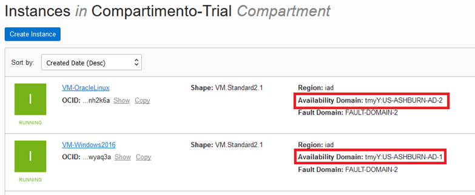

## Accessing Linux Compute Instance with PuTTY
First step : Get instance’s Public IP

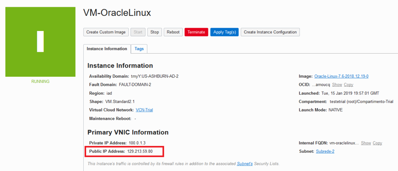

Open PuTTY. Fill “Host Name (or IP Address)” with the public IP address
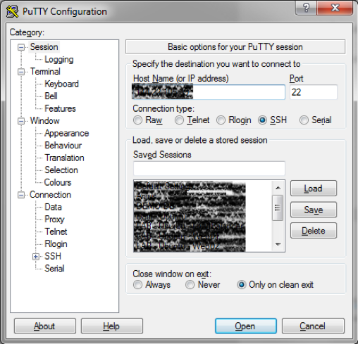

Expand “SSH” option on the left, then hit “Auth”. Use the “Browse...” button, to search for the private key file generated previously.
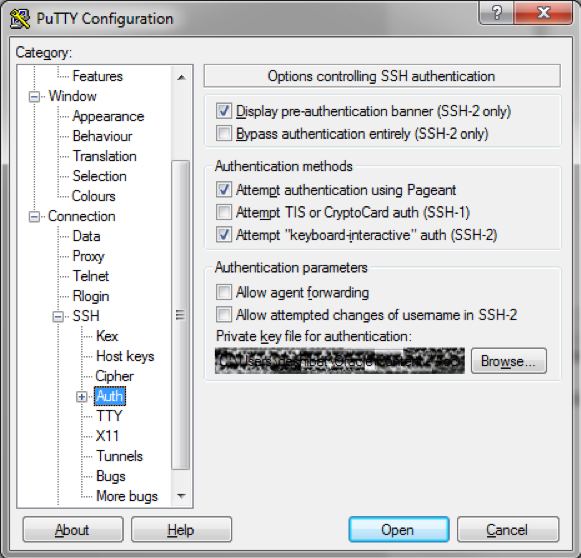

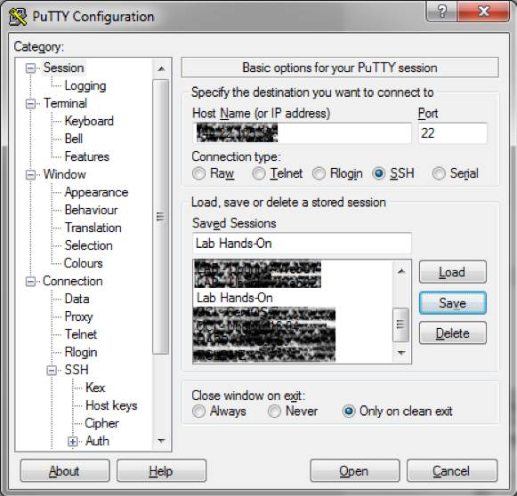
After saving the configuration, Hit Open, and you’ll establish connection to the VM

User to connect: opc (When connecting to Oracle Cloud Compute instances, always use the user opc)

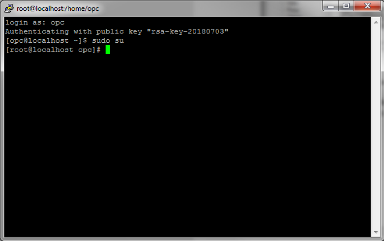

