## Lab 4. Storage Cloud Services
**Block Storage**
Objectives
- Create and Assign Block Storage volumes to Compute Instances
- Configure Backup Options

**Creating Block Storage Volumes**
You can create block volumes through “Block Storage” interface. To access it: From main menu, you choose Block Storage, than “Block Volume”.

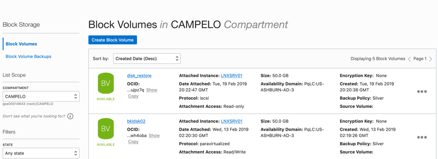

Block Volume creation process is a very straight forward process, you just need to hit **“Create Block Volume”**, and fill the requested information:

**Compartment_id :** Choose your own created compartment
**Name :** Name for this disk volume
**Availability Domain :** Choose the AD to store this disk volume
**Size :** Disk size, from 50 GB to 32 TB
**Backup Policy :** From none (No backup Policy) to Silver, Bronze and Gold (More on backup later)

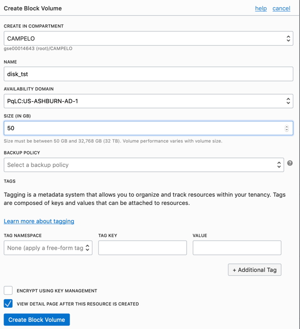

After setup, OCI Will begin provisioning. Provision time depends on the volume size, on our example (50 GB), it will take no more than 30 seconds:
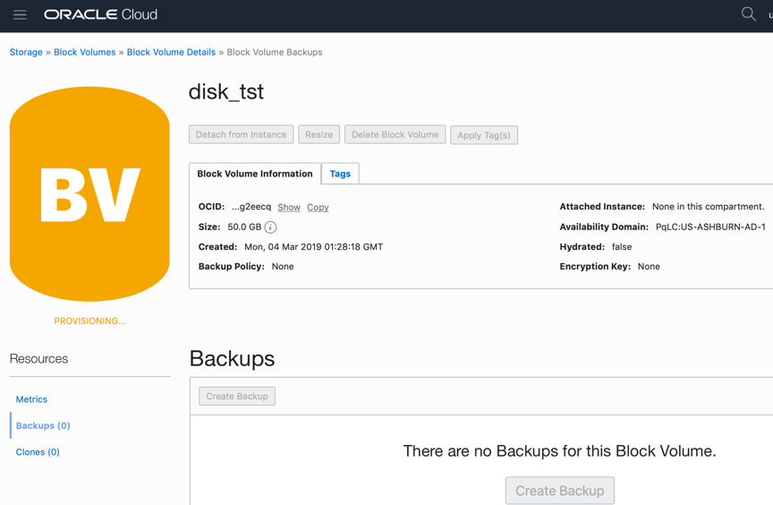

## Connecting Block Volumes to Compute Instance
To connect Block Volumes to compute instances, you need to access “Compute Instance” home scree, and from VM’s detail page, hit **“Attach Block Volume”**.

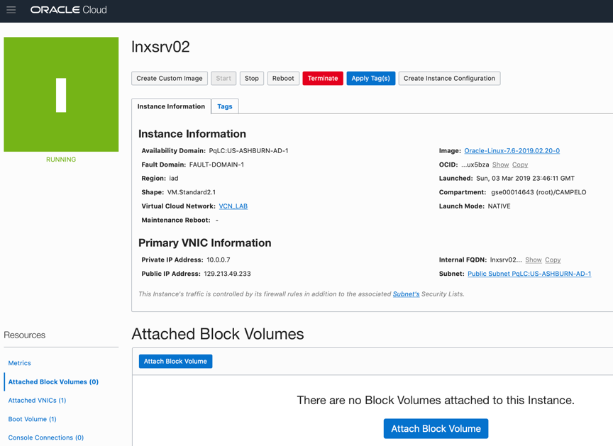

On the Block Volume field, locate the disk you just created, and on the attach method (ISCSI or paravirtualized)
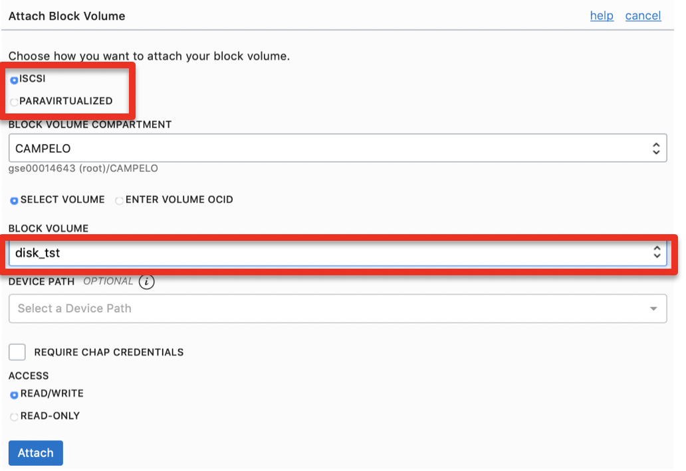

Once disk is properly attached, we can mount it on Compute Instance

To ease disk attachment process, Oracle Cloud Infrastructure provides the necessary commands to detect the new disk from the VM. On the right side of the disk information, you’ll find a three dot’s menu. 

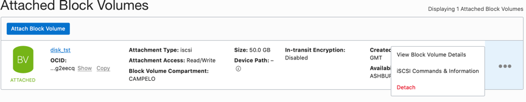

If you choose the “iSCSI Commands & Information”, you’ll get the necessary commands to detect the recently created disk:
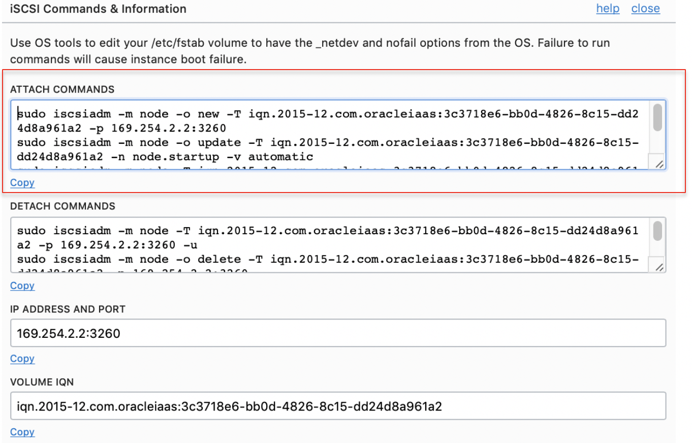

All you need to do, is copy the commands, and execute it on the Linux server. 
After disk detection, you need to format and mount the new disk:
1st – Detect the new device with “fdisk -l” command, you’ll note the disk : /dev/sdb
2nd – Format the disk wih “mkfs /dev/sdb”
3rd – Mount he filesystem

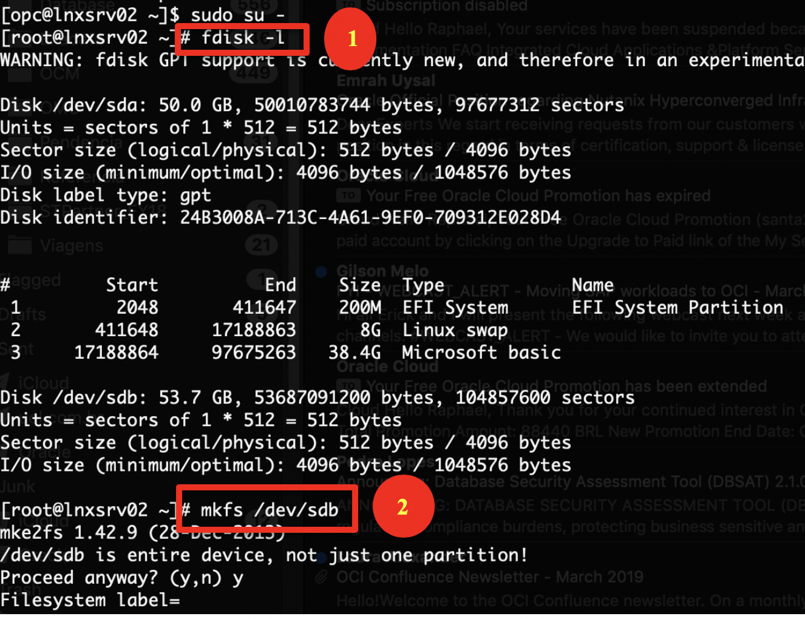
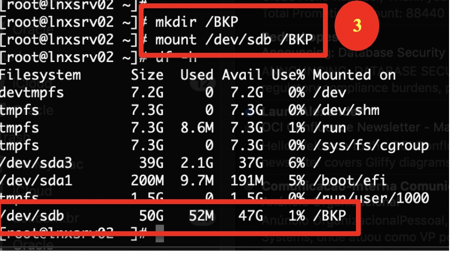

## Testing Block Volume performance
According to our documentation, Block Volume’s performance may vary from 3.000 IOPS to 25.000 IOPS according to disk size. In the next test, we’re going to validate the true performance delivered by the provisioned Block Volume.

**Step 1** Test the true performance of the already provisioned Block Volume (/dev/sdb):  

1 – Install FIO utility on the recently created Linux Compute instance: (as ROOT user, issue the command : “yum install fio”
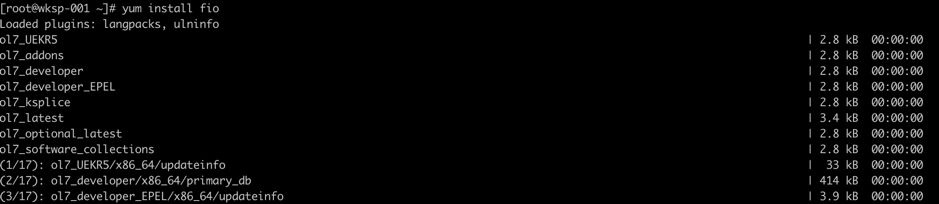
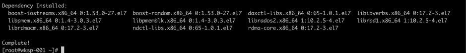

2 – Run FIO utility against the new disk:
sudo fio --filename=/dev/sdb --direct=1 --rw=randread --bs=4k \
--ioengine=libaio --iodepth=256 --runtime=30 --numjobs=4 --time_based \
--group_reporting --name=iops-test-job --eta-newline=1 --readonly

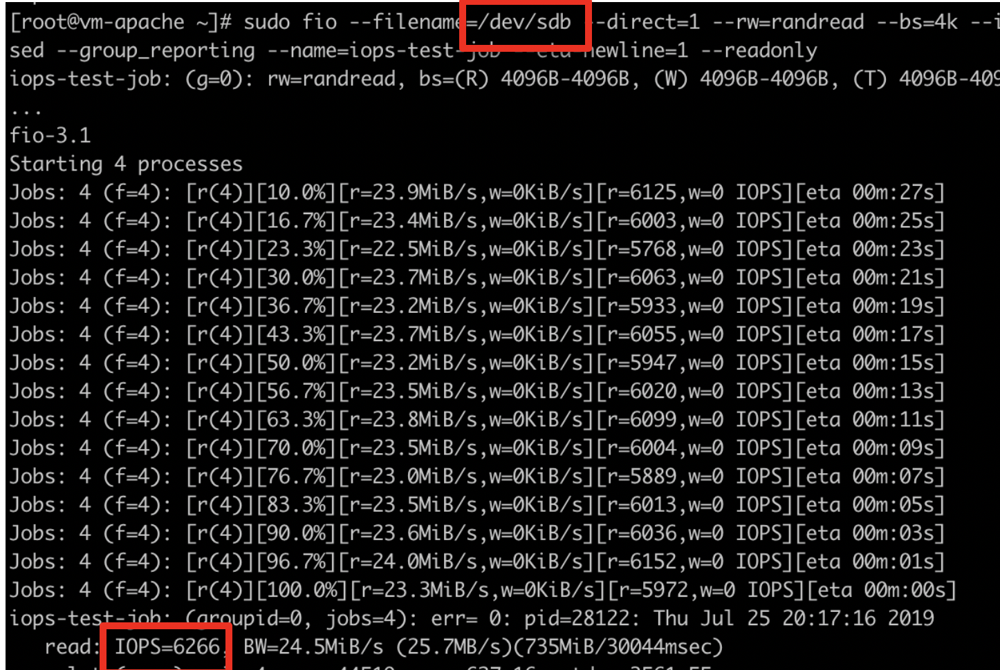

## Setting Backup Policies for Block Storage

**Objectives**

- Set Backup Policies: On Oracle Cloud Infrastructure, Block Volume (including boot volumes), and compute nodes backups are independente. Backup policies can be set on the Block Storage home page (Main Menu > Block Storage > Block Volumes) 

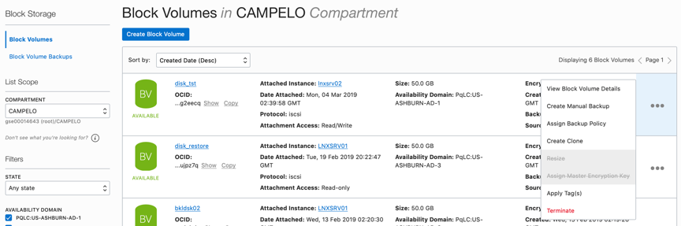

Backup options can be easily accessed from the “fast menu” (Three dots on the right), option  “Assign Backup Policy”

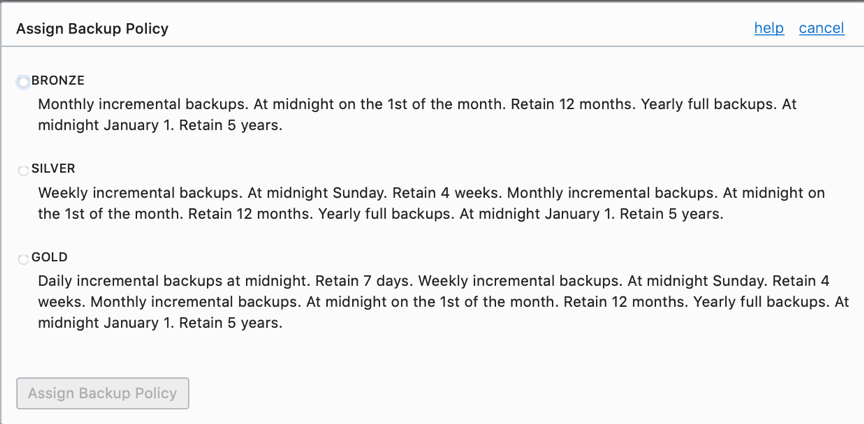

Where you can choose the most appropriate backup policy for your data.

