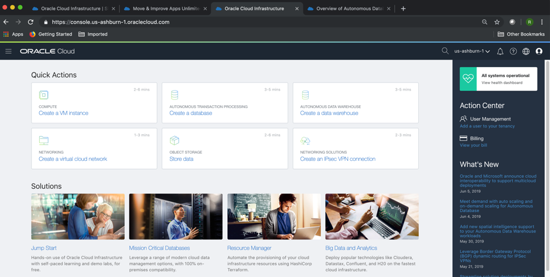
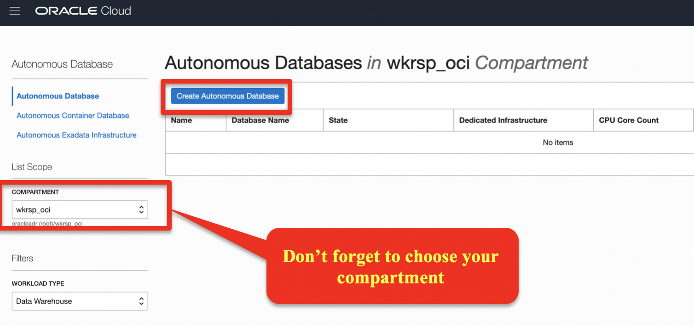
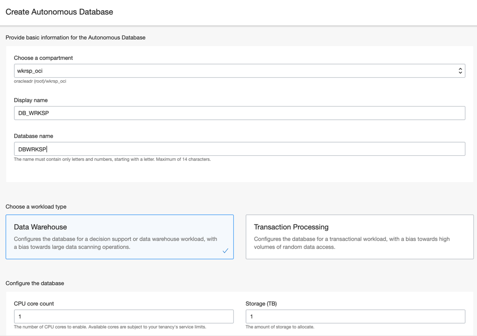
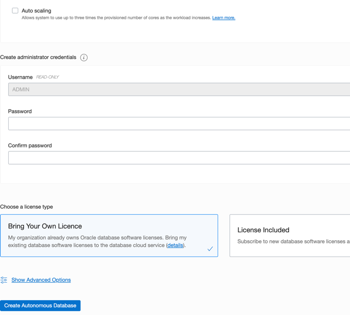
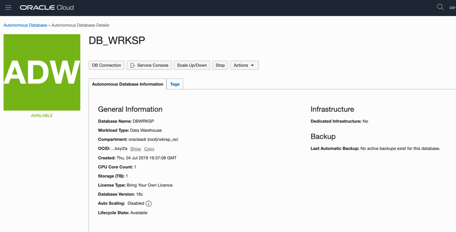
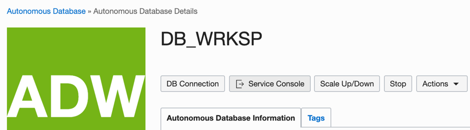
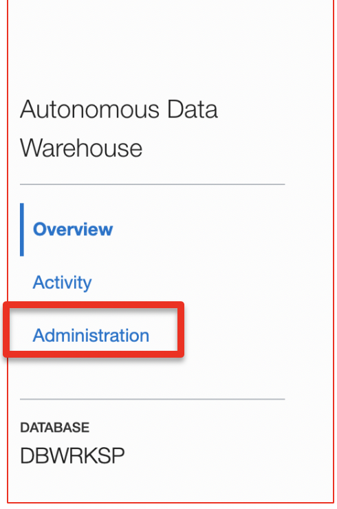
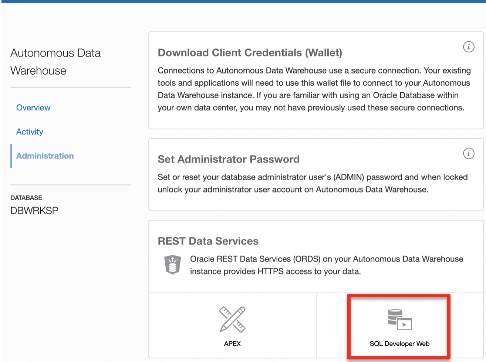
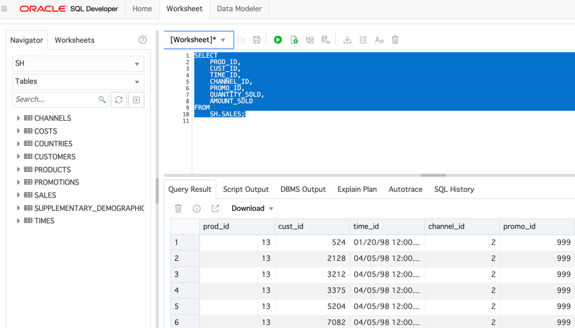

## Lab 7. Autonomous Database

**Objectives**
•	Provisioning and usage of Autonomous database

**Overview**
Oracle Cloud Infrastructure's Autonomous Database is a fully managed, preconfigured database environment with two workload types available, Autonomous Transaction Processing and Autonomous Data Warehouse. You do not need to configure or manage any hardware, or install any software. After provisioning, you can scale the number of CPU cores or the storage capacity of the database at any time without impacting availability or performance. Autonomous Database handles creating the database, as well as the following maintenance tasks:

- Backing up the database
- Patching the database
- Upgrading the database
- Tuning the database

**Available Workload Types**
Autonomous Database offers two workload types:
- The Autonomous Transaction Processing workload type configures the database for a transactional workload, with a bias towards high volumes of random data access.
For a complete product overview of Autonomous Transaction Processing, see Autonomous Transaction Processing

- The Autonomous Data Warehouse workload type configures the database for a decision support or data warehouse workload, with a bias towards large data scanning operations.For a complete product overview of Autonomous Data Warehouse, see Autonomous Data Warehouse. 

**Autonomous Database Provisioning**

To start Autonomous Database creation process, you can choose between two different starting points:

1.	Hit Action menu on the left side of the main screen, then choose “Autonomous Database”
2.	Hit the desktop shortcut on the main screen (blue rectangle), and you’ll be redirected to Autonomous database creation.

**Autonomous Database Creation**

On the screen creation process, you’ll need to answer only 5 questions : 
- Compartment
- Service display name
- Database name
- Workload type (ADW / ATP) : For the Workshop, please CHOOSE “Data Warehouse”
- Number of CPU’s and Storage Volume. You can choose between 1 and 128 OCPU’s and TB for storage

On the second half of the screen, you’ll find : 

Then input :
1.	Administrator password
2.	Choose your license type model

After providing all this data, just hit “Create Autonomous Database” in the bottom of the screen, and provisioning process will start 

Autonomous provisioning takes no more than 5 min. You’ll then get the screen :

Most operations for Autonomous database can be done on the top 5 buttons of the scereen :

This new version of Autonomous, brings an already loaded  version of SQL Developer, which can be reached from : 

1.	Hit the “Service Console” button
2.	On the right side of the screen, hit “Administration”, and you’ll be redirected to the screen where you can choose several administrative option, from client download, to rest API Services and SQL console

3 Hit “SQL Developer Web” Button

In the Worksheet tab, use the worksheet screen to right some SQL statements to query ADW database content : 

The following commands can be used on the SQL Worksheet to test Autonomous database : 

•	Select count(*) from dba_tables, dba_source;
•	select count(*) from (select * from dba_source, v$sqltext)
•	select a.cust_first_name, count(a.country_id), sum(b.amount_sold)
from sh.sales b, sh.customers a, sh.products where a.cust_id = b.cust_id
group by a.cust_first_name

While executing commands, you can change to Activity view on the Autonomous Database page, and follow-up the database activity.
