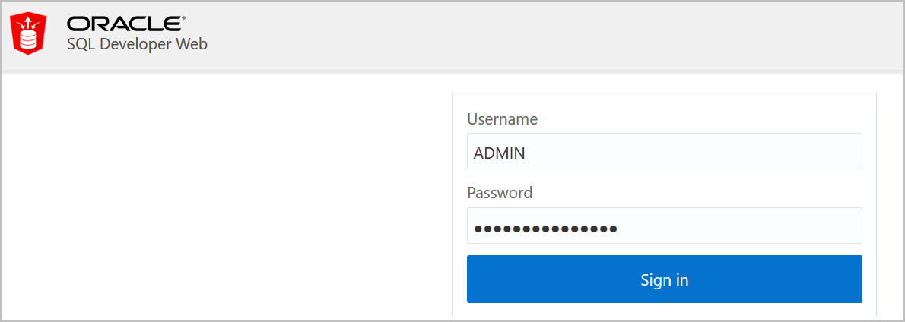
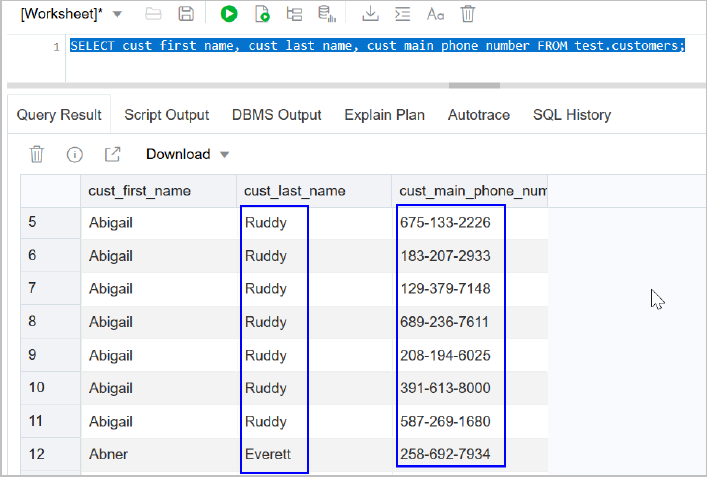
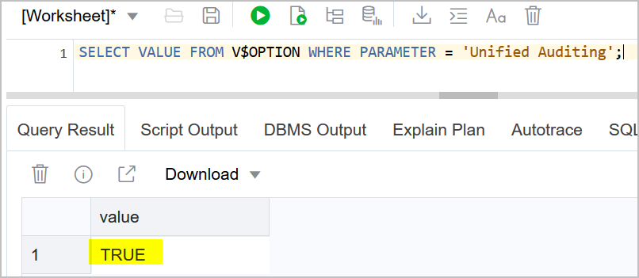
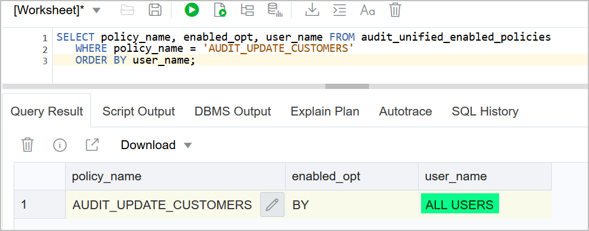
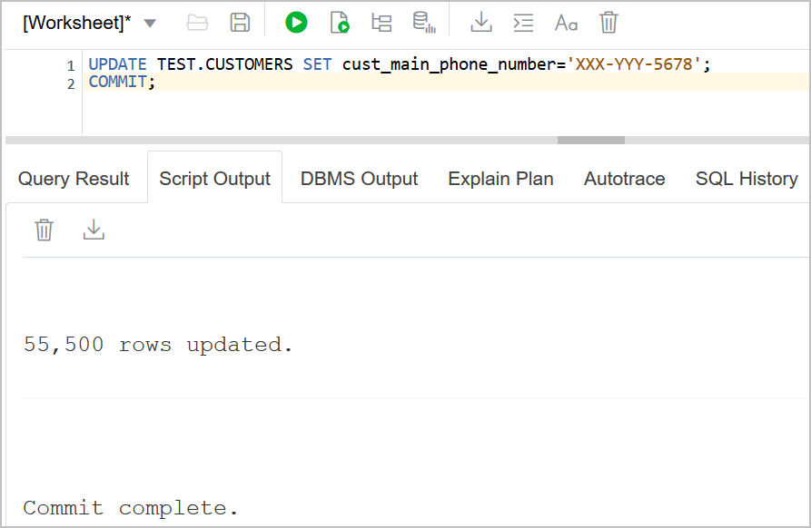
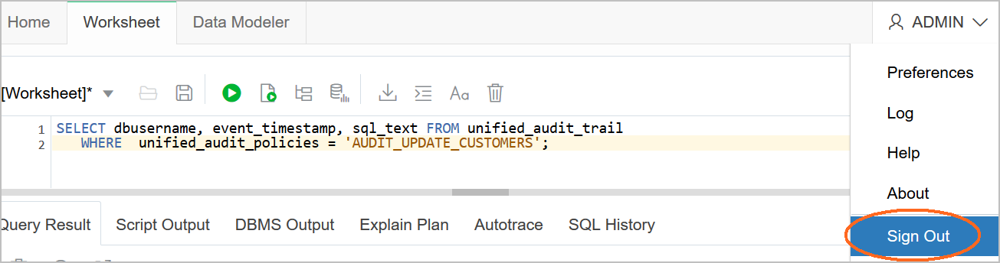

#  Auditing in an Autonomous Database
Auditing is the monitoring and recording of configured database actions, from both database users and nondatabase users.
You can base auditing on individual actions, such as the type of SQL statement executed, or on combinations of data that can include the user name, application, time, and so on.

Unified Auditing is enabled by default. You can audit the several types of activities, using unified audit policies and the AUDIT SQL statement. All audit records are written to the unified audit trail in a uniform format and are made available through the UNIFIED_AUDIT_TRAIL view. The unified audit trail captures audit information from many types of object, from SQL statements to other Oracle Database Components, such as Recovery Manager, Oracle Data Pump, SQL*Loader.


  
## Table of Contents

[Objectives](#objectives)

[Pre-Requisites](#pre-requisites)

[Benefits of the Unified Audit Trail](#benefits-of-the-unified-audit-trail)

[Sign in to OCI Console](#sign-in-to-oci-console)

[Create an ATP instance](#create-an-atp-instance)

[Start using SQL Developer Web](#start-using-sql-developer-web)

[Audit Data](#redact-sensitive-data)

[Delete the Resources](#delete-the-resources)

## Objectives
The objective of this lab is to create an audit policy for the update done on CUSTOMERS table and then to query UNIFIED_AUDIT_TRAIL to view the generated audit records.

We will do the following:

* Create an audit policy
* Enable the policy and apply audit settings to one or more users
* View the generated audit records

## Pre-Requisites

* The lab requires an Oracle Public Cloud account with Autonomous Transaction Processing Cloud Service.

## Benefits of the Unified Audit Trail

* The audit records are placed in one location and in one format, rather than your having to look in different places to find audit trails in varying formats.
* This consolidated view enables auditors to co-relate audit information from different components.
* The management and security of the audit trail is also improved by having it in single audit trail.
* Overall auditing performance is greatly improved. By default, the audit records are automatically written to an internal relational table.
* You can create named audit policies that enable you to audit the supported components. Furthermore, you can build conditions and exclusions into your policies.

## Sign in to OCI Console

* **Tenant Name:** {{Cloud Tenant}}
* **User Name:** {{User Name}}
* **Password:** {{Password}}

1. In Oracle Cloud, click Sign In. Sign in using your tenant name. Then click Next.

2. Enter your user name and password.


## Create an ATP instance

1. From the Oracle Cloud Infrastructure console, create a database of the Autonomous Transaction Processing (ATP) type.

   

2. In the Create administrator credentials section, enter a password for the ADMIN user.

   

3. Click Create Autonomous Database. The ATP instance is being provisioned.

4. Wait until the ATP instance is available. Your database is now ready.

   

## Start using SQL Developer Web

1. Click the Service Console tab.

   

2. Click the Development tab. Then click the SQL Developer Web.

   
   
3. In SQL Developer Web, sign in with the ADMIN user and the password that you defined during the instance creation. Then click Sign In.

   
   
4. Before starting auditing data, you create a new user and a table with sensitive data. Use the following commands in the Worksheet:
```
      DROP USER test CASCADE;
      CREATE USER test IDENTIFIED BY *your_password*;
      ALTER USER test QUOTA UNLIMITED ON DATA;  
      GRANT create session, create table TO test;
  
      CREATE TABLE test.customers AS SELECT * FROM sh.customers;
   ```
      
   

   
   
5. Display the data from the TEST.CUSTOMERS table, by copying, pasting, and executing the query in the Worksheet.
```
   SELECT cust_first_name, cust_last_name, cust_main_phone_number FROM test.customers;
``` 
   
 
## Audit Data

1. The table TEST.CUSTOMERS holds columns whose data is sensitive. You want to audit the UPDATE actions on the table. 

   Before you start auditing any operations on table TEST.CUSTOMERS, verify that the auditing is enabled in the database.
```
   SELECT VALUE FROM V$OPTION WHERE PARAMETER = 'Unified Auditing';
```
   The result should be TRUE. This shows that the unified auditing is enabled by default in your database.

   

2. Create an audit policy on the table and then enable the audit policy for all users who could update values in the table TEST.CUSTOMERS.
``` 
   CREATE AUDIT POLICY audit_update_customers ACTIONS update ON test.customers;
   
   AUDIT POLICY audit_update_customers;
```

   

   Note: When unified auditing is enabled in Oracle Database, the audit records are populated in this new audit trail. This view displays audit records in tabular form by retrieving the audit records from the audit trail. Be aware that if the audit trail mode is QUEUED, then audit records are not written to disk until the in-memory queues are full. 

   The following procedure explicitly flushes the queues to disk, so that you can see the audit trail records in the UNIFIED_AUDIT_TRAIL view:
```
EXEC SYS.DBMS_AUDIT_MGMT.FLUSH_UNIFIED_AUDIT_TRAIL
```

3. Verify that the audit policy is created and enabled for all users.
``` 
   SELECT policy_name, enabled_opt, user_name FROM audit_unified_enabled_policies 
   WHERE policy_name = 'AUDIT_UPDATE_CUSTOMERS' 
   ORDER BY user_name;
```

   

4. Execute an UPDATE operation on table TEST.CUSTOMERS.
```
   UPDATE TEST.CUSTOMERS SET cust_main_phone_number='XXX-XXX-1234';
   COMMIT;
```

5. View the audit records.
``` 
   SELECT dbusername, event_timestamp, sql_text FROM unified_audit_trail 
   WHERE  unified_audit_policies = 'AUDIT_UPDATE_CUSTOMERS';
```

   

6. The ENABLED_OPT shows if a user can access the policy. Exclude the user ADMIN from unified policy. You must first disable the policy for all users and then re-enable the policy for all users except ADMIN:
```
   NOAUDIT POLICY audit_update_customers;
   AUDIT POLICY audit_update_customers EXCEPT admin;
```

   

7. Re-execute an UPDATE operation on table TEST.CUSTOMERS. First delete the commands from the Worksheet and reload the UPDATE from the SQL History by clicking twice on the command and change the value for the phone number.
```
   UPDATE TEST.CUSTOMERS SET cust_main_phone_number='XXX-YYY-5678';
   COMMIT;
```

   
  
8. View the audit records.
``` 
   SELECT dbusername, event_timestamp, sql_text FROM unified_audit_trail 
   WHERE  unified_audit_policies = 'AUDIT_UPDATE_CUSTOMERS';
```

   
   
   You can observe that the second UPDATE completed by ADMIN is not audited.
   
## Delete the Resources

1. Log out SQL Developer Web.

   
   
2. Switch to OCI console window.

2. From your ATP details page, hand over the action icon and click **Terminate**. In the confirmation window, provide the ATP instance name and click **Terminate Database**.

   
   

**Congratulations! You have successfully completed the lab.**
