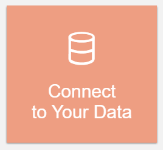
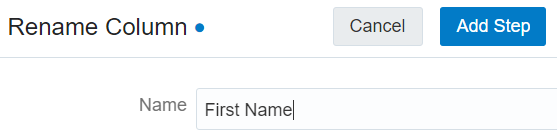
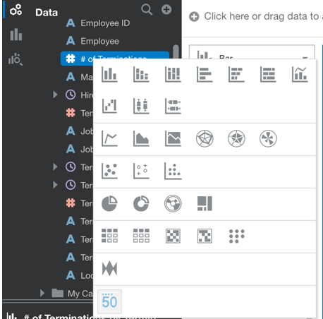
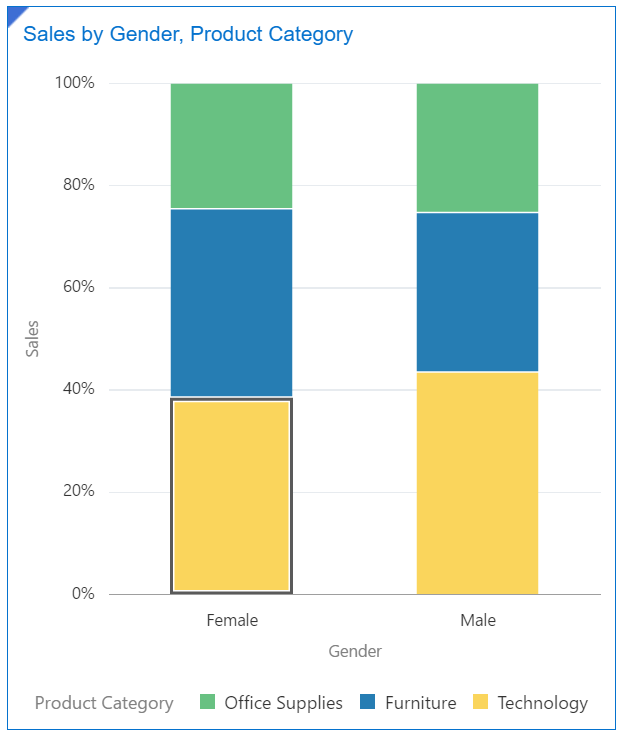
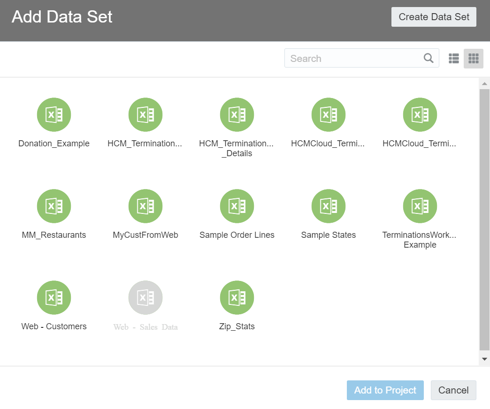
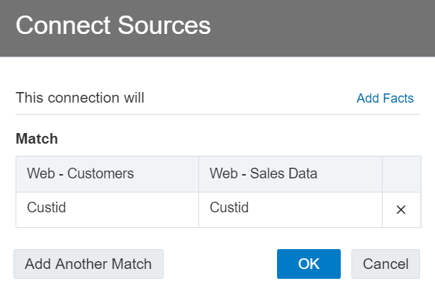
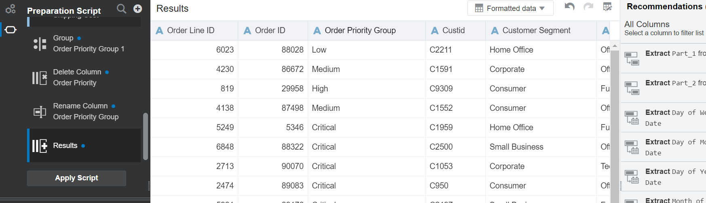
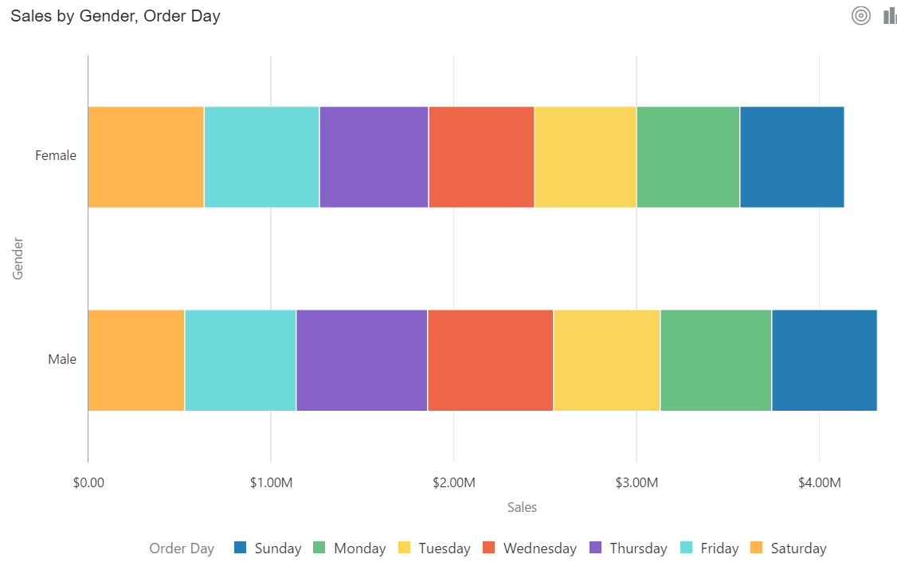
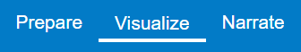
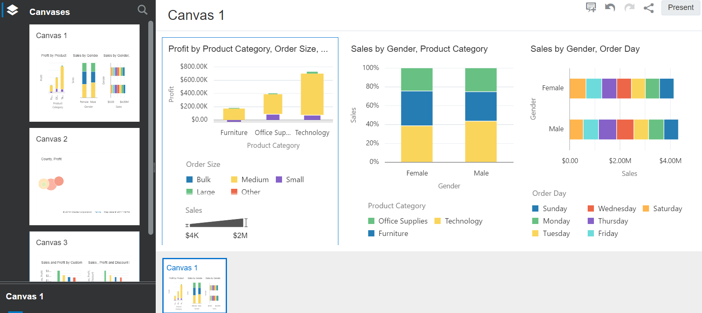

Lab Guide

Oracle Analytics Data Visualization

JULY 30, 2019

Table of Contents

[Lab Guide Overview ](#_Toc1645573)

[Lab 1: Getting Started ](#Lab-1--getting-started)

[Lab 2: Loading Data ](#Lab-2--loading-data)

[Lab 3: Building Visualizations](#Lab-3--building-visualizations)

[Lab 4: Augmented Analytics](#Lab-4--augmented-analytics)

[Lab 5: Chart Properties ](#Lab-5--chart-properties)

[Lab 6: Colors ](#Lab-6--colors)

[Lab 7: Filters ](#Lab-7--filters)

[Lab 8: Canvas Properties ](#Lab-8--canvas-properties)

[Lab 9: Augmented Analytics ](#Lab-9--augmented-analytics)

[Lab 10: Collaboration ](#Lab-10--collaboration)

[Lab 11: Data Preparation Loading Multiple Data Sets](#Lab-11--data-preparation-loading-multiple-data-sets)

[Lab 12: Data Preparation Transformations on Multiple Data Sets](#Lab-12--data-preparation-transformations-on-multiple-data-sets)

[Lab 13: Data Recommendations on Multiple Data Sets ](#Lab-13--data-recommendations-on-multiple-data-sets)

[Lab 14: Enhanced Insights on Multiple Data Sets ](#Lab-14--enhanced-insights-on-multiple-data-sets)

[Lab 15: Narration and Storytelling for Collaboration ](#Lab-15--narration-and-storytelling-for-collaboration)
 
 
 

# LAB Guide Overview

These labs are designed to complement your training, while reinforcing key
concepts by applying and demonstrating what you learn in the
presentation sessions.

Each lab allows you to get hands-on exposure working with Oracle Analytics. Upon completion of the lab, a group review of the key
takeaways will follow preparing you for the case study workshop.

## Lab Exercises

This workshop is made up of over a dozen labs with exercises. You will
be using Oracle Data Visualization Desktop locally on your computer.
During the course of these exercises you work with human resources
attrition data and with sales data which will help expose you to
Oracle Analytics capabilities.

The lab exercises will allow you to explore interesting Oracle Analytics
features as you build visualizations to discover deeper insights. You
will also begin to learn some of the key concepts of augmented
analytics, as well as, machine learning.

**Prerequisite**: Before starting these labs, you should have Oracle
Data Visualization Desktop installed and lab files downloaded to your
pc.

Download Oracle Data Visualization Desktop from here:

<https://www.oracle.com/middleware/technologies/oracle-data-visualization-desktop.html>

Lab files for Attrition data and Web Sales data can be found in the
GitHub repository.
 
 
 

# Lab 1:  GETTING STARTED

We will learn how to ingest data and to begin analyzing data sets to
understand some of the reasons that might be causing employee attrition.

We will be using Oracle Data Visualization Desktop for these labs and
our workshop.  Oracle Data Visualization Desktop and Oracle Analytics
Cloud have a similar look, feel and experience beginning with the data
visualization homepage, menus and navigation.

## Lab 1: Getting Started 

1.  Open the Oracle Data Visualization Desktop Homepage.
    
      
    
 Figure 1.1 
     
    
    1.  Note that the Homepage can be customized.

2.  Click the “burger” navigator icon to expose options to create new
    artifacts directly off the home page.
    
    2.  Open existing Projects
    
    3.  Open existing data sets or make new data source connections and
        more

        
        
        
 Figure 1.2 
 
 
         

3.  Click the same icon to return to the Homepage.

4.  Other areas on the Homepage include our interesting “Ask
    functionality” for search capability which allows users to enter
    native language queries to “ask” for data insights.  We will, of
    course, review this capability.
    
    
     
 Figure 1.3 
  

5.  Under the Ask functionality includes:
    
    4.  What’s New, which exposes recent visualizations
    
    5.  Projects which exposes the user’s projects
    
    6.  Data Sets

 
 
 

# Lab 2:  LOADING DATA 

In this lab we will load a single data file with attrition data.  We will
look at multiple methods to bring in data as part of the data ingestion
process.  We will also perform augmented enrichment recommendations on
the imported data.  Topics include:

  - Data Ingestion Process with attrition sample data

  - Auto-generation of Attributes and Measures

  - Modifying data properties

  - Enriching data sets from Augmented Recommendations

## Lab 2: Loading Data

1.  If you have loaded the HR Termination data onto your computer, you
    can simply drag and drop it onto the Oracle Data Visualization
    Desktop Home Page.
    
    
     
 Figure 2.1 
  
 

2.  Alternatively, you can click the Create button on the upper right
    and select Data Set and then browse or drop the file in the window.  

    In either case, the dataset will appear.
    

 Figure 2.2 
 

 
    

    

 Figure 2.3 
 
 

3.  Give the data set a logical name. For example, “HCM Data Set.”
    
    1.  The system has identified the data set columns as Attributes and
        Measures.  For example, Employee ID is an attribute and \# of
        Terminations is a measure.

4.  If you dragged the file onto the Home Page.  You can click the
    Visualize button and immediately begin building visualizations
    directly from the data import process.
    
    
    
 Figure 2.4 
 
 

5.  Control click \# of Terminations, Job Level Code and Termination
    Type from the Data Elements Pane on the right and drag them onto the
    canvas.  A visualization will be automatically generated.  Note
    however, to this point you have not done any data preparation or
    enrichment.
    
    
    
 Figure 2.5 
 
 

6.  Return to the Home Page without saving the visualization by clicking
    the back arrow to the right of “Untitled – Project.
    
    
    
 Figure 2.6 
 
 

7.  You should now see the new HCM\_Terminations data set in the “What’s
    New” area of the Home Page. 
    
    
 Figure 2.7 
 
 

8.  Now, click on the “Connect to Your Data” option to create a data set
    and then drag or drop the same file onto the wizard.  Here the data
    ingestion process is still basically the same, however, our data is
    exposed to more options for augmented data enrichment.
    
    
    
 Figure 2.8 
 
 
 

 Figure 2.9 
 
 
 

9.  Give the data set a logical name such as,
    HCM\_Termination\_Enriched\_Dataset. Note that the source of the
    data is the same as for the earlier data set.  This is why our name
    is simply a logical name, the physical data is still the same.  Next
    click Add which creates a dataset in our environment.
    
    
    
 Figure 2.10 
 
 

10. Because we used the Data Set Creation Wizard, the new data is
    displayed in the augmented window as part of the import process.  Not
    only has this process identified attributes and measures, but it has
    also been introspected against our demographic and geographic
    dictionaries and machine learning and artificial intelligence
    frameworks to create recommendations for the attributes.
    
    
    
 Figure 2.11 
 

    
    There are 30 recommendations for our data set.  The drop down arrow
    shows the specific number of recommendations for each attribute.
    Click the Employee attribute to view those specific recommendations.
    
    
    
 Figure 2.12 
 
 
 
 
 
 
 Figure 2.13 
 

11. Click the check mark in the first Employee attribute recommendation
    to Extract Part\_1 from Employee.  This recommendation will parse or
    extract the Employee first name and add a new an attribute directly
    to the right of the Employee attribute.  Note, the pane on the left
    that this enrichment recommendation is added as a script.
    

    
    
 Figure 2.14 
 

12. Rename this new column by clicking the options icon on the right of
    the column default name and enter First Name.  Then click Add Step.
    
    
    
 Figure 2.15 
 

    
    
 Figure 2.16 
 

13. Follow the same steps and parse the Employee last name and add it as
    an attribute.

14. Scroll to the Termination Date attribute and click it to show 7
    recommendations.  Follow the same steps to extract the month of the
    year from this attribute and rename it Termination Month.

15. Be sure to click Apply Script on the left side Data Preparation
    panel to apply these enrichments to the entire data set.

16. Click the back arrow to validate the data set creation in the Data
    Console.

17. Click the Navigator icon

 Figure 2.17 
 
    
    and then Data to access the Data Console

    

    
 Figure 2.18 
 

18. The Data Console shows all of your data sets.
    
    
    
 Figure 2.19 
 

 
 
 

# Lab 3:  BUILDING VISUALIZATIONS

In this lab you will begin building visualizations to understand more
about attrition.  Topics include:

  - Creating and saving a project

  - Creating a calculated measure

  - Creating visualizations

## Lab 3: Building Visualizations 

1.  Click the create button on the upper right of the Home Page or click
    on your attrition data set from the Home Page to begin the process
    to build visualizations. 
 

 Figure 3.1 
 

2.  Next click Project.
    
    
    
 Figure 3.2 
 
 

3.  Select the HCM Termination data set and then Add to Project.
    
    
    
 Figure 3.3 
 
 

4.  Now the interface will include the Visualization Pane on the right,
    the Grammar Pane in the middle and the Data Pane on the left.
    
    
    
 Figure 3.4 
 
 

5.  Double click on the \# of Terminations data element.
    
    
    
 Figure 3.5 
 
 

6.  Double click or drag and drop Termination Department on to the
    visualization.

7.  Double click or drag and drop Termination Reason on to the
    visualization.
    
    
    
 Figure 3.6 
 
 

8.  Click on the dropdown arrow on the first box in the Grammar Pane
    that says Horizontal Stacked to display the different chart types.
     Try changing a few but return to the Horizontal Stacked chart.

9.  Below the different chart types in the grammar pane, the X and Y
    axis are highlighted as Values and Category.  Also, the Color Box
    indicates how the chart is displayed.

10. Click the action menu on the upper right of the visualization to
    delete this chart.
    
    
    
 Figure 3.7 
 
 
    
    This will bring you back to a blank visualization pane.

11. Perform a multi-select control click on \# of Terminations,
    Termination Department and Termination Reason in the Data Pane and
    right click to choose Create Best Visualization.  Data Visualization
    Desktop looks at semantic information for the selected attributes to
    generate the best visualization.  Note that a title was generated for
    the visualization.
    
    
    
 Figure 3.8 
 
 

12. Replace Termination Reason by dragging and dropping Termination Type
    in the Colors Box in the Grammar Pane.

13. Remove Termination Type by clicking the X to the right of the
    attribute name in the Grammar Pane.
    
    Note, you can swap attributes within the Grammer Pane boxes to
    change the look of the chart.  For example, drag to swap the
    attributes between Category and Color.

14. Replace Termination Reason as the Color.

15. Click on \# of Terminations and then right click to select Pick
    Visualization.
    
    
    
 Figure 3.9 
 

    
    When the visualization types appear, select Tile to show the total
    number of terminations.  The new visualization is placed to the right
    of the original visualization.
    
    
    
 Figure 3.10 
 
 

16. Create a custom calculation to show the average number of
    terminations and the total number of terminations by department.
     Right click on My Calculations in the Data Pane.
    
    
    
 Figure 3.11 
 
 

17. The New Calculation Wizard allows you to build custom formulas by
    pointing and clicking. Begin by giving the calculation a meaningful
    name.
    
    1.  Next build the calculation by selecting functions on the right.
        Select the Aggregation option to display aggregation type
        functions.  Scroll down to Count Distinct. Double click or drag
        and drop Count Distinct to add it to the formula.
    
    2.  Click the greyed Column in the formula add an attribute. Select
        Termination Department as the column to perform the count
        distinct on.  Click the Validate button to check the syntax of
        the expression.  If the calculation is validated, click save.
    
    3.  Note, Data Visualization Desktop documentation (link in the
        Appendix) provides more information on building calculations.
        
        
        
 Figure 3.12 
 
 

18. Create another (slightly more complicated) calculation for the
    Average \# of Terminations by Department. 
 

 Figure 3.13 
 
 

19. Display the new calculations.
    
    4.  Right click the \# of Departments calculation to select a chart
        type. Select Tile.
    
    5.  Repeat for the Average \# of Terminations By Department.
        
        
        
 Figure 3.14 
 
 

20. Delete the 2 new tile visualizations by clicking the menu option on
    the upper right of each visualization and select Delete Visual.

21. Create another visualization by muli-selecting \# of Terminations
    and Termination Month.  Then, right click and select Create Best
    Visualization.
    
    The system has created a time series line chart.
    
    
    
 Figure 3.15 
 
 
    
    You know have created a canvas displaying meaningful information. 
    There is a total number of 132 attritions.  The bar chart shows that
    the service department has the highest attritions while the trend
    line shows that attrition is on the increase.

22. Save the project with an appropriate name such as HCM Attrition
    Analysis.
 
 
 

# Lab 4:  AUGMENTED ANALYTICS

This lab will review Oracle Analytics’ augmented analytics capabilities
and “explain or ask” functionality with machine learning driven
processes that help render deeper insights from datasets.  Topics
include:

  - System generated insights into data elements to find non-obvious
    patterns

  - System created best visualizations

  - Explain functionality

  - Pattern Brushing

## Lab 4: Augmented Analytics 

1.  Open your attrition project (which can be found on the Home Page).
    
    
    
 Figure 4.1 
 
 

2.  Right click on the Termination Reason attribute in the Data Elements
    Pane.
    
    
    
 Figure 4.2 
 
 

3.  Click on Explain Termination Reason in the popup menu.  A background
    machine learning process will generate insights which will assist
    you in understanding the factors that maybe impacting terminations
    and design distributions.
    
    
    
 Figure 4.3 

    
    
    
 Figure 4.4 

 

23. Add a few of these insights which were generated by the Explain
    feature to the project.

24. Select Basic facts about Termination reason by clicking the check
    mark in the upper right of the chart.

25. Scroll down and select # of Terminations by Termination reason.

26. Click on the Anomalies of Termination Reason box on the right and
    then select the Termination Reason: Career Progression chart.

27. Next, click the Add Selected button on the upper right to add these
    to a canvas.
    
    
    
 Figure 4.5 

 

28. Save the project.

29. Apply the Explain function to the measure # of Terminations.

30. Select # of Terminations by Job Level.

31. Select # of Terminations by Department.

32. Select # of Terminations by Job ID.

33. Select # of Terminations by Termination Type.

34. Select # of Terminations by Location Country.

35. Next, click the Add Selection button on the upper right to add these
    to a canvas.

36. Save the project.
    
    You should now have three canvases in your project with two based on
    insights from the Explain function.

37. Go to the Termination reason canvas.

38. On the Terminations by Termination reason bar chart, click on the
    action menu in the upper right to sort the chart.
    
    
    
 Figure 4.6 

 

39. On the \# of Terminations by Termination Reason bar chart, click on
    the action menu in the upper right to sort the chart.

40. Select Sort from High to Low.
    
    
    
 Figure 4.7 

 

41. Save the project.
 
 
 

# Lab 5:  CHART PROPERTIES

This lab is about working with charts and chart properties.  You will
review different visualization or chart types and manipulate data. We
will look at methods to make visualizations more meaningful and visually
pleasing.  Topics include:

  - Changing chart labels and axis labels

  - Modifying data formats

  - Modifying date/time formats

## Lab 5: Chart Properties 

1.  Open your attrition project (which can be found on the Home Page) to
    the canvas where you built your initial charts.
    
    
    
 Figure 5.1 

 

2.  Focus on the line chart and expand it by clicking diagonal arrows in
    the upper right of the chart.
    
    
    
 Figure 5.2 

 
    
    This will help us better explore the chart.

3.  Click the assignment button which is a bullseye icon to review the
    charts assignments.  This is a visual representation of how the
    attributes are positioned on the chart.  It contains the same
    information as in the Grammar Pane.
    
    
    
 Figure 5.3 

 

4.  Close the Assignment by clicking on the bullseye icon.

5.  Click the Bar icon on the chart to change the chart type to an Area
    Chart.
    
    
    
 Figure 5.4 

    
    
    
 Figure 5.5 

 
    
    Any changes will be reflected in the Grammar Pane on the left.

6.  Minimize the chart.

7.  Click the action menu which is the right most icon on the upper
    right of the chart to expose more chart properties.
    
    
    
 Figure 5.6 

 

8.  Click Zoom.  This capability is especially helpful if you have a lot
    of data displayed in a line chart.  Exit Zoom.

9.  Below the Data Elements Pane is the Property Pane.  If you are still
    focused on the line chart, this will display properties of the line
    chart (or whichever object: chart, data element…that has been
    selected).
    
    
    
 Figure 5.7 

 

10. The above graphic is displaying the area chart’s General Properties. 
    Based on the chart type, different properties will be displayed.

11. By default, the Title property will be Auto.  Click Auto and select
    Custom to customize the name of the chart.
    
    
    
 Figure 5.8 

 
 
 
 Figure 5.9 

 
12. Change the title to: Number of Terminations by Month.

13. Click on Line Type and then Straight to display different line
    options.  Click Curved to make the line a bit smoother.
    
    
    
 Figure 5.10 

 

14. Click Data Points and then change off to on, to display the data
    points on the chart.

15. To modify how the axis are labelled or the scale of the chart, click
    the icon with an arrow pointing up and one pointing to the right, to
    view the Axis properties.
    
    
    
 Figure 5.11 

 

16. To the left, the \# shows data number or value properties.
    
    
    
 Figure 5.12 

 

17. Click Data Values from off to on to display data values for the \#
    of Terminations on the chart.

18. Click Auto for the Aggregation Method to display various aggregation
    types for this measure.  The default is Auto, which is set during the
    data ingestion process.  Any change in aggregation will be reflected
    in the chart.
    
    
    
 Figure 5.13 

 

19. The number Format allows you to change the value format to currency
    or percent.

20. Move to the clock icon on the left to show time series properties.
    
    
    
 Figure 5.14 

 

21. These date/time properties are shown because we have a time series
    attribute, Termination Month as the X axis on the chart.

22. Click Show By to change how the Month attribute is displayed.

23. Click Format to change how the Month attribute is formatted.

24. The last icon is for chart’s analytics properties.
    
    
    
 Figure 5.15 

 

25. Click the + sign to view the additional properties that can be
    changed.
    
    
    
 Figure 5.16 

 
    
    Depending on the data, you could add advanced analytic functions for
    clusters, outliers, a reference line, a trend line or a forecast.

26. The data shows that terminations are rising. Add a trend line to see
    what it indicates.

27. Delete the trend line.

28. Switch the chart type back to a line chart.
 
 
 

# Lab 6:  COLORS 

This lab is about working with colors and color schemes and how to apply
them to visualizations.

## Lab 6: Colors 

1.  Continue to work with your attrition project and open it to the
    canvas where you built your initial charts.
    
    
    
 Figure 6.1 

 
    
    Colors on charts are auto-assigned based on the current project
    color pallet.

2.  Click the burger-like action menu icon on the upper right above the
    canvas (and below the Save button).
    
    
    
 Figure 6.2 

 

3.  Click Project Properties to display the Project Properties color
    options.
    
    
    
 Figure 6.3 

 

4.  Click Default to change the color palette.  You can also build a
    custom palette, for example a traffic light palette of red, yellow
    and green by clicking the Custom Palette option.

5.  Reset the palette to the default.

6.  You can also specify colors for a specific attribute or visualization.

7.  Focus on the stacked bar chart on this canvas and open the
    properties for the chart.
    
    
    
 Figure 6.4 

    
    
    
 Figure 6.5 

 

8.  Click Color and then Manage Assignment.
    
    
    
 Figure 6.6 

 

9.  You can select a specific color scheme for this chart by selecting a
    different palette.  You can change the color for a specific attribute
    by selecting the attribute and clicking from the available colors or
    a custom color.
    
    
    
 Figure 6.7 

 

10. Reset to the default scheme if you made any changes.
 
 
 

# Lab 7:  FILTERS 

This lab is about working with filters which reduce and focus the amount
of data shown on visualizations.  Topics include:

  - Range filters

  - Top - Bottom filters

  - List filters

  - Date filters

  - Expression filters

  - Drilling

## Lab 7: Filters

1.  Continue to work with your attrition project and open it to the
    canvas where you built your initial charts.

2.  Data elements can be dragged and dropped onto the Expression Filter
    Bar from the Data Pane.
    
    
    
 Figure 7.1 

 

3.  Select \# of Terminations from the Data Pane and then right click to
    create a filter.
    
    
    
 Figure 7.2 

 

4.  Because \# of Terminations is a number, we will build a Range
    Filter.
    
    
    
 Figure 7.3 

 

5.  For this example, we are interested in terminations greater than 4.
    You can hold and drag the slider to about 3.8 on the scale. As we
    change the filter range you can see the changes reflected in the
    visualizations.
    
    
    
 Figure 7.4 

 

6.  Clear the filter by clicking the Clear Filter Selections in the
    filter menu on the filter bar.
    
    
    
 Figure 7.5 

 
 

7.  Click the filter menu again then click Filter Type and select Top
    Bottom N. Next, select Method Top because we are looking for the top
    terminations months. Then change the count to two because we only
    want to see the top two months. Also, click All Attributes in Visual
    to expose the attributes in the visualization. Then select
    Termination Month.
    
    
    
 Figure 7.6 

    
    
    
 Figure 7.7 

 
 

8.  Delete the filter from the filter bar to reset the visualization.

9.  Select Termination Department from the Data Pane and then right
    click to build a List Filter.
    
    
    
 Figure 7.8 

 

10. Click to select departments from the left side of the dialogue box
    to be added as a list on the right for filtering.

11. Delete the filter.

12. Right click on Termination Month in the Data Pane and then right
    click to build a date filter.
    
    
    
 Figure 7.9 

 

13. In the calendar tool, select December 1, 2014 as the start date and
    March 1, 2015 as the end date.
    
    
    
 Figure 7.10 

 

14. This range will be selected in the visualizations.

15. Delete the filter.

16. Right click anywhere on the filter bar and select Add Expression
    Filter
    
    
    
 Figure 7.11 

 

17. Building this filter will be similar to building a calculation where
    you build formulas to be considered as a condition to be applied to
    visualizations.

18. Double click on \# of Terminations in the Data Pane to enter it into
    the expression.  Then enter \> 2 because we want to look at all data
    points where the termination count is greater than 2.

19. Validate the expression.
    
    
    
 Figure 7.12 

 

20. Apply the expression filter.

21. Delete the filter to reset the canvas.

22. Drilling is another way to filter data.  You can drill to drill to a
    data element or through hierarchies in data elements.  For example
    drilling from Quarters to Months that make up a Quarter.

23. Right click on the Career Progression bar of the \# of Terminations
    by Termination Reason bar chart.
    
    
    
 Figure 7.13 

 

24. Click Drill and then click Manager ID.
    
    
    
 Figure 7.14 

 
 

 Figure 7.15 

 

25. You have drilled from Career Progression to the Manager IDs of
    employees terminated due to lack of Career Progression (without
    having to build a \# of Terminations by Termination Reason and
    Managers visualization).

26. Click the undo button. 

 Figure 7.16 

 
 
 

# Lab 8:  CANVAS PROPERTIES

This lab is about canvas management, properties, layout settings and how
to interact with visualizations to organize the discovery process. 
Topics include:

  - Organizing and arranging visualizations on a canvas

  - Resize visualizations

  - Synchronizing visualizations

  - Refreshing data

## Lab 8: Canvas Properties

1.  Continue to work with your attrition project and open it to the
    canvas where you built your initial charts.
    
    
    
 Figure 8.1 

 

2.  Data elements can be dragged and dropped onto the Expression Filter
    bar from the Data Pane.

3.  Click the action menu to the far right of the Expression Filter bar.
    
        
 Figure 8.2 

 

4.  Select Refresh Data.  This will retrieve the latest data from the
    data sources to display in the visualizations.

5.  To refresh metadata, select Refresh Data Sets which will make any
    updates such as if an attribute or column name has been changed.

6.  Select the Clear Canvas option to clear the active canvas.  Because
    we don’t want to start fresh, undo the changes by clicking the undo
    arrow.
    
     
 Figure 8.3 

 

7.  Select Canvas Properties
    
     
 Figure 8.4 

 

8.  You can rename the canvas, change the layout, modify the size and
    turn off the default of synchronizing the visualizations.

9.  You can also perform much the same actions from the canvas dropdown
    directly on the canvas name on the interface.  You can also Duplicate
    or Delete the Canvas.
    
     
 Figure 8.5 

 

10. Return to the canvas properties.
    
     
 Figure 8.6 

 

11. The synchronize visualizations property is set to yes by default.
    This means that all actions such as drills and filters are applied
    to all visualizations on the canvas.
    
    If this property is set to no (unchecked), it means that any action
    will affect the visualization that the action is applied against.

12. Right click on Career Progression in the stacked bar chart to expose
    the popup menu.  Select Keep Selected.  You are now focusing only on
    this Termination Reason in each visualization.
    
     
 Figure 8.7 

    
    Note this action automatically added a filter on the Expression
    Filter bar.
    
     
 Figure 8.8

 

13. Delete this filter.

14. Return to the canvas properties.
    
     
 Figure 8.9

 
 

15. Select Copy Visual to copy the stacked bar chart visualization.

16. Click anywhere on the canvas between existing visualizations to
    paste it.
    
     
 Figure 8.10

 
    
    Note that selecting Duplicate Visual performs the same as copy.

17. This is helpful because you may want to keep the same data elements
    (or most of them), but you want to change the chart type.  On the
    copied visualization change the chart type to Tree Map.
    
     
 Figure 8.11

    
    Because we don’t need to analyse the tree map by category, delete
    the Termination Department from the Category box.
    
     
 Figure 8.12

    
    Also, often times with a tree map, a legend is not necessary and
    simply clutters the visualization.  Delete the legend in the Property
    Pane by changing Auto to None (if you would like, do the same for
    the stacked bar chart).
    
     
 Figure 8.13

    
    Now you have a tree map visualization for the \# of Terminations by
    Termination Reason.
    
     
 Figure 8.14

 

18. This is also helpful if you want to copy a similar visualization
    into another canvas.  Click the + sign on the canvas bar and copy
    this visualization onto it.
    
     
 Figure 8.15

 

19. You can move any visualization on a canvas by simply clicking it and
    dragging it to a blue bar between visualizations and dropping it.

20. Drag the tree map to the right of the stacked horizontal bar chart
    and drop it.
    
     
 Figure 8.16

 

21. Visualizations can be resized by “hovering” or “mousing” over a
    chart and dragging the edge.  Resize the tree map and stacked bar by
    dragging them to the right.  Do the same to expand their height.
    
     
 Figure 8.17

 
    
    Notice that the Tile visualization has been readjusted to fit the
    screen.

22. Click the diagonal arrows on the stacked bar chart to expand it and
    then click the menu to and re-sort it from Low to High.
    
     
 Figure 8.18

    
     
 Figure 8.19

 

23. Copy the stacked bar chart into a new canvas.

24. Change the chart type to a table.
    
     
 Figure 8.20

 

25. Click the Property Pane for the table and go to General properties.
    
     
 Figure 8.21

    
    This is where you can change the title or modify the legend.  Click
    Supress Repeating Values and notice the change in the Termination
    Department column.  The table is now easier to understand.
    
     
 Figure 8.22

 

26. Click the Property Pane for the table and go to the Edge Labels
    which is the second icon.
    
     
 Figure 8.23

 
    
    For the Termination Department, enable Show Total which will display
    the total number of terminations by department.

27. For the Termination Department, enable Show Total which will display
    the total number of terminations by department.
    
     
 Figure 8.24

 

28. Save the project 
  
 
 
 

# Lab 9:  AUGMENTED ANALYTICS

This lab is about augmented analytics and natural language query
processing which allows you to ask questions of the data, search content
and generate visualizations automatically.

## Lab 9: Augmented Analytics

1.  Go to your Home Page.
    
     
 Figure 9.1

 

2.  Natural Language Query is available on the Home Page by entering a
    query in the “What are you interested in?” search box.

3.  As a business user, you may want to find information on attrition
    count by department and reason.  Type the query, “attrition count by
    department and reasons,” in the search box and then press enter.
    
     
 Figure 9.2

 

4.  The tool now interprets this natural language to find semantics and
    generates a visualization.
    
     
 Figure 9.3

 
    
    Click the X on the search bar to clear the query and return to the
    Home Page.

5.  Enter the following with a typo into the search box and hit enter:
    “attrition count by termination typo.”

6.  Even with a typo, you still return results from this natural
    language query.
    
     
 Figure 9.4

 
    
    Click the X on the search bar to clear the query and return to the
    Home Page.

7.  A sample sales project is included with Data Visualization Desktop. 
    Without opening this project, enter the following query: “profit by
    product category by city.”
    
     
 Figure 9.5

 
    
    Oracle Analytics examined the semantics of the query and matched it
    with a project that included the combination of those semantics and
    attributes from your natural language query to generate
    visualizations which best matched the query.
 
 
 

# Lab 10:  COLLABORATION

This lab is addresses how to share visualizations projects with
colleagues for collaboration.  Topics include:

  - Exporting projects

  - Sharing projects

  - Importing projects

## Lab 10: Collaboration

1.  Go to your Home Page.  You can export a project directly from the
    Home Page by right clicking the action menu on a project and
    selecting Export.
    
     
 Figure 10.1

 

2.  The Export dialogue window allows you to export a project as a file,
    in an email or push it to the cloud.
    
     
 Figure 10.2

 

3.  Click File.
    
     
 Figure 10.3

 

<!-- end list -->

1.  You can change the name of the project/file, include the data sets
    and also connection credentials if connecting to a data source such
    as a database.  Note that in a production environment, you would not
    typically share data, only the connection information.  In this
    example, the blue circle indicates that data is to be included.  You
    can click the blue circle to toggle it to white, which is off or not
    included.

2.  The format for the project is a .DVA, for data visualization
    artifacts file which can be opened by Data Visualization Desktop and
    Oracle Analytics Cloud.

<!-- end list -->

4.  It is also possible to share a project from an open project.
    
     
 Figure 10.4

 

5.  The share option form an open project also includes the ability to
    print.  You can select which canvas or canvasses, or an active
    visualization to print as a PDF.

6.  You can also import projects. Click the action menu on the home page
    and click Import Project.
    
     
 Figure 10.5

    
    
 Figure 10.6

 

7.  Browse for the School Donation Project.DVA (or any .DVA file that
    you have locally) and import it.
    
     
 Figure 10.7

 

8.  View the imported project in the project folder. On the Home Page,
    click the burger icon on the upper left.
    
     
 Figure 10.8

 

9.  Click Projects and the imported project will be displayed under
    “Today” and include a sample visualization with the default name
    “Simple Visual Analysis” in the name.
    
     
 Figure 10.9

 

10. Click on the project to view a project with multiple canvasses and
    multiple visualizations.
    
     
 Figure 10.10

 
 
 

# Lab 11:  DATA PREPARATION LOADING MULTIPLE DATA SETS

This lab is addresses data preparation and loading multiple data sets.
Topics include:

  - Augmented Data Preparation

## Lab 11: Data Preparation Loading Multiple Data Sets

In this lab you will prepare data and load multiple data sets.  You will
also use Augmented Data Preparation capabilities to ingest and blend two
data sets.
 
 

*For these labs, use the Web-Sales and Web-Customers data files.*

Note, these exercises will build on tasks that you have previously
completed.
 
 

There are multiple ways that you can load data sets:

  - Drag and drop files directly onto the Home Page

  - Create data sets with pre-built connectors

  - Import a data set directly into a Project

<!-- end list -->

1.  From the Home Page, select Create on the upper right.
    
     
 Figure 11.1

 
 

2.  Select Data Set and then click to browse.
    
     
 Figure 11.2

 

3.  Load and open Web-Sales Data.xlsx.  The data appears in a preview
    window so you can verify that it is the file you want to open
    
     
 Figure 11.3

 

4.  You can change the name of the data set and a description.

5.  Review each column to ensure that it has been appropriately
    identified as an attribute or measure.

6.  Because Order Line ID is numeric, it has been incorrectly identified
    as a measure.  Change it to an attribute by clicking the measure \#
    sign icon and select Attribute.
    
     
 Figure 11.4

 

7.  Click Add in the upper right to start the data set creation process. 
    The file will be ingested and will go through a complex semantic
    profiling process.
    
     
 Figure 11.5

 

8.  Repeat this process for Web-Customers.xlsx.

9.  You now have two new data sets which can be found by clicking the
    Data tab.  The Data Console will display all of your data sets
    including the two new data sets for Web Sales and Web Customers.
    
     
 Figure 11.6

     
 Figure 11.7

 

10. You can manage your data sets from here by clicking the action menu
    on the right side of each data set.
    
     
 Figure 11.8

 
    
    You can create a project based on the data set, open the data set,
    reload the data, delete it and more.
 
 
 

# Lab 12:  DATA PREPARATION TRANSFORMATIONS ON MULTIPLE DATA SETS

This lab is addresses data transformations to prepare the data for
analysis.

## Lab 12: Data Preparation with Transformations on Multiple Data Sets

You will create a project with two data sets and learn to modify column
properties including changing data types, setting aggregations,
formatting and more.

1.  From the Home Page, navigate to the data management screen.
    
     
 Figure 12.1

 

2.  Locate the Web Sales data set.  Click on the actions menu and create
    a project with this data set.
    
     
 Figure 12.2

 

3.  A blank canvas is displayed where you can immediately begin to build
    visualizations. However, you should perform some data transformation
    prior to building your analysis.  Click on the Prepare option on the
    tool bar.
    
     
 Figure 12.3

 

4.  This takes you to the prepare area with a Script Pane on the left
    which will display all actions taken on the data.  The automatically
    generated recommendations based on semantic profiling of the data
    performed on ingestion is displayed on the right, and the data set
    is in the middle.
    
    By clicking on the Formatted Data drop down to view the Metadata.
    
     
 Figure 12.4

 
    
    Metadata is simply data about the data.  It displays data elements,
    data types, aggregation if any, and more.  Similar to the formatted
    data, the metadata was a result of the data profiling which was
    performed on ingestion.

5.  Return to the Formatted Data view.

6.  Clicking on a column name will display the property pane for the
    selected column.  From here, you can make modifications as need for
    column name, if it should be treated as an attribute or measure, and
    the data type.

7.  For example, Order ID (like Order Line ID) should not be treated as
    a measure.  Change it to an attribute.

8.  Scroll to the right to the measure Profit.  Notice that Profit and
    other measures are not well formatted from the data ingest process.

9.  Select the Profit column and notice in the Property Pane that the
    Name, Treat As, Data Type and Aggregation seem correct.
    
     
 Figure 12.5

    
    Click on the \# sign in the Property Pane to change the formatting.
    
     
 Figure 12.6

 
    
    Change the Number Format to Currency.  Make similar changes to the
    other measures which require formatting.

10. Scroll to the left to the Order Priority Column.  Notice the
    different priorities including Critical and Not Specified.  Let’s
    perform a Group on this column to make it a little easier to view.
    Click the actions menu and select Group.
    
     
 Figure 12.7

 

    
    Build 3 groups instead of 5 different values for the rows in this
    column.

11. Name the first group Low and include the values Low and Not
    Specified.
    
     
 Figure 12.8

 

12. Click the + sign next to Group to add another Group.
    
     
 Figure 12.9

 
    
    Name the second group High and include High and Critical in this
    group.
    
    Because only the value of Medium remains, it is not necessary to
    manually build a third Group.

13. Click Add Step
    
    
 Figure 12.10

 
    
    Note that the newly created Group by Order Priority Group 1 column
    is directly to the right of the original Order Priority column.  Also
    note, that these actions are now included in the Script Pane on the
    left.  You can delete the original Order Priority column and rename
    Order Priority Group 1 to Order Priority Group.

14. Scroll to the Quantity Ordered column and build another “group
    type.”  Right click the action menu and notice that because this
    column is a measure, the options are different from those available
    for an attribute.  To create a new column based on a range of values
    for quantity ordered called Order Size.  Right click the action menu
    and select Bin.
    
     
 Figure 12.11

 

15. Create four bins for order size.  Name the first bin Small for orders
    up to a quantity of 10. The second bin will be named Medium for
    quantities 11 to 50.  Name the third bin Large for quantities 51 to
    100.  Name the final bin Bulk for orders over 100.
    
     
 Figure 12.12

 

    
    Click Add Step and Name the new column Order Size.
    
    Now you have another new column, Order Size based on ranges from the
    Quantity Ordered column that did not exist in the original data set.

16. Now that you have performed a few transformations on this data set,
    you are ready to bring in the second data set to blend it with the
    original data set.  This will allow you to create more meaningful
    visualizations.

17. Click on the + sign to the right of the Data Set tab on the bottom
    of the screen to add another data set.
    
     
 Figure 12.13

 

18. A window displays data sets that are available. Select Web-Customers
    and click Add to Project.
    
     
 Figure 12.14

 

19. There are now two data set tabs on the bottom of the screen.  You are
    able to switch between the data sets by clicking on the tabs.
    
     
 Figure 12.15

 

20. Click on Data Diagram tab to the left of the data set tabs.  The
    system has found a common key or join between the two data sets.
    
    
 Figure 12.16

 

21. Click the 1 which signifies the single key between the data sets.
    
    
 Figure 12.17

 
    
    Because the system recognized the match of Custid from Web-Customers
    and Web-Sales the data sets.  Thus our link.
    
    This dialogue allows you to manually change a key or join or add
    additional keys if a more complex join is necessary.

22. Click the Web Sales tab.

23. Notice that the enrichment actions that you performed on the data
    are displayed in the Data Pane on the left have a blue dot.  This
    means that these actions have not been applied to the entire data
    set.  Click Apply Script to do so.  After the actions have been
    applied, the blue dots disappear which indicates that the actions
    have been successfully applied.
    
     
 Figure 12.18

 
    
    Note, that as you add more enrichments to a data set, the number of
    sequential actions listed in this pane will increase.

24. Save your project.
 
 
 

# Lab 13:  DATA RECOMMENDATIONS ON MULTIPLE DATA SETS

This lab is about machine language driven data recommendations to
transform and enrich data leading to more meaningful and deeper insights
during analysis.  You will learn that system generated automatic data
recommendations based on semantic profiling are more significant than
basic column property changes and manual transformations.  You will work
with sensitive-type data, and enrich data with system inferred geographic
and demographic information.

## Lab 13: Data Recommendations on Multiple Data Sets

1.  Open your web sales analysis project.

2.  Open the Web Customers data set and navigate to the Prepare Pane.
    
     
 Figure 13.1

 

3.  On the right side there are a significant number of recommended
    actions that can be taken on the data which are a result of the
    semantic profiling that was performed on the data during the ingest
    process.  Click on the drop down in the upper right to see all of the
    recommendations that are suggested for each of the columns in the
    data set.
    
    To work with recommendations for specific columns, you can either
    select them from the list exposed in the drop down or select the
    column header in the data set.

4.  Click on the First Name column and notice that there is an
    interesting enrichment recommendation for adding a column called
    Gender based on first name.  This may be interesting to have for
    sales analysis.
    
    To accept this recommendation, simply slick on the check mark as you
    hover on the recommendation.  When accepted, a new column is added to
    the right of the First Name column, the recommendation disappears
    from the Recommendation Pane and the associated action is added to
    the Script Pane.

5.  Make two changes to this new column.  First change the column name to
    Gender. Second, because the case of the data in the rows does not
    match that of other data.  Click the action menu on the column header
    and select Sentence Case.

6.  Scroll to Street Address to extract the street number form the
    street address.  Click Extract Part 1 from Street Address.  Also,
    rename the new column to Street Number and change it from a measure
    to an attribute.

7.  Scroll to the City column which has a number of suggested
    enrichments from the profiling process.  Select the population and
    jurisdiction suggestions.  Be sure to rename each column.
    Jurisdiction should become County.

8.  Scroll to the Email column and select the email domain
    recommendation because this could be good information for a
    marketing campaign.

9.  Scroll to the Birthdate column.  Because this maybe sensitive date,
    extract month of year from birthdate.  Rename the column Customer
    Birthdate Month.  Also, delete the potentially sensitive Birthdate
    column so that it is not exposed by us for any down-stream analysis.

10. The system is able to detect sensitive data such as credit card
    numbers and also automatically provides remediation to fully or
    partially obfuscate the data.
    
    We really can’t do anything with credit card numbers, so delete the
    column.  Also delete the CCV and CCExpires columns.

11. The system has found another sensitive column, Social Security
    Number and has made some recommendations.  Accept the recommendation
    to obfuscate the first five digits of customers’ social security
    numbers.

12. Be sure to click Apply Script to apply these recommendations.

13. Navigate to the Web Sales data and scroll to Order Date and extract
    day of week from the column.  This will provide us with potentially
    valuable information on the day of the week that orders are placed.

14. Apply the script and save the project.
 
 
 

# Lab 14:  ENHANCED INSIGHTS ON MULTIPLE DATA SETS

This lab is about enhanced insights with enriched data sets to deliver
deeper analysis.

## Lab 14: Enhanced Insights on Multiple Data Sets

1.  Open the web sales analysis project and navigate to the Visualize
    Pane.
    
    We want to discover insights from both sales and customer data sets.

2.  Recall that you added a column called Gender which was not part of
    either original data set.  Build a bar chart to see if sales by
    gender yields any interesting insights.
    
    Drag and drop \# Sales form the Data Pane to the middle of the blank
    visualization.  Drag Gender from Customers in the Data Pane into the
    Category box.  Note that although this visualization is not adding
    very much insight, even this would not have been possible without
    enhancing the original data sets with Gender.

3.  Enhance the visualization by adding another dimension which you
    build as an enrichment.  Drag Order Day into the color box.
    
    Finally, we have something that is a bit interesting. We can see
    that Males are placing more orders on Thursdays.
    
     
 Figure 14.1

 

4.  Create a second visualization to see if we can leverage what we
    discovered in the first visualization.
    
    Drag \# Sales to the left of the bar chart until the area turns blue
    and drop it to create a new visualization.  Change the bar chart to a
    100% stacked bar chart so that we will be able to see what each
    gender is purchasing relative to their entire spend amount.
    
    Now, drag and drop Gender into the Category box. Next, drop Product
    Category into the Color box.

5.  In order to break this out by sales by category, right click on
    either bar and sort from low to high.
    
     
 Figure 14.2

    
     
 Figure 14.3

 
    
    Finally, we have a little more insightful analysis.  Females spend
    almost the same as Males on Technology but they spend more than
    Males on Furniture.  However, both groups spend about the same
    percent on Office Supplies.
    
    Create a third visualization to see if there are any insights to be
    found involving around Order Size.  Recall that Order Priority was a
    column that you created with a bin for Bulk, Large, Medium and Small
    orders.  See if there is a correlation between Order Priority and
    Profit.

6.  Drag \# Profit to the left of the stacked 100% bar chart to create
    the new visualization and change it to a stacked bar chart.  Drag
    Product Category into the Category box.  Next, drag the enriched
    column Order Size into the Color box.  Finally, drag \# Sales into
    the Size box.
    
     
 Figure 14.4

 
    
    This visualization is interesting.  It indicates that medium size
    orders are the most profitable categories.  Look more closely and you
    should notice that small size furniture orders are not really
    profitable and are costing the company money.  Also, large orders are
    sporadic and also not very profitable.  These are clearly enhanced,
    meaningful insights.

7.  Add a fourth visualization to discover where the most profitable
    customers are ordering from so that you might want to direct more
    marketing and attention to this segment.  First, click on the + sign
    on the bottom of the screen to create a new canvas.
    
     
 Figure 14.5

 

8.  Drag the enriched column County, was built based on the City geo
    recommendation, to the center of the new canvas.  Change the
    visualization type to Map.  Drag and center the map if necessary. 
    This shows each county where purchases have been made.

9.  Because this map is bland, drag the same data element, County and
    drop it in the Color box.  Next, drag \# Profit into the Size Box.
    
    This is still difficult to understand.  Add a filter by hovering over
    # Profit in the Size box and select Create Filter.

    
     
 Figure 14.6

    
    In the Start Range enter 10,000 and simply click on the map.
    
     
 Figure 14.7

 
    
    Now, you can see the most profitable counties in the country which
    could be an important and insightful analysis that the marketing
    group will be interested in.
 
 
 

# Lab 15:  NARRATION AND STORYTELLING FOR COLLABORATION

In this lab you will learn how to use narrate to share discoveries as a
business analyst.  This feature allows you to create visually compelling
stories based on the results of analysis to serve as a basis for
collaboration and discussion.

## Lab 15: Narration and Storytelling for Collaboration

1.  Open the Web Sales project to the first canvas.  Click on Narrate on
    the top left of the screen.
    
     
 Figure 15.1

    
    This brings us to a blank canvas in the center of the screen.  On the
    left side are the four canvases that made up this project.
    
     
 Figure 15.2

 
    
    Typically, projects are made up of multiple canvases.  Select from
    the thumbnail list of canvases which are available to make up the
    story.  Note that, not all canvases must be used as a story is
    created.

2.  There a two ways to add a canvas to your story, click on the small
    action menu on the upper right of each canvas thumbnail.
    
     
 Figure 15.3

    
    Select Canvas 1 to Add To Story.
    
     
 Figure 15.4

 

3.  Next, drag and drop a second canvas thumbnail onto the bottom pane
    next to Canvas 1.
    
     
 Figure 15.5

 

4.  The properties for each selected canvas can be modified on the
    bottom left.
    
     
 Figure 15.6

 

5.  You can also click the action menu on any visualization to hide it
    from the narration.
    
     
 Figure 15.7

    
    On the first narration canvas click the action menu to delete the
    stacked bar graph for Sales by Gender and Order Day.
    
     
 Figure 15.8

 

6.  You can also add page descriptions which will help the story and
    foster collaboration.
    
     
 Figure 15.9

    
    Click the check box and add a meaningful description or even a
    question.
    
     
 Figure 15.10

    
     
 Figure 15.11

7.  Add a notes and position them in any visualization by clicking the
    Note button on the upper right.
     

     
 Figure 15.12

    
     
 Figure 15.13

 

8.  In the Property Pane, select the Presentation for Story Navigation,
    then choose Filmstrip or Compact.
    
     
 Figure 15.14

 

9.  Click Present to start the presentation.
    
     
 Figure 15.15

 

10. The strip at the bottom of the screen can be used to navigate thru
    your presentation.
    
    As with any presentation, you would begin with an overview and go on
    to explain your story by navigating thru the visualizations.

11. Click the X in the upper right to exit the presentation.
    
     
 Figure 15.16

 

12. Save the project with the narration to be able to share it.

13. Click the Share icon in the upper right to share your story as a
    file, an email, upload it to the cloud or to print it.
    
     
 Figure 15.17

    
    If you share the narration as a file you can decide to share it as a
    Powerpoint, PDF, or an image, a CSV or a data visualization DVA
    package.
    
     
 Figure 15.18

 
 
 
 
 
 

# 

# Appendix: HELPFUL SITES 

<https://docs.oracle.com/en/middleware/bi/data-visualization-desktop/bidvd/preface.html#GUID-4A42E034-CDE3-47F8-B36E-FA769DA7E6AA>

<https://docs.oracle.com/en/middleware/bi/data-visualization-desktop/bidvd/get-started-dvdesktop.html>
