Lab Guide

Oracle Analytics Data Visualization - COSE

JULY 2019

Table of Contents

[Lab Guide Overview ](#Lab-overview)

[Lab 1: Getting Started ](#Lab-1--getting-started)

[Lab 2: Loading Data ](#Lab-2--loading-data)

[Lab 3: Building Visualizations](#Lab-3--building-visualizations)

[Lab 4: Augmented Analytics](#Lab-4--augmented-analytics)

[Lab 5: Chart Properties ](#Lab-5--chart-properties)

[Lab 6: Filters ](#Lab-6--filter)

[Lab 7: Collaboration ](#Lab-7--collaboration)

[Lab 8: Data Preparation Loading Multiple Data Sets ](#Lab-8--data-preparation-loading-multiple-data-sets)

[Lab 9: Data Preparation Transformations on Multiple Data Sets ](#Lab-9--data-preparation-transformation-on-multiple-data-sets)

[Lab 10: Data Recommendations on Multiple Data Sets ](#Lab-10--data-recommendations-on-multiple-data-sets)

[Lab 11: Enhanced Insights on Multiple Data Sets](#Lab-11--enhanced-insights-on-multiple-data-sets)

[Lab 12: Narration and Storytelling for Collaboration](#Lab-12--narration-and-storytelling-for-collaboration)

# Analytics Lab Overview

This course is for users of Oracle Analytics Cloud and Oracle DesktopData Visualization. It requires little or no prior experience with ana nalytics tool.

These labs are designed to complement your training, reinforcing the key concepts by applying and demonstrating what you learn in the
presentation sessions. This lab guide is comprised of a dozen labs
providing hands-on experience. Upon completion of the labs, you will be prepared to work on the case study workshop.

## Lab Exercises

You will be using Oracle Data Visualization Desktop locally on your
computer to complete the labs. During the course of these exercises you
work with human resources attrition data, as well as with, sales data
which will help to expose you to Oracle Analytics capabilities.

The lab exercises will allow you to explore interesting Oracle Analytics
features as you build visualizations to discover deeper insights. You
will also begin to learn some of the key concepts of augmented analytics
and machine learning.

**Prerequisite**: Before starting these labs, you should have Oracle
Data Visualization Desktop installed and lab files downloaded to your
pc.

Download Oracle Data Visualization Desktop from here:

<https://www.oracle.com/middleware/technologies/oracle-data-visualization-desktop.html>

Lab files for Attrition data and Web Sales data can be found on the
GitHub repository.

<https://github.com/oracle/learning-library/tree/master/ospa-library/analytics/labs_and_workshop_data>

# Lab 1: Getting Started

We will be using Oracle Data Visualization Desktop for these labs and
our workshop. Oracle Data Visualization Desktop and Oracle Analytics
Cloud have the same look, feel and experience beginning with the data
visualization homepage, menus and navigation. We’ll begin by learning
about the Homepage interface.

1.  Open the Oracle Data Visualization Desktop Homepage.
    
     
     
 Figure 1.1 

    
    1.  Note that the Homepage can be customized by clicking the
        “burger” icon on the upper right.

2.  Click the “burger” navigator icon on the upper left to expose
    options to create new artifacts directly off the home page:
    
    2.  Open existing Projects
    
    3.  Open existing data sets or make new data source connections
    
    4.  Return to the Home Page and more
        
         
        
 Figure 1.2 

        
         
        
 Figure 1.3 

3.  Click the same icon to return to the Homepage.

4.  Other areas on the Homepage include our interesting “Ask
    functionality.” This is search capability that allows users to enter
    native language queries to “ask” or search for data insights. We
    will, of course, review this capability.
    
    
    
 Figure 1.4 

5.  Below the Ask functionality options include:
    
    5.  What’s New, which displays recent visualizations
    
    6.  Projects which displays the user’s projects
    
    7.  Data Sets

# Lab 2: Loading Data 

In this lab we will load a single data file with attrition data. We will
also perform augmented enrichment recommendations on the imported data.
Topics include:

  - Data Ingestion Process

  - Auto-generation of Attributes and Measures

  - Modifying data properties

  - Enriching data sets based on Augmented Recommendations

  

 Figure 2.1 

1.  Let’s begin on the Home Page. Then, click the Create button on the
    upper right to bring up the Create Wizard.
    
    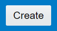 
    
 Figure 2.2 

2.  Next, select the Data Set Create Wizard.
    
    Note, a data set contains data from subject areas including:
    uploaded data or files such as spreadsheets, Oracle Applications or
    databases.

3.  Then browse for, or drop the HR Termination data file in the window.
    
    
    
 Figure 2.3 

   
    
    The data set will then be displayed.
    
    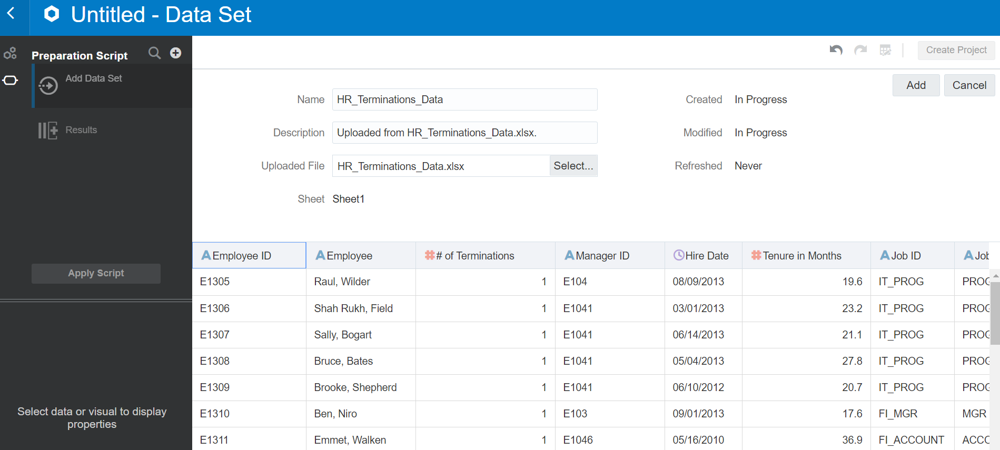 
 Figure 2.4 

4.  Give the data set a logical name. For example, “HCM Data Set.”
    
    1.  The source of the data is the same as for the earlier data set.
        This is why our name is simply a logical name, the physical data
        is still the same.
    
    2.  The system has identified the data set columns as Attributes and
        Measures.
        
        An attribute is a characteristic of the data. For example,
        Employee ID is an attribute.
        
        A measure is data that can be counted, aggregated or
        mathematically manipulated. For example, \# of Terminations is a
        measure.
    
    3.  Note, however, to this point you have not done any data
        preparation or enrichment.

5.  Next click the Add button on the upper right which creates the
    dataset in our environment.
    
    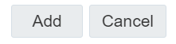 
    
 Figure 2.5 

6.  Because we used the Data Set creation Wizard, the new data set is
    displayed in the augmented window as part of the import process. Not
    only has this process identified attributes and measures, but it has
    also been introspected against our demographic and geographic
    dictionaries, as well as machine learning and artificial
    intelligence frameworks to create recommendations for the
    attributes.
    
    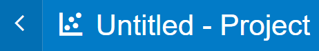 
    
 Figure 2.6 

    
    There are 30 recommendations for the data set. The drop down arrow
    shows the specific number of recommendations for each attribute.
    Click the Employee attribute to view those specific recommendations.
    
    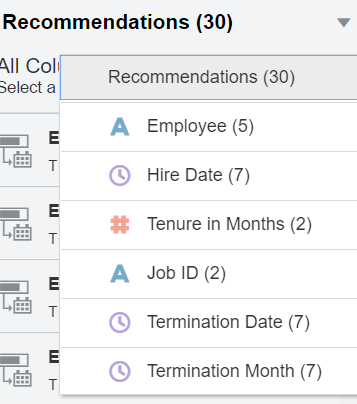 
    
 Figure 2.7 

    

7.  Click the check mark in the first Employee attribute recommendation
    to Extract Part 1 from Employee. This recommendation will parse or
    extract the Employee first name and add a new an attribute directly
    to the right of the Employee attribute. Note, the Preparation Script
    Pane on the left, that this enrichment recommendation is added as a
    script.
    
    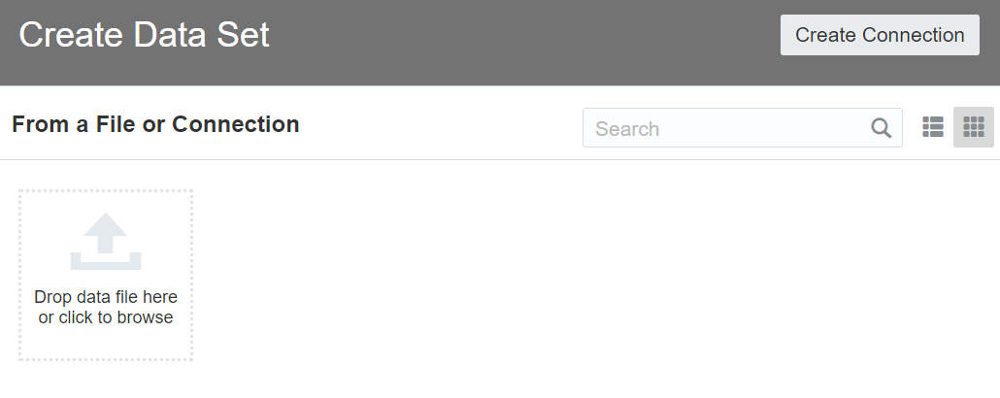 
    
 Figure 2.8 

8.  Rename this new column by clicking the options icon to the right of
    the column default name and change it to First Name. Then click Add
    Step.
    
     
    
 Figure 2.9

    

9.  Follow the same steps and parse the Employee last name (which is Employee Part 3) and add it as an attribute.

10. Scroll to the Termination Date attribute and click it to show 7 recommendations. Follow the same steps to extract the month of the year from this attribute and rename it Month of Termination.

11. Be sure to click Apply Script on the Preparation Script Pane on the left to apply these enrichments to the entire data set.

12. Click the back arrow to validate the data set creation in the Data Console.

13. Click the Navigator icon, 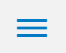 
 Figure 2.10 

    
    and then Data to access the Data Console.
    
     
    
 Figure 2.11 

14. The Data Console shows all of your data sets.
    
    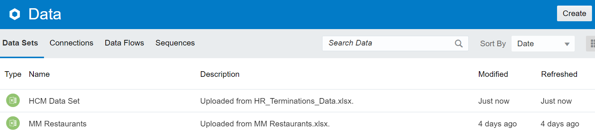 
    
 Figure 2.12 

# Lab 3: Building Visualizations

In this lab you will begin building visualizations to understand more
about attrition. Topics include:

  - Creating and saving a project

  - Creating a calculated measure

  - Creating visualizations

1.  Now, we are ready to begin creating visualizations. From the Home
    Page, click the Create button on the upper right to begin the
    process to build visualizations.
    
     
    
 Figure 3.1 

2.  Next, click Project.
    
    Projects contain visualizations to help you analyze data in a productive and meaningful way. Projects can include one or more data
    sets containing the data that you want to visualize and explore.
    
     
    
 Figure 3.2 

3.  Select the HCM Data Set and then, Add to Project.
    
    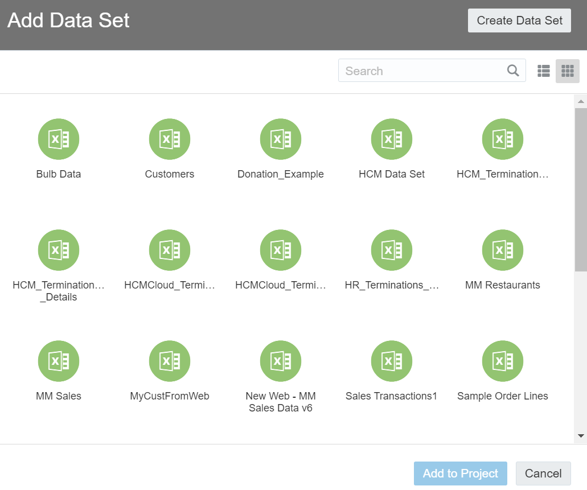 
    
 Figure 3.3 

4.  We now see the interface for building visualizations. This interface
    includes the Visualization Pane on the right, the Grammar Pane in
    the middle and the Data Elements Pane on the left.
    
     
    
 Figure 3.4 

5.  Double click on the \# of Terminations attribute in the Data Element Pane. The system automatically displays the total number of terminations as a horizontal bar chart.
    
    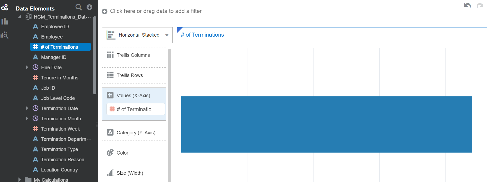 
    
 Figure 3.5 

6.  Now, scroll down in the Data Elements Pane and double click or drag and drop Termination Department directly on to the visualization.

7.  Next, double click or drag and drop Termination Reason on to the visualization. We now have a stacked horizontal bar chart.
    
    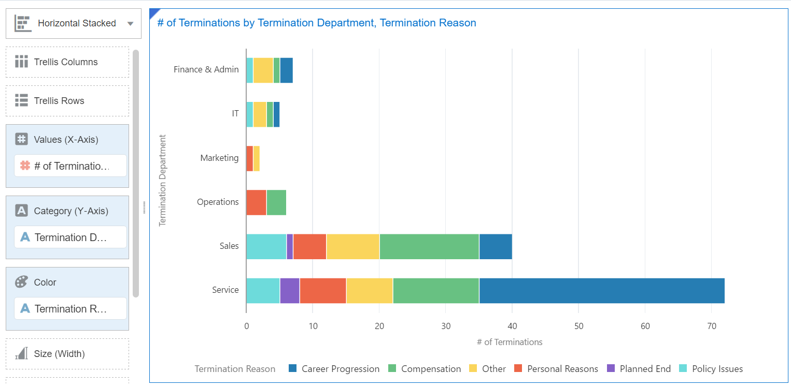 
    
 Figure 3.6 

    
    Also, note the Grammar Pane to the left of the visualization, the Values box or x-axis is the \# of Terminations, the Category box or
    y-axis is the Termination Department and the Color box is Termination Reason.

8.  Click on the dropdown arrow on the top box in the Grammar Pane that says Horizontal Stacked to display the different available chart types. Try switching to a few chart types.

9.  Click the “burger-like” action menu on the upper right of the visualization, then select Delete Visual from the bottom of the
    pop-up menu.
    
    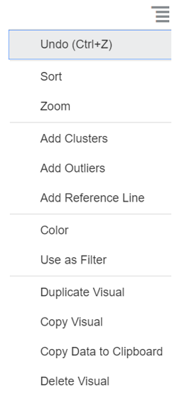 
    
 Figure 3.7 

    
    This will bring you back to a blank Visualization Pane.

10. Perform a multi-select by control clicking on \# of Terminations, Termination Department and Termination Reason in the Data Elements Pane, and then right click to choose Create Best Visualization. Data Visualization Desktop looks at semantic information of the selected attributes and measures to generate the best visualization. Note, a title was automatically generated for the visualization.
    
    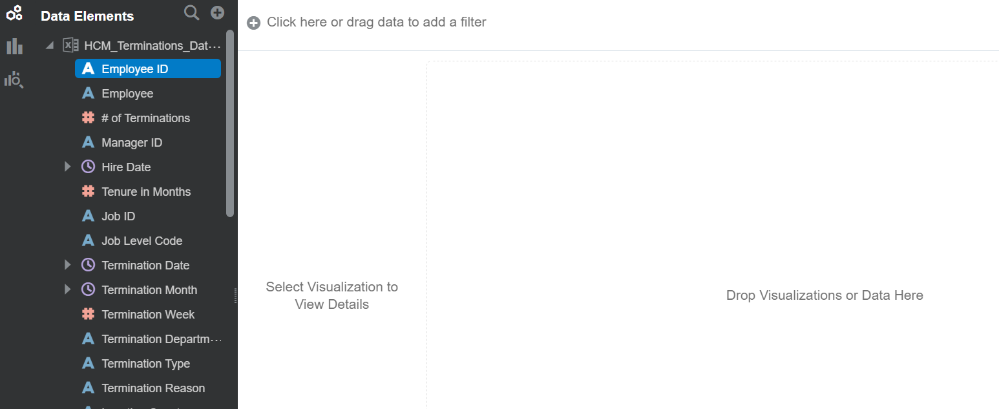 
    
 Figure 3.8 

11. Replace Termination Reason by dragging and dropping Termination Type in the Colors box in the Grammar Pane.

12. Remove Termination Type by clicking the X to the right of the attribute name in the Grammar Pane.
    
Note, you can swap attributes within the Grammar Pane boxes to change the look of the chart. For example, drag to swap the attributes between the Category box and the Color box.

13. Return Termination Reason to the Color box.

14. Click on \# of Terminations and then right click to select Pick Visualization.
    
     
    
 Figure 3.9 

    
    
    When the visualization types appear, select Tile to show the total number of terminations. The new visualization is placed to the right of the original visualization.
    
    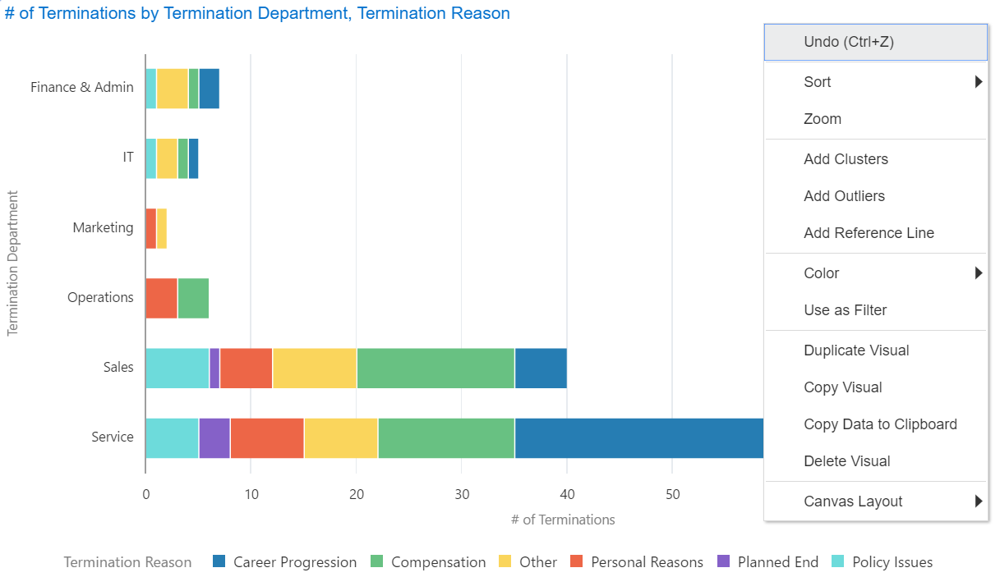 
    
 Figure 3.10 

15. Now, let’s create a custom calculation to show the average number of
    terminations and the total number of terminations by department.
    Begin by right clicking on the My Calculations option in the Data
    Elements Pane. Then select Add Calculation.
    
     
    
 Figure 3.11 

16. The New Calculation Wizard allows you to build custom formulas by pointing and clicking. Begin by giving the calculation a meaningful name such as \# of Departments.
    
    1.  Next, build the calculation by selecting from the functions on the right side of the window. Select the Aggregation option to display aggregation type functions. Scroll down to
    CountDistinct. Double click or drag and drop CountDistinct to add it to the formula.
    
    2.  Click the greyed Column in the formula to add an attribute from the data elements. Select Termination Department as the column
    to perform the count distinct on. Click the Validate button to check the syntax of the expression. If the calculation is validated, click save.
    
    3.  Note, Data Visualization Desktop documentation (link in the Appendix) provides more information on building calculations.
        
        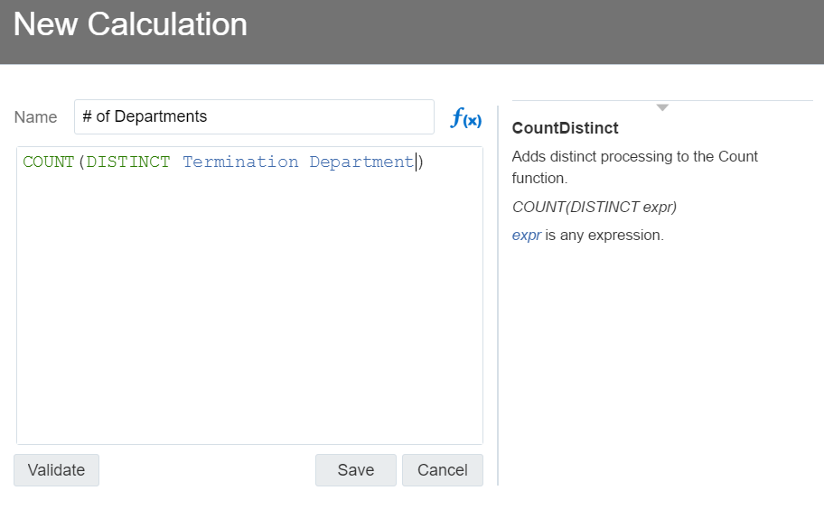 
        
 Figure 3.12 

17. Create another (slightly more complicated) calculation for the Average \# of Terminations by Department. Open the Calculation Wizard Window and enter the name of the calculation.
    
     
    
 Figure 3.13 

    
    4.  Select the Aggregation option to display aggregation type functions. Scroll down to Avg. Double click or drag and drop Avg to add it to the formula.
    
    5.  Click the greyed Column in the formula to add a measure.  Select # of Terminations and remove the closed parentheses figure “)” after # of Terminations.  Note, we will add the closed parentheses figure “)” shortly 
    
    6.  Go back to the list of functions on the right and click on
        Operators and select “/” for division.
    
    7.  Go back to the Aggregate group and select CountDistinct.
    
    8.  Click the greyed Column in the formula to add the attribute
        Termination Department. Now add the closed parentheses figure
        “)” so there will be two close parentheses at the end of the
        formula. Note, you always need and even number of open and
        closed parentheses in a formula. Click the Validate button to
        check the syntax of the expression. If the calculation is
        validated, click save.

18. Display the new calculations which can be found in the My
    Calculations folder in the Data Elements Pane.
    
    9.  Right click the \# of Departments calculation. Select Pick
        Visualization, then select Tile.
    
    10. Repeat for the Ave \# of Terminations by Department.
        
        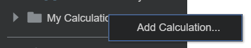 
        
 Figure 3.14 

19. Delete the 2 new tile visualizations by clicking the menu option on
    the upper right of each visualization and select Delete Visual.

20. Create another visualization by multi-selecting \# of Terminations and Termination Month. Then, right click and select Create Best Visualization.
    
    The system creates a time series line chart.
    
     
    
 Figure 3.15 

    
    You have now created a canvas displaying meaningful information.
    There are a total number of 132 terminations. The bar chart shows
    that the service department has the highest attritions while the
    trend line shows that attrition is on the rise.

21. Save the project with an appropriate name such as HCM Attrition
    Analysis. Close the project.

# Lab 4: Augmented Analytics

This lab will review Oracle Analytics’ augmented analytics capabilities,
and “explain or ask” functionality with machine learning driven
processes that help render deeper insights from datasets. Topics
include:

  - System generated insights into data elements to find non-obvious
    patterns

  - Explain functionality

  - Natural Language Query

  - What are you interested?
 

1.  Open your attrition project (which can be found on the Home Page).
    
    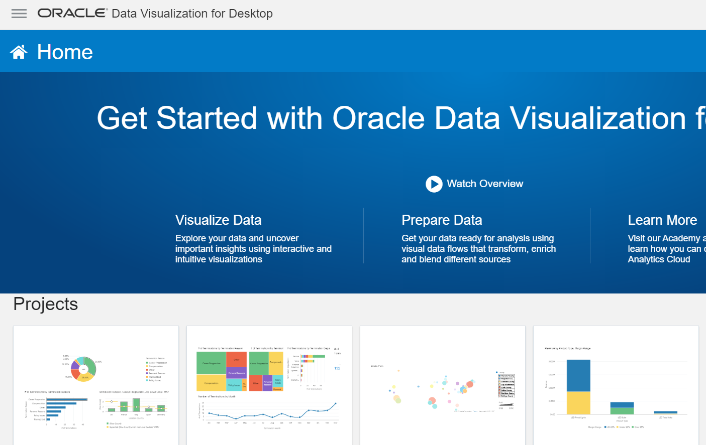 
    
 Figure 4.1 

2.  Click the + sign to the right of Canvas 1 at the bottom of the
    interface to add a new canvas. Right click on the Termination Reason
    attribute in the Data Elements Pane.
    
     
    
 Figure 4.2 

3.  Click on Explain Termination Reason in the popup menu. A background
    machine learning process will generate insights which will assist
    you in understanding the factors that maybe impacting terminations
    and design distributions.
    
     
    
 Figure 4.3 

    
    Step thru the four different insights on the left side of the window
    by highlighting each of them.
    
    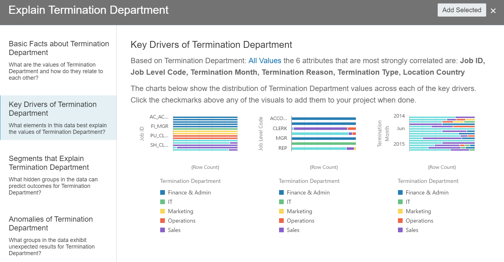 
    
 Figure 4.4 

4.  You can add a few of these insights which were generated by the Explain feature to the project.

5.  Select the Basic Facts about Termination Reason (the first explain insight on the left side) by mousing-over the pie chart and clicking the check mark in the upper right.

6.  Within the Explain Termination Reason Window, use the scroll bar on the right and scroll down to the next group of bar charts. Select the first bar chart on the left, \# of Terminations by Termination
Reason by clicking the check mark in the upper right.

7.  Next, click the Add Selected button on the upper right to add these to a canvas.
    
     
    
 Figure 4.5 

8.  Save the project.

9.  Go to the Explain Termination Reason canvas.

10. On the \# of Terminations by Termination Reason bar chart, click on
    the action menu in the upper right.
    
    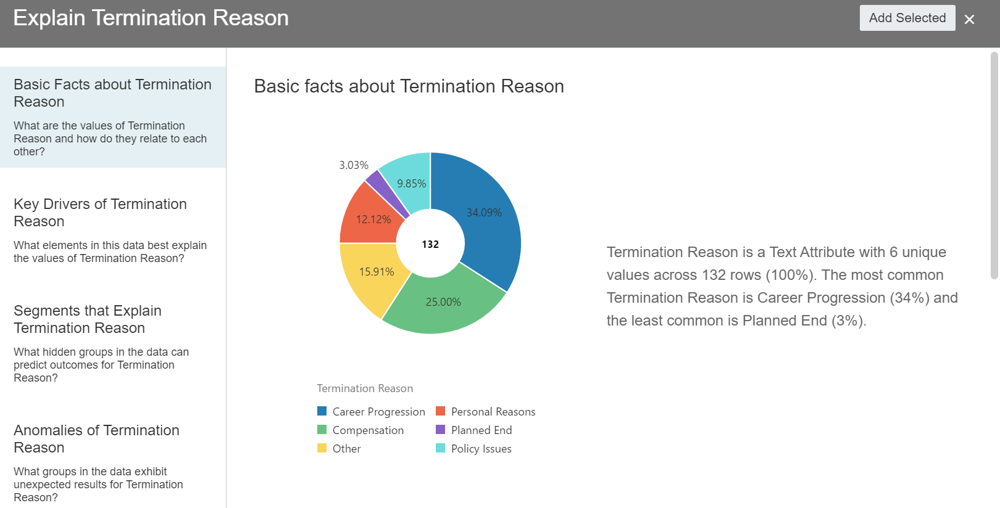 
    
 Figure 4.6 

11. Sort the chart from High to Low.
    
    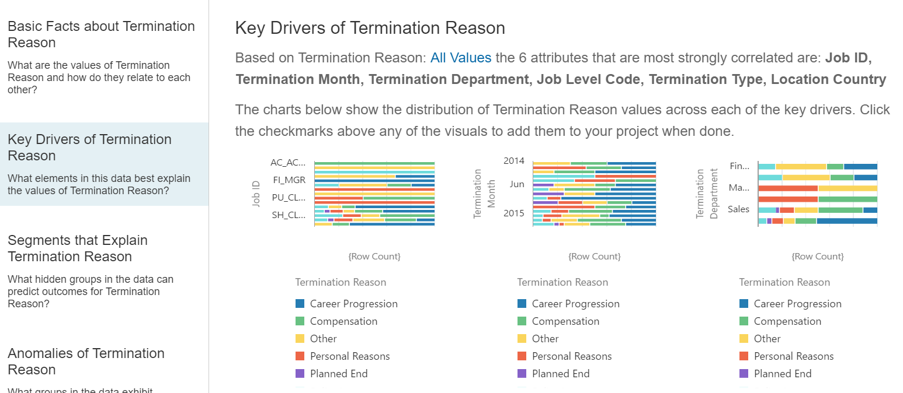 
    
 Figure 4.7 

12. Save the project.

13. Return to your Home Page.
    
    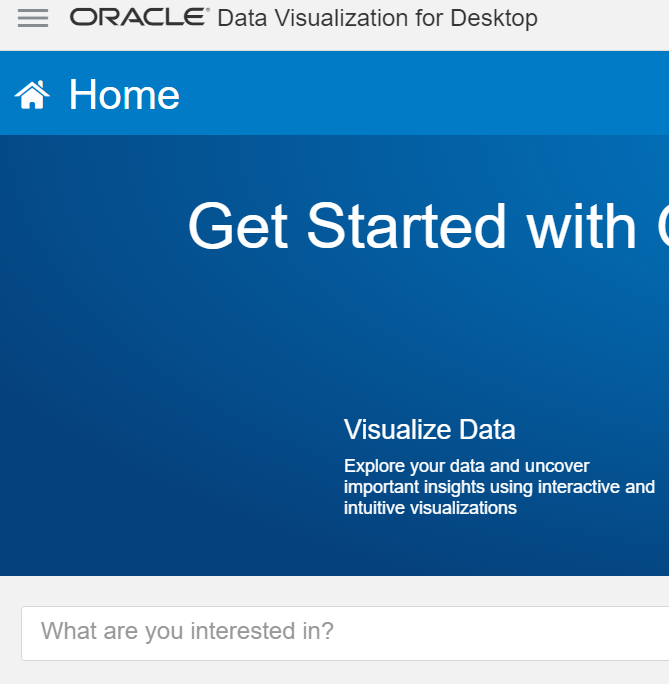 
    
 Figure 4.8 

Oracle Analytics’ Natural Language Query processing allows you to ask questions of the data, search content and generate visualizations automatically.

14. Natural Language Query is available on the Home Page by entering a query in the “What are you interested in?” search box.

15. As a business user, you may want to find information on attrition count by department and reason. Type the query, “attrition count by department and reasons,” in the search box and then press enter.
    
     
    
 Figure 4.9 

16. The tool now interprets this natural language to find semantics and
    generates a visualization.
    
    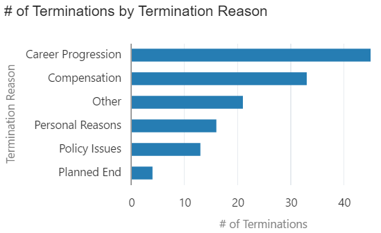 
    
 Figure 4.10 

    
    Click the X on the search bar to clear the query and return to the Home Page.

17. Enter the following with a typo into the search box and hit enter “attrition count by termination typo.”

18. Even with a typo, you still return results from this natural language query.
    
    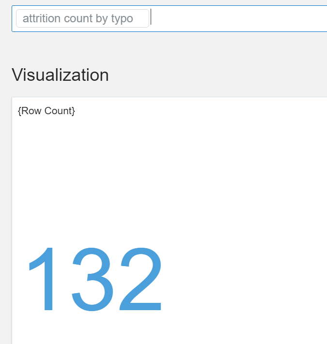 
    
 Figure 4.11 

    
    Click the X on the search bar to clear the query and return to the Home Page.

19. A sample sales project is included with Data Visualization Desktop. Without opening this project, enter the following query: “profit by product category by city.”
    
    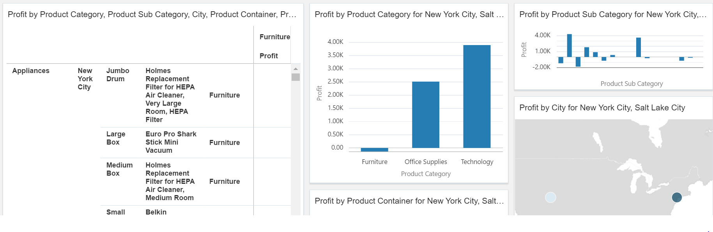 
    
 Figure 4.12 

    
    Oracle Analytics examined the semantics of the query and matched it with a project that included the combination of those semantics and
    attributes from your natural language query to generate visualizations which best matched the query.

# Lab 5: Chart Properties

This lab is about working with charts and chart properties. We will look
at methods to make visualizations more meaningful and visually pleasing.
Topics include:

  - Changing chart labels and axis labels

  - Modifying data formats

  - Modifying date/time formats

1.  Open your attrition project (which can be found on the Home Page) to the canvas where you built your initial charts.
    
    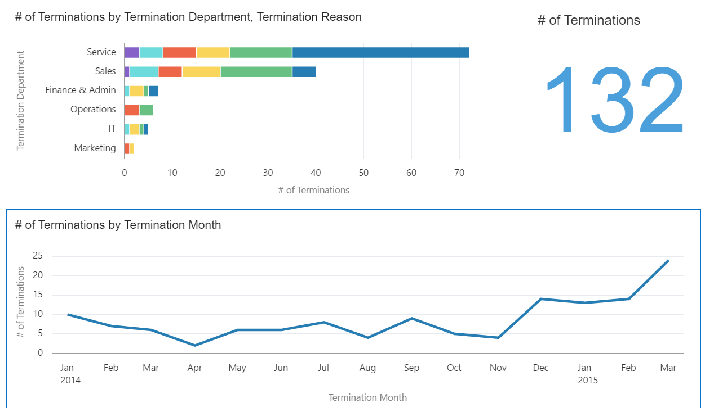 
    
 Figure 5.1 

2.  Focus on the line chart and expand it by clicking diagonal arrows in the upper right of the chart.
    
     
    
 Figure 5.2 

    
    This will help us better explore the chart.

3.  Next click the Bar icon on the chart to the left of the arrows to change the chart type to an Area Chart.
    
     
    
 Figure 5.3 

    
    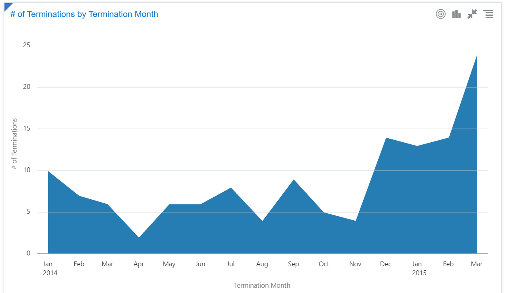 
    
 Figure 5.4 

4.  Minimize the chart by clicking diagonal arrows.

5.  Click the action menu which is the right most icon on the upper right of the chart to expose more chart properties.
    
    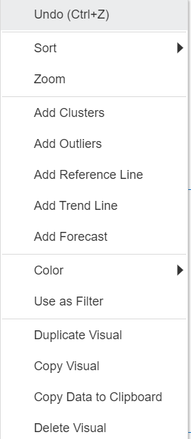 
    
 Figure 5.5 

6.  Click Zoom. This capability is especially helpful if you have a lot of data displayed in a line chart. Exit Zoom.

7.  Below the Data Elements Pane is the Property Pane. If you are still focused on the line chart, this will display properties of the line chart (or whichever object: chart, data element… that has been selected).
    
    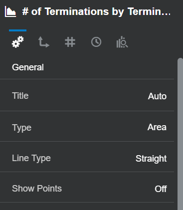 
    
 Figure 5.6 

8.  The above graphic (Figure 5.6)
    General Properties. Based on the chart type, different properties will be displayed.

9.  By default, the Title property will be Auto. Click Auto and select Custom to customize the name of the chart.
    
     
    
 Figure 5.7 

    

10. Change the title to: Number of Terminations by Month.

11. Click on Line Type and then Straight to display different line options. Click Curved to make the line a bit smoother.
    
     
    
 Figure 5.8 

12. Click Data Points and then change off to on, to display the data points on the chart.

13. To modify how the axis are labelled or the scale of the chart, click the icon with an arrow pointing up and one pointing to the right, to view the Axis properties.
    
     
    
 Figure 5.9 

14. To the right, the \# shows data number or value properties.
    
    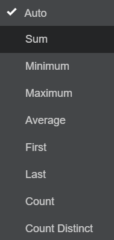 
    
 Figure 5.10 

15. Click Data Values from off to on to display data values for the \# of Terminations on the chart.

16. Click Auto for the Aggregation Method to display various aggregation types for this measure. The default is Auto, which is set during the data ingestion process. Any change in aggregation will be reflected in the chart.
    
     
    
 Figure 5.11 

17. The number Format allows you to change the value format to currency or percent.

18. Move to the clock icon on the right to show time series properties.
    
     
    
 Figure 5.12 

19. These date/time properties are shown because we have a time series attribute, Termination Month as the X-axis on the chart.

20. Click Show By to change how the Month attribute is displayed.

21. Click Format to change how the Month attribute is formatted.

22. The last icon is for chart’s analytics properties.
    
    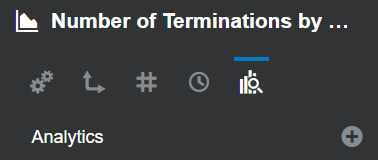 
    
 Figure 5.13 

23. Click the + sign to view the additional properties that can be changed.
    
    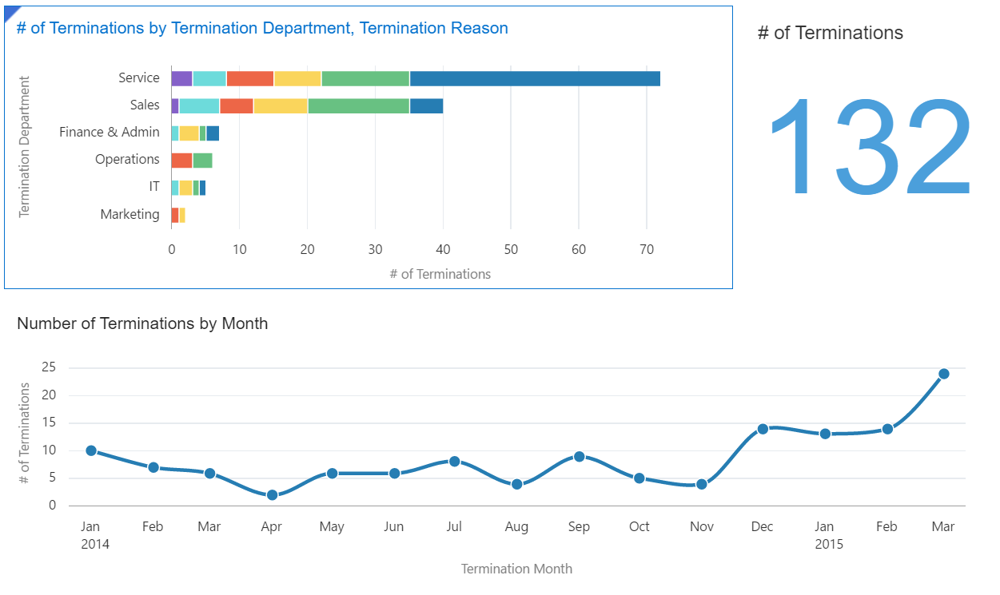 
    
 Figure 5.14 

    
    Depending on the data, you could add advanced analytic functions for clusters, outliers, a reference line, a trend line or a forecast.
    Refer to Data Visualization Desktop documentation for more information on these topics.

24. The data shows that terminations are rising. Add a trend line to see what it indicates.

25. Delete the trend line.

26. Switch the chart type back to a line chart.

# Lab 6: Filters

This lab is about working with filters which reduce and focus the amount
of data shown on visualizations. Topics include:

  - Range filters

  - Top - Bottom filters

  - List filters

  - Date filters

  - Expression filters

  - Drilling

1.  Continue to work with your attrition project and open it to the canvas where you built your initial charts.

2.  The Expression Filter bar is located above the Visualization Pane. Data elements can be dragged and dropped onto it from the Data Elements Pane.
    
    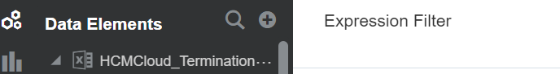 
    
 Figure 6.1 

3.  Or, you can select a data element such as \# of Terminations from
    the Data Elements Pane and then right click it to create a filter.
    
    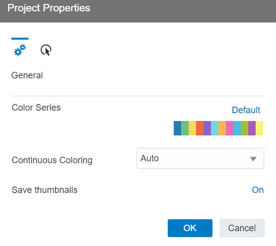 
    
 Figure 6.2 

4.  Because \# of Terminations is a number, we will build a Range
    Filter.
    
    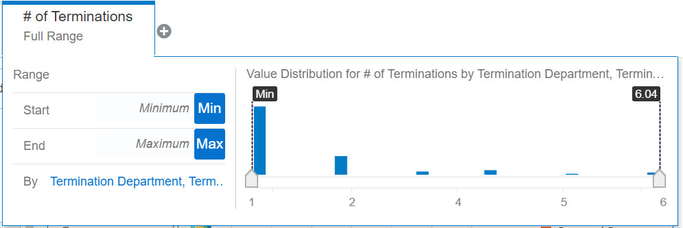 
    
 Figure 6.3 

5.  For this example, we are interested in terminations greater than 4.
    You can hold and drag the slider to about 3.8 on the scale. As we
    change the filter range you can see the changes reflected in the
    visualizations.
    
    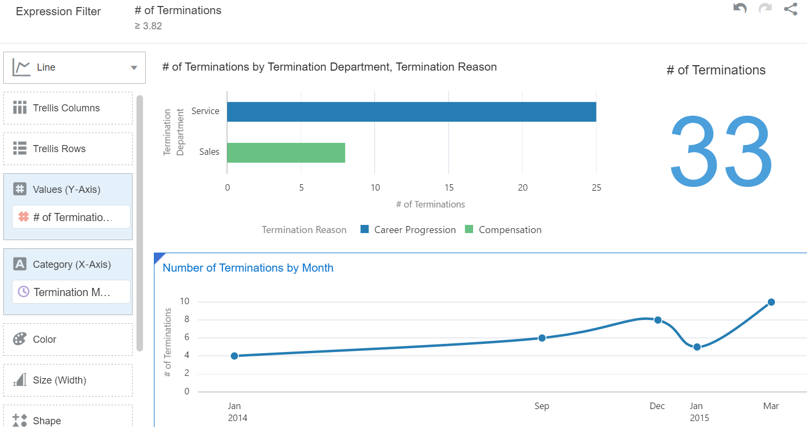 
    
 Figure 6.4 

6.  Clear the filter by clicking the drop down arrow on the filter
    expression and select Clear Filter Selections in the filter menu on
    the filter bar.
    
     
    
 Figure 6.5 

7.  Click the filter menu again then click Filter Type and select Top Bottom N. Select Method Top because we are looking for the top terminations months. Then, change the count to two because we only
want to see the top two months. Also, click All Attributes in Visual to expose the attributes in the visualization. Then select Termination Month.
    
  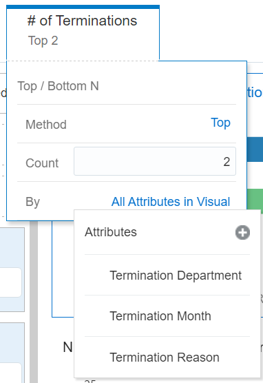 
  
 Figure 6.6 

    
  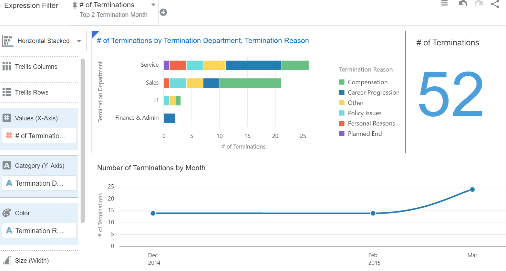 
  
 Figure 6.7 

8.  Delete the filter from the filter bar to reset the visualization.

9.  Select Termination Department from the Data Elements Pane and then right click to build a List Filter.
    
     
    
 Figure 6.8 

10. Click to select departments from the left side to be added as a list on the right for filtering.

11. Delete the filter.

12. Right click on Termination Month in the Data Elements Pane and then right click to build a date filter.
    
    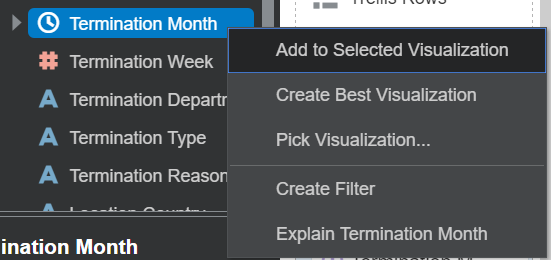 
    
 Figure 6.9 

13. In the calendar tool, select December 1, 2014 as the start date and
    March 1, 2015 as the end date.
    
     
    
 Figure 6.10 

14. This range will be reflected in the visualizations.

15. Delete the filter.

16. To build an expression filter, right click anywhere on the filter bar and select Add Expression Filter.
    
    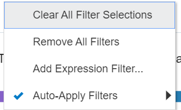 
    
 Figure 6.11 

17. Building this filter will be similar to building a calculation where you build formulas to be considered as a condition to be applied to visualizations.

18. Double click on \# of Terminations in the Data Elements Pane to enter it into the expression. Then enter \> 2 because we want to look at all data points where the termination count is greater than 2.

19. Validate the expression.
    
     
    
 Figure 6.12 

20. Apply the expression filter.

21. Delete the filter to reset the canvas.

22. Drilling is another way to filter data. You can drill to a data element or through hierarchies in data elements. For example, drilling from Quarters to the Months that make up a Quarter.

23. Right click directly on the Career Progression bar of the \# of Terminations by Termination Reason bar chart to bring up a menu.
    
    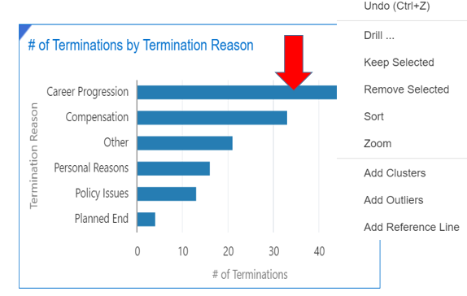 
    
 Figure 6.13 

24. Click Drill and then select Manager ID.
    
     
    
 Figure 6.14 

25. You have drilled from Career Progression to the Manager IDs of employees terminated due to lack of Career Progression (without having to build a \# of Terminations by Termination Reason and Managers visualization).

26. Click the undo button.  
 Figure 6.15 

# Lab 7: Collaboration

This lab addresses how to share visualization projects with colleagues
for collaboration. Topics include:

  - Exporting projects

  - Sharing projects

  - Importing projects

1.  Go to your Home Page. You can export a project directly from the
    Home Page by right clicking on a project’s action menu and selecting
    Export.
    
     
    
 Figure 7.1 

2.  The Export dialogue window allows you to export a project as a file,
    in an email or push it to the cloud.
    
    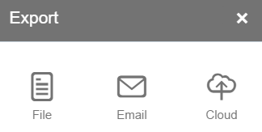 
    
 Figure 7.2 

3.  Click File.
    
    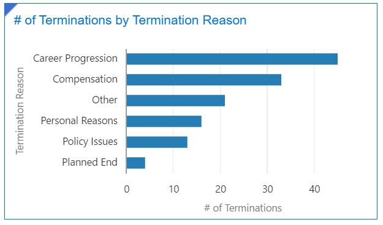 
    
 Figure 7.3 

1.  You can change the name of the project/file, include data sets and also connection credentials if connecting to a data source such as a database. Note, in a production environment, you would not typically
share data, only the connection information. In this example, the blue circle indicates that data is to be included. You can slide the blue circle to the left, changing it to white, which is off, and data will not be included.

2.  The format for the project is a .DVA, for data visualization artifact file which can be opened by Data Visualization Desktop and Oracle Analytics Cloud.

4.  It is also possible to share a project from an open project.
    
    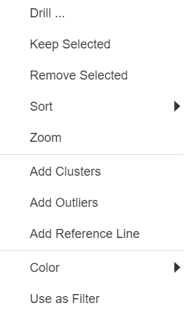 
    
 Figure 7.4 

5.  The share option from an open project also includes the ability to print. You can select which canvas or canvasses, or active visualization to print as a PDF.

6.  You can also import projects. Click the action menu on the home page and click Import Project.
    
    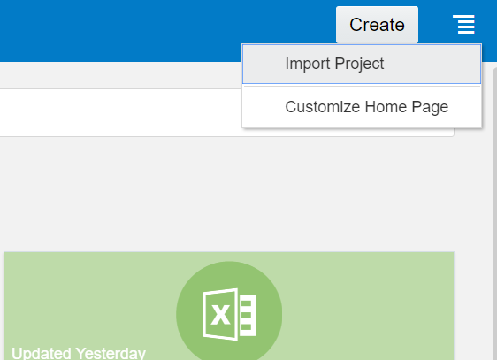 
    
 Figure 7.5 

  

# Lab 8: Data Preparation Loading Multiple Data Sets

This lab addresses data preparation and loading multiple data sets.
Topics include:

  - Augmented Data Preparation

In this lab you will prepare data and load multiple data sets. You will
also use Augmented Data Preparation capabilities to ingest and blend two
data sets.

*For these labs, use the Web-Sales and Web-Customers data files.*

Note, these exercises will build on capabilities that you have
previously completed*.*

There are multiple ways that you can load data sets:

  - Drag and drop files directly onto the Home Page

  - Create data sets with pre-built connectors

  - Import a data set directly into a Project

1.  From the Home Page, select Create on the upper right.

2.  Select Data Set form the Create window.
    
    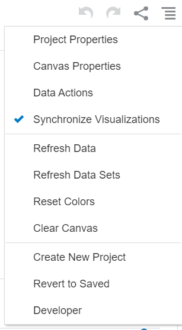 
    
 Figure 8.1 

3.  Then click to browse to locate the Web-Sales data file.
    
    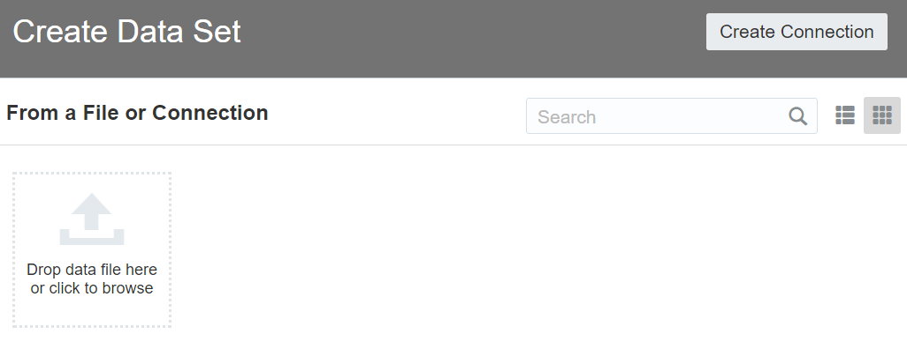 
    
 Figure 8.2 

4.  Load and open Web-Sales xlsx. The data appears in a preview window
    so you can verify that it is the file you want to open.
    
    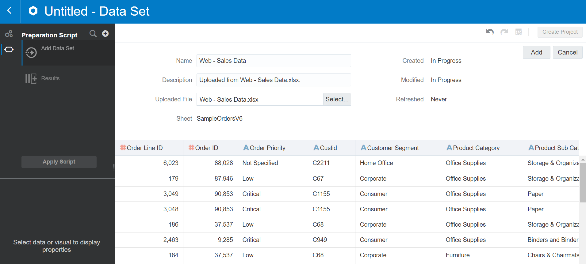 
    
 Figure 8.3 

5.  You can change the name of the data set and add a description.

6.  Review each column to ensure that it has been appropriately identified as an attribute or measure.

7.  Order Line ID is numeric and, in this case, has been incorrectly identified as a measure (because it will make no sense to perform an aggregation on it). Change it to an attribute by clicking the \# icon to the left of the name Order Line ID and select Attribute.
    
    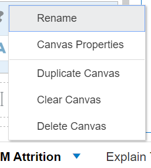 
    
 Figure 8.4 

8.  Click Add in the upper right to start the data set creation process. The file will be ingested and will go through a complex semantic profiling process.
    
    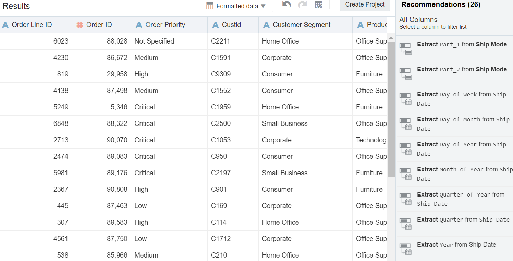 
    
 Figure 8.5 

9.  Repeat this process for our other data file, Web-Customers.xlsx.

10. You now have two new data sets which can be found by clicking the Data tab. The Data Console will display all of your data sets including the two new data sets for Web Sales and Web Customers.
    
    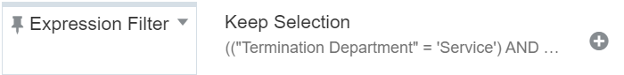 
    
 Figure 8.6 

    
     
    
 Figure 8.7 

11. You can manage your data sets from here by clicking the action menu on the right side of each data set.
    
    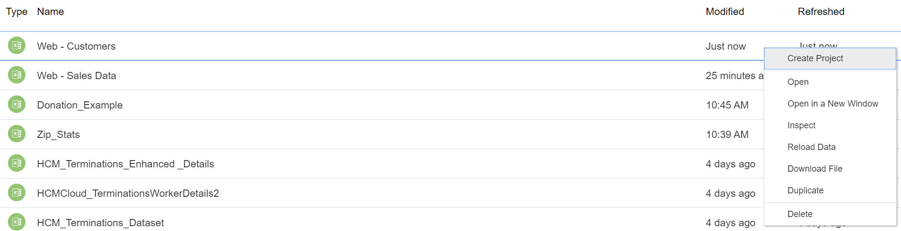 
    
 Figure 8.8 

    
    From here, you can create a project based on the data set, open the
    data set, reload the data, delete it, and more.

# Lab 9: Data Preparation Transformations on Multiple Data Sets

This lab addresses data transformations that help to prepare the data
for analysis.

In this lab, you will create a project with two data sets, modify column
properties, change data types, set aggregations, apply formatting and
more.

1.  From the Home Page, navigate to the data management screen.
    
    \` 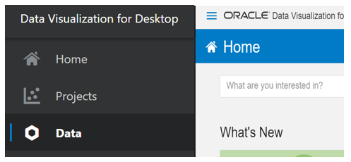 
    
 Figure 9.1 

2.  Locate the Web Sales data set. Click on the actions menu and create
    a project with this data set.
    
     
    
 Figure 9.10 

3.  A blank canvas is displayed where you can immediately begin to build
    visualizations. However, you should perform some data
    transformations prior to building your analysis. Click on the
    Prepare option on the tool bar.
    
    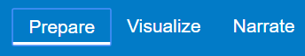 
    
 Figure 9.11 

4.  This takes you to the prepare area. The Script Pane on the left will display all actions taken on the data. Automatically generated recommendations based on semantic profiling of the data performed on ingestion are displayed on the right, and the data set is in the middle.
    
Click on the Formatted Data drop down to view the Metadata.
    
  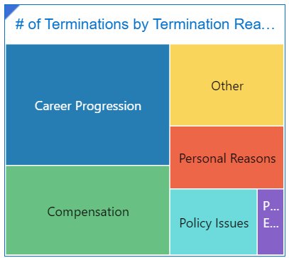 
  
 Figure 9.12 

    
  Metadata is simply data about the data. It displays data elements,data types, aggregation if any, and more. Similar to the formatted data, the metadata was a result of the data profiling which was performed on ingestion.

5.  Return to the Formatted Data view.

6.  Clicking on a column name will display the Property Pane for the selected column. From here, you can make modifications as need for any column name, if it should be treated as an attribute or measure,
and the data type.

7.  For example, Order ID (like Order Line ID) should not be treated as a measure. Change it to an attribute.

8.  Scroll to the right to the measure Profit. Notice that Profit and other measures are not well formatted from the data ingest process.

9.  Select the Profit column and notice in the Property Pane that the Name, Treat As, Data Type and Aggregation seem correct.
    
    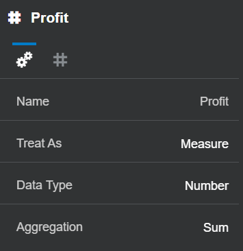 
    
 Figure 9.13 

    
    Click on the \# sign in the Property Pane to change the formatting.
    
    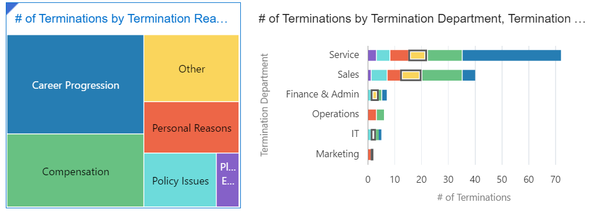 
    
 Figure 9.14 

    
    Change the Number Format to Currency. Make similar changes to the other measures which require formatting.

10. Scroll to the left to the Order Priority Column. Notice the different priorities values include Critical and Not Specified. Let’s perform a Group on this column to make it a little easier to view. Click the actions menu and select Group.
    
     
    
 Figure 9.15 

    
    We will have 3 groups instead of the 5 different values for the rows in this column.

11. Name the first group Low and click the values Low and Not Specified to include them in the group. Note, the name displayed here: Order Priority Group 1. It is the name of this group object, not the name of one of the individual groups that you will create.
    
    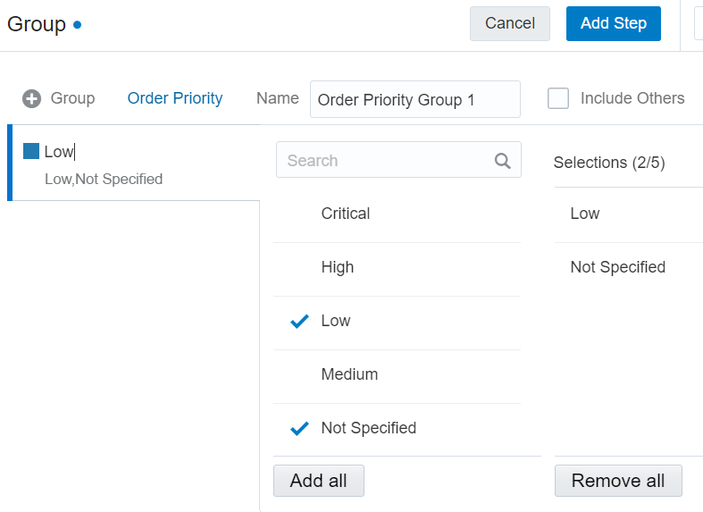 
    
 Figure 9.16 

12. Click the + sign to the left of Group to add another Group.
    
    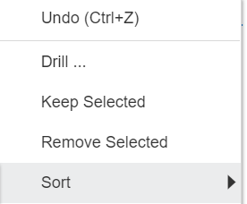 
    
 Figure 9.17 

    
    Name the second group High and include High and Critical in this group.
    
    Because only the value of Medium remains, it is not necessary to manually build a third Group.

13. Click Add Step
    
     
    
 Figure 9.18 

    
    Note that the newly created Group by Order Priority Group 1 column is directly to the right of the original Order Priority column. Also
    note, that these actions are now included in the Script Pane on the left. You can delete the original Order Priority column and rename
    Order Priority Group 1 to Order Priority Group. Apply the Script.

14. Scroll to the Quantity Ordered column and build another “group type.” Right click the action menu and notice that because this column is a measure, the options are different from those available for an attribute.
    
Create a new column based on a range of values for quantity ordered called Order Size, right click the action menu and select Bin.
    
   
  
 Figure 9.19 

15. Create four bins for Order Size. Name the first bin Small for orders up to a quantity of 10. The second bin will be named Medium for quantities 11 to 50. Name the third bin Large for quantities 51 to 100. Name the final bin Bulk for orders over 100.
    
    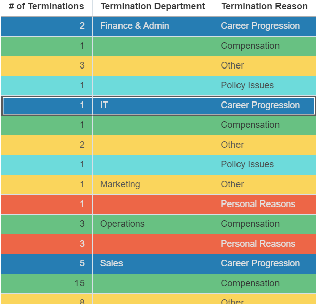 
    
 Figure 9.20 

    
    Click Add Step and Name the new column Order Size.
    
    Now you have another new column, Order Size based on ranges from the Quantity Ordered column that did not exist in the original data set.

16. Now that you have performed a few transformations on this data set, you are ready to bring in the second data set to blend it with thr original data set. This will allow you to create more meaningful visualizations.

17. Click on the + sign to the right of the Data Set tab on the bottom of the screen to add another data set.
    
     
    
 Figure 9.21 

18. A window displays data sets that are available. Select Web-Customers and click Add to Project.
    
     
    
 Figure 9.22 

19. There are now two data set tabs on the bottom of the screen. You are able to switch between the data sets by clicking on the tabs.
    
    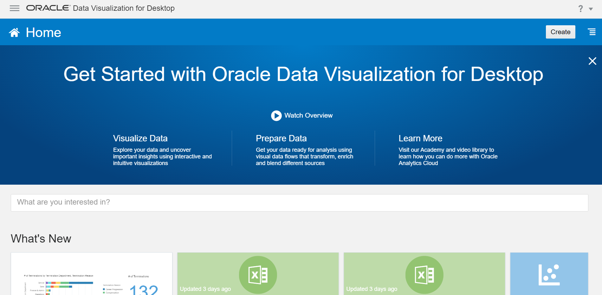 
    
 Figure 9.23 

20. Click on Data Diagram tab to the left of the data set tabs. The system has found a common key or join between the two data sets. Therefore, you will be able to build more meaningful visualizations that use data from two different data sets.
    
    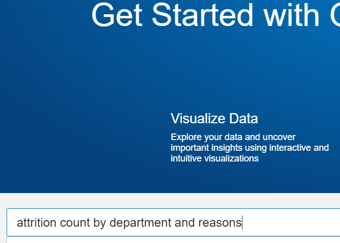 
    
 Figure 9.24 

21. Click the 1 which signifies the single link between the data sets.
    
     
    
 Figure 9.25 

    
    The system recognized the column Custid exists in both the Web-Customers and Web-Sales data sets. Because the name and data types match, it has automatically given us our link.
    
    In addition, this dialogue box allows you to manually change a key or join, or add additional keys if a more complex join is necessary.

22. Click the Web Sales tab.

23. If a blue dot appears at the bottom of the Preparation Script Pane on the left, the enrichment actions you performed on the data have
not been applied to the entire data set. Click Apply Script to do so. After the actions have been applied, the blue dot disappears which indicates that the actions have been successfully applied.
    
    Note, that as you add more enrichments to a data set, the number of
    sequential actions listed in this pane will increase.
    
   
  
 Figure 9.26 

24. Save your project.

# Lab 10: Data Recommendations on Multiple Data Sets

This lab is about machine language driven data recommendations to
transform and enrich data leading to more meaningful and deeper insights
during analysis. You will learn that system generated automatic data
recommendations based on semantic profiling are more significant than
basic column property changes and manual transformations. You will work
with sensitive-type data and enrich data with system inferred geographic
and demographic information

1.  Open your web sales analysis project.

2.  Open the Web Customers data set and navigate to the Prepare Pane.
    
    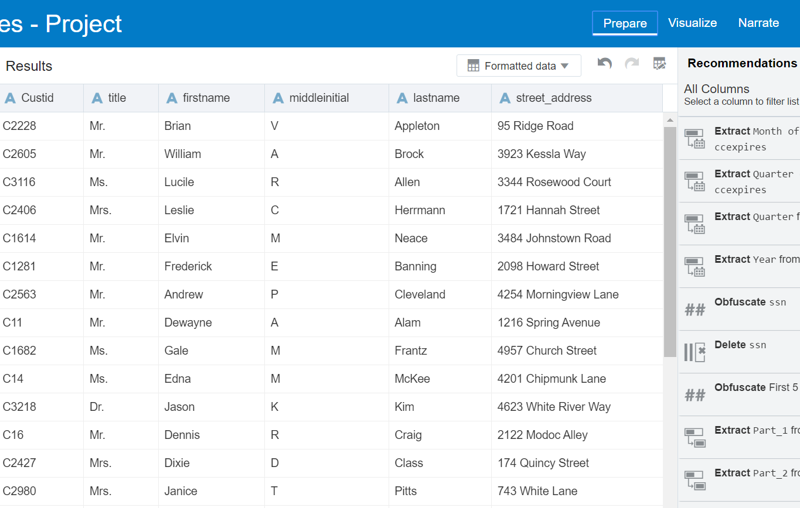 
    
 Figure 10.1 

3.  The Recommendations Pane on the right side shows a significant number of recommended actions that can be performed on the data. These recommendations are a result of the semantic profiling that was performed on the data during the ingest process.
    
    Click on the drop down in the upper right to see all of the recommendations that are suggested for each of the columns in the
    data set.
    
    To work with recommendations for specific columns,you can either select them from the list exposed in the drop down or click the column header in the data set.

4.  Click on the First Name column and notice that there is an interesting enrichment recommendation for adding a column called Gender based on first name. This may be interesting to have for sales analysis.
    
    To accept this recommendation, simply click on the check mark as you hover on the recommendation. When accepted, a new column is added to the right of the First Name column, the recommendation disappears from the Recommendation Pane and the associated action is added to
    the Script Pane on the left.

5.  Make two changes to this new column. First, rename the column to Gender. Second, because the case of the data in the rows does not match that of other data, click the action menu on right of the column header and select Sentence Case.

6.  Scroll to the City column which has a number of suggested enrichments. Select the population and jurisdiction suggestions. Be sure to rename each column. Population should be Population and Jurisdiction should be renamed County.

7.  Scroll to the Birthdate column. Because this maybe sensitive date, extract month of year from birthdate. Rename the column Customer Birthdate Month. Also, delete the potentially sensitive Birthdate column so that it is not exposed for any down-stream analysis.

8.  The system is able to detect sensitive data such as credit card numbers and also automatically provides remediation to fully or partially obfuscate the data.
    
    Because we really can’t do anything with credit card numbers, click
    the action menu on the column header and select delete. Also, delete
    the CCV and CCExpires columns.

9.  The system has found another sensitive column, Social Security Number and has made some recommendations. Accept the recommendation to obfuscate the first five digits of customers’ social security numbers.

10. Be sure to click Apply Script to apply these recommendations to the entire data set.

11. Navigate to the Web Sales data. Then, scroll to Order Date and extract day of week from the column. This will provide us with potentially valuable information on the day of the week that orders are placed.

12. Apply the script and save the project.

# Lab 11: Enhanced Insights on Multiple Data Sets 

This lab is about enhanced insights with enriched data sets to deliver
deeper analysis.

1.  Open the web sales analysis project and navigate to the Visualization Pane.
    
    We want to discover insights from both the sales and customer data
    sets.

2.  Recall that you added a column called Gender which was not part of either original data set. Build a bar chart to see if sales by gender yields any interesting insights.
    
    Drag and drop \# Sales from the Web Sales data in the Data Elements Pane to the middle of the blank visualization. Drag Gender from the Web Customers data in the Data Elements Pane into the Category box. Note, that although this visualization is not adding very much insight, even this would not have been possible without enhancing the original data sets with Gender.

3.  Enhance the visualization by dragging Order Day from the Web Sales data into the Color box.
    
    Finally, we have something that is a bit interesting. We can see that Males are placing more orders on Thursdays.
    
     
    
 Figure 1.1 

4.  Create a second visualization to see if we can leverage what we
    discovered in the first visualization.
    
    Drag \# Sales to the left of the bar chart until you see a blue line
    and drop it to create a new visualization. Change the bar chart to a
    100% stacked bar chart so that we will be able to see what each
    gender is purchasing relative to their entire spend amount.
    
    Now, drag and drop Gender into the Category box. Next, drop Product
    Category into the Color box.

5.  In order to break this out by sales by category, right click on
    either bar and sort from low to high.
    
     
    
 Figure 11.1 

    
    
    Finally, we have a little more insightful analysis. Females spend almost the same as Males on Technology but they spend more than
    Males on Furniture. Both groups, however, spend about the same on Office Supplies.
    
    Create a third visualization to see if there are any insights to be found regarding Order Size. Recall that Order Priority was a column
    that you created with a bin for Bulk, Large, Medium and Small orders. See if there is a correlation between Order Priority and
    Profit.

6.  Drag \# Profit to the left of the stacked 100% bar chart to create the new visualization and change it to a stacked bar chart. Drag Product Category into the Category box. Next, drag the enriched column Order Size into the Color box. Finally, drag \# Sales into the Size box.
    
    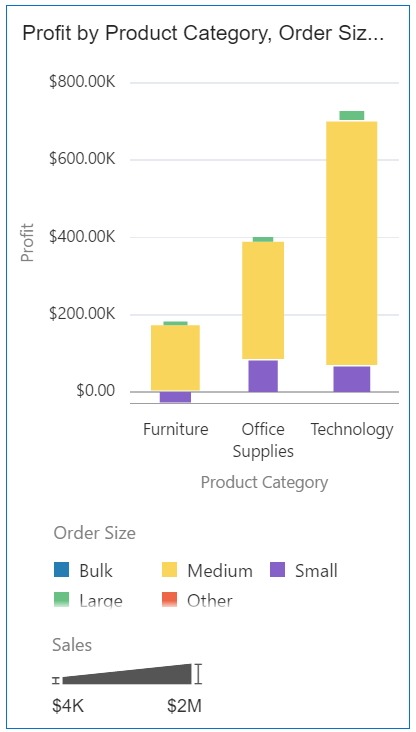 
    
 Figure 11.2 

    
    This visualization is interesting. It indicates that medium size
    orders are the most profitable categories. Look more closely and you
    should notice that small size furniture orders are not really
    profitable and are costing the company money. Also, large orders are
    sporadic and also not very profitable. These are clearly enhanced,
    meaningful insights.

7.  Add a fourth visualization to discover where the most profitable customers are ordering from, because you might want to direct more marketing and attention to this segment. First, click on the + sign on the bottom of the screen to create a new canvas.
    
     
    
 Figure 11.3 

8.  Drag the enriched data element County, which was built based on the City geo recommendation, to the center of the new canvas. Change the visualization type to Map. If necessary, drag and center the map.
This visualization shows each county where purchases have been made.

9.  Because this map is bland, drag the same data element, County and drop it in the Color box. Next, drag \# Profit into the Size Box.
    
This is still difficult to understand. Add a filter by right clicking on \# Profit in the Size box, then select Create Filter.
    
   
  
 Figure 11.4 

    
    In the Start Range, enter 10,000 for the minimum amount and click on the map.
    
  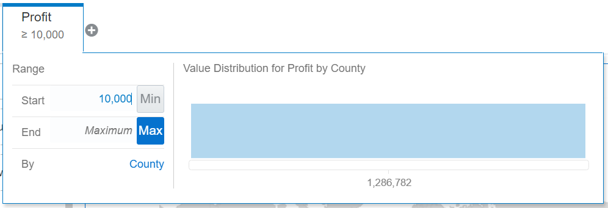 
  
 Figure 11.5 

    
    Now, you can see the most profitable counties in the country. This could be important and insightful analysis that the marketing
    department would be interested in.
    
  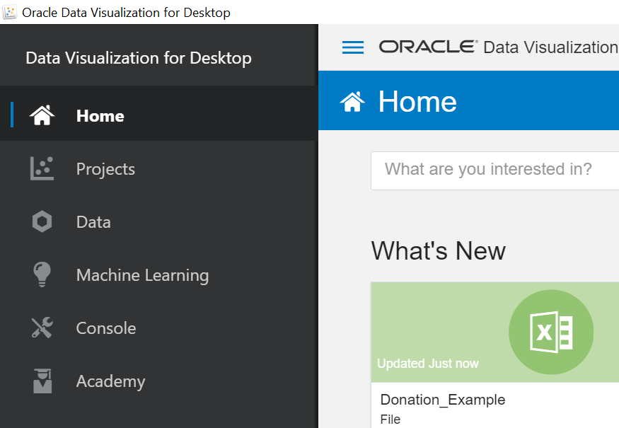 
  
 Figure 11.6 

10. Save the project

# Lab 12: Narration and Storytelling for Collaboration 

In this lab you will learn how to use narrate capabilities to share discoveries as a business analyst. This feature allows you to create
visually compelling stories based on the results of analysis as a basis for collaboration and discussion.

1.  Open the Web Sales project to the first canvas. Click on Narrate on the top right of the screen.
    
    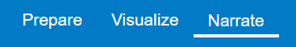 
    
 Figure 12.1 

    
    This brings us to a blank canvas in the center of the screen. On the
    left side are the four canvases that make up this project.
    
    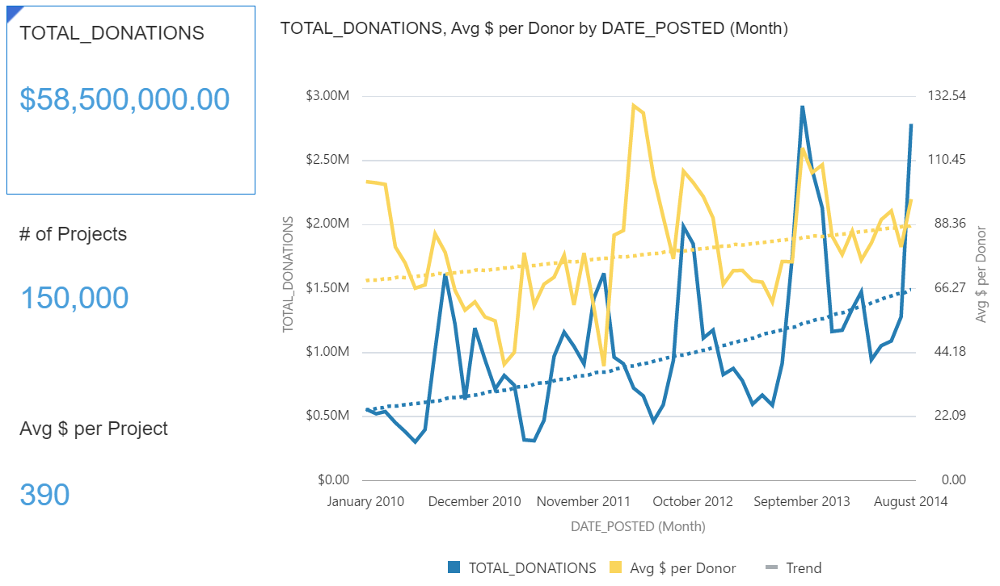 
    
 Figure 12.2 

    
    Typically, projects are made up of multiple canvases. You can select from the thumbnail list of canvases which are available to make up
    our story. Of course, not all canvases must be used as a story is created.

2.  There a two ways to add a canvas to your story. If you hover you mouse over a canvas thumbnail on the left, a small action menu will appear on the upper right. Then, click Add To Story.
    
    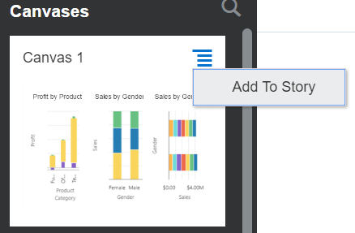 
    
 Figure 12.3 

    
    Select Canvas 1 to Add To Story. The canvas will be displayed on the bottom of the interface.
    
     
    
 Figure 12.4 

3.  Next, drag and drop a second canvas thumbnail onto the bottom pane next to Canvas 1.
    
    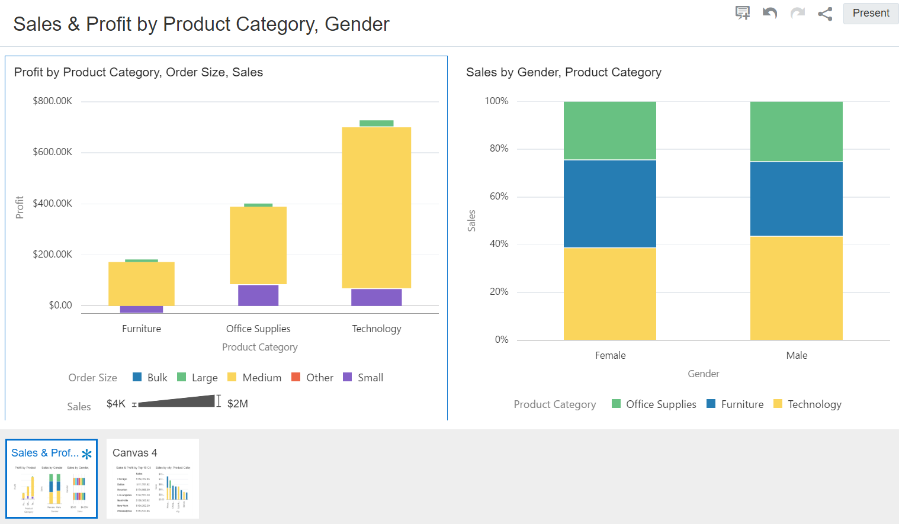 
    
 Figure 12.5 

4.  The properties for each selected canvas can be modified in the Property Pane on the bottom left.
    
    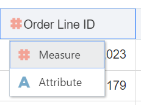 
    
 Figure 12.6 

5.  If you do not want to display a visualization from a canvas, you can click the action menu on any visualization to hide it from the narration.
    
     
    
 Figure 12.7 

    
    On the first narration canvas, click the action menu to hide the horizontal stacked bar graph for Sales by Gender and Order Day.
    
     
    
 Figure 12.8 

6.  You can also add page descriptions which will help the story and foster collaboration.
    
     
    
 Figure 12.9 

    
    Click the check box in the Property Pane to add a meaningful description or even a question.
    
    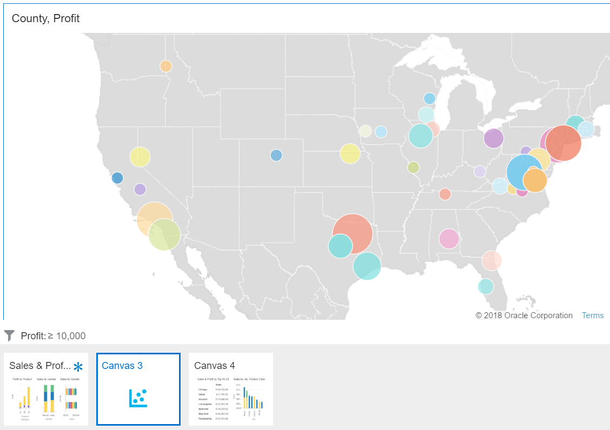 
    
 Figure 12.10 

    
    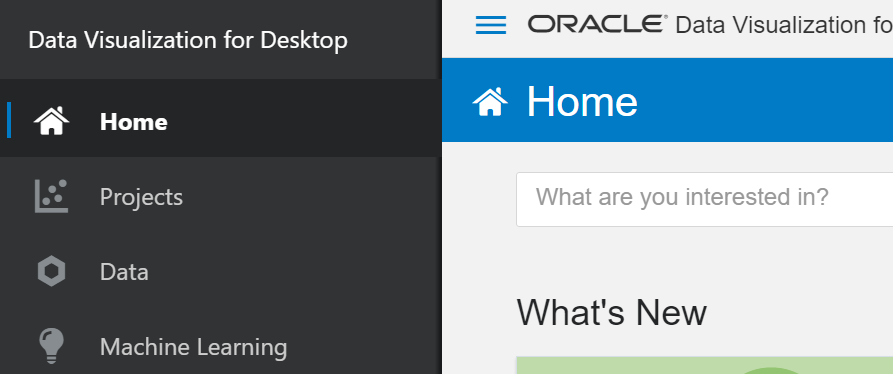 
    
 Figure 12.11 

    
     
    
 Figure 12.12 

7.  You can also add notes and drag to position them in any visualization by clicking the Note button on the upper right.
    
    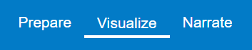 
    
 Figure 12.13 

    
     
    
 Figure 12.14 

8.  In the Property Pane, select the Presentation for Story Navigation, then choose Filmstrip or Compact.
    
    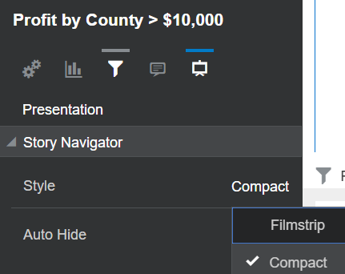 
    
 Figure 12.15 

9.  To begin a presentation, click the Present on the upper right tostart the presentation.
    
     
    
 Figure 12.16 

    
    Use the arrows at the bottom of the interface to scroll or navigate thru the presentation.
    
    As with any presentation, you would begin with an overview and go on to explain your story by navigating thru the visualizations.

10. Click the X in the upper right to exit the presentation.
    
     
    
 Figure 12.17 

11. Save the project with the narration to be able to share it.

12. Click the Share icon in the upper right to share your story as a file, an email, upload it to the cloud or to print it.
    
     
    
 Figure 12.18 

    
    If you share the narration as a file, it can be shared as a Powerpoint, PDF, an image, a CSV or a data visualization DVA
    package.
    
     
    
 Figure 12.19 

# Appendix: HELPFUL SITES 

<https://docs.oracle.com/en/middleware/bi/data-visualization-desktop/bidvd/preface.html#GUID-4A42E034-CDE3-47F8-B36E-FA769DA7E6AA>

<https://docs.oracle.com/en/middleware/bi/data-visualization-desktop/bidvd/get-started-dvdesktop.html>
