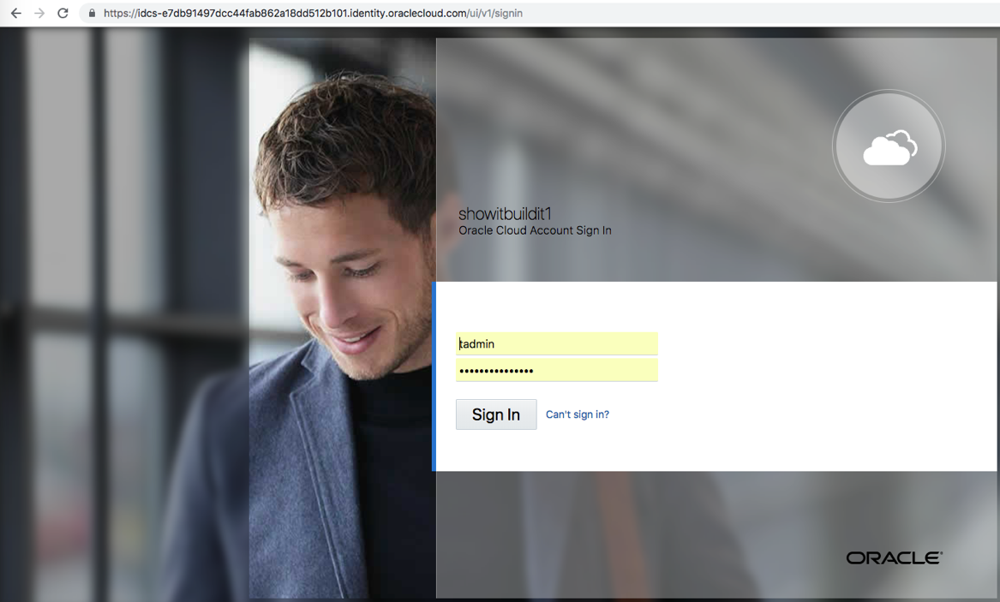
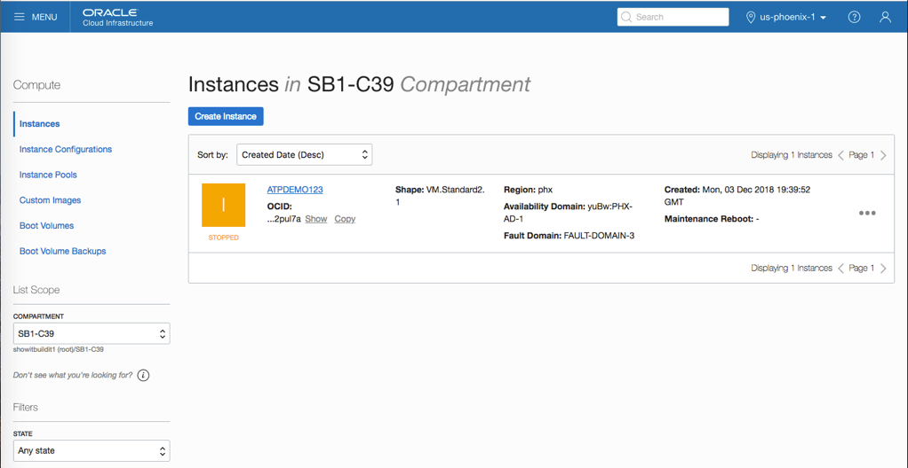
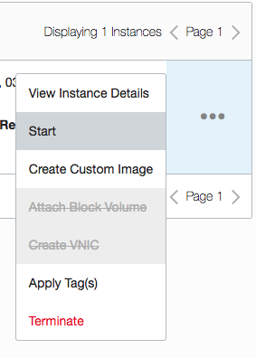
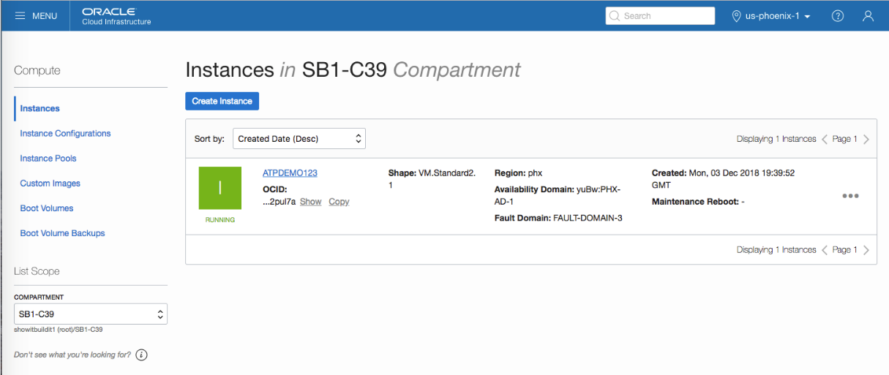
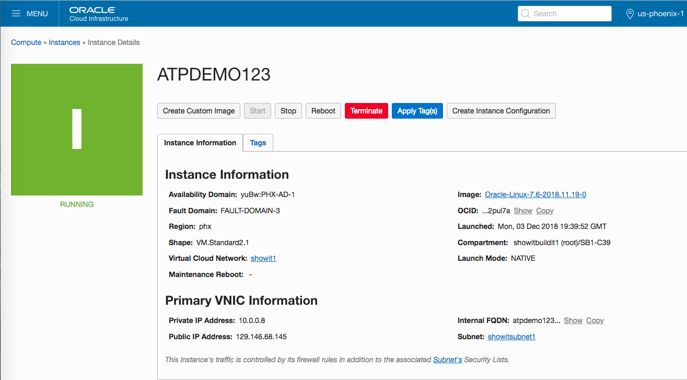

# Lab 1 : CREATE ATP DATABASE

In this exercise you will create a new Autonomous Transaction Processing
(ATP) database instance. If you already have an ATP instance available
please feel free to jump to the [Lab 2 : Obtain Connection
Credentials](#lab-2-obtain-connection-credentials).

First, log in to your Oracle Cloud instance using an ‘admin’ account

Next you need to see the ‘Compute’ instances’ available.

Unless you have already added them to the default view.

Click the ‘Hamburger Icon’ to display the list of available options.

Use the drop-down list and select ‘Compute’ to list available instances

If the instance you want is currently STOPPED, use the ‘ellipsis’ (…) to
the right to START

 

The icon will turn green and the tag will switch to RUNNING once the
instance has started. If you won’t be using the instance full-time, STOP
it when you are not using it to conserve resources (and lower charges).

Click on the instance name to display its information page.

Use the instance ‘Hamburger Icon’  to display the
list of services available; you will use this set of menu options
frequently.

Choose ‘Autonomous Transaction Processing’ to continue and list any
existing ATP databases in the instance.

The Autonomous Transaction Processing page shows all existing ATP
databases; click “Create Autonomous Transaction Processing Database” to
begin the process.

Provide the initial setup information for the database in the top part
of the displayed set up window:

  - Compartment (select name from drop-down list, ask your administrator
    if you don’t know)

  - Display Name (you make this up, but, your team probably has
    standards to follow)

  - Database Name (you make this up, but, your team probably has
    standards to follow)

  - CPU Core Count

  - Storage (in terabytes)

Complete the bottom part of the set up window as follows:

  - The username ‘ADMIN’ is pre-selected and read-only

  - Provide a password for the ‘ADMIN’ user (you make it up) and verify
    it by typing it again in the Confirm Password area; you’ll need to
    remember this password when connecting

  - Choose the license type that is applicable

At the bottom of the set up window, click ‘Create Autonomous Transaction
Processing Database’ to begin the creation process.

The screen switches to the ATP Instance list; the new database shows
‘Provisioning’ click the new database name for more details

ATP databases typically provision quickly (less than 5 min, probably
under 30 sec).

When complete, the ATP icon will turn green and the text will show
RUNNING (you may need to refresh your browser screen to see the change).

Congratulations\! You’ve successfully create an ATP Database instance.

Return to this screen and click ‘Stop’ when you will not be using this
database to reduce resources consumed and costs.
