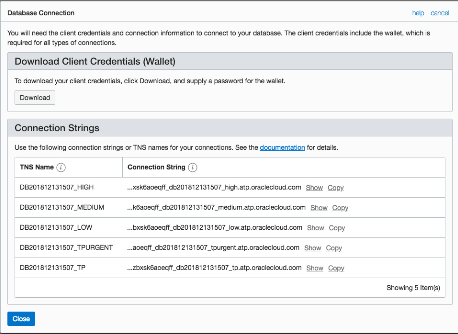
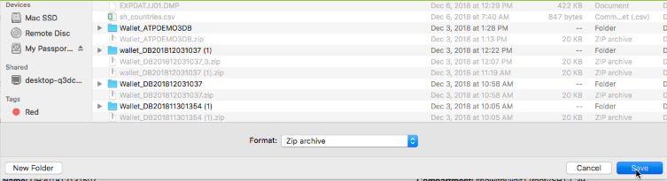
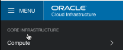
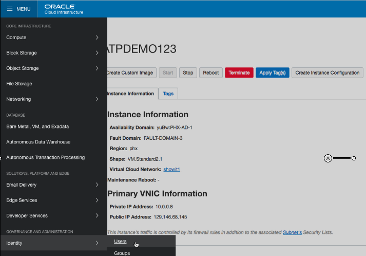
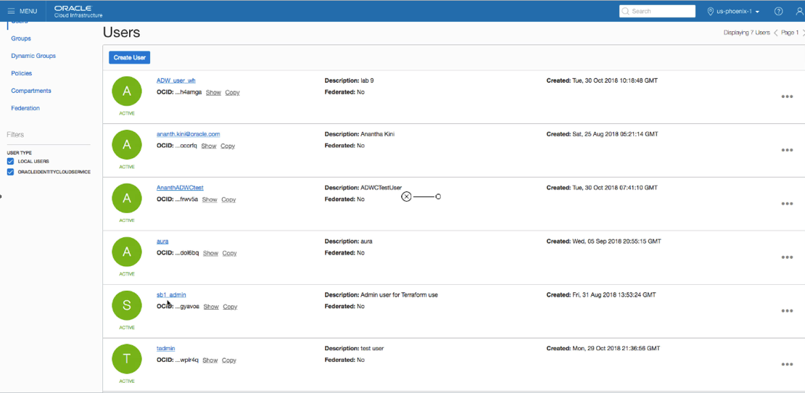
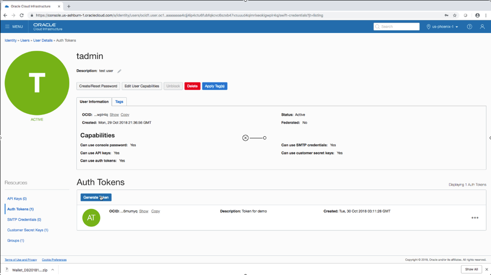
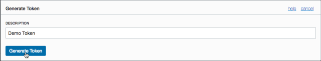

# Lab 2 : Obtain Connection Credentials

To connect and upload data to an ATP database from SQL Developer you
will need two things: a credentials ‘wallet’ and an ‘auth token’ making
sure connections are secure.

First return to the Oracle Cloud and get to the ‘Autonomous Transaction
Processing Database Information’ page

Click on the ‘DB Connection’ button

Review the Database Connection information displayed; note that Oracle
provides multiple connections depending upon the priority needed; online
apps would typically use the ‘High’ connection and batch jobs like
uploading data might use the ‘Medium’ connection.

To download a copy of the ‘wallet’ .zip file; click the ‘Download’
button

A dialog will open asking you to provide and verify a password for the
credential wallet. Once you have entered and verified the password click
the ‘Download’ button to continue.

Save the downloaded .zip file for the credential wallet somewhere it can
be easily referenced when connecting to the database. The wallet is
normally used in zipped form; however, you might find it interesting to
unzip the wallet and examine its contents.

Return to the Autonomous Transaction Processing Database Information
page.

Once again use the ‘hamburger icon’ to display available Compute
instances

Select your compute instance.

Use the Compute instance ‘hamburger icon’ to select ‘Identity-\>Users’
to list current users.

Find your desired user in the provided list and click on the user name
(‘tadmin’ in this example) to see specifics about that user.

On the user details page notice the ‘Resources’ list in the lower-left
corner. The number of ‘Auth Tokens’ currently available will be listed
(max is two). Under the ‘Auth Tokens’ title the existing Auth Tokens
will be listed. You may either obtain an Auth Token from your
administrator, or, create one here (if two already exist, delete one).

Click the ‘Generate Token’ button to begin the process of creating an
Auth Token.

A dialog will appear asking for a description for the Auth Token to be
created; enter a value and click the ‘Generate Token’ button.

Another dialog will appear showing the generated token.

**THIS IS THE ONLY TIME THE AUTH TOKEN VALUE IS DISPLAYED** – copy it
somewhere safe. Use either the provided ‘Copy’ link or use normal
‘copy-and-paste’ procedures.

The new Auth Token now appears in the user’s list.

Congratulations\! Connection credentials are now available for
connecting to the ATP database.
