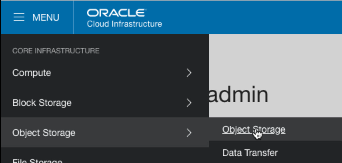
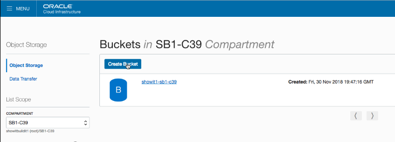
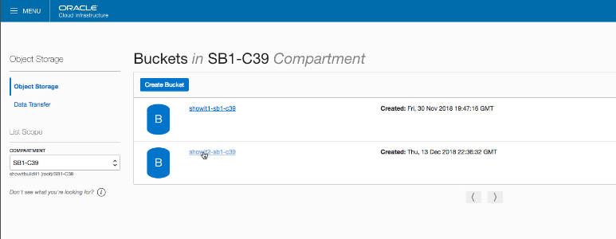
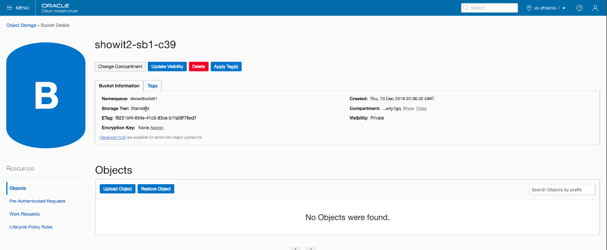
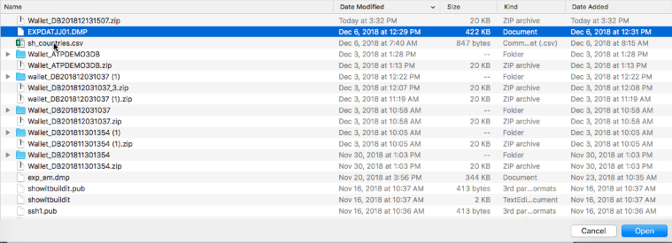
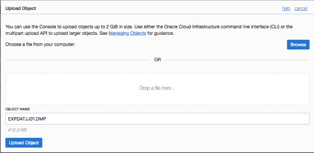
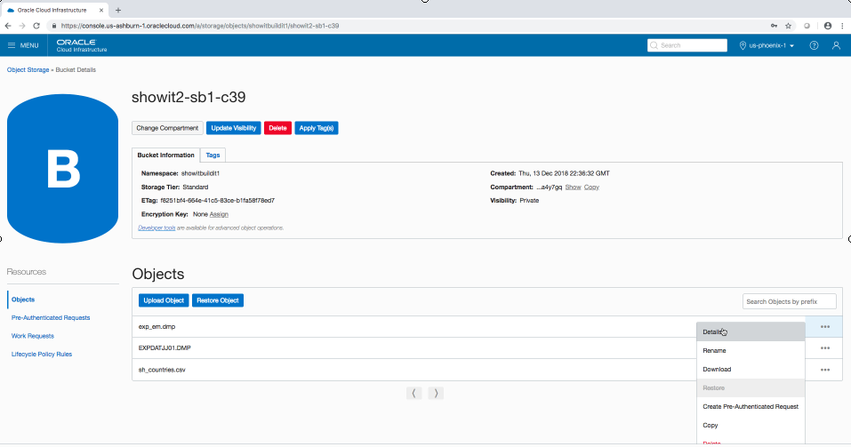
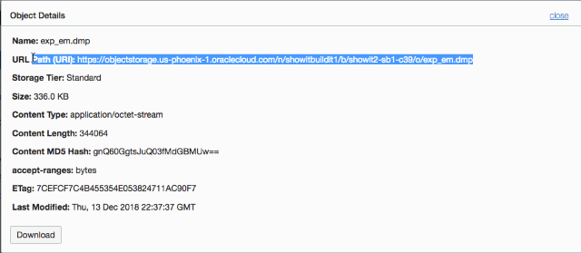

# Lab 3 : Using Oracle Object STORAGE

Oracle Cloud includes Object Storage for holding data. Some tools used
to import ATP data work with data present in Object Storage. In this lab
you will create an Object Storage ‘Bucket’ and load files into it that
will later be imported into an ATP database.

We have provided a .csv file and a .dmp file to be used in the exercise,
please download ‘Lab3.zip’ from the course files and unzip them. It
would probably be more-meaningful to load some of your own or your
customer’s data files instead.

Begin by using the Compute instance ‘hamburger’ menu to select ‘Object
Storage \> Object Storage’.

Object Storage is comprised of ‘buckets’ holding sets of data files. The
list of available buckets (if any) for a given Compartment will display
next.

Click the ‘Create Bucket’ button to begin the process of building a new
bucket, or, click on a bucket’s name to display that bucket’s contents.

The ‘Create Bucket’ screen appears; enter a bucket name (your choice,
your team probably has standards though) and the ‘Storage Tier’ –
‘STANDARD’ is usually the choice to make.

Click the ‘Create Bucket’ button to build the Object Storage bucket.

Once created, the bucket will be added to the bucket list display. Click
on a bucket name to display its contents.

The ‘Object Storage \> Bucket Details’ display shows information about a
bucket including a list of the objects currently stored in the bucket
(none currently in display below).

Click ‘Update Object’ to begin adding objects to the bucket.

The ‘Upload Object’ dialog is used to upload objects one at a time into
the bucket. Use the ‘Browse’ button to identify a file to be moved or
‘drag and drop’ a file into the space provided.

Select the file to be added to the bucket using your host file system’s
normal file selection tool.

The uploaded file name is displayed; click ‘Upload Object’ to verify the
upload. Repeat to upload all desired files.

Uploaded files are displayed in the ‘Bucket Details’ display. Use the
ellipsis (…) to the right of a file to display a list of options for
that file; choose ‘Details’ to see specifics about the file.

The ‘Object Details’ display provides information about an object stored
in the bucket. Perhaps most importantly is the ‘URL Path’ providing a
URL that may be used in a browser to view/download the file. To import
this file in SQL Developer the ‘URL Path’ must be modified (see Lab 5 on
page 29 or Lab 6 on page 37 for the modifications needed).

Congratulations\! You have successfully uploaded files to Oracle Object
Storage.
