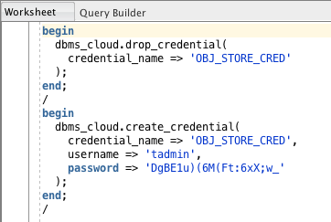
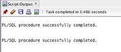

# Lab 4 : Connect with cloud wallet

SQL Developer is a freely-available tool used primarily by developers
and DBAs; though, others often find it useful. Download and install SQL
Developer according to the instructions found at:

<https://www.oracle.com/technetwork/developer-tools/sql-developer/downloads/index.html>

Connecting to ATP databases is easy once you have the credentials
‘wallet’ file available. Either create one as described in the earlier
lab, or obtain a wallet file from someone else.

To successfully perform these labs you will need SQL Developer 18.3 or a
later installed locally. You will also need a CreateCredential.sql file
from the Lab4.zip file included in the course files.

Here is the main SQL Developer screen. Notice the ‘Connections’ display
in the upper-left corner; click on the green plus sign
 (or use the menu: File \> New \> General \>
Connections \> Database Connection) to start creating a connection.

A dialog will appear where connection details will be added. Complete
the dialog as follows:

1.  Add a connection name (you make it up)

2.  Use the ‘admin’ user and the password specified at ATP creation

3.  Change ‘Connection Type’ to ‘Cloud Wallet’

4.  Enter the name of the ‘wallet’ .zip file for the ATP database (or
    ‘Browse’ to it) as the ‘Configuration File’

5.  Use the ‘Service’ drop-down to select the connection desired
    (‘medium’ chosen here, often a good choice for batch work like
    imports).

6.  Click the ‘Test’ button to make sure everything is correct

7.  Look for ‘Status: Success’ then ‘Save’ the connection and ‘Connect’

Once successfully connected, a ‘Worksheet’ tab opens. Open (or copy) the
provided ‘CreateCredential.sql’ file in a worksheet then make the
following changes:

1.  Set ‘credential\_name’ (your choice, ‘OBJ\_STORE\_CRED’ in this
    example)

2.  Set ‘username’ to Oracle Cloud user that created ATP instance
    (‘tadmin’ in this example)

3.  Set ‘password’ to the ‘Auth Token’ created and stored earlier

To execute the script; click the ‘Run Script’ icon
 (upper-left above the worksheet) or press the F5
key.

Watch for ‘success’ messages

Congratulations\! You have successfully connected to an ATP Database and
created a Credential object; you are now ready to begin importing data
from Oracle Object Storage.