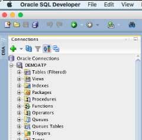
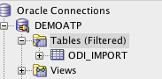
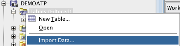
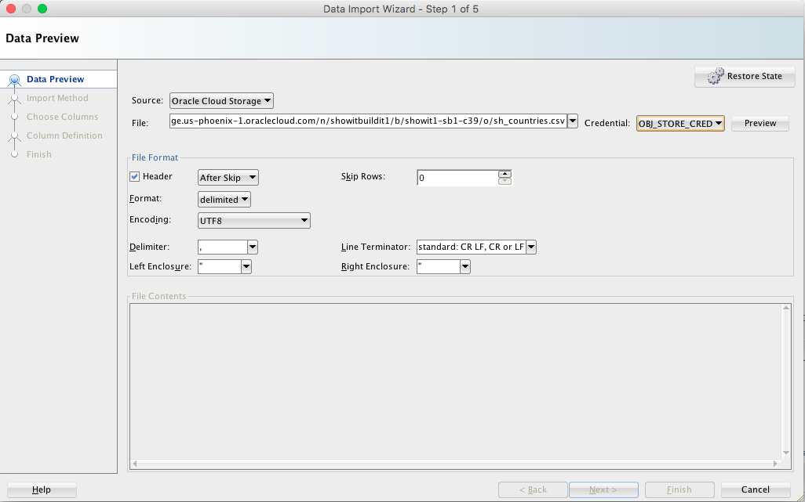
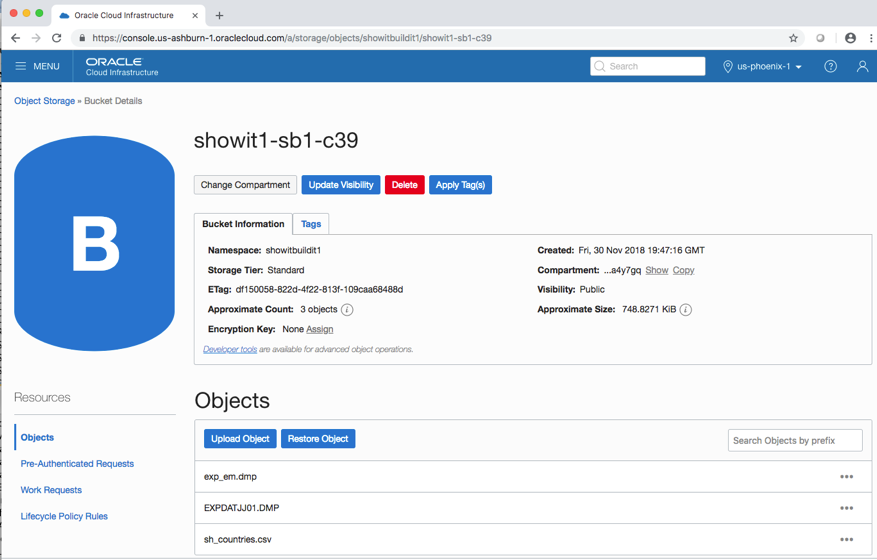
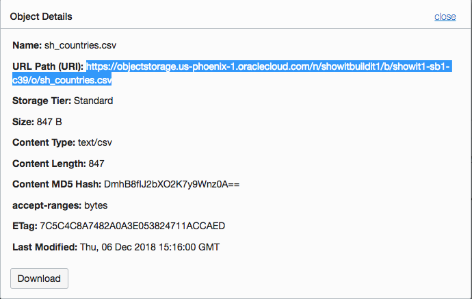
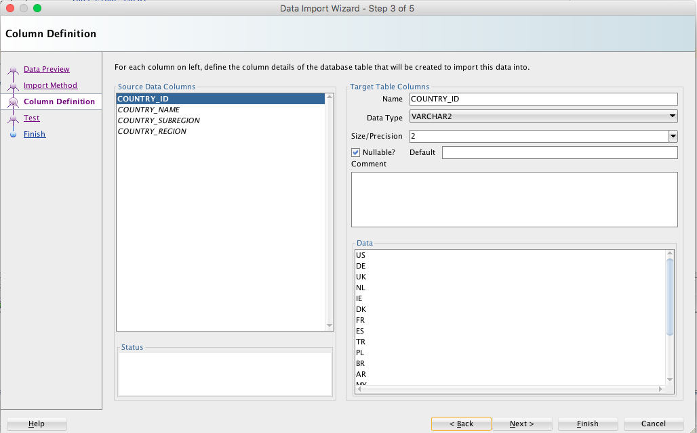
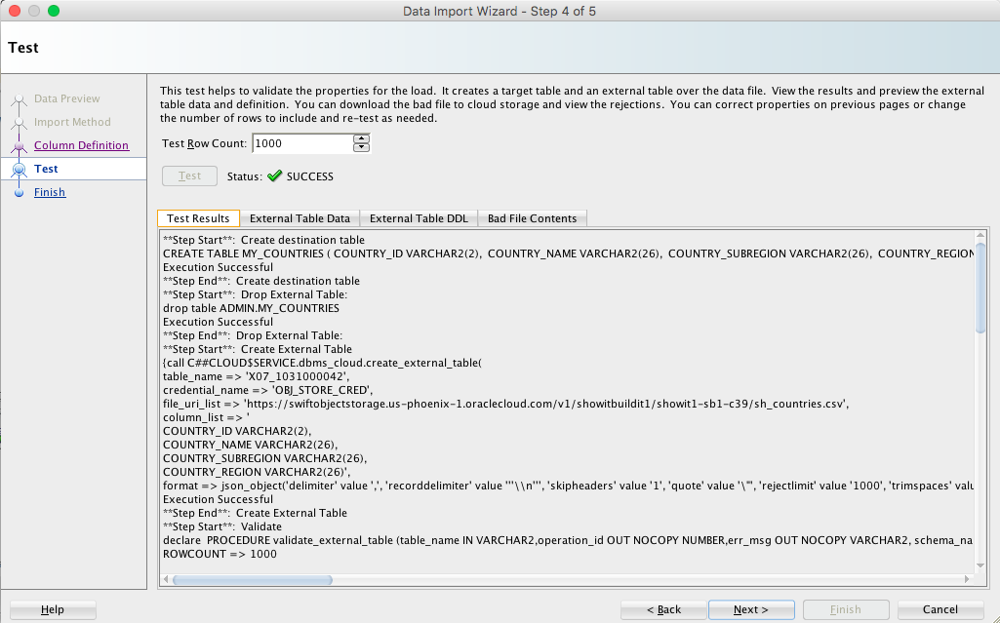
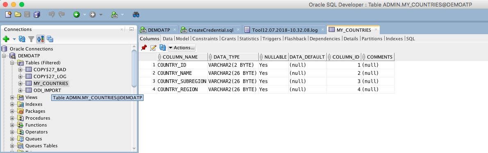
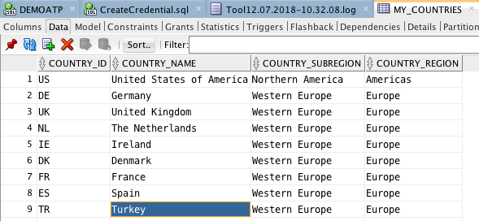

# Lab 5 : Load Table Using .csv File

In this lab you will use SQL Developer’s ‘Data Import Wizard’ to import
table data using a .csv file coming from Oracle Object Storage.

You will need the input file’s ‘URL Path’ to modify, along with the name
of the Object Storage bucket as created in Lab 3 (see page 21) to import
the file.

First, be sure to connect to the ATP instance from SQL Developer (see
Lab 4 on page 26).

In this exercise, you will import data for a ‘COUNTRIES’ table; open the
list of available tables for your user and verify that the ‘COUNTRIES’
table does not currently exist.  
(feel free to import your own, or a customer’s table here instead…)

Right-click on the current user’s ‘Tables’ and choose ‘Import Data’ to
start the data import wizard.

The first page of the ‘Data Import Wizard’ provides a place to identify
the file to be imported and its format. You will need the ‘URL Path’ and
‘Credential’ for the file from Object Storage.

Reopen your browser and navigate to the Object Storage Bucket details
display for the bucket where the desired data file may be found; open
the Object Details display for the desired file.

Select the URL Path for the file to be imported and copy it to your
clipboard.

Paste the URL Path into an editor and make edits necessary for it to
work in SQL Developer’s wizard. Then, copy the modified URL Path to your
clipboard.

> 1\. Change 'objectstorage' to 'swiftobjectstorage'
> 
> 2\. Change '/n/' to '/v1/' (lower-case 'v')
> 
> 3\. Remove '/b'
> 
> 4\. Remove '/o'

On the first step of the Data Import Wizard:

1.  Change Source to Oracle Cloud Storage.

2.  Paste modified URL Path (from above) into File name.

3.  Use the Credential pull down to select the database credential
    object used.

4.  Modify any File Format setting necessary to match your file.

5.  Click the ‘Preview’ button to see some of the file contents.

6.  Click the ‘Next’ button to proceed to the next step in the Data
    Import Wizard.

Step 2 of the Data Import Wizard provides a place to be sure the Import
Method is set to ‘Cloud Load’ and provide a name for the table to be
imported (you choose, , ‘MYCOUNTRIES’ in this example)

Step 3 of the Data Import Wizard asks that you review column names and
definitions for the table to be created; be sure to check all source
columns. Click ‘Next’ to go to the next step.

Step 4 of the Data Import Wizard allows testing of the load (click
‘Test’ button), if desired you may specify names and particulars for
an input data External Table allowing download of the ‘bad’ file to view
rejections (in this example, just click ‘Test’); click ‘Next’ to
continue to next step.

The final step (Step 5) of the Data Import Wizard provides a summary of
the steps to be taken.

Click the ‘Finish’ button to begin the actual import process.

Once the import complete, a dialog box will open; click ‘OK’ to
continue.

Use the ‘Refresh’ icon to refresh the table list
for the current SQL Developer connection. Be sure to check the ‘Columns’
tab to make sure the table definitions are correct.

Check the ‘Data’ tab to make sure the table data looks good too.

Congratulations\! You’ve loaded a table into the ATP database using a
.csv file stored in Oracle Object Storage.

