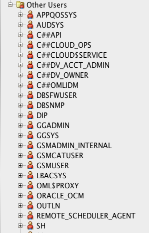
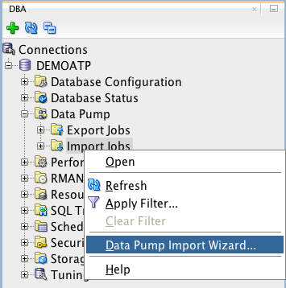
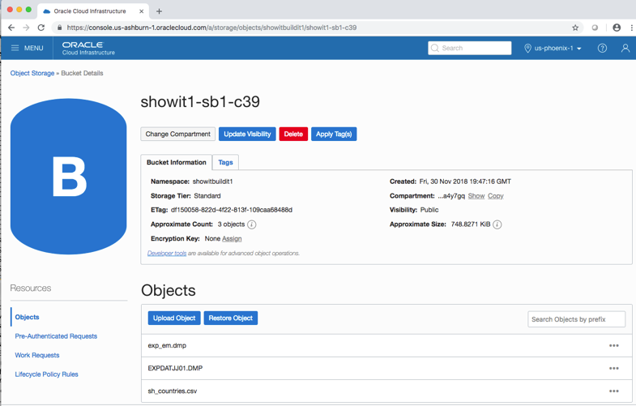
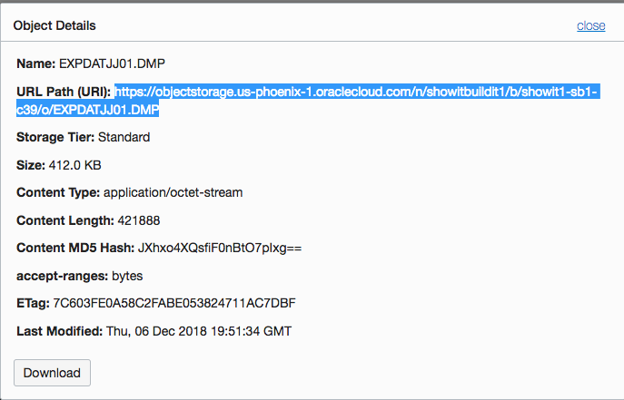
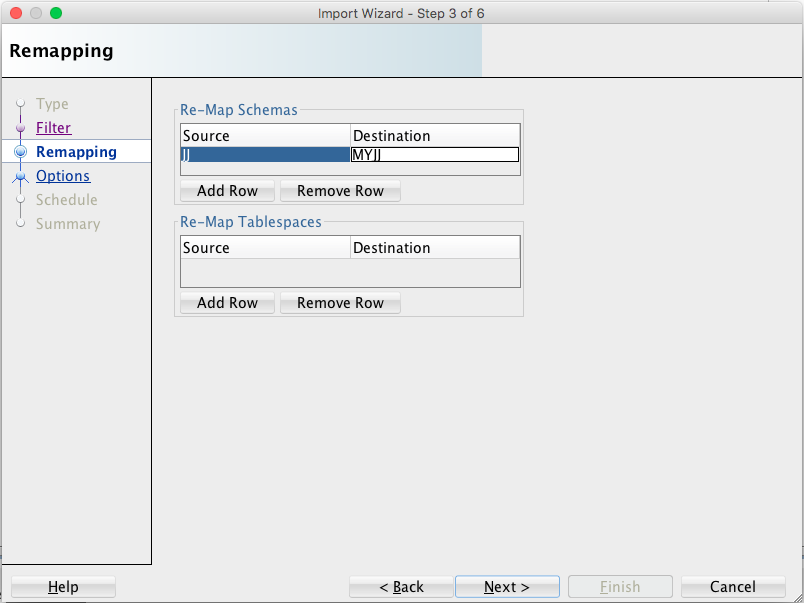
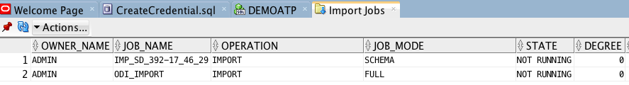

# Lab 6 : Import Using Data Pump

In this lab you will use SQL Developer’s ‘Data Pump Import Wizard’ to
import data using a .dmp file coming from Oracle Object Storage. Oracle
Data Pump may be used to import: entire database, schemas, tablespaces,
or tables.

You will need the input file’s ‘URL Path’ to modify, along with the name
of the Object Storage bucket as created in Lab 3 (see page 21) to import
the file.

First, be sure to connect to the ATP instance from SQL Developer (see
Lab 4 on page 26).

Scroll the connection navigator and open the list of ‘Other Users’ in
this exercise you will import a schema named ‘MYJJ’ make sure that the
schema does not currently exist by checking your display.

Next, open SQL Developer’s ‘DBA View’ to get things ready to use Data
Pump (unless already open).

Create a connection in the DBA View by selecting your already-open SQL
Developer connection.

 

Under ‘Data Pump’ find ‘Import Jobs’ – right-click on ‘Import Jobs’ and
select ‘Data Pump Import Wizard’ to start.

Step 1 of the ‘Data Pump Import Wizard’ provides a place to enter a job
name, choose type of import, and name the file(s) to be imported. You
will need the name of the credential created earlier and the Object
Storage file’s URL Path modified to fit SQL Developer’s needs.

Reopen your browser and navigate to the Object Storage Bucket details
display for the bucket where the desired data file may be found; open
the Object Details display for the desired file.

Select the URL Path for the file to be imported and copy it to your
clipboard.

Paste the URL Path into an editor and make edits necessary for it to
work in SQL Developer’s wizard.

1.  Change 'objectstorage' to 'swiftobjectstorage'

2.  Change '/n/' to '/v1/' (lower-case 'v')

3.  Remove '/b'

4.  Remove '/o'

Then, copy the modified URL Path to your clipboard.

Use the ‘Credentials or Directories’ pull-down under ‘Choose Input
Files’ to select the Credential object. Paste the modified URL path
into the ‘File Names or URI’ location. Choose ‘Add Row’ if you need to
add more files to the import and provide the appropriate Credentials and
URL Path for each one.

Click the ‘Next’ button to go to the next step in the wizard.

Step 2 of the Data Pump Import Wizard shows the schema(s) present in the
input .dmp file (‘JJ’ in this example); this may take a while to
populate.

Select a schema name and click the arrow key to ‘shuttle’ add the name
into Selected source schemas. Click the ‘Next’ button to move to Step 3
when ready.

Step 3 of the Import Wizard allow names to be changed (‘remapped’) for
Schemas and/or Tablespaces.

1.  Click ‘Add Row’ to begin

2.  Add the Source name in the left column (‘Source’)

3.  Add the desired new name into the right column (‘Destination’)

Click the ‘Next’ button to continue to Step 4.

Step 4 of the Import Wizard allow control over logging and other
potential issues. In our lab there is nothing to do so just click ‘Next’
to move on to Step 5.

If desired, change Job Name and enter a Job Description. Job Schedule
might also be modified here (not in our lab). Click ‘Next’ to advance to
the final stage in the wizard.

Step 6 provides a summary of the Import Job about to be scheduled. As in
the example below you may expand the display’s nodes to see more
details. Click ‘Finish’ to start the import.

You may also open the PL/SQL tab to see the actual PL/SQL to be
executed.  
(Code may be saved for later reuse)

The status of the running job(s) will appear in SQL Developer

The job(s) will show as ‘NOT RUNNING’ when complete.

Refresh the ‘Other User’s list in SQL Developer;
note that the ‘MYJJ’ user now appears.

Look to see that the schema objects have been imported properly.

Congratulations\! You have loaded a schema into your ATP instance using
a .dmp file from Object Storage.
