TABLE OF CONTENTS

[Lab Overview 3](#lab-overview)

[Lab Activities 3](#lab-activities)

[Lab 1 Create ATP Database 5](#lab-1-create-atp-database)

[Lab 2 Obtain Connection Credentials 15](#lab-2-obtain-connection-credentials)

[Lab 3 Using Oracle Object Storage 21](#lab-3-using-oracle-object-storage)

[Lab 4 Connect with Cloud Wallet 26](#lab-4-connect-with-cloud-wallet)

[Lab 5 Load table USING . CSV file 29](#lab-5-load-table-using-.-csv-file)

[Lab 6 IMPORT USING Data PUMP 37](#lab-6-import-using-data-pump)

## 

## Lab Overview 

This lab is for the “Show It and Build It: Move and Improve Database”
workshop. It is designed to let you show customers how to create an ATP
database and load it easily.

In this lab, you will: create an Autonomous Transaction Processing (ATP)
database and load it with data. ATP data may be loaded in many ways;
this exercise uses Oracle SQL Developer to load a table from a
comma-delimited (.csv) file and also uses SQL Developer to import data
using Oracle Data Pump.

Upon completion of the lab you should be able to demonstrate its steps
quickly and easily for customers and if necessary assist in creating ATP
databases and loading them.

## Lab Activities 

You will be using an Oracle Cloud tenancy that is enabled for Compute,
ATP, and Object Storage to represent your client’s target environment.
Each lab exercise accomplishes an important step; if you are already
familiar with some steps feel free to skip them.

Lab files associated with this lab guide will provide example source
data in .csv and .dmp form along with a PL/SQL script. Feel free to
substitute your own or your customer’s data to make the lab
more-realistic.

To make things faster and simpler; the two steps in moving data are
accomplished with Oracle SQL Developer; most DBAs are already familiar
with this tool.

**Prerequisites**: You will be working with the Oracle Cloud and doing
some minor text editing; to accomplish this lab you will need:

  - Internet access and a browser

  - Admin access (username and password) to an Oracle Cloud
    Infrastructure (OCI) tenancy with service limits for Compute,
    Autonomous Transaction Processing (ATP) and Object Storage

  - SQL Developer 18.3 (or more recent) downloaded and installed; it may
    be obtained here:
    <https://www.oracle.com/technetwork/developer-tools/sql-developer/downloads/index.html>

  - A simple text editor, Notepad is sufficient if you don’t have a
    preference

  - This setup will take you approximately 15 minutes

## 

# Lab 1 CREATE ATP DATABASE

In this exercise you will create a new Autonomous Transaction Processing
(ATP) database instance. If you already have an ATP instance available
please feel free to jump to the [Lab 2 : Obtain Connection
Credentials](#lab-2-obtain-connection-credentials).

First, log in to your Oracle Cloud instance using an ‘admin’ account

Next you need to see the ‘Compute’ instances’ available.

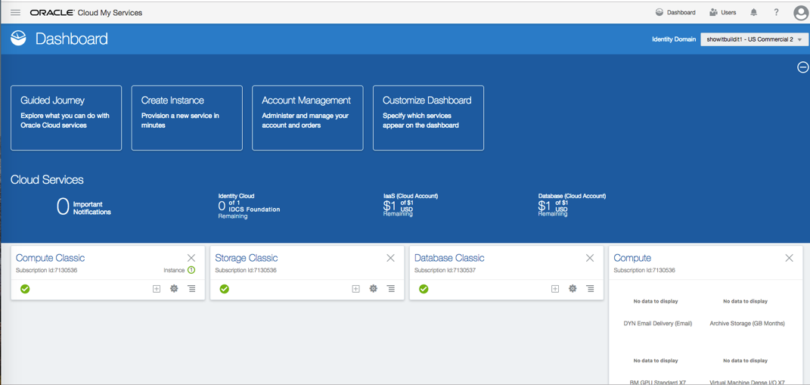

Unless you have already added them to the default view.

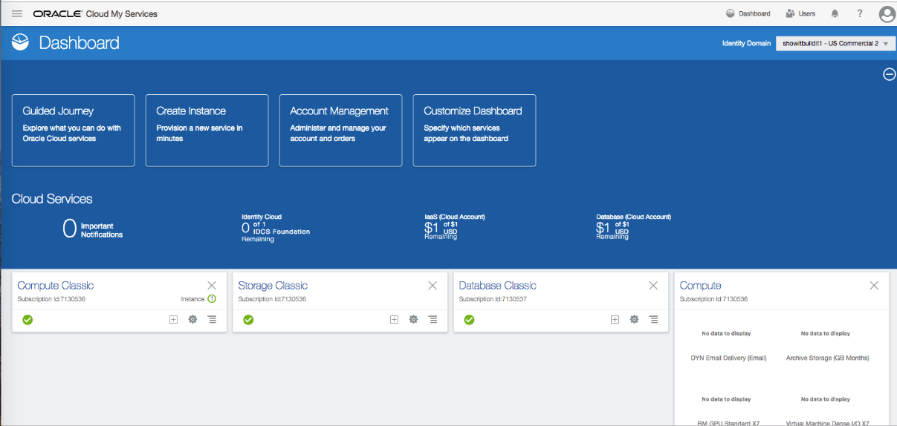

Click the ‘Hamburger Icon’ to display the list of available options.

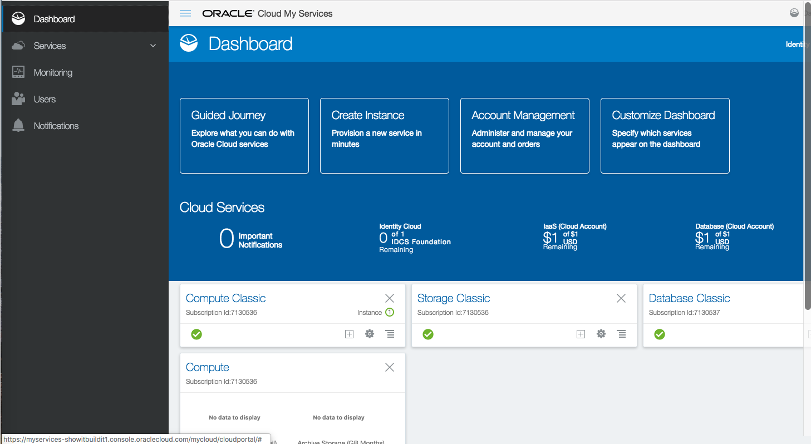

Use the drop-down list and select ‘Compute’ to list available instances

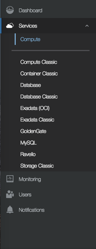

If the instance you want is currently STOPPED, use the ‘ellipsis’ (…) to
the right to START

 

The icon will turn green and the tag will switch to RUNNING once the
instance has started. If you won’t be using the instance full-time, STOP
it when you are not using it to conserve resources (and lower charges).

Click on the instance name to display its information page.

Use the instance ‘Hamburger Icon’  to display
the list of services available; you will use this set of menu options
frequently.

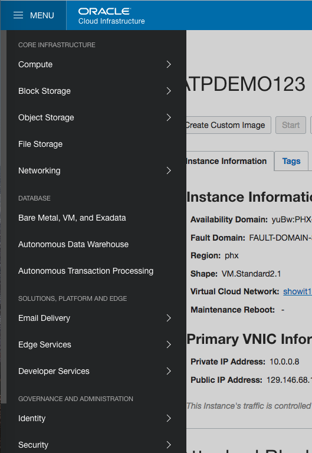

Choose ‘Autonomous Transaction Processing’ to continue and list any
existing ATP databases in the instance.

The Autonomous Transaction Processing page shows all existing ATP
databases; click “Create Autonomous Transaction Processing Database” to
begin the process.

Provide the initial setup information for the database in the top part
of the displayed set up window:

  - Compartment (select name from drop-down list, ask your administrator
    if you don’t know)

  - Display Name (you make this up, but, your team probably has
    standards to follow)

  - Database Name (you make this up, but, your team probably has
    standards to follow)

  - CPU Core Count

  - Storage (in terabytes)

Complete the bottom part of the set up window as follows:

  - The username ‘ADMIN’ is pre-selected and read-only

  - Provide a password for the ‘ADMIN’ user (you make it up) and verify
    it by typing it again in the Confirm Password area; you’ll need to
    remember this password when connecting

  - Choose the license type that is applicable

At the bottom of the set up window, click ‘Create Autonomous Transaction
Processing Database’ to begin the creation process.

The screen switches to the ATP Instance list; the new database shows
‘Provisioning’ click the new database name for more details

ATP databases typically provision quickly (less than 5 min, probably
under 30 sec).

When complete, the ATP icon will turn green and the text will show
RUNNING (you may need to refresh your browser screen to see the change).

Congratulations\! You’ve successfully create an ATP Database instance.

Return to this screen and click ‘Stop’ when you will not be using this
database to reduce resources consumed and costs.

1.  
# Lab 2 Obtain Connection Credentials

To connect and upload data to an ATP database from SQL Developer you
will need two things: a credentials ‘wallet’ and an ‘auth token’ making
sure connections are secure.

First return to the Oracle Cloud and get to the ‘Autonomous Transaction
Processing Database Information’ page

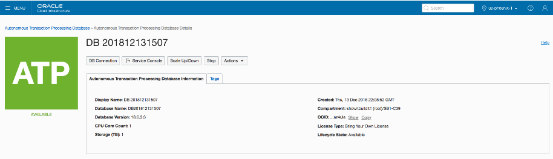

Click on the ‘DB Connection’ button

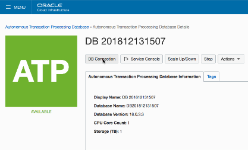

Review the Database Connection information displayed; note that Oracle
provides multiple connections depending upon the priority needed; online
apps would typically use the ‘High’ connection and batch jobs like
uploading data might use the ‘Medium’ connection.

To download a copy of the ‘wallet’ .zip file; click the ‘Download’
button

A dialog will open asking you to provide and verify a password for the
credential wallet. Once you have entered and verified the password click
the ‘Download’ button to continue.

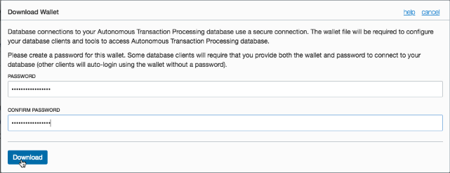

Save the downloaded .zip file for the credential wallet somewhere it can
be easily referenced when connecting to the database. The wallet is
normally used in zipped form; however, you might find it interesting to
unzip the wallet and examine its contents.

Return to the Autonomous Transaction Processing Database Information
page.

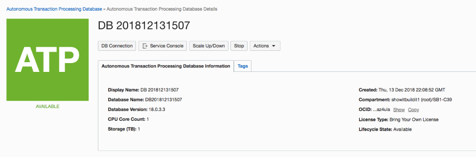

Once again use the ‘hamburger icon’ to display available Compute
instances

Select your compute instance.

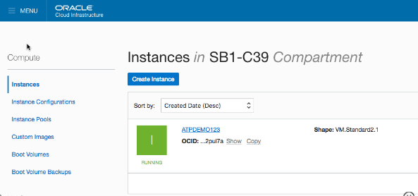

Use the Compute instance ‘hamburger icon’ to select ‘Identity-\>Users’
to list current users.

Find your desired user in the provided list and click on the user name
(‘tadmin’ in this example) to see specifics about that user.

On the user details page notice the ‘Resources’ list in the lower-left
corner. The number of ‘Auth Tokens’ currently available will be listed
(max is two). Under the ‘Auth Tokens’ title the existing Auth Tokens
will be listed. You may either obtain an Auth Token from your
administrator, or, create one here (if two already exist, delete one).

Click the ‘Generate Token’ button to begin the process of creating an
Auth Token.

A dialog will appear asking for a description for the Auth Token to be
created; enter a value and click the ‘Generate Token’ button.

Another dialog will appear showing the generated token.

**THIS IS THE ONLY TIME THE AUTH TOKEN VALUE IS DISPLAYED** – copy it
somewhere safe. Use either the provided ‘Copy’ link or use normal
‘copy-and-paste’ procedures.

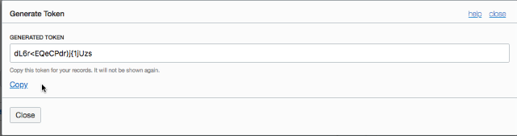

The new Auth Token now appears in the user’s list.

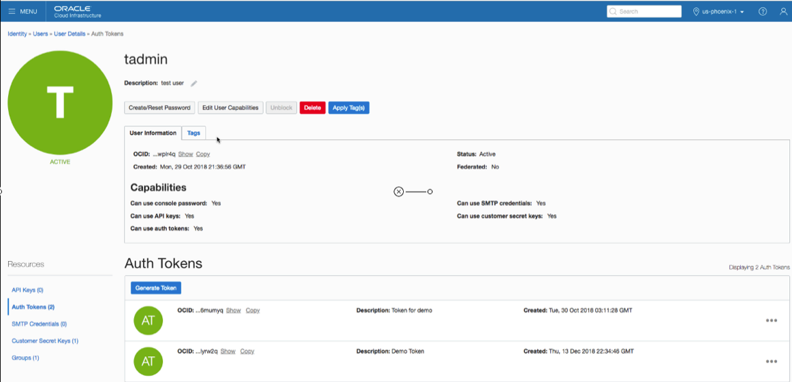

Congratulations\! Connection credentials are now available for
connecting to the ATP database.

# Lab 3 Using Oracle Object Storage

Oracle Cloud includes Object Storage for holding data. Some tools used
to import ATP data work with data present in Object Storage. In this lab
you will create an Object Storage ‘Bucket’ and load files into it that
will later be imported into an ATP database.

We have provided a .csv file and a .dmp file to be used in the exercise,
please download ‘Lab3.zip’ from the course files and unzip them. It
would probably be more-meaningful to load some of your own or your
customer’s data files instead.

Begin by using the Compute instance ‘hamburger’ menu to select ‘Object
Storage \> Object Storage’.

Object Storage is comprised of ‘buckets’ holding sets of data files. The
list of available buckets (if any) for a given Compartment will display
next.

Click the ‘Create Bucket’ button to begin the process of building a new
bucket, or, click on a bucket’s name to display that bucket’s contents.

The ‘Create Bucket’ screen appears; enter a bucket name (your choice,
your team probably has standards though) and the ‘Storage Tier’ –
‘STANDARD’ is usually the choice to make.

Click the ‘Create Bucket’ button to build the Object Storage bucket.

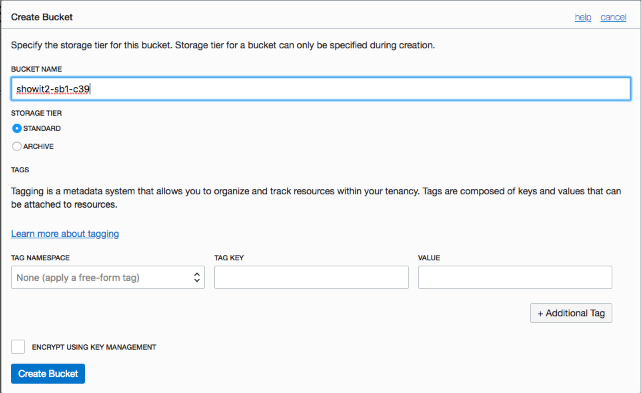

Once created, the bucket will be added to the bucket list display. Click
on a bucket name to display its contents.

The ‘Object Storage \> Bucket Details’ display shows information about a
bucket including a list of the objects currently stored in the bucket
(none currently in display below).

Click ‘Update Object’ to begin adding objects to the bucket.

The ‘Upload Object’ dialog is used to upload objects one at a time into
the bucket. Use the ‘Browse’ button to identify a file to be moved or
‘drag and drop’ a file into the space provided.

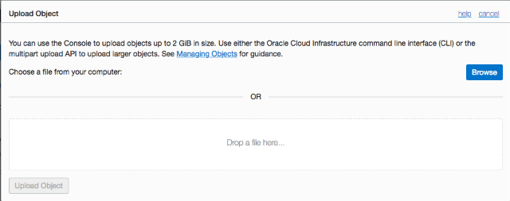

Select the file to be added to the bucket using your host file system’s
normal file selection tool.

The uploaded file name is displayed; click ‘Upload Object’ to verify the
upload. Repeat to upload all desired files.

Uploaded files are displayed in the ‘Bucket Details’ display. Use the
ellipsis (…) to the right of a file to display a list of options for
that file; choose ‘Details’ to see specifics about the file.

The ‘Object Details’ display provides information about an object stored
in the bucket. Perhaps most importantly is the ‘URL Path’ providing a
URL that may be used in a browser to view/download the file. To import
this file in SQL Developer the ‘URL Path’ must be modified (see Lab 5 on
page 29 or Lab 6 on page 37 for the modifications needed).

Congratulations\! You have successfully uploaded files to Oracle Object
Storage.

2.  
# Lab 4 Connect with Cloud Wallet

SQL Developer is a freely-available tool used primarily by developers
and DBAs; though, others often find it useful. Download and install SQL
Developer according to the instructions found at:

<https://www.oracle.com/technetwork/developer-tools/sql-developer/downloads/index.html>

Connecting to ATP databases is easy once you have the credentials
‘wallet’ file available. Either create one as described in the earlier
lab, or obtain a wallet file from someone else.

To successfully perform these labs you will need SQL Developer 18.3 or a
later installed locally. You will also need a CreateCredential.sql file
from the Lab4.zip file included in the course files.

Here is the main SQL Developer screen. Notice the ‘Connections’ display
in the upper-left corner; click on the green plus sign
 (or use the menu: File \> New \> General \>
Connections \> Database Connection) to start creating a connection.

A dialog will appear where connection details will be added. Complete
the dialog as follows:

1.  Add a connection name (you make it up)

2.  Use the ‘admin’ user and the password specified at ATP creation

3.  Change ‘Connection Type’ to ‘Cloud Wallet’

4.  Enter the name of the ‘wallet’ .zip file for the ATP database (or
    ‘Browse’ to it) as the ‘Configuration File’

5.  Use the ‘Service’ drop-down to select the connection desired
    (‘medium’ chosen here, often a good choice for batch work like
    imports).

6.  Click the ‘Test’ button to make sure everything is correct

7.  Look for ‘Status: Success’ then ‘Save’ the connection and ‘Connect’

Once successfully connected, a ‘Worksheet’ tab opens. Open (or copy) the
provided ‘CreateCredential.sql’ file in a worksheet then make the
following changes:

1.  Set ‘credential\_name’ (your choice, ‘OBJ\_STORE\_CRED’ in this
    example)

2.  Set ‘username’ to Oracle Cloud user that created ATP instance
    (‘tadmin’ in this example)

3.  Set ‘password’ to the ‘Auth Token’ created and stored earlier

To execute the script; click the ‘Run Script’ icon
 (upper-left above the worksheet) or press the
F5 key.

Watch for ‘success’ messages

Congratulations\! You have successfully connected to an ATP Database and
created a Credential object; you are now ready to begin importing data
from Oracle Object Storage.

# Lab 5 Load table Using .csv file

In this lab you will use SQL Developer’s ‘Data Import Wizard’ to import
table data using a .csv file coming from Oracle Object Storage.

You will need the input file’s ‘URL Path’ to modify, along with the name
of the Object Storage bucket as created in Lab 3 (see page 21) to import
the file.

First, be sure to connect to the ATP instance from SQL Developer (see
Lab 4 on page 26).

In this exercise, you will import data for a ‘COUNTRIES’ table; open the
list of available tables for your user and verify that the ‘COUNTRIES’
table does not currently exist.  
(feel free to import your own, or a customer’s table here instead…)

Right-click on the current user’s ‘Tables’ and choose ‘Import Data’ to
start the data import wizard.

The first page of the ‘Data Import Wizard’ provides a place to identify
the file to be imported and its format. You will need the ‘URL Path’ and
‘Credential’ for the file from Object Storage.

Reopen your browser and navigate to the Object Storage Bucket details
display for the bucket where the desired data file may be found; open
the Object Details display for the desired file.

Select the URL Path for the file to be imported and copy it to your
clipboard.

Paste the URL Path into an editor and make edits necessary for it to
work in SQL Developer’s wizard. Then, copy the modified URL Path to your
clipboard.

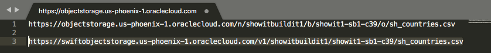

> 1\. Change 'objectstorage' to 'swiftobjectstorage'
> 
> 2\. Change '/n/' to '/v1/' (lower-case 'v')
> 
> 3\. Remove '/b'
> 
> 4\. Remove '/o'

On the first step of the Data Import Wizard:

1.  Change Source to Oracle Cloud Storage.

2.  Paste modified URL Path (from above) into File name.

3.  Use the Credential pull down to select the database credential
    object used.

4.  Modify any File Format setting necessary to match your file.

5.  Click the ‘Preview’ button to see some of the file contents.

6.  Click the ‘Next’ button to proceed to the next step in the Data
    Import Wizard.

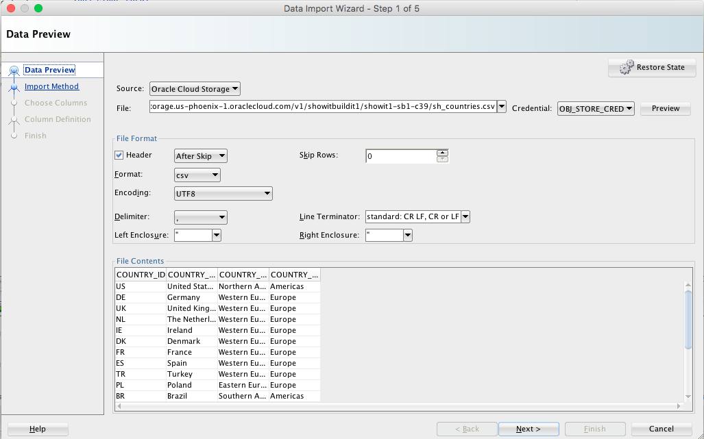

Step 2 of the Data Import Wizard provides a place to be sure the Import
Method is set to ‘Cloud Load’ and provide a name for the table to be
imported (you choose, , ‘MYCOUNTRIES’ in this example)

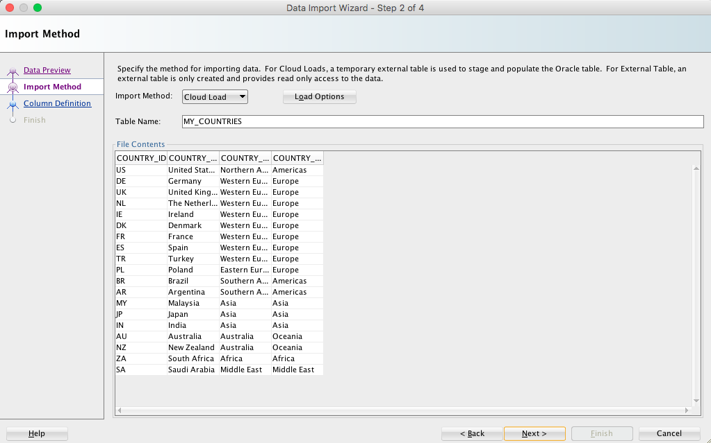

Step 3 of the Data Import Wizard asks that you review column names and
definitions for the table to be created; be sure to check all source
columns. Click ‘Next’ to go to the next step.

Step 4 of the Data Import Wizard allows testing of the load (click
‘Test’ button), if desired you may specify names and particulars for
an input data External Table allowing download of the ‘bad’ file to view
rejections (in this example, just click ‘Test’); click ‘Next’ to
continue to next step.

The final step (Step 5) of the Data Import Wizard provides a summary of
the steps to be taken.

Click the ‘Finish’ button to begin the actual import process.

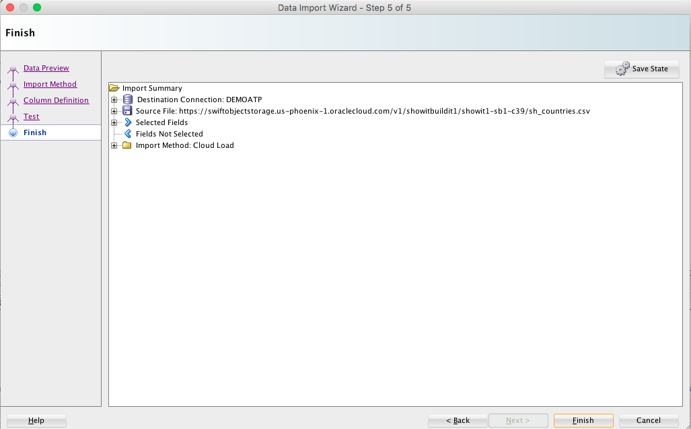

Once the import complete, a dialog box will open; click ‘OK’ to
continue.

Use the ‘Refresh’ icon to refresh the table
list for the current SQL Developer connection. Be sure to check the
‘Columns’ tab to make sure the table definitions are correct.

Check the ‘Data’ tab to make sure the table data looks good too.

Congratulations\! You’ve loaded a table into the ATP database using a
.csv file stored in Oracle Object Storage.

## 

# Lab 6 Import Using Data Pump

In this lab you will use SQL Developer’s ‘Data Pump Import Wizard’ to
import data using a .dmp file coming from Oracle Object Storage. Oracle
Data Pump may be used to import: entire database, schemas, tablespaces,
or tables.

You will need the input file’s ‘URL Path’ to modify, along with the name
of the Object Storage bucket as created in Lab 3 (see page 21) to import
the file.

First, be sure to connect to the ATP instance from SQL Developer (see
Lab 4 on page 26).

Scroll the connection navigator and open the list of ‘Other Users’ in
this exercise you will import a schema named ‘MYJJ’ make sure that the
schema does not currently exist by checking your display.

Next, open SQL Developer’s ‘DBA View’ to get things ready to use Data
Pump (unless already open).

Create a connection in the DBA View by selecting your already-open SQL
Developer connection.

 

Under ‘Data Pump’ find ‘Import Jobs’ – right-click on ‘Import Jobs’ and
select ‘Data Pump Import Wizard’ to start.

Step 1 of the ‘Data Pump Import Wizard’ provides a place to enter a job
name, choose type of import, and name the file(s) to be imported. You
will need the name of the credential created earlier and the Object
Storage file’s URL Path modified to fit SQL Developer’s needs.

Reopen your browser and navigate to the Object Storage Bucket details
display for the bucket where the desired data file may be found; open
the Object Details display for the desired file.

Select the URL Path for the file to be imported and copy it to your
clipboard.

Paste the URL Path into an editor and make edits necessary for it to
work in SQL Developer’s wizard.

1.  Change 'objectstorage' to 'swiftobjectstorage'

2.  Change '/n/' to '/v1/' (lower-case 'v')

3.  Remove '/b'

4.  Remove '/o'

Then, copy the modified URL Path to your clipboard.

Use the ‘Credentials or Directories’ pull-down under ‘Choose Input
Files’ to select the Credential object. Paste the modified URL path
into the ‘File Names or URI’ location. Choose ‘Add Row’ if you need to
add more files to the import and provide the appropriate Credentials and
URL Path for each one.

Click the ‘Next’ button to go to the next step in the wizard.

Step 2 of the Data Pump Import Wizard shows the schema(s) present in the
input .dmp file (‘JJ’ in this example); this may take a while to
populate.

Select a schema name and click the arrow key to ‘shuttle’ add the name
into Selected source schemas. Click the ‘Next’ button to move to Step 3
when ready.

Step 3 of the Import Wizard allow names to be changed (‘remapped’) for
Schemas and/or Tablespaces.

1.  Click ‘Add Row’ to begin

2.  Add the Source name in the left column (‘Source’)

3.  Add the desired new name into the right column (‘Destination’)

Click the ‘Next’ button to continue to Step 4.

Step 4 of the Import Wizard allow control over logging and other
potential issues. In our lab there is nothing to do so just click ‘Next’
to move on to Step 5.

If desired, change Job Name and enter a Job Description. Job Schedule
might also be modified here (not in our lab). Click ‘Next’ to advance to
the final stage in the wizard.

Step 6 provides a summary of the Import Job about to be scheduled. As in
the example below you may expand the display’s nodes to see more
details. Click ‘Finish’ to start the import.

You may also open the PL/SQL tab to see the actual PL/SQL to be
executed.  
(Code may be saved for later reuse)

The status of the running job(s) will appear in SQL Developer

The job(s) will show as ‘NOT RUNNING’ when complete.

Refresh the ‘Other User’s list in SQL
Developer; note that the ‘MYJJ’ user now appears.

Look to see that the schema objects have been imported properly.

Congratulations\! You have loaded a schema into your ATP instance using
a .dmp file from Object Storage.
