# Application Integration Lab Guide

## July 27, 2019 - 8:45PM

# Table of Contents

- [Lab Guide Overview](#lab-guide-overview)
  - [Lab Purpose and Guidelines](#lab-purpose-and-guidelines)
  - [Description of the Business Solution](#Description-of-the-Business-Solution)
  - [Description of the Technical Solution](#Description-of-the-Technical-Solution)
- [Prerequisites](#Prerequisites)
  - [Creating a Scratchpad to Stay Organized](#Creating-a-Scratchpad-to-Stay-Organized)
- [Preparing Your Environment](#Preparing-Your-Environment)
  - [Clear Browser Data](#Clear-Browser-Data)
  - [Sign In to the Oracle Cloud Platform](#Sign-In-to-the-Oracle-Cloud-Platform)
  - [Check Autonomous Database Status](#Check-Autonomous-Database-Status)
  - [Download Database Wallet](#Download-Database-Wallet)
  - [Configure SQL Developer Database Access](#Configure-SQL-Developer-Database-Access)
  - [Check Integration Status](#Check-Integration-Status)
  - [Prepare a Data Definition](#Prepare-a-Data-Definition)
- [Lab 1 Creating an Integration](#Lab-1-Creating-an-Integration)
  - [Key Features and Functionality](#Key-Features-and-Functionality)
  - [Create a REST Connection](#Create-a-REST-Connection)
  - [Create an ATP Connection](#Create-an-ATP-Connection)
  - [Create a New Integration](#Create-a-New-Integration)
  - [Define the Integration](#Define-the-Integration)
    - [Add a Trigger](#Add-a-Trigger)
    - [Add an Invoke](#Add-an-Invoke)
    - [Map Data](#Map-Data)
    - [Configure Integration Tracking](#Configure-Integration-Tracking)
  - [Activate an Integration](#Activate-an-Integration)
- [Lab 2 Building a Process Automation Application](#Lab-2-Building-a-Process-Automation-Application)
  - [Key Features and Functionality](#Key-Features-and-Functionality)
  - [Create a Process Application](#Create-a-Process-Application)
  - [Add a Process](#Add-a-Process)
  - [Tailor Roles for Each Process Swimlane](#Tailor-Roles-for-Each-Process-Swimlane)
  - [Implement the Submit Request Event](#Implement-the-Submit-Request-Event)
  - [Implement the Approve Request Activity](#Implement-the-Approve-Request-Activity)
  - [Implement the Resubmit Activity](#Implement-the-Resubmit-Activity)
  - [Perform Data Associations](#Perform-Data-Associations)
  - [Configure the Conditional Flow](#Configure-the-Conditional-Flow)
  - [Access an Integration from a Process Model](#Access-an-Integration-from-a-Process-Model)
  - [Validate an Application](#Validate-an-Application)
  - [Publish an Application](#Publish-an-Application)
  - [Activate an Application](#Activate-an-Application)
  - [Map Users to Swimlane Roles](#Map-Users-to-Swimlane-Roles)
  - [Test an Application](#Test-an-Application)
    - [Initiate a Request as a Store Manager](#Initiate-a-Request-as-a-Store-Manager)
    - [Work a Task As a Regional Manager](#Work-a-Task-As-a-Regional-Manager)
    - [Work a Task As a Store Manager](#Work-a-Task-As-a-Store-Manager)
    - [Work Another Task As a Regional Manager](#Work-Another-Task-As-a-Regional-Manager)
  - [Check Tracking for an Integration](#Check-Tracking-for-an-Integration)
  - [Check the Database Table](#Check-the-Database-Table)
- [Troubleshooting](#Troubleshooting)
- [Appendix Setup for the Labs](#Appendix-Setup-for-the-Labs)
  - [Set Up Oracle ATP](#Set-Up-Oracle-ATP)
  - [Set Up Oracle Integration](#Set-Up-Oracle-Integration)


# Lab Guide Overview

## Lab Purpose and Guidelines

Here is a brief overview of what you can expect to accomplish in these
lab exercises. The purpose of the labs is to familiarize yourself with
the features and functionality of Oracle Integration so you can represent the product in customer sessions, deliver demonstrations and begin developing skills to build your own proof-of-concept (POC) projects for customers.

To optimize your experience there are some general guidelines that will
help you get the most from these lab exercises.

  - Merely following the steps and screenshots without understanding the flow will diminish your learning experience, so think about what you are doing and why.  The explanatory text in this Lab Guide will help address the "whys."  **Please read this text.** 

  - Follow the steps as shown in this guide. Do not "freestyle" during the
    labs. It may get you into a bind.
    
  - Check the *Troubleshooting* section if you get stuck.

  - If you are in an Oracle class:
      - Ask a lab assistant before you spend a lot of time marching down a path that may lead to unsatisfactory results. 
    - Ask questions freely. The only dumb questions are those that are not asked.
    - Help out your fellow students. You can learn a lot by trying to explain a concept or step to someone else.
    - There is no prize for finishing first and there is no penalty for finishing last. The goal is to gain a firm understanding of Oracle Integration.

## Description of the Business Solution

Mama Maggy has an inventory control problem with its stores and
management is demanding better automated support. Specifically, Mama
Maggy wants to automate how stores order their inventory items.  This
includes pizza ingredients and other essentials needed to operate a
store. Their current process is completely ineffective as reflected by
these comments we have heard from our internal champions at Mama Maggy:

  - "Submitting order requests takes too much time for store managers."

  - "Order requests are not being promptly evaluated by regional
    managers."

  - "Evaluating order requests is cumbersome for our regional managers."

  - "Transforming order requests into approved orders in the backend
    system is a manual, error-prone process."

The solution is to provide an automated way for store managers to
efficiently enter their order requests and to have better visibility
into the status during the approval process. The new system will also
provide regional managers with a structured approach that makes order
request approval process faster and easier. Once an order request has
been approved, the new process automation solution is to interact with a
backend system in the cloud to create a new order. In these labs, the
backend system will be a cloud-based database rather than a SaaS system.

As you reference the business process model below, follow a scenario through the process during runtime:
- The workflow begins at the *Submit Request* start event where the Store Manager uses a web form to provide details for an inventory request for their store.  
- When the Store Manager is done filling in the form, they press the *Submit* button.  This generates a workflow task for the Regional Manager at the *Approve Request* human activity.
- \* Loop \* The Regional Manager accepts the task and uses a web form to evaluate the request.  
- If the request looks reasonable:
  - The Store Manager presses the *Approve* button on the web form.
  - Processing continues into the *Create Order* integration activity where an order is created in the backend system.  
  - The process then ends at the *Completed* end event.
- If the request looks unreasonable:
  - The Regional Manager enters comments into the web form and presses the *Reject* button on the web form.
  - The *Approved?* exclusive gateway routes the request back to the Store Manager at the *Resubmit* human activity.
  - The Store Manager accepts the task and uses a web form to read the Regional Manager’s comments and to add some additional notes to the request to plead their case.
  - When the Store Manager is done editing their request in the web form, they press the *Submit* button. This generates a workflow task for the Regional Manager at the *Approve Request* human activity again. (Processing continues at \* Loop \* above.)  

 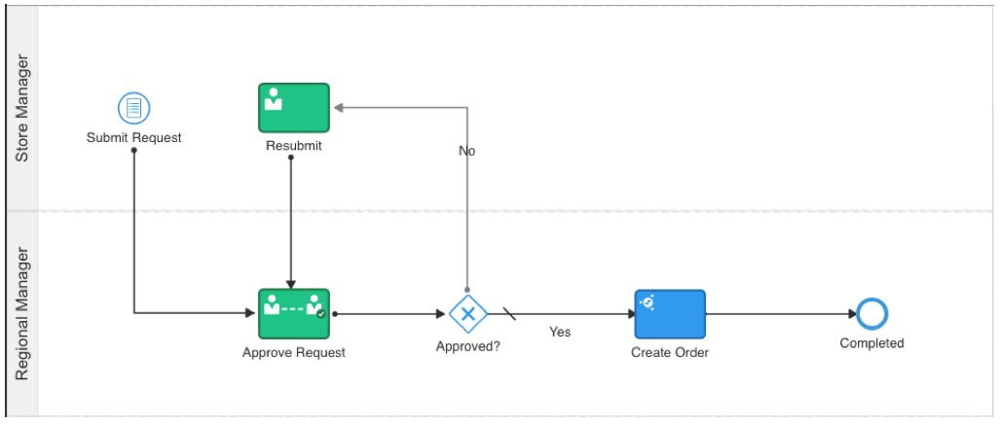
 Figure 1: Business View of the Solution

The solution will provide the following business value for Mama Maggy:

  - Lower costs: more efficient entry and evaluation of order requests

  - Better efficiency: faster entry of order requests and faster
    evaluations

  - Lower error rates: approval of order requests automatically results
    in orders being created in the backend system

  - Enhanced visibility: status of in-process order requests is
    constantly available

## Description of the Technical Solution

With the business process architecture as a backdrop, let’s review the technical architecture to reveal what Oracle products are used to provide the new solution for Mama Maggy.  Refer to the technical architecture diagram below.  We’ll again follow an inventory request through the architecture using a scenario:
- A Mama Maggy user, either a Store Manager or a Regional Manager, interacts with the process automation application, built for Mama Maggy, that is hosted by Oracle Integration (commonly referred to as *OIC*).
- OIC utilizes Oracle Identity Management to authenticate the user to the current role (Store Manager or Regional Manager) in the application.
- OIC allows the user to view and execute workflow tasks based on the specifications in the business process model for the application.  
- Store Managers and Regional Managers then submit and evaluate order requests.
- Once a Regional Manager has approved an inventory order request:
  - OIC Process sends a REST request (JSON payload) to OIC Integration that hosts an integration built for Mama Maggy.  
  - The integration:
    - Uses the Oracle REST Adapter to accept the order request information from the Regional Manager
    - Maps the order request data into an Order
    -    Uses the Oracle Autonomous Transaction Processing Adapter to insert a new Order row in the ORDERS table in the Oracle Autonomous Processing database.
  - Control is passed back to OIC Process to end the process.

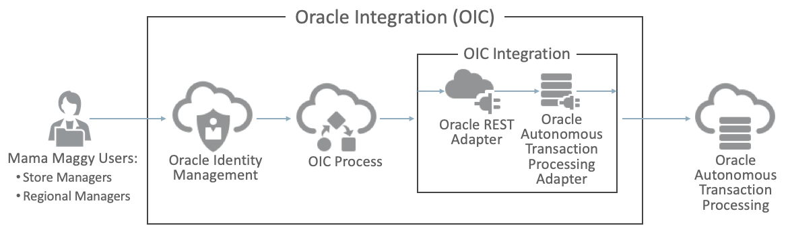
 Figure 2: Technical View of the Solution


# Prerequisites

## Creating a Scratchpad to Stay Organized
Create a place on your computer to keep notes that are important to
    remember and access. This is a good practice whenever you are
    working with software. A scratchpad area like this will allow you to easily reference and copy items later. You'll leave this file open throughout the labs. To set up your scratchpad:
    
  - Create an *ApplicationIntegrationLabs* folder on your
    computer. This is where you will store various
    artifacts, like your scratchpad, during the labs.

  - Open Notepad (Windows PC) or TextEdit (Mac) and create a new file called *MyLabNotes*. Save it into your *ApplicationIntegrationLabs* folder. 

Before starting these labs, you will need some basic information.  Please add these items to your scratchpad.

- Refer to the *Appendix* section to establish your own instances and collect the rest of the information listed below as you perform the setup steps in the *Appendix*.

If you are **in an Oracle class**, check your *Participant Guide* now.  Look in the *Lab Environment Details* section based on your location and, in some cases, your last name.  Look for and note the following:

  - Team Size: This informs you if you are to work alone or if you are to team up with a colleague. If you are to team up, find your "buddy" now and proceed together. 
    
  - Account Name (Tenancy): Note this in your MyLabNotes file as: *Tenancy: \<insertYourTenancy\>*.  

  - Sign In Type: There are two types of sign in paths you may be asked to follow based upon the *Account Name (Tenancy)*.  These paths are: *Use SSO* and *Do not use SSO*. Note your path in your MyLabNotes file as: *Sign In Type: \<yourSignInType\>*. 

    - If your *Sign In Type* is *Do not use SSO*:
      - Account User Name: The user name is likely your email address and was supplied to you in the welcome email that invited you to the tenancy. Note this in your MyLabNotes file as: *Account User Name: \<insertYourUserName\>*.
        
      - Account Password: This the password that you established when you responded to your welcome email when you were invited to this tenancy.  The link in the welcome email that allows you to set your password.  This link is valid for only a short time.  If that time has expired, you will have to perform a password reset.  Ask your instructor for help.  Do NOT note your password in your MyLabNotes file. 

  - Integration Instance Name: Note this in your MyLabNotes file as: *Integration Instance: \<insertYourIntegrationInstance\>*. 

  - Autonomous Database Compartment: Note this in your MyLabNotes file as: *DB Compartment: \<yourAutonomousDatabaseCompartment\>*. 

  - Autonomous Database Name: Note this in your MyLabNotes file as: *DB Name: \<insertYourAutonomousDatabaseName\>*.

  - *atpc\_user* Autonomous Database User Password: Note this in your MyLabNotes file as: *DB User Name: \<insertYourAtpcUser>*.   

If you are using this lab guide **outside of an Oracle class**:

- Account User Name: The user name is likely your email address and was supplied to you in the welcome email that invited you to the tenancy. Note this in your MyLabNotes file as: *Account User Name: \<insertYourUserName\>*.
        
- Account Password: This the password that you established when you responded to your welcome email when you were invited to this tenancy.  The link in the welcome email that allows you to set your password.  This link is valid for only a short time.  If that time has expired, you will have to contact your system administrator for a password reset.  If the time has expired and you are in an Oracle class, you can sign in using the *Temporary Password* contained in your *Participant Guide*. Do NOT note your password in your MyLabNotes file.

In addition, you should make sure that you have Google Chrome and Oracle SQL Developer installed on your computer.  They may already be there so there is no need to reinstall them.  If you need them,  here is where you can find the software: 

  - Google Chrome browser. Other browsers
    should work well, but this lab was tested with Chrome. The Chrome
    software can be found at:
    [*https://www.google.com/chrome*](https://www.google.com/chrome)

  - Oracle SQL Developer:

    - The latest version: (at least version 19.1): Mac: OSX or Windows
    64-bit. 

    - Oracle SQL Developer software can be found at:
    *<https://www.oracle.com/technetwork/developer-tools/sql-developer/downloads/index.html>*.  
      - **NOTES:** 
        - For Windows, the JDK IS included in the Oracle SQL Developer download.  
        - For Mac, the JDK IS NOT included in the download.

    - For Mac, download and install JDK SE Development Kit 8 (at
    least version 8u211) *before you install Oracle SQL Developer*. JDK 8
    software can be found at:
    [*https://www.oracle.com/technetwork/java/javase/downloads/jdk8-downloads-2133151.html*](https://www.oracle.com/technetwork/java/javase/downloads/jdk8-downloads-2133151.html)

# Preparing Your Environment

You have some setup work to perform before starting the two hands-on
labs in this course. By performing the following steps, you will
complete all the setup work in advance so you won’t be bothered with it
during the labs. **NOTE:** These steps assume that you have already
satisfied all the prerequisites listed in the *Prerequisites* section
above. If you haven’t, review the *Prerequisites* now and catch up. If you
have done the prerequisites, continue below:

1.  Close your VPN connection if it is active.

2.  Start your Chrome browser. Again, other browsers may work just fine,
    but these labs were tested using Chrome.

## Clear Browser Data

3.  During interactions with the Oracle Cloud, users sometimes have browser difficulties.  One symptom is the appearance of the *"ERR_TOO_MANY_REDIRECTS"* message.  To prevent this, we'll clear the browser data (cache) periodically throughout the lab exercises.  Clear your browser data now:
    
      - On a Windows PC:
        
          - *Click the Customize and control Google Chrome* icon (three
            vertical dots) in the upper-right corner of the window to
            display a menu.
        
          - Select the *More tools* option from the menu.
        
          - Select the *Clear browsing data* option from the submenu.
        
          - Time range: *All time*
        
          - Browsing history: checked *On*
        
          - Cookies and other site data: check *On*
        
          - Cookies and other site data: checked *On*
        
          - Cached images and files: checked *On*
        
          - Click the *Clear data* button.
    
      - On a Mac:
        
          - Select the *Chrome* option from the menu bar to display a
            menu.
        
          - Select the *Clear Browsing Data* option.
        
          - Time range: *All time*
        
          - Browsing history: checked *On*
        
          - Cookies and other site data: check *On*
        
          - Cached images and files: checked *On*
        
          - Click the *Clear data* button.

    *Tip:* As an alternative to having to clear browser data periodically (as indicated above), you can  open your Chrome window in *Incognito Mode* by using the *File* / *New Incognito Window* / menu option.

## Sign In to the Oracle Cloud Platform ##

6.  Sign in to the Oracle Public Cloud:
       - Browse to: https://cloud.oracle.com/en_US/sign-in 

      - Enter your *Account Name* (tenancy) for *Account* and then click *Next*.  In *Prerequisites*, you noted your *Tenancy* in your MyLabNotes file.

      - If your *Sign In Type* is *Use SSO*:
        - Click the *Oracle SSO* link at the right.  In *Prerequisites*, you noted your *Sign In Type* in your MyLabNotes file. 

        - When prompted for *User Name* and *Password*, enter your regular Oracle SSO Sign In credentials (user name and password). 

      - If your *Sign In Type* is *Do not use SSO*:
        - When prompted for *User Name* and *Password*, enter your *Account User Name* and *Account Password* that you noted in the *Prerequisites* section.  
         
      - Click the *Sign In* button.

## Check Autonomous Database Status

7.  Access your Autonomous Database to see if it has been started:

  - The page you see now is based upon the what your tenancy.  Follow the appropriate path documented below based upon what you see on the current page:
    - Path 1: If you see the *Guided Journey* page:
      - Click the *Dashboard* link in the upper-right side of the window.
      - Copy and paste the current URL into your MyLabNotes file as *Oracle Cloud My Services Page URL: \<yourServicesURL\>*.
      - Click on the green *Autonomous Database* icon.
      -  On the *Autonomous Database Manage Data and Transactions* page, click the *Go to My Dashboard* button in the upper-right.

    - Path 2: If you see the *Oracle Cloud* page with the *Quick Actions* section at the top:        
        - Click on the *hamburger* menu icon in the upper-left corner.
        - On the menu that appears, scroll down and select the *My Services Dashboard* option.
      - You're *Oracle Cloud My Services* page appears as shown below.
      - Copy and paste the current URL into your MyLabNotes file as *Oracle Cloud My Services Page URL: \<yourServicesURL\>*.
       
    - Click the *Autonomous Transaction Processing* option to display the *Service: Autonomous Transaction Processing* window.  **NOTE:** If you can't find this option, click on the *circled + icon* in the upper-left and use the *Customize Dashboard* option to add the *Autonomous Transaction Processing* option to your dashboard.  

    - Click on the *Open Service Console* button in the upper-right corner to display the *Autonomous Databases* page.  **NOTE:** If you instead see a window with this message, *"Feature Autonomous Databases is not available in your currently selected region*," perform this workaround:
      - Click the *hamburger menu* in the upper-left corner to display a menu.
      - From the *Database* section of the menu, click the *Autonomous Transaction Processing* option.  The *Autonomous Databases* page displays.

    - In the *Compartment* field at the left, select your *Autonomous
    Database Compartment* from the dropdown list. In *Prerequisites*, you noted your *DB Compartment* in your MyLabNotes file.

    - Click on your *Autonomous Database Name* that appears in the table.
  In *Prerequisites*, you noted your *DB Name* in your MyLabNotes file.  **NOTE:** Your *Autonomous Database Name* may be different than that displayed in the figure below:

        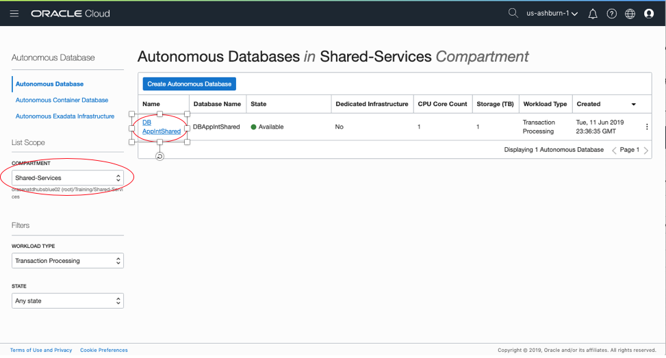

        Figure 4: Selecting Your Database

    - The *Autonomous Database Details* page appears. **NOTE:** Again, your *Autonomous Database Name* may be different than that displayed in the figure below:

       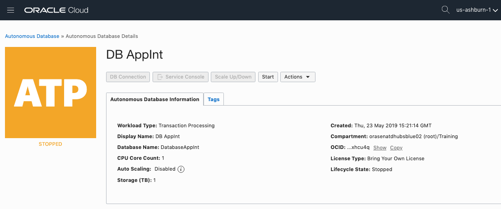

        Figure 5: Autonomous Database Details Page
    
    - If you don’t see the big, green “*Available*” icon shown above:
      - Click the *Start* button at the top to start the instance.  
      - When the *Confirm* dialog appears, click the *Start*.  It may take as long as 15 minutes until the “*AVAILABLE*” message appears there.  You might periodically refresh your browser page.  When the database has started, proceed.  
        

## Download Database Wallet

We need credentials to sign in to this database.  Oracle makes this easy with "wallets."  A wallet is a package of sign in information that a database client uses for access. You’ll use it soon to connect to this ATP database from Oracle SQL Developer.  Let's retreive the wallet file now:

8.  Download your database credentials as a “wallet file” so that you
    will have them for later to access the database:

     - Click the *DB Connection* button at the upper-left of the
     *Autonomous Database Details* page. The *Database
    Connection* dialog appears.

    - Click the *Download* button in the *Download Client Credentials
    (Wallet)* area:

      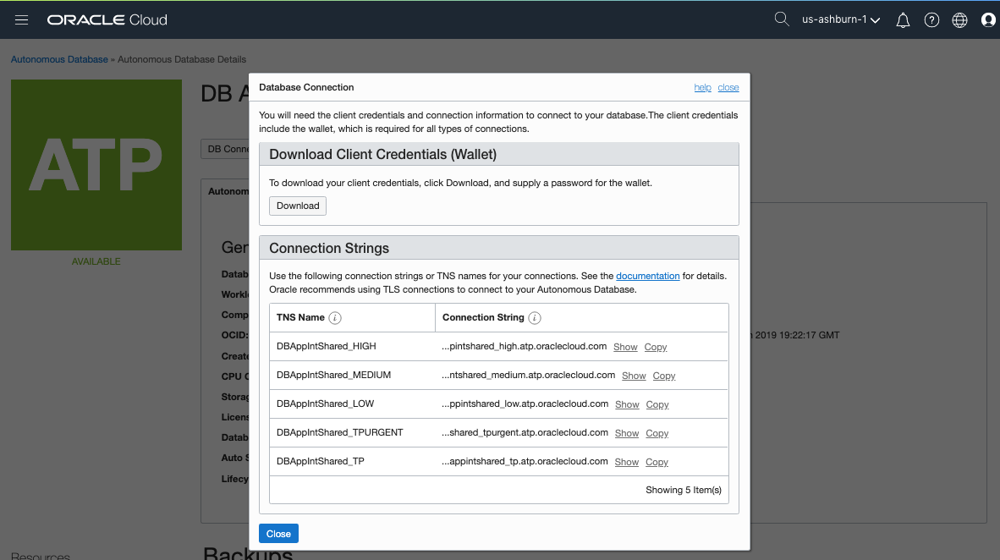

      Figure 6: Database Connection Dialog

    - In the *Download Wallet* dialog, enter and confirm a *Password* for
    your wallet. Record whatever wallet password you chose in your *MyLabNotes* scratchpad.  Label it as: *DB Wallet Password: \<insertYourDBWalletPassword\>*. 
    
    - Click the *Download* button on the dialog.

    - Notice that the wallet zip file has been downloaded into your *Downloads*
    directory.

    - Move your wallet zip file into your *ApplicationIntegrationLabs* folder. 

## Configure SQL Developer Database Access

9.  Establish access to your ATP database from your SQL Developer:

    - Close your VPN connection if it is active.

    - Start Oracle SQL Developer on your computer.  You installed it in the
    *Prerequisites* section above.

    - Create a new connection:
    
        - Click the *File* menu bar option and click the *New* option. The
        *New Gallery* dialog appears.
    
      - Double-click the *Database Connection* option at the right. The
        *New / Select Database Connection* dialog appears. Fill in the
        following fields:
    
      - Name: *MyATPConnection*
    
      - Username: *atpc\_user*  
    
      - Password: enter the *\<atpc\_user Autonomous Database User Password\>*
        that you noted in the *Prerequisites* section above.
    
      - Connection Type: *Cloud Wallet*
    
        - Configuration File: *Browse* to and select your wallet zip file
        that you just saved in your *ApplicationIntegrationLabs* folder above.
    
        - Service: *\<Autonomous Database Name (all lowercase without spaces)\>\_high* option. Select it from the dropdown list.  The *high* option gives us the best performance. 
    
      - Click on the *Save Password* field so you aren’t prompted for the
        atpc\_user password each time you activate your connection.

      - Click the *Test* button at the bottom to see if SQL Developer can
    connect to your ATP database as *atpc\_user*. Wait for a moment as
    access is attempted. When successful, celebrate the “*Status:
    Success*” message that appears in the lower-left corner.  
        - If the test fails, check that the *Service* is specified incorrectly.

        - If the test still fails and you are in an Oracle class, you may need to configure the *Proxy*:
          - Click on the *Proxy* tab.

          - Toggle on the *Use SQL Developer Proxy* radio button.

        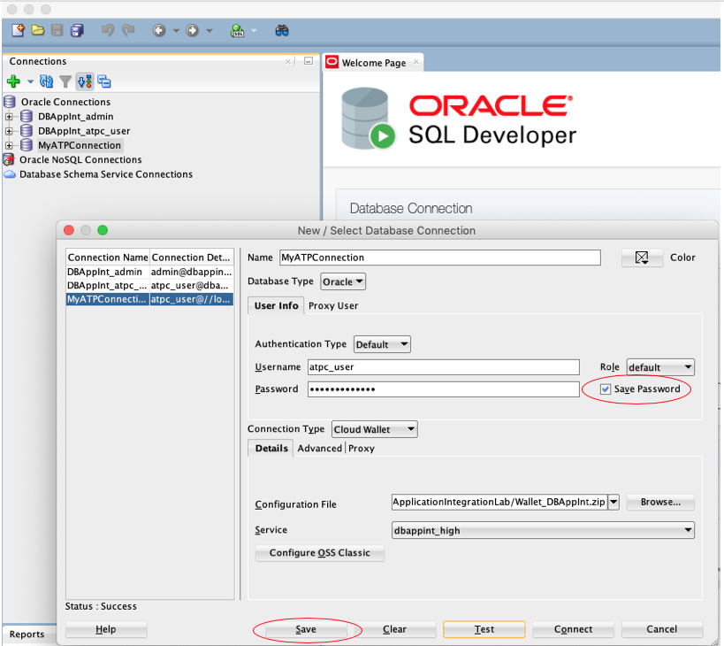

        Figure 7: Creating a New SQL Developer Connection

        

      - Click the *Save* button at the bottom of the dialog.

      - Click the *Cancel* button at the bottom to exit the dialog.

     - Test your new SQL Developer connection:
    
        - In the Connections panel at the left, *double-click on
        MyATPConnection*. Since you elected to save your *atpc\_user*
       password, you aren’t
        prompted for the password and the connection is opened
        immediately.  The hierarchy of details appears under *MyATPConnection*
        in the left-side panel.
    
        - *Expand the Tables (Filtered)* option under your connection name
        in the left panel to expose the list of tables established in
        your ATP database. 
        
        - Click on the *ORDERS* table that has already been created for you.
        The structure of the table displays in the right panel:

          

          Figure 8: Table Structure in SQL Developer

        - Click on the *Data* option at the top of the right panel to see if
    there are any test rows in the ORDERS table.  It might have some data in it already.

    - Gracefully exit SQL Developer:
    
        - Right-click on your *MyATPConnection* in the left panel and
        select *Disconnect*.
    
        - *Exit* SQL Developer.

## Check Integration Status

10. Access your Oracle Integration instance to make sure that it is
    running:
    
    - Access your Oracle Integration instance by
        browsing to the *Oracle Cloud My Services Page URL* that noted earlier 
        in your *MyLabNotes* file to access your services.  If you forgot to write this URL down, use your browser history to navigate to *My Services - Dashboard*.  Then, note this URL in your *MyLabNotes* file as *Oracle Cloud My Services Page URL*.

    - Click on the *Integration* option.

    - In the *Service: Oracle Integration* page that appears, click on the
    *Open Service Console* button in the upper-right corner. 
    
    - Click on
    your *Integration Instance Name*. You noted that name in your MyLabNotes file the
    *Prerequisites* section above.

    - Make sure that your Integration instance is available. Look at the
    *Status* field. It should display “*Ready*.” **NOTE:** A different instance name may appear at the top of the page than what you see in the figure below.  Be sure to use **your** *Oracle Integration Instance Name* that you noted in the *Prerequisites* section.

      

      Figure 9: Checking Status on the Service Page for Oracle Integration

    - If the *Status* field doesn’t show “*Ready*,” click on the *Start
    Instance* icon (arrowhead icon) in the upper-right to start the
    instance.  When the *Start Instance* dialog appears, click *OK* to
    start the instance.

    - Keep *refreshing the browser page* until you see that the instance
    has started. This will display the *Oracle Cloud My Services: Oracle
    Integration* page.  If you don't see a 
    *red triangle icon* under your instance name, the instance is ready for use.
    It may take a minute or two to start.  

    - Access your Integration instance’s home page:

        - Click on your instance name in the *Instances* list.

        - Verify that the *Status* is *Ready*.

        - Click the *hamburger menu* icon in the upper-right and select
    the *Open Integration Home Page* option:

          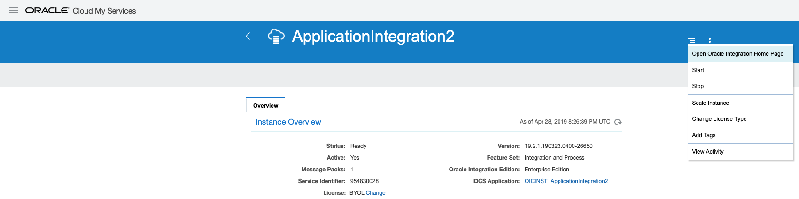

          Figure 9: Accessing the Oracle Integration Home Page

      - Click on the *Open Home* button to the right of the menu.  The home page appears:

        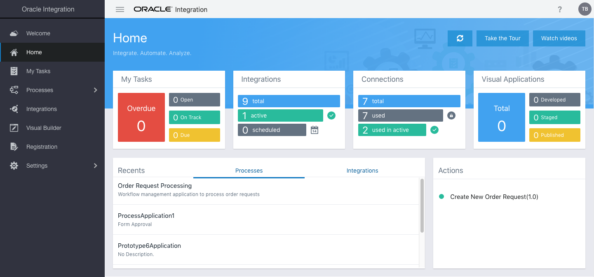

         Figure 10: Oracle Integration Home Page
      - Copy this URL and save it in your *MyLabNotes* scratchpad file. Label it as 
      *Oracle Integration Home Page URL*. Record this URL in your *MyLabNotes* scratchpad.  Label it as: *Oracle Integration Home Page URL: \<insertYourOracleIntegrationHomePageURL\>*. 

## Prepare a Data Definition

11. We need to have a data definition available to use during Lab 1 as we
    configure an a REST endpoint for our integration. So, let’s get the data
    definition file in place now so it will be ready to use. We
    will use the XSD format to define the data. *“XSD”* stands for *XML
    Schema Definition*. It is a standard way to describe the structure of
    an XML document. Our request payload for our endpoint will be
    formatted in XML.

     - Open your Notepad or TextEdit editor and start creating a new
     file so we can add and save the XML statements for the XML schema.

    - Copy and paste the following XML statements into your editing session
    for the new file:

         ```
         <?xml version="1.0" encoding="UTF-8" ?>
        <xs:schema xmlns:xs="http://www.w3.org/2001/XMLSchema" targetNamespace="https://www.oracle.com">
        <xs:element name="Order">
                  <xs:complexType>
                            <xs:sequence>
                                      <xs:element name="orderID" type="xs:string"/>
                                      <xs:element name="orderDate" type="xs:date"/>
                                      <xs:element name="storeID" type="xs:decimal"/>
                                      <xs:element name="stockID" type="xs:decimal"/>
                                      <xs:element name="quantity_ordered" type="xs:decimal"/>
                              </xs:sequence>
                    </xs:complexType>
          </xs:element>
          </xs:schema>
        ```
      Figure 11: XML Schema Definition File 
    - Save the file in your *ApplicationIntegrationLab* directory with the
    name *RESTEndpointRequestPayload.xsd*. Make sure you save it as a
    text file:
    
        - **NOTES:** 
          - On a Mac, before you save, use the *Format / Make Plain Text* option to
        convert the contents to text. Then, change the file extension to
        xsd in the Finder after you save it.
    
          - On a Windows PC, save the file as a *Text Document*
        (\*.txt) and then change the file extension to xsd in the File
        Explorer.

      - The file should look like this:

        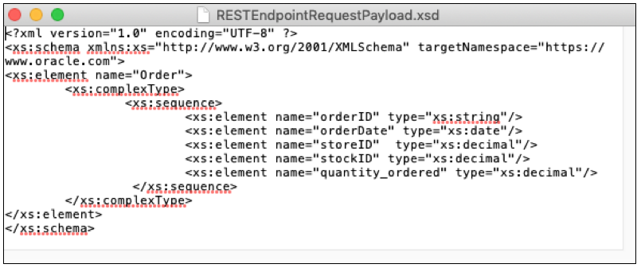

        Figure 12: XML Schema Definition for the REST Request Payload

      - In your Finder (Mac) or File Explorer (PC), check to ensure that the file name extension is “*xsd*” rather than
    “txt” and change it if necessary.

That completes the steps to prepare your environment. If you have also completed the steps in the *Prerequisites* section, you are ready to start Lab 1.  Keep right on going.

# Lab 1 Creating an Integration

In this lab, you use the Integration component of Oracle Integration to
build an application integration that will be used in Lab 2 to interact
with an Autonomous Transaction Processing (ATP) database to create a new
order based upon an approved order request.

## Key Features and Functionality

  - Create two connections that leverage prebuilt adapters. The first
    connection allows an integration to be triggered by a REST request
    and the second connection initiates an insert operation on a table
    in the ATP database.

  - Use the two connections to build a new integration that accepts
    order data via a REST POST and creates a new order row in the ORDERS
    table in the ATP database.

  Revisit the technical architecture, displayed below, to get your bearings.  Focus on the *OIC Integration* area.  In the integration we are about to build, we will create connections to utilize these two adapters and we will perform data mappings to make sure the right data is available to them.  Ultimately, a new order will be added to *Oracle Autonomous Transaction Processing*:


 Figure 13: Technical View of the Solution

Let's get started with some housekeeping and some navigation:

1.  Start fresh by clearing your Chrome browser cache (all browsing
    data). If you need help, refer to the *Preparing Your Environment*
    section for the steps. This will help avoid some potential
    frustrations along the way when the Oracle Cloud and the browser
    seem to get “confused.”

2.  Refresh your browser window. Due to clearing the browser cache, you
    may lose your connection to the Oracle Cloud. Browse to the 
    *Oracle Integration Home Page URL* you noted in your *MyLabNotes* file 
    to access your Integration instance.  You may have to sign in again.  **NOTE:** If
    you are an Oracle employee, follow the *Sign in with Oracle SSO* path.

3. Click on the *Integrations* option to access the *Oracle Integration: Integrations* page. If you can’t see the menu options at the left, click the
    hamburger menu icon in the upper-left to reveal the menu

We will create two connections that you’ll use in the integration
    that you will build in a moment. One connection will enable a REST
    client to access the integration. The other connection will allow
    your integration to communicate with the ATP database. 

4.  On the Integration page, click the *Connections* menu option at the
    left:

    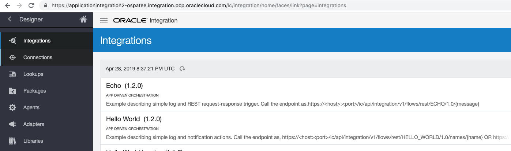

    Figure 14: Integration Page Highlighting the Connections Menu Option

## Create a REST Connection

Create a REST Trigger connection that will allow your integration to be
initiated:

5.  Click the *Create* button in the upper-right corner of the
    *Connections* page.

6.  The *Create Connection – Select Adapter* dialog appears so you can
    choose the prebuilt adapter that you want to be the basis for your new
    connection. Oracle has many prebuilt adapters that shield the user
    from all the details on how to interact with many backend services.
    Prebuilt adapters save time and allow less-technical people to be
    successful building integrations.

7.  In the *Search* field, enter: *REST* and press *Return*. The REST
    adapter appears. Click the *Select* button for the *REST* adapter.

    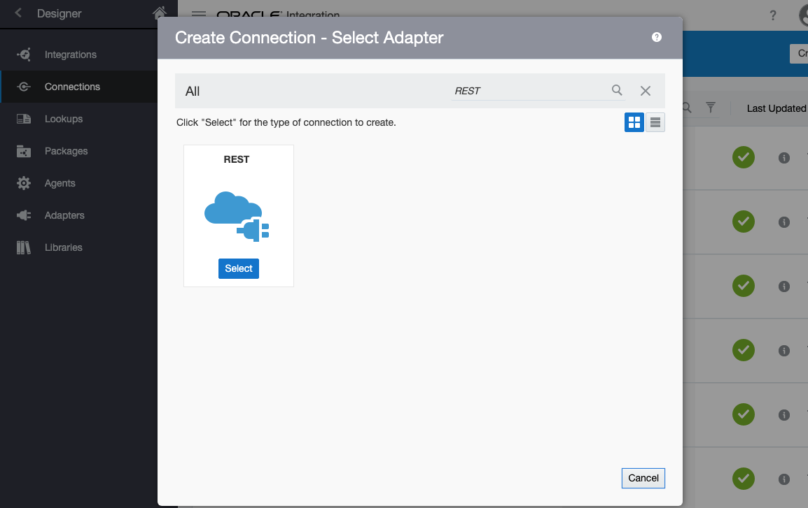

      Figure 15: Creating a new connection based upon a prebuilt adapter

8.  The *Create New Connection* dialog appears so you can provide details
    about how this connection will be used in your integration.

9.  Fill in the fields:
    
    - Name: *\<insertYourInitialsHere\><insertCurrentTimeHere\>\_REST\_Trigger* (*TNB1240\_
        REST\_Trigger*, for example if your initials are *TNB* and it is *12:40* (no colons) in the afternoon).  We append intials and current time to the front of connection names since your may be sharing an Integration instance with others and connection names must be unique within an instance.
    
    - Role: *Select Trigger* from the dropdown menu to indicate that
        this connection will trigger the first step in a series of steps
        in an integration.
    
    - Description: *REST connection to support triggering of an
        integration*   (copy and paste)

        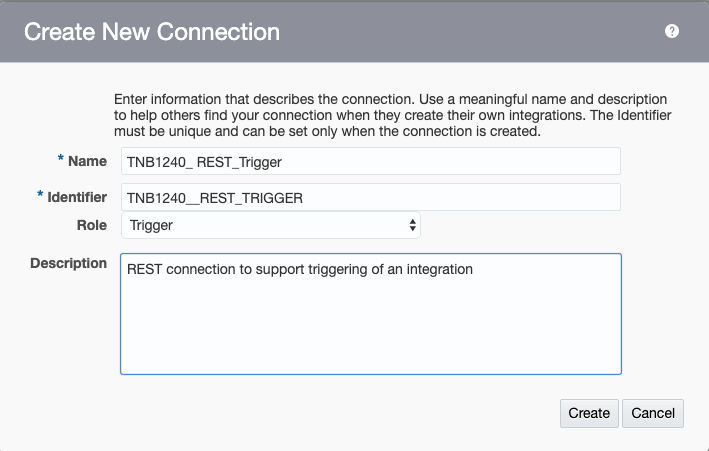

      Figure 16: Creating a new connection
    
    - Click the *Create* button.
    
10. Enter your *email address* in the *Email Address* field so you
        can be alerted if problems or changes occur to your connection.
    
11. Click the *Test* button in the upper-right corner and look for
        the “*Connection REST\_Trigger was tested successfully*” message
        in the upper-left corner to indicate that you have created a
        valid connection.
    
12. Note the blue icon in the upper-right indicates that your connection has
        been *100%* defined.
    
13. Click the *Save* button in the upper-right to save your new
        connection.
    
14. Click the *Close* button in the upper-right to return to the
        *Connections* page.  Notice that your new connection appears in the *Connections* list.

## Create an ATP Connection

Let's create the second connection we'll need for our integration.  That will be an ATP Invoke connection that will allow your integration to interact with the ATP Database:

15. Click the *Create* button in the upper-right corner of the
    *Connections* page. The *Create Connection – Select Adapter* dialog
    appears so you can choose the prebuilt adapter you want to be the
    basis for your new connection.

16. In the *Search* field, enter: *ATP* and press *Return*.

17. The *Oracle ATP* adapter appears. Click on its *Select* button.

18. The Create New Connection dialog appears. Fill in the fields:

    - Name: *\<insertYourInitialsHere\><insertCurrentTimeHere\>\_ATP\_Invoke\_Insert\_Into\_DB*
      (*TNB1452\_ Invoke\_Insert\_Into\_DB*, for example if your initials are *TNB* and it is *14:52* (no colons) in the afternoon).)

    - In the Role field, select *Invoke* from the dropdown menu to indicate
    that this connection will not trigger the integration, but instead,
    it will be invoked by it.

    -   In the Description field, enter: *Insert an order row into the order
    table in ATP*

        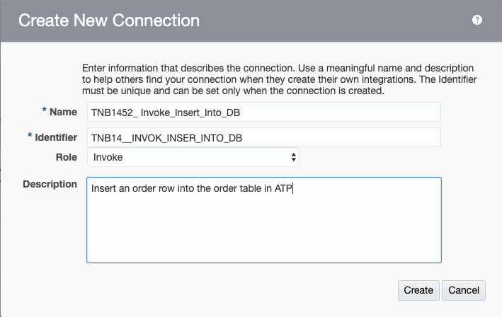

        Figure 17: Creating a new connection based upon a prebuilt adapter

    - Click the *Create* button.

19. Enter your *email address* in the *Email Address* field so you can be
    alerted if problems or changes occur to your connection.

20. Establish the Connection Properties for this new ATP invoke
    connection:

    - Click the *Configure Connectivity* button at the right of the
    *Connection Properties* area. The *Connection Properties* dialog
    appears.

    - For Service Name, enter: *\<Autonomous Database Name (all lowercase without spaces)\>\_high*  (That gives us the best performance.)

    - Click the *OK* button to close the *Create New Connection* dialog.


14. Establish the Security settings by clicking the *Configure Security*
    button at the right of the Security area. The *Credentials* dialog
    appears. Perform the necessary configuration:

    - For the *Wallet* fields, we can supply the connection with the
    database sign in details (the wallet) you established in the
    Preparing Your Environment work section.

      - Click *on* the *Upload File* check box to begin uploading your
    wallet file.

      - Select the *Upload button* and the *Upload File* dialog appears.

      - Browse to and select *your Wallet zip file*
    that you moved into your *ApplicationIntegrationLab* folder earlier.

      - Select your *Wallet zip file* and click the *Open* button.

      - Click the *Upload* button on the *Upload File* dialog to upload your
    database access credentials into your new connection.

    - For the *Wallet Password* and *Confirm Wallet Password fields*,
    enter (copy and paste) the wallet password. Remember that you saved
    it in your *MyLabNotes* file earlier.

    - For the Database Service Username, enter: *atpc\_user*

    - For the Database Service Password and Confirm Database Service
    Password, enter the *atpc\_user Autonomous Database User Password*
    that you noted in the *Prerequisites* section.

    - Click the *OK* button to close the *Credentials* dialog.

    - Click the *Test* button in the upper-right and watch for the
    “*Connection ATP\_Invoke\_Insert\_Into\_DB was tested
    successfully*” message to appear in the upper-left corner.

22. Click the *Save* button in the upper-right corner to save your new
    connection.

23. Click the *Close* button in the upper-right corner to return to the
    *Connections* page.

24. Notice that your two new connections appear on the *Connections* page:

    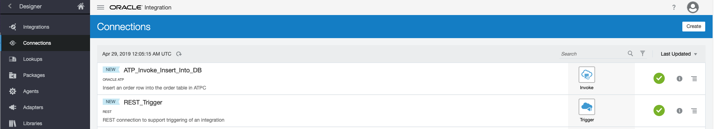

    Figure 18: Connections Page

## Create a New Integration

With our two connections in place, we can now create our integration:

25. Click the *Integrations* menu option at the left-side menu:

    

    Figure 19: Integration Page Showing the Integrations Menu Option

26. The *Integrations* page appears. Click on the *Create* button in the
    upper-right corner.

27. The *Create Integration – Select a Style* dialog appears showing the
    various templates that can be used to create a new integration.
    These styles really speed integration development. Based on the
    purpose of the integration, these styles do a lot of
    pre-configurating for you.

28. Read the descriptions for each of the styles so you will appreciate the breadth of the style support.

29. Select the *App Driven Orchestration* style by clicking on its *Select* button.  This is the best style for our needs because we want our integration to be *triggered by an Application*.  You will develop that *application* in Lab 2.

30. The *Create New Integration* dialog appears. Fill in the fields:

    - What do you want to call the integration? Enter:
    *\<insertYourInitialsHere\><insertCurrentTimeHere\>\_Create New Order* (*TNB1537\_Create New
    Order*, for example)

    - What does the integration do? Enter: *Accept a REST POST call and
    create a new order in the ATP database*

      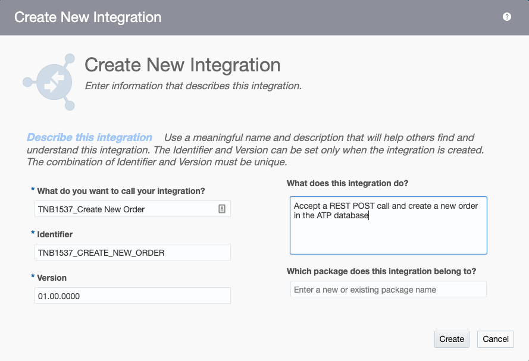

      Figure 20: Creating a new integration

    - Leave the default value (empty) alone for the package field at the left and click the *Create* button to display the *Integration Editor*.


31. Notice the beginnings of the new integration in the integration editor canvas. This is where you will
    visually define your integration using easy-to-use drag and drop features:

    

    Figure 21: Integration Editor

32. Click the *Save* button in the upper-right corner. 

## Define the Integration

Let's start adding elements to the integration editor canvas to define your
integration.

### Add a Trigger

33. Find the *Triggers* icon at the extreme
    right-side of the window and *click on it* so you can use the
    REST\_Trigger connection that you just built.

34. The available trigger connections appear:

    

    Figure 22: Accessing Available Triggers in the Integration Editor

35. *Drag your REST\_Trigger* connection and drop it into the *Start*
    element since it will trigger the integration:

    

    Figure 23: Start Element in the Integration Editor

36. The Configure REST Endpoint dialog appears. Fill in the fields:

    - What do you want to call your endpoint? Enter:
    *Accept\_Order\_Data\_Endpoint*

    - What does this endpoint do? Enter: *Accept a REST POST of new order
    data*

    - What is the endpoint’s relative resource URI? Enter: */order*

    - What action do you want to perform on the endpoint? Select *POST*
    from the dropdown menu. POST is a standard method to use to send XML
    data to a server in the request body of an HTTP request.

    - Select any options that you want to configure: Check on *Configure a
    request payload for this endpoint.*

    - Click *Next* in the upper-right corner.

    - Skip over the *Attachment Processing Options*.

    - Find the *Select the request payload format* area so you can define
    the structure of payload data that will come into the integration
    with this trigger.

    - Make sure that XML Schema (the default) is selected from the
    dropdown menu.

    - At the *Schema Location* field, click the *Choose File* button to
    display a file chooser dialog:

      - Navigate to your *ApplicationIntegrationLab* directory and choose your
    *RESTEndpointRequestPayload.xsd* file you saved in the
    Preparing Your Environment section.

      - Notice in the *Element* field that the tooling has read the file and
    has selected *Order*. That’s the only element defined in your XSD. **NOTE:** If the tooling has trouble validating your xsd file, you may
    need to edit it and clean up some formatting. Sometimes, copying and
    pasting drags along some hidden characters at the end of lines.

      - In the area labeled *Select the type of payload with which you want
    the endpoint to receive*, select *JSON*. “JSON” stands for “JavaScript
    Object Notation.” It is a lightweight data interchange format that
    is easy for humans to read and write. Later, in Lab 2, you’ll see
    that this request payload will be supplied by a web form and web
    forms deal in JSON data structures.

    - Click *Next* in the upper-right corner to display the *Summary* dialog
    so you can review your settings for this request endpoint.

    - Expand the *Endpoint Summary* field to see that you have defined an
    endpoint that will accept a *JSON payload* via a *POST* to a REST
    service URI called */order*:

        

         Figure 24: Reviewing a REST Endpoint Configuration

  - Click *Done* in the in the upper-right corner to close the Configure
    REST Endpoint dialog.

37. The integration editor canvas now shows your REST trigger at the top
    of the diagram:

    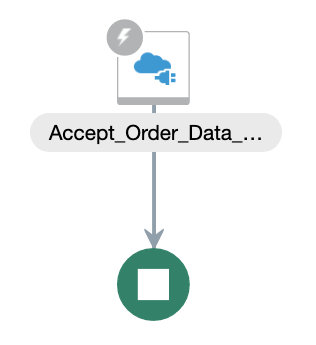

      Figure 25: Integration With a Trigger Specified

38. Click *Save* in the upper-right corner.

### Add an Invoke

39. Find the *Invokes* icon at the extreme right-side of the window and click on it so we can add your
    *ATP\_Invoke\_Insert\_Into\_DB* connection to the integration
    editor canvas. The available invoke connections appear:

    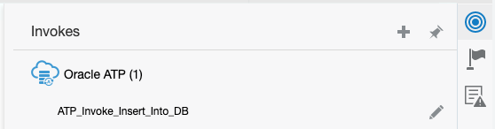

    Figure 26: Accessing Available Invokes in the Integration Editor

40. Drag your *ATP\_Invoke\_Insert\_Into\_DB* connection and drop it
    onto the *plus icon* that appears on the diagram right below your
    REST trigger element as you drag.

41. The Oracle Adapter Endpoint Configuration Wizard dialog appears.
    Fill in the fields:

    - What do you want to call your endpoint? Enter:
    *Insert\_Order\_Endpoint*

    - What does this endpoint do? Enter: *Insert a new order into the ATP
    database*

    - What operation do you want to perform? Select: *Perform an Operation
    On a Table* from the dropdown menu.

    - What operation do you want to perform on Table? Make sure that the
    *Insert* option is selected.

    - Click the *Next* button in the upper-right corner.

    - The wizard moves to the *Define the Operation On Table* step. Make
    these selections in the fields:

      - Schema: Select: *ATPC\_USER* from the dropdown menu.

      - Table Type: *Make sure that TABLE is selected*

      - For Table Name, click the *Search* button.

      - Move the *ORDERS* table to the *Selected* column in the table that
    appears, by selecting it and clicking the “*\>*” symbol.

      - Click the *Import Tables* button at the bottom to display the
    *Select the parent database table* step. Make sure that *ORDERS* is
    selected and click *Next* in the upper-right corner.

      - The wizard displays the *Summary* step page. See that you have
    configured your ATP connection to perform an *Insert* database
    operation on the *ORDERS* table:

        

        Figure 27: Reviewing an Adapter Endpoint Configuration

      - Click *Done* in the in the upper-right corner to close the Configure
    REST Endpoint dialog.

<!-- end list -->

42. The integration canvas now shows your ATP invoke at the bottom of
    the diagram. Notice that a *Map to Insert\_Order* element has been
    automatically inserted ahead of it so you can map incoming data from
    your REST trigger to your ATP invoke:

    

    Figure 28: Integration Editor Showing an App Driven Orchestration

43. Click *Save* in the upper-right corner.

### Map Data

44. Let’s use the data mapper to indicate how incoming order data from
    the REST POST request is to be passed to the outbound invocation of
    the ATP database: 
      - Click on the *Map to Insert\_Order* element in the
    canvas.

    - Select the *Edit* (pencil) icon that pops up to display the data
    mapper.

    - Map each of the five fields from the source at the left (the inbound
    REST call) to the corresponding files in the target at the right
    (the outbound ATP invocation):

      - Click a source field (like *orderID*) at the left.

      - Drag the source field and drop it on the target field (like
    *orderID*) at the right.**NOTE:** As an alternative to drag and drop,
    you can click on the source field at the left, click on the target
    field at the right and then click the *Map+* icon above the source
    fields.

      - A green line appears temporarily, but you are looking for both
    fields to show a green check mark icon to indicate that the mapping
    is in place.

        - **NOTE:** If you make a mistake during mapping, you’ll want to know how
    to delete a mapping so you can redo it. Here are the steps:
    
            - *Click the field name* on the target side (it’s a link on the right-side) to
        display the *Build Mappings* detailed editor.
    
            - In the editor, find the statement in the right-side panel
        representing your incorrect mapping. It’s a “*value-of select*”
        statement. Right-click on it.
    
            - Select the *Delete* option in the popup menu.
    
            - Click the *Close* button in the dialog’s lower-right corner to
        exit the *Build Mappings* detailed editor.
    
            - Notice that the mapping is gone from the data mapper.
    
            - Perform the desired mapping.
    
    - Continue mapping until all five fields are mapped:

      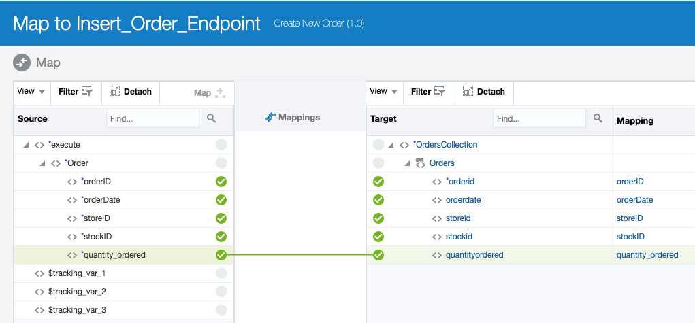

      Figure 29: Data Mapper

      - Click the *Validate* button in the upper-right corner of the mapper
    and look for the “Mapping is valid and ready to use” message in the
    upper-left corner.

      - Click the *Close* button in the upper-right corner to close the data
    mapper. The modeling canvas window redisplays.

    - Click *Save* in the upper-right corner of the editing canvas window.

### Configure Integration Tracking
46. Notice the *red 1 icon* at the top right of the canvas indicating that we aren’t done yet. Let’s explore the error:

    - Click on the *red 1 icon* to display the *Errors* panel.

    - Carefully hover the mouse over the icon to learn the details:

      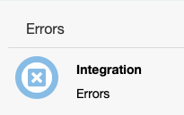

      Figure 30: Errors Alert

    - You learn that we haven’t supplied the fields that we want to
    display in the tracking facility. Tracking can help us troubleshoot
    our integration when something goes wrong at runtime, so the tooling makes tracking a mandatory requirement.

    - Click the *hamburger menu* (highlighted below) right below the Save button:

      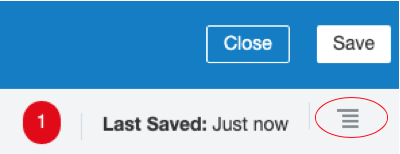

      Figure 31: Hamburger Menu Icon

    - Select the *Tracking* option in the popup menu to display the
    *Business Identifiers For Tracking* dialog.

    - Click the *orderID* field and drag it from the left source panel to the *Tracking Field* cell in the first row of the tracking table at
    the right. **NOTE:** If you have trouble dragging the *orderID* field,
    select it, select the top row in the table and then click the
    arrowhead icon at the bottom of the dialog:

      

      Figure 32: Specifying a Tracking Field for an Integration

    - Click *Save* in the lower-right corner to record your selection and to close the dialog.

    - Click *Save* in the upper-right corner of the editing canvas page.

    - Our Create New Order integration is now complete:

      

      Figure 33: Completed Integration

    - Click *Close* in the upper-right corner to exit the integration
    editor canvas window. The Integrations page redisplays and shows
    your new *Create New Order* integration at the top.

## Activate an Integration

Our last step in this lab is to activate our integration.

47. Toggle the toggle switch icon *On* to the right of your integration by clicking on it.  The *Activate Integration* dialog appears:

    

    Figure 34: Toggle Switch to Activate an Integration

48. Select these options in the Activate Integration dialog that
    appears:

    - Enable tracing: Click the check box to *On*

    - Include payload: Click the check box to *On*

      

      Figure 35: Activating an Integration

    - Click the *Activate* button in the lower-right corner. 

49. When the Activate Integration dialog closes, verify that the
    integration has been activated:

    - Refresh your browser window.

    - See that the green toggle icon indicates that your integration has
    been activated and is ready for use. Keep refreshing if the green
    toggle doesn’t appear.

      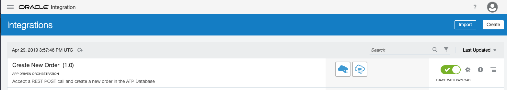

      Figure 36: Feedback that an Integration Has Been Activated

Congratulations\! This completes Lab 1. Your Create New Order
integration is ready for use in Lab 2. Move right on into Lab 2 to build
your process automation application.

# Lab 2 Building a Process Automation Application

In this lab, you use the Process component of Oracle Integration to
build a process automation application that Mama Maggy’s store managers
will use to enter their order requests. Regional managers will use the
application to evaluate order requests and, if the requests are
approved, orders will be created in the backend system. For our lab, the
backend system will be an ATP database instead of a SaaS application.
The orders will be created in the database using the integration that
you built in Lab 1.

## Key Features and Functionality

  - Model a new process application containing a process that:
    
      - Accepts order requests entered in a web form by store managers
    
      - Supports evaluation of the requests in a web form by regional
        managers
    
      - Routes rejected requests back to the initiator (store
        manager) for rework in a web form
    
      - Transforms approved requests into orders and inserts them into
        the database.

  - Use several human tasks with associated web forms that allow the
    store managers and regional managers to process order request
    information.

  - Initiate your integration (from Lab 1) from the process model to add a
    new order to the ATP database.

  - Test the application by assuming the roles of store manager and
    regional manager to exercise a typical scenario.

  - Verify that an order is inserted into the database for each approved
    order request.

Again, revisit the technical architecture, displayed below, to review the big picture.  Focus on the *OIC Process* element this time.  In the process automation application we are about to build, we will make a RESTful API call to your Lab 1 integration.  This will bring the two adapters into action and will result in a new order being added to *Oracle Autonomous Transaction Processing*:


 Figure 37: Technical View of the Solution

Let's keep going. Again, follow the steps and ask questions if you get confused:

1.  Start fresh by clearing your Chrome browser cache (all browsing
    data). If you need help, refer to the *Preparing Your Environment*
    section for the steps. This will help avoid some potential
    frustrations along the way when the Oracle Cloud and the browser
    seem to get “confused.”

2.  Refresh your browser window. Due to clearing the browser cache, you
    may lose your connection to the Oracle Cloud. Browse to the 
    *Oracle Integration Home Page URL* you noted in your *MyLabNotes* file 
    to access your Integration instance.  You may have to sign in again.  **NOTE:** If you are an Oracle employee, check the *Sign In Type* you recorded in your scratchpad in the *Prerequisites* section to determime if you need to *Sign in with Oracle SSO*.

4.  On the *Integration Home Page*, select the *Processes* menu option
    at the left:

    

    Figure 38: Integration Home Page

5.  Click the *Process Applications* menu option at the left to display
    the *Process Applications* page which lists all applications that have been created in your Oracle Integration instance.

## Create a Process Application

We want to quickly start modeling our business process, but a process
needs to be part of a process application. Let’s create one:

6.  Create a new process application based upon an available style.
    Click on the *Create* button in the upper-right corner to display
    the *Create Process Applications* page:

    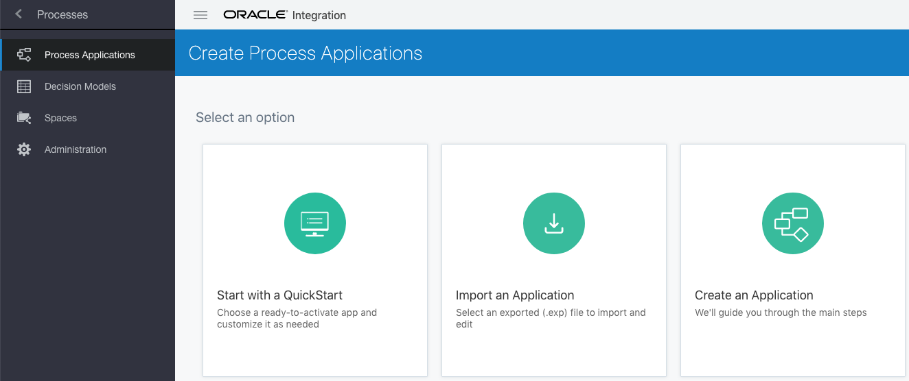

    Figure 39: Create Process Applications Page

    - Click on the *Create an Application* icon at the right to display
    the *Create an Application* prompt.

    -  Fill in the basic information for your new process application:
    
        - Name: *\<insertYourInitialsHere\><insertCurrentTimeHere\>\_Order Request Processing*
        (*TNB2139\_Order Request Processing*, for example)
    
        - *Space: [New Space]*  
        A space is an area that you can use to group applications together.  All users who are members of a space will have access to the applications in that space.  By granting access to a space, you can share with other members in a entire team.

        - New Space: *\<insertYourInitialsHere\><insertCurrentTimeHere\>\_Space* (*TNB2139\_Space*, for example)
    
        - Description: *Workflow management application to process order
        requests*

        - Make sure that the *Open Immediately* field is checked on so the tooling will take us right into process creation after the process application has been created.   


        - Click the *Create* button at the left:

          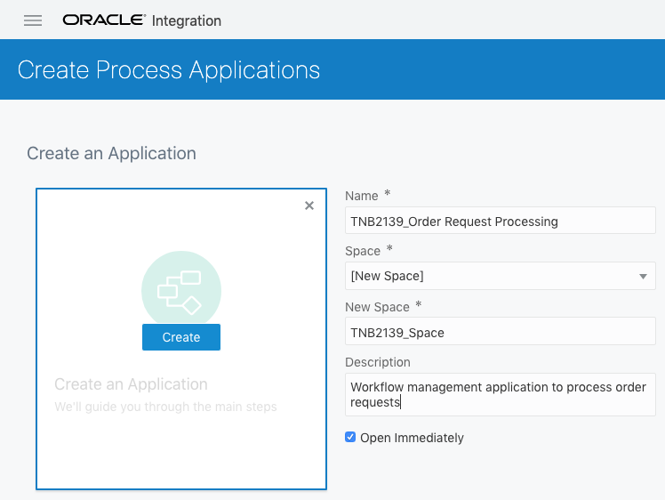

          Figure 40: Creating a New Process Application

    - Wait a moment and the *Create a Process* panel appears:

      

      Figure 41: Creating a New Process for a New Application

## Add a Process

7.  Add a new process that will contain the business logic to automate
    order request processing:

    - Select the *Form Approval Pattern* at the right so that we don’t
    start with a blank model. Just as the Integration tooling had *styles*
    to preconfigure artifacts and save you time, the Process tooling has
    *patterns*. The Form Approval pattern fits our needs well. The *Create
    Process* dialog appears.

    - In the Create Process dialog, fill in the fields:

      - Name: *Request Evaluation*

      - Description: *Process model that defines the submission and
    evaluation of order requests and creation of orders*

      - For *Document-Only*, leave the default (unchecked) as is.

      - With *Form Approval Pattern* selected at the right, click the *Create*
    button in the lower-right corner to create the new process:

        

        Figure 42: Creating a New Process

      - The process model displays containing elements from the *Form
    Approval* pattern. This minimizes the amount of dragging
    and dropping you need to do to place elements from the palette onto
    the modelling canvas.  **NOTE:** Your screen may show a more colorful process model, but the functionality is just the same.

        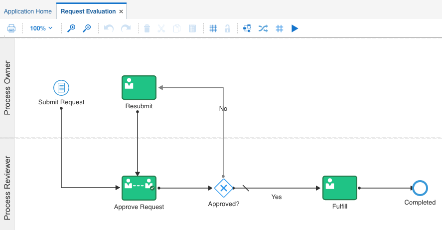

        Figure 43: Form Approval Pattern

8.  Remove the *Fulfill* human activity from the model by clicking on it
    and selecting the *trash can icon*. If nothing happens when you click the trash can icon, click on another element and then try again.  Later, in place of the *Fulfill* human activity, we will include an invocation of your *Create New Order* integration from Lab 1:

    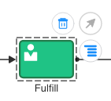

    Figure 44: Finding the Trash Can Icon

9.  Click *Save* to safely store away your new process.

10. Here is the starting point for our initial model implementation
    efforts:

    

    Figure 45: Starting Point for Our Process Modeling

## Tailor Roles for Each Process Swimlane

11. Tailor the roles to correspond to our Mama Maggy use case. The
    default roles for this pattern are *Process Owner* and *Process
    Reviewer*. They form two horizontal “swimlanes” across the model. The
    activities in the model that are in a particular swimlane can be
    executed by members of the associated role. We’ll rename the roles
    to *Store Manager* and *Regional Manager* now so that they match our
    Mama Maggy use case. Later, before testing, we’ll associate you with
    each of these roles.

    - Turn your attention now to the left side of the process model to find the roles for each swimlane.

    - Click on the *Process Owner* label at the left in the top swimlane.

    - Click on the *Edit* (pencil) option that appears.

    - In the bottom panel, click on the *plus icon* to the right of the *Role*
    dropdown menu to add a new role.

    - In the *Create Role* popup dialog, enter *Store Manager* as the role
    name and click the *OK* button.

    - Repeat the above steps for the *Process Reviewer* swimlane to create a
    new role called *Regional Manager*.


12. Your new roles, displayed at the left, now properly identify the
    swimlanes. Store Managers can execute Submit Request and Resubmit
    while Regional Managers can execute Approve Request:

    

    Figure 46: Process Model with Updated Swimlane Roles

13. Click the *Save* button to safely store away your updates. 

## Implement the Submit Request Event

14. Let’s work on the *Submit Request* start event so the store manager
    can initiate a new order request:

    - Click on the *Submit Request* event at the left-side of the model.

    - Click the *hamburger menu icon* that appears. If a popup menu doesn’t
    appear, click another element (like the Resubmit activity) to reset
    the selection and try clicking on the hamburger icon again to
    display the popup menu:

      

      Figure 47: Hamburger Menu Icon

    - Select the *Open Properties* option in the popup menu. The
    properties display in the lower panel:

      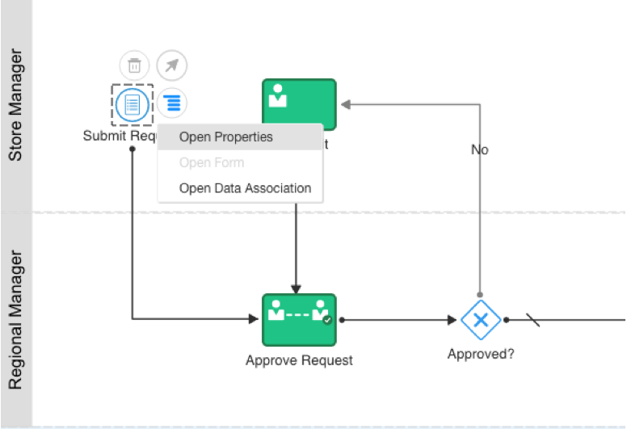

      Figure 48: Accessing the Properties Panel

    - Provide the basic properties for the Submit Request event by filling
    in these fields:
    
      - How will the end user identify the process? Title:
        *\<insertYourInitialsHere\><insertCurrentTimeHere\>\_Create New Order Request*
        (*TNB2219\_Create New Order Request*, for example)
    
      - Description: *Event that starts a new process instance and captures order request information from the store manager*


15. Create the form for the store managers to use to submit a new order
    request. Due to the type of human activity, the form will
    automatically display a *SUBMIT* button at runtime:

    - In the *Form* area of the properties panel, click the *plus sign icon*
    and click the *New Web Form* option:

      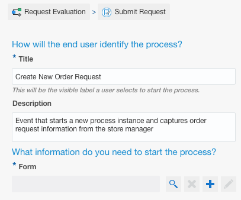

      Figure 49: Property Panel

    - The *Create New Web Form* dialog appears. Fill in the fields:
    
        - Name: *InitiateForm*
    
        - Description: *Form that a store manager uses to enter a new
        order request*

          

          Figure 50: Creating a New Web Form
    
        - Click *Create* to establish the new form. Notice that the new
        form name appears in the *Form* field in the properties panel.

    - Define the layout of the Initiate Form:
    
      - Click on the *Edit* (pencil) icon to the right of *InitiateForm*
        in the properties panel to display the form editor.
    
      - Notice the palette at the right containing the elements that you can
        add to a web form:

        

        Figure 51: Form Editor Palette

    - Drag an *Input text* element from the palette and drop it on the
    canvas in the middle of the form editor page.

    - Click on your new *InputText* element and see the *Properties* panel
    at the left showing its definition details:

        

        Figure 52: Form Editor's Properties Panel

    -   In the *Properties* panel, edit the properties for this field element.
    Press *Return* after each entry:
    
        - Name: *orderID* (This is the internal field name.)
    
        - Label: *Order ID* (This is how the field will be labelled for
        the end user.)

        

        Figure 53: Form Editor's Property Panel Highlighting the Binding Object

        - Notice that a *Binding* object has been identified where data will be stored for the form element. It is also named *orderID*. Binding objects are data structures that store values that users enter into a web form field. You will deal with these objects as you do data associations later.

    - Using the steps above, add the other elements to the form:

      | **Palette Element Type** | **Name**            | **Label**            |
      | ------------------------ | ------------------- | -------------------- |
      | Date                     | *orderDate*         | *Order Date*         |
      | Number                   | *storeID*           | *Store ID*           |
      | Number                   | *stockID*           | *Stock ID*           |
      | Number                   | *quantityToOrder*   | *Quantity to Order*  |
      | Money                    | *estimatedCost*     | *Estimated Cost*     |
      | Text Area                | *initiatorComments* | *Initiator Comments* |

      Table 1: Additional Fields for the Initiate Form

      

        Figure 54: Completed Form in the Form Editor

    - Click the *Save* button in the upper-right corner of the form editor
    page.

      *Tip*: Before you leave for *Form Designer,* click on the *Preview* button at the top.  In the *Preview* window that appears, you can explore exactly how your form will display on a variety of different sized devices.  When done exploring, click the *X* in the upper-right corner to exit the *Preview* window.

16. Turn your attention back to your process model by clicking on the
    *Request Evaluation* tab at the upper-left:

      

      Figure 55: Finding the Tabs to Access Tabbed Panels

## Implement the Approve Request Activity

18. Let’s work on the Approve Request human activity so the regional
    manager can evaluate an order request:

    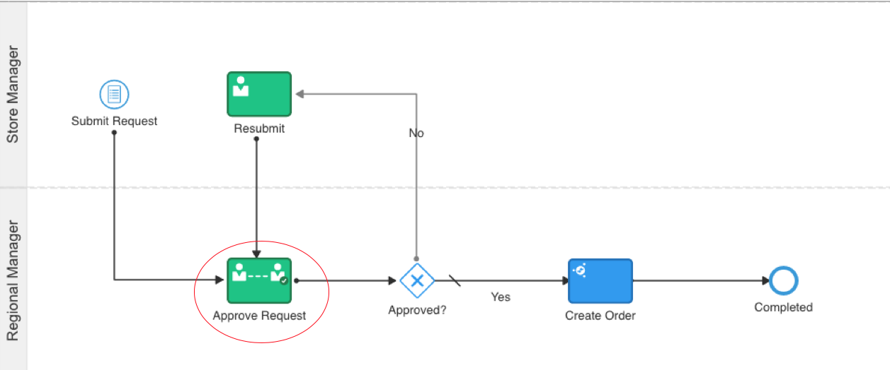

       Figure 56: Approve Request Human Activity

    
19. For each order request, they
    will either approve it or reject it. Due to the type of human
    activity, the form will automatically display APPROVE and REJECT
    buttons at runtime:

      - Click on the *Approve Request* human activity at the left-side of the process
    model.

      - Click the hamburger icon that appears. If a popup menu doesn’t
    appear, click another element (like the Resubmit activity) to reset
    the selection and try clicking on the hamburger icon again to
    display the popup menu.

      - Select the *Open Properties* option in the popup menu. The properties display in the lower panel.

      - In the *Title* field at the right, enter *Order Request Needing Evaluation*.  This will make the task clear to the Regional Manager when it is dispatched to them.

      - In the associated *Task Summary* field, enter *This is an order request from a store manager that needs evaluation.* 

      - Let’s create the form. In the Form area of the properties panel,
    click the *plus sign icon* and click *New Web Form* in the popup
    menu.

      - The *Create New Web Form* dialog appears. Fill in the fields:
    
          - Name: *EvaluateForm*
    
          - Description: *Form that a regional manager uses to either
        approve or reject an order request that has been initiated by a
        store manager*
    
          - Click *Create* to establish the new form. Notice that new form
        name appears in the Form field in the properties panel.

    -   Define the layout of the Evaluate Form:
    
        - Click on the *Edit* (pencil) icon to the right of *EvaluateForm*
        in the properties panel to display the form editor.
    
        - By performing the steps that you used earlier, add these elements
        to the form:

          | **Palette Element Type** | **Name**            | **Label**            |
          | ------------------------ | ------------------- | -------------------- |
          | Input Text               | *orderID*           | *Order ID*         |
          | Date                     | *orderDate*         | *Order Date*         |
          | Number                   | *storeID*           | *Store ID*           |
          | Number                   | *stockID*           | *Stock ID*           |
          | Number                   | *quantityToOrder*   | *Quantity to Order*  |
          | Money                    | *estimatedCost*     | *Estimated Cost*     |
          | Text Area                | *initiatorComments* | *Initiator Comments* |
          | Text Area                | *evaluatorComments* | *Evaluator Comments* |

           Table 2: Form Fields for the Evaluate Form

    - We don’t want the regional managers to be able to change the
    comments entered by the store manager, so we need to disable update
    for the *initiatorComments* text area on this form:
    
        - Click the *Initiator Comments* element.
    
        - Scroll the properties list to find the *Disabled* option and
        click it *On*.  The field data entry area is turns gray.
    
        - Click the *Save* button in the upper-right corner of the form
        editor page.

19.  Turn your attention back to your process model again by clicking on
    the *Request Evaluation* tab at the upper-left.

## Implement the Resubmit Activity

21. Let’s work on the Resubmit human activity next:

    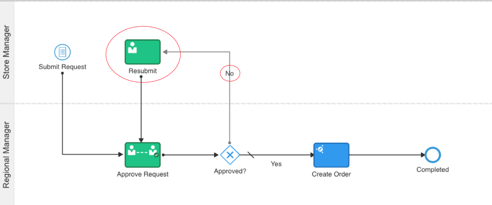

    Figure 57: Resubmit Human Activity

21. Recall that the Resubmit human activity allows the store manager to review a rejected request, edit it and resubmit it:

    - Click on the *Resubmit* activity in the process model.

    - Click the *hamburger icon* that appears. Again, if a popup menu
    doesn’t appear, click another element (like the Approve Request
    activity) to reset the selection and try clicking on the hamburger
    icon again to display the popup menu.

    - Select the *Open Properties* option in the popup menu. The
    properties display in the lower panel.

    - In the *Title* field at the right, enter *Order Request Needing Reconsideration*.  This will make the task clear to the Store Manager when the task is dispatched to them.

    - In the associated *Task Summary* field, enter *This is an order request that has been evaluated by a regional manager.  It needs additional justification.* 

    - Create the form for the store managers to use to edit an order
    request and resubmit it for re-evaluation:

      - In the Form area of the properties panel, click the *plus sign icon*
    and click *New Web Form*.

      - The Create New Web Form dialog appears. Fill in the fields:
    
          - Name: *ResubmitForm*
    
          - Description: *Form that a store manager uses to change an order
        request and resubmit it for reevaluation by a regional manager*
    
          - Click *Create* to establish the new form. Notice that new form
        name appears in the *Form* field in the properties panel.

    - Define the layout of the Resubmit Form:
    
      - Click on the *Edit* (pencil) icon to the right of *ResubmitForm*
        in the properties panel to display the form editor.
    
      - By performing the steps that you used earlier, add these
        elements to the form:

        | **Palette Element Type** | **Name**            | **Label**            |
        | ------------------------ | ------------------- | -------------------- |
        | Input Text               | *orderID*           | *Order ID*           |
        | Date                     | *orderDate*         | *Order Date*         |
        | Number                   | *storeID*           | *Store ID*           |
        | Number                   | *stockID*           | *Stock ID*           |
        | Number                   | *quantityToOrder*   | *Quantity to Order*  |
        | Money                    | *estimatedCost*     | *Estimated Cost*     |
        | Text Area                | *initiatorComments* | *Initiator Comments* |
        | Text Area                | *evaluatorComments* | *Evaluator Comments* |

        Table 3: Form Fields for the Resubmit Form

    - We don’t want the store managers to be able to change the comments
    from the regional manager evaluator, so we need to disable update
    for the evaluatorComments text area:
    
      - Click the *Evaluator Comments* element.
    
      - Scroll the properties list to find the *Disabled* option and
        click it *On*.  The field is grayed out.

    - Click the *Save* button in the upper-right corner of the form editor
    page.

21.  Turn your attention back to your process model by clicking on the
    *Request Evaluation* tab at the upper-left:

      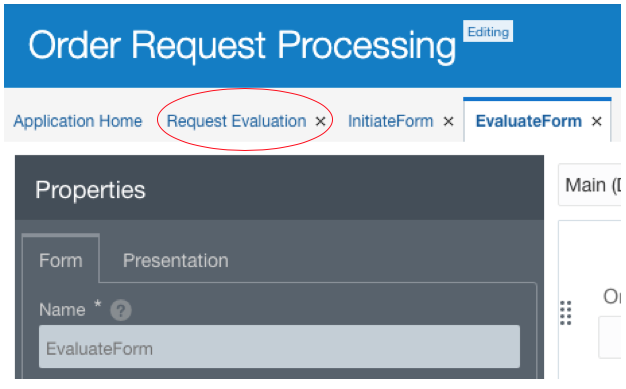

      Figure 58: Using the Tabs to Switch Panels

## Perform Data Associations

Form data needs to be passed along from form to form as the process
moves from activity to activity. To do this, we need to configure the data associations for each of our form-related activities:

23.  Configure data associations for the Submit Request start event:

      - Click on the *Submit Request* start event at the left side of the
    model.

      - Click the *hamburger menu icon* that appears. If a popup menu doesn’t
    appear, click another element (like the Approve Request activity) to
    reset the selection and try clicking on the hamburger icon again to
    display the popup menu.

      - Select the *Open Data Association* option in the popup menu. The data
    mapper displays.

      - Notice in the upper-left that we are mapping *Output* associations
    since no data is coming into the Submit Request start event. This
    start event simply creates a new instance of our process and
    starts execution of the elements in it.
       
    

      - Expand the *formArg* data structure in the source panel (left-side)
    to expose all the data that our *InitiateForm* captures from the
    store manager:

        

        Figure 59: Source Fields in the Data Mapper

      - Notice that one mapping is already done for you.  All the data from the *InitiateForm*, shown under *formArg* is already mapped to the underlying data object *(InitiateFormDataObject)* so it is saved for later use.  That "later user" will come very soon.  Read on.

      - We want to pass the store manager’s data entry along to the *Approve
    Request* activity for the regional manager to evaluate. This means
    mapping individual fields in the *formArg* data object underlying
    *InitiateForm* to the corresponding fields in the
    *evaluateFormDataObject* that underlies your *EvaluateForm*. So,
    expand the *RequestEvaluation* data structure in the target panel (right-side) to expose all the data that your *EvaluateForm* needs from the
    *InitiateForm*:

        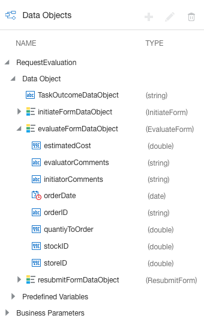

        Figure 60: Target Fields in the Data Mapper

      - By dragging and dropping fields from *formArg* (on the left) to the
    *evaluateFormDataObject* (on the right), map the matching fields so
    data transfer occurs at runtime. **NOTE:** Leave the automatic *formArg* to *initiateFormDataObject* mapping alone.  As you map new rows below it, be careful since the fields may be in a different order on the source side than on
    the target side:

        

        Figure 61: Mapping in the Data Mapper

      - When mapping is complete, click the *Apply* button in the
    upper-right corner to return to the Request Evaluation model.

24.  Click the *Save* button in the upper-right corner.

25.  Configure data associations for the *Approve Request* human activity:

      - Click on the *ApproveRequest* activity at the left side of the
    model.

      - Click the *hamburger icon* that appears. If a popup menu doesn’t
    appear, click another element (like the Submit Request activity) to
    reset the selection and try clicking on the hamburger icon again to
    display the popup menu.

      - Select the *Open Data Association* option in the popup menu. The
    data mapper displays.

      - Notice in the upper-left that we have *Input* and *Output* areas to map.
    Make sure that *Input* is selected:

        

        Figure 62: Selecting Input Mapping Mode in the Data Mapper

      - For *Input* into our *Approve Request* activity, there is good news\!
    You don’t have to do any mapping. Recall that in the *Output* data
    association for the Submit Request start event, you mapped data into
    evaluateFormDataObject that is used to populate fields for the
    EvaluateForm used here in *Approve Request*. So, all that must be
    mapped is to map the *evaluateFormDataObject* data structure into
    *evaluateForm* so that the data will be displayed on the form.
    Notice that the tooling assumed that and has done it for you:

        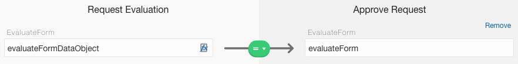

        Figure 63: Mapping the Underling Data Object to the Form

       - With the *Input* mapping in place for Approve Request, click on
    *Output* in the upper-left corner to perform the output data
    mappings.

      - We have more good news\! The tooling has already established all the
    output mappings we need. First, notice that the *outcome* of the
    evaluation (*APPROVE* or *REJECT* (based on the button that the regional
    manager clicks)) is placed in the *TaskOutcomeDataObject* where we can
    access it later for the conditional branching configuration at the
    *Approve?* exclusive gateway. Second, see that the form display
    fields (*evaluateForm* data structure) are already mapped into the
    underlying *evaluateFormDataObject* so they will be available to
    other activities in the model:

        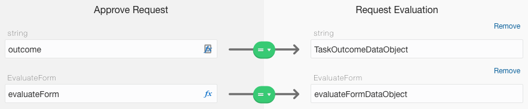

        Figure 64: Mapping Outcome and Form Fields

      - With the *Input* and *Output* mappings in place for *Approve Request*,
    click on the *Cancel* option in the upper-right corner to return to
    the Request Evaluation model. The *Apply* button isn’t available since
    we didn’t make any changes. The tooling had already done all the
    input and output mappings automatically.

26.  Click *Save* in the upper-right corner.  It's just a good habit to get into.

27.  Configure data associations for the *Resubmit* human activity:

      - Click on the *Resubmit* activity in the model.

      - Click the *hamburger icon* that appears. Again, if a popup menu
    doesn’t appear, click another element (like the Approve Request
    activity) to reset the selection and try clicking on the hamburger
    icon again to display the popup menu.

      - Select the *Open Data Association* option in the popup menu. The
    data mapper displays.

      - Make sure that the *Input* mappings are shown by noting, in the
    upper-left corner, that *Input* is underlined.

      - Look at the one mapping that the tooling has already made for us:

        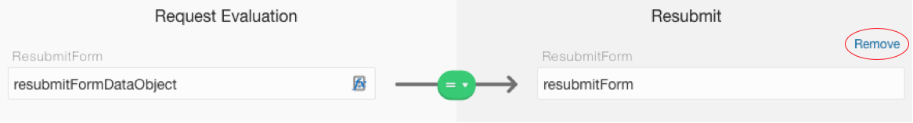

        Figure 65: Mapping an Underlying Data Object to its Form

        This may be a good guess, but in our scenario, we want to instead map
the data from the regional manager’s evaluation, stored in the
*EvaluateFormDataObject*, to the individual fields in the *ResubmitForm*
so the store manager can see the feedback and act upon it. Remove the
mapping created by the tooling by clicking the *Remove* option in the
upper-right corner.

      - Expand the data structure in the target panel (on the right) to
    expose all the data that your *ResubmitForm* captures:

        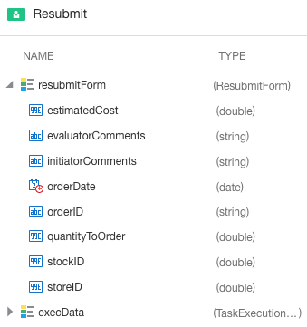

        Figure 66: Target Fields During Data Mapping

      - Expand the data structure in the source panel (on the left) to expose all the data that the *evaluateFormDataObject* can supply.

      - By dragging and dropping fields from the *evaluateFormDataObject*
    (on the left) to the fields in *resubmitForm* (on the right), map
    the corresponding fields so data transfer occurs at runtime. 
      - **NOTES:** 
        - Just reuse the fields for the *resubmitFormDataObject* --> *resubmitForm* mapping that the tooling did for you.
        -   Be careful as you map since the fields may be in different order on
    the source side than on the target side.

        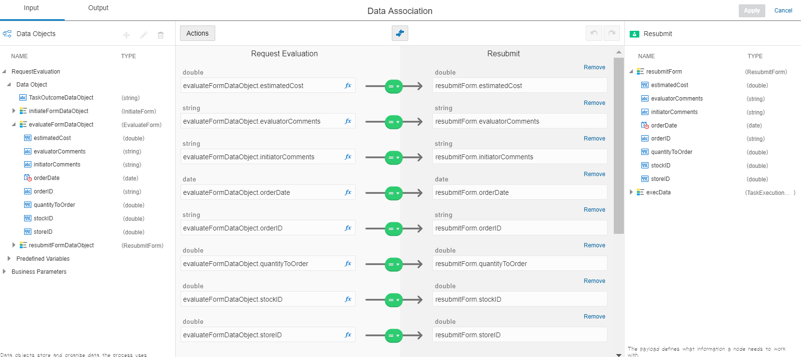

        Figure 67: Mapping Fields in the Data Mapper

      - When done mapping the *Input* fields, DON'T click *Apply*.  

      -  Turn your attention to the *Output* mappings for the *Resubmit*
    activity by clicking on *Output* in the upper-left corner.

      - Review what automatic mappings have been added by the tooling:

        

        Figure 68: Mapping in the Data Mapper

        These look reasonable. First, we typically want to map the *outcome*
        (the user clicking the *SUBMIT* button) to the *TaskOutcomeDataObject*
        as we saw earlier. However, we won’t be using it in our model since
        branching in our model is only conditioned on the *outcome* from the
        *Evaluate Request* activity. Second, we see the standard mapping of
        the values of the display form fields (*resubmitForm*) to the
        underlying data structure (*resubmitFormDataObject*).

      - The automatic output mappings we just saw are just fine and we’ll
    leave them, but we need to add some additional mappings to get the
    data positioned so it can be displayed in the Approve Request human
    activity. This will allow the regional manager to re-evaluate the
    resubmitted order request sent from the *Resubmit* activity. So,
    expand the data structure in the target panel (on the right side)
    to expose all the data that your *EvaluateForm* captures:

        

        Figure 69: Data Mapper Displaying Underlying Data object for the
Evaluate Form

      - Expand the *resubmitForm* data structure in the source panel (at the left side).
      
      - By dragging and dropping fields from the *resubmitForm* (on the
    left) to the fields in *evaluateFormDataObject* (on the right), map
    the corresponding fields so data transfer occurs at runtime. 
        - **NOTES:** 
          - Leave the two rows of automatic mappings in place.  Don't overlay them.
          -   Be careful as you map since the fields may be in different order on
    the source side than on the target side.
  

        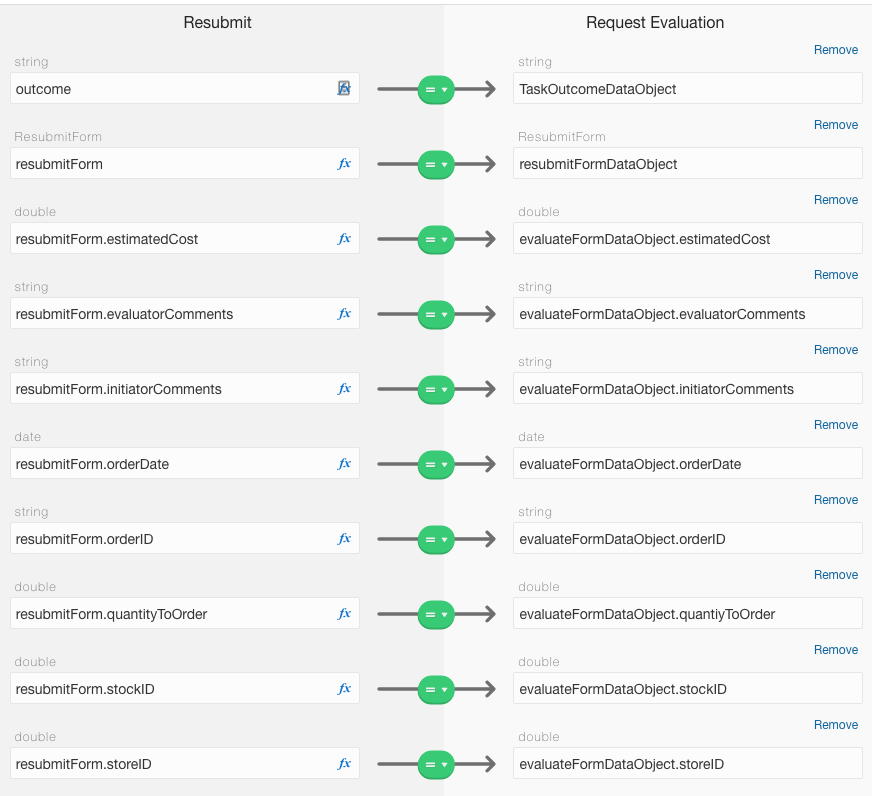

         Figure 70: Mapping Resubmit Form Fields to the Underlying Data Object
for the Evaluate Form

      - When mapping is complete, click the *Apply* button in the
    upper-right corner to return to the *Request Evaluation* model.

28. Click *Save* in the upper-right corner.

## Configure the Conditional Flow

29.  Let’s now condition the *No* branching flow at the *Approved?*
    exclusive gateway so that when a regional manager, working in the
    Approve Request activity, clicks the *REJECT* button for an order request, the request is
    routed to the *Resubmit* activity where the store manager can work on
    it and resubmit it. 
    
      - Click on *No* above the *Approved?* exclusive gateway element:

        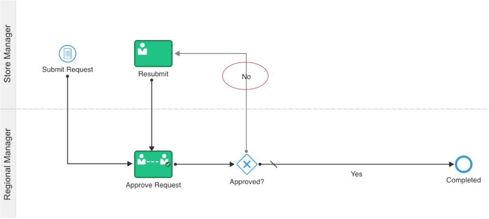

        Figure 71: Finding the No Branching Flow

      - Two icons popup in a menu, select the *Edit (pencil) icon* 
    so we can specify the condition to evaluate for this *No* path
    through your model:

        

        Figure 72: Editing the Condition for the No Branching Flow

      - A panel appears at the bottom of the page where you can begin
    specifying the branching condition. Find the *Edit* (pencil) icon in
    the *Condition* field and click on it to display the
    *Expression Editor* dialog.

      - Recall that our *Output* data association from the Approve Request
    activity included a mapping of the *outcome*.The outcome is set by
    the regional manager clicking either the *APPROVE* or the *REJECT*
    button.

        

        Figure 73: Form Outcome Button Press is Mapped to a Data Object

        It is the value of the *TaskOutcomeDataObject* that we will check
our condition to see if the order request should be routed along the
*No* path to the *Resubmit* activity:
 
        

        Figure 74: Process Model Highlighting the Flow to the Resubmit Activity

      - In the *Expression Editor*, expand the *RequestEvaluation* hierarchy
    to display its data objects:

         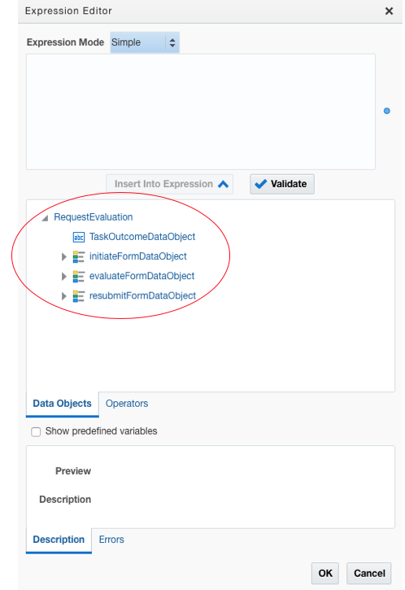

          Figure 75: Starting to Specify a Flow Condition in the Express Editor

      - Select the *TaskOutcomeDataObject* and then click the *Insert Into
    Expression* button to add it to the expression area.

      - Then, finish the expression by entering: **="REJECT"**
      
        **NOTE:** Make sure that the double quotes appear as *straight* (" ") rather than *curly* (“ ”). *Curly* double quotes will produce a validation error.  Copy and pasting from above may be the best approach.

        

        Figure 76: Completed Flow Condition in the Expression Editor

      - Click the *OK* button in the lower-right corner of the *Expression
    Editor* to close the dialog.

      - In the lower panel, find the *Description* field for the *No* branch
    and enter: *Route processing to Resubmit for an order request that
    was rejected by the regional manager*

30. Click *Save* in the upper-right corner of the window.


## Access an Integration from a Process Model

31. There is one more task we need to perform to complete the process
    model. Based on our initial Mama Maggy scenario, what didn’t get
    done yet? If you answered: *“We haven’t created an order in the
    backend system (ATP database),”* you are right. We need to add a call
    to the *Create New Order integration* that you built in Lab 1.  We need to add a *Create Order* activity that calls our *Create New Order* integration.  Here is how that *Create Order* activity *should* appear in the process model, so let's add it:

    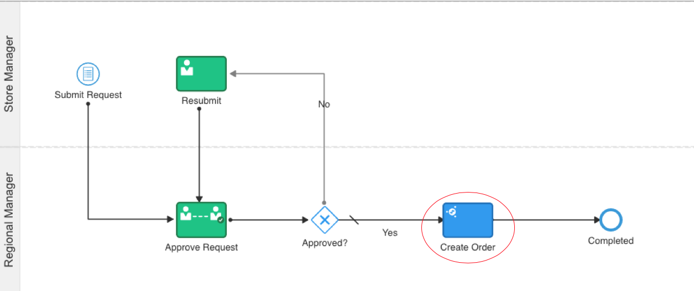

      Figure 77: Create Order Integration Activity
    
      - Start by redisplaying your *Application Home Page* by clicking
        on the *Application Home* tab, highlighted below, in the
        upper-left corner:

        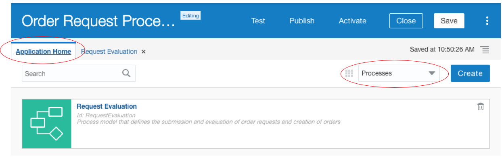

        Figure 78: Using the Tabs to Activate a Tabbed Panel

      - In the dropdown menu at the right-side, highlighted above, select
    the *Integrations* option. The *Integrations* display appears. Click
    the *Browse Integrations* button so you can find the integration you
    built and activated in Lab 1:

        

        Figure 79: Finding Integrations to Enable for a Process

      - The *Use an Integration* dialog appears. Select your *Create New
    Order* integration and click the *Create* button in the lower-right
    corner to create an integration artifact for your process
    application. The process modeling tooling requires this “linking
    artifact” to be created so you can add the integration to a process
    model:

        

        Figure 80: Enabling an Integration to a Process

      - The *CreateNewOrder* integration now appears in the list of
    integrations.

      - Click the *Request Evaluation* tab at the top to return to your
    modeling canvas.

      - Let’s now add our integration to the process model:
    
        - In the palette at the right, click on the *Integrations* option
        to display the list of integrations that can be added to the
        model.
    
        - Select your *CreateNewOrder* integration and drag it on top of
        the *Yes* flow in your model and *drop it there*. The *Create
        new order* integration activity appears in the model:

          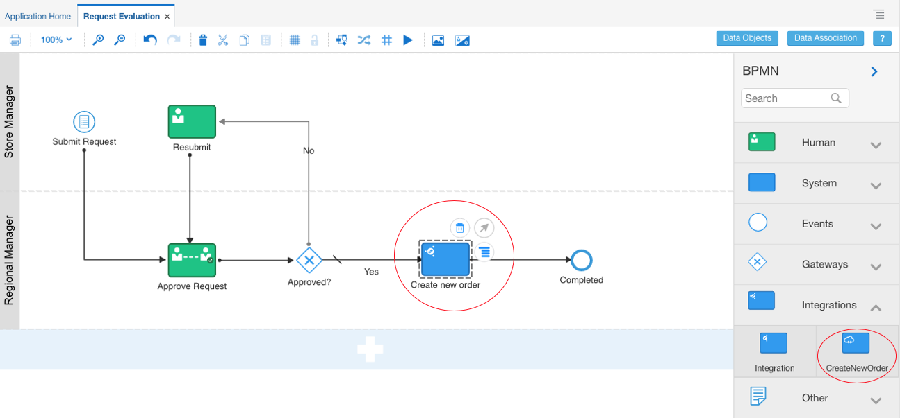

          Figure 81: Adding an Integration to a Process Model

      - Double-click the *Create new order* label to edit it. Replace that text
    with: *Create Order*.

      - Like we did for the other activities in the model, we need to use
    the data mapper to map the Input and Output fields for this integration so it has the data it needs to perform the database insert operation:

        -  Click on the new *Create Order* activity to view its popup menu.
    Click the *hamburger menu* option and select the *Open Data
    Association* option. The familiar data mapper appears. Notice that
    the *Input* mapping area is displayed by default.
    
        - On the source side (the left-side), under *RequestEvaluation*,
        expand the *Data Object / evaluateFormDataObject* hierarchy to
        see the data as it is displayed on the regional manager’s
        EvaluateForm.
    
        - On the target side (the right-side), expand the *body* to see
        the data fields that your *Create Order* integration expects.
    
        - Map the fields for the Input to the Create Order integration
        activity as shown below. 
        
          - **NOTES:** 
            - As you map, you will encounter some error messages that indicate type mismatches between the source field and the target field.  You will need to do some casting (data conversion). 
              - You’ll use the *string()* function
        to convert the *date* data type to *string*. 
              - The *int()* function is
        used to convert the *decimal* data to *integer*. 
             - To implement these
        functions, do the drag and drop mapping as you have done before
        and then click in the cells (highlighted below) to add the *int*
        and *string* function calls and to surround the data field with
        the *parentheses*. Press *Return* after you perform each edit.

          *Tip*: You can also click the small *fx* symbol to the right of a target field and perform you casting edits in the *Expression Editor* popup window.


          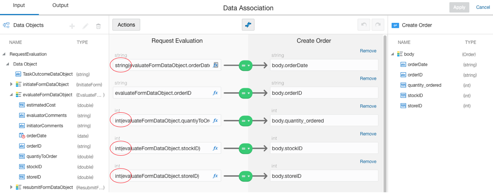

          Figure 82: Mapping Inputs into an Integration Activity

          Here is another easier to read image showing just the mapping cells:
 
          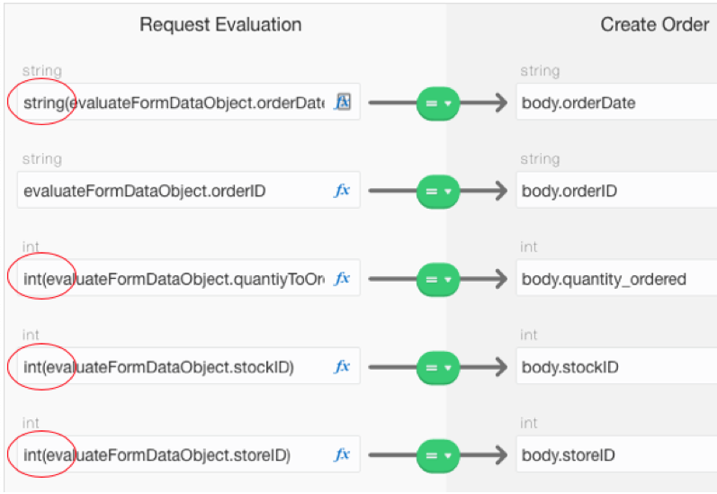

          Figure 83: Mapping Inputs into an Integration Activity

      - With the *Input* mapping completed, now click the *Output* option in
    the upper-left to map the outputs generated by the *Create Order*
    integration activity. 
    
    - Map the single output field as shown below.
      - **NOTES:** 
        - Again notice that you’ll need to edit the mapping to implement the
    *string()* function to cast the *bodyOutput* to a string. The error message will go away after you press Return to record your edit.
        - We don’t
    use *bodyOutput* in our model, but the tooling requires us to map it
    anyway. We are just arbitrarily choosing the *TaskOutcomeDataObject*
    as the mapping target:

        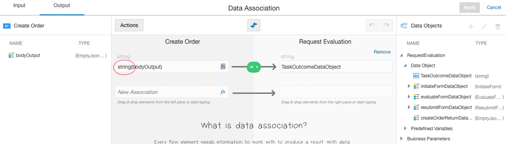

        Figure 84: Mapping Outputs from an Integration Activity

        Again, here is another easier to read image showing just the completed mapping:

        

        Figure 85: Mapping Outputs from an Integration Activity

      - With our mappings in place for both *Input* and *Output*, click *Apply*
    in the upper-right corner to save your mappings.


32. When the modeling canvas reappears, click *Save* in the upper-right
    corner.

## Validate an Application

We want to publish our application, but, before we do, let's validate it for errors:

41. Find the *hamburger menu* in the upper-right corner of the window and click on it.

42. Select the *Validate Application* option in the popup menu.

43. Hopefully, you see the *validation was successful* message.  If not, follow the error message and make the corresponding changes to your process model.  Then *Save* and validate again.  

## Publish an Application

Your application is finished so you can now publish it.  That gets us one step closer to being able to test it. 
    
44. Click the *Save* button just to be sure everything is saved away.

    

    Figure 86: Saving and Publishing a Process Application

42. Click the *Publish* button at the top of the window.

43. In the *Publish Application dialog* that pops up, enter an
    explanation in the Comments fields: *This version is the first
    publication of this process application.*
    
44. Click the *Publish* button in the lower-right corner.  **NOTE:** Your *Publish Application* may show a different list of unpublished changes:

      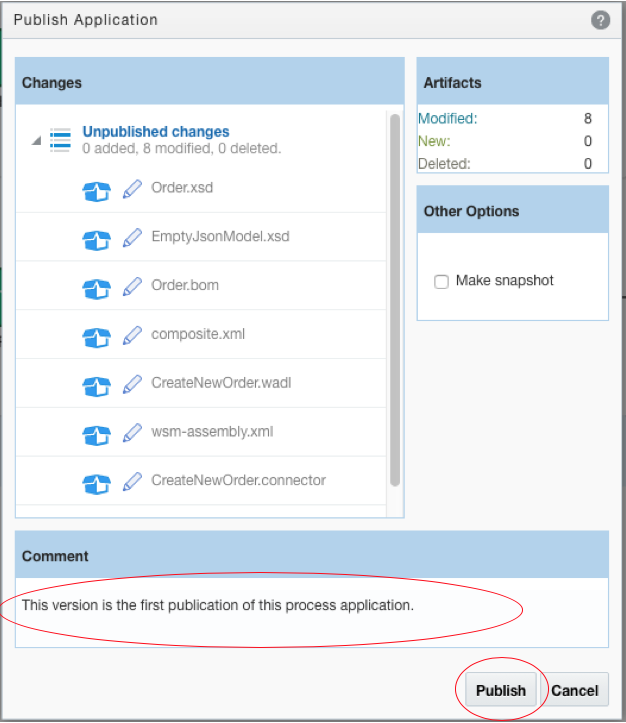

      Figure 87: Publishing a Process Application

45. There is no feedback when the publishing is done. However, wait
    about 15 seconds before proceeding.

## Activate an Application

After you publish, you need activate your process application so it is available for use:
    
46. Click on the *Activate* option at the top right of the window.
        The *Activation tab* appears and the associated panel is
        displayed. Click the *Activate new version* button.  **NOTE:** If this is the first time your have activated this application, your window may appear differently:

    

    Figure 88: Activating a Process Application

49. The *Activate Application to My Server* dialog appears indicating
    that you are about to publish the *Last Published* Version:

    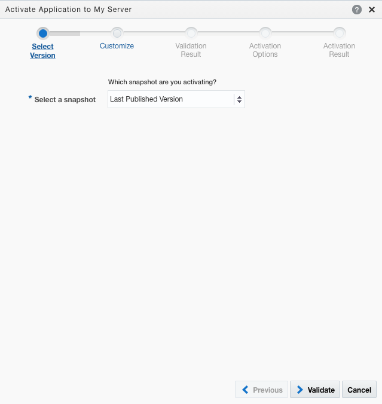

    Figure 89: Activating a Process Application

48. Click the *Validate* button in the lower-right corner.

49. In the *Validation Result* step, you see a green “*Application
    successfully validated*”  
    message. 
    
50. Click the *Options* button in the lower-right corner to
    move to the *Activation Options* step.

50. In the *Activation Options* fields make these entries/selections:
    
    - Revision id: *1.0*
    
    - Override: Click it *On*
    
    - Make Default: Click it *On*
    
    - Use Fault Policies: Leave it clicked *On*
    
    - Click the *Activate* button in the lower-right corner:

        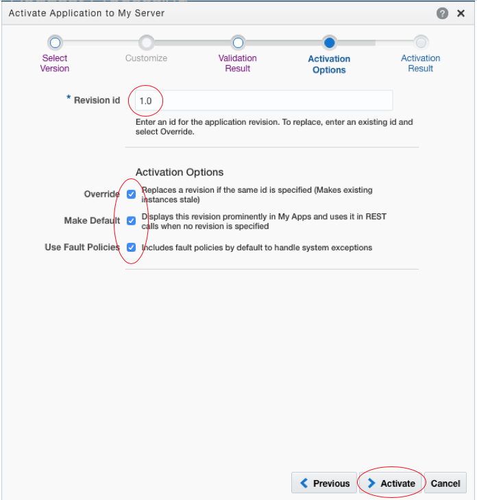

        Figure 90: Setting Activation Options

  51. In a moment, you will see the results appear in the Activation Result
    step. A green “*Application successfully activated\!*” message appears.

  52. Click the *Finish* button in the lower-right corner to continue:
  
      

        Figure 91: Setting Activation Options

  53. Click the *Save* button in the upper-right corner when it redisplays.

## Map Users to Swimlane Roles
We are getting very close to being able to test the application, but
    first we need to perform some user role management on the server for those
    swimlanes we configured earlier. At the extreme left of your
    model, remember the two roles that you named: *Store Manager* and *Regional
    Manager*? Recall that they form two rows across the model called
    swimlanes. The store manager can perform the activities in their
    swimlane (Submit Request and Resubmit) and the regional manager can
    perform their swimlane activities (Approve Request and Create
    Order). We need to assign you as a member of both roles so you can
    test all of these activities.

34. Navigate to the *Role Management* area to identify yourself as both a Store Manager and a Regional Manager:
        
    - Click the *House icon* at the top of the menu at the left.  If you don't see this icon, click on the *Home* menu option.
        
    - Click the *My Tasks* option on the menu at the left.
        
    - Click the *Workspace* option in the upper-right corner of the *My Tasks* *page*.
        
    - Click the *Administration* option on the menu at the left.

    - Click the *Manage Roles* option (it may already be preselected) on the menu at the left. The *Manage Roles* *page* appears listing all the roles in all the activated process applications. Find the two roles for your application:

      

       Figure 92: Finding the Roles for Your Process

    - Establish yourself as a *Regional Manager* for your process
 application:
    
      -  Click on *your* (with your initials and timestamp appended to the front) *Regional Manager* role at the left:

          

          Figure 93: Selecting a Role

    - Click the *Add Member* button at the right to display the *Search users, groups, roles* dialog:

      

        Figure 94: Adding a Member to a Role

    -  *Search* for your *first* or *last name*. When your row appears, click the *checkbox to the
    left* of it and then click the *OK* button in the lower-right
    corner:

        

        Figure 95: Adding a Member to a Role

    - When the right-side panel refreshes, you see that you have been
    added to the *Regional Manager* role. 
    
    - Click the *Save* option in the upper-right:

      

        Figure 96: Adding a Member to a Role

    - Now, add yourself to the *Store Manager* role for your process application:
    
      - Click on *your* *Store Manager* option at the left.
    
      - *Repeat the same steps* as you did above until you see that you
        are now a *Store Manager*:

        

          Figure 97: Adding a Member to a Role

34. Don’t forget to select *Save* to store the updates to the role definitions.


## Test an Application

Let’s now perform an end-to-end test of your application by assuming
    the *Store Manager* and *Regional Manager* roles. We’ll use the same
    *Workspace* interface that end users at Mama Maggy will use to
    initiate processes and accomplish tasks:
    
54. Start fresh by clearing your Chrome browser cache (all browsing
        data). If you need help, refer to the Preparing Your Environment
        section for the steps.
        
55. Due to clearing the browser cache, you may lose your connection to the Oracle Cloud. Browse to the 
    *Oracle Integration Home Page URL* you noted in your *MyLabNotes* file 
    to access your Integration instance.  You may have to sign in again.  **NOTE:** If you are an Oracle employee, check the *Sign In Type* you recorded in your scratchpad in the *Prerequisites* section to determime if you need to *Sign in with Oracle SSO*.
    
57. Browse to the *Oracle Integration Home Page URL* you noted in the *MyLabNotes* file to access your services.

### Initiate a Request as a Store Manager

56. Initiate your Order Request Processing application:
        
    - Click on the *My Tasks* option on the menu at the right to
            see the *Workspace* interface that store managers and regional
            managers will see at Mama Maggy.
        
    - Click the *Initiate Request* button in the upper-right
            corner to start the process as a store manager. 
            
    - If you are sharing an environment, you will likely see several processes that can be initiated.  Click on *your* *Create New Order Request* start event that appears in the lower panel:

      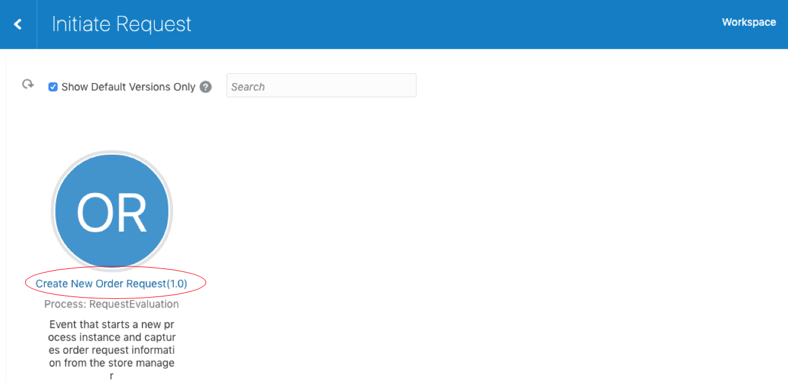

      Figure 98: Initiating a Process in the Workspace

    - Notice that your *InitiateRequest* form displays for the store
    manager to enter an order request.

    - Here is where we are at in our process model now that an instance of
    your Request Evaluation process has been created:

      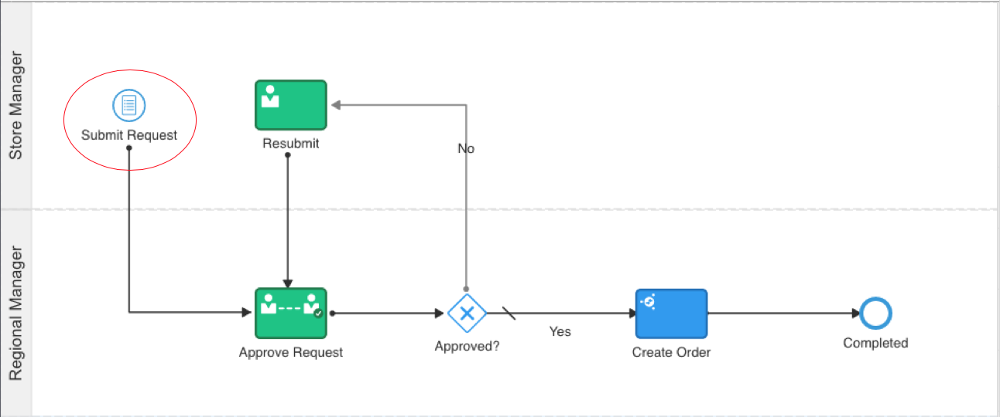

      Figure 99: Current State of the Process

    - Submit a new order request as a store manager by entering the values in the web form that has appeared:
    
      - Order ID: *\<insertYourInitialsHere\><insertCurrentTimeHere\>*

        NOTES:
        - The Order ID must be unique since *orderID* is the primary key of the ORDERS table in our ATP database.

        - The Order ID **must not exceed 8 characters in length** since that is the maximum length for the *orderID* column in the ORDERS table.
        
        - Your replacement for *\<insertYourInitialsHere\>* **must be *4 (or less)* characters** (*alpha or numeric*).

        - If it is 1:31 PM right now, use *1331* and if it is 9:38 AM, use *0938* for *\<insertCurrentTimeHere\>*. Your 4-character value combined with your *\<insertCurrentTimeHere\>* should provide a unique orderID.

        - For, example: *TNB1105* would probably be a valid *orderID*.
    
      - Order Date: Select *today’s date* by clicking on the *Select Date icon* at the right of the field and picking it from the popup calendar.
    
      - Store ID: *12*
    
      - Stock ID: *177*
    
      - Quantity to Order: *100*
    
      - Estimated Cost: *$170.00*
    
      - Initiator Comments: *I need this fast or my customers will be
        unhappy.*

        

        Figure 100: Completing a Task from a Web Form

    - Click the *Submit button* (highlighted above) in the upper-right
    corner of the form to move the process instance along its way in the
    process flow.  You are returned to the *Initiate Request* window. 

    - Here is where we are in the process now as the application is
    waiting for the regional manager at the Approve Request activity:

      

      Figure 101: Current State of the Process

### Work a Task As a Regional Manager

56. Recall that you also designed a form (*EvaluateForm*) for this
    Approve Request human activity. Use it now, as a regional manager,
    to reject the new order request:
    
      - Click the *Workspace* button in the upper-right corner of the
        *Initiate Request* page.
    
      - See that, since you are also in the Regional Manager role, a
        task appears for you in the *Workspace*:

        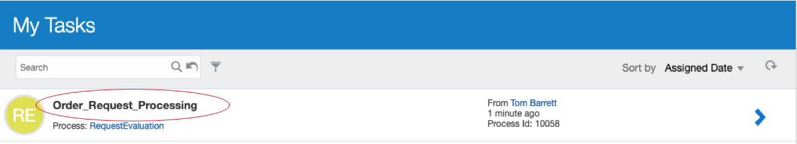

        Figure 102: Claiming a Task in the Workspace

    - Click on the task.

    - Your Evaluate Form appears with the store manager’s data already
    filled in thanks to the data associations that were mapped. Notice
    that the *Initiator Comments* field is greyed out now since you disabled
    it in the form designer to prevent the regional manager from modifying its contents.

    - In the *Evaluator Comments* field, enter the bad news: *Alice at Store
    \#19 across town has a huge inventory of this item. Go get some of
    her extras.*

      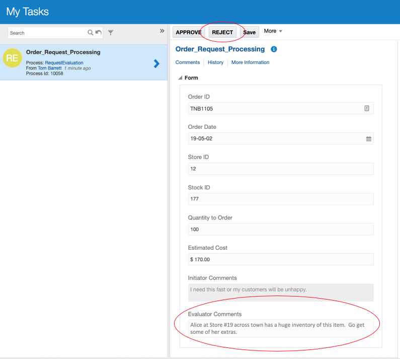

      Figure 103: Completing a Task from a Web Form

    - Click the *REJECT button* at the top of the form to send this order
    request back to the store manager who submitted it. Thanks to the
    data associations you performed, by clicking the REJECT button, the
    *TaskOutcomeDataObject* is set to *REJECT*.  

    - Let's review where we are in the process instance now. The execution passed through the *Approved*? exclusive gateway
    and the workflow engine noticed that your condition for the *No*
    branch evaluated to *true* (TaskOutcomeDataObject="REJECT"). So,
    the process instance followed the *No* flow. Your application is now
    waiting at the Resubmit activity for the store manager to revisit
    their order request:

      

      Figure 104: Current State of the Process

### Work a Task As a Store Manager

57. Put your store manager’s hat back on and review tasks that have been
    assigned to you in the Workspace by clicking on the *Refresh* icon (circular arrow)
    in the upper-right corner of the *My Tasks* window:

    

    Figure 105: Refreshing the Workspace

      - A task displays. That’s for the request that the regional manager
    just rejected. As a store manager, you have some work to do on it to
    plead your case. Click on the task.

    - The ResubmitForm you built for the Resubmit activity displays with
    the original store request data displayed along with the Evaluator
    Comments just supplied by the regional manager. Again, you are
    seeing data association mappings at work to populate these form
    fields. Notice this time that the *Evaluator Comments* are greyed
    out since you disabled this field  so the store manager
    can’t change them.

    - *Append the following comment* **to the end of the text** that already appears in
    the *Initiator Comments* field: *I checked with Alice. She doesn’t
    have any extras. I need this order to be place and fulfilled
    quickly.*

      

      Figure 106: Completing a Task from a Web Form

    - Click the *Submit* button (highlighted above) to send the request
    back to the regional manager that rejected it last time.

    - Here is where we are in the process now. The application is waiting
    at the Approve Request activity for the regional manager to pick up
    tasks in the workspace and move the process instance further in the
    flow:

      

      Figure 107: Current State of the Process

### Work Another Task As a Regional Manager

58. Put your regional manager’s hat back on and review tasks that have
    been assigned to you in the *Workspace* by clicking on the *Refresh
    icon* (circular arrow) in the upper-right corner of the *My Tasks* window:

    

    Figure 108: Refreshing the Workspace

    - A task displays. This involves re-evaluating the request
    resubmission from the store manager. Click on the task.

    - Thanks to your data associations, the form displays with all the fields prepopulated:

      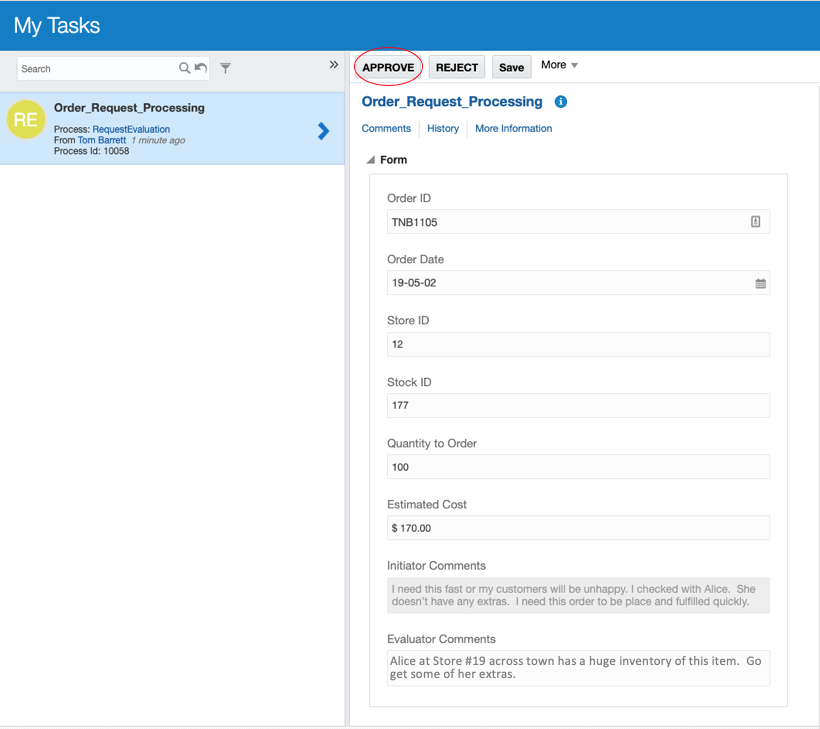
      
      Figure 109: Completing a Task from a Web Form

    - You read the additional *Initiator Comments* and sympathize with the
    store manager. There is no need to add anything to the *Evaluator
    Comments* since the additions to the *Initiator Comments* have convinced you
    that the order request is justified after all. So, just *click the
    APPROVE button* at the top of the form.

    - Again, click the *Refresh icon* in the upper-right corner of the My Tasks window
    to see that there are no new tasks in either role to process.

    - Here is where we are in the process now. The *Approve?* exclusive
    gateway took the default path since your *No* condition
    (TaskOutcomeDataObject="REJECT") evaluated to *false* because the
    regional manager clicked the APPROVE button this time. Execution
    proceeded to the *Create Order* integration activity where your Lab
    1 integration was executed to add a new order to the ORDERS table in the ATP database.
    Then, the process instance finished by reaching the *Completed* end
    event:

      
      Figure 110: Current State of the Process

### Check Tracking for an Integration

59. Let’s check to see if the new order really got created in the backend system (the ATP database). In other words, did your Create Order integration (from Lab 1) do its job?  Let's explore what we can learn from the *Tracking* facility:
        
      - Click on the *House icon* at the top of the menu at the left to reach the *Home* page.

      - Click on the *Integrations* option on the menu at the left.

      - At the top of the menu, find the *\<* symbol adjacent to the *Designer* title in the upper-left and click on the *\<* symbol.

      - Click on the *Monitoring* option in the menu at the left to display the *Monitoring* menu.

      - Click on the *Tracking* option in the menu at the left to display the *Tracking Instances* page.

      - Find your integration in the list and see that it has *Completed*.

          

          Figure 111: Tracking Integrations

### Check the Database Table

  60. The tracking evidence looks compelling so far. Now, let’s see if the row was
    really added to the ORDERS table.  Let's use Oracle SQL Developer to look into
    the ORDERS table in the ATP database:
    
        - Close your VPN connection if it is active.
    
        - Start *SQL Developer*.
    
        - *Double-click* on your *MyATPConnection* in the Connections
        panel at the left to open a connection to the database. The
        connection should open automatically if you saved the password
        with your connection. If you are prompted for your password
        enter it and proceed.
    
        - Expand the *Tables (Filtered)* hierarchy at the left.
        
        - Click on *ORDERS* to display your table in the panel at the right.
    
        - Click on the *Data* button at the top of the right-side panel
        and find your new order in the list of database rows. This
        verifies that the order has really been added to the ORDERS
        table in the ATP database by your CreateOrder integration:

          

          Figure 112: Displaying Rows in a Database Table

        - Gracefully exit SQL Developer:
    
          - *Right-click* on your *MyATPConnection* in the Connections panel
        at the left to display a popup menu.
    
          - Select the *Disconnect* option.
    
        - Exit SQL Developer.

This completes the lab exercises. Please review the Appendix material
to see what setup steps you need to perform after class so you
can do these lab exercises again in your own environment.

# Troubleshooting

Here is a list of problems and solutions that may help you throughout the labs:

- What if something just weird happens?
  - Try clearing the browser data and starting again.  If you need help, refer to the *Preparing Your Environment*
    section for the steps.

- What if my integration gets locked?
  - Something odd may happen with the browser or your connection to the Oracle Cloud. When you try to edit your integration, you see "*Edit is not possible for *your integration* because the integration is locked.  Integration is displayed in view mode.*"  To unlock your integration:
    - Close the integration editor window by clicking on the *Close* button in the upper-right corner.
    - Click on the *House* icon at the top of the menu to return to the *Integration Home* page.
    - Click in the *Integrations* menu option to display the *Integrations* page.
    - Find your locked integration in the list and click on the *hamburger* menu at the far right.  A popup menu displays.
    - Click the *Unlock* option.  The *Unlock Integration?* popup dialog displays.
    - Click the *Unlock* button.
    - Click on your integration and it will be loaded into the editor in edit mode.

# Appendix Setup for the Labs

Here is how you can establish your environment so you can repeat the
labs after an Oracle class. You’ll find sections below for Oracle ATP Setup and
Oracle Integration Setup.

## Set Up Oracle ATP

1.  Start fresh by clearing your Chrome browser cache (all browsing
    data). If you need help, refer to the *Preparing Your Environment*
    section for the steps.

2.  Refresh your browser window. 


3.  Create a new ATP instance:

    - Browse to you're *Oracle Cloud My Services* page.  You noted the URL as *Oracle Cloud My Services Page URL* in your *MyLabNotes* "scratchpad" when you initially performed the steps in the *Preparing Your Environment* section. 

    - Click the *Autonomous Database* option to display the *Autonomous Database Manage
    Data and Transactions* page.

    - Make sure that the *Transaction Processing with Mixed Workloads* option is checked 
    *On* in the upper-left corner of the page.

    - Click the *Go to My Dashboard* button in the upper-right corner to
    display the *Dashboard* page.

    - Click on the *Customize Dashboard* option at the top-left to display the 
    *Customize Dashboard* popup dialog.  If you don't see the option, click on the icon
    in the uppper-right showing a *circle with a dash inside* to display additional
    options.

    - Find *Autonomous Transaction Processing* in the list and click on the Show button
    to the right to make sure that it always shows on your dashboard.

    - Close the dialog by clicking on the *X* in the upper-right corner and redisplay
    the *Dashboard*.

    - Verify that *Autonomous Transaction Processing* now appears and click on it to
    display the *Service: Autonomous Transaction Processing* page.  

    - Click on the *Open Service Console* button in the upper-right corner to display
    the *Autonomous Database* page.

      - In the *Compartment* field at the left, select your Autonomous
    Database Compartment from the dropdown list. You noted that name in
    the Prerequisites section above.

      - Click on your *Autonomous Database name* that appears in the table.
  You noted that name in the Prerequisites section above.

        

        Figure 113: Selecting Your Database

    - The *Autonomous Database Details* page appears.


    - Access the Oracle Cloud page for Autonomous Database.
    
    - Select your compartment from the Compartment dropdown menu to
        display any existing autonomous databases:

      

        Figure 114: Selecting Your Compartment

    - Click on the *Create Autonomous Database* button (highlighted above)
    to display the Create Autonomous Database dialog.

    - **NOTE:** During instance creation, make sure to record your selections (like
    admin password) in the MyLabNotes text file in your
    ApplicationIntegrationLabs folder.

    - Fill in the fields:
    
      - Workload Type: Click *On* for *Autonomous Transaction Processing*
    
      - Display Name: *\<EnterYourDesiredDisplayName\>*
    
      - Database Name: *\<EnterYourDesiredDatabaseNameWithNoSpaces\>*
    
      - CPU Core Count: *\<EnterDesiredNumberOfCores\>* (*1* works well for
        a training sandbox.)
    
      - Storage (TB): *\<EnterDesiredStorageSize\>* (*1* works well for a
        training sandbox.)
    
      - Administrator Credentials
        
        - UserName: *ADMIN* (default)
        
        - Password: *\<EnterYourDesiredAdminDBPassword\>*

        - Confirm Password: *\<EnterYourDesiredAdminDBPassword\>*
    
        - License Type: Leave *My Organization Already Owns Oracle
        Database Software Licenses* checked *On*.

        

        Figure 115: Creating a New Autonomous Database

    - Click the *Create Autonomous Database button* (highlighted above).

    - When provisioning is complete, look for the "AVAILABLE" message:

      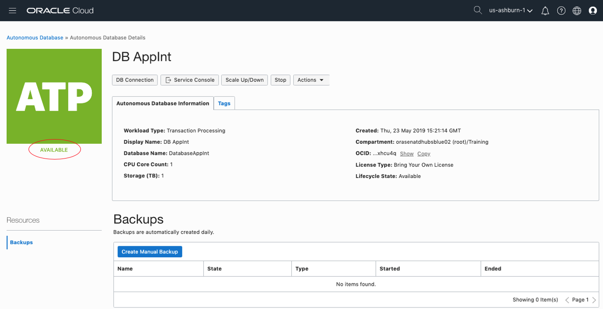

      Figure 116: Verifying that Database Provisioning was Successful

    - For additional assistance, follow the steps in this tutorial to guide you:
    https://docs.oracle.com/en/cloud/paas/atp-cloud/tutorials.html.
    Focus on the *Provisioning Autonomous Transaction Processing*
    section. The other sections may not be important to you right now as
    you have the steps below that you can follow to perform to finish
    the ATP setup:

      

      Figure 117: Accessing the Autonomous Transaction Processing Tutorials


4.  Check to see that your database is running:
    
    - Access your ATP instance by opening up a new browser tab and
        browsing to Browse to the *Oracle Cloud My Services Page URL* noted 
        in your *MyLabNotes* file to access your services.
    
    - When prompted for *User Name* and *Password*, enter your cloud
        credentials and click the Sign In button.
    
    - Click on *Autonomous Transaction Processing*.
    
    - Click on the *Open Service Console* in the upper-right corner.
    
    -  In the *Compartment* field at the left, select your *Autonomous
        Database Compartment Name* from the dropdown list.
    
    - Click on your database instance that appears in the table:

        

        Figure 118: Viewing Available Databases

    - If you don’t see this icon of your page, click the Start button at the
    top to start the instance:

      
      
      Figure 119: ATP Status Display

6.  Download your database credentials so you can access the database from SQL Developer:
    
    - Click the *DB Connection* button. The Database Connection dialog
        appears. 
        
    - Click the *Download* button in the *Download Client
        Credentials (Wallet)* area:

        

        Figure 120: Downloading Database Client Credentials (Wallet)

     - In the *Download Wallet* dialog, enter and confirm a *Password* for
    your wallet. Record your wallet password in your *MyLabNotes* document
    in your *ApplicationIntegrationLabs* folder.  Label it *Wallet Password*.  Then, click the
    *Download* button on the dialog.

    - Notice that your wallet zip file has been download to your Downloads
    directory. Copy that zip file to your *ApplicationIntegrationLabs*
    folder.

7.  Establish a connection to your ATP instance in SQL Developer:
    
    - Close your VPN connection if it is active.
    
    - Start *SQL Developer* on your computer.
    
    - Create a new connection:
        
        - Click the *File* menu bar option. The *New Gallery* dialog
            appears.
        
        - Click the *General / Connections* option at the left.
        
        - *Double-click the Database Connection* option at the right.
            The *New / Select Database Connection* dialog appears. 
            
        - Fill in the following fields:
            
          - Name: *MyAdminConnection*
            
          - Username: *admin*
            
          - Password: *\<enterYourDBAdminPasswordYouSavedAbove)*
            
          - Connection Type: *Cloud Wallet*
            
          - Configuration File: Browse to and select *your wallet
                zip file* that you saved in your *ApplicationIntegrationLabs* folder.
            
          - Service: *\<Autonomous Database Name (all lowercase without spaces)\>\_high*  (That gives us the best performance.)

          - Click the *Test* button to see if SQL Developer can connect
            to your ATP instance. Wait for a moment as access is
            attempted. When successful, celebrate the “*Status:
            Success*” message that appears in the lower-left corner.

            - If the test fails, check that the *Service* is specified incorrectly.

            - If the test still fails and you are in an Oracle class, you may need to configure the *Proxy*:
              - Click on the *Proxy* tab.

              - Toggle on the *Use SQL Developer Proxy* radio button.
  
        
          - At the *Save Password* button, click it *On*. This will
            allow you later to just double-click your connection to open
            it without being prompted for your password.
        
          - Click the *Save* button at the bottom of the dialog.
        
          - Exit the dialog by clicking the Cancel button in the lower-right corner.
    
7.  Test your new SQL Developer connection:
        
    - In the *Connections* panel at the left, *right-click on
            MyAdminConnection* and select *Disconnect*.
        
    - In the *Connections* panel at the left, right-click on
            *MyAdminConnection* and select Connect.
        
    - If you connect to the ATP instance, you are all set to
            continue the following steps in SQL Developer.

8.  Establish the new database user (*atpc\_user*):
    
    - Make sure your *MyAdminConnection* is open.
    
    - Click on *MyAdminConnection* in the Connections panel at the
        left and see that the Worksheet tabbed panel is available at the
        right. Click on the *Worksheet tab* to make it current.
    
    - Enter the following statements into the Worksheet pane to create
        the *atpc\_user*:  
          
      

      Figure 121: Creating a Database User

    - Here is the text to copy/edit/paste for these statements:  
      ```
      create user atpc_user identified by "DBWelcome1234";  
      grant dwrole to atpc_user;
      ```  
      Figure 122a: Statements to Create a Database User

    - Of course, your password will likely be different than the one shown
above (*DBWelcome1234*). Save the password in your
ApplicationIntegrationLabs folder ApplicationIntegrationLabs folder.

    - Click the *Run Script* icon (highlighted above) to execute both
    statements. You will see feedback that the user was created and that
    the grant succeeded.  Look in the *Script Output* panel to see the
    "User ATPC_USER created" and "Grant succeeded" messages.

    - Click the *Commit icon* (highlighted above) to make sure that the
    changes were committed to the database.

    - You need to establish the quota for the new *atpc_user* so they can insert data into tables they might create.  Enter the following statements into the Worksheet pane to alter the user to set quota:

      ```
      ALTER USER atpc_user quota unlimited on DATA;  
      ```  
      Figure 122b: Statements to Alter Quotea for a Database User

    - Click the *Run Script* icon (highlighted above) to execute both
    statements. You will see feedback that the user was created and that
    the grant succeeded.  Look in the *Script Output* panel to see the
    "User ATPC_USER altered" message.

    - Click the *Commit icon* (highlighted above) to make sure that the
    changes were committed to the database.
    - Close your *MyAdminConnection* by *right-clicking on it* in the
    Connections panel and selecting the *Disconnect* option from the
    popup menu.

9. Create a SQL Developer connection for the new *atpc\_user*:
    
    - Close your VPN connection if it is active.
    
    - In the *Connections* panel at the right side, click on the *New
        Connection icon* (green plus (+) and the *New / Select Database
        Connection* dialog appears. Fill in the following fields:
        
      - Name: *My\_atpc\_user\_Connection*
        
      - Username: *atpc\_user*
        
      - Password: *\<enterYourDBAdminPasswordYouSavedAbove\>*
        
      - Connection Type: *Cloud Wallet*
        
      - Configuration File: *Browse to and select your wallet zip
            file* that you saved in your ApplicationIntegrationLabs
            folder ApplicationIntegrationLabs folder above.
        
      - Service: *\<Autonomous Database Name (all lowercase without spaces)\>\_high*  (That gives us the best performance.)
        
      - Click the *Test* button to see if SQL Developer can connect
            to your ATP instance. Wait for a moment as access is
            attempted. When successful, celebrate the “*Status:
            Success*” message that appears in the lower-left corner.

          - If the test fails, check that the *Service* is specified incorrectly.

        - If the test still fails and you are in an Oracle class, you may need to configure the *Proxy*:
            - Click on the *Proxy* tab.

            - Toggle on the *Use SQL Developer Proxy* radio button.
        
      - At the *Save Password* field, click it *On*. This will allow
            you later to just double-click your connection to open it
            without being prompted for your password.
        
      - Click the *Save* button at the bottom of the dialog.
        
      - Exit the dialog by clicking the Cancel button in the lower-right corner.
        
10. Test your new SQL Developer connection:
            
      - In the *Connections* panel at the left, *right-click on
                My\_atpc\_user\_Connection* and select *Disconnect*.
            
      - In the *Connections* panel at the left, *right-click on
                My\_atpc\_user\_Connection* and select *Connect*.
            
      - Leave your connection open.
11.  Establish the ORDERS table:
    
      - While you are logged in as atpc\_user, *double-click on your
        My\_atpc\_user\_Connection* in the *Connections* panel at the
        left to display the *Workspace* tabbed panel at the right.
    
      - Enter the following statements into the Worksheet panel to
        create the ORDERS table:

        

          Figure 123: Creating a Database Table

      - Here is the text to copy/edit/paste for these statements:  
        ```
        CREATE TABLE atpc_user.orders (  
        orderId VARCHAR2(8) PRIMARY KEY,  
        orderDate DATE NOT NULL,  
        storeId NUMBER(3,0) NOT NULL,  
        stockId NUMBER (6,0) NOT NULL,  
        quantityOrdered NUMBER(3,0) NOT NULL);
        ```
        Figure 124: Statement to Create the ORDERS Table

      - Click the *Run Script icon* (highlighted above) to execute both
    statements. You will see feedback that the table was created.  Look for 
    the *Table ATPC_USER.ORDERS created* message in the *Script Output*
    panel.

      - Click the *Commit icon* (highlighted above) to make sure that the
    database changes were committed to the database.

      - *Expand the hierarchy* *below your My\_atpc\_user\_Connection* in
    the *Connections* panel at the left to reveal the *ORDERS* table
    below *Tables (Filtered)*.

      - Click on *ORDERS* to display the structure of the table in the
    Columns tabbed panel at the right.

      - Click on the *Data* tab to verify that there are no rows in your new
    table.

     - Gracefully exit SQL Developer:
    
        - In the *Connections* panel at the left, right-click on each of
        your open connections and select *Disconnect*.
    
        - Exit SQL Developer.

5.  Here are some additional database-related tasks that you might like
    to explore:
    
    - To add a sample row to the new ORDERS table, enter the following
        statements into the *Worksheet* panel for ORDERS table:
    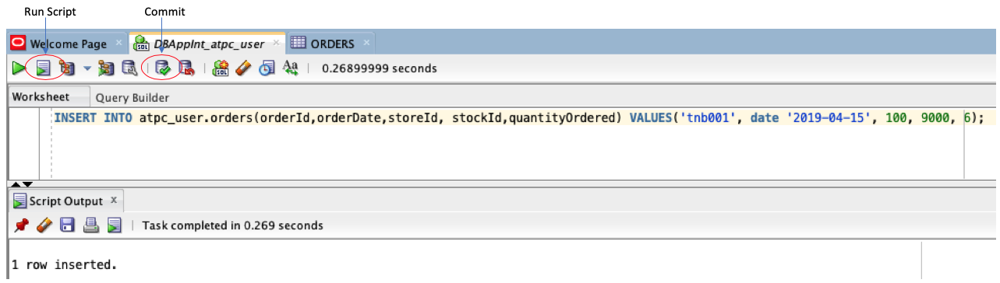

      Figure 125: Inserting a Row in a Database Table

      - Here is the text to copy/edit/paste for this statement:  
        ```
        INSERT INTO atpc_user.orders(orderId,orderDate,storeId,stockId,quantityOrdered) VALUES('tnb001', date '2019-04-15', 100, 9000, 6);
        ```  
        Figure 126: Statement to Insert a Row in the ORDERS Table

      - Make sure that whatever you include for orderID ('tnb001') doesn’t match an existing row in the table.  

      - Don’t forget to *Commit* your changes.

    - To drop your ORDERS table so you can recreate it, here is the
    statement to enter, *Run* Script and *Commit* in the Worksheet
    panel:  
      ```  
      drop table atpc_user.orders; 
      ```
       Figure 127: Statement to Drop the ORDERS Table   
    - Again, don’t forget to *Commit* your changes.

## Set Up Oracle Integration

1.  Start fresh by clearing your Chrome browser cache (all browsing
    data). If you need help, refer to the Preparing Your Environment
    section for the steps.

2.  Refresh your browser window. Due to clearing the browser cache, you
    may lose your connection to the Oracle Public Cloud. 
    
3. Browse to your *Oracle Cloud My Services* page appears that you noted in your scratchpad file in the *Prerequisites* section.  

4. Click the *Integration* option to display the *Integration Integrate Applications
and Automate Processes* page.

8. Click on the *Open Service Console* button in the upper-right corner to show the
*Oracle Integration* page.  A list appears showing any existing instances.

3.  Create a new Integration instance:
    
    - On the *Oracle Integration* page, click the *Create Instance*
    button:

      

      Figure 128: Creating a New Oracle Integration Instance

    - Fill in the highlighted fields and click the *Next* button:

        

      Figure 129: Configuring a New Oracle Integration Instance

    - Make sure that the *Feature Set* field dropdown menu shows
*Integration and Process* selected so you will have both in your
instance. Also, elect to have only *1 20K Messages* pack as this is an
instance you’ll use for learning and prototyping:

      

      Figure 130: Configuring a New Oracle Integration Instance

    - Click the *Next* button in the upper-right corner to see a summary of your inputs.

    - Click the *Create* button in the upper-right corner to provision 
    your new instance.

    - The *Oracle Integration* page redisplays. Notice that the *Status*
    field indicates that the service is being created. Also notice that
    the *Messages Packs* field is set to *0*. You entered 1 earlier.
    This indicates that the base instance comes with 1 message pack, so
    no new “additional message packs” are being provisioned:

      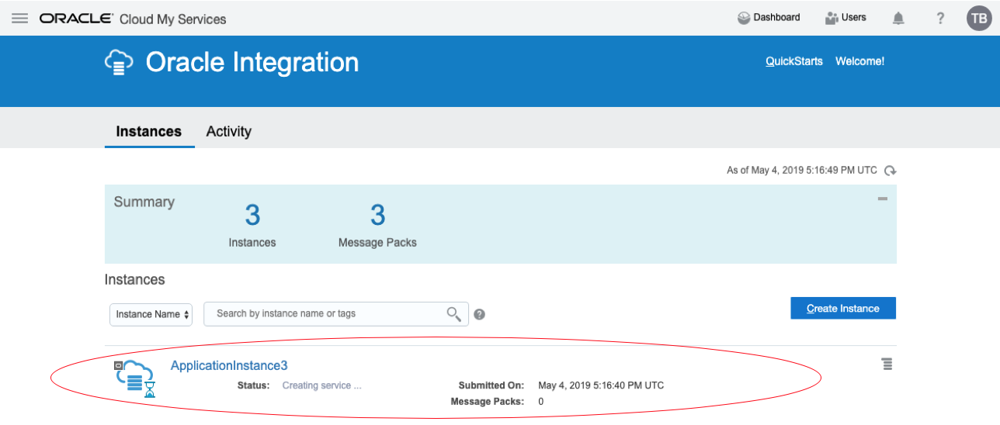

      Figure 131: Status While a New Oracle Integration Instance is Being
Provisioned

    - Wait a few minutes and refresh the *Instances* *area* periodically,
    by clicking the *Refresh icon* (a circular arrow) periodically at the extreme
    right-side of the window.

    - When the instance has been created, the *Instances* *area* shows:

        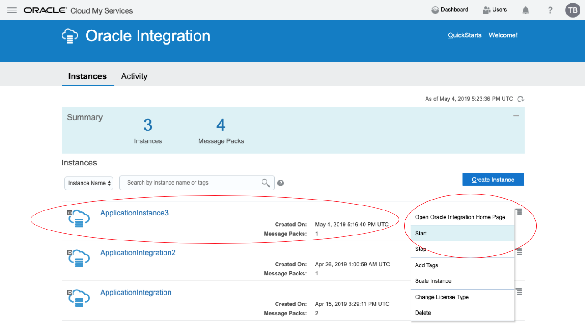

        Figure 132: Starting an Oracle Integration Instance

     - Start your new instance:
        - Click on its *hamburger menu* (shown above) and select the *Start*
    option in the popup menu (as highlighted above). In the popup
    dialog, confirm that you want to start your instance.

        - Click the *Refresh icon* at the extreme right-side periodically to refresh
    the Instances area.

        - In a few moments you’ll see that your instance has started and that
    you can click on it to start using it. You may have to refresh your
    browser page also to update the status message.

    - Your instance has been established and is ready for use.