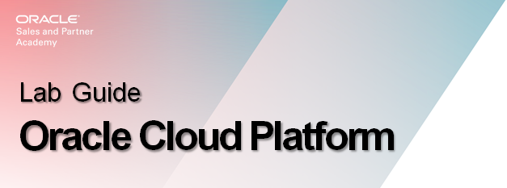
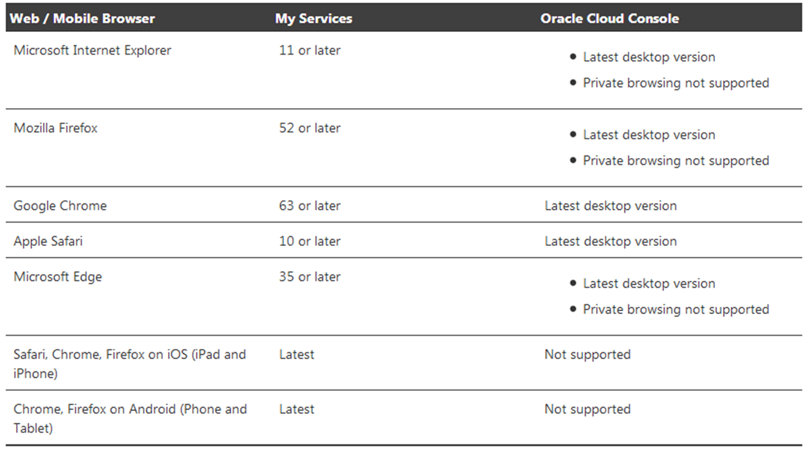
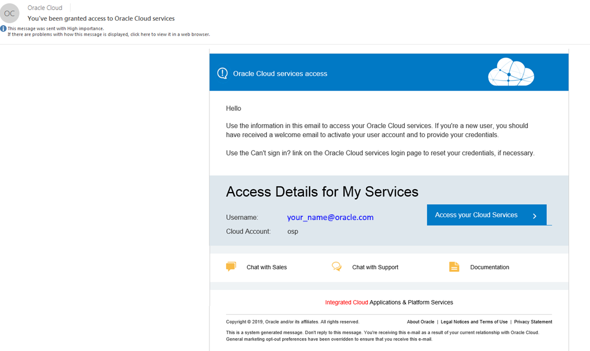
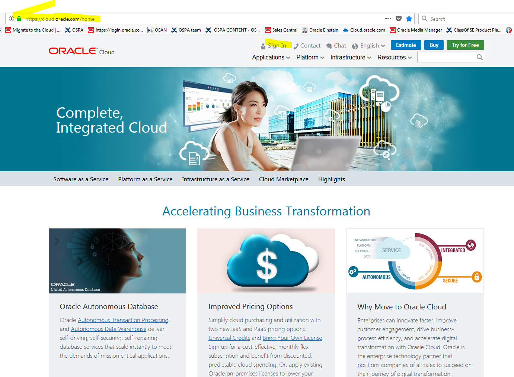

# Class of SE - HOL Lab Preparation

Were going to review the set-up requirements and how to gain access to the
Oracle Cloud.

So you can successfully login and use the Oracle Cloud and execute this weeks upcoming course hands-on-labs.

# Oracle Cloud Prerequisites

To perform labs for this session and the rest of the week:

Primary requirement: supported web browser and working internet connection

-   Chrome 63 or later is recommended for lab work this week

-   Install Chrome now should you not already have it

-   <https://www.google.com/chrome/>

*
Figure 1: Supported Browsers 

Email for Login & Link to Cloud My Services

1.  After sign up for the free Oracle Cloud promotion or a paid account, or as with this lab, 
    you’ll get an email. The email indicates your account is ready or provides
    you with cloud account details and sign in credentials dependent upon how its been setup by the Cloud Administrator.

2.  Typically for customers, they will scroll down in their email invitation to the Access Details section and note user name           and password. 

3.  Its essential to note the name of the Cloud Account, Access Details, and Identity
    Domain.

4.  Then click Access your Cloud Services to get started. 
Note that for internal use, the Cloud Administrator may not setup access that way and you enter the specific environment you've been instructed to use and then your SSO credentials. 

5.  And a best practices to bookmark it before sign-in.

*
Figure 2: My Services Details
*

**Note:**  *Also a right mouse click on Access your Cloud Services box enables you to capture the URL so you can save a copy or bookmark it. Make sure to keep a copy of that email for later reference.*

Cloud.oracle.com

*
Figure 3: Oracle Cloud Home 
*

# Summary of Learning

-   You understand and have verified you meet the prerequisites to using the
    Oracle Cloud

-   You know the initial email is important as it can contain the Oracle Cloud access
    link and initial sign-in credentials. And to check the SPAM folder when it does
    not appear when expected

-   You can successfully login and actively participate in the HOL work in the
    rest of the training courses
