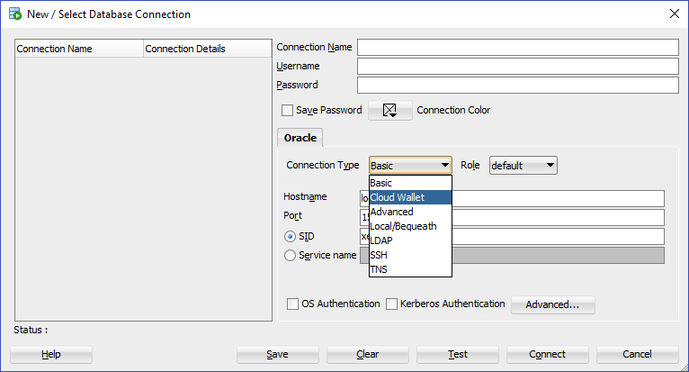

Who Should Complete This Lab: One Person Per Group

# Creating Autonomous Database and Oracle Machine Learning Users

## Table of Contents

- [Module 1: Download Client Credentials](#module-1--download-the-client-credentials-wallet)
- [Module 2: Connect to your ATP instance with SQL Developer](#module-3--connecting-to-the-database-using-sql-developer)
- [Module 3: Create Autonomous Database Users](#module-4--create-autonomous-database-users)
- [Module 4: Create OML Users](#module-4--create-oml-users)

***** 

## Module 1:  Download the Client Credentials (wallet)

The connection wallet provides the only authentication information that
can be used to connect to your ATP database. This wallet must be
downloaded to the client that will be connecting to the database. The
wallet can be downloaded from two locations, the Database Details page
or the Service Console

1. The wallet is downloaded from the **Administration** page in the ATP
service console. Continuing from where we left off in the previous lab,
select **Download Client Credentials:**

Figure 1-1

2. Specify a password of your choice for the wallet. Note that this
password is separate from the **Admin** user password created earlier
(but the same password can be used). Make sure you know where the file
gets downloaded to so you can find it on your system.

Figure 1-2

3. **Alternatively** use the DB Connection button in the main Database
Details page to download the credentials:

Figure 1-3

4. This step opens up a screen where the wallet can be downloaded as well as
connection strings be copied from (more on this in other modules)

[Back to Top](#table-of-contents)

***** 

## Module 2:  Connecting to the Database using SQL Developer 

*(Make sure you are running the latest version of SQL Developer 18.4. Some older versions will not work with ATP, see lab introductions on how to install)*

1. Start SQL Developer (by clicking the icon on your desktop or selecting
from the Windows Start menu) and create a connection for your database
using the default administrator account, ADMIN, by following these
steps.

2. Click the **Create Connection** icon in the Connections toolbox on the
top left of the SQL Developer homepage.

Figure 3-1

3. The new Database Connection screen will appear:

Figure 3-2

4. Fill in the connection details as below:

**Connection Name:** `admin`
**Username:** `admin`
**Password:** *The admin password you specified during database provisioning*
**Connection Type:** *Cloud Wallet*
**Configuration File:** Enter the full path for the wallet file you downloaded before (in my example wallet\_ATPXWEEK.zip), or click the Browse button to point to the location of the file.

Figure 3-3

**Service:** *select the service configured specifically for ATP services ( **$dbname\_TP** service) for you database. Many services may be listed but make sure you pick the one for with the database name you created. In this example its **atpxweek\_TP.

5. Test your connection by clicking the **Test** button, if it succeeds

6. Save your connection information by clicking **Save**

7. Connect to your database by clicking the **Connect** button.

8. See below for completed input and test. Notice also that after you save
your connection it will appear on the list of connections on the top
left corner of the main dashboard, under connections.

Figure 3-4

[Back to Top](#table-of-contents) 
***** 

## Module 3: Create Autonomous Database Users

The labs will require each member of the group to create and query tables in the the Autonomous Database just created. Unlike the **ADMIN** account created by default with the Autonomous Database, each user that will be using the database requires their own username and password. Follow the steps below to create an Autonomous Database user in the database just created for each member of the group. 

## Module 4:  Create OML Users

The labs will be using Oracle Machine Learning (OML) to learn its capabilities. Each users in the group should have their own OML username. Follow the steps below to create an OML user for each member of the group. 

1. If you are not already logged into the ATP Service Console, in the main
ATP service page select Service Console:

Figure 4-1

2. On the next page log in with your ADMIN ATP user name/password and click **Sign in:**

3. Select Administration from the top left and once on the Administration
page select **Manage Oracle ML Users**:

Figure 4-2

4. If required (you may not see this page), log into the OML Administration
console which is different than the database administration console but
uses the same ADMIN account created when the database was created. Fill
in the **ADMIN password** and click **Sign In**

Figure 4-3

5. Next create the actual OML user. Click the **Create** button:

Figure 4-4

6. This will open up the user creation page, fill in the information for
your new OML user and click **Create**. This is a completely new user
account that will be used anytime you want to access OML. Make sure you
keep this information. Notice that you can specify an email address
where your user information and a direct link to the OML login will be
emailed to you. This will help you later when you need to reconnect to
OML.

Figure 4-5

7. **You now have a new OML user\!** Repeat this process for every member of the group.

***END OF Account Creation LAB***

[Back to Top](#table-of-contents)   
