## Who Should Complete This Lab: One Person Per Group

# Provisioning an Autonomous Database

## Table of Contents

- [Module 1: Learn how to login to the Oracle Cloud Console](#module-1--learn-how-to-login-to-the-oracle-cloud-console)
- [Module 2: Learn how to provision a new Autonomous Database](#module-2--learn-how-to-provision-a-new-autonomous-database)

***** 

## Module 1:  Learn How to Login to the Oracle Cloud Console

In this section you will be provisioning an ADB database using the cloud
console.

1. Go to [cloud.oracle.com](https://cloud.oracle.com), click Sign In to sign in
with your Oracle Cloud account.

Figure 1-1

2. Enter your Cloud Account Name (sometimes referred to as Tenancy, for the Class of most likely its orasenatdhubsblue02) and click **Next**.

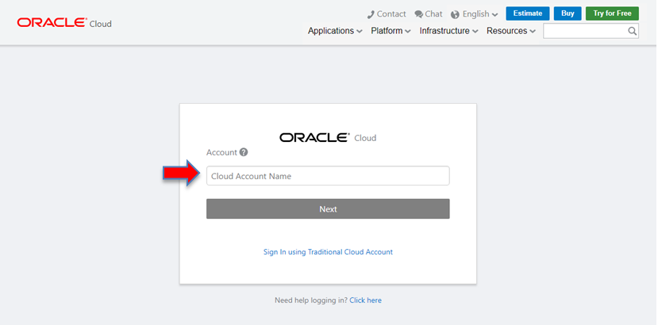

Figure 1-2

3. Click SSO to log in. If you don't have an SSO login, enter your Cloud username and password, and click **Sign In**. 

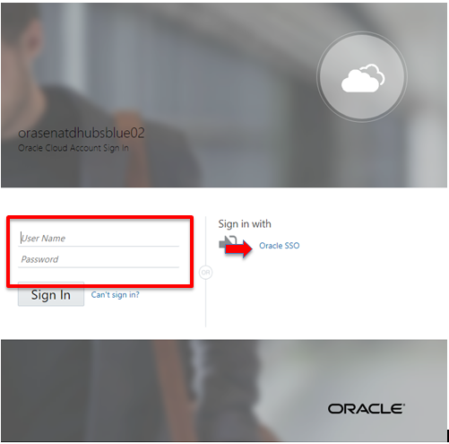

Figure 1-3

**PLEASE NOTE: Because the environmnet you are using is a LAB environment the pages you land on may be different than the ones  you see in this lab section. We try to incorporate all posibilities, however there may be some cases were the lab does not follow exactly what you see on your screen. Your objective is to get to the Autonomous Database (Datawarehouse or Transaction Processing) page.**

4. This will bring you to the main cloud page which may differ depending on whether
this cloud account has been used before and the main portal customized. Below
you will see the main screen for a new account, that shows available Guided
Journey’s. From here you can launch different Oracle cloud services. If you see the site below and you have a drop down icon on the top left of the screen as highlighted, select the drop down menu highlighted in red. If not, proceed to step 6.

Figure 1-4

5. If you did not see the previsou pages, for the group labs you are most likely to see the page below, select the **OCI Console** icon and proceed to step 6:

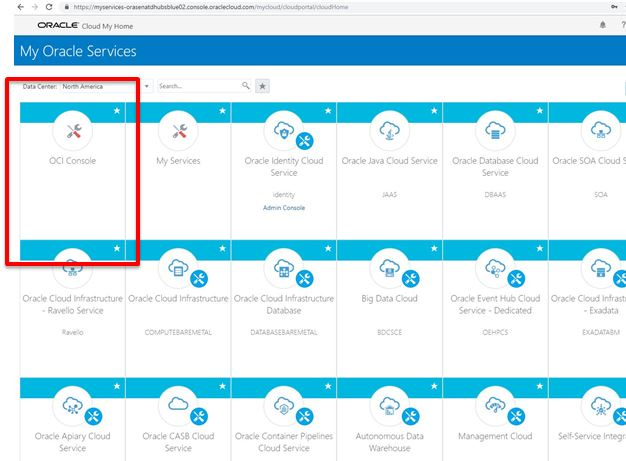

Figure 1-5

6. Whether you saw the screen on step 4 or 5, following the steps you should see a list of options on the let hand side drop down menu. One of those options should be Autonomous Transaction Processing or Autonomous Data Warehouse. Select **Autonomous Transaction Processing** from the menu.

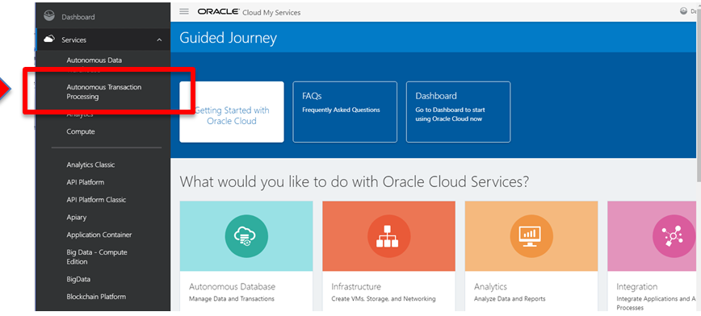

Figure 1-6

This will put you in the main Autonomous Database Service Console (see below).
Any ADB Databases created will be listed here (in its appropriate compartment). You can also create and access databases from this page. If you see a **Forbidden** exclamation point in the middle of the page, its because you defaulted into a **Compartment** you do not have permission to access. Don't worry you will not be using this compartment.

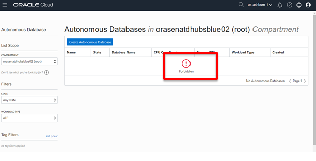

Figure 1-7

It is possible to use different compartments to separate databases into
different associated groups. We will do that for this lab, like you have been doing for other labs. In the **Compartment** drop down list navigate to the appropriate compartment you were instucted to use for these labs to create your database (most likely the name of your HUB). 

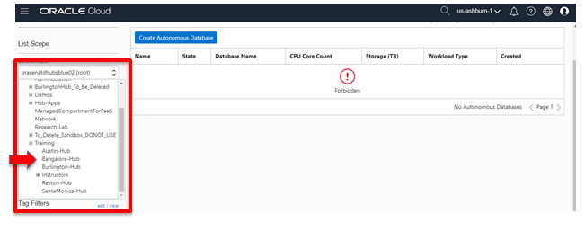

Figure 1-8

In this case I selected the **Bangalore-Hub** Compartment

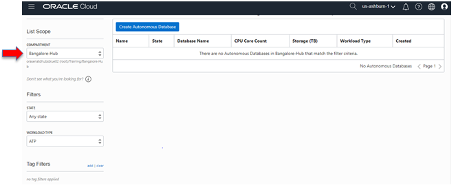

Figure 1-9

***** 

[Back to Top](#table-of-contents)

## Module 2:  Learn How to Provision a New Autonomous Database

1. Click on the “**Create Autonomous Transaction Processing Database**” button, as
shown below:

Figure 2-1

2. The following information must be filled in this page:

**Workload Type-** Autonomous Data Warehouse or Autonomous Transaction
Processing

**Compartment** – This can be changed, to organize and isolate databases

**Display Name –** The name of the service displayed

**Database Name –** The name of the actual database

**CPU Core Count –** Number of CPU’s allocated to the database (min 1)

**Storage –** Storage allocated to database in Terabytes (min 1)

**Password –** Database “Admin” user password

**License Type –** Select whether customer is using existing on-premises
database licenses (BYOL) or requires new licences. Customer charge will be based
on selected option

**TAGS –** a metadata system that allows you to organize and track resources
within your tenancy. Tags are composed of keys and values that can be attached
to resources.

3. After filling fields, click **Create Autonomous Database** which will open up
the screen to complete you database information (PLEASE NOTE: YOU WILL HAVE THE OPTION TO CREATE A DATA WAREHOUSE OR TRANSACTION PROCESSING DATABASE IN THE WORKLOAD TYPE SECTION. IF YOU SELECT TRANSACTION PROCESSING YOU WILL SEE AN ADDITIONAL SELECTION FOR SERVERLESS OR DEDICATED. DO NOT CHANGE THE DEFAULT CHOICE WHICH IS SERVERLESS):

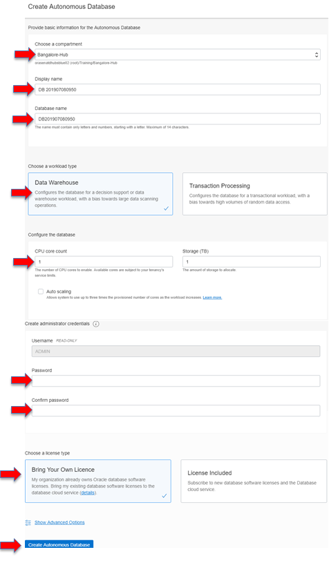

Figure 2-2

**Make sure to store and share the Administrator Password (admin database user) with every member of your team since you will be sharing this database**

You will be placed on the Database Details page and your database will be in
“**Provisioning**” status. The Database Details page displays more information
about your instance, notice the various menu buttons that help you manage your
new instance.

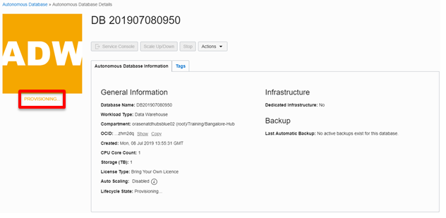

Figure 2-3

The status will automatically change to “**Available**” when the database is
ready in a few minutes…Your Autonomous Database is up and running! Take notice
of the green color of the ATP logo indicating the service is available and
commands to start, stop, terminate, and scale the service.

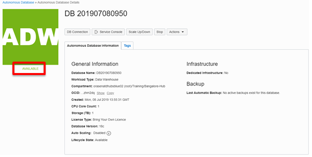

Figure 2-4

4. Now connect to your database, click the **Service Console** button:

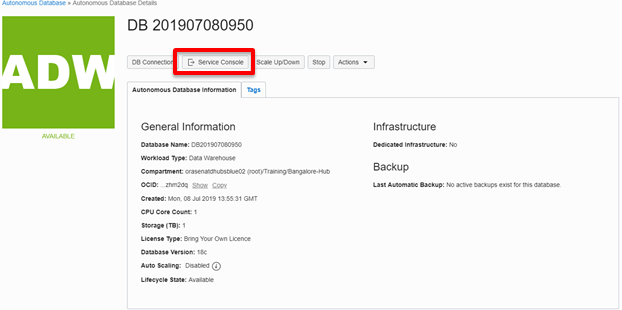

Figure 2-5

5. You will be placed in the Service Console page, you will notice there is no
activity displayed because this is a new instance. Select the **Administration**
option from the left:

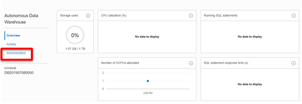

Figure 2-6

On the administration page there are six options. We will examin these in more detail in future labs.

**Download Client Credentials (Wallet) –** this contains the credentials files
used for connectivity to the instance from client applications, tools

**Set Administrator Password –** used to change the “Admin” account password

**Download Oracle Instant Client –** points to different clients that can be
used to connect to the database (like sql\*plus)

**Set Resource Management Rules –** ATP has pre-created user resource groups,
those can be managed here

**Manage Oracle ML Users –** Notebook development environment that can be used
with ATP

**Send Feedback to Oracle –** email feedback on ATP

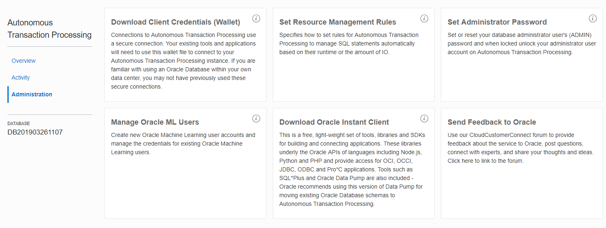

Figure 2-7

**You have successfully provisioned an Autonomous Database.**

***END OF LAB***

[Back to Top](#table-of-contents)   
