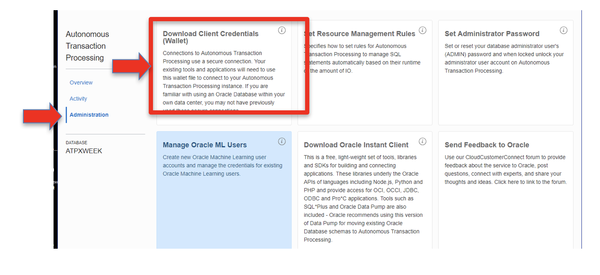
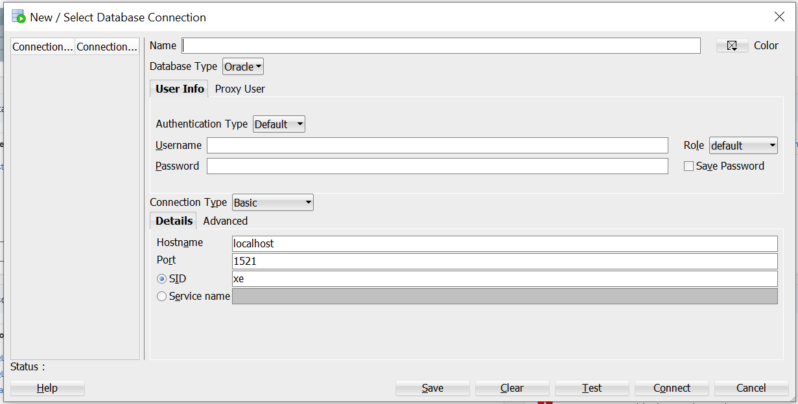
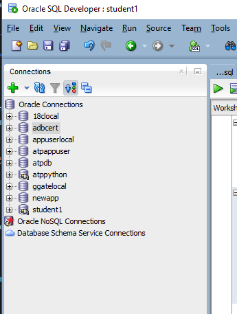
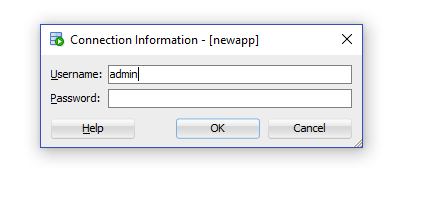
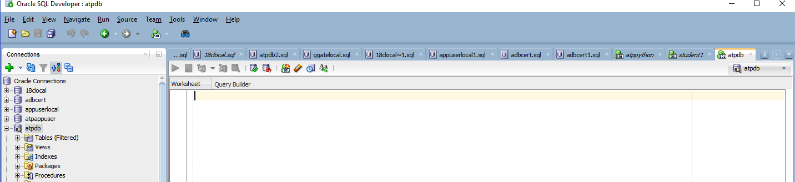
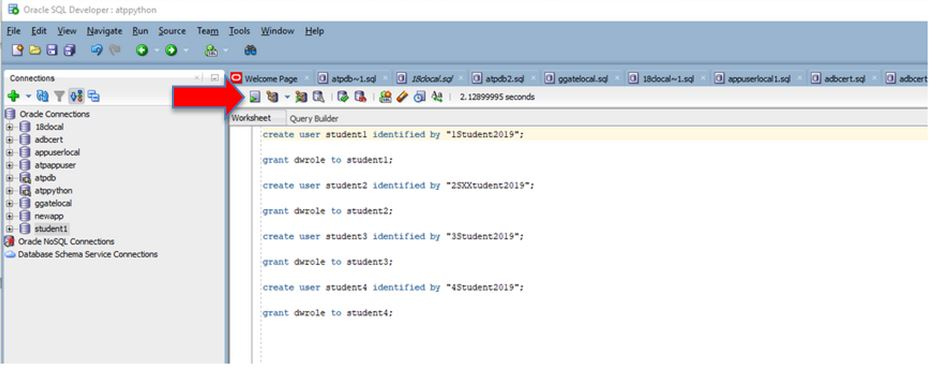
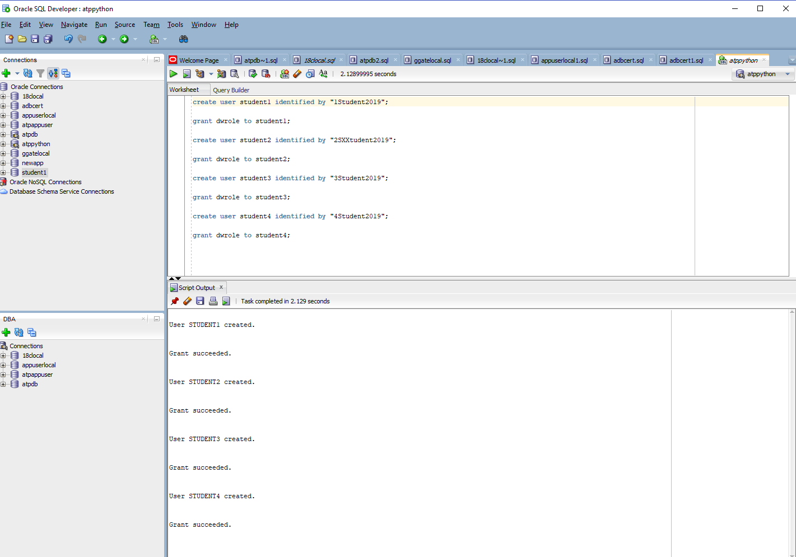

## Who Should Complete This Lab: One Person Per Group

# Creating Autonomous Database and Oracle Machine Learning Users

## Table of Contents

- [Module 1: Download Client Credentials](#module-1--download-the-client-credentials-wallet)
- [Module 2: Connect to your ADB instance with SQL Developer](#module-2--connect-to-your-adb-instance-with-sql-developer)
- [Module 3: Create Autonomous Database Users](#module-3--create-autonomous-database-users)
- [Module 4: Create OML Users](#module-4--create-oml-users)

***** 

This lab picks up exactly where the Provisioning an Autonomous Database lab finishes. Please review that lab if you are not in the correct location of your Autonomous Database Console to continue with this lab.

## Module 1:  Download the Client Credentials (wallet)

The Client Credentials, also known as the wallet, provides the only authentication information that
can be used to connect to your ATP database. This wallet must be
downloaded to the client that will be connecting to the database. The
wallet can be downloaded from two locations, the Database Details page
or the Service Console

1. The wallet is downloaded from the **Administration** page in the ATP
service console. Continuing from where we left off in the previous lab,
select **Download Client Credentials:**


<p align="center">Figure 1-1</p>

2. Specify a password of your choice for the wallet. Note that this
password is separate from the **Admin** password created during the database provisioning lab (but the same actual password can be used again). Make sure you know where the file
gets downloaded to so you can find it on your system.


<p align="center">Figure 1-2</p>

3. If you completed the previous step successfully you can proceed to Module 2. **Alternatively** you can download the wallet using the DB Connection button in the main Database
Details page to download the credentials:


<p align="center">Figure 1-3</p>

4. This step opens up a screen where the wallet can be downloaded as well as
connection strings be copied from (more on this in other modules)


[Back to Top](#table-of-contents) 
***** 


## Module 2:  Connect to your ADB instance with SQL Developer 

**PLEASE NOTE: SQL DEVELOPER CONNECTONS DO NOT WORK IF YOU ARE BEHIND THE VPN OR ORACLE OFFICE PRIVATE NETWORKS. IF YOU ARE USING THE VPN CLIENT YOU MUST DISCONNECT FROM VPN, AND FROM AN ORACLE OFFICE CONNECT TO AN OPEN/PUBLIC ACCESS NETWORK**

*(Make sure you are running the latest version of SQL Developer 18.4. Some older versions will not work with ATP, see lab introductions on how to install)*

1. Start SQL Developer (by clicking the icon on your desktop or selecting
from the Windows Start menu) and create a connection for your database
using the default administrator account, ADMIN, by following these
steps.

2. Click the **Create Connection** icon in the Connections toolbox on the
top left of the SQL Developer homepage.


<p align="center">Figure 2-1</p>

3. The new Database Connection screen will appear:


<p align="center">Figure 2-2</p>

4. Fill in the connection details as below:

**Name:** `admin`

**Database Type:** Oracle

**Authentication Type** Default

**Username:** `admin`

**Password:** *The admin password you specified during database provisioning*

**Role** Default

**Connection Type:** Cloud Wallet

**Configuration File:** Enter the full path for the wallet file you downloaded before, or click the Browse button to point to the location of the file.


<p align="center">Figure 2-3</p>

**Service:** Many services may be listed but make sure you pick the one for with the database name you created. In this example its **atpxweek\_TP. For this lab pick any of the services that contain your database name.

5. Test your connection by clicking the **Test** button, if it succeeds proceed to step 6. If it does not succeed view the troubleshooting at the end of this module.

6. Click on **Save Password** so you don't have to re-type your password every time you connect to the database.

7. Save your connection information by clicking **Save**

8. Connect to your database by clicking the **Connect** button.

9. See below for completed input and test. Notice also that after you save
your connection it will appear on the list of connections on the top
left corner of the main dashboard, under connections.


<p align="center">Figure 2-4</p>

**Troubleshooting your connection**

If your test failed the successfully connect to your database, the most likely reasons are:
-   you are connected to VPN or in an Oracle office not on the public network
-   that you used an incorrect password (or username and password)
-   you are behind the Oracle VPN - you need to be in a public network
-   you selected the wrong Service for your database

Verify that all this information is correct and try your test again. Save your connection once the test succeeds.

[Back to Top](#table-of-contents) 
***** 

## Module 3:  Create Autonomous Database Users

The labs will require each member of the group to create and query tables in the Autonomous Database just created. Unlike the **ADMIN** account created by default with the Autonomous Database, each user that will be using the database requires their own username and password. Follow the steps below to create an Autonomous Database user in the database just created for each member of the group. 

1. Once you have created a connection to your ADB with the Admin account in the previous module, now connect to ADB with that connection. By double clicking on the connection on the **Connections** window of SQL Developer (you may already be connected if you clicked on **Connect** in the previous section).



<p align="center">Figure 3-1</p>

2. You may be prompted to input the Admin password if you did not select the **save password** option in the previous step


<p align="center">Figure 3-2</p>

3. A Worksheet connected to your ADB Database will open on the top right window.


<p align="center">Figure 3-3</p>

4. Now create 5 student accounts, one for each member  in your group, copy  the SQL below, paste it in the Query Builder window and run it. If your group has less than 5 members don't worry. If your team has more than 5 members run the create student and grant role statements for each additional member. Each member of your group will have their own database account so distribute the accounts to each student. Member one wil be student1, member2 will be student2 and so on. To make it easier all student accounts have the same password "2019Students".

```
create user student1 identified by "2019Students";
grant dwrole to student1;
ALTER USER student1 QUOTA 100M ON DATA;
GRANT UNLIMITED TABLESPACE TO student1;
create user student2 identified by "2019Students";
grant dwrole to student2;
ALTER USER student2 QUOTA 100M ON DATA;
GRANT UNLIMITED TABLESPACE TO student2;
create user student3 identified by "2019Students";
grant dwrole to student3;
ALTER USER student3 QUOTA 100M ON DATA;
GRANT UNLIMITED TABLESPACE TO student3;
create user student4 identified by "2019Students";
grant dwrole to student4;
ALTER USER student4 QUOTA 100M ON DATA;
GRANT UNLIMITED TABLESPACE TO student4
create user student5 identified by "2019Students";
grant dwrole to student5;
ALTER USER student5 QUOTA 100M ON DATA;
GRANT UNLIMITED TABLESPACE TO student5;
```

In the picture below is an example of creating four accounts at once. I pasted and replicated the code for each user and then selected the Run Script button.


<p align="center">Figure 3-4</p>

After the code runs the result is displayed in the Script Output window in the bottom. The four student accounts have been created.


<p align="center">Figure 3-5</p>

Your Autonomous Database users are ready to be used.

[Back to Top](#table-of-contents) 
***** 

## Module 4:  Create OML Users

The labs will be using Oracle Machine Learning (OML) to learn its capabilities. Each user in the group should have their own OML username. Follow the steps below to create an OML user for each member of the group. 


1. If you are not already logged into the ATP Service Console, in the main
ATP service page select Service Console:


<p align="center">Figure 4-1</p>

2. On the next **if prompted**,  page log in with your ADMIN ATP user name/password  (this is the password you created when you provisioned the Autonomous Database in Lab 2) and click **Sign in:**

3. Select Administration from the left and once on the Administration
page select **Manage Oracle ML Users**:


<p align="center">Figure 4-2</p>

4. If required (you may not see this page), log into the OML Administration
console which is different than the database administration console but
uses the same ADMIN account created when the database was created. Fill
in the **ADMIN password** and click **Sign In**


<p align="center">Figure 4-3</p>

5. Next create the actual OML user. Click the **Create** button:


<p align="center">Figure 4-4</p>

6. This will open up the user creation page, fill in the information for
your new OML user and click **Create**. This is a completely new user
account that will be used anytime you want to access OML. Make sure you
keep this information. Notice that you can specify an email address
where your user information and a direct link to the OML login will be
emailed to you **by selecting the Generate password...** selection box. This will help you later when you need to reconnect to OML, but will also require a password change at first login. If you select this option, make sure that the email address is different and correct for every user that is created.

**A different account needs to be created for each member of your group** just like you did in the module above in SQL Developer. To make things simple you can use the same account names (and passwords) for the OML accounts as you did for the database accounts.


<p align="center">Figure 4-5</p>

7. **You now have a new OML user\!** Repeat this process for every member of the group.


***END OF Account Creation LAB***

[Back to Top](#table-of-contents)   
