## Who Should Complete This Lab: All Participants

# Loading an Autonomous Database

## Table of Contents

- [Module 1: Creating Tables and Inserting Data with SQL](#module-1--creating-tables-and-inserting-data-with-sql)
- [Module 2: Creating Tables and Inserting Data with the SQL Developer Import Wizard](#module-2--creating-tables-and-inserting-data-with-the-sql-developer-import-wizard)


***** 

Now that you have connected and tested your connection to the Autonomous Database
let’s move on to some of the most important uses for a database. That includes
creating, loading, and querying tables, Most customers will want to load
information they already have, often times from flat files.

In this lab we will use SQL Developer to create and insert data into tables
using SQL, the language of databases, and then create and insert data into a
table using the SQL Developer Import Wizard.

## Module 1:  Creating Tables and Inserting Data with SQL

If you are note already connected to your database with SQL Developer, please review the previous lab. This lab continues where the previous one finished.

1. In SQL Developer, connect to your database. Double Click on the connection you defined

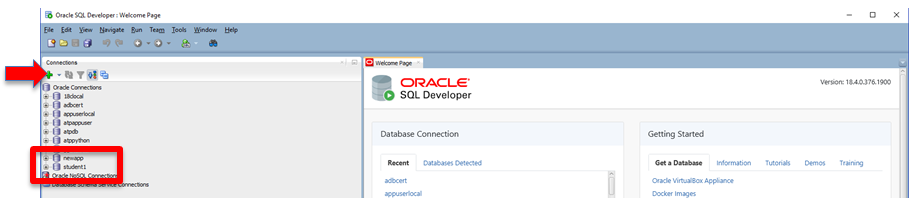
<p align="center">Figure 1-1</p>

2. If prompted for a password in the pop-up window, provide the username and password for your database user, created in an earlier lab.

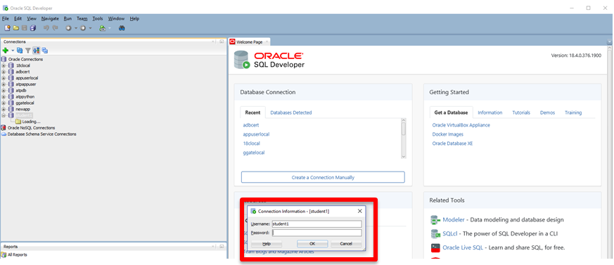
<p align="center">Figure 1-2</p>

3. You will be connected and your database objects and the Worksheet will be
displayed

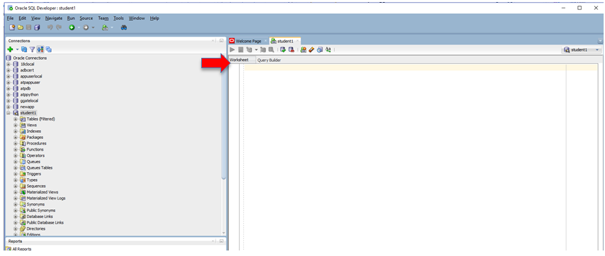
<p align="center">Figure 1-3</p>

4. Click the **+** on Tables under your connection name (student1 in this case) and
expand it. Notice it is empty

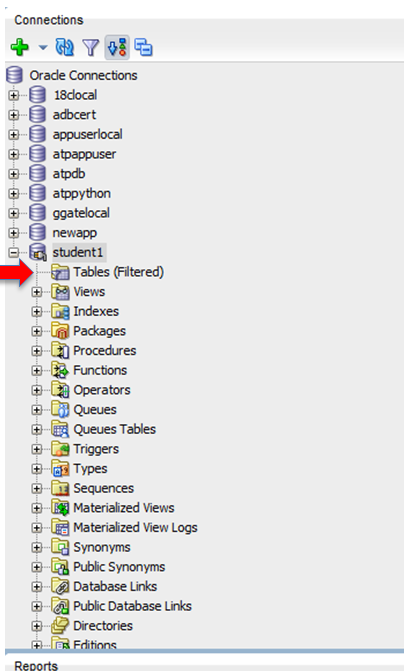
<p align="center">Figure 1-4</p>

5. Now let’s create 2 tables, using SQL in the Worksheet screen, one named **DEPT** and
one name **EMP**. Copy the SQL below and post it in the Worksheet window, then click
**Run Script** (F5)

```
CREATE TABLE DEPT (

DEPTNO NUMBER(2) CONSTRAINT PK_DEPT PRIMARY KEY,

DNAME VARCHAR2(14),

LOC VARCHAR2(13)

) ;

CREATE TABLE EMP (

EMPNO NUMBER(4) CONSTRAINT PK_EMP PRIMARY KEY,

ENAME VARCHAR2(10),

JOB VARCHAR2(9),

MGR NUMBER(4),

HIREDATE DATE,

SAL NUMBER(7,2),

COMM NUMBER(7,2),

DEPTNO NUMBER(2) CONSTRAINT FK_DEPTNO REFERENCES DEPT

);
```


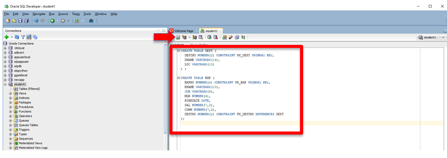
<p align="center">Figure 1-5</p>

The tables will be created and you will see the result in the script output
window.

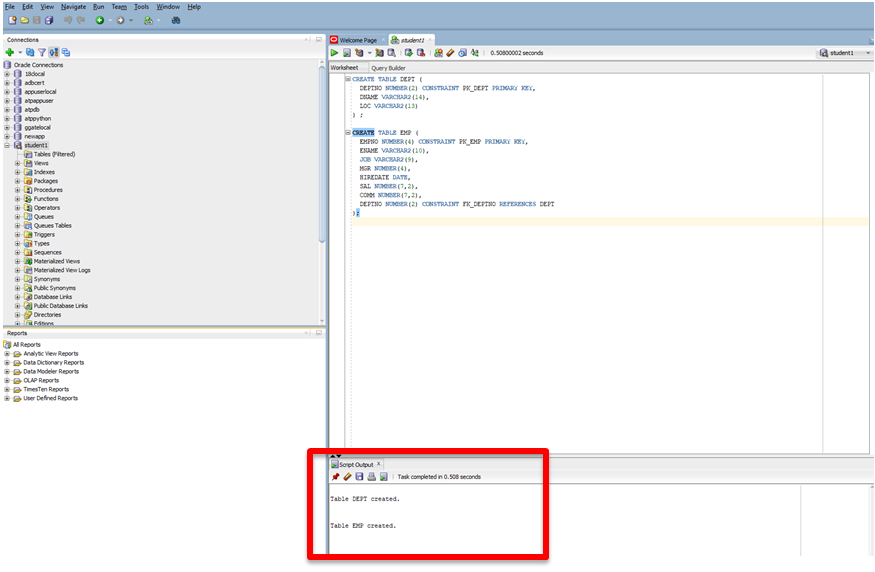
<p align="center">Figure 1-6</p>

6. Hit the Refresh Button on the Connection window and open the tables tab again,
the tables you just created are now displayed.

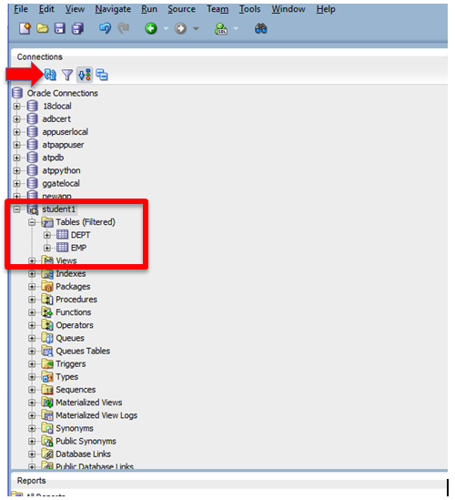
<p align="center">Figure 1-7</p>

7. Load data into your tables. Click on the eraser in the worksheet window to erase
the code you just pasted there so we can paste new code.

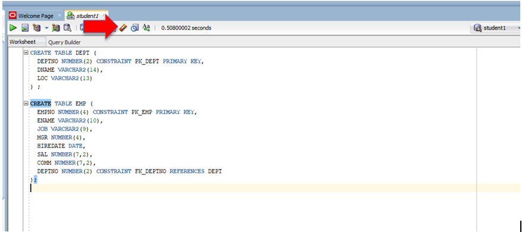
<p align="center">Figure 1-8</p>

8. Copy and paste the code below, which inserts several rows of information into
both tables. Paste it into the worksheet window you just cleared and click on
run script again (same buttons as in Figure 1-5):

```
INSERT INTO DEPT VALUES (10,'ACCOUNTING','NEW YORK');

INSERT INTO DEPT VALUES (20,'RESEARCH','DALLAS');

INSERT INTO DEPT VALUES (30,'SALES','CHICAGO');

INSERT INTO DEPT VALUES (40,'OPERATIONS','BOSTON');

INSERT INTO EMP VALUES
(7369,'SMITH','CLERK',7902,to_date('17-12-1980','dd-mm-yyyy'),800,NULL,20);

INSERT INTO EMP VALUES
(7499,'ALLEN','SALESMAN',7698,to_date('20-2-1981','dd-mm-yyyy'),1600,300,30);

INSERT INTO EMP VALUES
(7521,'WARD','SALESMAN',7698,to_date('22-2-1981','dd-mm-yyyy'),1250,500,30);

INSERT INTO EMP VALUES
(7566,'JONES','MANAGER',7839,to_date('2-4-1981','dd-mm-yyyy'),2975,NULL,20);

INSERT INTO EMP VALUES
(7654,'MARTIN','SALESMAN',7698,to_date('28-9-1981','dd-mm-yyyy'),1250,1400,30);

INSERT INTO EMP VALUES
(7698,'BLAKE','MANAGER',7839,to_date('1-5-1981','dd-mm-yyyy'),2850,NULL,30);

INSERT INTO EMP VALUES
(7782,'CLARK','MANAGER',7839,to_date('9-6-1981','dd-mm-yyyy'),2450,NULL,10);

INSERT INTO EMP VALUES
(7788,'SCOTT','ANALYST',7566,to_date('13-JUL-87','dd-mm-rr')-85,3000,NULL,20);

INSERT INTO EMP VALUES
(7839,'KING','PRESIDENT',NULL,to_date('17-11-1981','dd-mm-yyyy'),5000,NULL,10);

INSERT INTO EMP VALUES
(7844,'TURNER','SALESMAN',7698,to_date('8-9-1981','dd-mm-yyyy'),1500,0,30);

INSERT INTO EMP VALUES (7876,'ADAMS','CLERK',7788,to_date('13-JUL-87',
'dd-mm-rr')-51,1100,NULL,20);

INSERT INTO EMP VALUES
(7900,'JAMES','CLERK',7698,to_date('3-12-1981','dd-mm-yyyy'),950,NULL,30);

INSERT INTO EMP VALUES
(7902,'FORD','ANALYST',7566,to_date('3-12-1981','dd-mm-yyyy'),3000,NULL,20);

INSERT INTO EMP VALUES
(7934,'MILLER','CLERK',7782,to_date('23-1-1982','dd-mm-yyyy'),1300,NULL,10);

COMMIT;
```


9. After you paste the code click **Run Script**

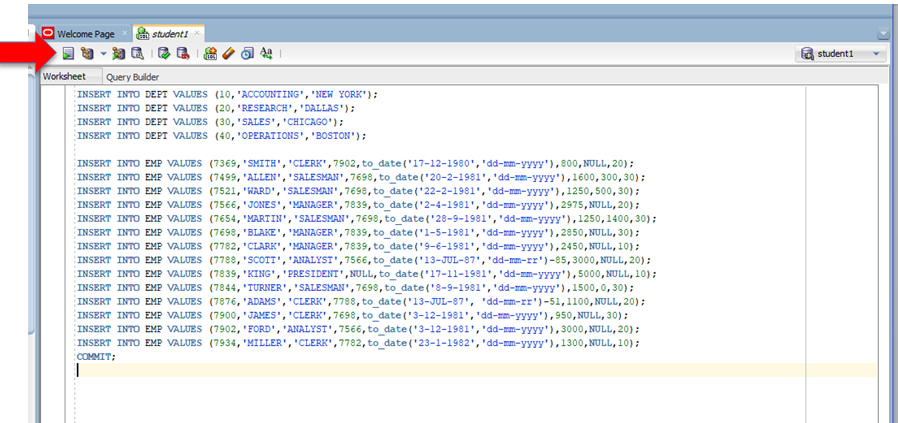
<p align="center">Figure 1-9</p>

You will see the results in the window below as the rows get inserted.

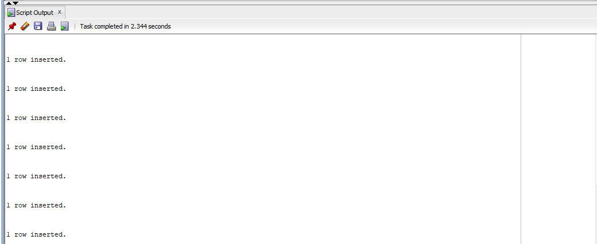
<p align="center">Figure 1-10</p>

10. Clear the worksheet again like you did above and cut and paste the following
code and run it (by clicking on Run Script):

```
select * from emp;

select * from dept;
```

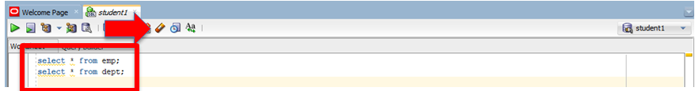
<p align="center">Figure 1-11</p>

You just used SQL to query the tables you created and inserted data into, and
have displayed the information in the tables!

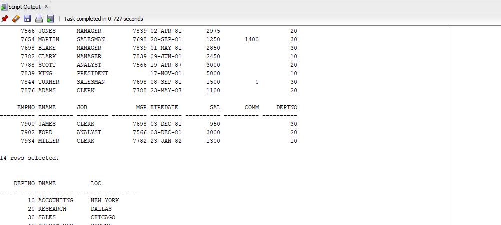
<p align="center">Figure 1-12</p>

[Back to Top](#table-of-contents)

## Module 2:  Creating Tables and Inserting Data with the SQL Developer Import Wizard

Another way to create tables and load data into the tables is the import data
function in SQL Developer. This allows you to load from files you have stored on
your machine directly onto a table in ADB. The import wizard also allows you to
load data stored in the Oracle Storage Cloud. In this part of the lab we will
load data that is in a comma delimited text file called channels.csv into a new
table called channels in your database.

1. Download the file called **channels.csv** ([from here](https://oradocs-corp.documents.us2.oraclecloud.com/documents/link/LD67BF60471BB8666A167A50F6C3FF17C1177A968060/fileview/D58165A8FC2BAB77F65D05CEF6C3FF17C1177A968060/_channels.csv)) Please note the local directory you save it in as you will need it in the next step. See screenshots on how to download and save the file.

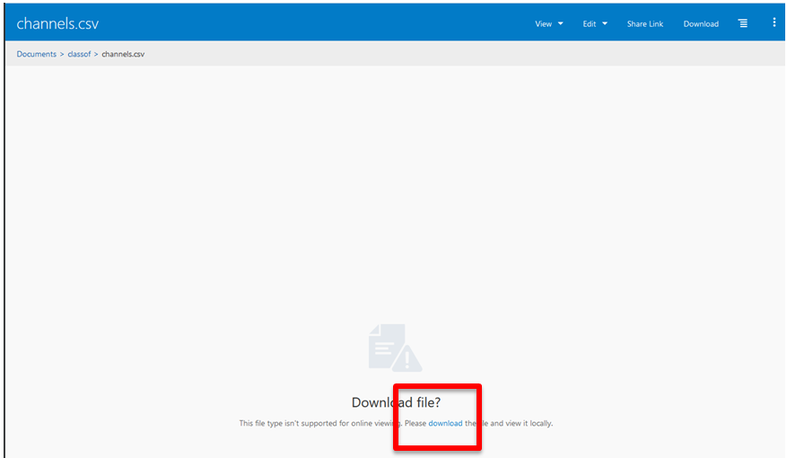
<p align="center">Figure 2-01</p>

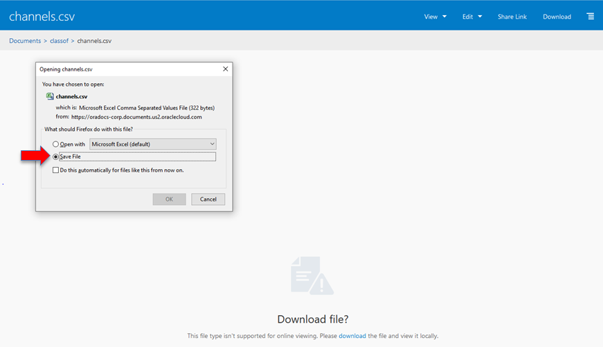
<p align="center">Figure 2-02</p>

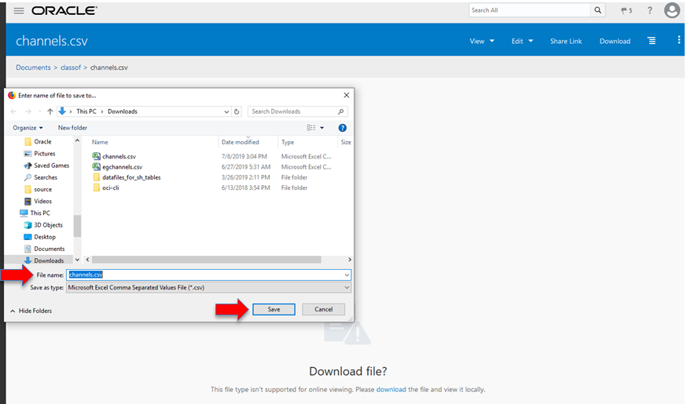
<p align="center">Figure 2-03</p>

2. In SQL Developer, under your connection right click on **Tables**. This will open up
a selection menu, then select the **Import Data** option

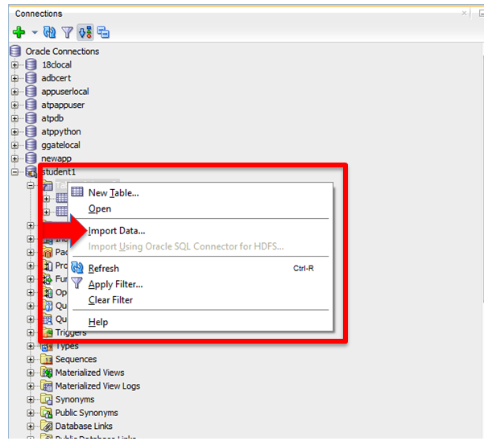
<p align="center">Figure 2-1</p>

This opens up the Data Import Wizard. In the Source make sure **Local File** is
selected. SQL Developer allows loading for files stored in Oracle Cloud Storage
as well, for customers who want to put data on our Cloud Storage and load from
there.

3. Next click on **Browse** and navigate to the location on your machine where you
stored the file channels.csv you just downloaded. Select the file and click **Open** once you
find it.

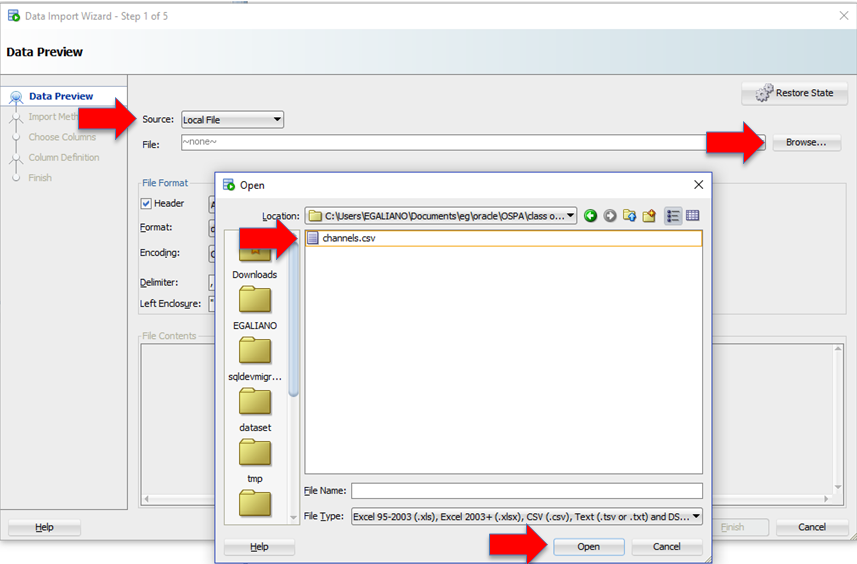
<p align="center">Figure 2-2</p>

Once the file is selected and open, information from the file will be pre-loaded
into the fields in the wizard. Notice it correctly determined this is a comma
delimited file. The first line in the file has the table column names and the
next lines in the file have the actual data.

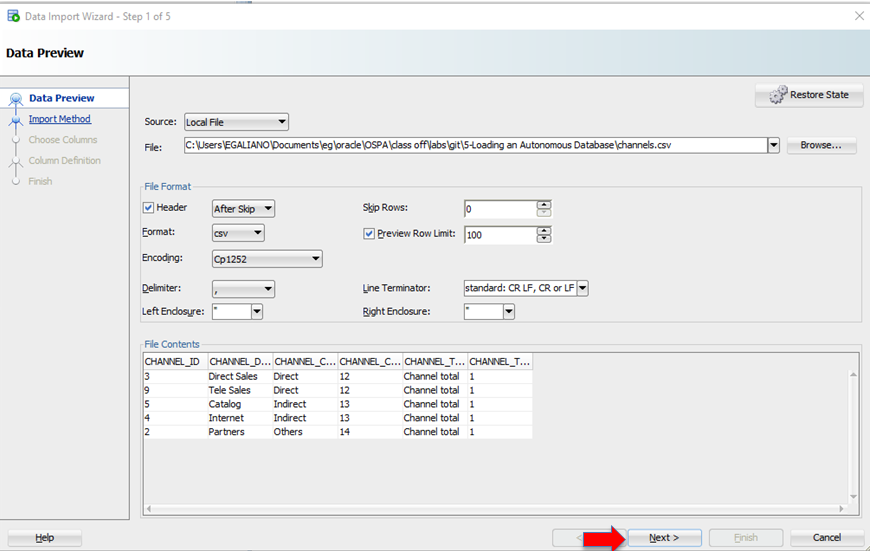
<p align="center">Figure 2-3</p>

4. Click **Next** and you will be placed on the Import Method screen. The Import Method
should be **Insert**. Fill in the **Table Name** call it **CHANNEL**

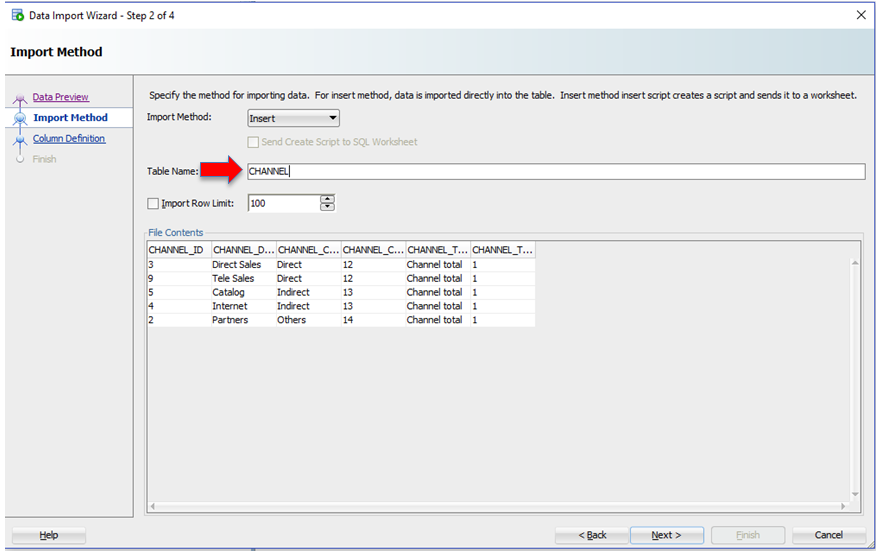
<p align="center">Figure 2-4</p>

5. Click Next and you will be in the **Choose Columns** screen. All Columns should be
on the right hand side indicating they are selected. In this screen you could
remove columns you do not want inserted.

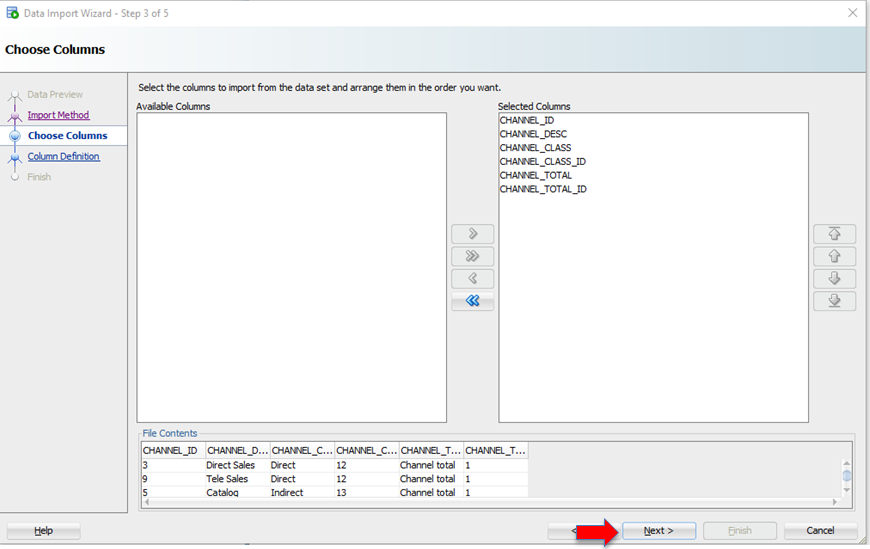
<p align="center">Figure 2-5</p>

6. Click **Next** and you will be in the **Column Definition** Page. For each column in the
file you can define the Name, Data Type and other properties. SQL Developer
makes an educated guess based on the values it sees in the columns. We will not
change any definitions here, but if you want to investigate you can click on
every “Source Data Columns” and see what type SQL Developer guessed.

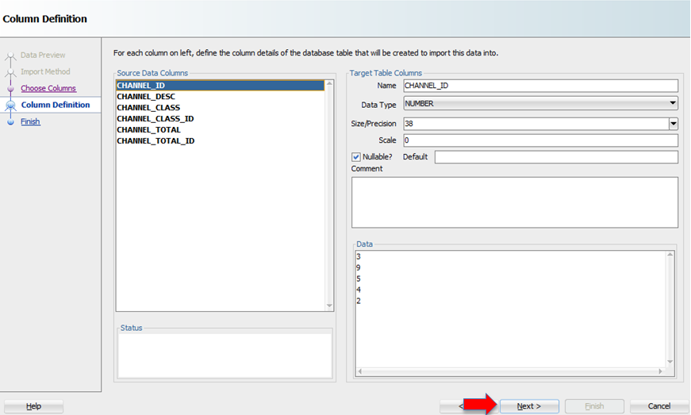
<p align="center">Figure 2-6</p>

7. Click **Next** and you will be in the summary page. Click **Finish** to start the load.

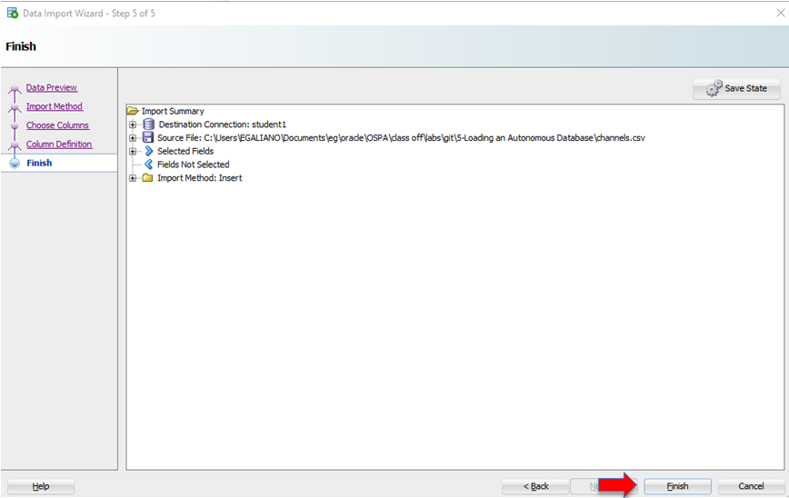
<p align="center">Figure 2-7</p>

8. When the import completes, an information screen will be displayed indicating
the load was successful (click **OK** when done viewing)

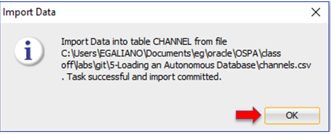
<p align="center">Figure 2-8</p>

9. Hit the Refresh Button on the Connection Window and open the tables tab again,
You will now see the **CHANNEL** Table you just created displayed there.

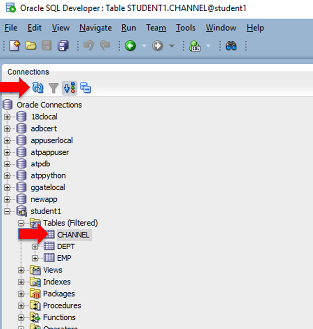
<p align="center">Figure 2-9</p>

10. Go back to the Worksheet screen and erase the code you have there (hit the
eraser button) and copy and paste the SQL below and run it like you did before. In the Script Output you will see the data you loaded into the table you just created.

```
select * from channel;
```

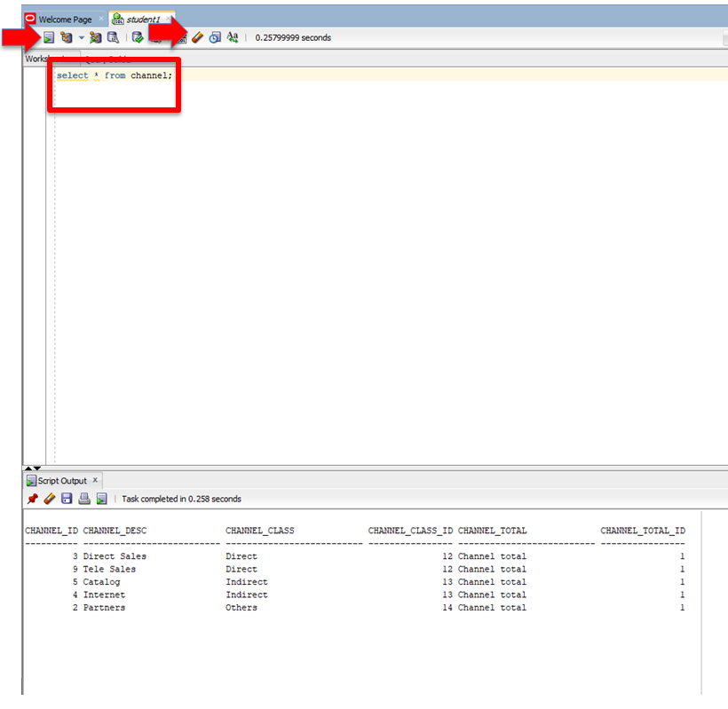
<p align="center">Figure 2-10</p>

You have queried the table you just created and loaded with SQL Developer from
your text file on your local machine.


**You have successfully created, loaded, and queried tables in Autonomous Database**

***END OF LAB***

[Back to Top](#table-of-contents)   
