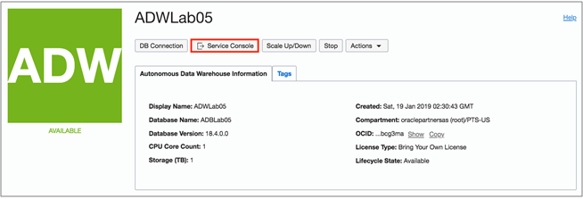
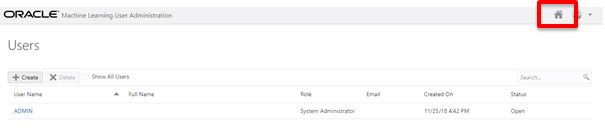
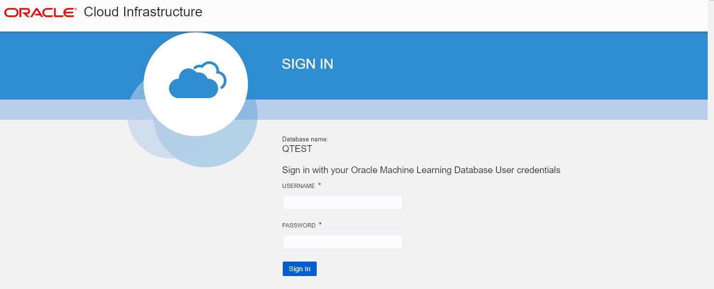
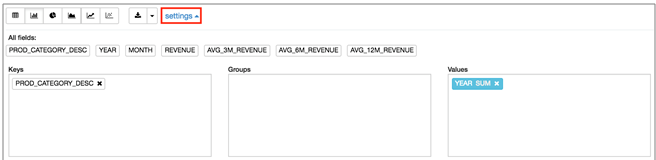
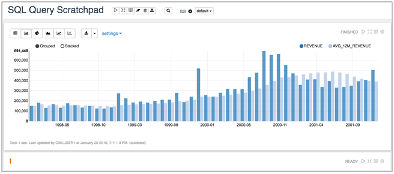
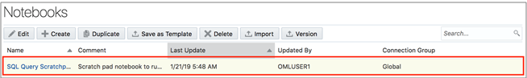
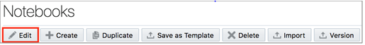

## Who Should Complete This Lab: All Participants

# Using Oracle Machine Learning

## Table of Contents

- [Module 1: Sign-In to Autonomous Database Service Console](#module-1--sign-in-to-autonomous-database-service-console)
- [Module 2: Sign-In and Explore the OML Home Page](#module-2--sign-in-and-explore-the-oml-home-page)
- [Module 3: Running a SQL Statement](#module-3--running-a-sql-statement)
- [Module 4: Saving the SQL as a New Notebook](#module-4--saving-the-sql-as-a-new-notebook)
- [Module 5: Creating and Running SQL scripts](#module-5--creating-and-running-sql-scripts)

****

Using Oracle Machine Learning
-----------------------------

Oracle Autonomous Database includes a built-in, browser-based SQL notebook tool
called **Oracle Machine Learning**. It provides an interactive data analysis
environment where teams can work together to build shared, sophisticated reports
and dashboards. It is perfect for data scientists, SQL report builders and SQL
developers and business analysts.

In this lab you will be using the **Oracle Machine Learning** notebook
application provided with autonomous database.

## Module 1:  Sign-In to Autonomous Database Service Console

If you received an email with a link to the Oracle Machine Learning Login Page when your account was created in the previous lab (like the one in the picture below), you can click on the link and proceed directly to Module 2. 

  
Figure 1-1

Otherwise review the steps to connect to OML in Lab 4 - Module 4. A brief review follows. 
1. Log into your Oracle Cloud Account and navigate to the Autonomous Database Service Console.

2. Browse to your **Autonomous Database** page for the appropriate database you created in the earlier lab.

3. . From the **Autonomous Data Warehouse Details** (in this case) page, click on **Service
    Console** to sign in to the service console.

Figure 1-4

4. From the Service Console select **Manage Oracle OML Users**

[Back to Top](#table-of-contents)

## Module 2:  Sign-In and Explore the OML Home Page

After selecting Manage Oracle ML Users you will be placed in the OML Administration page.

1. Sign-in to OML using the link from the welcome email, or by clicking
    the **Home** button on the top right of **Oracle Machine Learning** User Administration**.

     
       
Figure 2-1

2. Sign-in using your **OML** user created in the earlier lab.

    
           
Figure 2-2

3. Once you have successfully signed-in to OML the **Oracle Machine Learning**
    home page will be displayed.

    
           
Figure 2-3

4. The grey menu bar at the top of the screen provides links to the main OML
    menus for the application (left corner) and the workspace/project and user
    maintenance on the right-hand side.

    
           
Figure 2-4

5. On the home page the main focus is the **Quick Actions** panel. The icons in
    this panel provide shortcuts to the OML pages for running queries and
    managing your saved queries.

    
           
Figure 2-5

>   **Key OML Concepts**

>   **What is a Workspace?** A workspace is an area where you can store your
>   projects. Each workspace can be shared with other users so they can
>   collaborate with you. For collaborating with other users, you can provide
>   different levels of permission such as Viewer, Developer and Manager – these
>   will be covered in more detail later in this workshop. You can create
>   multiple workspaces.

>   **What is a Project?** A project is a container for organizing your
>   notebooks. You can create multiple projects.

>   **What is a Notebook?** A notebook is a web-based interface for building
>   reports and dashboards using a series of pre-built data visualizations which
>   can then be shared with other OML users. Each notebook can contain one or
>   SQL queries and/or SQL scripts. Additional non-query information can be
>   displayed using special markdown tags (an example of these tags will be
>   shown later).

>   **Note:** All your work is automatically saved – i.e. there is no **Save**
>   button when you are writing scripts and/or queries.

[Back to Top](#table-of-contents)

## Module 3:  Running a SQL Statement

1. From the home page click on **Run SQL Statement** in the **Quick Actions**
    panel to open a new SQL query scratchpad.

    
           
Figure 3-1

-   If this is your first time exploring this link, the notebook server will
    startup.

    
               
Figure 3-2

-   You will be presented the **SQL Query Scratchpad**.

    
               
Figure 3-3

-   The white panel below the title **SQL Query Scratchpad** is an area known as
    **Paragraph**. Within a scratchpad you can have multiple paragraphs. Each
    paragraph can contain one SQL statement or a SQL script.

2. You need to enter the SQL in **SQL Paragraph**. 

***
    SELECT

    p.prod_category_desc,

    t.calendar_year as year,
    t.calendar_month_desc as Month,

    TRUNC(SUM(amount_sold)) as revenue,

    TRUNC(AVG(SUM(amount_sold)) over (PARTITION BY t.calendar_year ORDER BY
    p.prod_category_desc, t.calendar_month_desc ROWS 2 PRECEDING)) as
    avg_3M_revenue,

    TRUNC(AVG(SUM(amount_sold)) over (ORDER BY p.prod_category_desc,

    t.calendar_month_desc ROWS 5 PRECEDING)) as avg_6M_revenue,
    TRUNC(AVG(SUM(amount_sold)) over (ORDER BY p.prod_category_desc,

    t.calendar_month_desc ROWS 11 PRECEDING)) as avg_12M_revenue
    FROM sh.sales s, sh.times t, sh.products p

    WHERE s.time_id = t.time_id

    AND s.prod_id = p.prod_id

    AND prod_category_desc = 'Electronics'

    GROUP BY p.prod_category_desc, t.calendar_year, calendar_month_desc

    ORDER BY p.prod_category_desc, t.calendar_year, calendar_month_desc;

***

-   Your screen should now look like this:

    
               
Figure 3-4

3. On the top-right, click (**Run this Paragraph)** to execute the SQL statement.

    
               
Figure 3-5

-   The results will be displayed in a tabular format as follows:

    
               
Figure 3-6

#### Changing the Report Type

-   Using the report menu, you can change the table to a graph and/or export the
    result set to a CSV or TSV file.

    
               
Figure 3-7

-   When you change the report type to one of the graphs, then a Settings link
    will appear to the right of the menu which allows you to control the layout
    of columns within the graph.

4. Click on the **Bar Chart** icon to change the output to a bar graph (see
    below)

    
               
Figure 3-8

5. Click on Settings to unfold the settings panel for the graph.

   
              
Figure 3-9

6. To add a column to one of the **Keys**, **Groups** of **Values** panels just
    drag and drop the column name into the required panel.

7. To remove a column from the **Keys**, **Groups** of **Values** panel just
    click on the “x” next to the column name displayed in the relevant panel.

#### Changing the Graph Layout

-   With the graph settings panel visible:

8. Remove all columns from the both the **Keys** and **Values** panels.

9. Drag and drop **MONTH** into the **Keys** panel

10. Drag and drop **REVENUE** into the **Values** panel

11. Drag and drop **AVG_12M_REVENUE** into the **Values** panel

-   The report should now look like the one shown below.

    
               
Figure 3-10

#### Cleanup the Report

12. Click on the Settings link to hide the layout controls.

13. Click on **Hide editor** button which is to the right of the “Run this
    paragraph” button.

    
               
Figure 3-11

-   Now only the output is visible.

    
               
Figure 3-12

 [Back to Top](#table-of-contents)

## Module 4:  Saving the SQL as a New Notebook

-   The SQL Scratchpad in the previous section is simply a default type notebook
    with a system generated name. But we can change the name of the scratchpad
    we have just created SQL Query Scratchpad.

1. Click on the hamburger menu on top left and then click on **Menu** to return to the OML home page.

    
               
Figure 4-1

-   Notice that in the **Recent Activities** panel there is a potted history of
    what has happened to your SQL scratchpad Notebook.

    
                   
Figure 4-2

2. Click on **Notebooks** in the **Quick Actions** panel.

    
                   
Figure 4-3

-   The **Notebooks** page will be displayed:

    
                   
Figure 4-4

-   Let’s rename our **SQL Query Scratchpad** notebook to something more
    informative.

3. Click on the row **Notebook** so it gets highlighted and the menu buttons
    above will activate.

     
                    
Figure 4-5

4. Click on the **Edit** button to pop-up the settings dialog for this
    notebook.

    
                   
Figure 4-6

5. Enter the information as shown in the image below (note that the connection
    information is read-only because this is managed by the autonomous
    database). Click **OK** to save your notebook.

    
                   
Figure 4-7

-   You will see that your SQL Query Scratchpad notebook is now renamed to the
    new name you specified.

    
                   
Figure 4-8

[Back to Top](#table-of-contents)

## Module 5:  Creating and Running SQL scripts

1. The **Run SQL Statement** link on the home page allows you to run a single
    query in a paragraph. To be able to run scripts you can use the **Create a
    SQL Script** link on the home page.

    
                       
Figure 5-1

2. A new SQL scratchpad will be created with the **%script** identifier already
    selected; this identifier allows you to run multiple SQL statements.

    
                           
Figure 5-2

3. Next, we are going to use a script shows how to use the SQL pattern matching
    MATCH_RECOGNIZE feature for sessionization analysis based on JSON web log
    files.

4. [Download](https://www.dropbox.com/s/wjzixmv2xzihg1i/oml_sql2.sql?dl=0) the
    OML Script, open the script in your favorite editor and **Copy** the
    contents.

5. Paste the script to the **%script** paragraph:

    
                           
Figure 5-3

6. You can then run the script/paragraph and the output will appear below the
    code that makes up the script.

    
                           
Figure 5-4

-   The result should look something like this:

    
                           
Figure 5-5

**You have successfully completed the Oracle Machine Learning Lab.**

***END OF LAB***

[Back to Top](#table-of-contents)  
