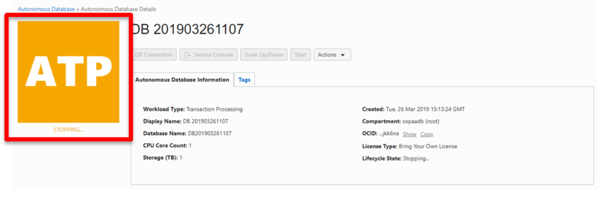
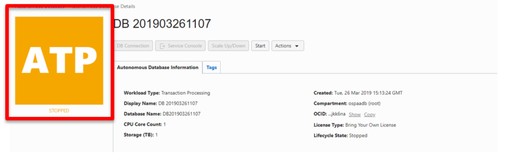
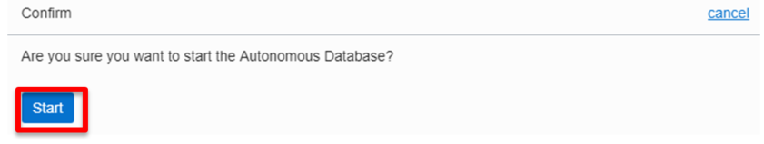
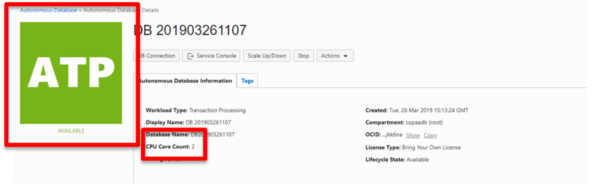
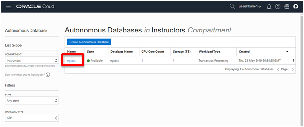
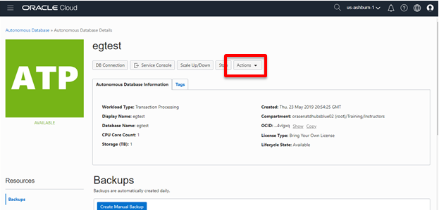
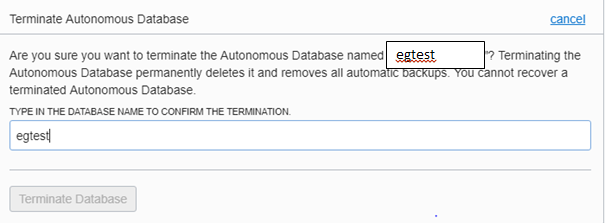
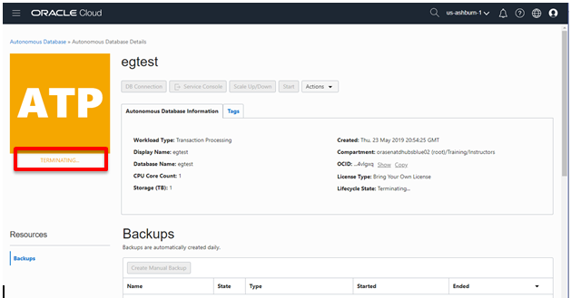
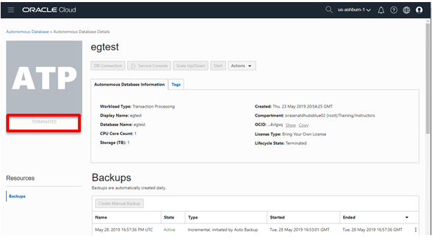
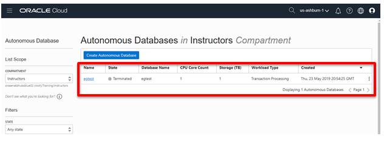

## Who Should Complete This Lab: One Person Per Group

# Start, Stop, and Scale Autonomous Database

## Table of Contents

- [Module 1: Stopping the Autonomous Database](#module-1--stopping-the-autonomous-database)
- [Module 2: Starting the Autonomous Database](#module-2--starting-the-autonomous-database)
- [Module 3: Scaling the Autonomous Database](#module-3--scaling-the-autonomous-database)
- [Module 4: Delete Autonomous Database and Clean Up Environment](#module-4--delete-autonomous-database-and-clean-up-environment)

***** 

Start, Stop, and Scale Autonomous Database
==================================================

This section outlines the tasks for starting and stopping the service and
scaling the Autonomous Database.

### Objectives

-   Start and Stop the Autonomous Database service

-   Scale the Autonomous Database service

## Module 1:  Stopping the Autonomous Database

1. Sign in to your Autonomous Database **Service Console** and browse to the
A**utonomous Database Details** page of your service. Select the Stop button.

Figure 1-1

The ADB service will go into stopping status. Notice the status of **STOPPING**.

Figure 1-2

When the service is stopped, the status will change to **STOPPED**.

Figure 1-3

[Back to Top](#table-of-contents)

## Module 2:  Starting the Autonomous Database

1. From the **Details** page of your ADB service, click **Start** to start your
service.

Figure 2-1

2. Click **Start** again when prompted for confirmation.

Figure 2-2

The ADB service will take a few seconds to start. For example, if you
provisioned ATP service, you would notice the status of **STARTING** as follows:

Figure 2-3

When the service is started, the status will change to **AVAILABLE**.

Figure 2-4

[Back to Top](#table-of-contents)

## Module 3:  Scaling the Autonomous Database

1. From the **Details** page of your ADB service, click **Scale Up/Down** to scale
your service.

Figure 3-1

2. In the **Scale Up/Down** pop up, modify the **CPU CORE COUNT** to **2** and
click **Update**. In this same screen you can change your Storage allocation up or down. They can be done at the same time or independently.

Figure 3-2

The ADB service will scale. Notice the status of **SCALING IN PROGRESS**. Note
that the ATP square remains green during the scaling process. No interruption to
the service occurs during all scaling operations.

Figure 3-3

When the scaling task is complete, the status will change to **AVAILABLE**. Note
the new **CPU Core Count** is reflected in the service details.

Figure 3-4

3. Use the same process to scale the system back down to 1 CPU by making the CPU
Core Count 1 in the scale pop-up.

[Back to Top](#table-of-contents)

## Module 4:  Delete Autonomous Database and Clean Up Environment

After you finish all the labs, its important to clean up the environment so the next group has available resources. In this module you will terminate your Autonomous Database so the resources are released. In this example s database called **egtest** is terminated. You should **only** terminate the database your created and be careful not to terminate another groups database.

1. From the **Database Console** page of your ADB service, click on your database.

Figure 4-1

2. From the **Database Details** page of your ADB service, click on the **Actions** drop down 

3. Select **Terminate** your service.

Figure 4-2

Figure 4-3

4. A **Terminate Autonomous Database** pop up appears, type in your  **Database Name** to confirm you want to delete it, then click **Terminate Database**

Figure 4-4

5. The Database Details console will reappear showing the database **Terminating**

Figure 4-5

6. After a few minutes the database will show **Terminated**

Figure 4-6

In the Database Console page you will notice that the database remains in **Terminated** status. It takes about 24 hours for the database to dissapear from the Console, but it is no longer active or consuming resources.

Figure 4-7

**This concludes the starting, stopping, scaling  and terminating lab.**

***END OF LAB***

[Back to Top](#table-of-contents)  
