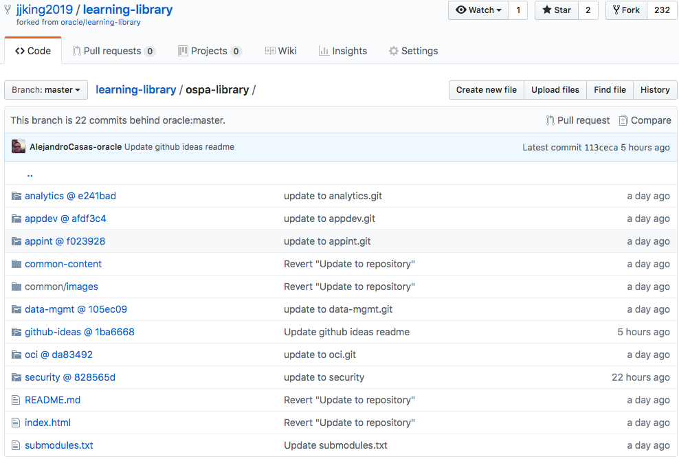

## Library for GitHub OSPA Discussion
### Objectives
* Agree to common method for creating OSPA Hands-On Lab documentation using GitHub.
* Begin to develop standard methodology for OSPA teams.
* Determine best mechanism for document creation, edit, and deployment.

### Issues :warning:
* Only selected **OSPA GitHub Admin** individuals will be able to modify Oracle GitHub's Learning-Library/ospa-library repository(Ale, Dan, John, so far...) Having repository "gatekeepers" will avoid conflicts on the production repository.
* OSPA management has decided upon individual folders for different teams/products/labs; to date they are: 
  * analytics
  * appdev 
  * appint 
  * data-mgmt
    * adw 
    * atp 
    * big-data-service
    * db19c
    * exadata-cloud 
    * migration 
  * nosql 
  * oci
  * security
 
* GitHub and Git do not support modification (Cloning, Branching, Merging) of individual files and/or folders; so, 'Clones' and 'Branches' are copies of entire Oracle Learning Library.
* GitHub repositories (repos) have limitations on size of individual files **(100MB)** and total size of repository **(1GB)**.
### Contents
* Contents stored on GitHub will be:
  * .md (Markdown) files - These are the main files containing labs instructions
  * .html (HTML5) files - [Optional] If developers want to wrap the content and make it available on a static web site
  * misc. SMALL lab files [Optional]
  * larger files will be **LINKED-to** not included in-line [Optional]
* We are using Git "submodules" so that each folder's matching "Developer Repository" is available to developers without the need for them to deal with the "Staging Repository". 

   __This adds the current "pointer/address" to the entry that appears in the GitHub folder list online (see image below)__

* Developers will create and modify content in the "Developer Repository" along with their team members; when ready to move to "Staging Repository" developers will ask "Admins" to update the "Staging Repository" and ultimately production learning-library.
* Content should be simple and limited to only what is needed to complete the lab; this might include text, partial screenshot pictures, and other things that help the learner complete the demo. 
 -- THIS IS NOT A MARKETING TOOL NOR A PRESENTATION AND "NORMAL" LP FORMATTING MAY NOT APPLY
 ---- No need for "section header" and "title" images; keep images small and to the point if used at all
 ---- These are lab guides; keep it simple and easy; link to complex explanations, videos, etc...

* Developers will be responsible for CE and QA of their own material; peer review will be essential
* Documents will be stored in "Developer Repositories" connected to the appropriate folders in learning-library/ospa-library
  * Developers might create entirely new documents
  * Developers might modify existing documents
* We have added a 'common-content' folder (managed by the Admins) containing assets to be used when creating HTML files to provide a common 'wrapper'
* We have added a 'common/images' folder where developers may add images to be shared cross-team
* We have added a Slack channel 'go-ospa-github' for all to share; Developers and Admins will use it to communicate back-and-forth
* Once our process is finalized we will need a webcast recording to show developers the process and tools required to build content 
### Tooling
* We suggest a simple editor for Markdown like the Microsoft Visual Studio Code tool available on [MyDesktop](http://mydesktop.oraclecorp.com/myd/myd_software_licenses.show_complete_list) though any text editor will do

### Mechanism
* Three-level OSPA repository (repo) scheme
   1. Oracle Learning-Library (production, https://github.com/oracle/learning-library)
   1. OSPA Learning-Library (staging, one of John's today  https://github.com/jjking2019/learning-library will transition to "OSPA-specific" GitHub account and replace "jjk2019" at some point in the future)
   1. One 'Developer Repository' ('Developer Repo') for each folder identified earlier 
      1. analytics, appdev, appint, data-mgmt, oci, security, and github-ideas
       (jjk2019/analytics, jjk2019/appdev, jjking2019/data-mgmt, etc.)
      1. data-mgmt will be by shared by developers and has a folder for each of the sub-areas: adbcertificationlabs, adw, atp, big-data-service, db19c, exadata-cloud, migration, and nosql - each developer with access to the data-mgmt Developer Repository must be careful not to accidentally modify topics they are not involved with
      1. Developers will have full authority to Developer Repos   **Note: Developers must have "generic, not-necessarily Oracle" GitHub accounts**
      1. Developers will create, modify, and review documents in Developer Repos
      
   [Rationale behind three-level repository](threelevel.md)

#

### Suggested Workflow(s)
   1. (If new) Developer checks to see if appropriate folder already in repository; if not, request from "Admins" who will create necessary folder and matching "Developer Repository" 
   1. Developer creates local GitHub directory/folder structure and clones "Developer Repository" (appdev used as example below; change as appropriate)
      1. mkdir github  **(you pick the folder name here)**
      1. cd github **(your folder)**
      1. git init
      1. git clone https://github.com/jjking2019/appdev.git (copies Developer Repo locally; will create local folder for appdev contents)
   1. Developer creates (or gets from somewhere) desired content using approved MS Word template
   1. Developer runs supplied script to convert the .docx (MS Word) file into .md format (what GitHub needs)
   1. Developer copies (any method) document and images folders into
      local github folder created above
   1. Developer makes sure document is in proper form (.md, .html), that images and formatting are as desired, and that all large files are linked-to rather than part of document (Confluence, OraDocs, LCMS, etc...) 
   1. Developer will commit changes and push them to the appropriate "Developer Repo" (e.g. appdev) using desktop tool or command-line
      1. git add .
      1. git commit -m "some helpful comment goes here"
      1. git push
   1. Developer (peers, maybe manager, maybe testers...) review content in GitHub; repeat #2-#8 cycle (above) until happy
   1. Developer notifies "admin" that "Developer Repo" is ready to go
   1. Admin synchronize from "Developer Repo" into "Staging Repo" using script (with minimal review, CE/QA are developer team's responsibility)
      1. Admin runs script (in-house script, see picture below)
      1. Admin selects developer repository to update
      1. Changes are automatically committed to Staging repository
      1. Admin lets developer know content is ready for testing
      
      
      
      
   1. Developer (and team) review document in "Staging Repo" and let Admin know when ok
   1. Admin creates __PULL REQUEST__ asking oracle/learning-library admins to  __MERGE__ changes "Staging Repo" to "Production Repo"
   1. Developer performs final check of "Production Repo"
   
   
   
   

### Demo
We were asked to create a "live demo" of how this will work; here are the steps we will follow:

1. John will demo [oracle/learning-library/ospa-library](https://github.com/oracle/learning-library) ("Production Repo"); [jjking2019/learning-library/ospa-library](https://github.com/jjking2019/learning-library) ("Staging Repo"), and the "Developer Repos"
1. Ale will create new document for security folder and post to ospa-security "Dev Repo"
1. Ale (and peers/manager) will review content
1. Ale will let John know (email or slack) that changes are ready to go
1. John will push content to "Staging Repo"
1. Ale (and peers/manager) will review on "Staging Repo"
1. Ale will let John know changes ok
1. John will merge changes to "Production Repo"
1. Ale will double-check on "Production Repo"

### Resources
[Resource page](resources.md)
