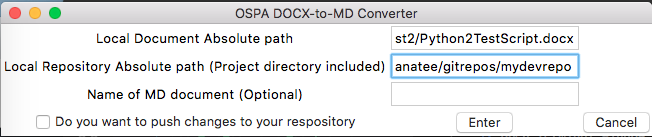

# **BETA** Scripts to convert .docx to .md **BETA**

### Ale is working on a couple of Python scripts - NOTE: Currently BETA!
* One for Python 2  [converter_beta.py](https://raw.githubusercontent.com/jjking2019/ospa-github-ideas/master/files/converter_beta.py)
* One for Python 3  [converter_py37.py](https://raw.githubusercontent.com/jjking2019/ospa-github-ideas/master/files/converter_py37.py)

### How do I know which version of Python I have on my machine? (you might have both)

1. Open Terminal window on Mac; Command window on Windows (__"cmd" command__ NOT "command")

1. Issue following command to see if you are on python 2

   `python --version`

1. Issue following command to see if you are on python 3

   `python3 --version`

### Run the appropriate command from the command line

 `python converter_beta.py`

 `python3 converter_py37.py`

 ### You will see a dialog that looks like this:

  

1. Fill in complete file path to docx file 
   (we're working on a version that lets you 'browse')
   
   PC
   (C:\Users\Manatee\Documents\mymswordfile.docx)
   
   Mac
   (/Users/Manatee/Document/mymswordfile.docx)

1. Fill in path for local git repo
   (presumes you have 'cloned' Dev Repo)

   C:\Users\gitrepos\AppDev
   /Users/gitrepos/AppDev

  

1. Click "Enter" to convert .docx file to .md in chosen repo; you should see the following when complete

  

### The original .docx file will now be found in your local repository converted to .md with all GitHub formatting

* You still need to change all .tiff images to .png or .jpg that GitHub will recognize (batch tools work best)
* You still need to modify the .md file to change the image suffixes from .tiff to .png or .jpg (whatever you created)
* Now you are ready to clean-up the document as desired

