## Workflow - [RETURN](README.md)

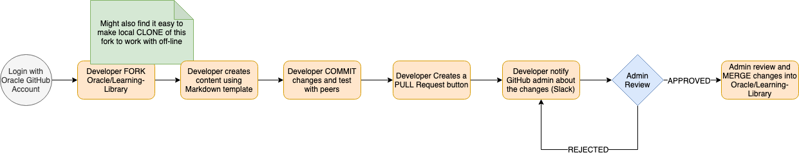

1. Developer FORKs https://github.com/oracle/learning-library (see GitHub and Git docs) might also find it easy to make local CLONE of this fork to work with off-line

   - Start with oracle/learning-library   
   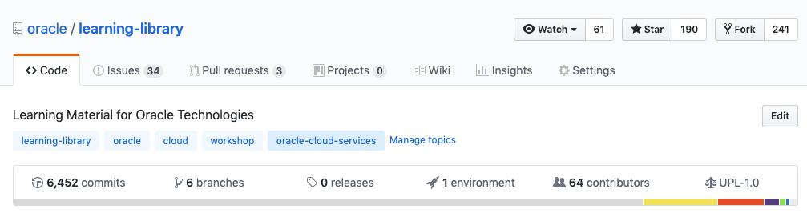

   - Click 'Fork' (upper-right corner)  
   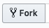

   - Select your GitHub account  
   

   - You now have your own "Fork" of the Repo  
   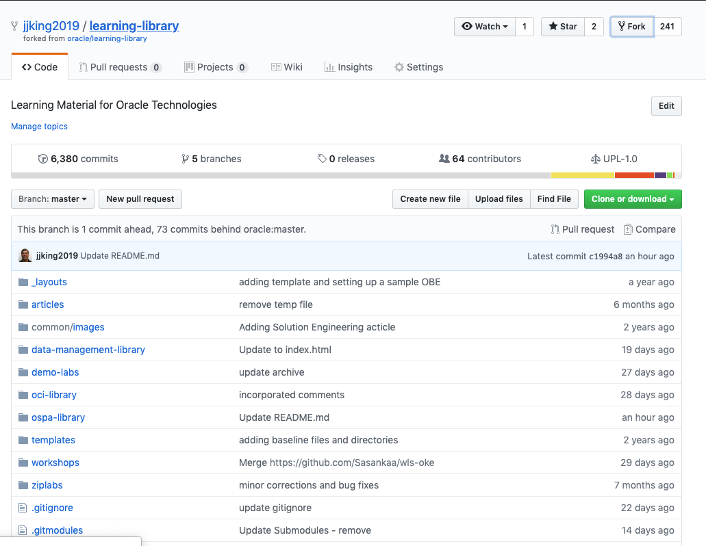

1. Developer creates (or gets from somewhere) desired content conforming to team Markdown template adds to ospa-library folder 
   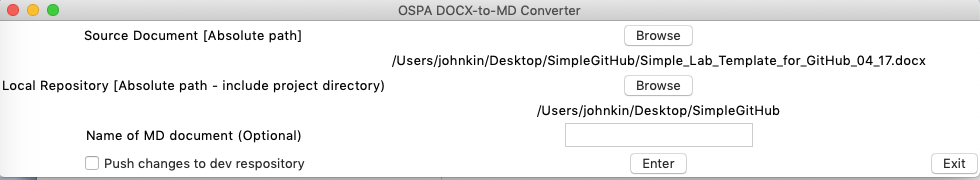 
   
1. Developer will COMMIT changes and test with peers (might make more changes and then COMMIT/test again)  
   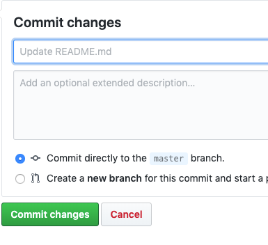
   
1. Developer will generate PULL REQUEST  

   - Click the "Pull Request" icon  
   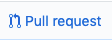  
   
   - Click "Create Pull Request" button  
   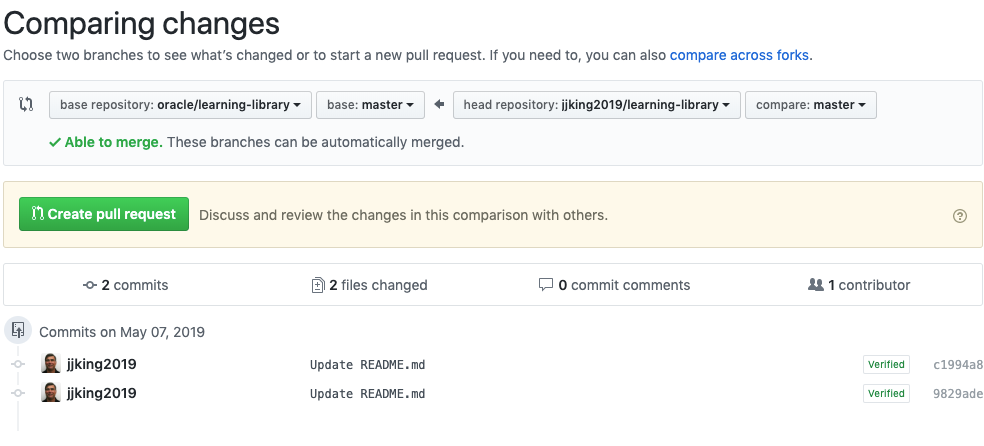    
   
   - Provide a comment and click "Create Pull Request" button 
   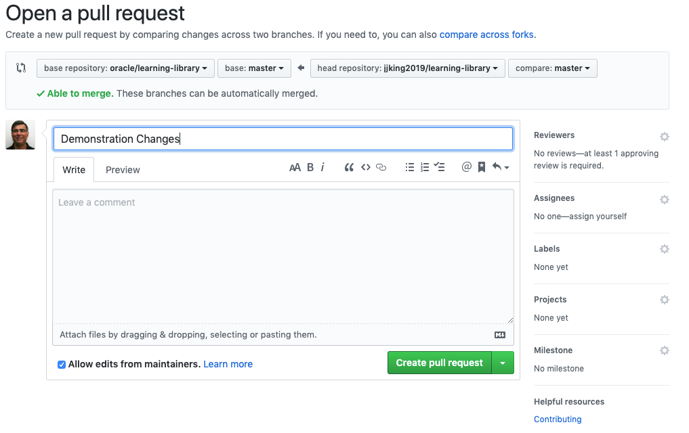  
   
   - You will see the request is waiting for review  
   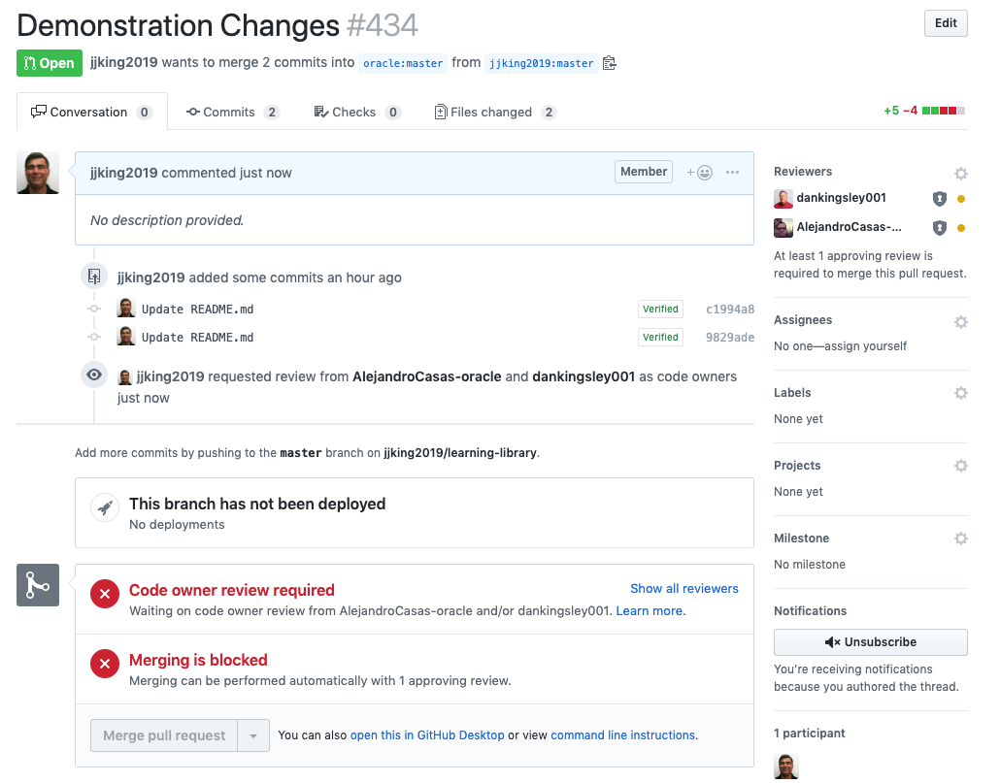

     
1. Developer notifies "admins" using go-ospa-github Slack channel that changes are ready to go  
     
   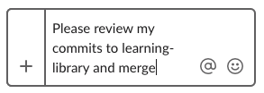

1. Admin reviews changes and if ok MERGEs changes into oracle/learning-library
