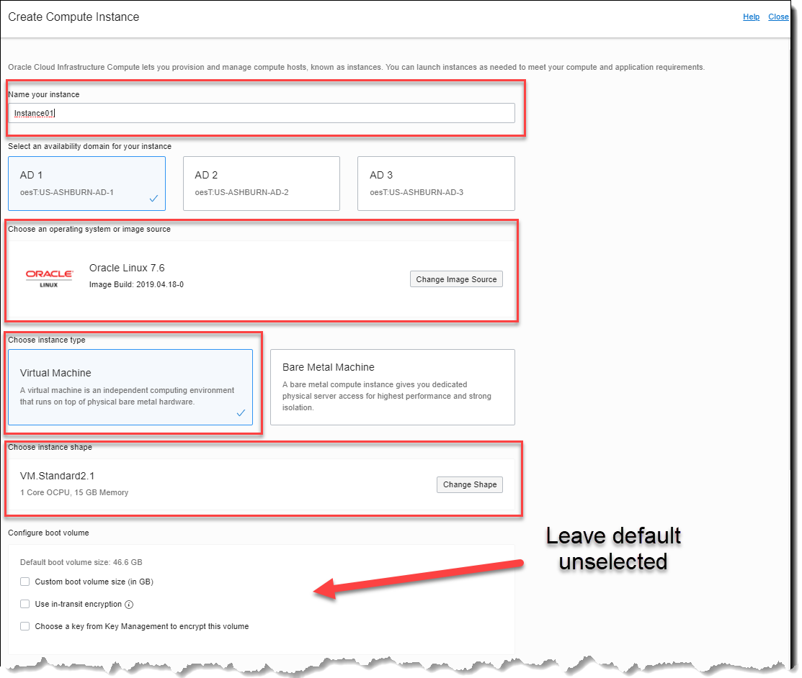
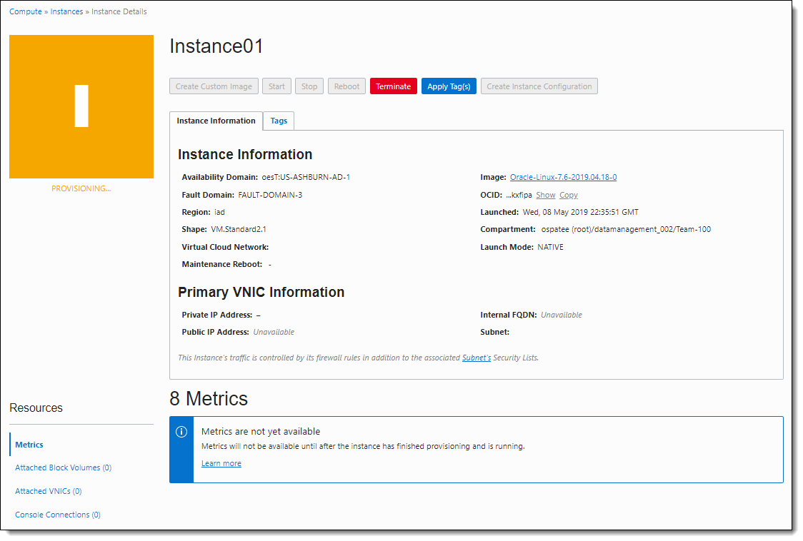
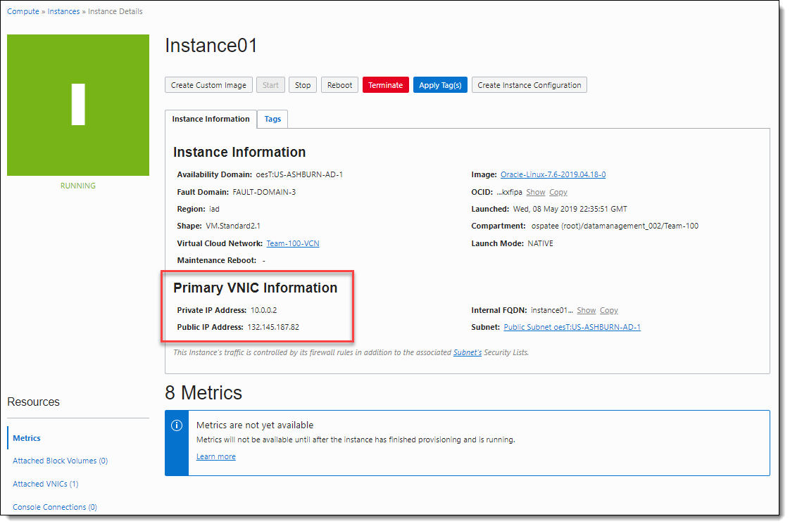

## Class of SE - HOL Part 3 - Creating and accessing an instance

Contents

[Section 6. Create SSH Key Pair (Linux, Mac, Windows client)](#create-ssh-key-pair-linux-mac-windows-client)

[Section 7. Create a Compute Instance](#create-a-compute-instance)

[Section 8. Access the instance](#access-the-instance)

## 

#

# Create SSH Key Pair (Linux, Mac, Windows client)

SSH keys are required to access a running OCI instance securely. You can use an existing SSH-2 RSA key pair or create a new one. Below are instructions for generating your individual key pair for Linux/Mac and Windows. You can also find instructions on the OCI documentation page.
<https://docs.cloud.oracle.com/iaas/Content/GSG/Tasks/creatingkeys.htm>

## Linux or Mac based Laptop  

1.  **Open** a terminal and type the ssh-keygen command.

    `[opc-instance]$ ssh-keygen -t rsa -N "passphrase" -b 2048 -C "<enteryourkeyname>" -f <enteryourkeyname>-key`

**Note:** *Don't lose your key or forget your passphrase, the key won't be usable without them.  Also, the passphrase isn't required for this lab but should be used for production as a security best practice.*

**ssh-keygen command switch guide:**

    -t – algorithm
    -N – “passphrase” Not required but best practice for better security
    -b – Number of bits – 2048 is standard
    -C – Key name identifier
    -f - \<path/root\_name\> - location and root name for files

*
 Figure 24: ssh-keygen command 
*

7.  The key pair you generated is now in the current directory.  Use the `ls -l` command to verify.

*
 Figure 25: Sample key pair with the example name of team-100.  Your key name should be different. 
*

8.  For Linux and Mac Clients copy the contents of the public key file (.pub). Use an editor or cat command to view the file and copy the key contents. You can use this for the ‘paste key’ dialog when launching an instance.

*
 Figure 26: Copy ssh key 
*

##  Windows

A third party SSH client needs to be installed for Windows versions prior to Windows 10 in order to generate SSH keys. You can use Git Bash, Putty, or a tool of your choice. This tutorial will use Putty as an example. Git Bash instructions are the same as the Linux instructions above.

**Note:** *If you don’t already have it, download the Putty application and install it on your Windows machine. [Download Putty](https://www.chiark.greenend.org.uk/~sgtatham/putty/latest.html).  Puttygen is a utility that comes with the Putty package and is used to generate SSH keys.*

<!-- end list -->

9.  From the Windows start menu, run the PuTTYgen utility

*
 Figure 27:  PuTTYgen utility command 
*

10. Click the Generate button and follow the instructions for generating random information.

*
 Figure 28: Generate the key with PuttyGen 
*

11. After the key information has been generated, enter a **passphrase** and press the **Save private key** button to save the key to your system.

**Note:** *A passphrase is not required but recommended for stronger security.*

*
 Figure 29: Putty save key dialog 
*

12. The private key should have the .ppk extension. Store it in a folder that’s easily accessible.

*
 Figure 30: Saving the private key 
*

**NOTE:**  *We will not use the ‘Save public key’ option in PuttyGen, as the keyfile is not compatible with Linux openSSH. Instead, we will copy and paste the key information into a text file.*

13. Left click on the Public key information and choose ‘Select All’ to select everything in the key field. Then left click again and copy the selected information to the clipboard.

*
 Figure 31: Save all and copy key to clipboard 
*

14. We will use the clipboard to paste the key information in the next step but you can also save your public key to a text file with Notepad. Open a plain text editor and paste the key information. Name and save the file with a .pub extension.

*
 Figure 32: Key pasted and saved with Windows Notepad 
*

15. Close the Puttygen application

# Create a Compute Instance

1.  Navigate to the OCI console, use the top left hamburger menu and choose **Compute \> Instances** to open the Instance Creation menu.

*
 Figure 33: Create Instance Menu item 
*

16. Verify that you're using the correct compartment and click the **Create Instance** button

*
 Figure 34: Create instance button 
*

*
 Figure 35: Information required to create an instance 
*

17. Enter information to create your compute instance.

**Note:** *Depending on available resources for Class of SE labs, you may need to select resources from a particular Availability Domain.   If resources aren't available, try another AD.  If in doubt, ask your instructor which AD you should utilize.*

| **Name:**                | \<instance name\> |
| ------------------------ | ------------------------------------------------ |
| Availability Domain: | AD of your choice, AD1, AD2, or AD3   |
| Operating System:    | Oracle Linux 7.6                            |
| Instance Type:       | Virtual Machine                             |
| Shape:               | VM.Standard2.1                              |
| Boot Volume:         | Default                                     |
| SSH Key:             | Choose SSH Key file or Paste SSH keys      |
| Compartment:         | Your compartment* (*ex:* team-100)     |
| VCN:                 | Your VCN* (*ex:* Team 100 VCN)              |
| Subnet Compartment:  | Your subnet compartment* (ex: team-100)     |
| Subnet:              | Public Subnet in your compartment*            |

18. In the **Add SSH Key** section you can select the SSH key file from your system or paste directly from the clipboard (if you’ve saved that information from the key generation step earlier)

*
 Figure 36: Choose SSH Key option 
*

*
 Figure 37:  Paste SSH key option 
*

19. In the Configure networking Section leave the default VCN and subnet information and click **Create**. 

*
 Figure 38: Create compute instance dialog 
*

Your instance will begin provisioning and should be in the available state within a few moments.

*
 Figure 39: Instance provisioning 
*

After a few moments, the icon will turn green and the title will change to RUNNING.

*
 Figure 40: Running instance and Primary VNIC information 
*

20. Take note of the Primary VNIC information which contains the assigned Public and Private IP Addresses.  You will need this information to access the instance later in the lab.  

# Access the instance 

We will use SSH through a terminal session to access the compute image. From there we will install the web application.

## SSH Key access for Linux/Mac 

1.  Use your favorite terminal program and issue the below ssh command to connect. Use the public IP address of your instance as referenced in the above screenshot.  (*The IP address listed is for example only, please use your own)*

21. Issue the following command.

    `ssh  opc@<your ip address>`

*
 Figure 41: SSH connection to running instance 
*

**Note:**  *If your SSH key is located somewhere else in your file structure, use `ssh -i <keyfile path/keyfile name> opc@xxx.xxx.xxx.xxx` to enable SSH to use your key.*

## SSH Key access for Windows with Putty

1.  For Windows clients, open Putty. With the Session category selected, enter the IP address for the instance you want to access and select SSH from the radio buttons (port 22).

*
 Figure 42: Putty session information 
*

22. In the Connection category, choose **Data** and enter ‘opc’ as the Auto-login username.

*
 Figure 43: Putty auto-login information 
*

23. In the **Connection \> SSH \> Auth** category, use the Browse button to navigate and load the .ppk file you created earlier with Putty.

*
 Figure 44: Putty private SSH key 
*

24. Navigate back to the **Session** category, enter a name in the **Saved Sessions** field and choose Save. Use any name you like for the session name in Putty.  This will save your SSH terminal session for use later without having to re-enter the information.

v

*
 Figure 45: Putty Save SSH Session 
*

25. Click on **Open** to connect to the instance.

v

*
 Figure 46: Open Putty Session 
*

26. Choose **Yes** on the alert message:

*
 Figure 47: Putty security alert 
*

27. You will be logged into the compute image:

*
 Figure 48: Successful Putty instance login 
*

This lab segment is complete.    If there is time left before the next lecture, browse the OCI cloud interface and familiarize yourself with the layout and basic services.  Wait for the instructor to let you know when to begin section 4.

[Back to top](#Class-of-SE---HOL-Part-3---Creating-and-accessing-an-instance)

##
