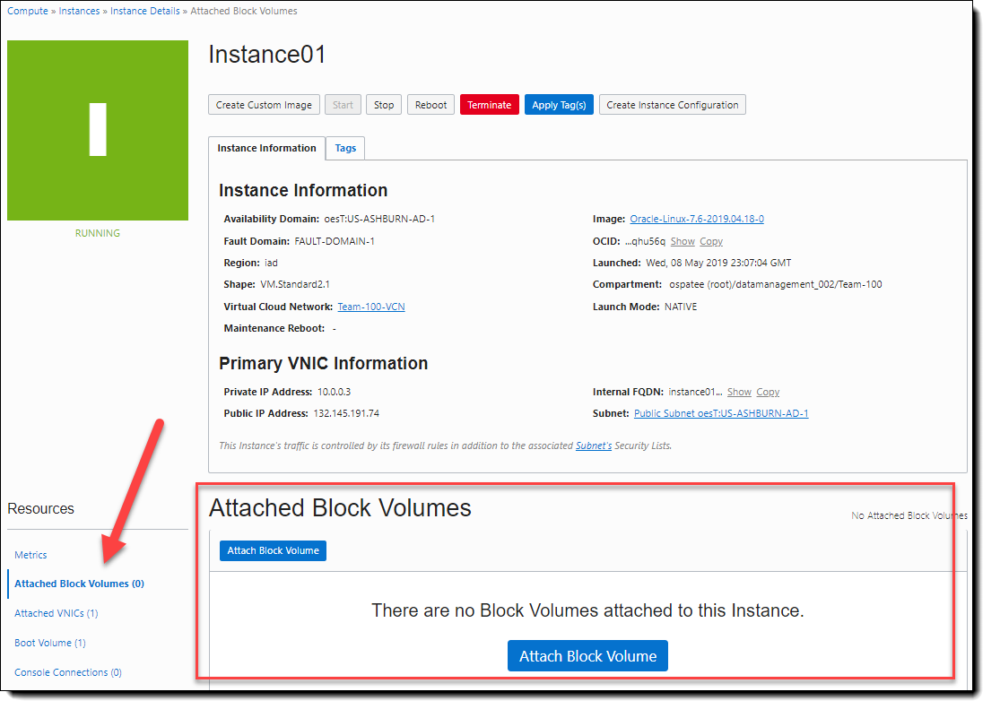
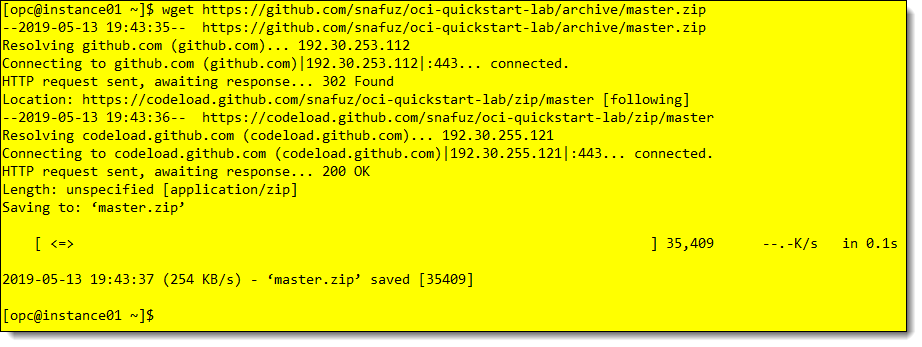
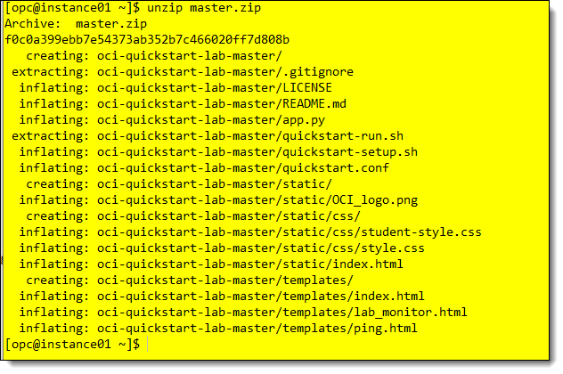
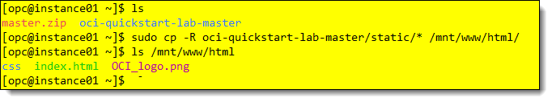

# Class of SE - HOL Part 4 - Block storage and application install

Contents

[Section 9. Block Volume  Service](#block-volume-service)

[Section 10. Install Web Application](#Install-Simple-Web-Application)

[Section 11. Delete Resources](#Delete-Resources )

[Section 12. Conclusion](#conclusion)

## 

# Block Volume Service
[Back to top](#Class-of-SE---HOL-Part-4---Block-storage-and-application-install)

In this section we will create and mount block volume storage.  Then we will install and configure a basic web server.

**Overview**

OCI Block Volumes can be created, attached, moved, and deleted as needed to support storage needs. Block volumes can be moved to another image without loss of data. In this portion of the exercise we will create a block volume and attach it to our instance.

## Create a block volume to increase capacity on an instance.

1.  Use the hamburger menu in the upper left of the OCI console and choose Block Storage > Block Volumes


*<p align="center"> Figure 49: Block Volume item selection </p>*

2.  In the Block Volumes dialog, verify that your compartment is selected and click on the Create Block Volume button


*<p align="center"> Figure 50: Create Block volume in assigned compartment </p>*

3.  Fill in the following details in the Create Block Volume dialog.

<!-- end list -->

- Name: *\<choose a name\>* ex: volume01
- Create in compartment: *\<your compartment\>*
- Availability Domain:
- Size: 50GB *(50GB is the minimum allowed. 32TB is the max)*
- Backup Policy: Gold
- Leave Encryption policy on the default selection

**Note:** *There are four backup policies, none, bronze, silver, and gold. You can learn more details about what’s included in each policy here. [Volume Backup
Policies](https://docs.cloud.oracle.com/iaas/Content/Block/Tasks/schedulingvolumebackups.htm)*


*<p align="center"> Figure 51: Create Block Volume dialog form </p>*

4.  Click on **Create Block Volume**, in a few moments the icon will turn green and your block volume will be provisioned.


*<p align="center"> Figure 52: Block Volume Available </p>*

5.  Attach the block volume to an instance.

6.  Navigate to the **Compute > Instances** menu to view instance.

7.  You can use the instance menu to attach a block volume. Click on the ellipses to view the menu, then select **Attach Block Volume**.


*<p align="center"> Figure 53: Instance action menu </p>*

8.  Or you can open the instance details menu, and click on the **Attached Block Volumes** item, and attach a block volume from there.  Click on either one to open the the attach block volume dialog.



*<p align="center"> Figure 54: Attach Block Volume </p>*

**Note:** *In the Attach Block Volume dialog you can select iSCSI or Paravirtualized as the attachment type. Paravirtualized will connect the volume directly without any further commands, but at a potential performance trade-off from iSCSI. iSCSI attach will require iSCSI commands to be run on the host. These commands are also provided for you in the interface.*

9. Fill out the dialog, choose iSCSI for the mount type, choose your compartment, the volume name you created earlier and click Attach. You can optionally specify a mount point or leave the device path unselected.  Leave CHAP, and Access at their defaults.


*<p align="center"> Figure 55: Attach block volume dialog </p>*

10. You will see a message about iSCSI attachment commands. Click **Close** to dismiss this message.


*<p align="center"> Figure 56: Attach block volume instuctions </p>*

11. When the volume finishes attaching, the icon will turn green with the Attached label below it. Click on the ellipsis and choose iSCSI Commands & Information


*<p align="center"> Figure 57: iSCSI command dialog </p>*

12. Copy the iSCSI attach commands using the copy link below each command set, or you can copy them one at a time if you wish.  You will paste the commands into your SSH terminal connected to the instance.  The commands can be run as the 'opc' user.


*<p align="center"> Figure 58: iSCSI commands and information </p>*

13. Go to the terminal window and issue the lsblk command to verify that nothing has been mounted yet.

    `opc@instance01 ~]# lsblk`


*<p align="center"> Figure 59: Linux lsblk command output </p>*

14. Issue the iSCSI commands you copied from the Block Volume interface. (Your commands will be different)

    `sudo iscsiadm -m node -o new -T iqn.2015-12.com.oracleiaas:b6eba360-f420-4b41-938e-917717a65ad7 -p 169.254.2.2:3260`

    `sudo iscsiadm -m node -o update -T iqn.2015-12.com.oracleiaas:b6eba360-f420-4b41-938e-917717a65ad7 -n node.startup -v automatic`

    `sudo iscsiadm -m node -T iqn.2015-12.com.oracleiaas:b6eba360-f420-4b41-938e-917717a65ad7 -p 169.254.2.2:3260 -l`


*<p align="center"> Figure 60: iSCSI commands to mount disk on the instance </p>*

15. Run the lsblk command to verify that the disk has been recognized by the operating system.
    
    `[opc@instance01 ~]# lsblk`


*<p align="center"> Figure 61: Linux lsblk command showing attached disk </p>*

16. Run the following commands to format the disk and mount it. Press 'Y' to proceed when prompted with the warning about formatting the entire device.

    `[opc@instance01 ~]# sudo mkfs –t ext4 /dev/sdb`


*<p align="center"> Figure 62: File system commands for mounted volume </p>*

`[opc@instance01 ~]# sudo mkdir /mnt/www`

`[opc@instance01 ~]# sudo mount /dev/sdb /mnt/www`

`[opc@instance01 ~]# df -h`

`[opc@instance01 ~# ls –l /mnt/www`


*<p align="center"> Figure 63: Linux mount commands for block volume </p>*

# Install Simple Web Application
[Back to top](#Class-of-SE---HOL-Part-4---Block-storage-and-application-install)

1. Switch to the ssh session and install the httpd server, Enter Command:

```sudo yum -y install httpd ```


*<p align="center"> Figure 64: Yum install httpd command </p>*

2. Adjust the firewall rules to allow http traffic, then reload the firewall utility.  The commands below will open port 80 for http and https traffic and reload the firewall.

```sudo firewall-cmd --permanent --add-port=80/tcp ```

```sudo firewall-cmd --reload ```


*<p align="center"> Figure 65: Firewall configuration </p>*

3. Start the web server.  

```sudo systemctl start httpd ```


*<p align="center"> Figure 66: Start the web server </p>*

4. In the next steps, we'll download a pre-configured web application and install it on our instance.  Download the application zip file and unzip the package into the opc home directory.  Use the *wget* command to download the static web application.

```wget https://github.com/dankingsley001/oci-dev/raw/master/Class-Of-HOL-01/static.zip```




*<p align="center"> Figure 67: Download http application </p>*

Unzip the file into the opc home directory.

```unzip static.zip```



*<p align="center"> Figure 68: Unzip the package </p>*

5. Create a new subdirectory on the mounted block volume.

```sudo mkdir -p /mnt/www/html```

6. Copy the web files into the newly created directory on the mounted block volume.

```sudo cp -R oci-quickstart-lab-master/static/* /mnt/www/html/```



*<p align="center"> Figure 69: Copy web files to the new directory </p>*

7. Use your favorite text editor to modify the httpd.conf file to point to the new default web directory. 

```sudo vi /etc/httpd/conf/httpd.conf```

8. Search for the string '/var/www' and replace it with '/mnt/www/html/' . There are 3 mentions in the file.


*<p align="center"> Figure 70: Replace http default home </p>*

9. Alter the firewall policy to allow access the the /mnt directory and restart httpd

```sudo chcon -R --type=httpd_sys_rw_content_t /mnt```

```sudo systemctl restart httpd```


*<p align="center"> Figure 71: Update security and restart httpd </p>*

10. Launch a web browser from your local system.  Enter the compute instance IP address.

```http://<your-compute-instance-ip-address>```

You should see the simple web application screen.


*<p align="center"> Figure 72: Successful application access </p>*

# Delete Resources
[Back to top](#Class-of-SE---HOL-Part-4---Block-storage-and-application-install)

It's nice to clean up after your work and free up resources in the tenancy for others.  In this section we'll delete the resources that we've created so we can start fresh later.  

We'll delete the resources in the reverse order that they were created in.

- Block volume
- Instance
- VCN

1. Login to the Oracle Cloud console and navigate to your instance and select the Attached Block Volumes option.  One the volume dialog choose the elipses to open the iSCSI command window.


*<p align="center"> Figure 73: Block Volume dialog </p>*

2.  Copy the iSCSI detach commands to the clipboard.


*<p align="center"> Figure 74: Copy iSCSI detach commands </p>*

3. Login to the instance via SSH and unmount the volume and issue the iSCSI detach commands.

```[opc@instance01 ~]$ sudo umount /mnt/www```
```[opc@instance01 ~]$ sudo iscsiadm -m not -T iqn... (copied command here)```

```[opc@instance01 ~]$ sudo iscsiadm -m node -o delete -T ... (copied command here)```


*<p align="center"> Figure 75: Detach block volume from instance </p>*

4. Return to the OCI Cloud console and open the **Attached Block Volumes** item, select the elipsis, and choose **Detach**.


*<p align="center"> Figure 76: Detach block volume console item </p>*

The detach menu item will bring up another window where you can also utilize the iSCSI detach commands directly, or continue with detachment through the OCI interface.


*<p align="center"> Figure 77: Continue block volume detachment </p>*


*<p align="center"> Figure 78: Confirm detach block volume </p>*

The volume icon will indicate 'detaching'.


*<p align="center"> Figure 79: Detaching in progress </p>*

5. The next step will be to delete the block volume and any backups that may have occurred.  The block volume dialog for the instance will be empty since we've detached the volume.  Navigate to the **Block Storage** section of the OCI menu and choose **Block Volumes**


*<p align="center"> Figure 80: Block volumes menu </p>*

6.  Choose the **Block Volume Backups** selection.  You may have more than one backup.  Choose the elipsis and click on **Terminate** to delete the block volume backup.


*<p align="center"> Figure 81: Block Volume Backups menu </p>*

Select **Terminate** to confirm the backup volume deletion.


*<p align="center"> Figure 82: Terminate Block Volume Backup </p>*

7.  Once the block volume backup is terminated, navigate to Block Volumes and click on the elipsis at the end of the volume you want to delete.  Choose **Terminate**.


*<p align="center"> Figure 83: Terminate Block Volume </p>*

Confirm termination.


*<p align="center"> Figure 84: Terminate Block Volume confirmation</p>*

8. After the volume has been terminated.  Navigate to the instance menu and choose the instance you created for this exercise.


*<p align="center"> Figure 85: Terminate instance </p>*

You will get a confirmation dialog.  Select **Permanently delete the attached Boot Volume** to remove the boot volume.  

**Note:** *You could preserve the boot volume for later use to save any customizations, but for this lab and tenancy we won't be using unnecessary storage space.*


*<p align="center"> Figure 86: Confirm instance termination </p>*

Your instance will begin termination.   It might take a few moments for the instance to reach the terminated state.


*<p align="center"> Figure 87: Instance terminating </p>*

9. We're almost done.  Navigate to the **Networking > Virtual Cloud Networks** menu item


*<p align="center"> Figure 88: Networking - VCN </p>*

Choose the elipsis at the end of the VCN item and choose **Terminate** to remove the VCN you created for this lab.


*<p align="center"> Figure 89: Terminate VCN </p>*

Review the confirmation dialog.  It will give you a list of items that will be deleted.  If you've created any extra gateways, security lists, or other VCN components, you may need to return and delete them manually.    

**Note:** *Once you click **Terminate All** the dialog will remove the items permanently.  If anything was created manually, or the routine can't delete it, you will need to remove the items manually.  But the deletion of major components will proceed no matter what.*


*<p align="center"> Figure 90: Terminate VCN Confirmation Dialog</p>*

You will receive a final confirmation of all that has been terminated.  Click the Close button.


*<p align="center"> Figure 91: Final Terminate VCN Confirmation Dialog</p>*

Remove any other resources you may have created at this point.    You are now finished with this lab.  You may log off of your cloud session if you wish.

# Conclusion

This lab introduced you to the Oracle Cloud Infrastructure service.  Let’s review what was accomplished.

You created a virtual cloud network, a compute instance, and block storage. You installed and configured a simple web application.  This lab was designed to quickly introduce you to a few of the many services you will use in the design of a customer solution and to familiarize you with those services.

## What you completed

  - Accessed your Oracle Cloud Account

  - Created a Compartment and a VCN

  - Created a compute instance

  - Created block storage

  - Accessed cloud instance

  - Installed web services

  - Terminated the resources


[Back to top](#Class-of-SE---HOL-Part-4---Block-storage-and-application-install)

##