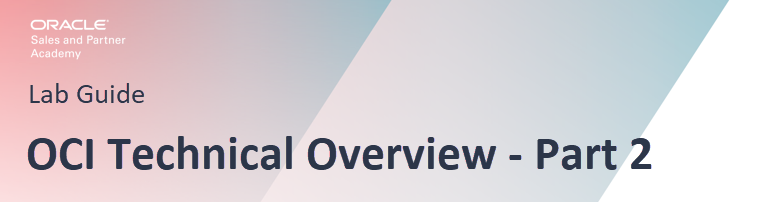

## Class of SE - HOL Part 2

#  Getting started with the OCI Command Line Interface (CLI)

## Contents

[Overview](#overview)

[Create a VCN](#create-a-vcn)

[Create a compute instance and install the OCI CLI](#create-a-compute-instance-and-install-the-oci-cli)

[Upload API keys and Verify Connectivity](#Upload-API-keys-and-Verify-Connectivity)

[Use the CLI to create a VCN](#Use-the-CLI-to-create-a-VCN)

[Launch a Compute Instance](#Launch-a-Compute-Instance)

[OCI Challenge - Create and Destroy resources](#OCI-Challenge---Create-and-Destroy-resources)

## Overview

Automation is critical when it comes to managing Cloud workloads at scale.  The OCI user interface is user-friendly, but it quickly becomes time-consuming if a customer needs to create many resources, or perform multiple, repetitive tasks.  The OCI Command Line Interface (cli) is where we can introduce automation and scripting to help customers become more fast and efficient with OCI.   

The cli is an Oracle tool based on Python that enables customers to work with OCI objects and services using a relatively easy to learn syntax. It's a small footprint utility that that can be used by itself, or along with the the web interface to accomplish OCI tasks.  The CLI is essentially a wrapper for API functions.  It can accomplish all of the tasks from the web interface plus it extends the functionality with commands not available in Web UI.   The cli uses Python running on Mac, Windows, or Linux and can be run from a shell, making it easy to write scripts to perform a series of commands.

This lab will show you the installation and configuration of the CLI, along with the execution of commands.  Upon completion of this lab you should have a good understanding of how to use the OCI CLI to automate common tasks in OCI.

## Requirements

- Oracle Cloud Infrastructure account
- Enough security access to create VCN and instances
- SSH capability
- Chrome browser is recommended

# Create a VCN
[Back to top](#Class-of-SE---HOL-Part-2)

In this first section, we'll create a VCN and an OCI instance.  We'll install and run the CLI commands from this instance in order to create more resources.

1. Sign in to the Oracle Cloud with your assigned tenant, user name and password.


*<p align="center"> Figure 1: Oracle Cloud Login</p>*

2. From the OCI Services menu, choose **Networking > Virtual Cloud Networks** 

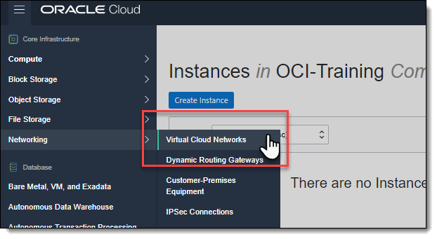
*<p align="center"> Figure 2: VCN Menu Selection</p>*

3. Ensure the correct compartment is selected and choose **Create Virtual Cloud Network**

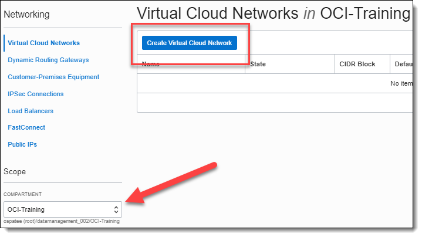
*<p align="center"> Figure 3: Create Virtual Network and compartment selection</p>*

Use the following information to fill out the VCN form:

   - **Name:** *Name of your choice* 
   - **Create in Compartment:** Verify your assigned compartment is selected
   - Select the **Create Virtual Cloud Network Plus Related Resources** radio button
   -  Click **Create Virtual Cloud Network**
   -  Confirm your selection and click **Close** on the confirmation dialog

   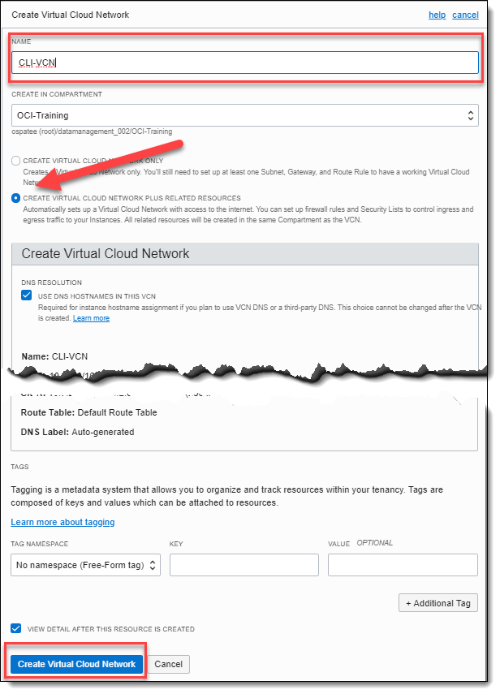
*<p align="center"> Figure 4: Create Virtual Network Dialog</p>*

Selecting **Create Virtual Cloud Network Plus Related Resources** is the easy way to create a VCN with access to the internet.   OCI will automatically create an Internet Gateway, a Default Route Table, and three public subnets using a default CIDR block of 10.0.0.0/16.

   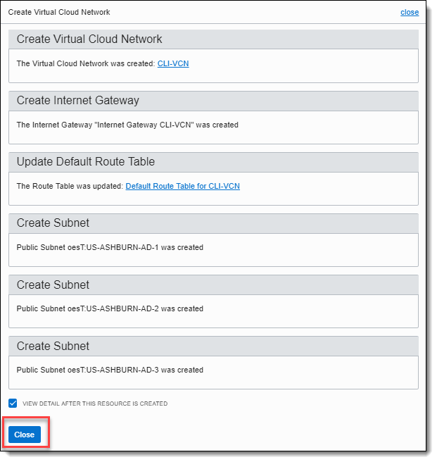
*<p align="center"> Figure 5: Confirmation</p>*


# Create a compute instance and install the OCI CLI
[Back to top](#Class-of-SE---HOL-Part-2)

**Note:**  *You will need an SSH key pair to create and access an OCI instance.  You can use an existing SSH Key pair (the one you created in the last lab), or create a new one.  If you would like to create a new key pair, please reference the key pair creation information from the first hands on lab.*

<!-- this section is where I should insert a link to a standalone module on how to create an SSH Key.  This module will cover PC, Mac, and Linux so we don't have to keep putting it in the lab guides.-->

1. From the OCI Services hamburger menu, choose **Compute** > **Instances** 

   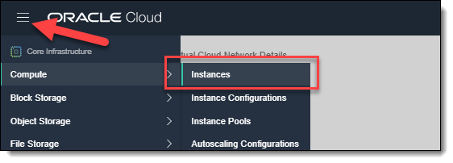
*<p align="center"> Figure 6: Compute > Instances</p>*


Confirm that the proper compartment is selected and click on either **Create Instance** button.

   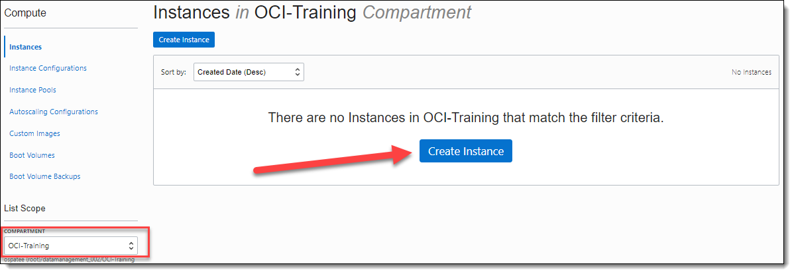
*<p align="center"> Figure 7: Compartment verification and Create Instance</p>*

2. Use the following information to complete the instance dialog box.

   - **Name:** Enter a name.  *ex:*  cli-instance
   - **Availability Domain:** Select AD1 unless otherwise instructed
   - **Image Operating System:** Select **Oracle Linux 7.6** with the latest build
   - **Choose Instance Type:** Choose **Virtual Machine**
   - **Choose Instance Shape:** Select VM.Standard2.1 or smaller shape
   - **Add SSH Keys:** Select your preferred SSH key 
   
   The following selections should contain default information.  Verify and change if necessary before continuing.
   - **Virtual Cloud Network Compartment:** Verify that your compartment is selected
   - **Virtual Cloud Network:** Select the VCN you created in the previous section.
   - **Subnet Compartment:** Verify the same compartment has been selected
   - **Subnet:** Choose the first public subnet
   - Click **Create**

**NOTE:** *If creation results in a 'Service limit' error.  Check the service limits and try a different shape such as VM.Standard.E2.1. You may need to alert an administrator for service limit and instance shape availability information*

   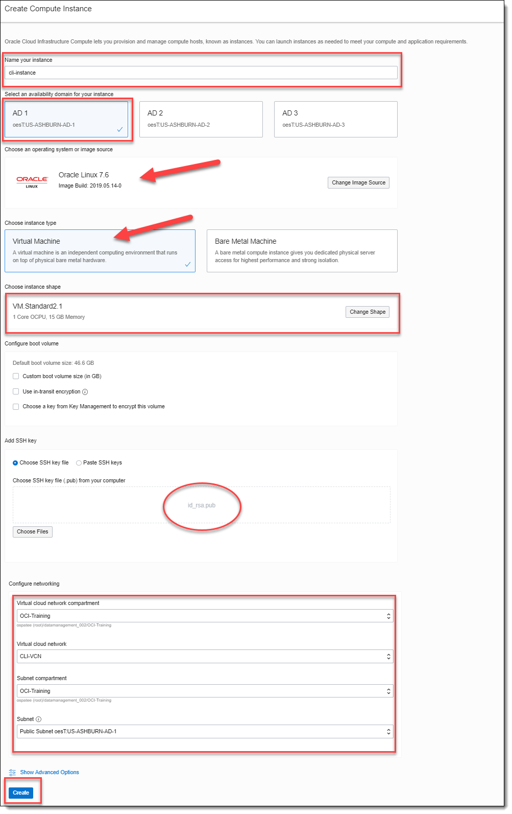
*<p align="center"> Figure 8: Instance creation dialog</p>*

3. When the instance enters the **Running** state.   Note the public IP address.  Use the assigned public IP address and initiate an SSH connection with your preferred SSH tool.  For these examples we'll connect to the OCI instance with GitBash from a Windows 10 machine.  You can use a terminal from the Mac, Putty from a PC, or any Linux shell tool.

   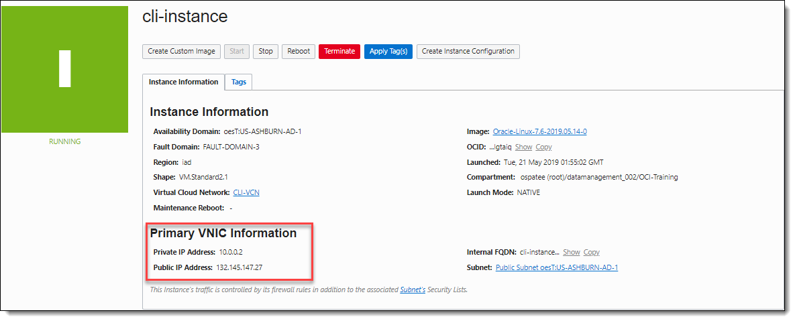
*<p align="center"> Figure 9: Running Instance with public IP address</p>*

SSH as the *'opc'* user to the OCI instance.

   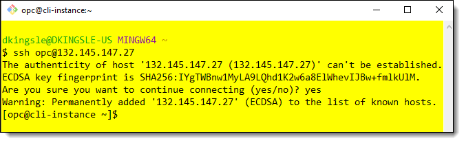
*<p align="center"> Figure 10: SSH connection as 'opc'</p>*

The OCI CLI tool is maintained on the Oracle Github site and updated regularly.  The direct url is https://github.com/oracle/oci-cli .  You can visit that site for more detailed information.   In the following steps, we will download the tool directly using curl and then walk through the configuration steps.

**Note:** *This lab uses the example of installing the CLI on a Linux host in the cloud.  If you wish, you can install it on your personal system, Mac, PC, or Linux as well as any other system you wish to use as a management system for OCI.  For installation on different systems, please see the OCI documentation pages, or other resources on the internet for more details.*

4. Use the following curl command to download and install the CLI on your compute instance.  As the 'opc' user, run the following command.

    ```[opc@cli-instance~]$ bash -c "$(curl –L https://raw.githubusercontent.com/oracle/oci-cli/master/scripts/install/install.sh)"```

 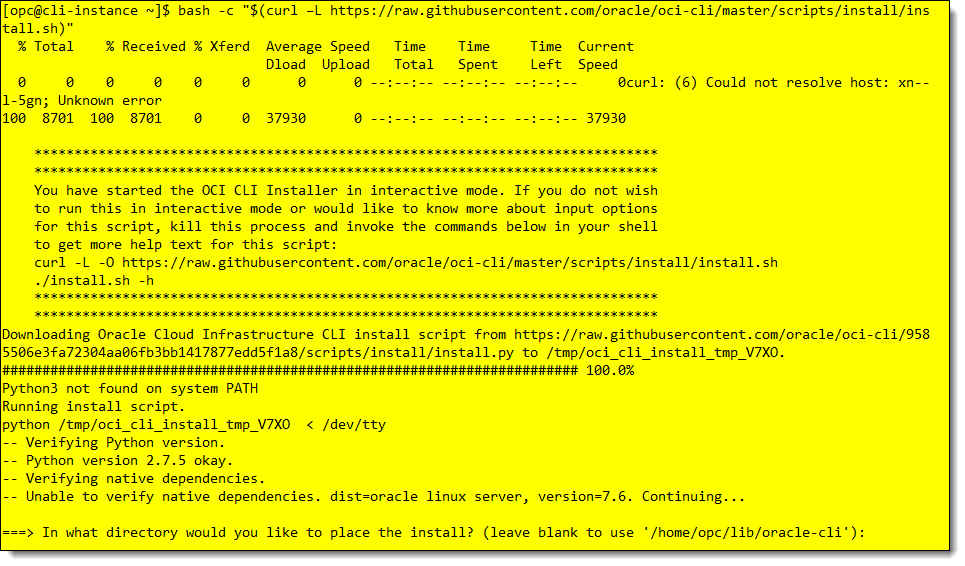
*<p align="center"> Figure 11: CLI Installation from https:</p>*

- When prompted for Install directory, press *Enter* to accept the default
- When prompted for ‘oci’ executable location, press *Enter* to accept the default
- When prompted for the OCI scripts location, press *Enter* to accept the default

 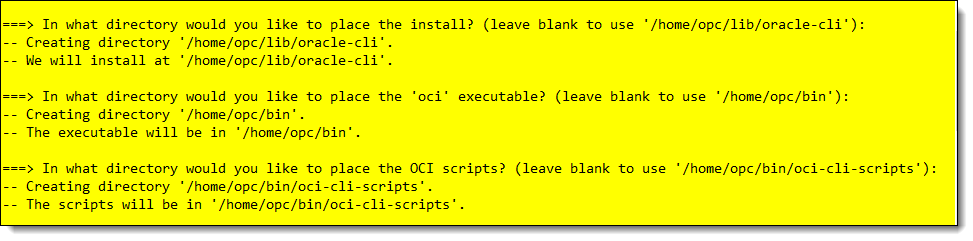
*<p align="center"> Figure 12: CLI install command prompts</p>*


- Enter 'Y' to enable shell/tab completion
- Press *Enter* to accept the default rc file.  .bashrc

**Note:**  *You may have to restart your shell by running the source command as indicated by the installation instructions.*

 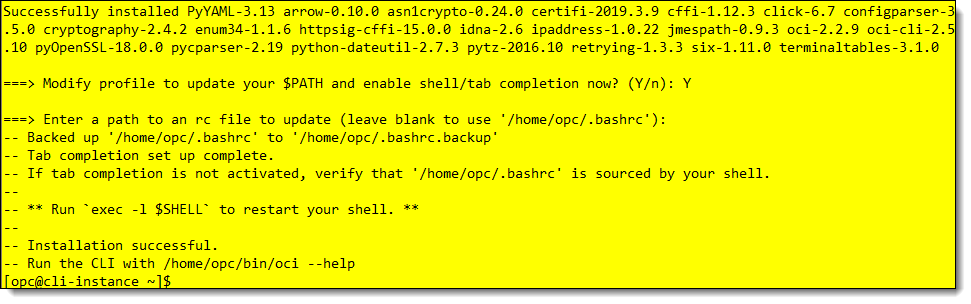
*<p align="center"> Figure 13: CLI install command prompts</p>*


5.  Verify tool installation and path by checking the tool version.  Run the followign command:

    `[opc@cli-instance ~]$ oci --version`

    **Note:** *-v*,  *-version*, or *--version* will all return the same result.

 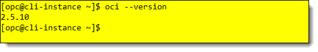
*<p align="center"> Figure 14: CLI version check</p>*

6.  The tool needs to be configured for access.  You will need to supply some connection information as we complete the command dialog.  Enter the command below to get started.

     `[opc@cli-instance ~]$ oci setup config`

- At the first prompt for configuration location, press *Enter* to accept the default location of [/home/opc/.oci/config]

 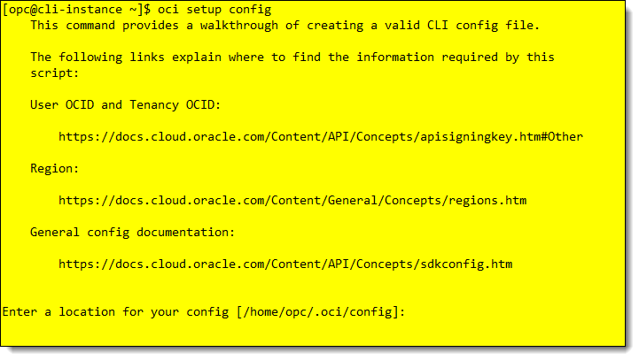
*<p align="center"> Figure 15: Configuration Location</p>*

- The next prompt will ask for the User OCID.  You will need to obtain this information from the OCI web console.   
- Open the OCI Console and left click on the User Icon at the top right of the console screen.  Choose  **User Settings** from the dropdown menu.

 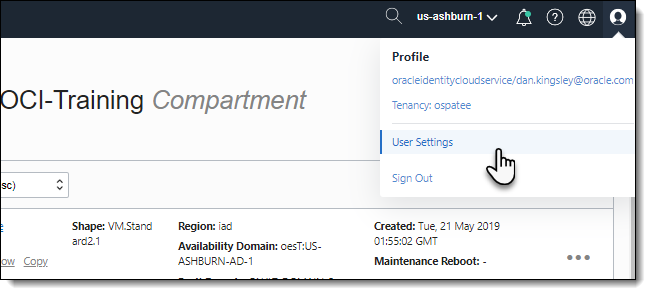
*<p align="center"> Figure 16: User Settings</p>*

- You should be taken to your own *User Details* screen.  In the **User Information** section, locate your **OCID** and click the **Copy** link.  The OCID will be copied to your clipboard.

 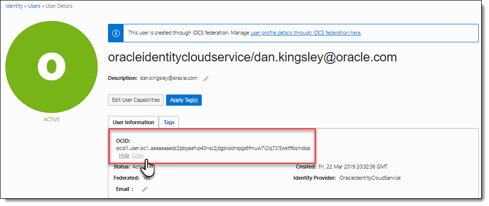
*<p align="center"> Figure 17: Copy OCID</p>*

- Switch to your SSH terminal session and paste the user OCID and press Enter. 
- Next you will be prompted to enter the Tenancy OCID

 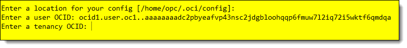
*<p align="center"> Figure 18: OCID</p>*

- Go back to the OCI Console window, again, left click on the user icon top right.  This time, choose Tenancy:\<your tenancy name>

 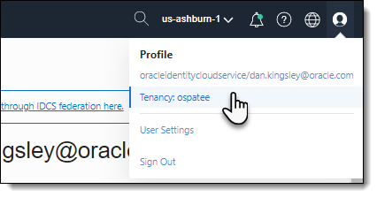
*<p align="center"> Figure 19: Tenancy</p>*

- Note the OCI section and choose **Copy** to copy the tenancy OCID to the clipboard.

 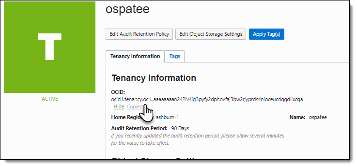
*<p align="center"> Figure 20: Tenancy OCID Copy</p>*

- Next enter the region information which can be obtained directly from the top bar of the OCI console.  In this case the region is *us-ashburn-1*.   

 
*<p align="center"> Figure 21: Region</p>*

- Enter the region information on the command line.   It also gives you a list to choose from.

 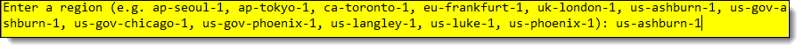
*<p align="center"> Figure 22: Region Command Line</p>*

- The next prompts will ask about generating an RSA key pair.  This is a PEM based key that will be used to authenticate the OCI CLI commands.   
- Press *Enter* to accept the defaults through all four questions.
    1. Do you want to generate a new RSA key pair?   (Y)
    2. Enter a name for your key [oci_api_key]  *Enter*
    3. Public key written to: /home/opc/.oci/oci_api_key_public.pem  *Enter*
    4. Enter a passphrase (empty for no passphrase):  *Enter*
- The key will generate, confirm the file and directory, and display the fingerprint.  

 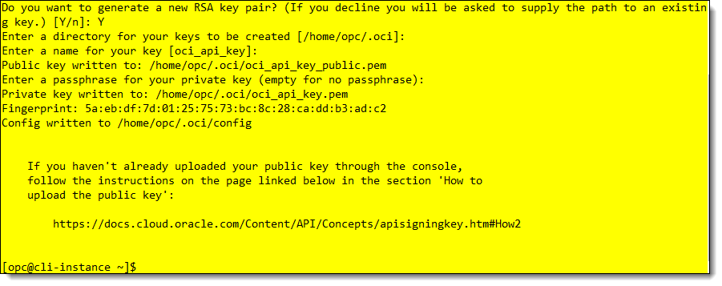
*<p align="center"> Figure 23: PEM Key prompts</p>*

7. Next we'll upload the PEM key to the console so we can connect and do some work.  

- First, locate the PEM configuration files.   From the */home/opc* directory list the files in the *.oci* subdirectory.

     ```[opc@cli-instance ~]$ ls .oci```
    
 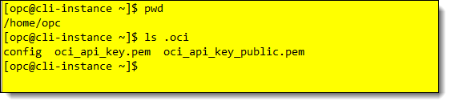
*<p align="center"> Figure 24. PEM Key Configuration Files</p>*

Use the *cat* command to view the RSA fingerprint listed in the config file.  We will compare and confirm the configuration file entry with the PEM key in the console to ensure we can communicate with the instance securely.   Enter the following command:

```[opc@cli-instance ~]$ cat .oci/config```

 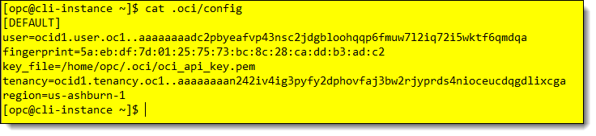
*<p align="center"> Figure 25. Configuration File and fingerprint</p>*

- Leave the SSH session window open and available.  We will use that information to compare with the OCI console after we've uploaded the API keys.

# Upload API keys and Verify Connectivity
[Back to top](#Class-of-SE---HOL-Part-2)

In this section, we'll upload the API key to the web console.  

1. In the SSH terminal window display the contents of the api key file using the cat command.  Type in the following command:

```[opc@cli-instance ~]$ cat .oci/oci_api_key_public.pem```

 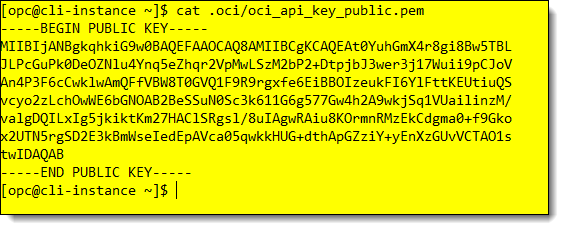
*<p align="center"> Figure 26. PEM Public Key</p>*

- Copy the entire key displayed on the screen from "-----BEGIN ... to ... END PUBLIC KEY-----"
- Switch to the OCI Console window, left click the **User** icon and select **User Settings**

 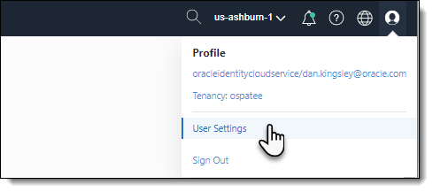
*<p align="center"> Figure 27. User Settings</p>*

- At the bottom of the *User Details* screen, click the **Add Public Key** button.   You can have more than one key.

 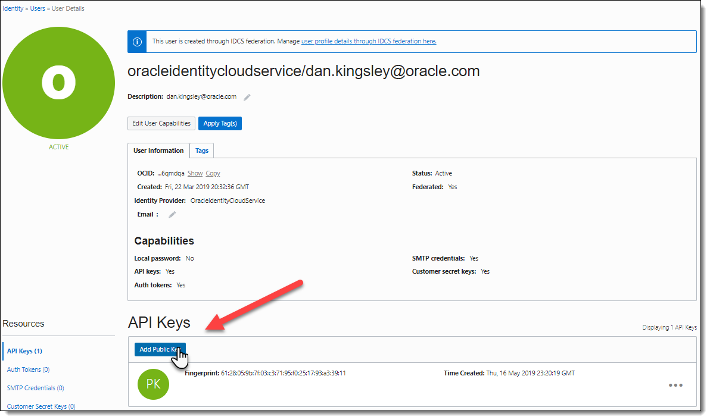
*<p align="center"> Figure 28. User Details Add Public Key</p>*

- Paste the key you copied from the SSH session into the dialog box and click **Add**.

 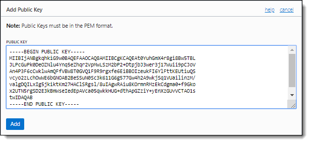
*<p align="center"> Figure 29. Paste Public Key</p>*

- The fingerprint will be displayed in the console window.  Verify that the fingerprint on he console matches what's on the instance so we can connect securely.
2. Open the SSH terminal session and use the *cat* command to display the configuration file and view the fingerprint on the instance.  Type the following command:

```[opc@cli-instance ~]$ cat .oci/config```

 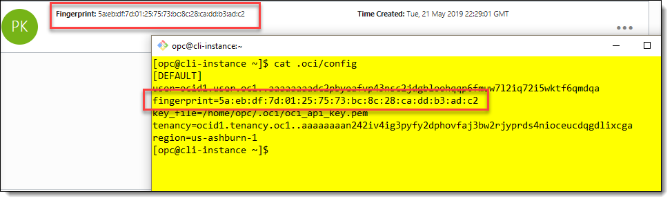
*<p align="center"> Figure 30. Fingerprint Comparison</p>*

- Compare the fingerprint in the SSH output to the fingerprint displayed in the OCI console and verify that they match.  If so, proceed to the next step.  If not, you'll need to retrace your steps and find out what might have gone wrong.  

**NOTE:** *You may have more than one fingerprint.   If so, use the time stamp to choose the correct one.*

Next we'll test and see if the CLI is working correctly. 

3. In the SSH terminal session, use the *oci* command with the iam switch to view your Availability Domain.  Type the following command:

```[opc@cli-instance ~]$ oci iam availability-domain list```

 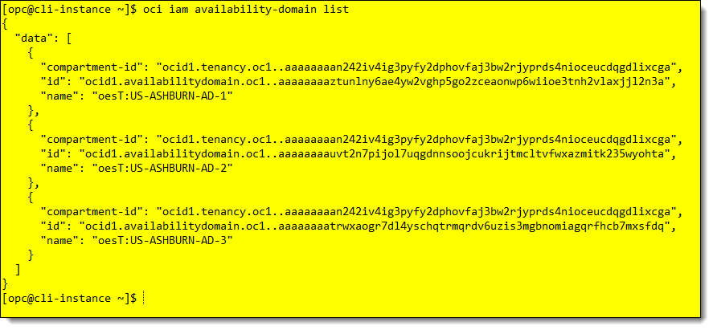
*<p align="center"> Figure 31. OCI AD List command</p>*

- The output lists the availability domains in the current region.  Note the availability domain names in the output.   They should look like *"oesT:US-ASHBURN-AD-1"*  
- For future exercises, we will start adding this static information as shell environment variables to make command line entry easier and less cluttered.

4. Verify that the *.bashrc* configuration file exists and make a backup just in case.   Issue the following commands in the *opc* home directory:

```[opc@cli-instance ~]$ ls .bashrc```
```[opc@cli-instance ~]$ cp .bashrc .bashrc_backup```

 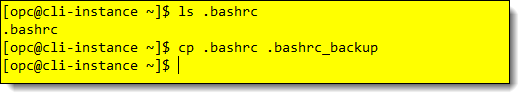
*<p align="center"> Figure 32. .bashrc configuration file backup</p>*

- Use the *echo* command and redirection to add an environment variable named *AD* to the .bashrc file.  AD will be a shortcut for the actual Availability Domain name.  
**Note:**  *Be sure to use the double greater than signs so as not to accidentally overwrite the .bashrc file.*
- Type the following commands or use an editor like **vi** to add the variable directly.

```[opc@cli-instance ~]$ echo "export AD=oesT:US-ASHBURN-AD-1" >> .bashrc``` 

```[opc@cli-instance ~]$ . .bashrc```

```[opc@cli-instance ~]$ echo $AD```

- We will need the AD command later on.  And we will also add more variables as we go along.

 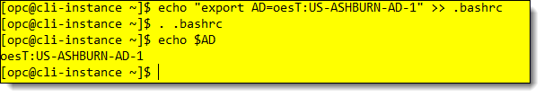
*<p align="center"> Figure 33. AD Environment Variable</p>*


5. Next we'll add the OCI Compartment ID as a variable.  

- Open the OCI Console and use the hamburger menu to navigate to **Governance and Administration > Identity > Compartments**.  

 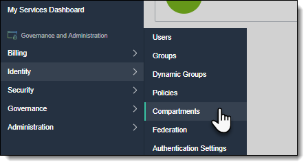
*<p align="center"> Figure 34. Compartments</p>*

- Locate your assigned compartment and copy the OCID.

 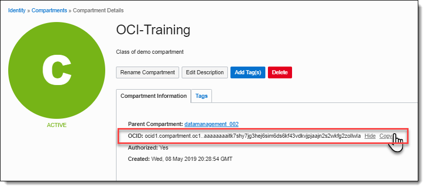
*<p align="center"> Figure 35. Compartment OCID</p>*

- Store the OCID of your compartment as a variable for later reference and usage.  Issue the same series of echo commands to store the variable in the .bashrc file.  Use the letters CID to reference 'Compartment ID"

```[opc@cli-instance ~]$ echo "export CID=<your compartment id>" >> .bashrc ``` 

```[opc@cli-instance ~]$ . .bashrc```

```[opc@cli-instance ~]$ echo $CID```


 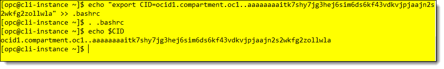
*<p align="center"> Figure 36. CID variable for compartment ID</p>*

Use the variable we just created in a cli command to list the VCN's in your network.  Enter the following command:

```[opc@cli-instance ~]$ oci network vcn list --compartment-id $CID```

 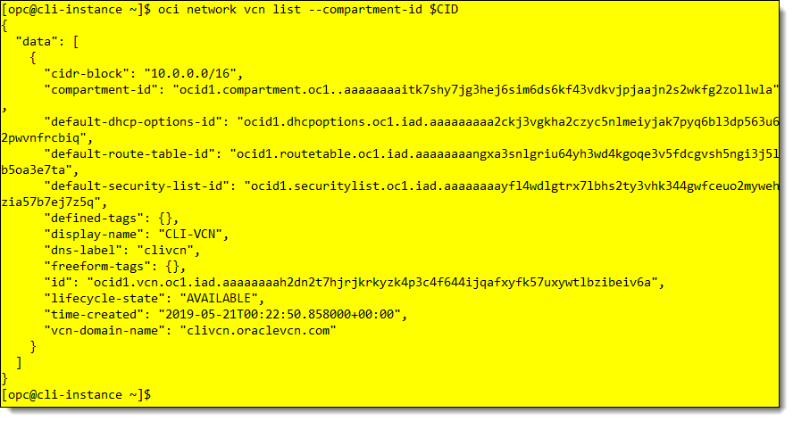
*<p align="center"> Figure 37. oci vcn list command</p>*

**NOTE:** *The command above should return details for the VCN you that you created at the start of this lab. If you encounter an error message, please contact the instructor.*

# Use the CLI to create a VCN
[Back to top](#Class-of-SE---HOL-Part-2)

From this point in the lab, we'll mainly be using the CLI to add and configure resources.  Feel free to copy/paste the command line examples if you don't want to type each command directly.   The command lines can get quite lengthy with all the different available options.  This is where you can start thinking about how automation and scripting could make things faster and easier for customers.  From the CLI and scripting you can easily branch off to API calls and using other tools like Terraform.

1. Create a new virtual cloud network.  Use the public CIDR block 192.168.0.0/16, name is CLI-HOL-VCN, and add a DNS label (no dashes) cliholvcn. Use the variable $CID for compartment ID that we created earlier.   Note the vcn OCID outlined in the image below.

```[opc@cli-instance ~]$ oci network vcn create --cidr-block 192.168.0.0/16 -c $CID --display-name CLI-HOL-VCN --dns-label cliholvcn```

 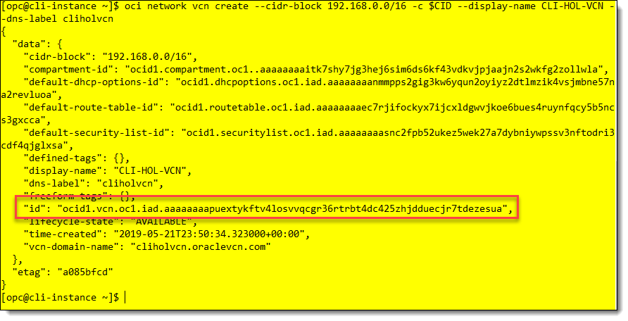
*<p align="center"> Figure 38. CLI create VCN command</p>*

- Create another variable to store the VCN OCID named *VCNID*    Record the ``id:`` of the resource after it is created.  You will need it in the upcoming steps.

```[opc@cli-instance ~]$ echo "export VCNID=<your vcn id>" >> .bashrc``` 

```[opc@cli-instance ~]$ . .bashrc```

```[opc@cli-instance ~]$ echo $VCNID```

 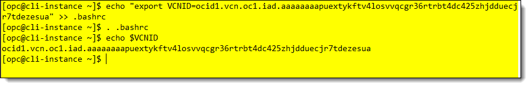
*<p align="center"> Figure 39. Create VCN ID variable</p>*

2.  In the next command, you will create a security list to add access to port 80 for the VCN we're working on using the vcn-id ($VCNID) and the compartment-id ($CID).  The command options result in a lengthy command line.  Feel free to copy/paste and edit as a script to make it easier to edit.  If you cut/paste the command and input your own variables, be sure to study the command so you understand which options are being specified. 

- Create a security list using the command below.   Name your security list PubSub1, remember to input your VCN and CID variables.   Note egress and ingress rules. 

**Note:** *If you have created the same variables $CID and $VCNID, you should be able to run the below command directly with copy/paste to the command line.  However, in the example below, I've put the command into a text file, made it executable, and run it as a script.*  

```[opc@cli-instance ~]$ oci network security-list create --display-name PubSub1 --vcn-id $VCNID -c $CID --egress-security-rules  '[{"destination": "0.0.0.0/0", "destination-type": "CIDR_BLOCK", "protocol": "all", "isStateless": false}]' --ingress-security-rules '[{"source": "0.0.0.0/0", "source-type": "CIDR_BLOCK", "protocol": 6, "isStateless": false, "tcp-options": {"destination-port-range": {"max": 80, "min": 80}}}]'```

```[opc@cli-instance ~]$ vi create-security-list```

```[opc@cli-instance ~]$ chmod 755 create-security-list```

```[opc@cli-instance ~]$ cat create-security-list```

```[opc@cli-instance ~]$ ls -l create-security-list```

 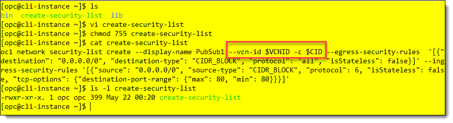
*<p align="center"> Figure 40. Create a script file for security list creation</p>*

- The image below illustrates running the command as a script named 'create-security-list'.   Again, make note of the security resurce id, we will use it in the next step.  

 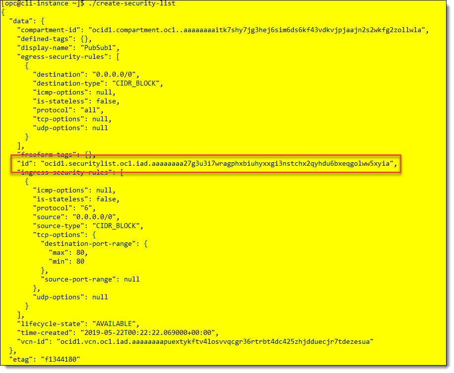
*<p align="center"> Figure 41. Run the create security list script</p>*

- Below are commands to store it as the variable $SLID in the .bashrc file for later reference.

```[opc@cli-instance ~]$ echo "export SLID="<your security list id" >> .bashrc``` 

```[opc@cli-instance ~]$ . .bashrc```

```[opc@cli-instance ~]$ echo $SLID```

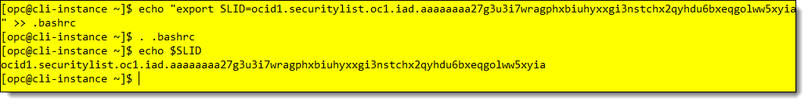
*<p align="center"> Figure 42. Security List Resource ID variable $SLID</p>*

3.  In this section we'll create a public subnet.  The ```subnet create``` command includes an option to associate one or more security lists.  The option, ```--security-list-ids``` requires valid JSON input.  We can't use our variable $SLID in this case so we'll walk through the creation of a JSON file to store the paramater.  This is a simple example using a single value but it will give you an idea on alternative forms of data input for resource creation.

**Note:** *You have the option to specify up to 5 security lists and a custom route table.  In this case, we are only assigning one security list and allowing the system to automatically associate the default route table.*

- Run the following command to generate the JSON file for the security-list-ids option.

```[opc@cli-instance ~]$ oci network subnet create --generate-param-json-input security-list-ids```

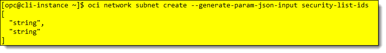
*<p align="center"> Figure 43. JSON format</p>*

- Create a file named security-list.json and copy the JSON output above into it as a template.  Edit the file to add the Securiy List OCID, the value that we stored as $SLID as the first "string" in the file.  Delete the other line containing the second word "string" and save the file as security-list.json

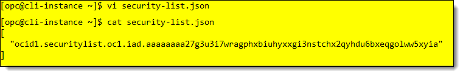
*<p align="center"> Figure 44. JSON file with Security List OCID</p>*

- Now run the command to create the subnet.   Use the environment variables you created for Compartment ID ($CID) and VCN ID ($VCNID), but this time we'll use the JSON file we created for the security list information.  Create a public subnet.

```[opc@cli-instance ~]$ oci network subnet create --cidr-block 192.168.10.0/24 -c $CID --vcn-id $VCNID --security-list-ids file://security-list.json```

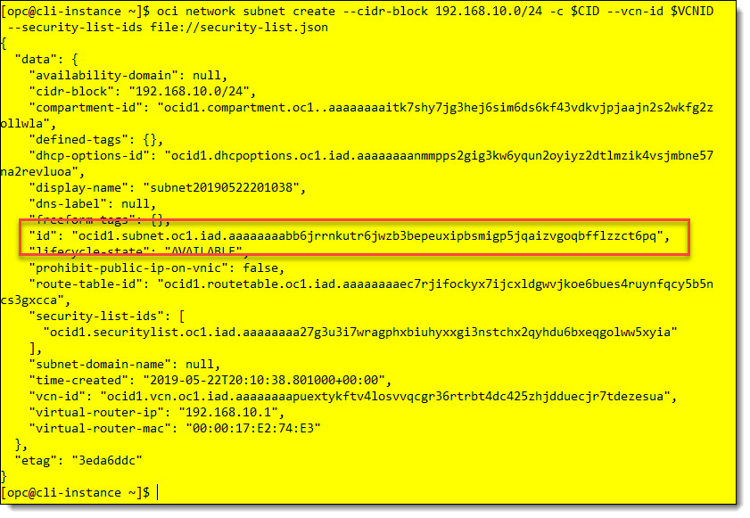
*<p align="center"> Figure 45. Create subnet command with JSON file input</p>*

- Record the ID of the subnet in another environment variable.  Se the example below using SUBID as the environment variable name.  Substitute the ID of the subnet you obtained in the last step.   You will need this value later.

```[opc@cli-instance ~]$ echo "export SUBID=<your subnet id>" >> .bashrc``` 

```[opc@cli-instance ~]$ . .bashrc```

```[opc@cli-instance ~]$ echo $SUBID```

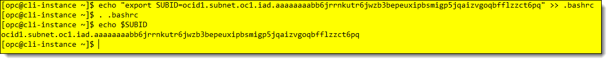
*<p align="center"> Figure 46. Subnet environment variable</p>*

4. Create an Internet Gateway. An Internet Gateway is a standalone resource in the VCN so you will only need to provide the OCID of your VCN and Compartment.  You will enable the gateway as well as provide a name.   Name your Internet Gateway CLI-IGW.

```[opc@cli-instance ~]$  oci network internet-gateway create -c $CID --is-enabled true --vcn-id $VCNID --display-name CLI-IGW```

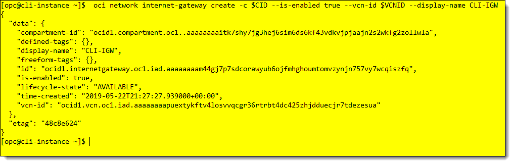
*<p align="center"> Figure 47. Create Internet Gateway</p>*

Let's store the Internet Gateway ID as a variable as well.

```[opc@cli-instance ~]$ echo "export IGWID=<your gateway id>" >> .bashrc``` 

```[opc@cli-instance ~]$ . .bashrc```

```[opc@cli-instance ~]$ echo $IGWID```

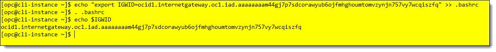
*<p align="center"> Figure 48. Internet Gateway ID variable</p>*

5. Now we need to update the default route table with a route to the internet gateway.  We'll use the cli to locate the OCID of the default route table.

```[opc@cli-instance ~]$ oci network route-table list -c $CID --vcn-id $VCNID```

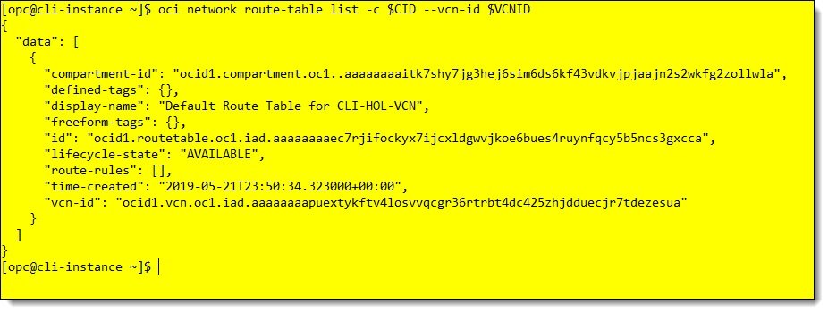
*<p align="center"> Figure 49. Route Table ID</p>*

Again, record the route table id as a variable.

```[opc@cli-instance ~]$ echo "export RTID=<your route table id>" >> .bashrc```

```[opc@cli-instance ~]$ . .bashrc```

```[opc@cli-instance ~]$ echo $RTID```

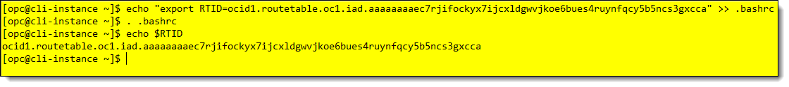
*<p align="center"> Figure 50. Route Table ID variable</p>*

6. Now we will update the route table with a route to the internet gateway.  In this example, the ```route-rules``` parameter is another complex JSON field.  You can specify the JSON output on the command line, or include it in a file.  Let's create another file to store the JSON information that we'll pass to our update command.

- Use vi or your favorite editor to create a file called *route-rules.json*.   Include the following information and use the ID from your Internet Gateway.

```
[     
    {"cidrBlock": "0.0.0.0/0",
    "networkEntityId": "ocid1.internetgateway.oc1.iad.aaaaaaaam44gj7p7sdcorawyub6ojfmhghoumtomvzynjn757vy7wciszfq"}
]
```
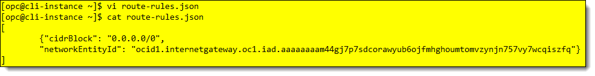
*<p align="center"> Figure 51. Create route table JSON file</p>*

```[opc@cli-instance ~]$ oci network route-table update --rt-id $RTID --route-rules file://route-rules.json```

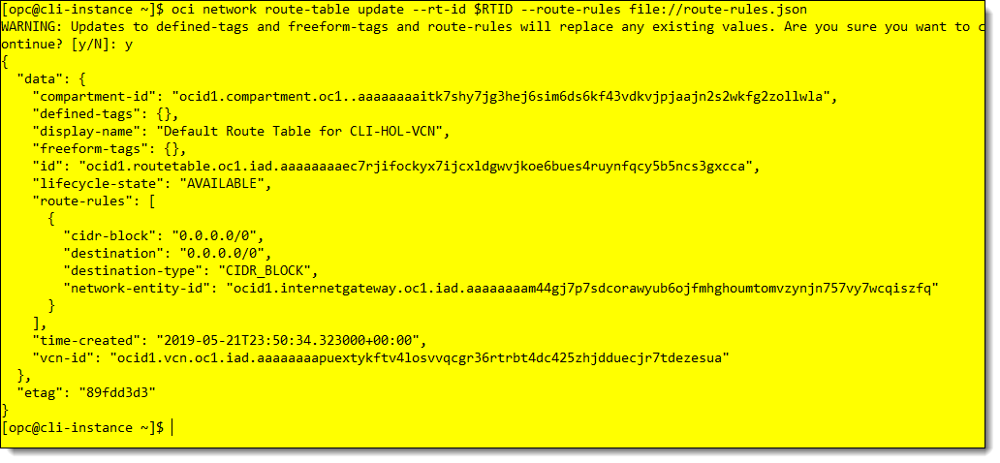
*<p align="center"> Figure 52. Route Table ID variable</p>*

**Note:** *When updating route tables or security lists with the cli, you cannot insert rules one at a time.  If you have multiple rules, they must all be added simultaneously.*

# Launch a Compute Instance
[Back to top](#Class-of-SE---HOL-Part-2)

1. Use the CLI ``query`` command to retrieve the OCID for the latest Oracle Linux image.  

- First let's just run a general query command to see what kind of instances are out there.  Run the following command:

```[opc@cli-instance ~]$ oci compute image list -c $CID --output table --query "data [*].{ImageName:\"display-name\", OCID:id}"```

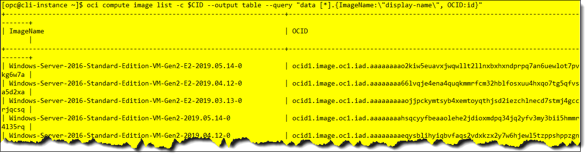
*<p align="center"> Figure 53. Image query command</p>*

- Now run a more specific version, narrowing down the list to just the available Linux instances.

**Note:**  [*Visit this link to find out more details about the query command. Look for 'Filter Output' commands.*](https://docs.cloud.oracle.com/iaas/Content/API/SDKDocs/cliusing.htm#ManagingCLIInputandOutput)

```[opc@cli-instance ~]$ oci compute image list --compartment-id $CID --query 'data[?contains("display-name",`Oracle-Linux-7.6-20`)]|[*].["display-name",id]'```

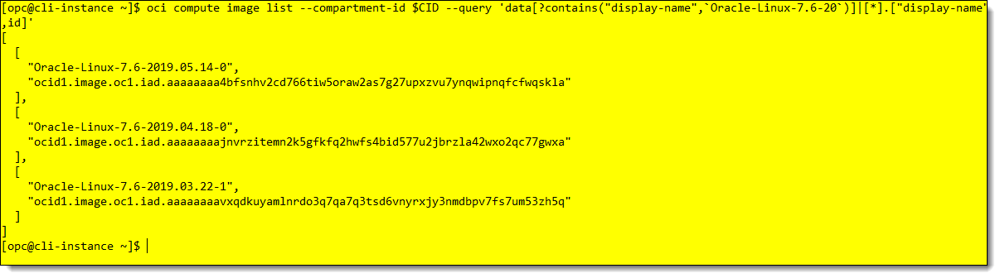
*<p align="center"> Figure 54. Image query command</p>*


- Out of the three available versions, use the image ID of the latest build.  Store the image ID in a variable to make the following step simpler.  The steps below use a variable named IMAGEID.

```[opc@cli-instance ~]$ echo "export IMAGEID=<your image id>" >> .bashrc```

```[opc@cli-instance ~]$ . .bashrc```

```[opc@cli-instance ~]$ echo $IMAGEID```

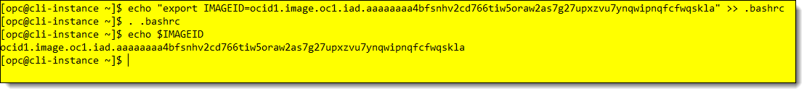
*<p align="center"> Figure 55. Image ID Variable</p>*

2. Launch a compute instance with the following command.  We previously created a regional subnet because our command did not include a specific availability domain. For compute instances, we must specify an availability domain and subnet.

    You will need the following pieces of information:
   - Compartment ID
   - Availability domain name
   - Subnet OCID
   - Valid compute shape (i.e. VM.Standard.E2.1)
   - Your public SSH key

- This is a long command line, so here's an example before we add the details.

```[opc@cli-instance ~]$ oci compute instance launch --availability-domain <your AD name> --display-name demo-instance --image-id <ID from previous step> --subnet-id <subnet OCID> --shape VM.Standard.E2.1 --assign-public-ip true --metadata '{"ssh_authorized_keys": "<your public ssh key here>"}'```

- For the SSH key, navigate to /home/opc/.ssh and view the authorized_keys file with the cat command.   Copy the entire key and paste it in the command between the double quotes.

- in the below command, we've added our variables for Compartment ID ($CID), Availability Domain ($AD), added the Image ID variable ($IMAGEID), named the instance 'my-instance', added the Subnet ID Variable ($SUID), assigned a shape, assigned a public IP address, and added the SSH key.

```[opc@cli-instance ~]$ oci compute instance launch --compartment-id $CID --availability-domain $AD --display-name my-instance --image-id $IMAGEID --subnet-id $SUBID --shape VM.Standard.E2.1 --assign-public-ip true --metadata '{"ssh_authorized_keys": "ssh-rsa AAAAB3NzaC1yc2EAAAADAQABAAABAQDIzA5J9Yk3raXq9d1lPdt5Lw+ehErUXHgYIkdj5OcTVyGbqYo+niyPGPSPpbrxOMlcQtENCAuWWjMH7CKQz74ffZIApu4avmLc6JKO0ZxT/GyjPcamb826NVX2j6bYJUOmFJ4XMPJdBwnnrLEg9dJ3oA2kL8JEuN5dXvsqNaCzv0V+2ur6iiWWIL9LyKucHiiiCayrRUXRbipYOCi9Ld761Fx4Pt01svzOAVKdcPHN8ld6iJxUnKlAenuJAQ9rp4LxqrvXkiZPHHQI8xwIbG6QoEyCxFDGRv7eZGTI7ZoxBdrfUpL+p/rEYmn26SNlJzYwynIq8qoMbbFIxGWCmkE9 dkingsle@DKINGSLE-US"}'```

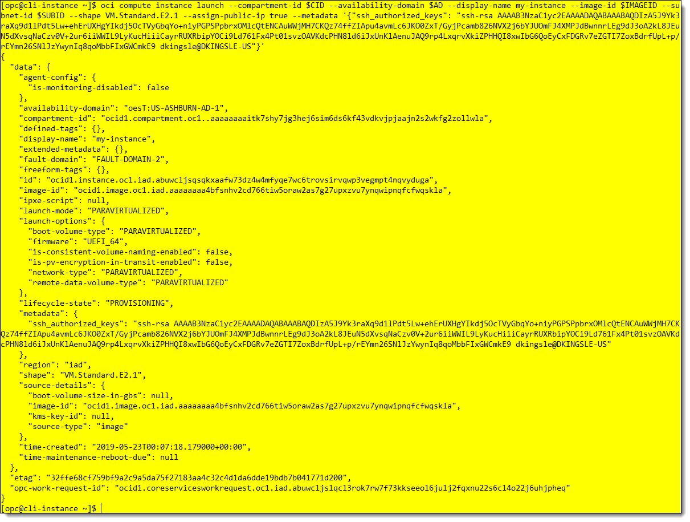
*<p align="center"> Figure 56. Create Instance cli command</p>*

You can use the ID of the instance to monitor the status.  Copy the instance OCID and paste into the command line in item #3 below.  You may not have time to create a variable before the instance has been deployed and enters the 'running' state.   

- Or you can capture the ID of the instance as yet another environment variable.

```[opc@cli-instance ~]$ echo "export IID=<your instance id>" >> .bashrc```

```[opc@cli-instance ~]$ . .bashrc```

```[opc@cli-instance ~]$ echo $IID```

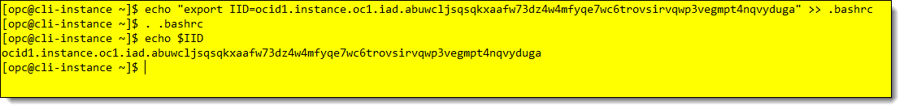
*<p align="center"> Figure 57. Instance ID variable</p>*

Capture the ``id:`` of the compute instance launch output.

3. Check the status of the instance

```[opc@cli-instance ~]$ oci compute instance get --instance-id $IID --query 'data."lifecycle-state"'```


*<p align="center"> Figure 58. Instance ID variable</p>*

4. Rerun the command every 30-60 seconds until the lifecycle-state is ``RUNNING``

**Note:** *If finished, please delete the resources you created.

   If you are finished, please retrace your steps and delete the resources you've created.  This will free up resources for others and save costs by not leaving un-used resources running.

## This completes the exercise for basic usage of the OCI CLI.

- Congratulations, you have finished this lab on the OCI CLI.
- If there's is time available, you can continue on to the challenge section below.   
 - If you are finished, please delete the resources you created for this lab.  Use the CLI if possible for further practice, but if time is short, you can use the console.   
 - Compute resources aren't finite, and they aren't free.  Please help us save costs and keep resources available for other students by stopping or removing any resources you've created for this lab.
 - Please do not remove other students resources unless you have approval to do so.

 [Conclusion](#Conclusion)

# OCI Challenge - Create and Destroy resources
[Back to top](#Class-of-SE---HOL-Part-2)

This challenge is optional if you have extra time.   Below are a couple of objectives that you can try on your own with no step-by-step instructions.  Use the knowledge that you've gained already plus resources like the OCI CLI reference documentation, Oracle blogs, etc. for guidance.

[OCI CLI Command Reference Guide](https://docs.cloud.oracle.com/iaas/tools/oci-cli/latest/oci_cli_docs/index.html)

[OCI Documentation](https://docs.cloud.oracle.com/iaas/Content/home.htm)

[OCI CLI Information](https://docs.cloud.oracle.com/iaas/Content/API/Concepts/cliconcepts.htm)

[OCI CLI Github Page](https://github.com/oracle/oci-cli)

1. Connect to the instance via SSH

   - Locate the public IP address of the instance using the CLI

      ```[opc@cli-instance ~]$ oci compute instance list-vnics --instance-id <instance OCID> | grep "ip.:"```

   -  Attempt to connect via SSH.  Does it work?  

      *(hint: it should time out)*

   - Create an ingress rule for SSH traffic in your custom security list.  

      *hint - Don't forget the ``oci network security-list update`` command requires you to pass all current and new rules.  If you just pass one rule, it will overwrite the existing rules.*

   - Try to connect again. Is it working?

2. Create and attach a 50GB block volume to your instance.

3. Terminate/destroy all of the resources you created in this lab.  

   *Hint - the order in which you delete the resources is very important.*

# Conclusion

This lab introduced you to the Oracle Cloud Infrastructure command line interface.  Let’s review what you've accomplished.

You created a VCN and an instance.  You installed and configured the OCI CLI utility.   You created API keys and connected to your instance.  Then you used the CLI to create several resources including an instance.  This lab was designed to familiarize you with the CLI and how a customer could use it to configure resources quickly and efficiently.   

## What you completed

  - Create a VCN and launch and instance

  - Install and configure the CLI tool

  - Create a VCN with the CLI

  - Create and launch an instance with the CLI

  - Optionally create block storage

  - Optionally destroy the resources that you created


[Back to top](#Class-of-SE---HOL-Part-2)