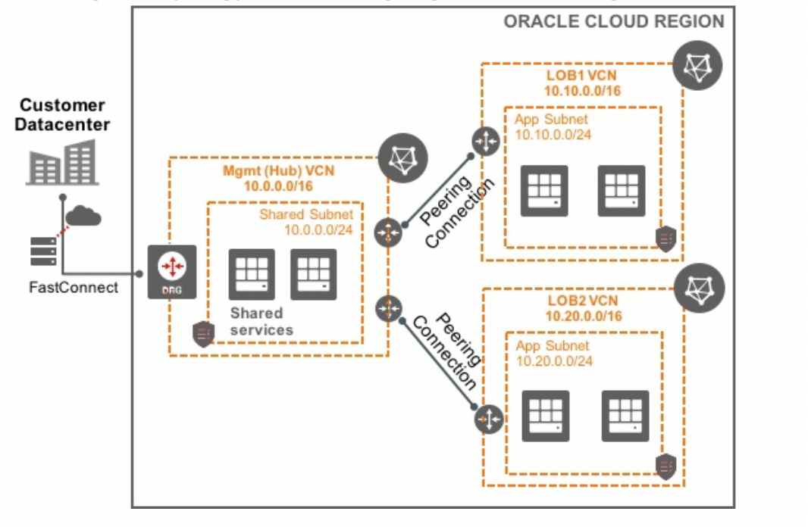
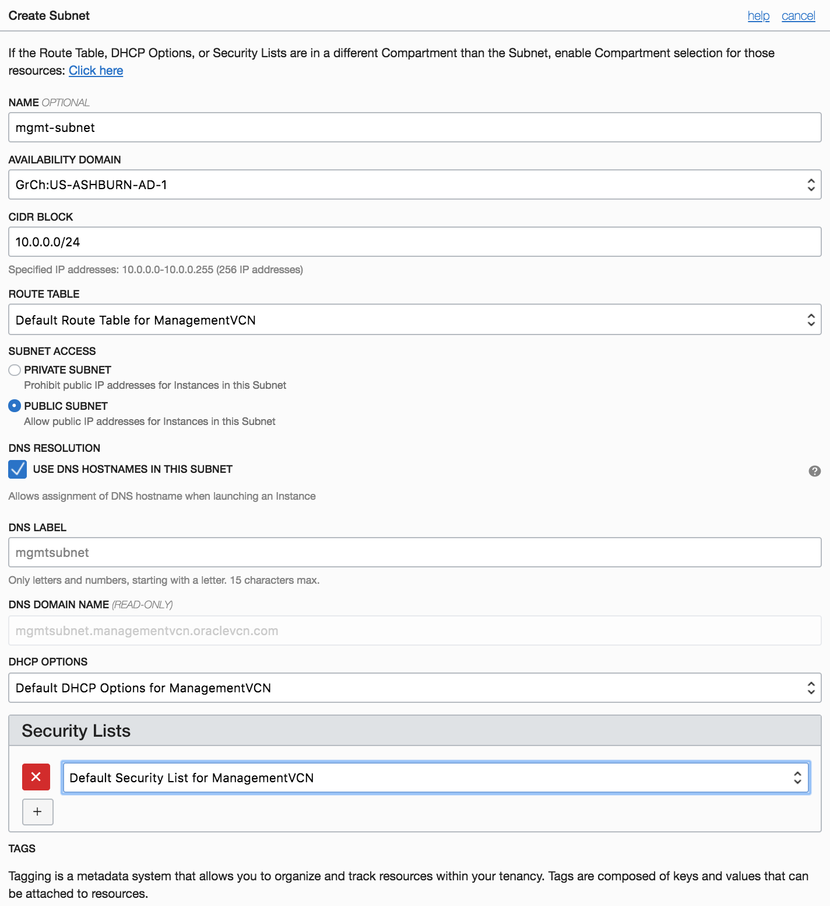
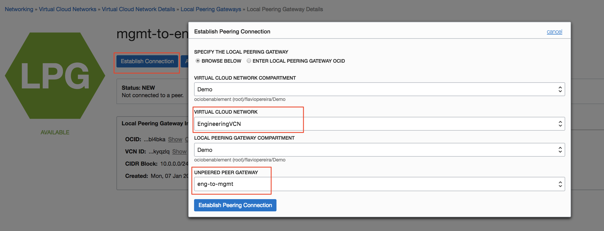
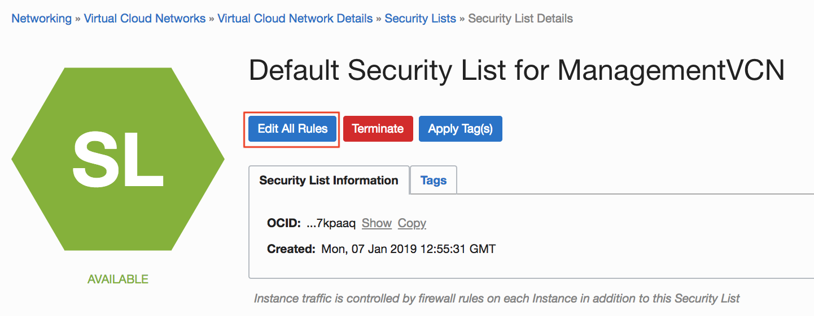
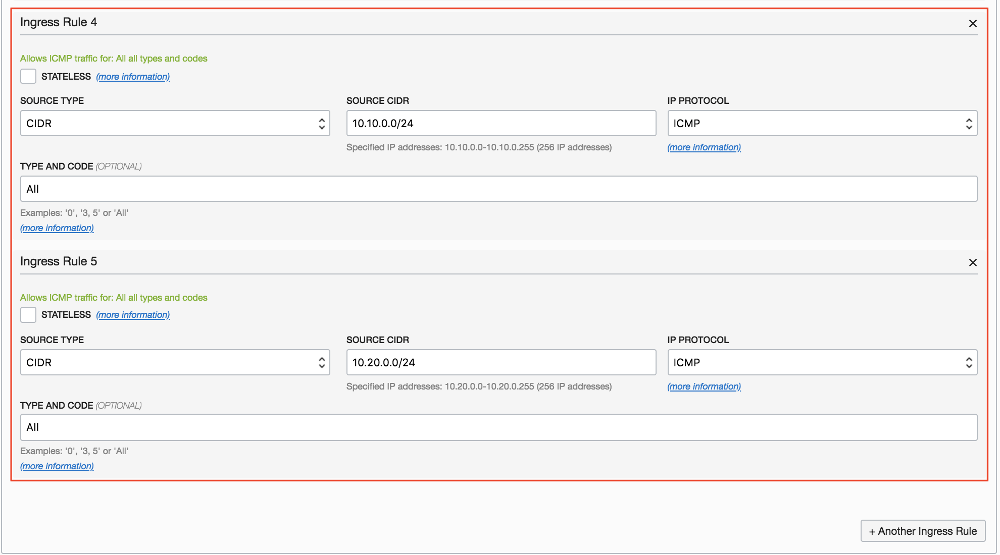
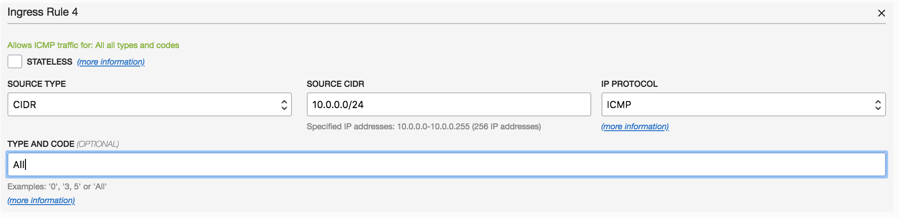
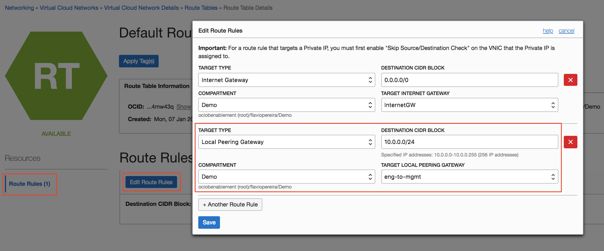
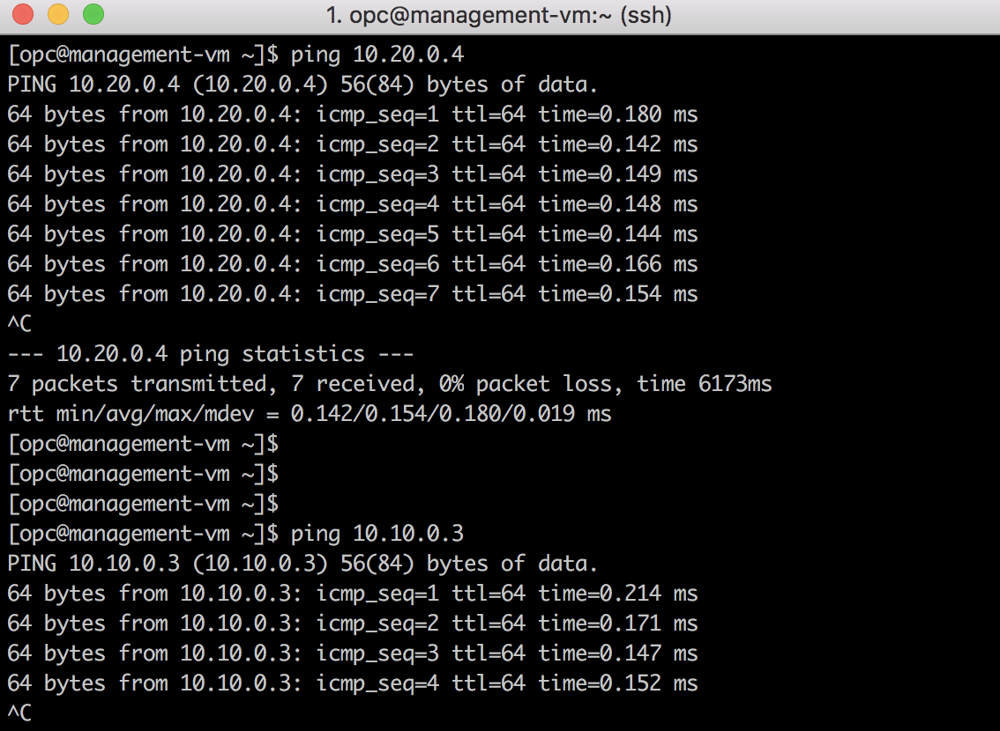

# VCN Local Peering Lab

<!-- comment out table of contents

## Table of Contents

[Overview](#overview)

[Pre-Requisites](#pre-requisites)

[Practice 1: Creating Virtual Cloud Network](#practice-1-creating-virtual-cloud-network)

[Practice 2: Creating an instance per VCN](#practice-2-creating-an-instance-per-vcn)

[Practice 3: Creating Local VCN Peering](#practice-3-creating-local-vcn-peering)

[Practice 4: Testing Local VCN Peering](#practice-4-testing-local-vcn-peering)

-->

## Overview

Local VCN peering is the process of connecting two VCNs in the same region and tenancy.  The peering process ensures that their resources can communicate using private IP addresses without routing the traffic over the internet or through an on-premises network. Without peering, a given VCN would need to use an internet gateway and public IP addresses for the instances that need to communicate with another VCN.  Private peering can create an easy to monitor, secure, reliable connection.

You can use VCN peering to divide your network into multiple VCNs (for example, based on departments or lines of business), with each VCN having direct, private access to the others. There is no need for traffic to flow through your on-premises network via an IPSec VPN or FastConnect. You can also place shared resources into a single VCN that all the other VCNs can access privately. 

In this hands on lab, you have a central VCN that has resources that you want to share with other VCNs. For instance, your company’s IT department has some file sharing services or active directory services that you want to share with other departments in your organization. Each department has its own VCN, and you only want connectivity between your common management shared VCN and the individual VCNs of each department and you don’t want to have connectivity among departments VCNs.

Here's a diagram of the topology that we are going to create in this Hands on lab. 

 

## Pre-Requisites 

- Oracle Cloud Infrastructure account credentials (Tenant ID, Username and Password)
- SSH Keys

## Practice 1: Creating Virtual Cloud Network

In this exercise, we are going to create three separate VCNs named ManagementVCN, MarketingVCN, and EngineeringVCN along with the necessary resources for each one of them.  First we'll create **ManagementVCN**, then we'll follow the same steps to create the other two.

1. Open the navigation menu. Under **Core Infrastructure**, go to **Networking** and click **Virtual Cloud Networks**.
   
    **Note:** Ensure that your compartment is selected on the left side of the Console.

2. Click **Create Virtual Cloud Network**. 
   
3. In the dialog box, enter  **ManagementVCN** for your virtual cloud network name.

4. Make sure that **Create Virtual Cloud Network Only** is selected.
   
5. Choose a CIDR block - **10.0.0.0/24** and keep the remaining options as is.
   
6. Click **Create Virtual Cloud Network** (This creates a VCN, and you can see the details page of the created VCN. 

7. We will now create additional resources required for the instances in **ManagementVCN**.  Navigate to **Internet Gateways** on left side panel, and click on **Create Internet Gateway**. Provide a name like **InternetGW** 

8. Navigate to Route Tables, and add an additional route to the **Default Route Table for ManagementVCN**.
   
9. Click on **Default Route Table for ManagementVCN**.
    
10. Click on **Edit Route Rules** and add another rule with the following information:
    
| Field      |  Entry           |
| -----------|------------------|
|Target Type:|Internet Gateway|
|Destination CIDR Block:| 0.0.0.0/0 |
|Target Internet Gateway: |InternetGW |

11. Now lets create the subnets. Navigate back to your VCN and click create subnet with the following:
    
| Field      |  Entry           |
| -----------|------------------|
|Name: | mgmt-subnet |
|Availability Domain: |AD-1 |
|CIDR BLOCK: |10.0.0.0/24 |
|Subnet Access: |Public Subnet |
|DHCP Options: |Default DHCP Options for ManagementVCN |
|Security Lists: |Default Security List for ManagementVCN |

12. Create two Local Peering in ManagementVCN as we need to create Peering connections with two other VCNs (engineering and marketing). 

**Note:**  A local peering gateway (LPG) is a component on a VCN for routing traffic to a locally peered VCN. As part of configuring the VCNs, each administrator must create an LPG for their VCN. A given VCN must have a separate LPG for each local peering it establishes (maximum 10 LPGs per VCN). In the API, a LocalPeeringGateway is an object that contains information about the peering. You can't reuse an LPG to later establish another peering with it.

13. Click on Create Local Peering Gateway, and create two LPGs one by one. (mgmt-to-eng and mgmt-to-mkt)

14. Repeat steps 1 through 13. However, in these VCNs, *create only one local peering gateway*. Use the following information for your VCNs:

| Name     |  CIDR         | Network  Additions   |
| -----------|------------------|------------------|
| MarketingVCN | 10.10.0.0/24 | add IGW, mkt-subnet, Route table, and LPG|
|EngineeringVCN | 10.20.0.0/24 | add IGW, eng-subnet, Route table, and LPG|

Your Virtual Cloud Network screen should look something like the below image.

15. All three VCNs are now created. In the next step, we will create instances in each VCN to test traffic connectivity.

## Practice 2: Creating an instance per VCN

In this practice, you will create instances in each of three VCNs.

1. Navigate to the **Menu** --> **Compute** --> **Instances**
2. Click **Create Instance**
3. In the Create Instance Dialog enter the following:

| Field      |  Entry           |
| -----------|------------------|
|Name: | ManagementVM  | 
|Availability Domain:  |AD-1 |
|OS Image: |Oracle Linux 7.6 |
|Instance Type: |Virtual Machine |
|Instance Shape: | VM.Standard2.1 |
|SSH Keys: |Add your public SSH Key |
|Virtual Cloud Network: |ManagementVCN |
|Subnet: |mgmt-subnet |

Leave the rest as default and click **Create**

4. Repeat the previous step to launch an instance in each of the remaining two VCNs (Engineering VCN and Marketing VCN). Choose the same or different shape (depending upon on capacity) and name your instances EngineeringVM and MarketingVM respectively.

 

## Practice 3: Creating Local VCN Peering

In this practice, we will create Peering connections between the VCNs:

ManagementVCN <------> EngineeringVCN

ManagementVCN <------> MarketingVCN

1. Navigate to the **ManagementVCN** --> **Local Peering Gateways**

  
2. Click on **mgmt-to-eng**, and establish connection with **EngineeringVCN** LPG (The resulting dialog box lets you choose the VCN and LPG you want to peer with)

| Term      |  Description         |
| -----------|------------------|
|Virtual Cloud Network Compartment: |The compartment that contains the VCN you want to peer with.|
|Virtual Cloud Network:| The VCN you want to peer with. |
|Local Peering Gateway Compartment:| The compartment that contains the LPG you want to establish the connection with. |
|Unpeered Peer Gateway: |The LPG you want to establish the connection with. |

   

3. Now lets do the same for **mgmt-to-mkt** local peering

 Once the connections are successfully peered, we need to modify the route tables and security lists associated with each subnet to route and allow traffic.

#### **ManagementVCN:**

4. Navigate to Route Tables and add a route rule in the default routing table with the following:

| Field      |  Entry           |
| -----------|------------------|
|Target Type: |Local Peering Gateway|
|Destination CIDR: |10.10.0.0/24 (MarketingVCN) |
|Target Compartment: |YourCompartment|
|Target Local Peering Gateway: |mgmt-to-mkt |

5. Add another Rule:

| Field      |  Entry           |
| -----------|------------------|
|Target Type:|Local Peering Gateway|
|Destination CIDR: |10.20.0.0/24 (EngineeringVCN) |
|Target Compartment: |YourCompartment|
|Target Local Peering Gateway: |mgmt-to-eng |

 

6. Navigate to Security Lists, and add an Ingress security list rule in the default Security lists for ICMP traffic. In this example, we are only testing ICMP traffic so adding an ICMP rule. For TCP traffic, relevant TCP rules can be added. 

7. Click on Edit Rules, and add the following:

| Field      |  Entry           |
| -----------|------------------|
|Source CIDR:|10.10.0.0/24 |
|IP Protocol:|ICMP |
|Type:|All|
  
8. Add a second one:

| Field      |  Entry           |
| -----------|------------------|
|Source CIDR: |10.20.0.0/24 |
|IP Protocol: | ICMP |
|Type: | All |

#### **MarketingVCN:**
   
9. Navigate to Route Tables and add a route rule in the default routing table with the following:
|Target Type: |Local Peering Gateway |
|Destination CIDR: |10.0.0.0/24 (ManagementVCN) |
|Target Compartment: |YourCompartment |
|Target Local Peering Gateway: |mkt-to-mgmt |

 

10. Navigate to Security Lists, and add an Ingress security list rule in the default Security lists for ICMP traffic. In this example, we are only testing ICMP traffic so we need to add a rule for ICMP.  For TCP traffic, relevant TCP rules can be added. 

11. Click on Edit Rules, and add the following:

| Field      |  Entry           |
| -----------|------------------|
|Source CIDR: | 10.0.0.0/24 |
|IP Protocol: |ICMP |
|Type: |All |

 

 #### **EngineeringVCN:**
   
12.  Navigate to Route Tables and add a route rule in the default routing table with the following:
|Target Type| Local Peering Gateway |
|Destination CIDR:| 10.0.0.0/24 (ManagementVCN) |
|Target Compartment: | YourCompartment |
|Target Local Peering Gateway: | eng-to-mgmt |

 

13. Navigate to Security Lists, and add an Ingress security list rule in the default Security lists for ICMP traffic. In this example, we are only testing ICMP traffic so adding an ICMP rule. For TCP traffic, relevant TCP rules can be added. 

14. Click on Edit Rules, and add the following:

| Field      |  Entry           |
| -----------|------------------|
|Source CIDR:| 10.0.0.0/24 |
|IP Protocol:| ICMP |
|Type:|All|

 

## Practice 4: Testing Local VCN Peering
 
Once the VCN peering connections are established, and all the related security lists and route table entries are populated, we can do a test through our test instances in our VCNs. 

Let’s look at our proposed figure in the start, which shows that the **MarketingVCN** should have access to **ManagementVCN**, and **EngineeringVCN** should have access to the **ManagementVCN** to access shared resources. However, Marketing should not be able to talk to the Engineering VCN. 

1. Login into Virtual Machine Instance in the **ManagementVCN**. You can use Terminal in MAC OS or use Git-Bash in Windows. Use the SSH keys that were used to launch the instances. The default username for Oracle Linux is opc. 

`$ ssh -i </path to the private key> opc@<PublicIPAddress>`

2. Once logged in, try ping to private IPs of other two instances running in EngineeringVCN and MarketingVCN: 

`$ ping 10.20.0.X`

`$ ping 10.10.0.X`

## Summary

If your test is successful, you have successfully completed this lab.  In this hands on lab, you created a central VCN and shared its resources with other VCNs in the Oracle Cloud by creating peering associations.  

[Back to top](#overview)