# OCI Overview Hands On Lab
Contents

[Section 1. Overview](#overview)

[Section 2. Oracle Cloud Account](#oracle-cloud-account)

[Section 3. Create a Compartment](#create-a-compartment)

[Section 4. Create a Virtual Compute Network](#create-a-virtual-compute-network)

[Section 5. Add a Security List entry](#add-a-security-list-entry)

[Section 6. Create SSH Key Pair (Linux, Mac, Windows client)](#create-ssh-key-pair-linux-mac-windows-client)

[Section 7. Create a Compute Instance](#create-a-compute-instance)

[Section 8. Access the instance and install Docker](#access-the-instance-and-install-docker)

[Section 9. Install and configure Docker and GIT](#install-and-configure-docker-and-git)

[Section 10. Edit /etc/sysconfig/selinux](#edit-etcsysconfigselinux)

[Section 11. Docker basics](#docker-basics)

[Section 12. Block Volume Service](#block-volume-service)

[Section 13. CONCLUSION](#conclusion)

## 

# Overview

This lab will introduce you to the Oracle Cloud Infrastructure service.
We will be creating a virtual cloud network, compute instances, and
block storage. Then we will install and configure Docker containers on
the compute instance. This lab is designed to be a simple introduction
to many of the services you will use in the design of a customer
solution and to familiarize you with those services.

## Objectives

1.  Obtain and access Oracle Cloud Account

2.  Create a Compartment and a VCN

3.  Create a compute instance

4.  Create block storage

5.  Access cloud instance

6.  Install Docker and GIT

7.  Install web services

## Requirements

  - Terminal application (Windows or Linux)

  - SSH key generation ability
    
      - [Putty/PuttyGen](https://www.chiark.greenend.org.uk/~sgtatham/putty/latest.html)
    
      - ssh-keygen (Linux or GIT)

## Lab Purpose and Requirements

The purpose of this workshop is to familiarize attendees with the
feature functionality of the technology being presented. It is assumed
that attendees have a solid understanding of basic related concepts.

To optimize your experience there are some general guidelines that will
help you get the most from these lab exercises.

  - **Read through an entire exercise before executing any of the
    steps.** Merely following the screen shots or script files without
    understanding the flow will diminish your learning experience.

  - **Read all the script files before executing them.** Most of them
    are run to echo the files before actually executing the code.
    Careful reading of the file before executing will enable you to
    better understand what the script does.

  - **Ask before you do.** If you have any questions, please ask the
    instructor before you march down a path that may lead to
    unsatisfactory results.

  - **Follow the steps as shown in the workshop manual**. Don’t
    freestyle during the labs. This is a live environment. If you want
    to do something that is not in the labs, ask the lab instructor
    first. In particular, do not create, delete, or alter any database
    objects without asking first.

  - **There is no prize for finishing first; there is no penalty for
    finishing last.** The goal is to gain a firm understanding of Oracle
    Cloud Infrastructure.

  - **Ask questions freely.** The only dumb questions are those that are
    not asked.

# Oracle Cloud Account

1.  Login to the Oracle Cloud. Your username and tenancy have been
    created in advance. Your login information will be sent via email.
    Look for an email from Oracle Cloud.

##### Figure 1: Sample email

2.  Click the link in the email to access your
    services directly. Use the ***userid*** and ***temporary password***
    from the email to login. You will be asked to change your password.
    Be prepared with a strong password that meets the security criteria.

Your username will be your Oracle email address.

> 

##### Figure 2: Cloud Account login screen

> 

##### Figure 3: Password reset screen

> ***Password Criteria:***

  - *Password must have at least 12 characters*

  - *Password cannot exceed 40 characters*

  - *Password cannot contain the First or Last Name of the user*

  - *Password cannot contain the user name*

  - *Password must have at least 1 lower case character*

  - *Password must have at least 1 upper case character*

  - *Password must have at least 1 numeric character*

  - *Cannot repeat the last 4 passwords*

**Note:** *If you haven’t received an
introduction email you can login directly. Open a browser and
navigate to:* 
<https://cloud.oracle.com/en_US/sign-in>. *Use the ‘**Can’t Sign
In**’ link to reset your password, a password reset link will be sent to
your email.*

##### Figure 4: Reset password

3.  After you’ve successfully logged in, you should arrive at the Guided
    Journey screen. Choose the hamburger icon at the top left of the
    screen click **Services**, and choose **Compute.**

##### Figure 5: Guided Journey Screen

# Create a Compartment

Compartments are used to isolate resources within your OCI tenant.
Creating resources in the root compartment is not a best practice.
During the lab exercises, we suggest that you create a compartment for
your team. You can create all required resources and apply user based
access policies within a compartment.

1.  Click the **hamburger icon** in the upper left corner to open the
    navigation menu. Under the **Identity** section of the menu,
    click **Compartments**

##### Figure 6: OCI Console Compartments menu

2. Click **Create Compartment**

**Note:** *If you don’t have the proper permissions, see your tenancy administrator*

##### Figure 7:  Create compartment button

3.  Choose a descriptive **name** and enter it in the name field. Enter
    a **Description** and click **Create Compartment**.

##### Figure 8: Create compartment dialog

4.  The compartment name will show up in the list.

##### Figure 9: Compartment List

**Note:** If you want to view the compartment details, change the
compartment name, or delete the compartment, click the ellipses and
choose an option.

##### Figure 10: Compartment options

# Create a Virtual Compute Network

A VCN is the foundation of an OCI cloud environment. It provides your
customer with complete control over their network environment. The
network is the key to functionality and security within your cloud
solution. This includes assigning a private IP address space,
creating subnets, creating route tables, and configuring stateful
firewalls. A single tenancy can have multiple VCNs, thereby providing
grouping and isolation of related resources. Your customer might use
multiple VCNs to separate the resources in different departments in your
company.

VCNs are located within specific regions and are normally defined within
Availability Domains (AD). ADs are isolated for high availability.

1.  Click the **hamburger icon** in the upper left corner and navigate
    to Networking \> Virtual Cloud Networks.

 
##### Figure 11: VCN Menu Selection

2.  Make sure your compartment is selected from the list and click ‘**Create Virtual Cloud Network**’

##### Figure 12: Create Virtual Cloud Network

  - Make sure your Compartment name is selected.

  - Name your VCN (see checkmark below for a naming suggestion) and
    choose “**Create virtual cloud network plus related resources’**

  - Click **Create Virtual Cloud Network**
    
<!-- end list -->

 Check the ‘**Create
    virtual cloud network plus related resources**’ option which
    automatically creates everything you need for a standard virtual
    cloud network based on a standard non-routable CIDR network
    numbering scheme. This includes …

<!-- end list -->

  - 3 subnets
  - 1 route table
  - 1 internet gateway
  - 1 security list
  - 1 DHCP option

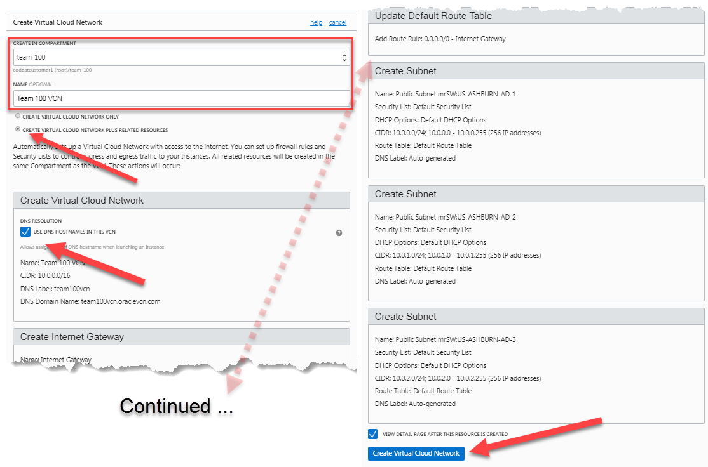

##### Figure 13: Create Virtual Cloud Network dialog

4.  Ensure that ‘Use DNS hostnames in this VCN’ is checked.

5.  Confirm the details of the automatically created VCN. There should be a VCN, an Internet Gateway, a Default Route Table, and three subnets.

6.  Click Create Virtual Cloud Network

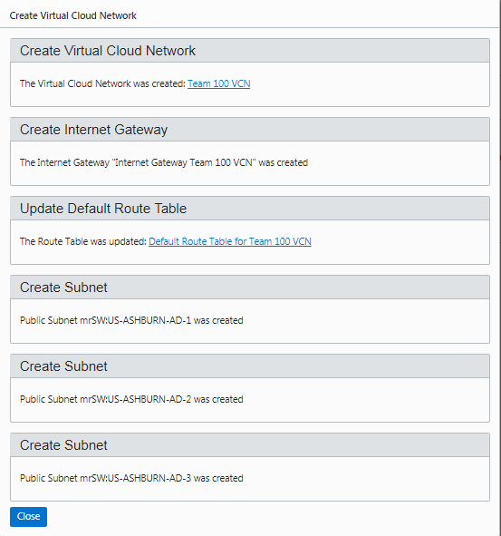

##### Figure 14: Confirm Create Virtual Cloud Network dialog

7.  Click Close on the dialog to return to VCN creation. The VCN you created should appear and immediately be in the Available state.

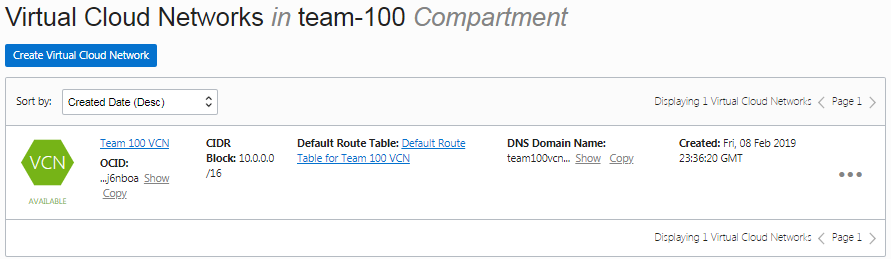

##### Figure 15: VCN Available Description

# Add a Security List entry

A security list is a virtual firewall for an instance, with rules that specify the types of traffic allowed in and out, called ingress and egress respectively. Security lists are enforced at the instance level. However, security lists are configured at the subnet level, which means that all instances in a given subnet are subject to the same set of rules. The security lists apply to a given instance whether it's communicating with another instance in the VCN or a host outside the VCN.

For this particular lab we will be adding security rules to allow access to our Docker container.

1.  Click on the VCN you created (ex: *Team 100 VCN*) and then choose **Security Lists** from the side panel selections

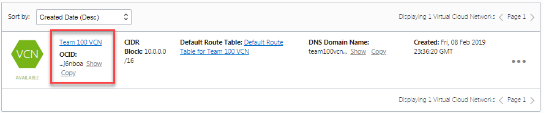

##### Figure 16: VCN Details

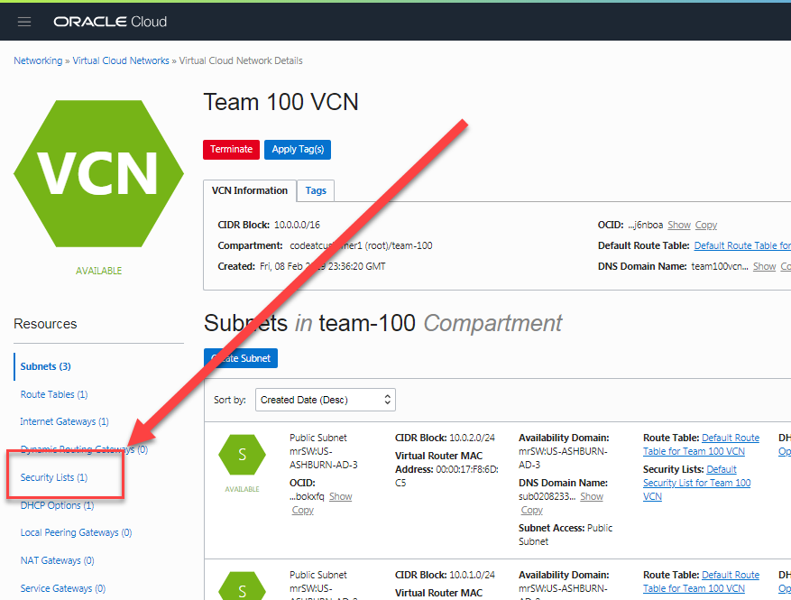

##### Figure 17: Security List option

2.  Click on **Default Security List** for \<*your VCN name*\>

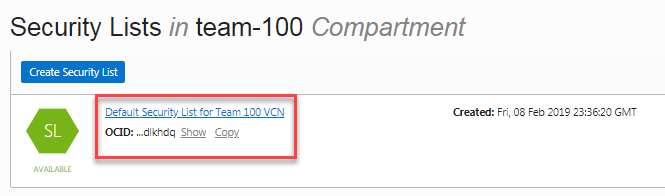

##### Figure 18

**Note:** *For the upcoming Docker deployments we will add five Ingress Rules that allow Internet access to ports 9080, 8002, 18002, 5600, and 8085. In a production environment, only the UI port (8085) would typically be exposed to the internet. These ports are being expose for testing of other Applications and certain Oracle centric functionality for lab purposes only.*

3.  Click **Edit All Rules**

**Note:** *Do not edit or remove existing rules, add new ones to the list.*

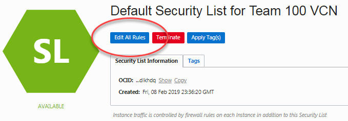

##### Figure 19: Edit All Rules button

4.  Select **+ Another Ingress Rule** button at the bottom.

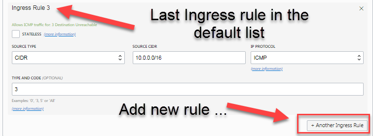

##### Figure 20: + Another Ingress Rule button

5.  Enter the following details as Ingress Rules 4, 5, 6, 7, and 8.  Leave all other values at their default.

**Ingress Rule 4**

  - Source CIDR: 0.0.0.0/0
  - Destination Port Range: 8085

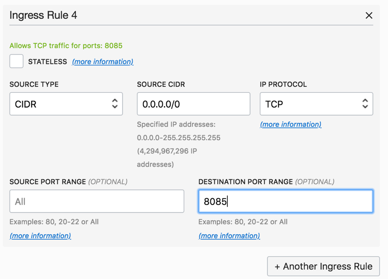

##### Figure 21: Ingress Rule 4 example

**Ingress Rule 5**

  - Source CIDR: 0.0.0.0/0
  - Destination Port Range: 9080

**Ingress Rule 6**

  - Source CIDR: 0.0.0.0/0
  - Destination Port Range: 8002

**Ingress Rule 7**

  - Source CIDR: 0.0.0.0/0
  - Destination Port Range: 18002

**Ingress Rule 8**

  - Source CIDR: 0.0.0.0/0
  - Destination Port Range: 5600

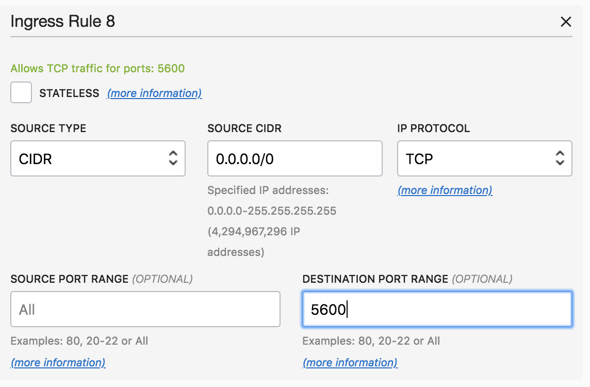

##### Figure 22: Ingress Rule 8 example

6.  Click the **Save Security List Rules** button at the bottom of the
    page.

##### Figure 23: Save security list rules button

##### Figure 24: Completed ingress rules example

# Create SSH Key Pair (Linux, Mac, Windows client)

SSH keys are required to access a running OCI instance securely. You can use an existing SSH-2 RSA key pair or create a new one. Below are instructions for generating your individual key pair for Linux/Mac and Windows. You can also find instructions on the OCI documentation page.
<https://docs.cloud.oracle.com/iaas/Content/GSG/Tasks/creatingkeys.htm>

## Linux or Mac based Laptop  

1.  **Open** a terminal and type the ssh-keygen command.

    `[opc-instance]$ ssh-keygen -t rsa -N "passphrase" -b 2048 -C "<enteryourkeyname>" -f <enteryourkeyname>-key`

**Note:** *Don't lose your key or forget your passphrase, the key won't be usable without them.  Also, the passphrase isn't required for this lab but should be used for production as a security best practice.*

**ssh-keygen command switch guide:**

    -t – algorithm
    -N – “passphrase” Not required but best practice for better security
    -b – Number of bits – 2048 is standard
    -C – Key name identifier
    -f - \<path/root\_name\> - location and root name for files

##### Figure 25: ssh-keygen command

7.  The key pair you generated is now in the current directory.  ls -l command to verify.

##### Figure 26: Sample key pair with the example name of team-100.  Your key name should be different.

8.  For Linux and Mac Clients copy the contents of the public key file (.pub). Use an editor or cat command to view the file and copy the key contents. You can use this for the ‘paste key’ dialog when launching an instance.

##### Figure 27: Copy ssh key

##  Windows

A third party SSH client needs to be installed for Windows versions prior to Windows 10 in order to generate SSH keys. You can use Git Bash, Putty, or a tool of your choice. This tutorial will use Putty as an example. Git Bash instructions are the same as the Linux instructions above.

**Note:** *If you don’t already have it, download the Putty application and install it on your Windows machine. [Download Putty](https://www.chiark.greenend.org.uk/~sgtatham/putty/latest.html).  Puttygen is a utility that comes with the Putty package and is used to generate SSH keys.*

<!-- end list -->

9.  From the Windows start menu, run the PuTTYgen utility

##### Figure 28:  PuTTYgen utility command

10. Click the Generate button and follow the instructions for generating random information.

##### Figure 29: Generate the key with PuttyGen

11. After the key information has been generated, enter a **passphrase**
    and press the **Save private key** button to save the key to your
    system.

**Note:** *A passphrase is not required but recommended for stronger security.*

##### Figure 30: Putty save key dialog

12. The private key should have the .ppk extension. Store it in a folder that’s easily accessible.

##### Figure 31: Saving the private key

**NOTE:**  *We will not use the ‘Save public key’ option in PuttyGen, as the keyfile is not compatible with Linux openSSH. Instead, we will copy and paste the key information into a text file.*

13. Left click on the Public key information and choose ‘Select All’ to select everything in the key field. Then left click again and copy the selected information to the clipboard.

##### Figure 32: Save all and copy key to clipboard

14. We will use the clipboard to paste the key information in the next step but you can also save your public key to a text file with Notepad. Open a plain text editor and paste the key information. Name and save the file with a .pub extension.

##### Figure 33: Key pasted and saved with Windows Notepad

15. Close the Puttygen application

# Create a Compute Instance

1.  Navigate to the OCI console, use the top left hamburger menu and
    choose Compute \> Instances to open the Instance Creation menu.

##### Figure 34: Create Instance Menu item

16. Click the **Create Instance** button

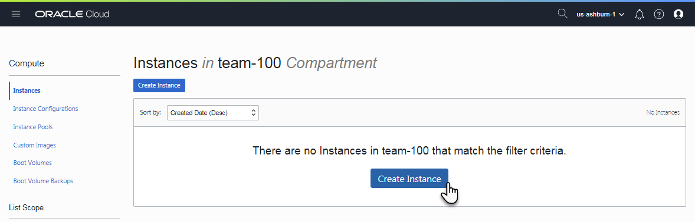

##### Figure 35: Create instance button

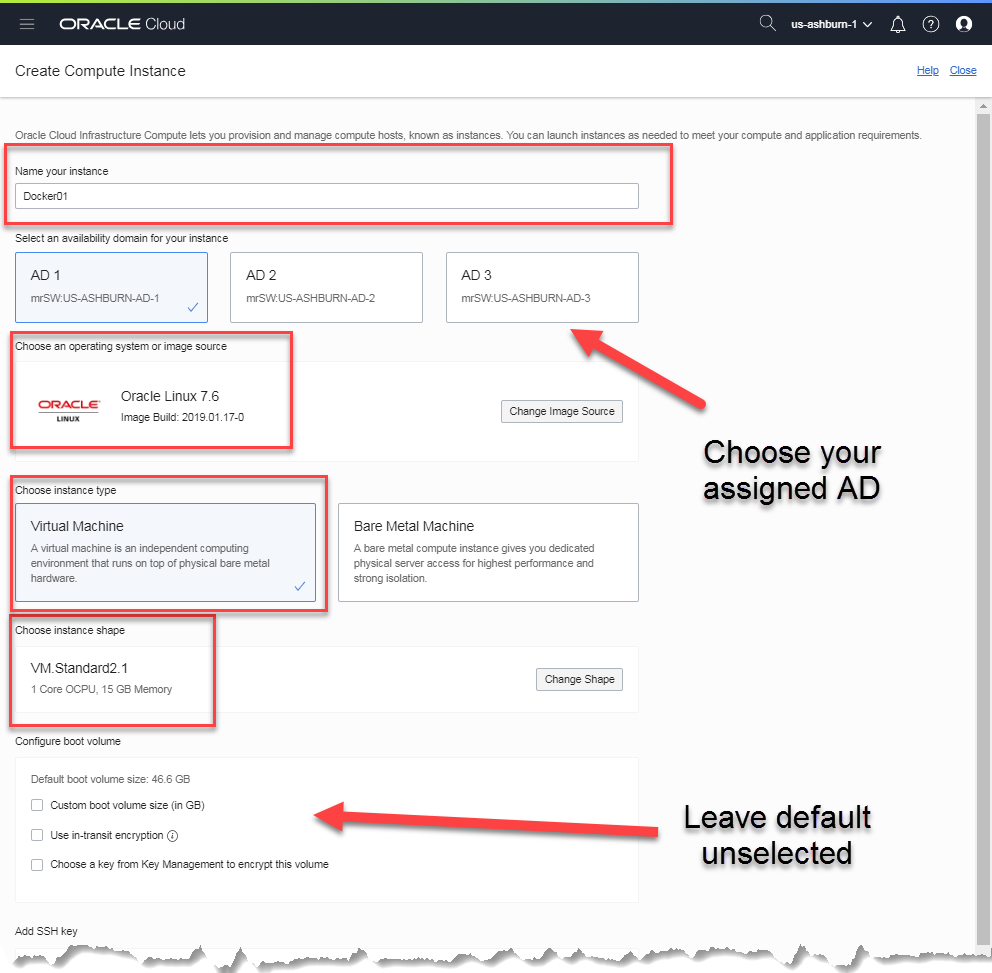

##### Figure 36: Information required to create an instance

17. Enter information to create your compute instance.

**Note:** *Each team has been assigned an Availability Domain in order to help conserve resources in the demo lab environment. Please use your assigned Availability Domain.*

| **Name:**                | **\<instance name\>\_*your\_compartment\_name*** |
| ------------------------ | ------------------------------------------------ |
| Availability Domain: | AD assigned to your team AD1, AD2, or AD3   |
| Operating System:    | Oracle Linux 7.6                            |
| Instance Type:       | Virtual Machine                             |
| Shape:               | VM.Standard2.1                              |
| Boot Volume:         | Default                                     |
| SSH Key:             | Choose SSH Key file or Paste SSH keys      |
| Compartment:         | Your team compartment* (*ex:* team-100)     |
| VCN:                 | Your VCN* (*ex:* Team 100 VCN)              |
| Subnet Compartment:  | Your subnet compartment* (ex: team-100)     |
| Subnet:              | Public Subnet in your compartment*            |

18. In the **Add SSH Key** section you can select the SSH key file from your system or paste directly from the clipboard (if you’ve saved that information from the key generation step earlier)

##### Figure 37: Choose SSH Key option

##### Figure 38:  Paste SSH key option

19. In the Configure networking Section leave the default VCN and subnet information and click Create. 
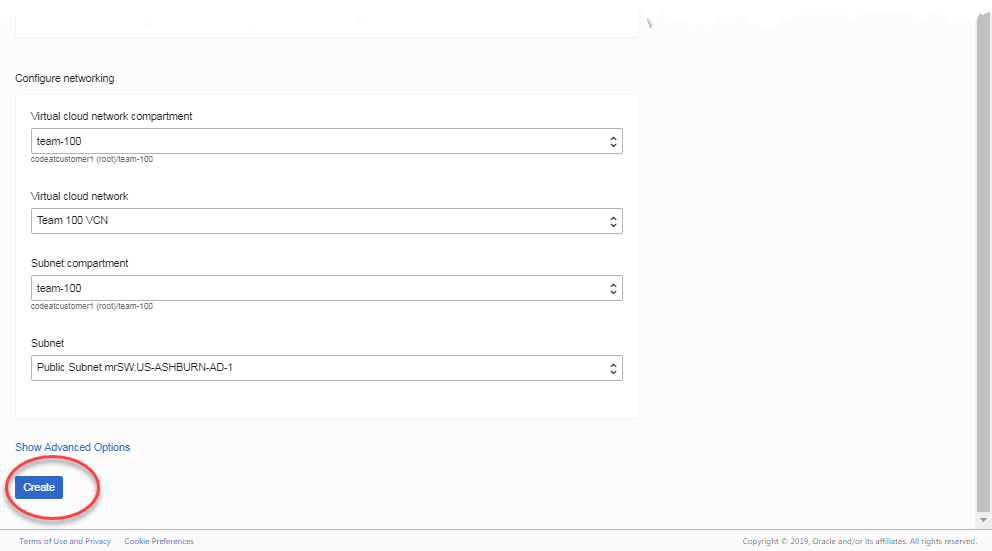

##### Figure 39: Create compute instance dialog

Your instance will begin provisioning and should be in the available state within a few moments.

##### Figure 40: Instance provisioning

After a few moments, the icon will turn green and the title will change to RUNNING.

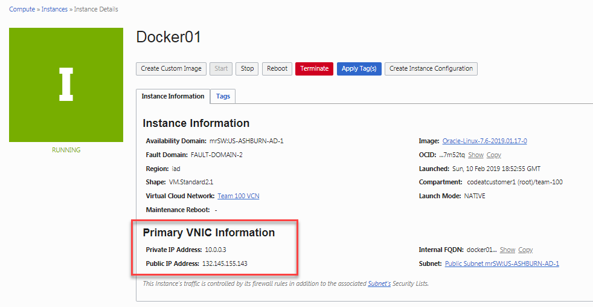

##### Figure 41: Running instance and Primary VNIC information

20. Take note of the assigned Public IP Address you will need this to access the instance later.  

# Access the instance and install Docker

We will use an SSH terminal session to access the compute image. From there we will install Docker and GIT.

## SSH Key access for Linux/Mac 

1.  Use your favorite terminal program and issue the below ssh command to connect. Use the public IP address of your instance as referenced in the above screenshot.  (*The IP address listed is for example only, please use your own)*

21. Navigate to the subdirectory where you key is stored and issue the following command.

    `ssh –i <your private key name> opc@<your ip address>`

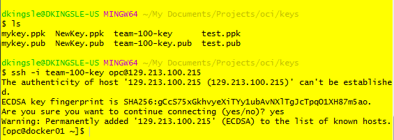

##### Figure 42: SSH connection to running instance

## SSH Key access for Windows with Putty

1.  For Windows clients, open Putty. With the Session category selected, enter the IP address for the instance you want to access and select SSH from the radio buttons (port 22).

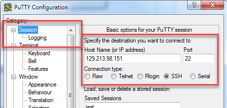

##### Figure 43: Putty session information

22. In the Connection category, choose **Data** and enter ‘opc’ as the Auto-login username.

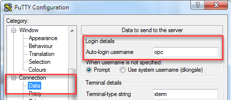

##### Figure 44: Putty auto-login information

23. In the **Connection \> SSH \> Auth** category, use the Browse button to navigate and load the .ppk file you created earlier with Putty.

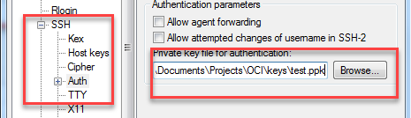

##### Figure 45: Putty private SSH key

24. Navigate back to the **Session** category, enter a name in the **Saved Sessions** field and choose Save. This will save your SSH terminal session for use later without having to re-enter the information.

v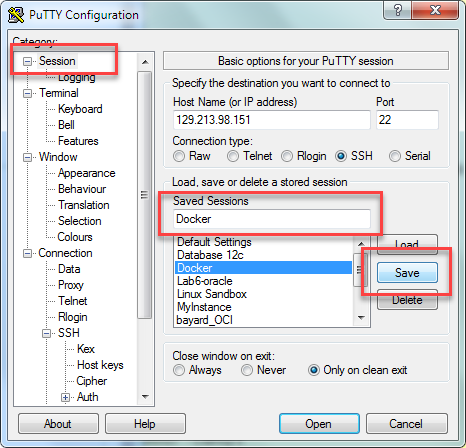

##### Figure 46: Putty Save SSH Session

25. Click on **Open** to connect to the instance.

26. Choose **Yes** on the alert message:

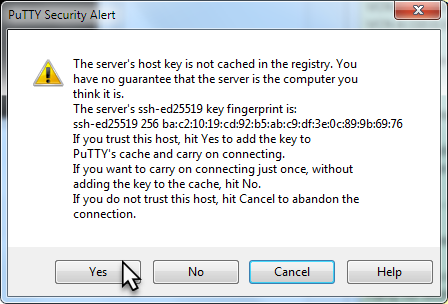

##### Figure 47: Putty security alert

27. You will be logged into the compute image:

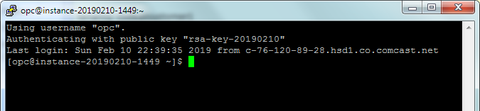

##### Figure 48: Successful Putty instance login

# Install and configure Docker and GIT

In the next sections you will install the Docker engine, enable it to start on re-boot,
grant Docker privileges to the opc user and finally, install GIT to simulate a simple development environment.

1.  **Change to root and install Docker. Type** the following commands in the terminal window. Answer **‘Y’** when system prompts you if the installation of Docker is okay.

    `[root@docker01 opc]# sudo –s`

    `[root@docker01 opc]# yum install docker-engine`

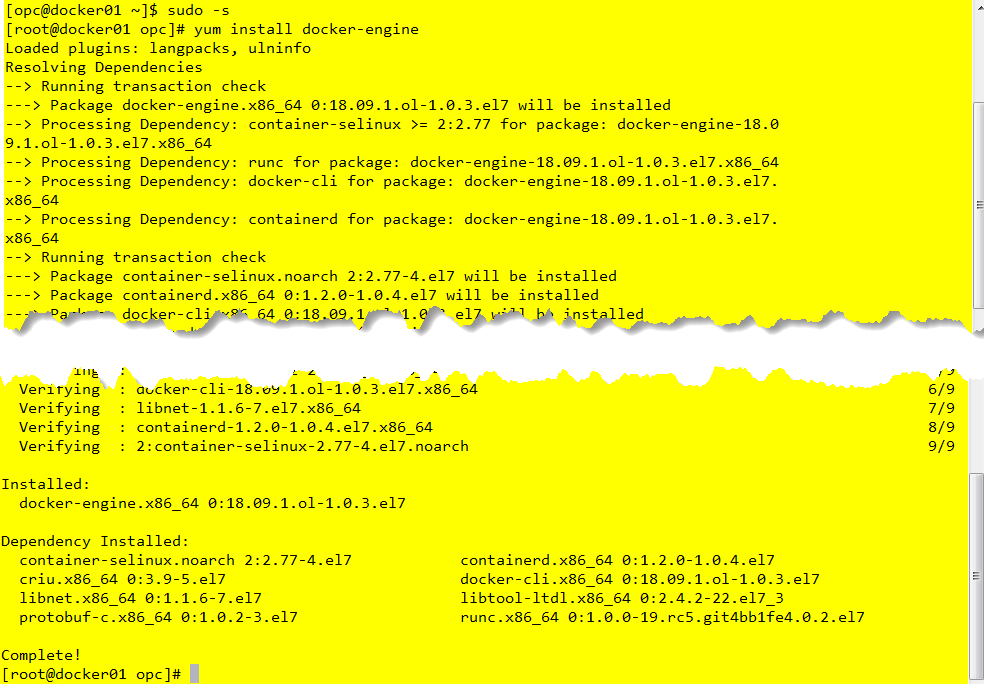

##### Figure 49: Docker install screen example

28. Add opc to the docker group and enable and start Docker.

    `[root@docker01 opc]# usermod –aG docker opc`

    `[root@docker01 opc]# systemctl enable docker`

    `[root@docker01 opc]# systemctl start docker`

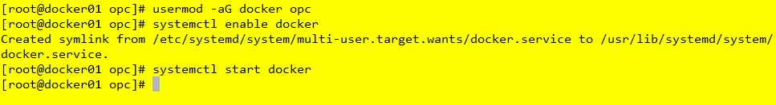

##### Figure 50: Enable user, systemctl command, and docker startup

29. Install GIT

\[root@docker01 opc\]\# yum install git

30. Answer ‘y’ when prompted ‘Is this ok’

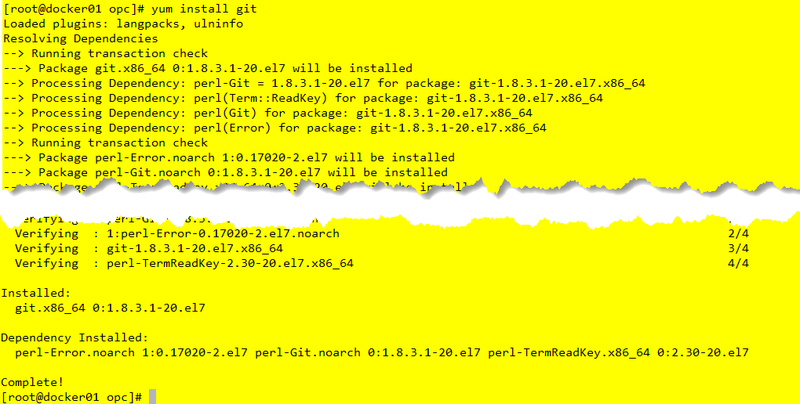

##### Figure 51: GIT installation command dialog

31. **Type** the following commands to verify Docker and GIT have been installed and are working properly.

    `[root@docker01 opc]# su – opc`

    `[root@docker01 opc]# docker version`

    `[root@docker01 opc]# docker images`

    `[root@docker01 opc]# git –-version`

**Note:** *If you get failed permissions on the docker version command, try completely logging out and back into your SSH terminal session.*

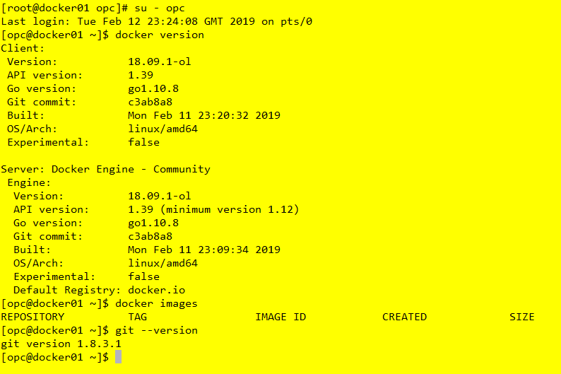

##### Figure 52: Docker and GIT version verification

# Edit /etc/sysconfig/selinux

1.  Set the server to permissive mode and make the change permanent to survive restarts.

**Note:** *Use vi or any available editor and edit the /etc/sysconfig/selinux file. You must be root to edit this file.*

32. Change the line SELINUX=enforcing to SELINUX=permissive

    `[opc@docker01 opc]# sudo su`

    `[root@docker01 opc]# vi /etc/sysconfig/selinux`

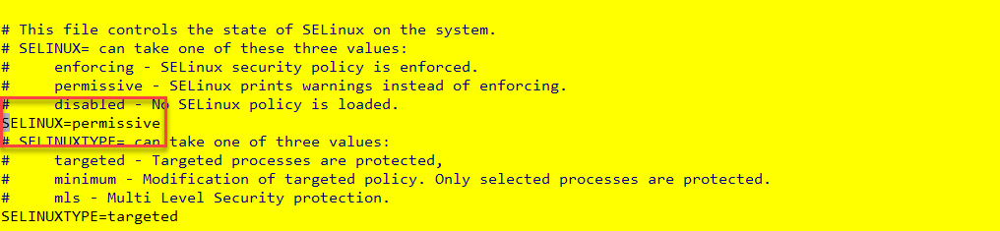

##### Figure 53: Permissive mode set in configuration file

33. Save the file and exit the editor. Type the following to verify
    the server is in permissive mode.

    `[root@docker01 opc]# setenforce 0`

    `[root@docker01 opc]# sestatus`

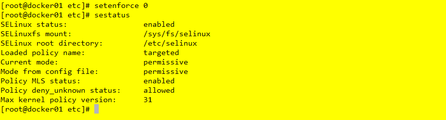

##### Figure 54: SE Linux status command

34. Type the following commands to exit the root account and return to the opc user.

    `[root@docker01 opc]# exit`

    `[opc@docker01 opc\]\# whoami`

##### Figure 55: Exit to 'opc' user

# Docker basics

This section of the lab will introduce the learner to Docker by showing
them how to create a container architecture, REST, and a simple micro
service.

  - [Docker Documentation](https://docs.docker.com/)
  - [Container Documentation](https://docs.docker.com/glossary/?term=container)
  - [Docker Hub](https://hub.docker.com/)

**Objectives**

  - Deploy and test a Docker container running an application
  - Use the Docker Hub registry
  - Learn Docker commands
  - Learn the basics of container networking and file system mapping.

**Requirements:**

  - Docker Hub Account (*provided*)
  - Docker and GIT installed in a Linux cloud instance

<!-- end list -->

1.  Before creating a container, verify the Docker installation and that it’s running correctly.

2.  If not still logged in, SSH as the ‘opc’ user into the Linux OCI image (Docker01) created earlier.

3.  Verify that Docker is running. **Type** the following to verify the Docker version:

\[opc@docker01 opc\]\# docker version

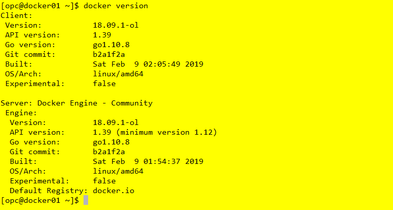

##### Figure 56: Docker version command

4.  The docker ps command shows information about containers. We haven’t created anything yet but let’s see if there are any containers currently running. Type the following command.

    `[opc@docker01 opc]# docker ps`

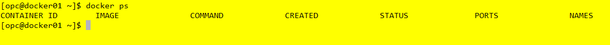

##### Figure 57: Docker ps

## Download and create a container from an image.

In the next few steps we will download an image from the Docker Hub and create a container from that image. The image contains a JSON formatted data file with test data that can be accessed via its exposed REST service. Docker will search for the designated image locally before going to Docker HUB.

| \-d, --detach                       | Runs the container in the background                                                                           |
| ----------------------------------- | -------------------------------------------------------------------------------------------------------------- |
| \-it, -i interactive, -t pseudo TTY | Allocates a pseudo-TTY connected to the container’s stdin, creating an interactive bash shell in the container |
| \-rm                                | When this container is stopped all resources associated with it (storage, etc) will be deleted                 |
| \-name string                       | Assign a name to the container                                                                                 |
| \-p                                 | Publish a containers port to the host (8002)                                                                   |
| \-e                                 | Set environment variables. DS designates JSON datasource                                                       |

##### Figure 34: Docker run command flag descriptions

1.  **Type** the following command to download the image.

    `[opc@docker01 opc]# docker run –d –it --rm --name restclient -p=8002:8002 –e DS=’json’ wvbirder/restclient`

##### Figure 58: Docker run command output

## Check running containers

2.  Run the following command to check out the container that was just created.

    `[opc@docker01 opc]# docker ps`

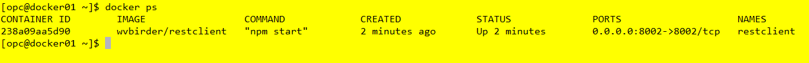

##### Figure 59: Docker ps command with running container

Verify that a unique container ID was assigned and that the container's port is mapped to 8002, which is the same as the Host's port.

## Connect to the application with a browser

3.  Use the Public IP address to test the deployment. Open the OCI console and use the top left hamburger menu to navigate to Compute > Instances. We will open the instance details menu and obtain the public IP address that was assigned.

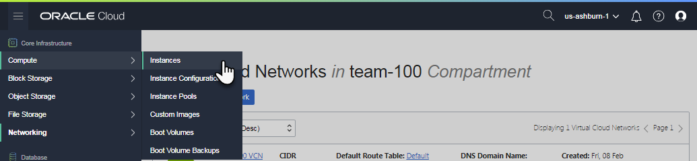

##### Figure 60

4.  Click on the **Docker** instance link or use the ellipses on the right side to open the menu and choose View Instance Details.

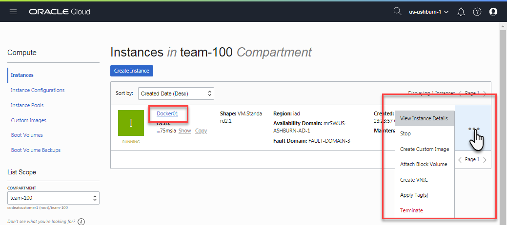

##### Figure 61

5.  You’ll find the Public IP address in the Primary VNIC field.

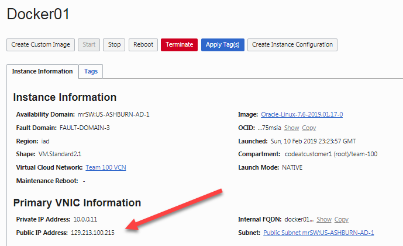

##### Figure 62: Public IP address from OCI instance screen

6.  Copy the IP address and paste into a browser on your local machine, followed by the port number of the docker container (:8002).

    `http://<your public ip address>:8002`

Example: http://129.213.100.215:8002

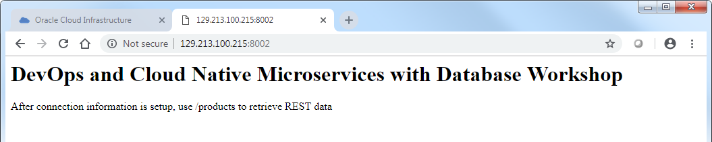

##### Figure 63: Successful connection to application

7.  Next add the folder that contains the data. Enter the following information into your browsers address bar.

    `http://<your public ip address>:8002/products`

Example: http://129.213.100.215:8002/products

8.  If your browser contains a JSON Formatter add-on then the output will look like the below screenshot.

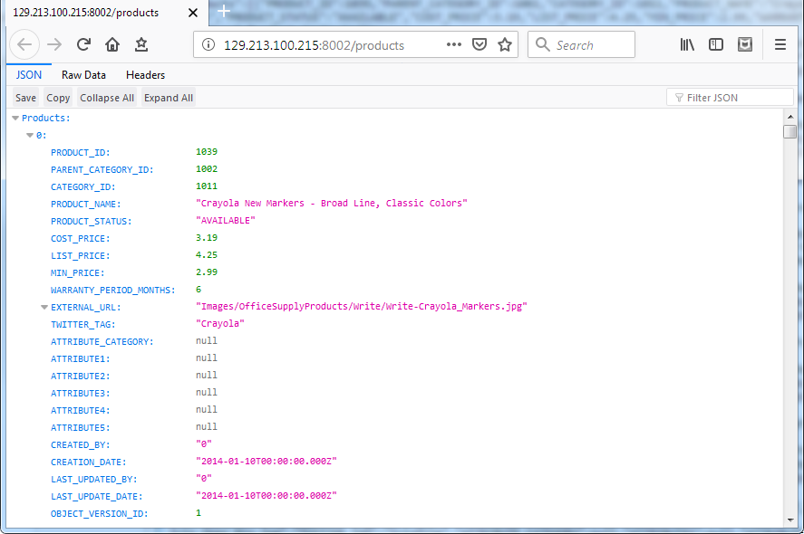

##### Figure 64: JSON formatted output

9.  If no JSON formatter is present, the output will look like the below screen shot. Either way is fine.

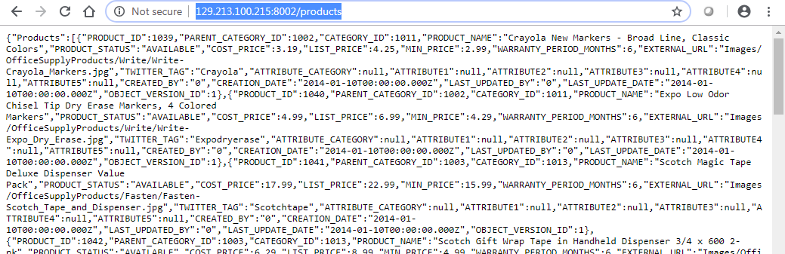

##### Figure 65: Non-JSON formatted output

10. Use the following commands to stop the container so we can start it on another port and view status after the command has run.

    `[opc@docker01 opc]# docker stop restclient`

    `[opc@docker01 opc]# docker ps -a`

**Note:** We started the restclient container with the `--rm` option, so stopping it will remove all allocated resources

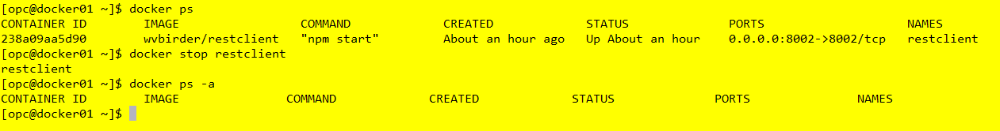

##### Figure 66: Deleted container

The `–ps` command shows that the container has been deleted.

## Start another Container with a different HOST Port

11. Type the following to start another container on port 18002

    `[opc@docker01 opc]# docker run –d –it --rm --name restclient -p=18002:8002 –e DS=’json’ wvbirder/restclient`

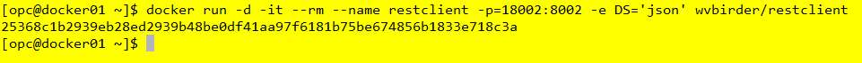

##### Figure 67: Start container with new port assignment

12. Type in the public IP address and folder in your web browser but substitute port 18002 for port 8002. Note that we mapped port 8002 to 18002 in the container startup command.

    `http://<your public IP address>129.213.100.215:18002/products`

**Example** http://129.213.100.215:18002/products

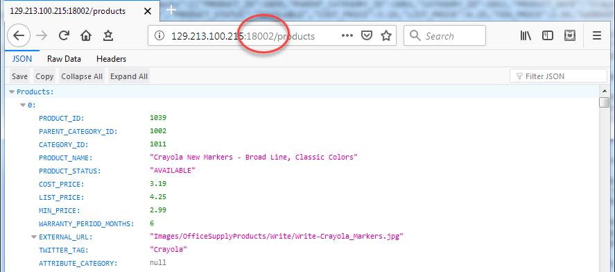

##### Figure 68: Substitute port 18002 in web url

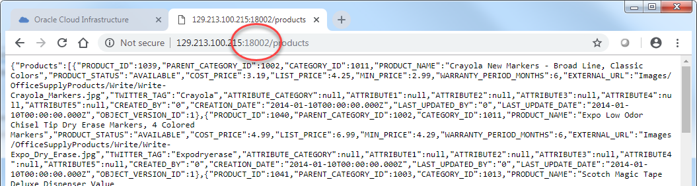

##### Figure 69: New port assignment in browser

## Inspect the Container's Network and IP Address

13. Use the following commands to inspect the networking information that Docker uses when setting up containers. The ip command shows that Docker has created a network connection with an assigned IP    address.

    `[opc@docker01 opc]# ip address`

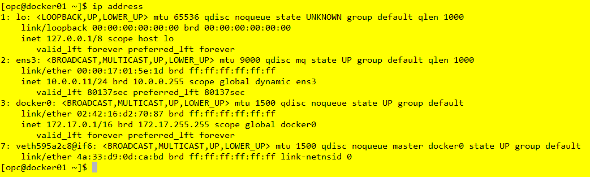

##### Figure 70: IP Address Check

14. The Docker network command shows the three default networks that Docker creates automatically. Docker always launches containers in the bridge network unless instructed otherwise.

    `[opc@docker01 opc]# docker network ls`

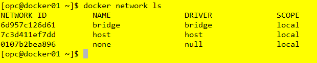

##### Figure 71: Docker network command

15. The docker network inspect bridge command shows us detailed information about the Docker bridge network, including the assigned IP address and the assigned container name.

    `[opc@docker01 opc]# docker network inspect bridge`

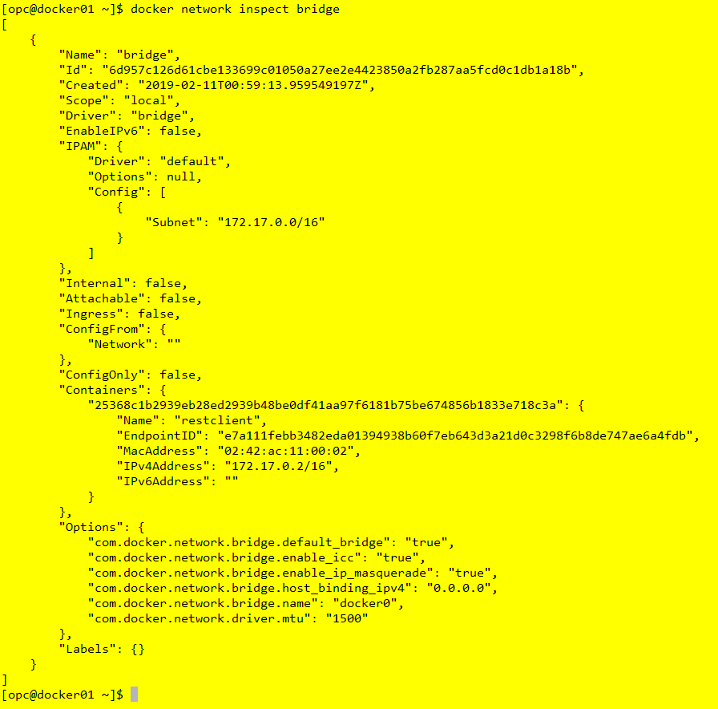

##### Figure 72: Docker network inspect bridge output

16. You can ping the Docker IP address from your host server. Issue the ping command to the Docker IP address in your terminal window.

    `[opc@docker01 opc]# ping 172.17.0.2 –c3`

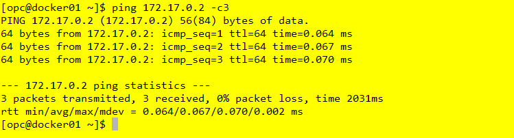

##### Figure 73: Ping command to test internal access

17. And finally, stop the restclient container and verify it has been
    removed from the list.

    `[opc@docker01 opc]# docker stop restclient`

    `[opc@docker01 opc]# docker ps -a`

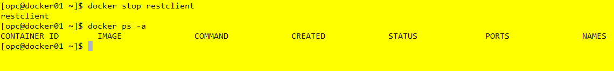

##### Figure 74: Stop restclient command

# Block Volume Service

**Overview**

OCI Block Volumes can be created, attached, moved, and deleted as needed to support storage needs. Block volumes can be moved to another image without loss of data. In this portion of the exercise we will create a block volume and attach it to our instance.

## Create a block volume to increase capacity on an instance.

1.  Use the hamburger menu in the upper left of the OCI console and choose Block Storage > Block Volumes

##### Figure 75: Block Volume item selection

2.  In the Block Volumes dialog, verify that your compartment is selected and click on the Create Block Volume button

##### Figure 76: Create Block volume in assigned compartment

3.  Fill in the following details in the Create Block Volume dialog.

<!-- end list -->

- Create in compartment: \<your compartment\>
- Name: \<choose a name\> ex: volume01
- Availability Domain: \<Choose the AD specified for your team\>
- Size: 50GB *(50GB is the minimum allowed. 32TB is the max)*
- Backup Policy: Gold

**Note:** *There are four backup policies, none, bronze, silver, and gold. You can read more about what’s included in each policy here. [Volume Backup
Policies](https://docs.cloud.oracle.com/iaas/Content/Block/Tasks/schedulingvolumebackups.htm)*

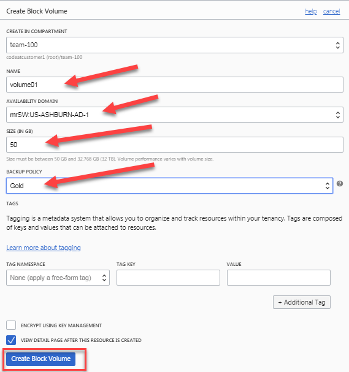

##### Figure 77: Create Block Volume dialog form

4.  Click on **Create Block Volume**, in a few moments the icon will turn green and your block volume will be provisioned.

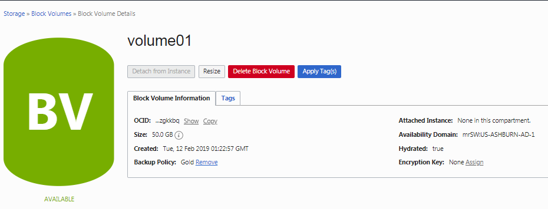

##### Figure 78: Block Volume Available

5.  Attach the block volume to an instance.

6.  Navigate to the **Compute > Instances** menu to view instance.

7.  You can use the instance menu to attach a block volume. Click on the ellipses to view the menu, then select **Attach Block Volume**.

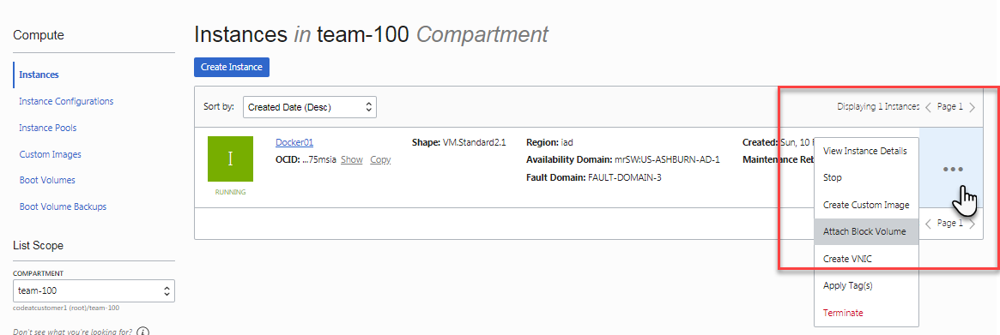

##### Figure 79: Instance action menu

8.  Or you can open the instance details menu and attach a block volume from there.

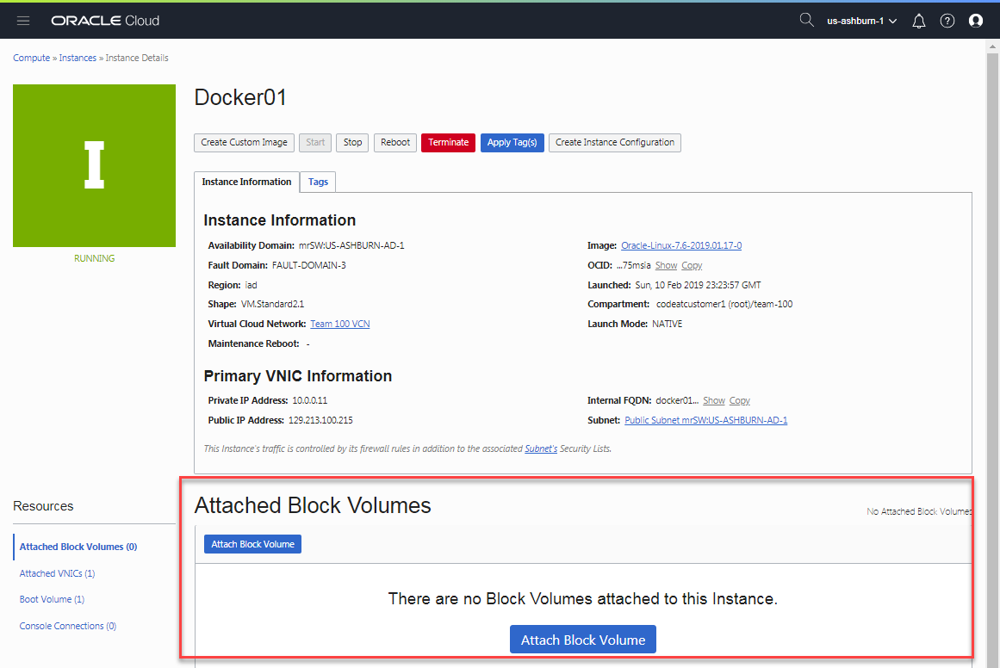

##### Figure 80: Attach Block Volume

9.  In the Attach Block Volume dialog you can select iSCSI or Paravirtualized as the attachment type. Paravirtualized will connect the volume directly without any further commands, but at a potential performance trade-off from iSCSI. iSCSI attach will require iSCSI commands to be run on the host. These commands are also provided for you in the interface.

10. Fill out the dialog, choose iSCSI, your compartment, choose the volume name you created earlier and click Attach. Leave Device Path, CHAP, and Access at their defaults.

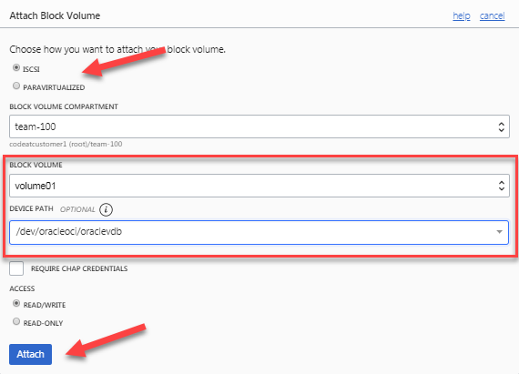

##### Figure 81: Attach block volume dialog

11. You will see a message about iSCSI attachment commands. Click **Close** to dismiss this message.

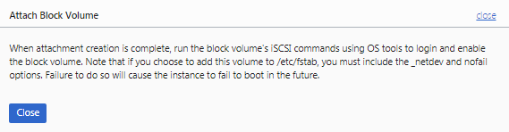

##### Figure 82: Attach block volume instuctions

12. When the volume finishes attaching, the icon will turn green with the Attached label below it. Click on the ellipsis and choose iSCSI Commands & Information

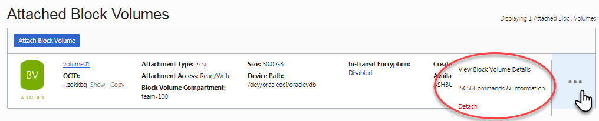

##### Figure 83: iSCSI command dialog

13. Copy the iSCSI attach commands and paste them into the terminal windows that’s running as ‘opc’. Or you can use the ‘Copy’ button to copy all of the commands at once.

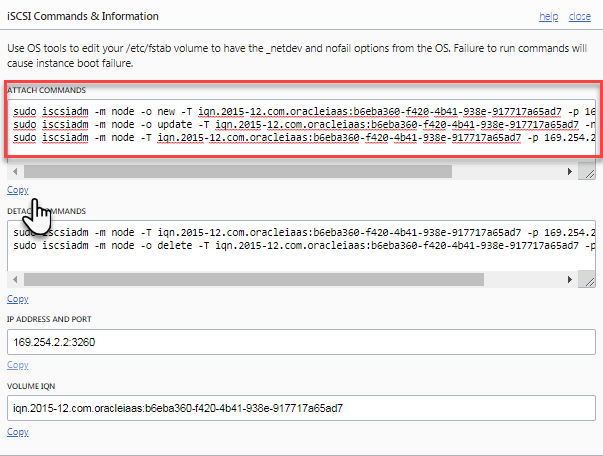

##### Figure 84: iSCSI commands and information

14. Go to the terminal window and issue the lsblk command to verify that nothing has been mounted yet.

    `opc@docker01 opc]# lsblk`

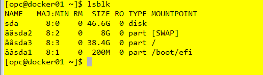

##### Figure 85: Linux lsblk command output

15. Issue the iSCSI commands you copied from the Block Volume interface. (Your commands will be different)

    `sudo iscsiadm -m node -o new -T iqn.2015-12.com.oracleiaas:b6eba360-f420-4b41-938e-917717a65ad7 -p 169.254.2.2:3260`

    `sudo iscsiadm -m node -o update -T iqn.2015-12.com.oracleiaas:b6eba360-f420-4b41-938e-917717a65ad7 -n node.startup -v automatic`

    `sudo iscsiadm -m node -T iqn.2015-12.com.oracleiaas:b6eba360-f420-4b41-938e-917717a65ad7 -p 169.254.2.2:3260 -l`

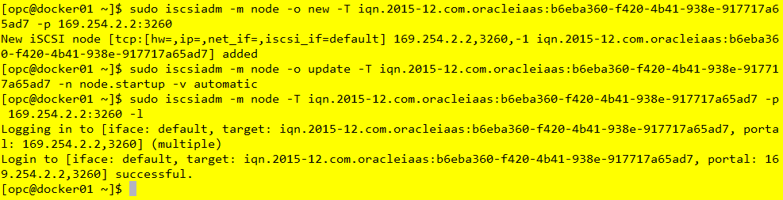

##### Figure 86: iSCSI commands to mount disk on the instance

16. Run the lsblk command to verify that the disk has been recognized by the operating system.
    
    `[opc@docker01 opc]# lsblk`

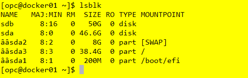

##### Figure 87: Linux lsblk command showing attached disk

17. Run the following commands to format the disk and mount it. Press Y to proceed anyway when prompted about one partition.

    `[opc@docker01 opc]# sudo mkfs –t ext4 /dev/sdb`

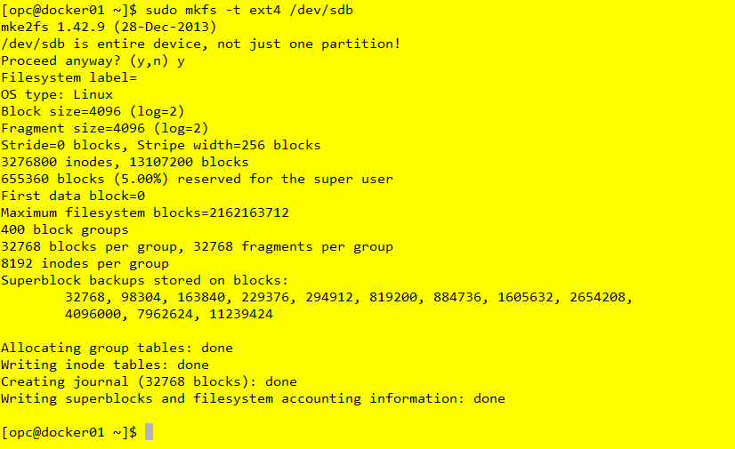

##### Figure 88: File system commands for mounted volume

    `[opc@docker01 opc]# sudo mkdir /mnt/disk1`

    `[opc@docker01 opc]# sudo mount /dev/sdb /mnt/disk1`

    `[opc@docker01 opc]# ls –l /mnt/disk1`

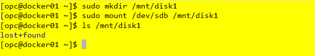

##### Figure 89: Linux mount commands for block volume

# CONCLUSION

This lab introduced you to the Oracle Cloud Infrastructure service.  Let’s review what you did.

You created a virtual cloud network, a compute instance, and block storage. You installed and configured Docker containers on the compute instance you created. This lab was designed to introduce you to many of the services you will use in the design of a customer solution and to
familiarize you with those services.

## What you completed

  - Accessed your Oracle Cloud Account

  - Created a Compartment and a VCN

  - Created a compute instance

  - Created block storage

  - Accessed cloud instance

  - Installed Docker and GIT

  - Installed web services

##
