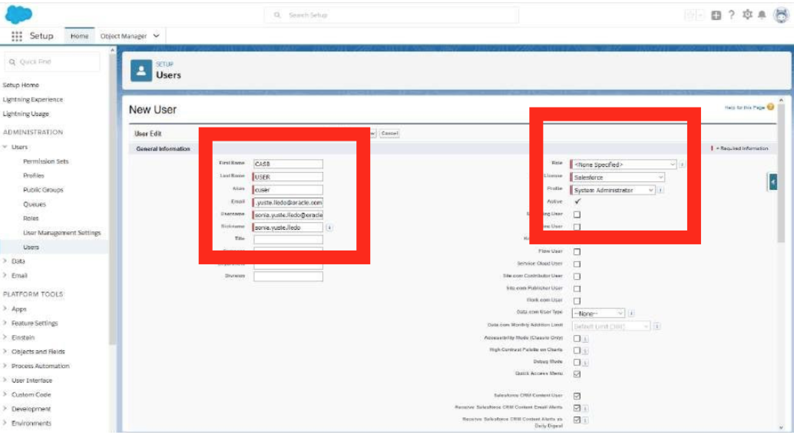

# Lab 1:  Connecting to Autonomous Database

## Table of Contents

- [Module 1: Create and monitor a sanctioned application](#module-1--create-and-monitor-a-sanctioned-application)
- [Module 2: Explore credentials wallet file information](#module-2--examining-the-wallet-file)
- [Module 3: Connect to your ATP instance with SQL Developer](#module-3--connecting-to-the-database-using-sql-developer)
- [Module 4: Connect to your ATP instance with Oracle ML Notebooks](#module-4--connecting-to-the-database-using-oracle-machine-learning-oml)

***** 

## Module 1:  Create and monitor a sanctioned application

Oracle CASB monitors your sanctioned applications after a simple registration process. This enables you to manage risk events from a centralized platform instead of having to enter the individual application to see and remediate security threats. Oracle CASB monitors risk events such as blacklisted IP addresses, anomalous user behavior and unwanted security configurations in the application.
As part of this first part of the module we will enrol two applications, Box and SalesForce.

### Add Box as a Sanctioned Application

1. Navigate to https://developer.box.com/
*  Click the Console button in the top right corner

Figure 1-1

* Click Sign up

Figure 1-2

* Select the section Individual Plans and click to Sign Up in the Individual account

Figure 1-3

* Enter required information and click Submit, you will receive a verification email

Figure 1-4

* Once you have the account for Box, you have to configure it for monitoring.

2. Now that you have create your developer account on Box, let's configure the service account for Monitoring

* Log in to developer.box.com
* Go to My Apps and create an application

Figure 1-5

* Select Custom App and click next

Figure 1-6

* Select the recommended authentication method OAuth 2.0 with JWT (Server Authentication) and click next

Figure 1-7

* Give an unique name to your app and click Create App

Figure 1-8

* Click on your new application, and in the section Configuration, select the following:

  1. Authentication Method: OAuth 2.0 with JWT (Server Authentication)
  

Figure 1-9

  2. Application access: **Enterprise**
  

Figure 1-10

  3. Save your changes. An Admin Console tab is now added to your main Box.com account.

3. Create the Dedicated Oracle CASB Cloud Service User
  * Create a dedicated user for Oracle CASB Cloud Service in the Box account that you want to monitor. This user is dedicated for use by Oracle CASB Cloud Service and shouldn’t be used for any other purpose.
  * Log in to the Box developer account.
  * Select the Admin Console tab.
  * Click the Users & Groups section.
  * Click the + Users button.

 

Figure 1-11

* In the Name field, give the service account an identifier (example: occs.trialservice).
* If you are going to be the tenant master administrator for Oracle CASB Cloud Service, then provide your email address in the Email field and click **Add User**
* Open the recently created user and grant this user the Co-Admin role. This account must have either the Admin or Co-Admin role.

 

Figure 1-12

* Assign additional privileges to this user.
At a minimum, the user should be able to run new reports and access existing reports. If you want to be able to push security controls from Oracle CASB Cloud Service to this Box instance, then this user must also have these privileges:

`Users and Groups: Manage users`

`Users and Groups: Manage groups`

`Reports and Settings: View settings and apps for your company`

`Reports and Settings: Edit settings and apps for your company`

`Reports and Settings: Run new reports and access existing reports`

Figure 1-13

* Click *Save*

* In the users list you should be able now to see the Oracle CASB Cloud Service user that you just created.

Figure 1-14

* Check the email account that you provided for that user.
You should have a message from Box telling you to set a password for this user.

Figure 1-15

* Create a complex password for this account.
For example, at least 12 characters in length, with a combination of uppercase and lowercase letters, numbers, and special characters.

Figure 1-15

* You will use this user name and password to register your Box instance in Oracle CASB Cloud Service. Have a recovery procedure in case there are issues with the account.

4. Adding a Box instance (Push Security Controls Mode)

* You will add or register your Box instance to Oracle CASB Cloud Service to be monitored, and with the capability to push security configuration settings.
To register a Box instance with the Oracle CASB Cloud Service, you need the user ID and password that belongs to a Box administrator with the appropriate privileges in the account that you want to monitor. This user must be dedicated to the Oracle CASB Cloud Service. We will use the co-admin user that we created in the previous steps.

* In push security controls mode, Oracle CASB Cloud Service checks various security control values in the Box instance, and sets them to the values that you set at registration time. Later, you receive notifications when these security configuration settings change.

* Oracle CASB Cloud Service monitors these settings in Box:

  1. Password policies, authentication policies, and session settings: These are in the Box business settings page, Security tab.
  2. Settings: These additional security settings are in the Box business settings page, Content & Sharing tab.

* Login to your Cloud dashboard and open Oracle CASB Cloud Service console
* Select Applications from the Navigation menu.
* Click **Add/Modify App**
* In the Select an app type page, click the icon for box and click Next.

Figure 1-16

* In the Select an instance page, enter a unique name for your application instance.

Figure 1-17

* Click Next.
* In the Select monitoring type page, select Push controls and monitor to have Oracle
CASB Cloud Service set your preferred values in the application and subsequently monitor for deviations from these values.

Figure 1-18

* Oracle CASB Cloud Service generates a security control alert in Risk Events whenever it detects a mismatch between the selections that you make on this page and the settings in the Box instance.

* Click Next.

* In the Select security controls page, select the Standard security controls. In this mode, you will ensure that these values are set to the application's own defaults.
* Select the checkbox.

Figure 1-19

* Click Next.
* In the Enter credentials page, select Sign in with Box username and password.
* Enter the credentials for the dedicated co-admin user that you set up to communicate with Oracle CASB Cloud Service.
  1. User name. The username of the Oracle CASB Cloud Service user.
  2. Password. The password of the Oracle CASB Cloud Service user.

Figure 1-20

* When you are done entering your credentials, click Test Credentials. A new window pops up to ask you if you set the right permissions for that user in your Box account. Click Ok.

Figure 1-21

* It can take a minute or two for the application to receive and accept your credentials.
* When testing is done, you see a success message.
* Click **Submit**
* Click **Done**
* When the registration process is complete, your application instance appears on the Applications page. You start to see data for this instance after 30 minutes or so; although a complete synchronization will take longer.

****

### Add SalesForce as a Sanctioned Application

You’ll now add SalesForce as a sanctioned application for monitoring in Oracle CASB, so this business critical application remains compliant with security standards.

1. Navigate to https://developer.salesforce.com/
* Click the sign-up button in the top right corner
* Enter the required information
* Click Sign me up

Figure 1-22

2. You will get an email to confirm your account. Click Verify Account

Figure 1-23

3. Create a password for your account

Figure 1-24

4. Login to your Salesforce account.
5. On the left Panel navigate to Users => Profiles
* Click new profile

Figure 1-25

6. Existing Profile needs to be set to System Administrator and Profile Name can be named whatever you like, for example, CASBUSER.

Figure 1-26

7. Press save

8. Navigate to Users => Users 
* Click New User

Figure 1-27

9. The following Screen will appear. Fill in the required fields. User License must be set to Salesforce
* Profile name will be the name of the profile we previously created
* Save

Figure 1-28

10. An email will be triggered allowing for verification

Figure 1-29

11. Click to Verify account in the link attached in the email and fill password details for the new user. Now you will see the following:

Figure 1-30

This is the last step we need to complete in SalesForce.

****

**You have successfully connected and run an operation against ATP with Oracle OML. We will use OML in other labs.**

***END OF LAB***

[Back to Top](#table-of-contents)   
