 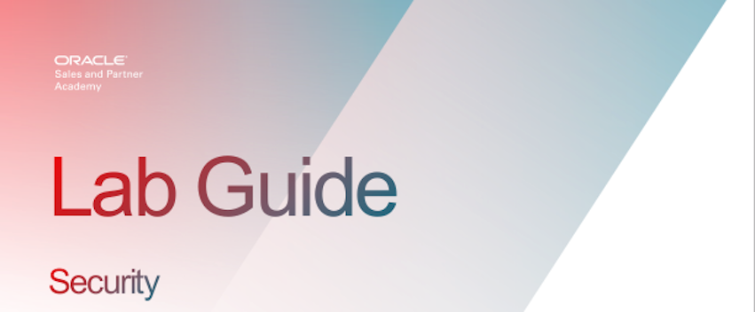
# Lab 2:  Oracle Identity Cloud Service

## Table of Contents

- [Module 1: User Management](#module-1--user-management)
- [Module 2: Configure SSO and Provisioning for Salesforce](#module-2--configure-sso-and-provisioning-for-salesforce)

***** 

 
# Lab Configuration and Details

For the workshop lab exercises, the current version of the Oracle Identity Cloud Service (IDCS) is being demonstrated.
 
This workshop is hosted in the Oracle Public Cloud (OPC). It includes a combination of cloud services, hosted on-premises software and 3rd
party software. Aside from the Identity Cloud Service, the remaining components are included to enable demonstrating integration, including
identity synchronization, federation, authentication, SSO and more.

This workbook is primarily designed to provide the necessary instructions and context to allow you to complete the labs in the Oracle Identity Cloud Service Workshop. If you would like additional information about the Oracle solution, you can contact your local Oracle account team and/or review some of the following publicly available information about the solution.

For consistency and for the ease of use-cases implementation, you will use a Gmail account. The following summarizes the components in our workshop:
 

  * [Oracle Identity Cloud](https://cloud.oracle.com/en_US/identity)

  * Salesforce – used for IDCS Application Integration and CASB Create
    and Monitor a sanctioned Application use-cases

 The following configuration information is provided to assist with
 accessing lab assets:

  * Workshop Actors
    
      * IDCS End Users (e.g. employees, customers, partners, etc.)
    
      * IDCS Administrators

*NOTE: This lab contains two main modules with optional exercises. Due to timing constraints, we encourage you to complete first the mandatory modules and then go back to the optional tasks.*

# Overview: Oracle Identity Cloud Service

## Introduction

 Identity Cloud Service is Oracle’s next generation comprehensive security and identity platform that provides an innovative, fully integrated service that delivers all the core identity and access management capabilities through a Cloud platform “as a service. The design of Identity Cloud Service (IDCS) is based on micro service architecture which is naturally aligned with Cloud principles of Scalability, Elasticity, Resilience, Ease of Deployment, Functional Agility, Technical Adoption and Organization Alignment.
 
 At high level, Oracle Identity Cloud Service offers the following functionalities:

  * Identity & Access Management

  * Integration with on-prem Active Directory or 3rd party Identity
    Systems

  * Single-Sign-On (SSO)

  * User Authentication Service

  * Identity Federation service (SAML)

  * OAuth services

  * Auditing & Reporting Services

### Concepts and Terminology

  * **OAUTH 2.0** – OAUTH is a standard protocol for delegating authorization. It’s a way for an entity to be authorized to access resources (services, API, data) stored in a remote provider. For example, an on-premises application might leverage the IDCS REST API to retrieve information about users or groups from IDCS for use within its application. The REST API is protected by the OAUTH service, to ensure the client application is registered and authorized to a specific scope of REST API. Thus, OAUTH prevents internet-visible services (such as IDCS REST API) from being consumed by an unauthorized user or application.

  * **SAML 2.0** – SAML stands for *Security Assertion Mark-up Language*. It is a standard for federating user authentication. SAML defines two participating entities, the Service Provider and the Identity Provider. When a user attempts to access an application or service (at the Service Provider) which is configured for SAML, rather than log the user in through local ID/PW, the SP causes the user authentication to be performed by the Identity Provider. There is therefore a trust relationship established between SP and IDP. Oracle IDCS can be configured to take the role of Service Provider and/or Identity Provider. As a service provider, IDCS enables self-service profile management, password reset, etc.

  * **Identity Provider (IdP)** – This type of provider, also known as an Identity Assertion provider, provides identifiers for users who want to interact with Oracle Identity Cloud Service using a website that's external to Oracle Identity Cloud Service.

  * **Service Provider (SP)** - Third-party actor who provides a service. Offers application services but does not act as identity provider.

  * **Federation** - Federation in identity management enables two or more partners to work together, exchanging identity information securely across internet domains providing secure single sign-on (SSO). Common to a SAML federation are the concepts of identity provider (IdP) and service provider (SP)

# Business Drivers

 In new competitive business landscape organizations are trying to launch new services in a quickest timeframe to take early bird advantage. They want to reach out to more *users* and endorse their brand through social media. They want to launch mobile applications to give better services to their *customers* and get competitive advantage. Most of these organizations are developing and hosting these services using PaaS/SaaS model so that can avoid hassles of developing or managing them in-house.
 
 Security is one of the most critical and important aspects for every new initiative. Data loss & leakage risks, unauthorized access through ***misuse of credentials*** and ***improper access controls***, hijacking of accounts and malicious insiders are some of the biggest concerns that are always present in the ever faster delivery of these
 new services.
 
 Identity & Access Management (IAM) can provide a single aggregated view of identities to all systems, it enables multi-channel access and provides a platform to define and enforce policies at one layer to ensure consistency. An important consideration for these organizations is to define how IAM is implemented for these new initiatives/services. They can implement security for each application in a monolithic, distinct and unique fashion for that application or they can leverage a platform approach which can give them a shared single identity across multiple applications, shared services, and
 shared policies across multiple applications and provide cross channel visibility. The ability to enable business and drive new opportunities through a solid secure infrastructure and a platform designed for this kind of business agility is where the new business opportunity lies today.
 
 This workshop shows how **Oracle Identity Cloud Service (IDCS)** enable organizations to rapidly develop fast, reliable and secure services for their new business initiatives.

### Navigation between IDCS and Cloud My Services Dashboards

During the following exercises we will cover the following Personas:
 
 * IDCS Administrator
 * IDCS End User
 
 Let’s first get used to how to access IDCS from within Oracle’s Cloud console and how to move between the two dashboards.
 
 * Login to your Oracle Cloud Account:
 [Login to your Cloud Account](https://cloud.oracle.com/en_US/sign-in)

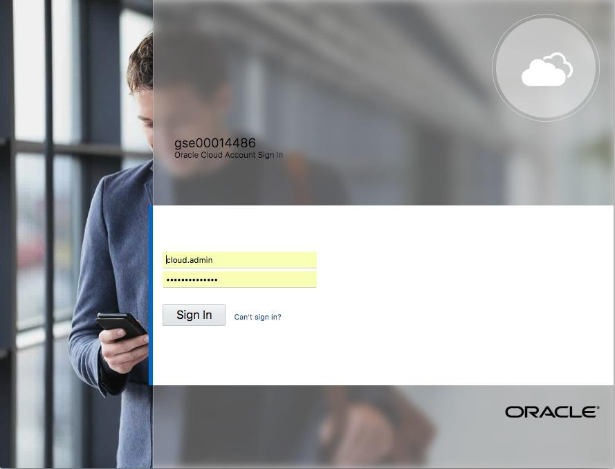

 Figure 1-1 

 * On the login page, enter your user name and password and click **Sign In**
 
 * You will be presented with a dashboard displaying the various cloud services available to this account.
 
 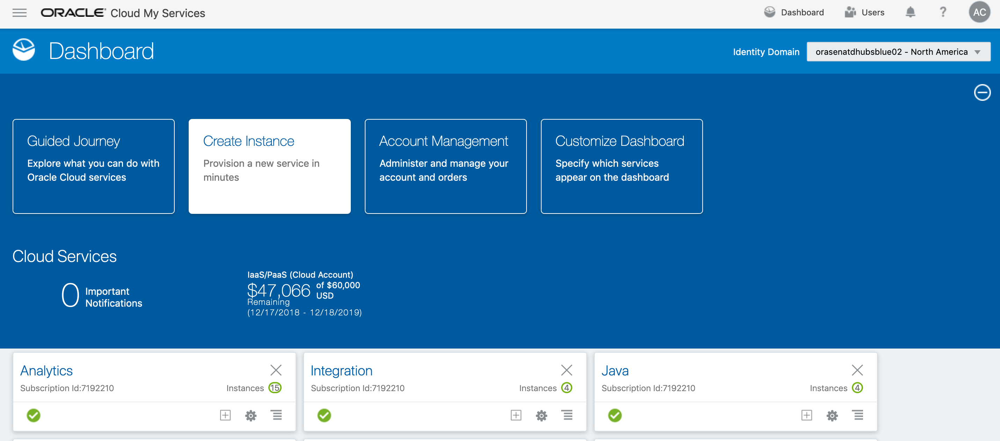
 
 Figure 1-2 

 
 * From the **Cloud My Services** dashboard, click on **Users** in the upper right-hand corner. Then click on **Identity Console** button located towards upper right-hand corner again.

 Figure 1-3 

 * If you have logged in using your administrator Account, the users are shown up in IDCS admin console. Other admin console sections are also available.
 
 
 
 Figure 1-4 

 
 * In the upper left-hand corner select the navigator menu or sometimes referred to as the "General Menu”. Select **Dashboard**. This will display the **Identity Cloud Service** dashboard.
 
 * Click on the navigator menu to hide it.

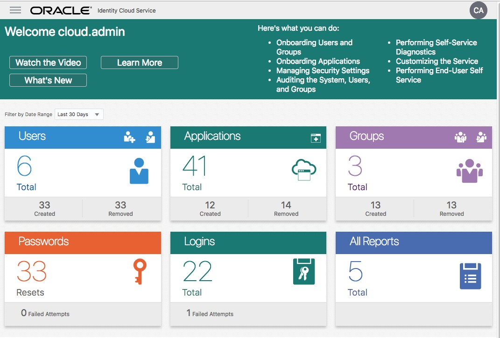

 Figure 1-5 

* To return to the Cloud Console, do the following:

  *  Select the **My Home** menu from the upper right corner of the
    screen.

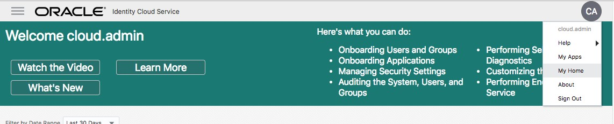

 Figure 1-6 

  *  Then select the Dashboard button at top right of screen. This will
    return you to the **Cloud My Services** dashboard. Or just use your
    bookmarked URL as suggested earlier.

 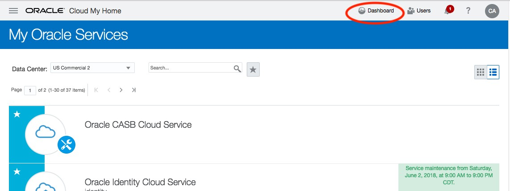
 
 Figure 1-7 

# IDCS Quick Tour

 Return to the IDCS dashboard and click on the navigator menu
 (hamburger menu).

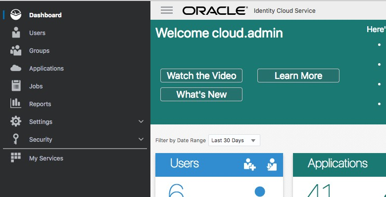

 Figure 1-8 

 You may navigate around IDCS from the dashboard screen items or through the menu on the left. Note the **My Services** link at the bottom of the menu list. This provides a shortcut to **Cloud My Services** dashboard.
 
 The IDCS documentation may be accessed through the **Learn More** button on the dashboard.
 
 Click on the following menus and just get familiar with the content:

  * Users

  * Groups

  * Settings

  * Security

 We’ll get into the details shortly, but this will give you a quick
 navigation overview of the menus and services available.

# Module 1:  User Management

 It is often a requirement for organizations to on-board an employee or contractor or some identity manually into a central identity systems like IDCS. In this use case, an IDCS user administrator will manually add a new user in IDCS service. Typically, this would occur through automated provisioning, bulk flat-file import or synchronization with your on- premises Active Directory.
 
 The IDCS features are built 100% using the IDCS REST API service. Therefore, any task we perform interactively in the web interface could also be performed via custom app, using these same REST API calls. It’s a clear advantage of Oracle’s API-first architecture with IDCS.
 
 IDCS supports user (also groups) on-boarding from on-premises **Active Directory**, using file upload, REST API, on-premises **Oracle Identity Management** solution, or manually from IDCS admin console. For the workshop we will be using file upload option and API calls user management.

### Create User in UI (Persona: Administrator)

*  Go to IDCS Admin console using your administrator account credentials. Select the **Users** menu on the left and click **+Add** or select the **Add a user** icon from the dashboard.

 Figure 1-9 

*  Fill in all required fields and click **Finish**. For this lab purposes, create a dummy account using your personal email address (e.g. *name@gmail.com*). We will use this account as part of our Single Sign-On module.

 
 
 Figure 1-10 

*  Verify user creation
    
      * Go to the **Users** tab in admin console. Verify that the new users are visible on the console.

 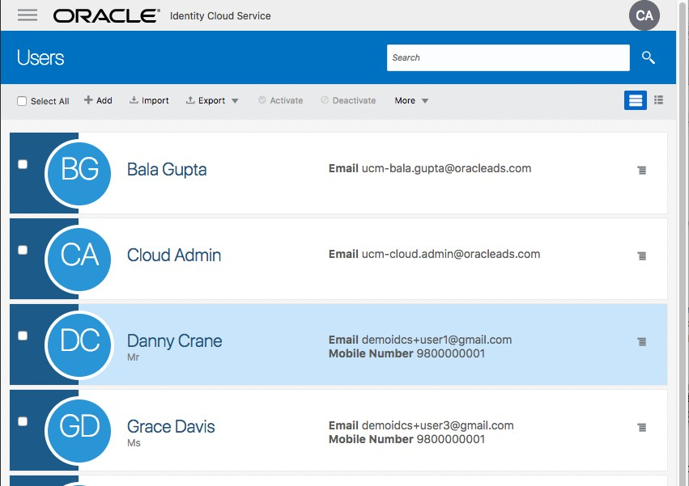
 
 Figure 1-11 

****

## API User Creation with REST API’s (Persona: Administrator) – OPTIONAL

The following exercise has been developed to showcase IDCS API capabilities.
This use case involves making API calls to IDCS using a REST client; in this case Postman. The Postman collection of relevant REST API calls is provided to each participant.

### Register a client POSTMAN application in IDCS

* If you don't have POSTMAN installed in your system, please visit [POSTMAN Website](https://www.getpostman.com/products) download and install it following the site instructions.

*  Navigate to your tenant https://**yourtenant**/ui/v1/adminconsole
 
 
 
 Figure 1-12 

*  Select the Applications tab from the IDCS dashboard presented after log in

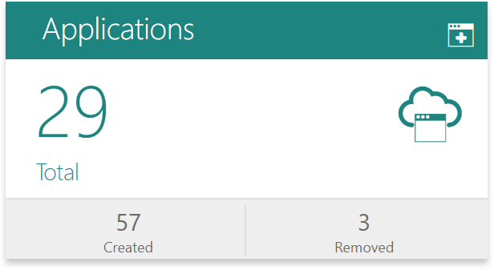

 Figure 1-13 

*  Click the **Add** button to create a new application for Postman use. In order for Postman to be able to call IDCS REST APIs, it first requires to have a **CLIENT_ID** and **CLIENT_SECRET** that authorize Postman to do so. This can be achieved by creating a Confidential Application type into IDCS with specific authorization grant types as you will see into the following steps.

 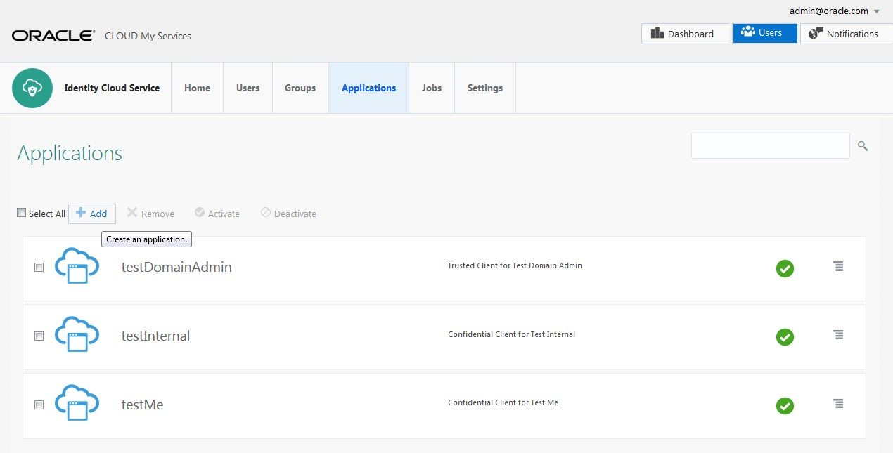
 
 Figure 1-14 

*  Select Confidential Application from the pop-up menu of application types:

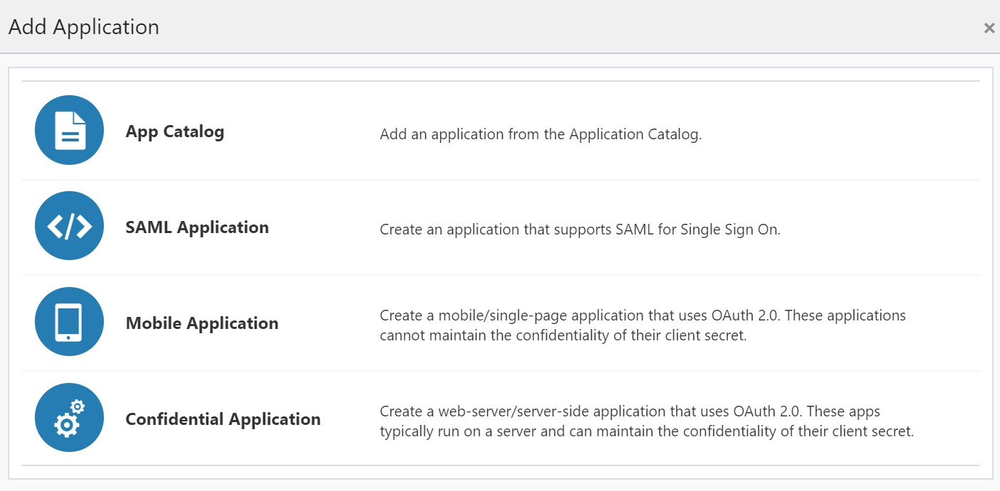

 Figure 1-15 

*  Set the **Name** to “Postman”. Then click **Next**

 
 
 Figure 1-16 

*  Click “**Configure this application as a client now**” in order toprovide the authorization grant types and the API role.

 Figure 1-17 

 Figure 1-18 

*  Select all the Allowed Grant Types checkboxes and set Redirect URL to [**https://localhost.**](https://localhost/) Go to “**Grant the client access to Identity Cloud Service Admin APIs**” section (bottom of the page) and add the following API role “**Identity Domain Administrator**”. This way you are basically granting access for this IDCS app to the full set of IDCS APIs.

*  Finally, click **Next**.

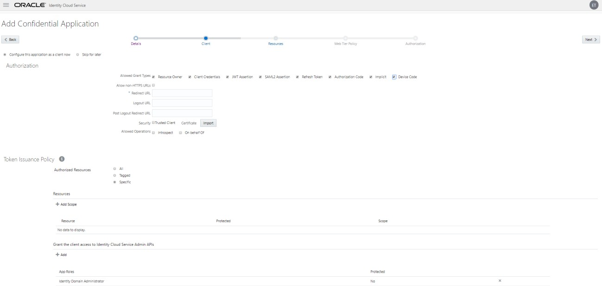

 Figure 1-19 

*  Make no changes in the next screens and click **Next**

 
 
 Figure 1-20 

* For finalizing the IDCS app that grants API roles to Postman via Auth2.0 standard click **Finish.**

 Figure 1-21 

* Once the application is created, note down the **Client ID** and the **Client Secret** then click **Close.** These will be used by Postman desktop application to call IDCS APIs using the Auth2.0 standard protocol.

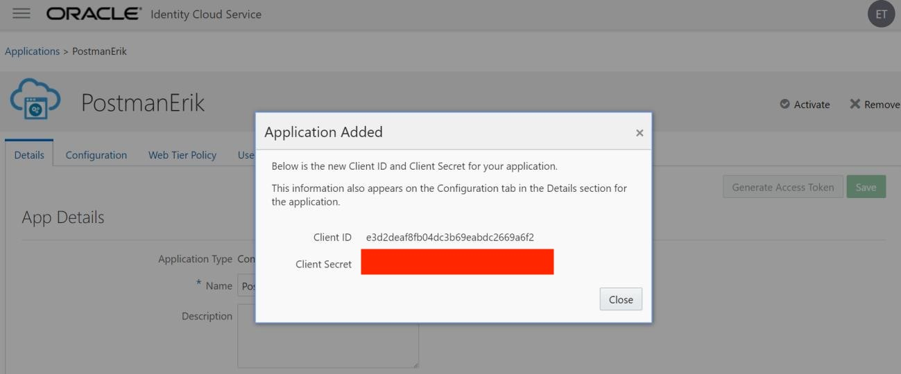

 Figure 1-22 

* Click the **Activate** button. Don’t forget to activate the application

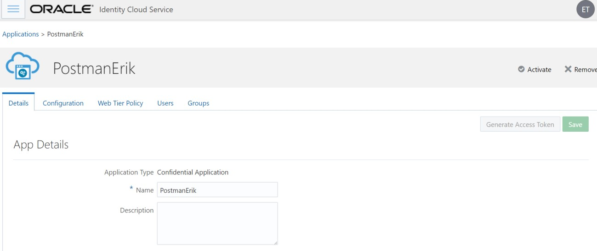

 Figure 1-23 

* Confirm the application activation

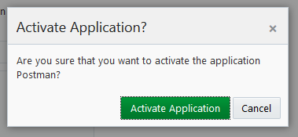

 Figure 1-24 

* The application is now active and ready to use.
 
 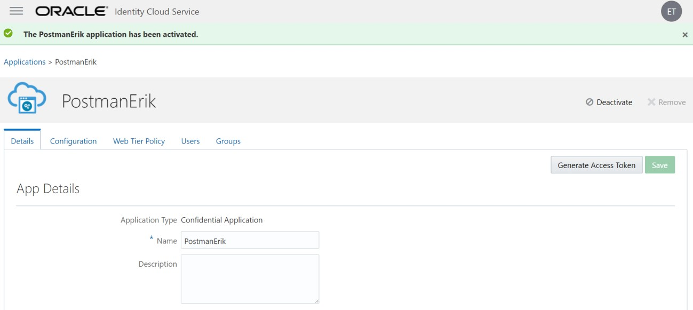
 
 Figure 1-25 

 
* Sign out from IDCS

###  Configure Postman
    
*  Open **Postman**. Ignore all startup messages if any.

 Figure 1-26 

*  First we need to import IDCS Postman environment variables, global variables and IDCS API collection. Click the Import button on the left upper corner:

 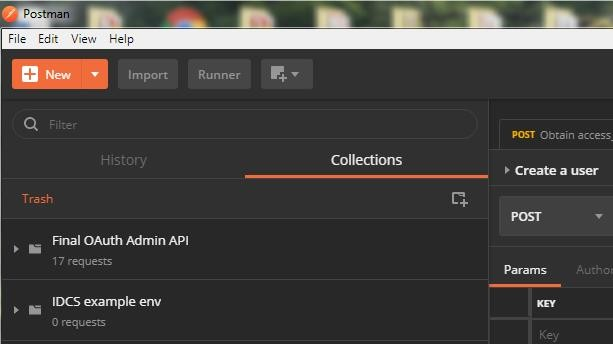
 
 Figure 1-27 

*  Select “**Import from Link**” and provide the following URL to import the environment variables:
   
    https://github.com/oracle/idm-samples/raw/master/idcs-rest-clients/example_environment.json

    * and then click **Import**

*  To import the Oracle Identity Cloud Service REST API Postman
    collection, on the Postman main page, click **Import**.

*  In the Import dialog box, select “**Import From Link**”, paste the
    following GitHub Postman collection URL into the box, and then click
    **Import**:

https://github.com/oracle/idm-samples/raw/master/idcs-rest-clients/REST_API_for_Oracle_Identity_Cloud_Service.postman_collection.json

 
 
 
 Figure 1-28 

*  To import the global variables file, click **Import**.

*  In the Import dialog box, select **“Import From Link”,** paste the following GitHub Postman Globals URL into the box, and then click **Import**:

 https://github.com/oracle/idm-samples/raw/master/idcs-rest-clients/oracle_identity_cloud_service_postman_globals.json

*  Click on the **Settings** button (cogwheel icon) to **Manage Environments**

 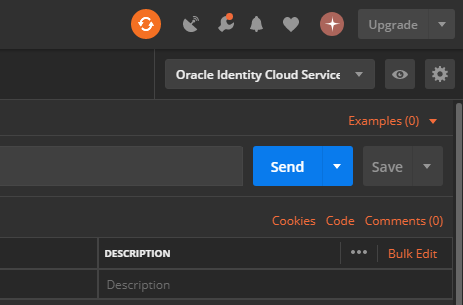
 
 Figure 1-29 

*  Click on the newly created environment which will be like “Oracle Identity Cloud Service Example Environment with Variables” and it will probably be the only one available in your cases.

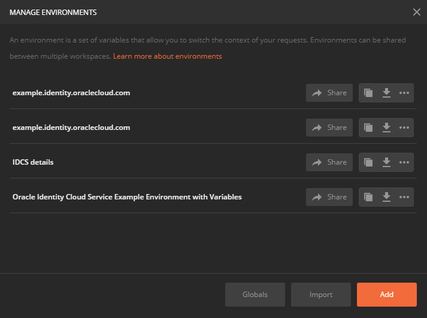

 Figure 1-30 

* Set the following parameters current values in order to be able to obtain an IDCS access token and click **Update**:

 HOST: https://**your IDCS tenant** 

 Ex: https://idcs-8ba16123120745658135edd99d8a5c78.identity.oraclecloud.com 

 CLIENT_ID: **the Postman IDCS Client application CLIENT_ID** 

 CLIENT_SECRET: **the Postman IDCS Client application CLIENT_SECRET** 

 USER_LOGIN: **Your Oracle Cloud User Id**

 USER_PW: **Your Oracle Cloud Password**

 Figure 1-31 

* Click the **Environment** drop-down list, and then select the updated environment from the list.

 
 
 Figure 1-32 

*  Request an Access Token
    
    * On the **Collections** tab, expand **OAuth**, and then **Tokens**.
    
    * Select **Obtain access_token (client credentials),** and then click **Send**. The access token is returned in the response from Oracle Identity Cloud Service.
    
    * Highlight the access token content between the quotation marks, and then **right-click**. In the shortcut menu, select **Set: Oracle Identity Cloud Service Example Environment with Variables**.

    * In the secondary menu, select **access_token**. The highlighted content is assigned as the access token value.

 
 
 Figure 1-33 

*  Create an IDCS User via API
    
    * On the **Collections** tab, expand **Users**, and then
        **Create**.
    
    * Select **Create a user**. The request information appears with some default values as can be seen into below print screen. You can either change them as per your preference or you can simply use the default filled values.
    
    * Click **Body**, and then click **Send**.

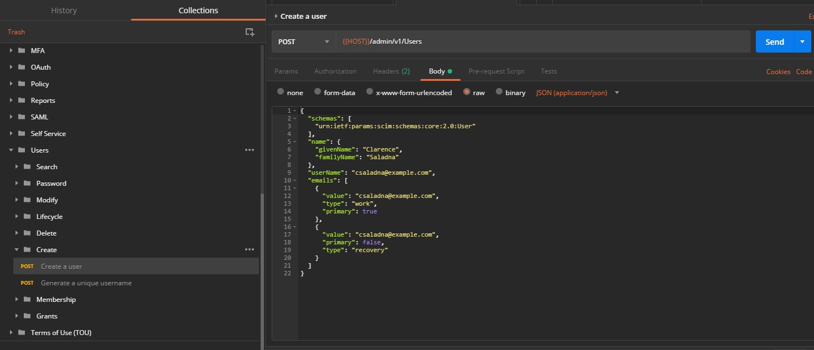

* In the response, confirm that the status **201 Created** appears and that the response body displays details about the user that was successfully created in Oracle Identity Cloud Service.

* While in the IDCS UI you can see the user as being created.

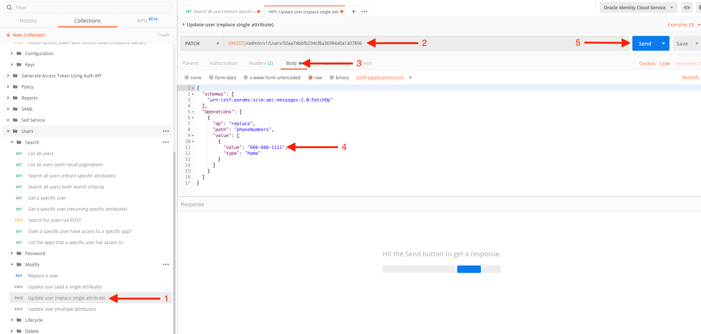

 You can also **modify** and **delete** users and a lot more via REST API. For more information, please check the documentation below.

# Module 2:  Configure SSO and Provisioning for Salesforce

 Oracle Identity Cloud Service (IDCS) provides integration with any service that can be integrated via **SAML** (Security Access Markup Language) protocol. Administrations will be able to manage users into various applications via single control panel and end users will be able get to applications via single click.
 
 IDCS provides support for standard SAML 2.0 Browser POST Login & Logout Profiles.
 
 Please note, that though IDCS supports SAML and OpenID Connect/OAuth, there are many times when a non-SAML enabled system requires SSO. IDCS App Gate provides support for non-SAML systems that use header-based, cookie-based or form-fill SSO. App Gate is an Nginx-based, software appliance deployed in a proxy configuration that can be deployed on AWS, OCI, OCI-C or on-premises in VMWare or Oracle Virtualbox. It is delivered via Identity Cloud Service and available for IDCS Standard customers.
 
 This lab is intended to demonstrate federated Single Sign-on (SSO) with a 3rd party SaaS application. The purpose is to illustrate the business value of having IDCS as a central Identity Provider for your growing portfolio of Oracle and non-Oracle.
 
 In this hands-on exercise, we will setup integration with **Salesforce** using SAML. IDCS will act as **IdP** (Identity Provider) and Salesforce org as **SP** (Service Provider also known as a Relying Party)

### Enable SSO on SalesForce

* Download IDCS Metadata to a local XML file. Metadata is available from the following location - https://**yourtenant**/fed/v1/metadata. Depending on the browser you are using,the simplest way of doing this is to right click anywhere on the page and chose “Save as” option provide a name and save it as XML file. Try not to use the copy / paste option as the xml file may be altered.

 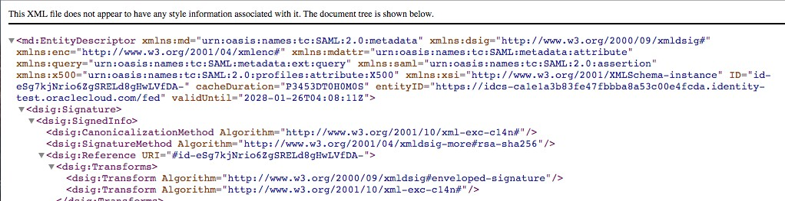
 
 Figure 2-1 

*  Use your Salesforce developer account created on Lab 1 Oracle CASB Cloud Service
    [https://developer.salesforce.com/](https://developer.salesforce.com/)

 
 
 
 Figure 2-2 

 
 * Log into Salesforce. *Note: you may have to select “Switch to Salesforce Classic”.*

* Access Salesforce application using the URL provided after registration, click on the profile menu as per below print screen and select the option: **“Switch to Salesforce Classic”**.

 Figure 2-3 

*  Go to **Setup** into the upper tab menu, near the profile.

*  Register a custom Domain. Go to **Domain Management**, **My Domain** and register a domain of your choosing. This is to have a custom application URL dedicate for our use case.

 
 
 
 Figure 2-4 

*  Check your email for the domain login and login.

*  Bring up the **setup** page.

 Figure 2-5 

*  From side menu bar, go to **Security Controls**, **Single Sign-On Settings**

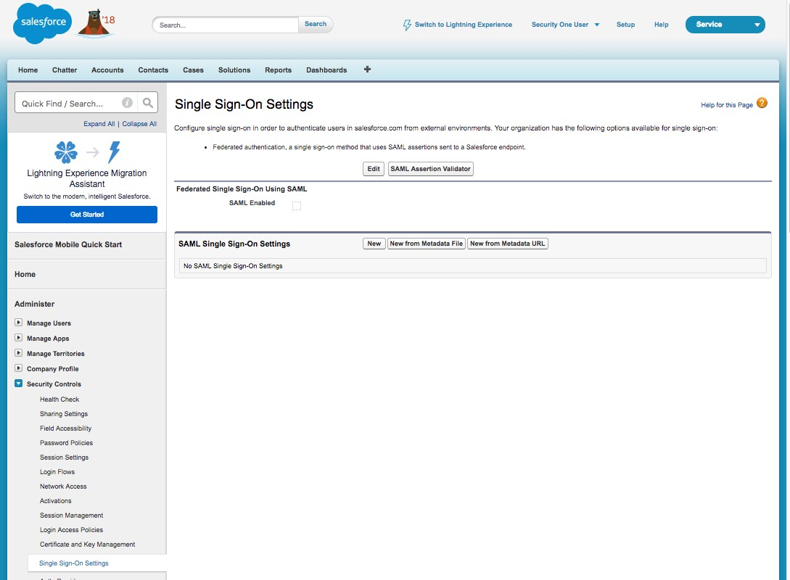

 Figure 2-6 

*  Click on **Edit** and enable **Federated Single Sign-On Using SAML** option.

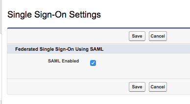

 Figure 2-7 

* Click on **New from Metadata File** button to import IDCS metadata. Select the downloaded metadata file using **Choose File** button. Click on **Create**.

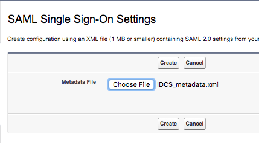

 Figure 2-8 

* Keep all the default information and click on **Save**

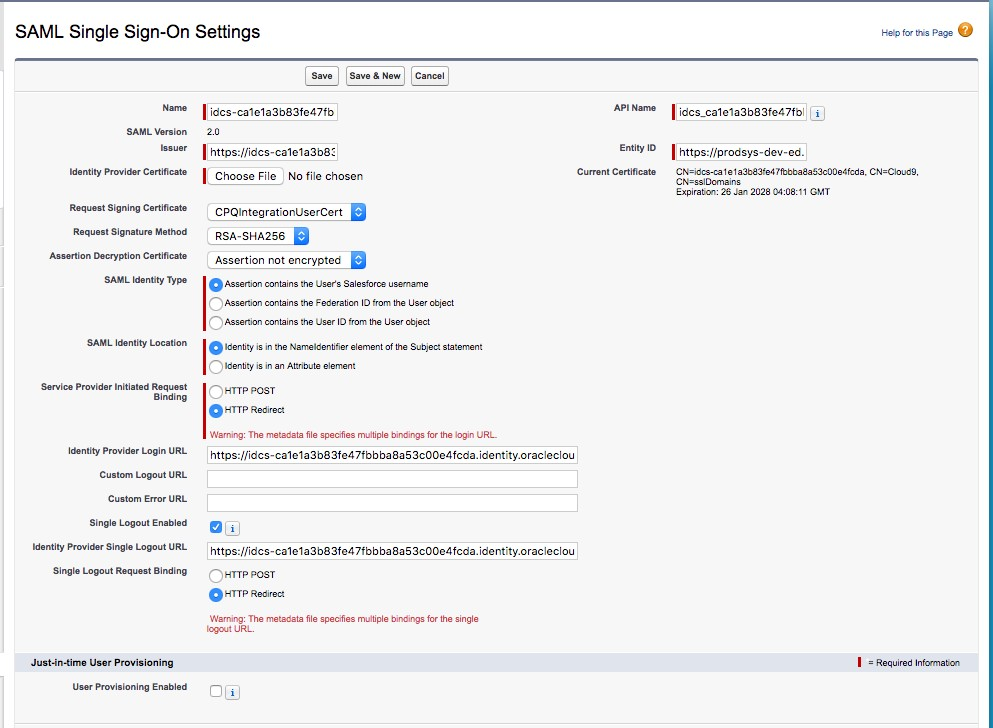

 Figure 2-9 

* Below are the details for this example. Note, your URLs and domain information will be different.

 Figure 2-10 

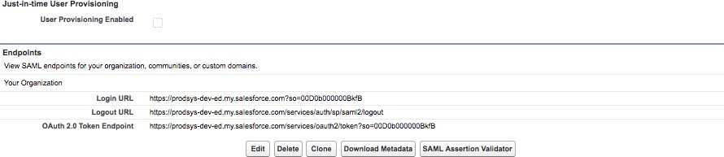

 Figure 2-11 

* Make note the following:

  * Organization ID value

  * Org Domain Name value.

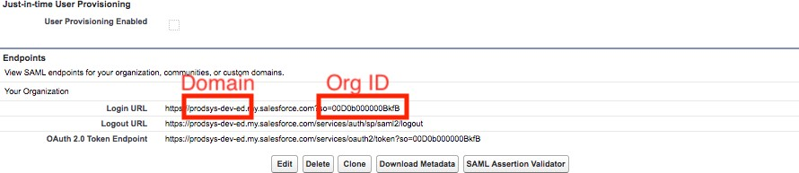

 Figure 2-12 

Now that the Salesforce configurations are done, we need to configure IDCS to be aware of the Salesforce application.

* Go to IDCS admin console, navigation menu, **Applications**

 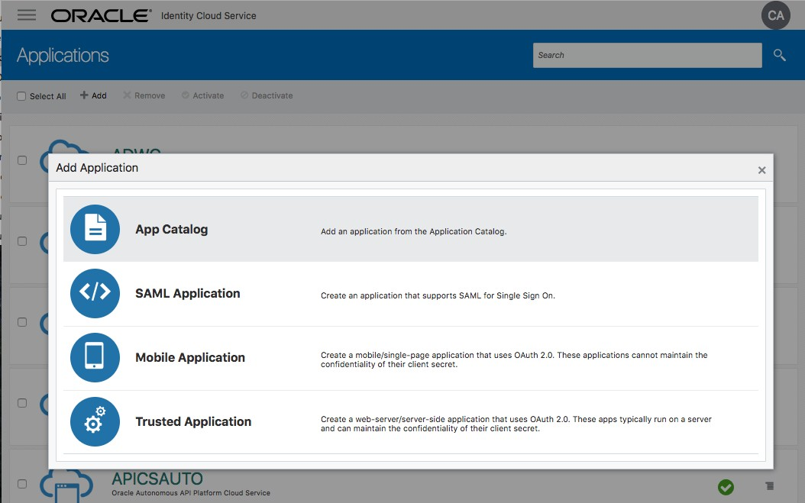
 
 Figure 2-13 

* Click on **Add** button and select **App Catalog** and search for Salesforce. Click on **Add.**

 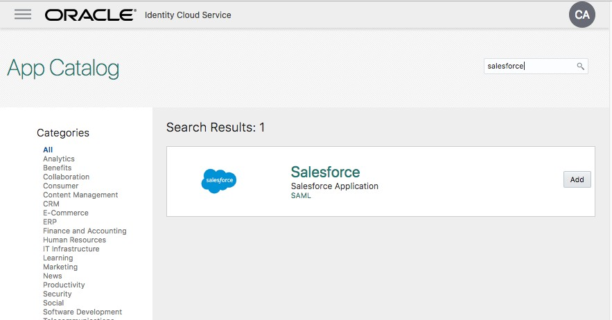
 
 Figure 2-14 

* On the first page of configuration screen provide the **Organization**

 **ID** and **Domain Name** values that you made note of from within Salesforce.

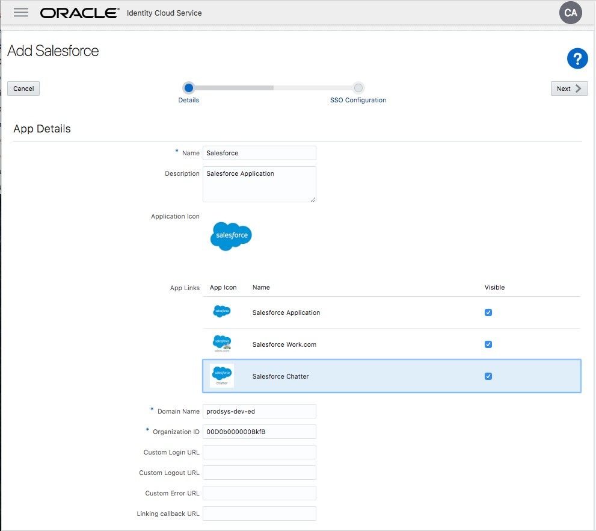

 Figure 2-15 

* Click on **Next** to move to the SSO configuration

 
 
 Figure 2-16 

* Click on **Finish** button

* **Activate** the application

 
 
 Figure 2-17 

### Assign Apps to Group (Persona: Administrator)

In IDCS you have the option to assign access to users directly, by direct assignment to a specific application, or indirectly using dedicated groups. For the purpose of the use case we’ll be using groups to provide users access to Salesforce application.

*  Go to IDCS admin console, **Groups** menu

*  Add a group labeled **Employee**. Check the box **User can request access**.

 
 
 Figure 2-18 

*  Click on **Finish**

*  Go to the **Access** tab. Click on **Assign**.

*  Select **Salesforce** and click on **OK**.

 Figure 2-19 

Moving back to Salesforce in order to create a corresponding account for one that we have into IDCS.

*  **Login** into **Salesforce** as an administrator.

*  Go to **Setup**.

*  On the left panel, click on **Manage Users**, then on **Users** and then on **New User**.

*  Create a user as shown below. Be sure to use the email address as the login and use one that matches the account created in IDCS in Module 1. In this case, We’ve used *oracleuser3003@gmail.com*

*  Set the **User License** to **Salesforce Platform**.

 Figure 2-20 

Now that the account is available in Salesforce and IDCS has the authenticated account you are ready to test.

### Request Group Access (Persona: End User)

Remember that we have created the **Employee** group into IDCS which is having access to Salesforce application but there is no user assigned yet to it. Since we chose the option
 
**“User can request access”** at the creation of the group, now we should be able to request access to it and implicitly to the alesforce application.

*  Close your browser to clear the cache and then login into IDCS https://**Your IDCSInstance**.identity.oraclecloud.com/ui/v1/myconsole.

*  From **My Apps** page, click on **+ Add** access request button.

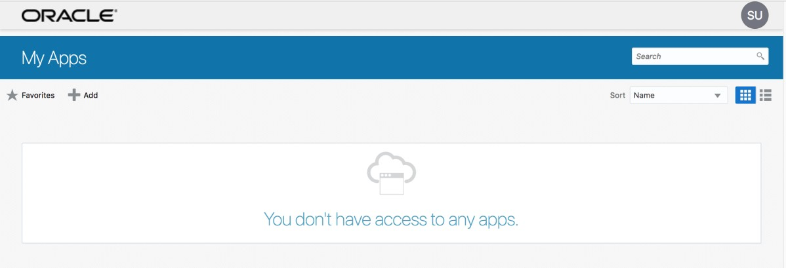

 Figure 2-21 

*  From the **Groups** tab, select **Employee** group and select the **+** sign.

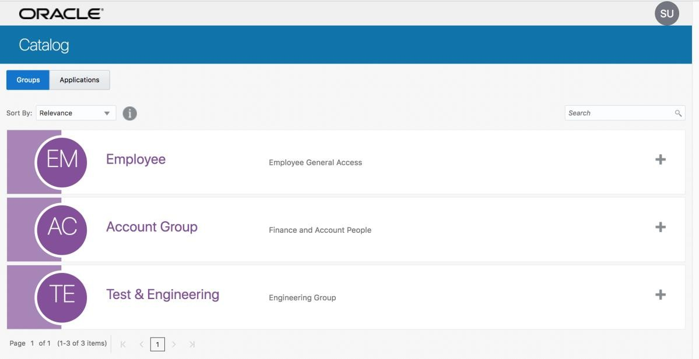

 Figure 2-22 

*  Click on + sign to request access to the group. Provide justification on the resulting popup page. Click on **OK**. This is an auto approved request and access should be granted immediately without the need of and administrator intervention.

 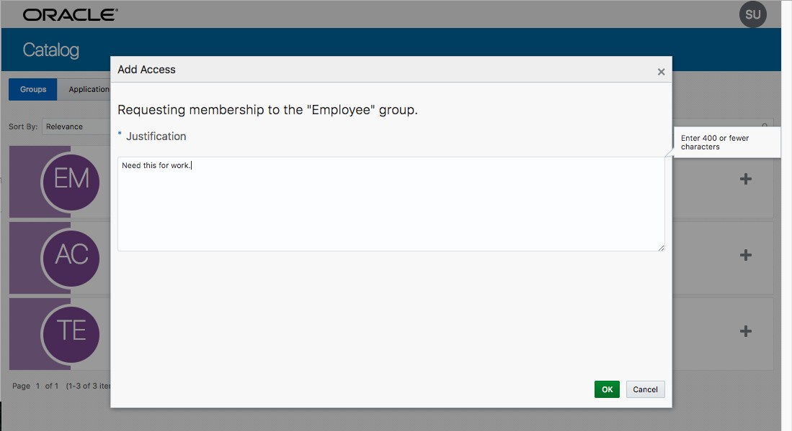
 
 Figure 2-23 

*  Go to **My Profile** section from menu located top-right

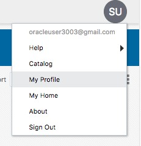

 Figure 2-24 

*  Ensure that **Employee** group is visible under **My Access** sub-tab

 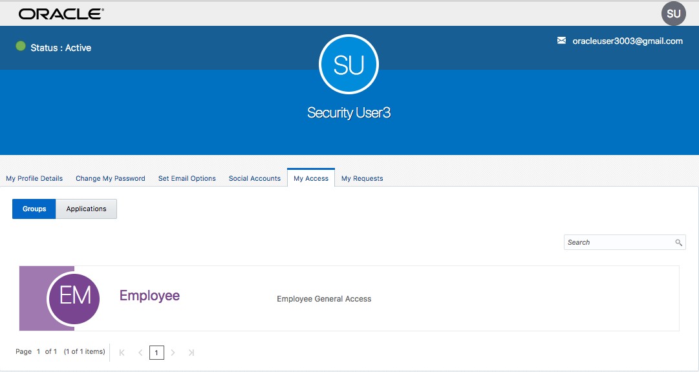
 
 Figure 2-25 

*  Ensure that Salesforce applications are visible now on the **MyApps** page

 Figure 2-26 

### Verify SSO Configuration (Persona: End User)

*  Click on the **Salesforce Chatter** app from **My Apps** page

*  Ensure that user is automatically logged into Salesforce Chatter (**SSO**)

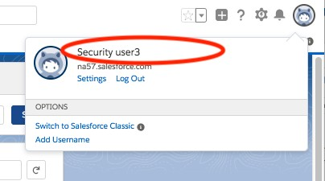

 Figure 2-27 

You should now see the same user profile information, that you started within IDCS, within Salesforce without having had to log into Salesforce.

## Configuring Privisioning and Synchronization – OPTIONAL

The following exercise has been developed to showcase the extend of IDCS Single Sign-On capabilities by integrating the provisioning and synchronization services with third-party apps.

### Configure Provisioning and Synchronization (Persona: Administrator) - OPTIONAL

*  Obtaining Host Name, Organization ID, and Domain Name from Salesforce

A host name, organization ID, and a domain name are required before you can configure the Salesforce app in Oracle Identity Cloud Service. You obtain these values from Salesforce.

*  Login to [Developer Salesforce](https://developer.salesforce.com). In the left navigation menu of the home page, search and click Single Sign-On Settings. The Single Sign-On Settings page appears.

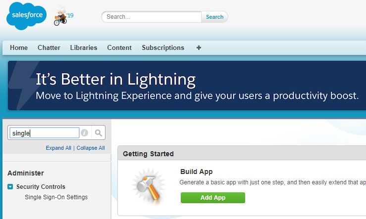

 Figure 2-28 

*  Under the SAML Single Sign-On Settings section, **click** the name that you provided for your identity provider in the **Single Sign-On Settings page**. The SAML Single Sign-On Settings page appears.

*  Make note of the host name from the value given in the **Entity ID** 

* Field: https://Host_Name

*  Under the Endpoints section, make note of the domain name and the organization ID from the **Salesforce Login URL**: https://**Domain_Name**.my.salesforce.com?so=**Organization_ID**
The domain name appears at the beginning and the organization ID appears at the end of the URL.

 Figure 2-29 

*  Obtaining the Consumer Key and Consumer Secret from Salesforce

**Consumer key** and **consumer secret** values are required before you enable provisioning for the Salesforce app. You obtain these values from Salesforce.

* Switch to **Lightning Experience** in Salesforce, click the **cogwheel** on the top right corner of the page and select **Setup**.

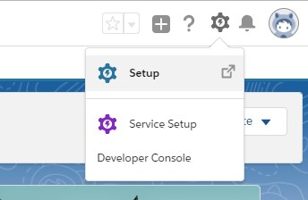

 Figure 2-30 

*  In the left navigation menu of the home page, search and click **AppManager**. The Lightning Experience App Manager page appears.

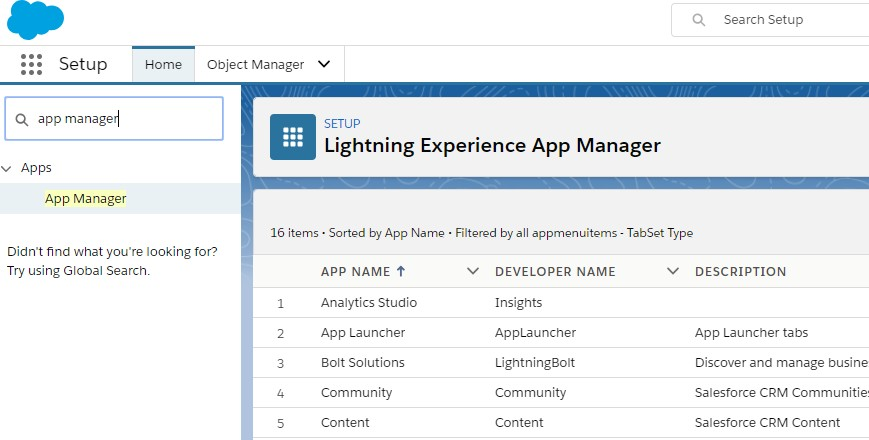

 Figure 2-31 

*  In the right corner of the page, click **New Connected App**. The New Connected App page appears.

 Figure 2-32 

*  Under the Basic Information section, enter the Connected App Name of the app that you want to connect.

*  Enter the **Contact Email** of the administrator.

* Under the API(Enable OAuth Settings) section, select the **Enable OAuth Settings** Check box.

* Enter any public domain URL that receives the access token from the authorization server in the **Callback URL** field. For example, https://login.salesforce.com

* In the Selected OAuth Scopes field, select Full access(full) under the **Available OAuth** Scopes list, and then click Add to give full access to modify the OAuth.

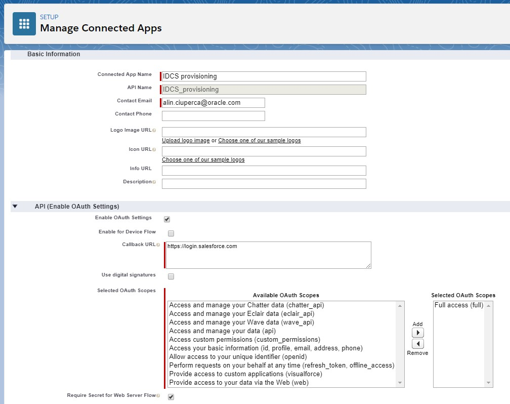

 Figure 2-33 

* Scroll down and click **Save**.

* Wait for 2-10 minutes for the changes to take effect on the server before using the connected app, and then click **Continue**. The newly created app page appears.

* Under the API (Enable OAuth Settings) section, click “**Click to reveal**” next to the **Consumer Secret** field.

 Figure 2-34 

* Make note of the **Consumer Key** and **Consumer Secret** values.

### Deriving the Administrator Password from Salesforce

 A security token must be appended to the administrator password before you enable provisioning and synchronization for Salesforce app. You obtain the token value from Salesforce.
 
 The final value will look like this:
 
 `yourSalesforceAdminPassword + securityToken`
 (ex: LKdMzECdjFKYSj028WJhU1GG)

* In the upper-right corner of the **Salesforce** home page, click the user icon, and then click Settings from the drop-down list.

 Figure 2-35 

* In the left navigation menu, search and click **Reset My Security Token.**

 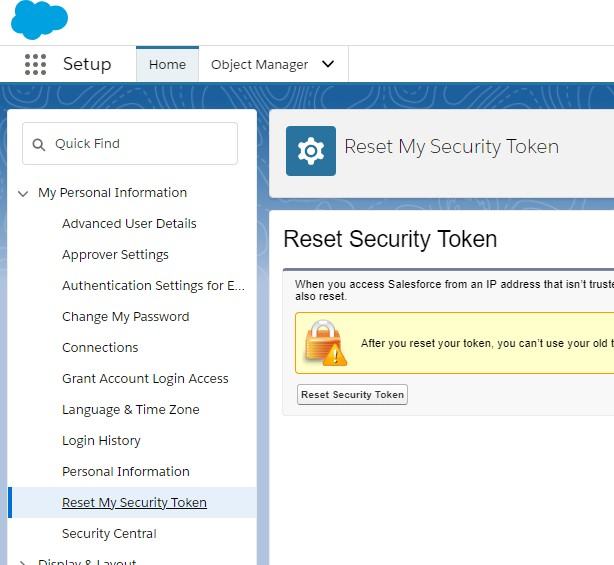
 
 Figure 2-36 

* On the Reset My Security Token page, click **Reset My Security Token**. A security token is sent to the email address of the administrator.

* Make note of the security token, and append the security token to the administrator password.

 `yourSalesforceAdminPassword + securityToken`
 (ex:LKdMzECdjFKYSj028WJhU1GG) 
 NOTE: the + must not be included

###  Enabling Provisioning and Synchronization for Salesforce - OPTIONAL

 Provisioning will provide you with the following available operations:
 
 **Create Account**: Automatically creates a Salesforce account when
 Salesforce access is granted to the corresponding user in Oracle
 Identity Cloud Service.
 
 **De-activate Account**: Automatically deactivates or activates a
 Salesforce account when the Salesforce access is deactivated or
 activated for the corresponding user in Oracle Identity Cloud Service.
 
 **Delete Account:** Automatically removes an account from Salesforce
 when Salesforce access is revoked from the corresponding user in
 Oracle Identity Cloud Service.
 
 Beside this you have the ability to map attributes between the user
 account fields defined in Salesforce and the corresponding fields
 defined in Oracle Identity Cloud Service.

* Go to IDCS admin console

* Select the Salesforce applications that you have created previously

* On the Provisioning page, select **Enable Provisioning**.

* A window will pop up. Click “**Grant Consent**”

* Fill in the **Host Name (e.g. acasas-dev-ed.my.salesforce.com), Administrator Username**, **Administrator Password**, **Client ID** and **Client Secret** that you derived in the previous steps from Salesforce

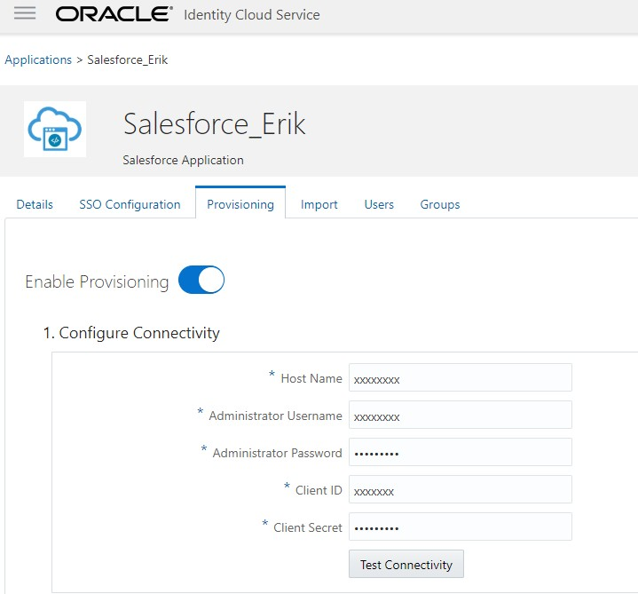

 Figure 2-37 

* Click **Test Connectivity** to verify the connection with Salesforce. Oracle Identity Cloud Service displays a confirmation message.

* Scroll down on the Provisioning page, select **Enable Synchronization**.

 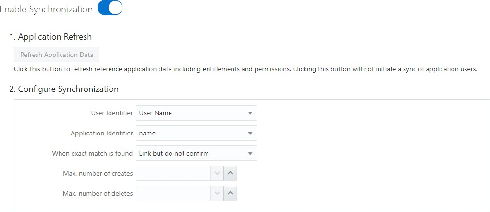
 
 Figure 2-38 

 
 This option will synchronize the existing account details from
 Salesforce and link them to the corresponding Oracle Identity Cloud
 Service users.

###  Testing Synchronization in IDCS - OPTIONAL

*  On the applications page, select **Import**.

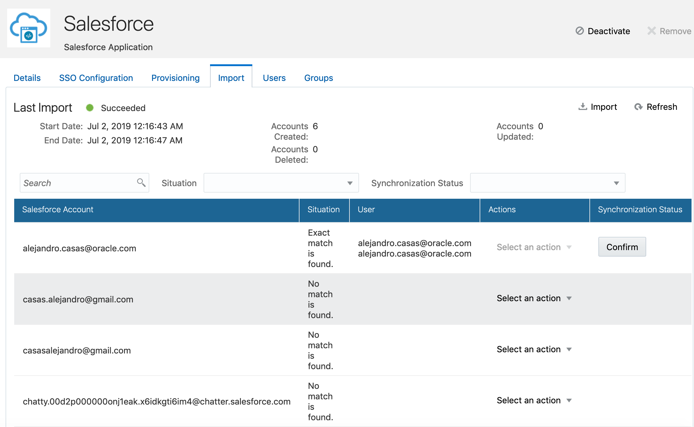

 Figure 2-39 

*  Click on **Import** and wait for a moment

*  Click **Refresh**

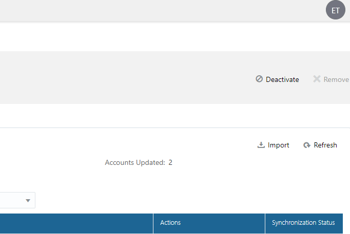

 Figure 2-40 

*  The imported users that were imported from IDCS will be displayed.

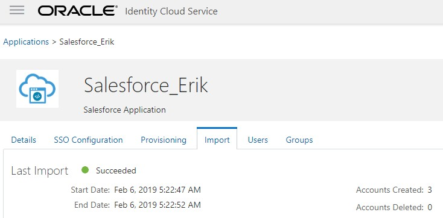

 Figure 2-41 

****
**You have successfully connected and provision IDs on third-party app and enable Single Sign-On to easily login to other vendor services.**

***END OF LAB***

[Back to Top](#table-of-contents)   