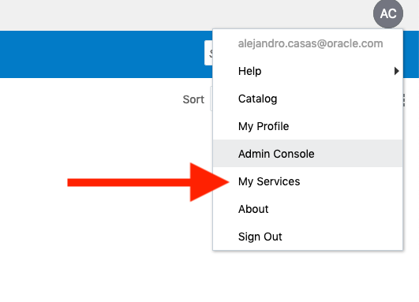
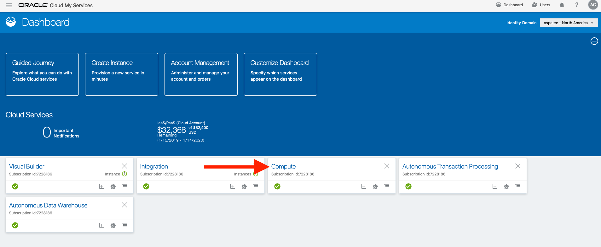
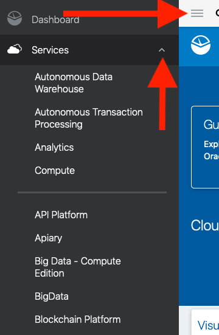
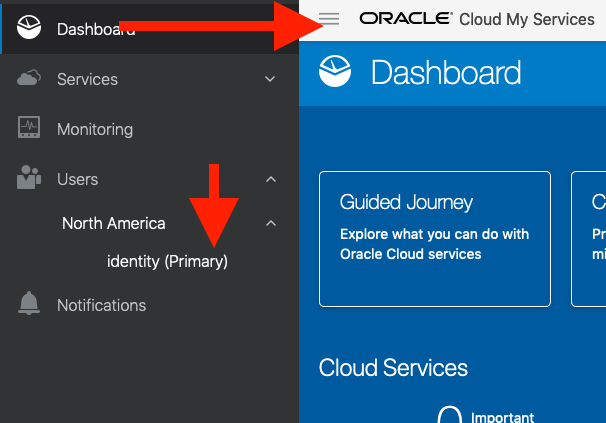
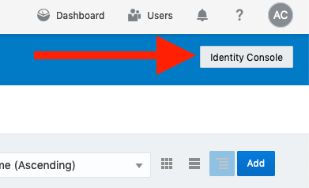
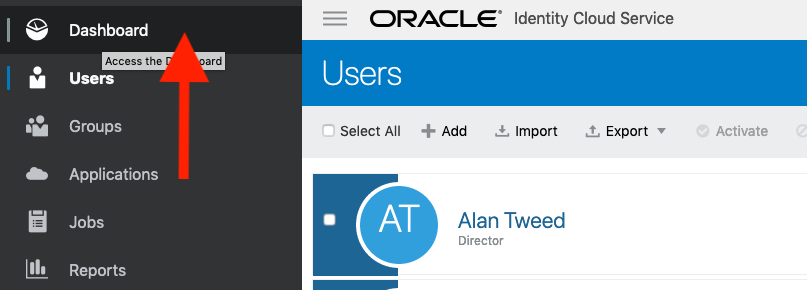

# Security Hands-On Labs

## Hands-On Labs

We recommend you to read the following guide before begin with the labs activities. There are some pre-requisites that you must satisfy in order to proceed with the workshop.
Please read them very carefuly in order to avoid issues during the labs session.

****

## Lab Guide Overview

Here is a brief overview of what you can expect to accomplish in these lab exercises.  The purpose of the labs is to familiarize yourself with the features and functionality of Oracle CASB Cloud Service, Oracle Identity Cloud Service and Oracle Management Cloud.
To optimize your experience there are some general guidelines that will help you get the most from these lab exercises.

- Read through an entire section before executing any of its steps.  Merely following the screen shots or script files without understanding the flow will diminish your learning experience, so think about what you are doing and why.  If you aren’t sure, ask questions.

- Ask before you do.  If you have any questions, please ask the instructor before you march down a path that may lead to unsatisfactory results.

- Follow the steps as shown in this guide.  Do not freestyle during the labs. This is a live environment.  If you want to do something that is not in the labs, ask the lab instructor first.  Do not create, delete, or alter any database objects without asking first.  

- There is no prize for finishing first and there is no penalty for finishing last. The goal is to gain a firm understanding of Oracle Application Integration.  

- Ask questions freely.  The only dumb questions are those that are not asked.  

- Help your fellow students.

## Labs

The way we do business has evolved by revamping the digital strategy, models, operations, products and marketing approach, fundamentally changing how enterprises operate and deliver value to customers.

New business models help customers to growth and increase their revenue. However, digital transformation introduces new security threats and risks that companies are not used to deal with.  

As many companies, Mama Maggy's IT security and management teams are unable to keep pace with emerging, rapidly-changing hybrid cloud environments.  They face a dramatic increase in risk from security threats and unplanned outages, as well as innovation bottlenecks that slow time-to-market.

Their current security and management process rely on manual tasks, is completely ineffective and cause resources' overhead.

These are some of the concerns that the CISO and security team members have shared with us

- New employee on-boarding process take too much time.
- Security Operation Center analysts are overwhelmed because of the amount of alerts and manual tasks required to investigate an event.
- CISO compliants about the lack of visibility into cloud and on-prem infrastructure, inability to respond to governance requirements in a timely manner, and slow detection and response to threats.
- Security managers must deal with an increasing number of events and capacity to respond to threats that might lead to data breach or expose company assets, and the time wasted on investigations and researches with dead end because of the lack of automated tools and a lack of talent and resources.

### Pre-requisites

Before you start the labs you should have:
- Your Oracle Cloud Account Sign In credentials (user name and password).
- Cloud access to an instance of Oracle CASB Cloud Service.
- Access to Oracle Identity Cloud Service console. This service is provisioned alongside your Oracle Cloud Account.
- Access to a compute instance and a compartment.
- Privileges to create dummy accounts on the OCI tenant and IDCS.
- Disable password vaults solutions installed in your laptop, such as OnePassword, LastPass or Dashlane.

### Preparing your environment

You have some setup work to perform first before you start the two hands-on labs in this course.  By performing the following steps, you will complete all the setup work upfront so you won’t be bothered with it during the labs.  NOTE: These steps assume that you have already satisfied all the prerequisites enumerated in the Prerequisites section above.  If you have, continue below:

1.	Close your VPN connection if it is active.
2.	Create an **Security** folder (directory) on your computer’s file system.  This is where you will store various artifacts during the labs.
3.	Open Notepad (Windows PC) or TextEdit (Mac) on your computer and create a new file called *MyLabNotes*.  Save it into your **Security** folder.  Keep the file open as an area where you can conveniently store items that are important to remember and access.
4.	Start your Chrome browser.  Again, other browsers may work just fine, but the lab was tested using Chrome.
5. Clear browser data

**On a Windows PC:**
- Click the Customize and control Google Chrome icon (three vertical dots) in the upper-right corner of the window to display a menu.
- Select the More tools option from the menu.
- Select the Clear browsing data option from the submenu.
- Time range: All time
- Browsing history: checked
- Cookies and other site data: checked
- Cached images and files: checked 
- Click the Clear data button

**On a Mac:**
- Select the Chrome option from the menu bar to display a menu.
- Select the Clear Browsing Data option
- Time range: All time
- Browsing history: checked
- Cookies and other site data: checked
- Cached images and files: checked 
- Click the Clear data button

6. Access your cloud console dashboard to see if you have access to your compute instance:

Depending on your configuration, your welcome screen might be your *MyApps* dashboard, or the services console.
To access your services console, click on your profile on the top-right icon and select **My Services**

Figure 1-1

Once into the service dashboard, you should be able to see your **Compute** service.

Figure 1-2

7. Access your cloud console dashboard to see if you have access to Oracle CASB Cloud Service:

Once in the service dashboard, you can access Oracle CASB Cloud Service by clicking on the **General Menu** locate at the top-left of your screen, **Services** , and select **Oracle CASB Cloud Service**

Figure 1-3

8. Access your cloud console dashboard to see if you have access to Oracle Identity Cloud Service:

To access Oracle Identity Cloud Service you must click on the **General Menu** locate at the top-left of your screen, **Users**, your region, and select **Identity(Primary)**

Figure 1-4

Once in the main screen, click on the **Identity Console** option locate at the top right of your screen, under your profile.

Figure 1-5

Click on the **General Menu** locate at the top-left of your screen and then click on **Dashboard**

Figure 1-6

You have access to main Oracle Identity Cloud Service dashboard. You can bookmark this URL to access the console.

****

Now that you have completed this guide, you can proceed with the workshop.

- [Lab 1: Oracle Identity Cloud Service](LAB1_IDCS.md)
- [Lab 2: Oracle CASB Cloud Service](LAB2_CASB.md)

[Back to the top](#Security-Hands-On-Labs)

***** 
