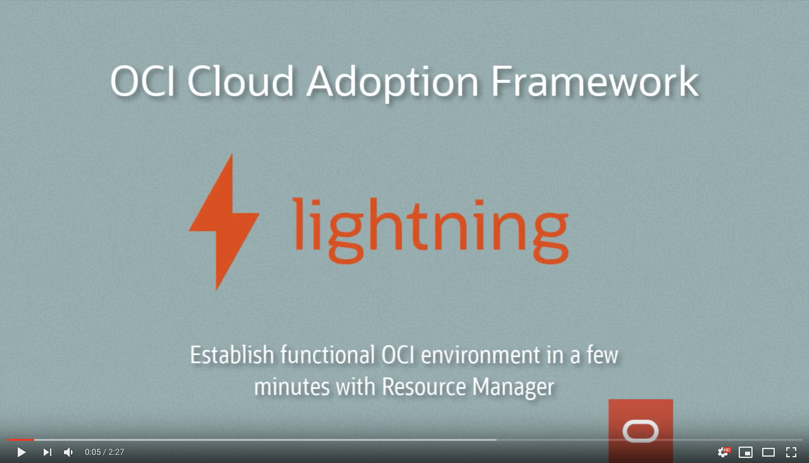

# Lightning Cloud Adoption Framework

|  | |
| ------------- | ------------- |
|  | The lightning CAF utilizes Terraform 0.12 and Resource Manager to launch functional always-free or enterprise infrastructure in a few minutes.    |
| 


[Download **Always Free Tier** Resource Manager Stack zip file](../solutions-library/lightning/resource-manager-stacks/lightning-free-tier-1.0.2.zip)

[Download **Enterprise Tier** Resource Manager Stack zip file](../solutions-library/lightning/resource-manager-stacks/lightning-enterprise-tier-1.0.2.zip)


This simple framework leverages best practices used with
ISV organizations around the world adopting OCI. This project is open source and maintained by Oracle Corp. 

In the span of a few minutes, the stacks provide vast majority components required to build and operate your software. Use as little or as much as you find useful to shorten your time to market; we welcome the collaboration.

**lightning** utilizes Terraform 0.12 and Resource Manager contained in the ```resource-manager-stacks``` directory. 

- **Want to spin up a compartment, user, group, policy, VCN, subnet, compute instance, and ATP database in *always free* in 3 minutes?** Upload ```lightning-free-tier-1.0.2.zip``` to Resource Manager.

- **Already have a paid or trial tenancy and want to spin up a functional *Enterprise* landing zone in 10 minutes?** Upload ```lightning-enterprise-tier-1.0.2.zip``` to Resource Manager.

## Dependencies

- OCI Tenancy (free or paid)

## Getting Started 

1. Download the Resource Manager *.zip file for your use case

2. Login to the OCI Console 

3. Navigate to Resource Manager and click the Create Stack button 

4. Drag the downloaded *.zip file from the resource-manager-stacks directory to Resource Manager 

5. Click the Next button twice, then the Create button

6. Click Terraform Actions/Apply

Watch the 2 minute video below to watch the framework build out the free tier, _**Enterprise tier works exactly the same way**_ in a paid tenancy. In 5 Clicks you have an operational enviornment. Simple modifications of the *.tfvars files allow you to adapt the examples to your needs.

[](https://www.youtube.com/watch?v=T6iDGTWzEWk)


### Crawl

The crawl is just getting the basics set up in OCI. How do I establish the basic building blocks needed for my journey?

- IAM (Identity Access Management) including groups, policies, and compartments
- Tagging examples to help with Governance
- Network resources like VCN (Virtual Cloud Network), Private and Public Subnets, NSG (Network Security Groups), and Security Lists
- Compute resources like Linux and Windows instances with block volume attachments
- DBaaS and Autonomous

### Walk

When you're looking to walk, the way you want to think about it is: In the crawl stage, you've established the foundations in the environment, now you're ready to start introducing components and concepts to take advantage of scale.

- DNS examples
- Load Balancers
- Instance Principals (DevOps)
- Shared storage FSS (File Storage Service *nfs*)
- Object Storage

### Run (Operations and Config Management - scripts)

Now as you move on to the run, you're ready to start visualizing what your application will look like in OCI and designing your Architecture. You can also think through what your operating model will look like.

- Grafana Dashboard for monitoring
- Backup and Restore 
- Scheduling the start and stop of resources
- Automating activities on the OS

### Topology and Components

Descriptions of the components included in lightning can be found [here.](../solutions-library/lightning/components/README.md)
