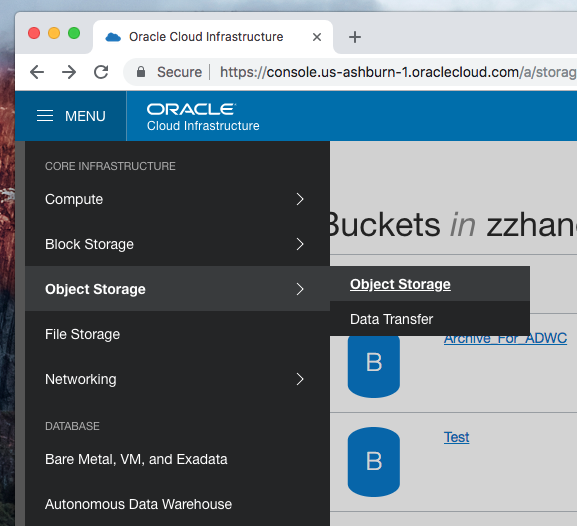
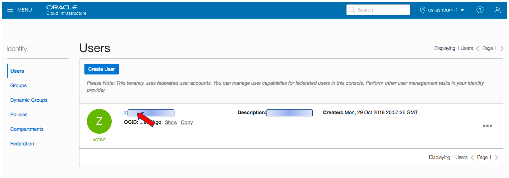
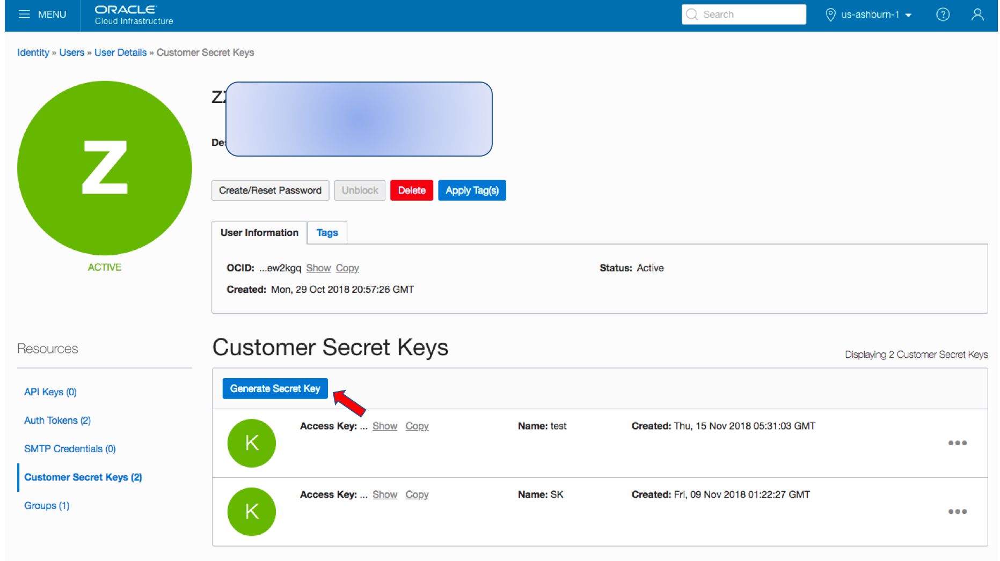
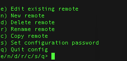
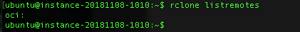
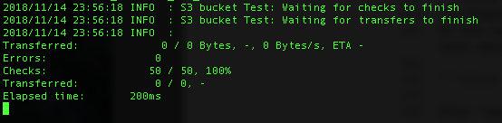

# From files to Object Storage, then to ADWC and OAC                                    

When you need a visualization and want to keep it up with the data source updates, Oracle provides the perfect tools, all you have to do is to link them together. This workshop walks you through all the steps to set up the pipeline. In order to get started, you will need to provision a **Virtual Machine (VM)**, **Oracle Object Storage**, **Oracle Autonomous Data Warehouse (ADW)**, **Oracle Autonomous Analytic Cloud Service (OAC)** (or using local **Oracle Data Visualization Desktop (DVD)** free with the purchase of ADW service). Information about how to provision those instances can be found inside upper level workshop folders.

A typical workflow contains 3 steps:
1. Obtain the data from various resources and upload it into object storage, this step can be automated through scheduling a script job in VM;  
2. Load the data from object storage into ADWC, this step can be automated through scheduling a notebook job in ADWC; 
3. Refresh the visualization in OAC or DVD to reflect the data updates in ADWC.  

## Goals for this workshop

 - Get comfortable with Oracle's public cloud services
 - Load data into the object store
 - Load data from the object store
 - Use Oracle Machine Learning SQL notebooks
 - Schedule SQL notebook job
 - Use Oracle Analytics CLoud (OAC) with ADW
 - Use Oracle Data Visualization Desktop (DVD) with ADW

# Workshop Overview

**Prerequisites – Required Software**

*1. Data Visualization Desktop (DVD)*
  DVD tool comes free with the purchase of ADWC service, it is a local version of OAC with basic functions. 
  To download and install Data Visualization Desktop please follow <a href="https://www.oracle.com/technetwork/middleware/oracle-data-visualization/downloads/oracle-data-visualization-desktop-2938957.html" target="_blank"> this link </a>, and select the operating system for your computer. This page also has instructions on how to install DVD on Windows and Mac OSX.

  If you already have Data Visualization Desktop installed on your computer then please check the version. The minimum version that is required to connect to an Oracle Autonomous Data Warehouse is 12c 12.2.5.0.0.

## Step 1: Remotely upload data into Oracle Object Storage 
This step walks you through the details of loading data into Oracle Object Storage, and how to set up a scheduler in VM to automate this job.

**Key Objectives**:

- Learn how to connect to the Oracle Object Storage using rclone
- Learn how to upload data into Oracle Object Storage remotely

**Guide**

1. Create a bucket in Object Storage
Instructions can be found here:   <a href="https://cloudsolutionhubs.github.io/autonomous-database/workshops/?page=LabGuide400LoadingDataToOracleAutonomousDatabase.md" target="_blank">Setup the OCI Object Store</a>

Remember to choose "Standard" for storage tier, "Archieve" type won't work for step 2.

2. Obtain "Secret Key" and "Access Key"

To access the Oracle Object Storage from outside, we need to obtain Object Storage's "Secret Access Key" and "Access Key ID" first.
Inside OCI, click through top_left MENU => Find "Identity" under Govonance and Administration => Select "Users" => Click on the user acount to open;


In the new page, on the left side, select "Customer Secret Keys" under Resources => Click "Generate Secret Key" => Put in Name => Copy the generated Secret Key and write it down (IMPORTANT! This key will not show again!) => Now, in the main page "Customer Secret Keys" section, click "show" to see the Access Key value.


3. Install rclone tool

Rclone ("rsync for cloud storage") is a command line program to sync files and directories to and from different cloud storage providers.
Detail instructions can be found here: <a href="https://rclone.org" target="_blank">Rclone homepage</a>

Here we use a Virtual Machine on Oracle Cloud as an example to show how to use rclone to make the connection happen:
Inside VM, open a terminal, run the following command to install rclone:

```curl https://rclone.org/install.sh | sudo bash```

If you encounter any installation problems, you can find help here: <a href="https://rclone.org/downloads/" target="_blank">Rclone download</a>


4. Set up OCI Object Storage bucket as rclone remote
Inside VM terminal, run rclone config command to set up a remote link:

```rclone config```

then enter ```n``` to select "New remote" option.

Following prompt, entering/selecting the following information:
```
name: XXX

type = s3  (Oracle Object Storage is categoried as s3 here)

provider = Other (Oracle is categoried as other)

env_auth = false

access_key_id = enter the access key value in step 2

secret_access_key = enter the secret key value in step 2

region = us-ashburn-1 (select the region in which you created your service, this your_region_identifier can be found in top right region of OCI interface )

endpoint = https://<your_namespace>.compat.objectstorage.<your_region_identifier>.oraclecloud.com (namespace can be found in your object storage bucket information page)

acl = bucket-owner-full-control
```

5. Load data into Object Storage

Once your have set up your rclone remote, you can confirm it with command:

```rclone listremotes```

In this example, rclone has a remote name 'oci' linking with our Object Storage. We can use the following command to upload local data into the "Test" bucket inside our Object Storage:

```rclone --verbose --cache-workers 64 --transfers 64 --retries 32    copy   /home/ubuntu/temp_unzip/    oci:Test```

After "copy", the "/home/ubuntu/temp_unzip/" is the path of the source file, "oci:Test" is the target Object Storage bucket, note that if there's no bucket name "Test" in your Object Storage, it will create one with this name to store the files.


If files are already in Object Storage bucket, then this copy command will only transfer files that need to be updated.

More instructions can be found here https://cloud.oracle.com/iaas/whitepapers/transfer-data-to-object-storage.pdf

## Step 2: Automatically load data from Object Storage into ADWC
In this lab you will explore the free sample data sets that are included witin your new autonomous data warehouse. As part of this lab you will experiment with the selecting different levels of database services that come with your Autonomous Data Warehouse.

**Key Objectives**:

- Learn about the different levels of Autonomous Data Warehouse service (HIGH, MEDIUM, LOW)
- Learn about the Star Schema Benchmark (SSB) and Sales History (SH) sample data sets
- See how the different levels of database service affect performance and concurrency

**[Click here to run Lab 2](LabGuide2.md)**

<a href="https://apexapps.oracle.com/pls/apex/f?p=44785:112:0::::P112_CONTENT_ID:22791" target="_blank">**Click here to watch a video demonstration**</a> of running queries against the sample data sets that are part of your Autonomous Data Warehouse.


## Step 3: Visualize data in ADWC using OAC or DVD
In this lab, you will be uploading files to Oracle Object Storage, creating new sample tables, loading data into those sample tables from files on the OCI Object Storage, and troubleshooting errors relating to your data load jobs.

**Key Objectives**:

- Learn how to upload files to the Oracle Cloud Infrastructure (OCI) Object Storage
- Learn how to load data from an object store
- Learn how to use the SQL Developer Data Import Wizard to load data
- Learn how to troubleshoot data loads

**[Click here to run Lab 3](LabGuide3OOW.md)**

<a href="https://apexapps.oracle.com/pls/apex/f?p=44785:112:0::::P112_CONTENT_ID:22792" target="_blank">**Click here to watch a video demonstration**</a> of loading data into your Autonomous Data Warehouse


## Step 4: Test
In this lab, you will be querying files directly on Oracle Object Storage without loading them to your autonomous data warehouse.

**Key Objectives**:

- Learn how to define external tables against Oracle Object Store data sets
- Learn how to query external tables
- Learn how to create data warehouse user

**[Click here to run Lab 4](LabGuide4.md)**


## Learn More About Autonomous Data Warehouse...

Use these links to get more information about Oracle Autonomous Data Warehouse

 - <a href="https://www.oracle.com/database/data-warehouse/index.html" target="_blank">Oracle Autonomous Data Warehouse website</a>
 - <a href="http://www.oracle.com/us/products/database/autonomous-dw-cloud-ipaper-3938921.pdf" target="_blank">Oracle Autonomous Data Warehouse ipaper</a>
 - <a href="https://docs.oracle.com/en/cloud/paas/autonomous-data-warehouse-cloud/index.html" target="_blank">Oracle Autonomous Data Warehouse Documentation</a>
 - <a href="https://docs.oracle.com/en/cloud/paas/autonomous-data-warehouse-cloud/tutorials.html" target="_blank">Additional Autonomous Data Warehouse Tutorials</a>
