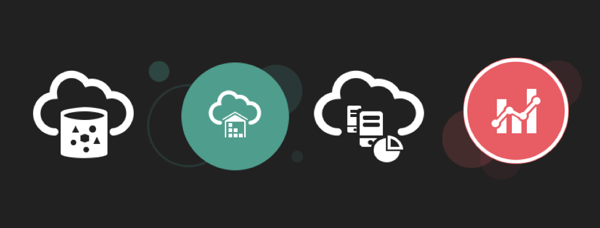
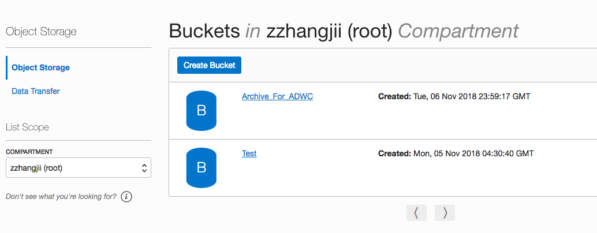
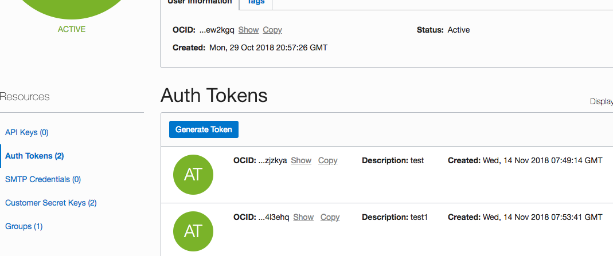
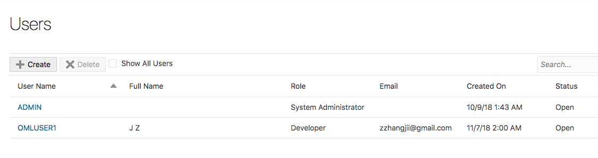
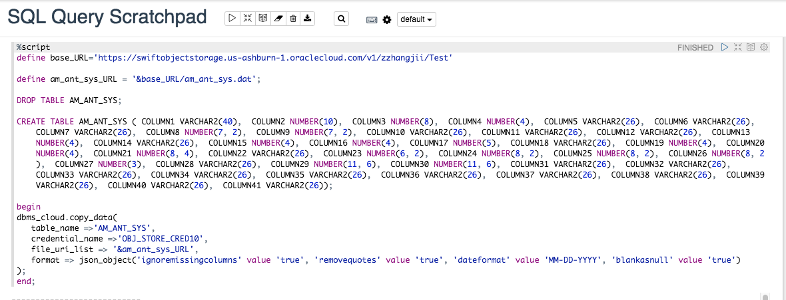
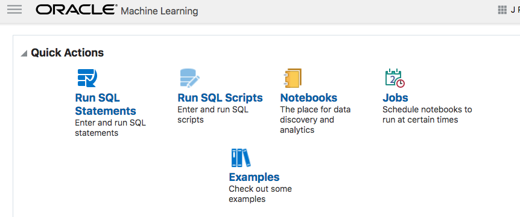
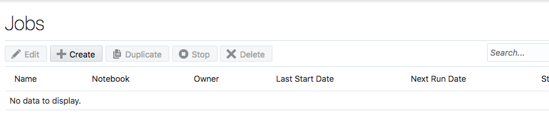
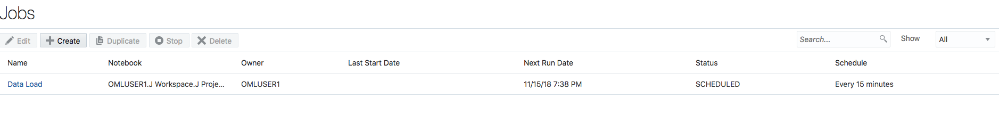
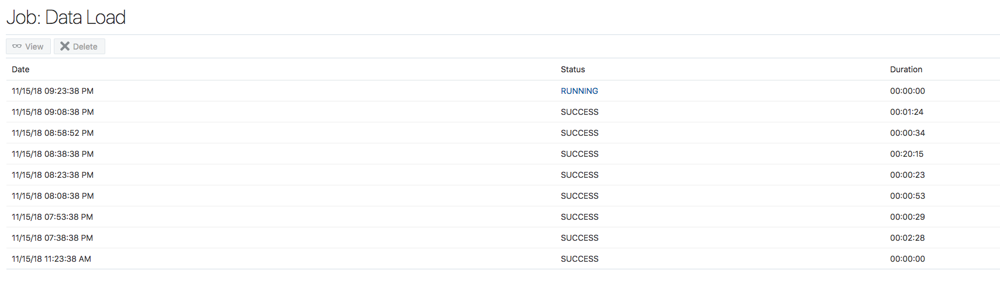

# From files to Object Storage, then to ADWC and OAC                                    

When you need a visualization and want to keep up with the data source updates, Oracle provides the perfect tools, all you need to do is to link them together. This workshop walks you through all the steps to set up the pipeline. In order to get started, you will need to provision a **Virtual Machine (VM)**, **Oracle Object Storage**, **Oracle Autonomous Data Warehouse (ADW)**, **Oracle Autonomous Analytic Cloud Service (OAC)** (or using local **Oracle Data Visualization Desktop (DVD)** free with the purchase of ADW service). Information about how to provision those instances can be found inside upper level workshop folders.

A typical workflow contains 3 steps:
1. Obtain the data from various resources and upload it into object storage, this step can be automated through scheduling a script job in VM;  
2. Load the data from object storage into ADWC, this step can be automated through scheduling a notebook job in ADWC; 
3. Refresh the visualization in OAC or DVD to reflect the data updates in ADWC. 

##Move data from various sources to ADWC

##Loading data to ADWC from object storage
We have already seen in ?? how to provision Autonomous Data Warehouse (ADWC). In this section we will focus on how to get data to ADWC from object storage without any human intervention.

We have already seen how to set up an object storage and load data into it in the previous section. Once the data files are updated in object storage we need to construct the URLs of the files and an object store auth token. Refer Steps 7-9 Under Setup the OCI Object Store (https://oracle.github.io/learning-library/workshops/journey4-adwc/?page=LabGuide3.md)

Now we go to our ADWC instance service console and go to our ML notebook. If you need help creating an Oracle ML note book please refer to (https://oracle.github.io/learning-library/workshops/journey4-adwc/?page=LabGuide8.md).

We have 2 users "ADMIN" and "OMLUSER1". We use the "OMLUSER1" for the further steps. We cannot use "ADMIN" for any of the below steps. 

Now we run the below script in Oracle ML notebook as OMLUSER1 to load the data automatically from Object Storage to ADWC.

The datya is now loaded in ADWC. We will create a job in our ML notebook to automate this loading process. 
The steps for scheduling a data load to ADWC are shown below.
- Click on Jobs under Quick Actions
   
   
   
- The job creation window opens and now click on create
   
   
 The job ctreation wizard will pop up. Here you can select the notebook which you can to schedule for an automatic run and also select the frequency of the run. For example here we want our data load job to run every 15 minutes.
    
      
 Below is our scheduled job
   
   
 We can see that out automatic load has ran successfuly every 15 minutes.
   
   

## Goals for this workshop

 - Get comfortable with Oracle's public cloud services
 - Load data into the object store
 - Load data from the object store
 - Use Oracle Machine Learning SQL notebooks
 - Schedule SQL notebook job
 - Use Oracle Analytics CLoud (OAC) with ADW
 - Use Oracle Data Visualization Desktop (DVD) with ADW

# Workshop Overview

**Lab Prerequisites – Required Software**

*1. Data Visualization Desktop (DVD)*
  DVD tool comes free with the purchase of ADWC service, it is a local version of OAC with basic functions. 
  To download and install Data Visualization Desktop please follow <a href="https://www.oracle.com/technetwork/middleware/oracle-data-visualization/downloads/oracle-data-visualization-desktop-2938957.html" target="_blank"> this link </a>, and select the operating system for your computer. This page also has instructions on how to install DVD on Windows and Mac OSX.

  If you already have Data Visualization Desktop installed on your computer then please check the version. The minimum version that is required to connect to an Oracle Autonomous Data Warehouse is 12c 12.2.5.0.0.

## Lab 1: Getting Started and Provisioning a New Autonomous Data Warehouse
This lab walks you through the steps of logging into Oracle Cloud, accessing the Oracle Autonomous Data Warehouse console and provisioning your first Autonomous Data Warehouse. The last part of this lab will explore how to connect to your new data warehouse using Oracle SQL Developer.

**Key Objectives**:

- Learn how to sign-in to the Oracle Public Cloud
- Learn how to provision a new Autonomous Data Warehouse instance
- Learn how to download the client credentials wallet file
- Learn how to connect from Oracle SQL Developer

**[Click here to run Lab 1](LabGuide1.md)**

<a href="https://apexapps.oracle.com/pls/apex/f?p=44785:112:0::::P112_CONTENT_ID:24294" target="_blank">**Click here to watch a video demonstration**</a> of provisioning a new autonomous data warehouse.

<a href="https://apexapps.oracle.com/pls/apex/f?p=44785:112:0::::P112_CONTENT_ID:22790 " target="_blank">**Click here to watch a video demonstration**</a> of connecting to your new Autonomous Data Warehouse using SQL Developer.

## Lab 2: Working with Data Warehouse Services and the Free Sample Data Sets
In this lab you will explore the free sample data sets that are included witin your new autonomous data warehouse. As part of this lab you will experiment with the selecting different levels of database services that come with your Autonomous Data Warehouse.

**Key Objectives**:

- Learn about the different levels of Autonomous Data Warehouse service (HIGH, MEDIUM, LOW)
- Learn about the Star Schema Benchmark (SSB) and Sales History (SH) sample data sets
- See how the different levels of database service affect performance and concurrency

**[Click here to run Lab 2](LabGuide2.md)**

<a href="https://apexapps.oracle.com/pls/apex/f?p=44785:112:0::::P112_CONTENT_ID:22791" target="_blank">**Click here to watch a video demonstration**</a> of running queries against the sample data sets that are part of your Autonomous Data Warehouse.

## Lab 3: Loading Data into Your New Autonomous Data Warehouse
In this lab, you will be uploading files to Oracle Object Storage, creating new sample tables, loading data into those sample tables from files on the OCI Object Storage, and troubleshooting errors relating to your data load jobs.

**Key Objectives**:

- Learn how to upload files to the Oracle Cloud Infrastructure (OCI) Object Storage
- Learn how to load data from an object store
- Learn how to use the SQL Developer Data Import Wizard to load data
- Learn how to troubleshoot data loads

**[Click here to run Lab 3](LabGuide3OOW.md)**

<a href="https://apexapps.oracle.com/pls/apex/f?p=44785:112:0::::P112_CONTENT_ID:22792" target="_blank">**Click here to watch a video demonstration**</a> of loading data into your Autonomous Data Warehouse

## Lab 4: Querying External Data
In this lab, you will be querying files directly on Oracle Object Storage without loading them to your autonomous data warehouse.

**Key Objectives**:

- Learn how to define external tables against Oracle Object Store data sets
- Learn how to query external tables
- Learn how to create data warehouse user

**[Click here to run Lab 4](LabGuide4.md)**

## Lab 5: Creating Rich Data Visualizations
This lab will walk you through the process of connecting your Autonomous Data Warehouse to Data Visualization Desktop and then use DVD and build sophisticated data visualizations to help your business teams get deeper insights about their data

**Key Objectives**:

- Learn how to connect your free Data Visualization Desktop analytics tool to Autonomous Data Warehouse
- Learn how to secure a desktop client connection to Autonomous Data Warehouse
- Learn how to create a simple data visualization project with Oracle Data Visualization Desktop
- Learn how to access and gain insights from data in the Autonomous Data Warehouse

**[Click here to run Lab 5](LabGuide5.md)**

<a href="https://youtu.be/n5Q_5abgXcI" target="_blank">**Click here to watch a video demonstration**</a> that walks you through the process of connecting Data Visualization Desktop to your new Autonomous Data Warehouse and building sophisticated data visualizations.

# Bonus Labs - Slightly More Advanced Features for Data Warehouse Developers, Cloud DBAs and Data Scientists

The following labs will let you explore some of the more advanced features of your Autonomous Data Warehouse. They cover the following topics that will help you expand your knowledge by introducing some more advanced topics for Autonomous Data Warehouse"

1) Managing and monitoring Autonomous Data Warehouse using the Cloud Console
2) Using Oracle Machine Learning SQL Notebooks
3) Introduction to machine learning with DBMS_PREDICTIVE_ANALYTICS
4) Using data integration tools with Autonomous Data Warehouse

## Bonus Lab - Lab 6:  Managing and Monitoring Autonomous Data Warehouse using the Cloud Service Console
For this lab you will watch a couple of demos to show the capabilities available via the Cloud Console and Autonomous Data Warehouse Service Console.

**Key Objectives**:

- Learn how to start/stop your ADW instance
- Learn how to recover your data warehouse - if needed
- Learn how to use the service console to monitor the performance of your Autonomous Data Warehouse

**[Click here to run Bonus Lab 6](LabGuide6.md)**

<a href="https://apexapps.oracle.com/pls/apex/f?p=44785:112:0::::P112_CONTENT_ID:24194" target="_blank">**Click here to watch a video demonstration**</a> that shows you how to monitor performance of your Autonomous Data Warehouse and perform basic administrative tasks.

## Bonus Lab - Lab 7: Scaling and Performance in Autonomous Data Warehouse
In this lab you will scale up your Oracle Autonomous Data Warehouse instance by adding more CPUs with on interruption to your service. You will watch a recorded demo that shows the performance and concurrency impacts of scaling your service online.

**Key Objectives**:

- Learn how to scale up and down the CPUs and storage used by your Autonomous Data Warehouse
- See how scaling affects your concurrency and performance

**[Click here to run Bonus Lab 7](LabGuide7.md)**

## Bonus Lab - Lab 8:  Using Oracle Machine Learning SQL Notebooks
During this lab you will be using the new Oracle Machine Learning SQL notebook application that is part of your Autonomous Data Warehouse. This browser-based application provides a web interface to run SQL queries and scripts, which can be grouped together within a notebook. Notebooks can be used to build single reports, collections of reports, and dashboards. Oracle Machine Learning provides a simple way to share workbooks with other OML users.

**Key Objectives**:

- Learn how to create new users for Oracle Machine Learning
- Learn how to run a SQL Statement
- Learn how to share notebooks
- Learn how to create and run SQL scripts

**[Click here to run Bonus Lab 8](LabGuide8.md)**

## Bonus Lab - Lab 9: Simple Introduction to Machine Learning Algorithms
During this lab you will be using the Oracle Machine Learning SQL notebook application to explore how you can use the in-database DBMS_PREDICTIVE_ANALYTICS functionality. DBMS_PREDICTIVE_ANALYTICS provides a set of easy-to-use procedures that simplify the machine learning process.

**Key Objectives**:

- Learn how to use DBMS_PREDICTIVE_ANALYTICS routines
- Learn how to use Oracle ML Gallery
- Learn how to import notebooks into Oracle ML

**[Click here to run Bonus Lab 9](LabGuide9.md)**

## Bonus Lab - Lab 10: Using Data Integration Tools with Autonomous Data Warehouse
In this lab, you will configure and use Oracle Data Integration Platform Cloud (DIPC) with Autonomous Data Warehouse. This lab follow a typical enterprise data warehouse reference implementation with ETL/ELT batch processing, real time data replication, and data quality review. You will load data from a flat file and a database table using Oracle Data Integrator (ODI) to your Autonomous Data Warehouse. You will replicate data from a database table to Autonomous Data Warehouse using Oracle Golden Gate (OGG). You will review data quality in your Autonomous Data Warehouse using Oracle Enterprise Data Quality (EDQ).

**Key Objectives**:

- Learn how extract, load and transform data into your Autonomous Data Warehouse using Oracle Data Integration Platform
- Learn how to replicate data into your Autonomous Data Warehouse with Oracle GoldenGate (OGG)
- Learn how to review data quality your Autonomous Data Warehouse with Oracle Enterprise Data Quality (EDQ)

**[Click here to run Bonus Lab 10](LabGuide10.md)**

## Learn More About Autonomous Data Warehouse...

Use these links to get more information about Oracle Autonomous Data Warehouse

 - <a href="https://www.oracle.com/database/data-warehouse/index.html" target="_blank">Oracle Autonomous Data Warehouse website</a>
 - <a href="http://www.oracle.com/us/products/database/autonomous-dw-cloud-ipaper-3938921.pdf" target="_blank">Oracle Autonomous Data Warehouse ipaper</a>
 - <a href="https://docs.oracle.com/en/cloud/paas/autonomous-data-warehouse-cloud/index.html" target="_blank">Oracle Autonomous Data Warehouse Documentation</a>
 - <a href="https://docs.oracle.com/en/cloud/paas/autonomous-data-warehouse-cloud/tutorials.html" target="_blank">Additional Autonomous Data Warehouse Tutorials</a>
