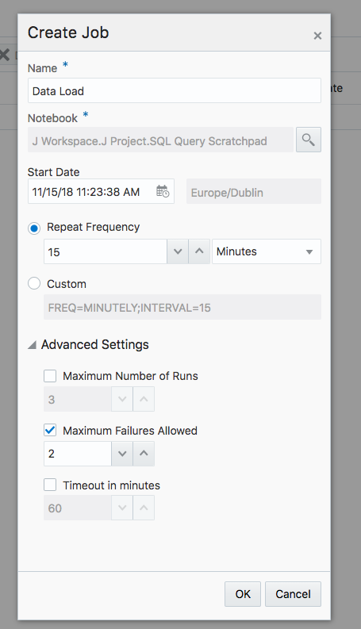

# From files to Object Storage, then to ADWC and OAC                                    

When you need a visualization and want to keep up with the data source updates, Oracle provides the perfect tools, all you need to do is to link them together. This workshop walks you through all the steps to set up the pipeline. In order to get started, you will need to provision a **Virtual Machine (VM)**, **Oracle Object Storage**, **Oracle Autonomous Data Warehouse (ADW)**, **Oracle Autonomous Analytic Cloud Service (OAC)** (or using local **Oracle Data Visualization Desktop (DVD)** free with the purchase of ADW service). Information about how to provision those instances can be found inside upper level workshop folders.

A typical workflow contains 3 steps:
1. Obtain the data from various resources and upload it into object storage, this step can be automated through scheduling a script job in VM;  
2. Load the data from object storage into ADWC, this step can be automated through scheduling a notebook job in ADWC; 
3. Refresh the visualization in OAC or DVD to reflect the data updates in ADWC. 

## Move data from various sources to ADWC

## Loading data to ADWC from object storage

We have already seen in ?? how to provision Autonomous Data Warehouse (ADWC). In this section we will focus on how to get data to ADWC from object storage without any human intervention.

We have already seen how to set up an object storage and load data into it in the previous section. Once the data files are updated in object storage we need to construct the URLs of the files and an object store auth token. Refer Steps 7-9 Under Setup the OCI Object Store (https://oracle.github.io/learning-library/workshops/journey4-adwc/?page=LabGuide3.md)

Now we go to our ADWC instance service console and go to our ML notebook. If you need help creating an Oracle ML note book please refer to (https://oracle.github.io/learning-library/workshops/journey4-adwc/?page=LabGuide8.md).

We have 2 users "ADMIN" and "OMLUSER1". We use the "OMLUSER1" for the further steps. We cannot use "ADMIN" for any of the below steps. 

Now we run the below script in Oracle ML notebook as OMLUSER1 to load the data automatically from Object Storage to ADWC.

The data is now loaded in ADWC. We will create a job in our ML notebook to automate this loading process. 
The steps for scheduling a data load to ADWC are shown below.
- Click on Jobs under Quick Actions
   
   
   
- The job window opens and now click on create
   
   
- The job ctreation wizard will pop up. Here you can select the notebook which you can to schedule for an automatic run and also select the frequency of the run. For example here we want our data load job to run every 15 minutes.
    
      
 Below is our scheduled job
   
   
 We can see that out job for automatic data load has ran successfuly every 15 minutes.
   
   
## Using the data in Data Visualization desktop
The data we have in ADWC can we used for drawing important business insights and in the below steps we will see how we can use Data Vizualization desktop for the name. You get a free licence for Data Visualization Desktop with Autonomous Data warehouse. 

