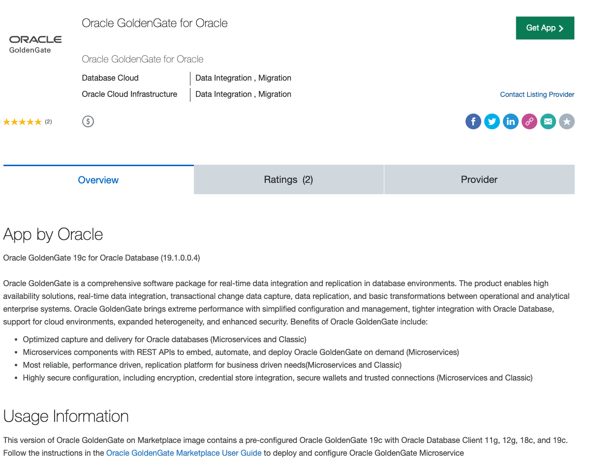
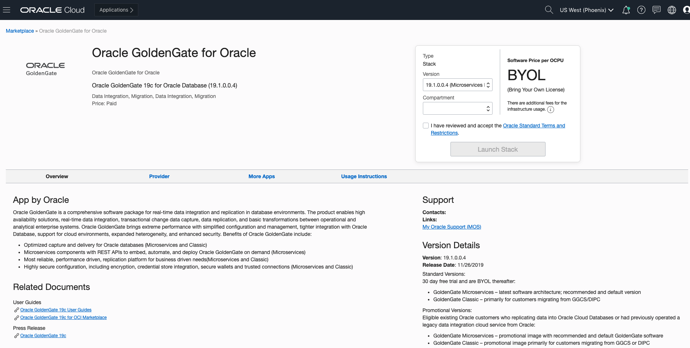
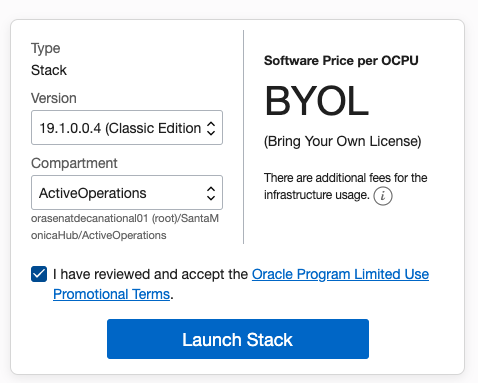
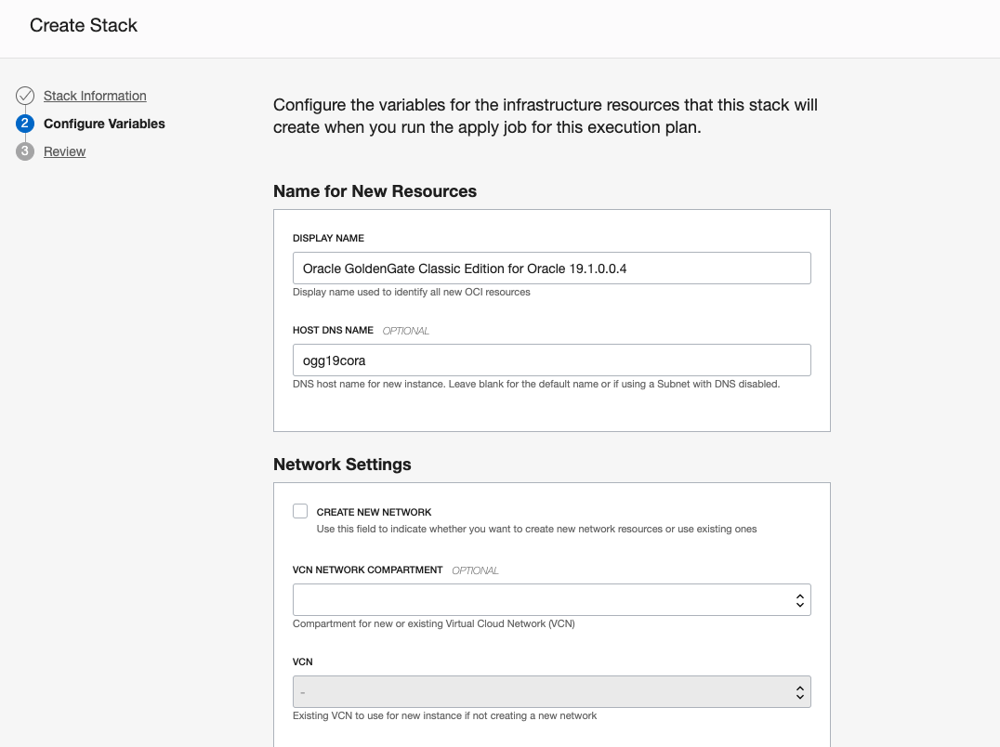
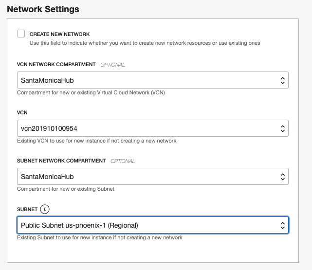
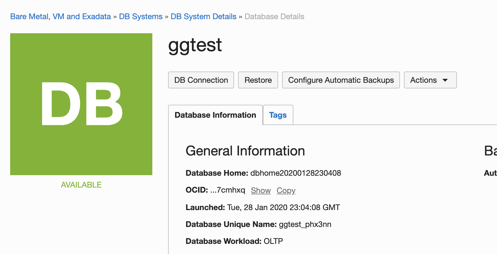
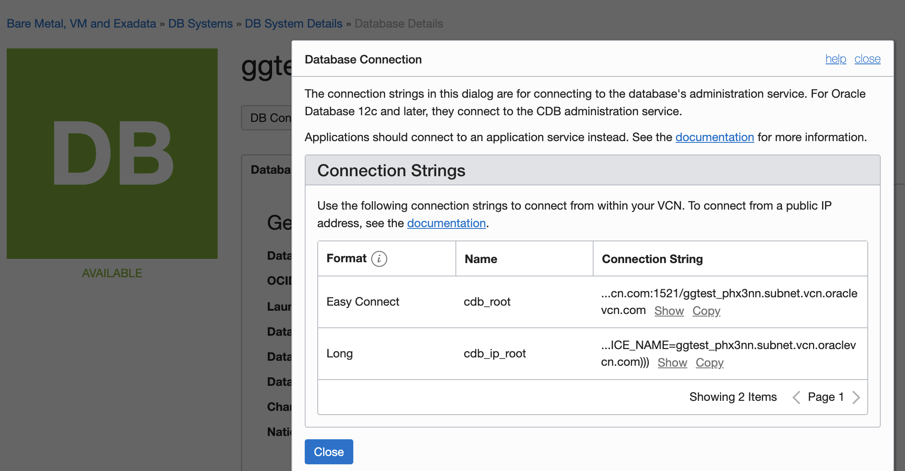
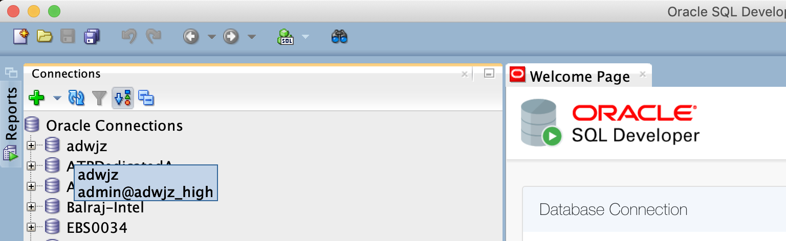
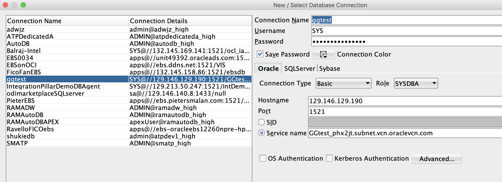
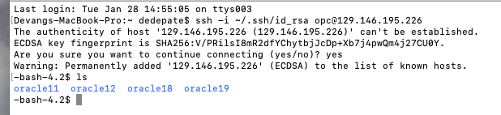

# Workshop: Oracle Database to Autonomous Database with GoldenGate


## Introduction

Welcome to the introduction to the Oracle Goldengate database synchronization workshop. This workshop will introduce you to the most advanced database synchronization technology available today.

In the next two - twenty four hours you will experience a day in the life of Tim Robinson -- a database administrator for the fictitious company Alpha Office. Tim has been hired to move their existing database system (11G) to the autonomous database with zero downtime on workload. In this workshop you will take on Tim’s persona to build a data pipeline from a 11g database to a 19c database utilizing Oracle’s Goldengate synchronization tool. In doing so, you will leverage the latest and most advanced Oracle open-sourced technologies.

As Tim, you will spin up a new Oracle Goldengate Image from the Oracle Marketplace, an 11g Oracle database, and an autonomous data warehouse to quickly and easily employ a complete synchronization environment available in any location.

By doing so, you will gain breadth in creating multiple database environments and functionality. And, will learn to use a comprehensive software package for real-time data integration and replication in heterogeneous IT environments with simplified configuration and management. 

To log issues, click here to go to the github oracle repository issue submission form.

## Useful links:
[Download SQL Developer](https://www.oracle.com/technetwork/developer-tools/sql-developer/downloads/index.html)
[GoldenGate Marketplace image](https://cloudmarketplace.oracle.com/marketplace/en_US/listing/58489224)
[Information on the GoldenGate MarketPlace Promotion](https://blogs.oracle.com/dataintegration/free-goldengate-software-on-oci-marketplace)
[GoldenGate 19.1 documentation](https://docs.oracle.com/en/middleware/goldengate/core/19.1/index.html)
[Fundamentals youtube course](
https://www.youtube.com/watch?v=uQ8eKJmPfwY&list=PL3Hc8S1SG2ATGktXhC3WA5YYVI_wBcFYR)
[How to create a ssh key] (https://www.oracle.com/webfolder/technetwork/tutorials/obe/cloud/javaservice/JCS/JCS_SSH/create_sshkey.html)
[How to use vi on a terminal session] (https://staff.washington.edu/rells/R110/)

## Outline:
Lab 100: Create Goldengate usernames in source and target DBs
Lab 200: Setup connections to Source DB and target DB
Lab 300: Extract and Pump processes configuration
Lab 400: Replicate process configuration
Lab 500: GoldenGate in-action
Lab 600: Configuration for capturing DDL changes (optional)
Lab 700: Configuration for databases with multi-tenant architecture (optional)

# Pre-requisites

## 1.	[Create a GoldenGate classic instance from the marketplace] (https://cloudmarketplace.oracle.com/marketplace/en_US/listing/58489224)



Going to the link will take you to this page, press get app.

Select the compartment of your tenancy where you would like GoldenGate to reside. 

In this case, we are using the classic edition of GoldenGate. A separate lab will address GoldenGate microservices.

You can put GoldenGate inside of an existing VCN or have the wizard create a new one for you. 

For this lab, make sure that GoldenGate is inside of a public subnet. 

After reviewing, allow some time for the instance to provision. 

## 2. Provision an Oracle 11G database on DBCS on OCI

After provisioning the database, you will have to install SQL*Plus on that instance. 

[About DBaaS on OCI] (https://docs.cloud.oracle.com/en-us/iaas/Content/Database/Concepts/overview.htm)
[How to provision a database instance] (https://docs.cloud.oracle.com/en-us/iaas/Content/Database/Tasks/creatingDBsystem.htm)

Allow some time for your 11G instance to provision.

## 3. Provision an Autonomous Data warehouse

[Click here to see the steps to provision an Oracle Autonomous data warehouse on OCI](https://oracle.github.io/learning-library/workshops/journey4-adwc/?page=LabGuide1.md)

[You will need your database wallet to create a SQL*plus connection from GoldenGate and upload it to the GoldenGate VM](
https://oracle.github.io/learning-library/workshops/journey4-adwc/?page=README.md) 		 	 	 		

#Lab 100: Create Goldengate usernames in source and target DBs
##1. Create GG user in source DB:


After spinning up an 11G instance, you can click on the database and you will go to this screen. Click the DB Connection box. 

Copy the easy connection string for later.

Open SQL Developer and press the green checkbox to create a connection.

Connect to your 11G database on SQL Developer. Your username is SYS, make sure you have the role set to SYSDBA. The service name is part of the easy connection string. 

You can also ssh into your database node, you can obtain the public IP address from the node details on the database page. Follow the ssh -i syntax in the above screenshot.

Next, confirm if there’s any existing GG users with the commands below in SQL Developer.

```
SELECT username FROM dba_goldengate_privileges;
```

If no GG user exists, let’s go ahead and create a user:
```
create user ggadmin identified by WELcome__12345 default tablespace system temporary tablespace temp;
grant connect, resource to ggadmin;
grant select any dictionary to ggadmin;
grant create view to ggadmin;
grant execute on dbms_lock to ggadmin;
grant Dba to ggadmin;
exec dbms_goldengate_auth.GRANT_ADMIN_PRIVILEGE('ggadmin');
ALTER DATABASE ADD SUPPLEMENTAL LOG DATA;
ALTER SYSTEM SET enable_goldengate_replication=TRUE scope=both;
```
Then, login as ggadmin, and create the tables for this lab by running the below command.
```
CREATE TABLE Channels (
 supplier_id numeric(10) not null,
 CONSTRAINT supplier_pk PRIMARY KEY (supplier_id)
);
```
##2. Configure GG user in target ADW

Unlock the pre-created oracle goldengate user (ggadmin), with the below command in SQL Developer. 

```
alter user ggadmin identified by <password> account unlock;
```
Then make sure goldengate is enabled:
```
select * from v$parameter where name = ‘enable_goldengate_replication’;

```
Also grant writing access the the tablespace:
```
alter user ggadmin quota unlimited on DATA;
grant unlimited tablespace to ggadmin;
```
Then create the same table from the source database, on the target database:
```
CREATE TABLE Channels (
 supplier_id numeric(10) not null,
 CONSTRAINT supplier_pk PRIMARY KEY (supplier_id)
);
```
Good job, you have finished lab 100! [Click here to continue to lab 200.](INSERT URL)

# Lab 200: Setup connections to Source DB and target DB

## 1. Configure the environment variable for Source DB connection

Begin by ssh-ing to the GG admin server, then you will set up the environment variables so you can create the connection credentials to the source database (11G). After you set up the $ORACLE_HOME, $TNS_ADMIN and $LD_LIBRARY_PATH, create the tnsnames.ora file that contains the database connection details. 

Go to your database system to get the connection information (screenshot)
(DESCRIPTION=(CONNECT_TIMEOUT=5)(TRANSPORT_CONNECT_TIMEOUT=3)(RETRY_COUNT=3)(ADDRESS_LIST=(LOAD_BALANCE=on)(ADDRESS=(PROTOCOL=TCP)(HOST=10.1.1.1)(PORT=1521)))(CONNECT_DATA=(SERVICE_NAME=GGTestDB_phx1n9.subnet.vcn.oraclevcn.com)))

Note: the host may use a private IP address or dns name, if so, change it to the public IP address.

Note: Because the source database is 11G, you will need to use GoldenGate 11G here.
```
cd /u01/app/client/oracle11
Mkdir -p network/admin (DON’T NEED TO MKDIR; already exists)
cd network/admin
Create a tnsnames.ora file here (under the admin folder). 
	vi tnsnames.ora

Create a service name “DB11G” pointing to the source database:
DB11G=(DESCRIPTION=(CONNECT_TIMEOUT=5)(TRANSPORT_CONNECT_TIMEOUT=3)(RETRY_COUNT=3)(ADDRESS_LIST=(LOAD_BALANCE=on)(ADDRESS=(PROTOCOL=TCP)(HOST=123.123.123.123)(PORT=1521)))(CONNECT_DATA=(SERVICE_NAME=GGTest_phx123.subnet.vcn.oraclevcn.com)))

```
Note: Esc, :wq is how you save and exit vi

Configure your .bash_profile by running this vi command, and adding the 3 export lines at the bottom. After writing and quitting, run source to permanently add those environment variables on the GoldenGate admin compute node. 
```
$ vi ~/.bash_profile 
 			 							
export ORACLE_HOME=/u01/app/client/oracle11
export TNS_ADMIN=/u01/app/client/oracle11/network/admin 
export LD_LIBRARY_PATH=/u01/app/client/oracle11/lib 		
				 							
$ source ~/.bash_profile 
```
##2. Create Source DB connection in GoldenGate 11
```
ggsci oracle11
Stop mgr    
Start mgr   (restart mgr, so mgr process can get the env variables just configured)
```
Create user credential
```
add credentialstore
alter credentialstore add user ggadmin@DB11G password WELcome__12345 alias GG_DB11G domain OracleGoldenGate
```
Test this connection 
```
dblogin useridalias GG_DB11G
```

## 3. Configure the env variable for Target ADW connection
ssh to the GG admin server
Note: You need to check to database version of you ADW first. It could be version 18 or version 19. Because the target ADW for demo is version 18, you will need to use GoldenGate 18 here.

Create connection credentials to target db

Create $TNS_ADMIN folder (network/admin) and copy the wallet file here
```	
cd /u01/app/client/oracle18
Mkdir -p network/admin (DON’T NEED TO MKDIR; already exists)
cd network/admin
cp <path-to-ADW-wallet-file> .
```
Update the path inside sqlnet.ora file, 
```
unzip <ADW-wallet-file> 
vi sqlnet.ora (update the path to wallet files)
```
Download the wallet file from ADW cloud console [How to download the wallet File from ADW] (https://docs.oracle.com/en/cloud/paas/autonomous-data-warehouse-cloud/user/connect-download-wallet.html#GUID-B06202D2-0597-41AA-9481-3B174F75D4B1)

Configure your bash profile
```
$ vi ~/.bash_profile 
 			 							
export ORACLE_HOME=/u01/app/client/oracle18
export TNS_ADMIN=/u01/app/client/oracle18/network/admin 
export LD_LIBRARY_PATH=/u01/app/client/oracle18/lib 		
				 							
$ source ~/.bash_profile 
```
##4. Create Target ADW connection credentials in GoldenGate 18
```
Ggsci oracle11
Stop mgr
Start mgr

```
Create username
```
add credentialstore
alter credentialstore add user ggadmin@ADW_low password WELcome__12345 alias GG_ADW
```
Test the connection
```
	dblogin useridalias GG_ADW
```
Congrats - you have finished lab200! Continue to lab300 here. 

#Lab 300: Extract and Pump processes configuration	

Continuing from lab200, run these commands.

```
dblogin useridalias DB11G
add schematrandata ggadmin
add checkpointtable ggadmin.checkpointable
	Successfully created checkpoint table ggadmin.checkpointtable
```
Configure Extract process
```
edit param EXT (INSERT SCREENSHOT)
add extract EXT, tranlog, begin now
add exttrail ./dirdat/aa, extract EXT
```
Configure Pump process
```
edit param PMP (INSERT SCREENSHOT)
add extract PMP, exttrailsource /home/opc/oracle11/dirdat/aa, begin now
add rmttrail /home/opc/oracle18/dirdat/cc, extract PMP

stop/start mgr
```
#Lab 400: Replicate process configuration

dblogin useridalias ADW
Configure mgr dynamic ports
edit param mgr
Add line
DYNAMICPORTLIST 10020-10030
stop/start mgr
Configure ./GLOBALS
edit param ./GLOBALS
Add line
ALLOWOUTPUTDIR /home/opc/oracle18/dirdat/
Configure Replicat process
edit param REP (INSERT SCREENSHOT)
add replicat REP, exttrail /home/opc/oracle18/dirdat/cc, begin now, checkpointtable ggadmin.ggschkpt

#Lab 500: GoldenGate in-action
ggsci oracle11
Start *
Ensure all extract processes have started
info all
Ensure each processes is correctly working
view report (EXT/PMP)
Ensure logging file is created
```
cd oracle11/dirdat/
		111
Check if file exists
Repeat for oracle18/dirdat/
ggsci oracle18
Start *
Ensure all extract processes have started
info all
Ensure each processes is correctly working
```
view report REP
		111
Within SQLDeveloper:
Make changes in source database
Check if changes synced to target database
ggsci oracle18
Command: stats replicat REP

Congratulations, you have completed your day in the life of Time successfully. 
