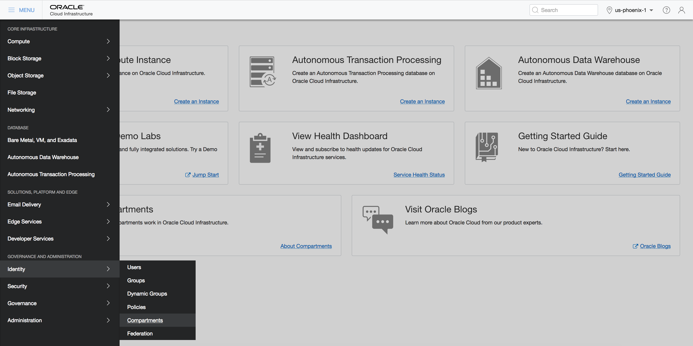
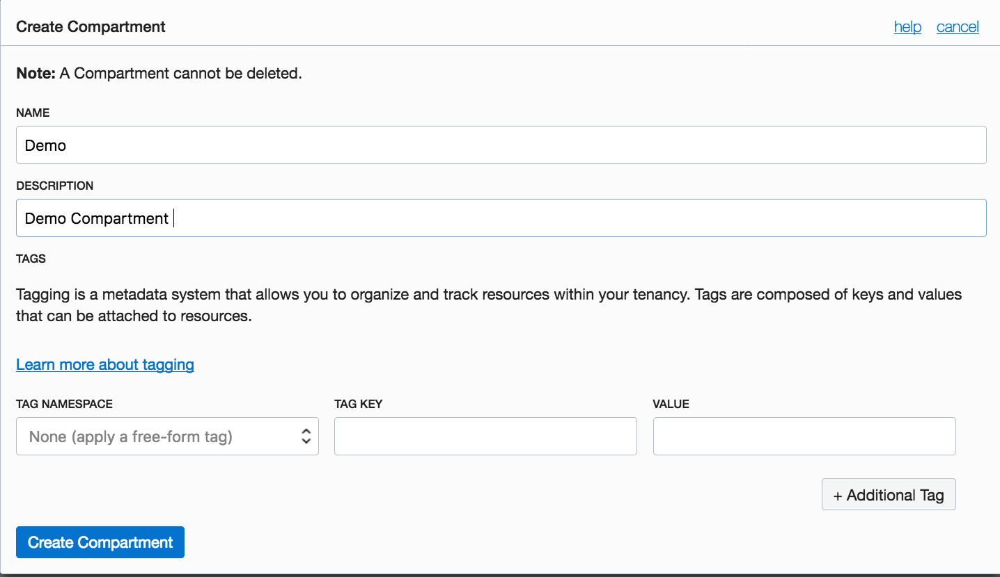
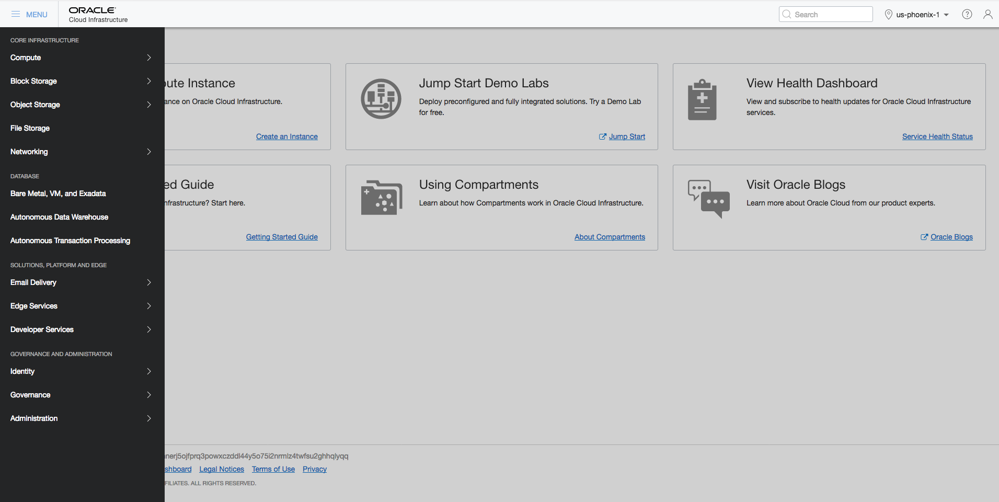
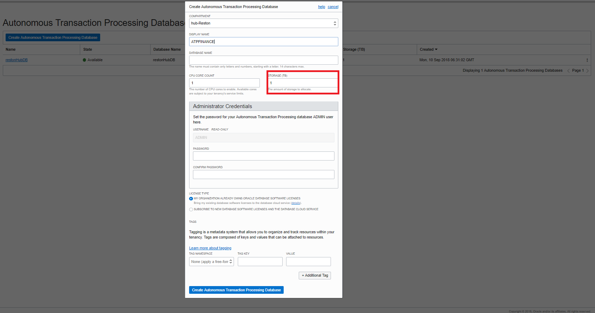
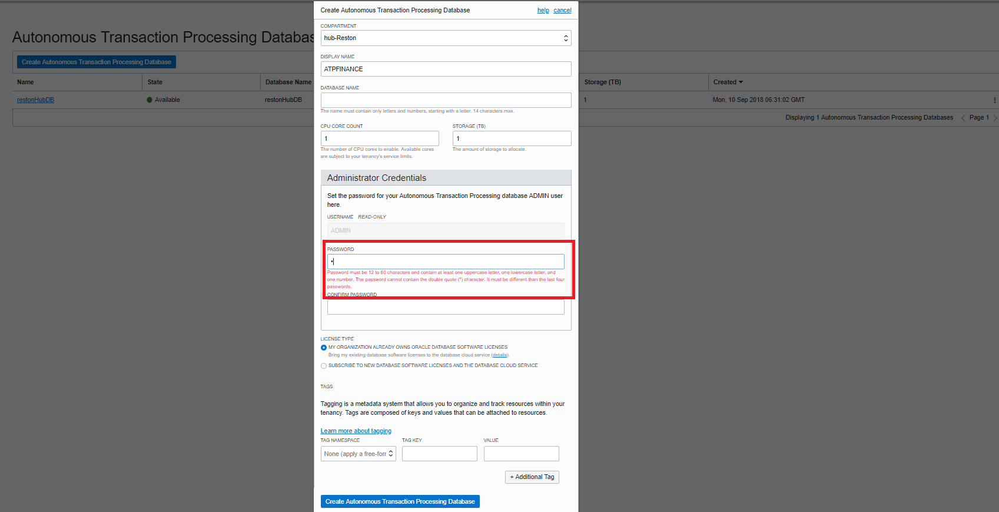
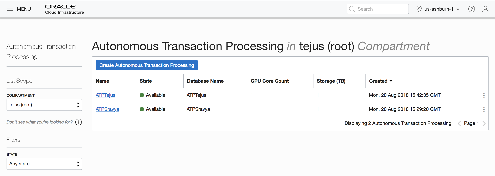
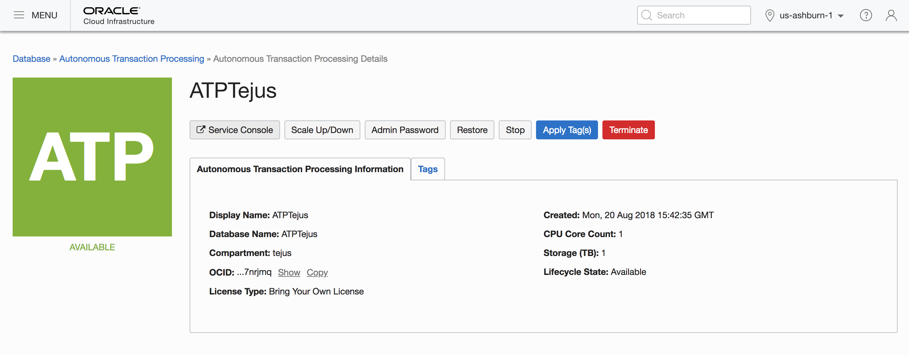

# Lab 100: Provisioning an Autonomous Transaction Processing Database

## Introduction

This lab walks you through the steps to get started using the Oracle Autonomous Transaction Processing Database on Oracle Infrastructure Cloud (OCI). You will provision a new database.

To **log issues**, click [here](https://github.com/oracle/learning-library/issues/new) to go to the github oracle repository issue submission form.

## Objectives

- Learn how to sign-in to the Oracle Public Cloud
- Learn how to provision a new ATP database

## Required Artifacts

- The following lab requires an Oracle Public Cloud account. You may use your own cloud account, a cloud account that you obtained through a trial, or a training account whose details were given to you by an Oracle instructor.

# Provisioning an Autonomous Transaction Processing Database Instance

In this section you will be provisioning an ATP database using the cloud console.

## Steps

### **STEP 1: Sign in to Oracle Cloud Infrastructure console**

- Login to your Oracle Cloud Infrastructure console using the URL provided.

- Choose oracleidentitycloudservice as your Identity Provider and click on **Continue**.


-   On the following screen, provide tenant name, username and password. 


- You will then be securely logged into your Oracle Cloud Infrastructure Console.

### **STEP 2: Create a Compartment**

- Once you are logged in, you are taken to the cloud dashboard where you can see all the services available to you.


- Once you are on OCI dashboard page, click on the hamburger menu icon on the top left of the screen


-  Click on **Identity** and then **Compartments** from the menu



-  Click on **Create Compartment** button to start the compartment creation process 


Enter the following in create Compartment window

- **Name**: Enter a friendly name to idenitfy your compartment (Demo)
- **Description**: Enter a description for the compartment
- Click on Create Compartment link 

Managing Tags and Tag Namespaces: When you have many resources (for example, instances, VCNs, load balancers, and block volumes) across multiple compartments in your tenancy, it can become difficult to track resources used for specific purposes, or to aggregate them, report on them, or take bulk actions on them. Tagging allows you to define keys and values and associate them with resources. You can then use the tags to help you organize and list resources based on your business needs. For more information please click [here](https://docs.cloud.oracle.com/iaas/Content/Identity/Concepts/taggingoverview.htm).




- You can verify the compartment created on Compartments page


### **STEP 3: Create an ATP Instance**

-  Click on the hamburger menu icon on the top left of the screen


-  Click on **Autonomous Transaction Processing** from the menu



- Select **Demo Compartment** 


-  Click on **Create Autonomous Transaction Processing Database** button to start the instance creation process


-  This will bring up Create ATP Database screen where you specify the configurations of the instance


-  Click on **Click here** to enable compartment selection so that the ATP instance is in a specific compartment


#### Note: Oracle Cloud Infrastructure allows logical isolation of users within a tenant through Compartments. This allows multiple users and business units to share a tenant account while being isolated from each other.

If you have chosen the compartment you do not have privilegeson, you will not be able to see or provision instance in it.

More information about Compartments and Policies is provided in the OCI Identity and Access Management documentation [here](https://docs.cloud.oracle.com/iaas/Content/Identity/Tasks/managingcompartments.htm?tocpath=Services%7CIAM%7C_____13).

-  Select Demo compartment which you created earlier in this lab


-  Specify a name for the instance


-  You can choose an instance shape, specified by the CPU count and storage size. Default CPU count is 1 and storage is 1 TB.



-  Specify the password for the instance

#### For this lab, we will be using the following as password

```
WElcome_123#
```



- License Type: You will see 2 options under licensing options. 

#### My organization already owns Oracle database software licenses: Oracle allows you to bring your unused on-prem licenses to the cloud and your instances are billed at a discounted rate. This is the default option so ensure you have the right license type for this subscription.


#### Subscribe to new database software licenses and the database cloud service: Your cloud service instance should include database license. This is an all-inclusive cost and you do not need to bring any additional licenses to cloud.


- Tagging is a metadata system that allows you to organize and track resources within your tenancy. Tags are composed of keys and values that can be attached to resources. 

More information about Tags and Tag Namespaces is provided in the OCI Identity and Access Management documentation [here](https://docs.cloud.oracle.com/iaas/Content/Identity/Concepts/taggingoverview.htm).


For this workshop we will not be creating any TAG NAMESPACE. 

- Make sure you have everything filled all required details


-  Click on **Create Autonomous Transaction Processing Database** to start provisioning the instance




-  Once it finishes provisioning, you can click on the instance name to see details of it



You now have created your first Autonomous Transaction Processing Cloud instance.
