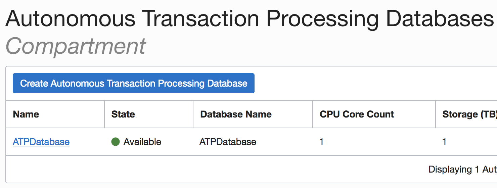
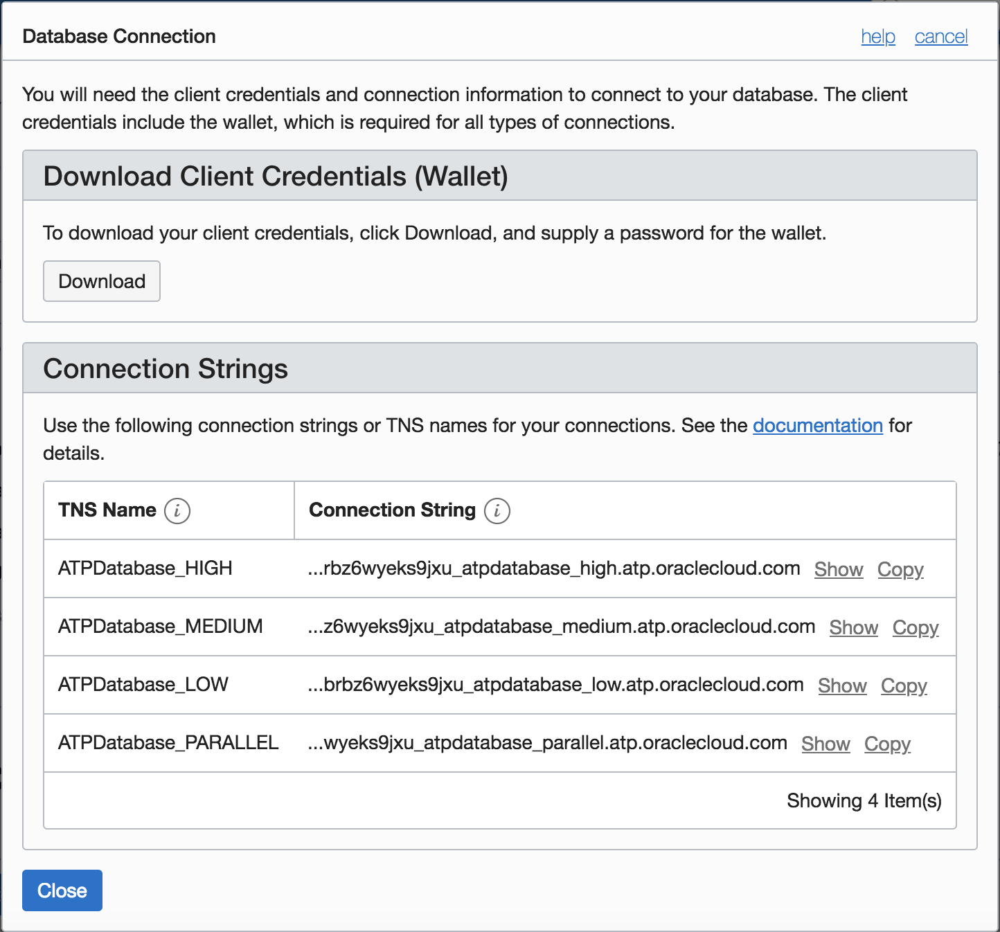
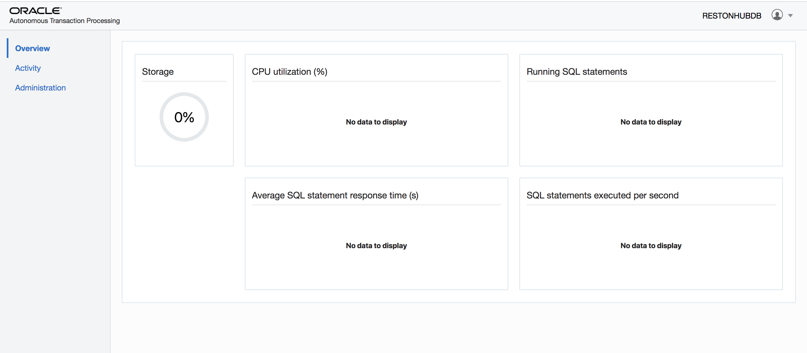
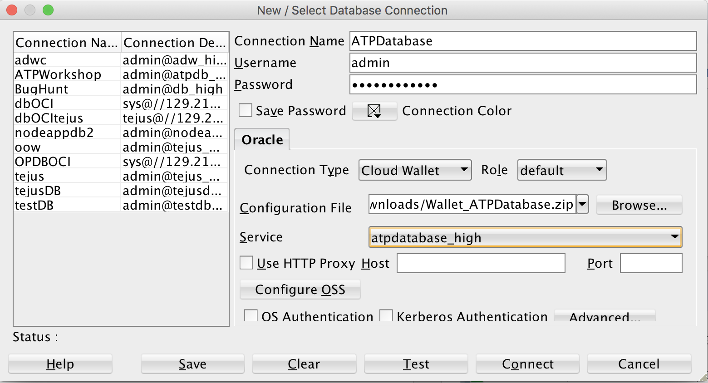

# Lab 200: Secure Connectivity and Data Access

## Introduction

Autonomous Transaction Processing provides all of the performance of the market-leading Oracle Database in an environment that is tuned and optimized for transaction processing workloads. Oracle Autonomous Transaction Processing ( or ATP ) service provisions in a few minutes and requires  very little manual ongoing administration.

In this lab we will configure a secure connection using Oracle SQL Developer.

To **log issues**, click [here](https://github.com/oracle/learning-library/issues/new) to go to the github oracle repository issue submission form.

## Objectives

- Learn how to configure a secure connection using Oracle SQL Developer

## Required Artifacts

- Please ensure you are connected to your cloud account and have provisioned an ATP instance. Refer LabGuide100ProvisionAnATPDatabase.md

## Steps

### **STEP 1: Download the secure connection wallet for your provisioned instance**

- Log into your cloud account using your tenant name, username and password.

- On the ATP console, select your ATP instance provisioned in LabGuide100ProvisionAnATPDatabase.md.

- Click Service Console button and provide username (admin) and password and click on Sign in.

- Once you sign in you will be navigated to ATP overview page

- From the Admin panel, select ‘Download Client Credentials’. Provide a keystore password and download the file to your local machine. You will need this file and keystore password to connect to the database later.

- The credentials zip file contains the encryption wallet, Java keystore and other relevant files to make a secure TLS 1.2 connection to your database from client applications. Store this file in a secure location.

### **STEP 2: Connect to ATP instance using Oracle SQL Developer**

- Launch SQL Developer from tbe desktop and click Add Connection on top left.

- Enter a connection name, username (admin) and password provided at the time of provisioning. Select connection type as ‘Cloud PDB’

- Configuration file is the connection wallet downloaded from ATP console
Enter keystore password provided at the time of wallet download

- Finally, select service name from drop down. Service name is database name followed by suffixes low, medium or high. These suffixes determine degree of parallelism used and are relevant for a DSS workload. For OLTP workloads its safe to select any of them.

- Test your connection and save. You now have a secure connection to your cloud database.
