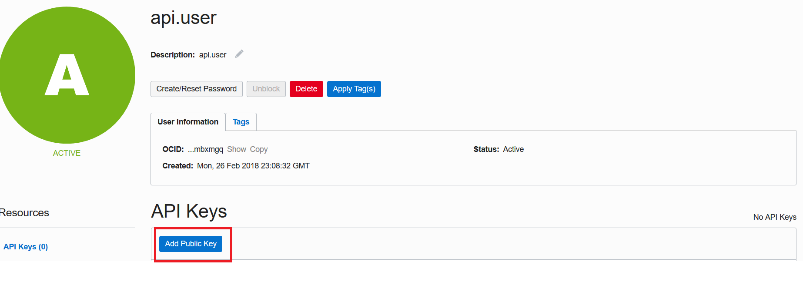
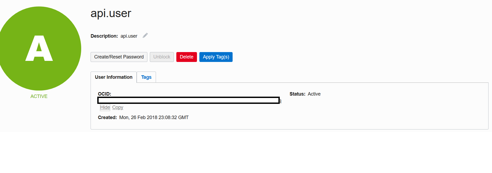

# Lab 700: Working with REST APIs

## Introduction

Oracle's Autonomous Transaction Processing cloud service provides all of the performance of the market-leading Oracle Database in an environment that is tuned and optimized for transaction processing workloads. Oracle Autonomous Transaction Processing ( or ATP ) service provisions in a few minutes and requires very little manual ongoing administration and is therefore ideal for developers to build and test their applications. 

Often times, you would prefer to interact with your cloud services programmatically over REST rather than log into the cloud console and click through screens. Besides, by creating your own deployment and management scripts you can save and reuse your deployments, set gold standards and in fact store entire application infrastructure stacks as version controlled code.

The Oracle Cloud Infrastructure APIs are typical REST APIs that use HTTPS requests and responses and support HTTPS and SSL protocol TLS 1.2, the most secure industry standards.

Also, All Oracle Cloud Infrastructure API requests must be signed for authentication purposes. To create and sign your API requests, you must –
- Form the HTTPS request (SSL protocol TLS 1.2 is required).
- Create the signing string, which is based on parts of the request.
- Create the signature from the signing string, using your private key and the RSASHA256 algorithm.
- Add the resulting signature and other required information to the Authorization header in the request.

While these seem like a lot of steps and can make your curl statements look sick, they are meant to avoid using username/passwords and are based on the draft-cavage-httpsignatures-08 specification for secure communication over the internet.

Let's take a look at how to generate REST calls to the Oracle Cloud Infrastructure using a popular scripting language, node.js. While we are using node.js to build some sample calls to create and list Autonomous Database services, you may use similar concepts to build scripts in Python, Golang, Ruby, Perl, Java, C#, bash or even curl!

To **log issues**, click [here](https://github.com/cloudsolutionhubs/autonomous-transaction-processing/issues/new) to go to the github oracle repository issue submission form.

## Objectives

- Learn how to generate REST calls to the Oracle Cloud Infrastructure using node.js

## Required Artifacts

- The following lab requires an Oracle Public Cloud account. You may use your own cloud account, a cloud account that you obtained through a trial, or a training account whose details were given to you by an Oracle instructor.
- node.js is installed in you local machine. If not you can follow download and installation instructions for your OS [here](https://nodejs.org/en/download/)
- Download [this](https://github.com/kbhanush/ATP-REST-nodejs.git) git repository to a local folder.

## Steps

### **STEP 1: Generate an ssh key pair in pem format**

- Generate a private key

```
openssl genrsa -aes128 -out ~/oci_api_key.pem 2048
```
- Change permission of the key generated

```
chmod go-rwx ~/oci_api_key.pem
```

- Generate a public key using the private key you just created

```
openssl rsa -pubout -in ~/oci_api_key.pem -out ~/oci_api_key_public.pem
```

### **STEP 2: Upload the public key to your OCI account from the console**

- Login to Oracle Cloud Infrastructure
- From top left Hamburger menu, select Identity -> Users


- Pick user from the list of users and on the User page click 'Add API Keys' button.



- Paste your oci_api_key_public.pem key text. The service generates a key Fingerprint. Save the fingerprint somewhere safe since you will need it to sign your API requests.


- Navigate to Identity -> Users and select the user and copy User OCID.



- CLick on account information on top right corner and click on Tenancy.


- Copy Tenancy OCID 


- Tenancy OCID, User OCID, Fingerprint artifacts along with user's private key make up a unique signature that is used to sign the REST requests. 

#### Note: It is extremely important that you do not share this with anyone or expose it over an unencrypted network.


### **STEP 3: Run the scripts you cloned from git**

- In the REST API scripts folder, install node package dependencies

```
npm install
```

- Let us take a look at the code you downloaded from the git repository. 

#### 1. auth.js

This module has all the user auth information used to generate the signature and other header information including compartments.

You will need to edit this file and change the tenancyID, authUserId, keyFingerprint, privateKeyPath and compartments.


#### Note: Make sure the privateKeyPath variable accurately points to the location of your private key file.

Compartments are Oracle’s way of providing isolation among users of a cloud account. Compartments can be created by users, departments, environment types etc and provide	a clear separation among entities that share a single OCI account / tenant.

Before you can create objects in your account, you would need to create a compartment and grant access to the user to that compartment by creating a suitable IAM policy.

Refer to Oracle's [IAM documentation](https://docs.oracle.com/en/cloud/paas/identity-cloud/index.html) to create and enable comartments.


#### 2. region.js

This module lists all the API endpoints for OCI. You do not need to change anything here unless a new service is added or Oracle makes a change to the	URLs (which is less likely).

#### 3. headers.js

This module builds API signing keys and generates https headers required for your REST calls depending upon whether it's a GET, PUT, POST or DELETE call.

You do not need to modify anything here.

It also has an option getUser method used in every REST call to get user information from the Identity and Access Management services. You may use that example to generate other IAM REST calls.

#### 4. createAutonomousDatabase.js, listAutonomousDatabase.js, createVCN.js, getAutonomousDatabase.js, deleteAutonomousDatabase.js

These are the scripts you would need to run. Make sure the variable in each of these scripts are set right before you run them. 

For example, in the createAutonomousDatabase.js script, replace compartmentID, displayName, dbName, adminPassword, cpuCoreCount and dataStorageInTbs to match your requirements.


- Run these scripts as,

```
node <filename>.js
```

- As an example 

```
node createAutonomousDatabase.js
```


- You have successfully created ATP database.

Explore the various scripts provided and build your own instance. You may build similar scripts using Python, Java, golang, Perl, C#, bash and Curl.

