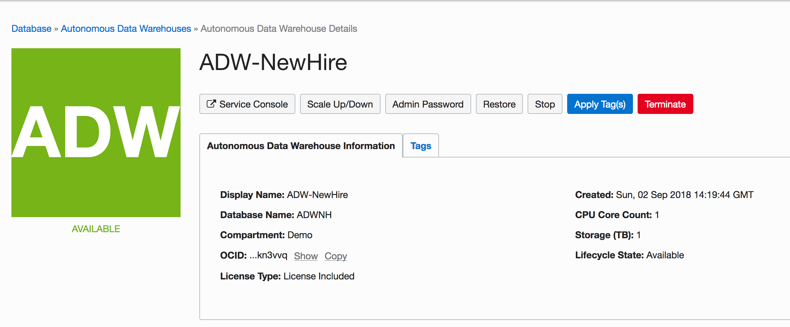
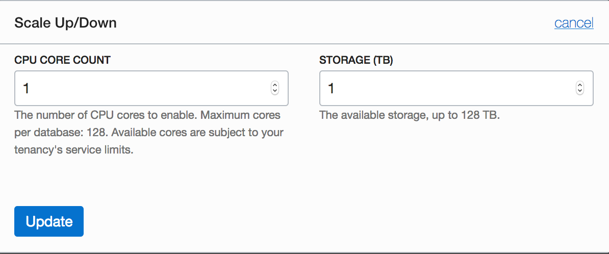
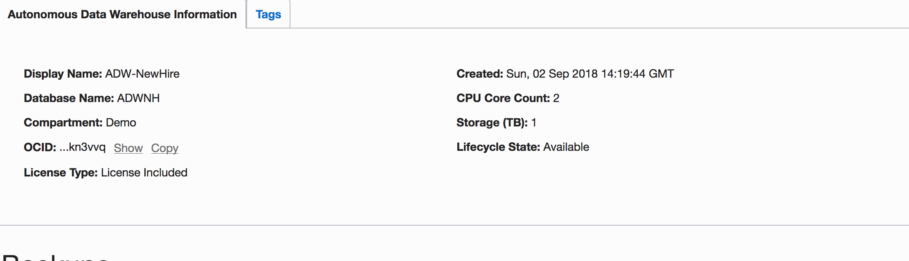

# ADWC Lab 500: Scaling and Performance

## Introduction

In this lab you will scale up your Oracle Autonomous Data Warehouse Cloud (ADWC) service to have more CPUs and Storage.

To **log issues**, click [here](https://github.com/oracle/learning-library/issues/new) to go to the github oracle repository issue submission form.

## Objectives

-   Learn how to scale up an ADWC service

-   Understand the performance and concurrency impacts of scaling the ADWC service online

## Required Artifacts

-   The following lab requires an Oracle Public Cloud account. You may use your own cloud account, a cloud account that you obtained through a trial, or a training account whose details were given to you by an Oracle instructor.

# Scaling and Performance Hands-on Lab

## Steps

### STEP 1: Scaling your ADWC instance

-   Go back to the Cloud Console you used during the provisioning exercise and open the Instances screen. Click **Scale UP/Down**.

-   Fill in the form with the following information.

    -   **Type of change:** Scale Up

    -   **CPU core count change:** 2

    -   **Storage capacity change:** 1

Click **Update** after filling in the details, this will take you the Instances screen.

> **Note** The applications can continue running during the scale operation without downtime.

- You can confirm the new number of CPUs in Autonomous Data warehouse Information page.

