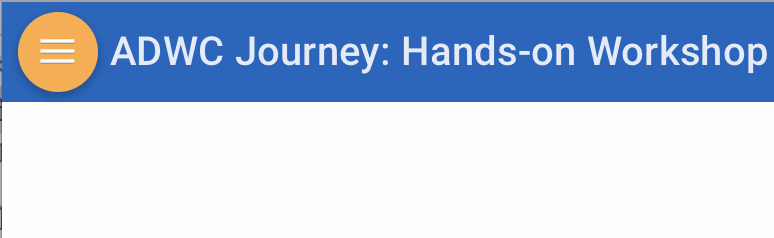

# ADWC Journey: Hands-On Test Drive Workshop
This workshop walks you through all the steps to get started using the **Oracle Autonomous Data Warehouse Cloud (ADWC)**. You will provision a new ADWC database, load data from the object store and troubleshoot data loads, scale an ADWC instance, use Oracle Machine Learning notebooks and connect database to Data Visualization.

## Goals

 - Get comfortable with Oracle's public cloud services
 - Provision a new ADWC database
 - Run sample queries against the sample data sets
 - Load data from the object store
 - Scale an ADWC instance
 - Use Oracle Machine Learning notebooks
 - Use Oracle Data Visualization Desktop (DVD) with ADWC
 - Use Oracle Data Visualization (OAAC) with ADWC
 - Use Oracle Data Integration Platform Cloud (DIPC) with ADWC
 

## To Learn More
 - [Oracle Autonomous Data Warehouse Cloud website](https://www.oracle.com/database/data-warehouse/index.html)
 - [Oracle Autonomous Data Warehouse Cloud ipaper](http://www.oracle.com/us/products/database/autonomous-dw-cloud-ipaper-3938921.pdf)
 - [Oracle Autonomous Data Warehouse Cloud Documentation](https://docs.oracle.com/en/cloud/paas/autonomous-data-warehouse-cloud/index.html)
 - [Additional Autonomous Data Warehouse Cloud Tutorials](https://docs.oracle.com/en/cloud/paas/autonomous-data-warehouse-cloud/tutorials.html)
 
      
## How to View the Lab Guides

- The Labguides are best viewed using the Workshop's [GitHub Pages Website URL](https://oracle.github.io/learning-library/workshops/adw-journey/) 

- Once you are viewing the Workshop's GitHub Pages website, you can see a list of Lab Guides at any time by clicking on the **Menu Icon**

      

- To **log issues**, click [here](https://github.com/oracle/learning-library/tree/master/workshops/journey3-data-science) to go to the github oracle repository issue submission form.

# Workshop Details

## Lab 100: Provisioning and Connecting

**Documentation**: [LabGuide100ProvisioningGettingStarted.md](LabGuide100ProvisioningGettingStarted.md)

**Objectives**:

- Learn how to sign-in to the Oracle Public Cloud
- Learn how to provision a new ADWC database
- Learn how to download the client credentials wallet file
- Learn how to connect from Oracle SQL Developer

## Lab 200: Working with Database Services and Sample Data Sets

**Documentation**: [LabGuide200DatabaseServiceSampleDatasets.md](LabGuide200DatabaseServiceSampleDatasets.md)

**Objectives**:

- Learn about the different levels of ADWC database service (HIGH, MEDIUM, LOW)
- Learn about the Star Schema Benchmark (SSB) and Sales History (SH) sample data sets
- See how the different levels of database service affect performance and concurrency

## Lab 300: Data Loading

**Documentation**: [LabGuide300DataLoading.md](LabGuide300DataLoading.md)

**Objectives**:

- Learn how to upload files to the Oracle Cloud Innfrastructure (OCI) Object Storage
- Learn how to load data from an object store
- Learn how to use the SQL Developer Data Import Wizard to load data
- Learn how to troubleshoot data loads
 

## Lab 400: Scaling and Performance in ADWC

**Documentation**:  [LabGuide400ScalingPerformance.md](LabGuide400ScalingPerformance.md)

**Objectives**:

- Learn how to scale up and down the ADWC instance
- See how scaling affects ADWC concurrency and performance

## Lab 500: Oracle Machine Learning Notebooks

**Documentation**: [LabGuide500OracleMachineLearning.md](LabGuide500OracleMachineLearning.md)

**Objectives**:

- Learn how to create OML Users
- Learn how to run a SQL Statement
- Learn how to share notebooks
- Learn how to create and run SQL scripts

## Lab 600: Basic Machine Learning (DBMS_PREDICTIVE_ANALYTICS)

**Documentation**: [LabGuide600OracleDatabaseML.md](LabGuide600OracleDatabaseML.md)

**Objectives**:

- Learn how to import notebooks into Oracle ML Notebook
- Learn how to use DBMS_PREDICTIVE_ANALYTICS routines
- Learn how to use Oracle ML Gallery

## Lab 700: Create Data Visualizations from ADWC

**Documentation**: [LabGuide700DataVisualization.md](LabGuide700DataVisualization.md)

**Objectives**:

- Learn how to connect a desktop analytics tool to Autonomous Data Warehouse
- Learn how to secure a desktop client connection to Autonomous Data Warehouse
- Learn how to create a simple data visualization project with Oracle Data Visualization Desktop
- Learn how to access and gain insights from data in the Autonomous Data Warehouse

## Lab 700-2: Create Data Visualizations from Oracle Autonomous Analytics

**Documentation**: [LabGuide700-2(OAAC).md](LabGuide700-2(OAAC).md)

**Objectives**:

- Learn how to connect a autonomous analytics tool to the powerful Autonomous Data Warehouse 
- Learn how to create a simple data visualization project with Oracle Autonomous Analytics
- Learn how to access and gain insights from data in the Autonomous Data Warehouse

## Lab 800: Integrating with ADWC

**Documentation**: [LabGuideDIPC.md](LabGuideDIPC.md)

**Objectives**:

- Learn how to load data to ADWCS with Oracle Data Integrator (ODI)
- Learn how to replicate data to ADWCS with Oracle GoldenGate (OGG)
- Learn how to review data quality in ADWCS with Oracle Enterprise Data Quality (EDQ)
